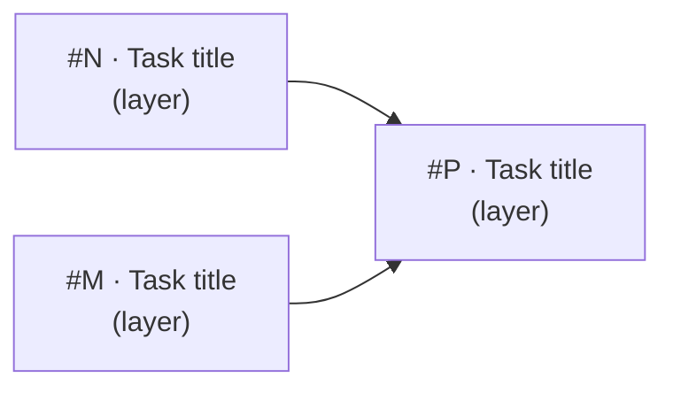

# Architect — Batch Design Artefact Generator

Reads a plan file and produces the design artefacts needed for each item, so `/feature` can implement against approved designs.

**Model:** Use Opus (the latest Claude model) for this skill and all sub-agents it spawns. When launching agents, pass `model: "opus"`.

**Usage:**

- `/architect` — reads the most recent plan in `docs/plans/`, processes all epics
- `/architect docs/plans/2026-03-29-mvp-phase2-plan.md` — reads a specific plan, processes all epics
- `/architect --epics E2,E3` — processes only epics in Phases 2 and 3
- `/architect --epics E2.1,E2.3,E3.1` — processes only the listed epics
- `/architect docs/plans/plan.md --epics E4` — specific plan, only Phase 4 epics
- `/architect review <issue-number>` — reviews existing design for an issue (see Review mode below)

### Epic filter syntax

The `--epics` flag accepts a comma-separated list of epic identifiers. Two forms:

- **Phase-level:** `E2` matches all epics in Phase 2 (E2.1, E2.2, E2.3, etc.)
- **Individual:** `E2.1` matches only that specific epic

Examples:
- `--epics E2` → E2.1, E2.2, E2.3
- `--epics E2,E3` → all epics in Phases 2 and 3
- `--epics E2.1,E3.3` → only E2.1 and E3.3
- `--epics E2,E3.1` → all of Phase 2 plus E3.1

When `--epics` is omitted, all epics in the plan are processed.

---

## Review Mode

If `$ARGUMENTS` starts with `review`, extract the issue number and run the review process instead of the creation process.

**Purpose:** Audit an existing design before handing off to `/feature`. Catches stale references, gaps in contract detail, and contradictions introduced since the design was written.

### Review Step 1: Read the issue and its design artefacts

Run `gh issue view <number>` to get the issue body. Then read all linked artefacts:

- LLD sections referenced in the issue body (`docs/design/`)
- ADRs referenced (`docs/adr/`)
- Requirements (`docs/requirements/`)
- Relevant source files in `src/` — compare actual file paths and patterns against what the LLD specifies

### Review Step 2: Assess design health

Check each of the following and note findings:

| Check | What to look for |
|-------|-----------------|
| **Stale file paths** | LLD references files that have been moved, renamed, or deleted |
| **Pattern drift** | Codebase has adopted new patterns (e.g. `ApiContext`, new auth helpers) that the LLD predates |
| **ADR conflicts** | Design contradicts a decision recorded in `docs/adr/` after the design was written |
| **Thin contracts** | Function signatures, types, or internal decomposition are vague or missing — would block a `/feature` agent |
| **Missing BDD specs** | No `describe`/`it` blocks for an agent to implement against |
| **Uncovered acceptance criteria** | Acceptance criteria in the issue have no corresponding design detail |
| **Missing behavioural flows** | Multi-component interactions lack sequence diagrams — reviewer cannot build theory from text alone |
| **Missing structural overview** | Task introduces/modifies module boundaries but has no structural diagram showing dependencies |
| **Unverifiable invariants** | Constraints listed without a verification method (test, type check, grep), or invariants scattered inline instead of collected in the Invariants table |

### Review Step 3: Report and optionally patch

Present a concise health report:

```
## Design health — #<issue>: <title>

### Findings
| # | Severity | Check | Detail |
|---|----------|-------|--------|
| 1 | High/Med/Low | <check> | <what's wrong and where> |

### Verdict
Ready for /feature | Needs patches before /feature
```

Severity guide: **High** = would cause a `/feature` agent to implement incorrectly or get stuck. **Med** = gap or ambiguity that needs resolving. **Low** = minor stale reference, cosmetic.

If there are High or Med findings, offer to patch the affected docs in place. **Wait for user confirmation before making any changes.**

After patching, commit:

```bash
git add <specific-files>
git commit -m "docs: design health patch for #<issue> — <summary>"
```

**Stop after the report (and any approved patches).** Do not proceed to the creation process.

---

## Decision Logic

For each item in the plan, determine the artefact type:

| Item type | Repo artefact (source of truth) | Issue update |
|-----------|--------------------------------|--------------|
| Cross-cutting decision (new technology, convention) | ADR in `docs/adr/` via `/create-adr` | Reference ADR |
| Implementation item with contracts | LLD section in `docs/design/` | Reference LLD section |
| Design doc update (existing doc needs correction) | Edit to existing `docs/design/` file | Reference updated section |
| Simple bug fix (already covered by existing LLD) | None needed | Add BDD specs, reference existing LLD |
| Small feature (no existing LLD coverage) | LLD section for the item | Reference LLD section |

## Process

Execute these steps sequentially.

### Step 1: Read the plan, parse epic filter, and check existing state

**Parse arguments.** Scan `$ARGUMENTS` for:

1. **A file path** — if present, use it as the input file. Otherwise find the most recent `docs/plans/*.md` file by modification date.
2. **Input detection.** The input may be either a plan file (`docs/plans/`) or a requirements document (`docs/requirements/`). If it is a requirements document, treat each epic and its stories as the work items to design — extract epics, stories, priorities, and acceptance criteria the same way you would from a plan. The `--epics` filter works identically (filter by epic number). Skip `/kickoff`-specific concerns (HLD creation, ADR discovery, phase sequencing) — the requirements doc is the authority for scope. See ADR-0022 for the tiered process rationale.
3. **`--epics` flag** — if present, extract the comma-separated list of epic identifiers. Parse each:
   - Phase-level (e.g. `E2`) — expand to all epics matching `E2.*` in the plan.
   - Individual (e.g. `E2.1`) — match that exact epic.
   - Store the resolved set of epic identifiers (e.g. `{E2.1, E2.2, E2.3, E3.1}`).
4. If `--epics` is not provided, all epics in the plan are in scope.

**Read the input file fully.** Extract the list of epics with their priorities, dependencies, and design needs. **Filter to only the in-scope epics.** Report which epics are in scope and which are being skipped.

**Consume kickoff's parallelisation map (if present).** If the plan was produced by `/kickoff`, it includes a `Parallelisation Map` section and per-epic `Owns (components)` / `Touches (components)` / `Parallelisable with` fields. Treat these as the upstream claim about epic-level parallelism — useful when planning waves across multiple epics in scope. File-level analysis in Step 2 may **refine or contradict** kickoff's claim once actual file paths are known. If you contradict it (e.g. two epics kickoff marked parallel-safe both write to the same migration file), call this out in the Step 2 summary and the Step 7 report so the plan can be patched.

**Before creating anything**, check what already exists:

1. **Issues:** Run `gh issue list --state open --limit 100` to see all open issues. Do not create issues that already exist.
2. **Design docs:** Check `docs/design/`, `docs/adr/`, and `docs/requirements/` for existing coverage of each item.
3. **Source of truth rule:** Design detail must live in version-controlled repo docs (`docs/design/`, `docs/adr/`, `docs/requirements/`), not only in GitHub issue bodies. Issue bodies should reference repo docs, not replace them. If an item has detail only in an issue body, it needs a repo doc artefact (LLD section, design doc update, or requirements update).
4. **Issue structure check:** For each existing issue that this run will enrich or create tasks for, run `gh issue view <number> --json labels,title` and check:
   - If the issue contains **multiple stories** (i.e. the decomposition assessment in Step 2b will produce ≥ 2 task issues), the issue must carry the `epic` label. If it does not, flag this in the Step 2 summary table under a "Label fix needed" column and correct it before producing any artefacts — use `gh issue edit <number> --add-label "epic" --remove-label "kind:task"` and update the title to `epic: <name>` format.
   - If the issue is a single-task item, it should carry `kind:task` and have a `## Parent epic` section. If no parent epic exists, flag it and ask the user whether to create one or proceed without.
   - **Never enrich a multi-story issue without first fixing its label.** Enriching a `kind:task` issue with story tables creates the exact structural inconsistency this check is designed to prevent.

### Step 2: Analyse and present overview

For each in-scope epic, determine:

1. **Artefact type** — which row in the decision logic table applies.
2. **Input sources** — what files, issues, or design docs to read.
3. **Output** — what artefact will be produced and where.
4. **Decomposition** — see Step 2b below.

Present a summary table to the user:

```
| # | Epic | Artefact type | Output path | Depends on | Split? |
|---|------|---------------|-------------|------------|--------|
```

Include a preliminary execution waves proposal below the table:

```
### Proposed execution waves

| Wave | Items | Blocked by | Notes |
|------|-------|------------|-------|
| 1 | #1, #2 | — | Parallelisable |
| 2 | #3 | Wave 1 (#1) | |
```

Include a Mermaid dependency graph below the waves table:



Nodes use the format `#<issue> · <short title>\n(<layer>)`. Dashed arrows (`-.->` with label) indicate soft coupling such as a shared migration. Nodes that have no incoming arrows are parallelisable from the start. Add a plain-English summary below the diagram stating which tasks can start immediately in parallel and which must be sequential.

**Hard rule — shared files force sequential waves:** Any two tasks that both write to the same source file (e.g. `tables.sql`, `functions.sql`, any shared migration) must be placed in different waves, even if their logical coupling is soft. Parallel PRs on the same file always produce a merge conflict. Encode this as a solid arrow in the dependency graph, not a dashed one.

**Wait for user confirmation** before producing artefacts. The user may re-prioritise, skip items, redirect artefact types, adjust wave assignments, or reject a proposed split.

### Step 2b: Decomposition assessment

For each epic, assess whether it should be split into multiple task issues. The bar is high — splitting has overhead (extra issues, PRs, dependency tracking) and should only happen when there is clear rationale.

**Split if and only if both conditions hold:**

1. **Size** — estimated **total PR diff** exceeds 200 lines (production code + tests + fixtures + types). Rule of thumb: production code is ~30% of the total diff when following TDD with fixtures, so ~70 lines of production code ≈ 200-line PR. If you estimate 150 lines of production code, the PR will likely be 400–500 lines — that needs splitting.
2. **Natural seam** — there is an independently testable or independently deployable unit that does not share files with the remainder.

If only one condition holds (large but no clean seam, or clean seam but small), do **not** split. However, if the size vastly exceeds the limit (e.g. 3×+), prioritise splitting even if seams are imperfect — large PRs are harder to review than slightly awkward boundaries.

When a split is warranted, propose the task issues with explicit dependency order (A completes → B starts) and note which files each task touches. Tasks that do not share files and have no dependency can be assigned to the same execution wave for parallel implementation. Add the proposed split to the summary table and explain the rationale briefly. The user confirms or rejects before any issues are created.

### Step 3: Read all input sources

For each in-scope epic, read:

- Referenced GitHub issues: `gh issue view <number>`
- Referenced design docs in `docs/design/`
- Referenced ADRs in `docs/adr/`
- Relevant source files in `src/`
- Requirements in `docs/requirements/`

Read broadly — understanding the full context prevents design artefacts that contradict existing decisions.

### Step 4: Produce artefacts

Process epics in the order listed in the plan. For each epic:

#### Task issues (if decomposition was approved)

Create task issues for any approved splits using the shared creation script:

```bash
BODY=$(cat <<'EOF'
## Parent epic
#<epic-number>

## Design reference
docs/design/lld-<epic-slug>.md

## Acceptance criteria
- [ ] ...

## BDD specs
```
describe('...')
  it('...')
```
EOF
)
RESULT=$(./scripts/gh-create-issue.sh \
  --title "<task title>" \
  --body "$BODY" \
  --labels "<phase-label>,<area-label>,kind:task" \
  --add-to-board)
# RESULT is "created:<number>" or "exists:<number>"
```

Update the epic body with:
1. A task checklist linking all created issues (`- [ ] #N — <title>`).
2. A `## Dependency graph` section containing the finalised Mermaid diagram (with real issue numbers substituted) and the plain-English parallelism summary.

#### ADR (cross-cutting decision)

Use `/create-adr` to produce the ADR. Provide the context, options, and recommended decision based on what the plan says and what you read in Step 3.

#### LLD (implementation item with contracts)

Follow the LLD template from `/lld` (Part A + Part B structure):

**Part A (human-reviewable):**
- Purpose — what this epic delivers
- Behavioural flows — mermaid sequence diagrams for multi-component interactions
- Structural overview — mermaid class/module diagram when introducing or modifying module boundaries
- Invariants — hard constraints with verification methods, collected in a table
- Acceptance criteria + BDD specs

**Part B (agent-implementable):**
- Identify layers (DB / BE / FE)
- Reference HLD sections — do not duplicate
- Add implementation-level detail: file paths, internal types, function signatures
- **API route internal decomposition is mandatory** — every API route LLD must include an explicit internal decomposition section specifying the controller/service split. The pattern is:
  - Controller (route.ts, ≤ 5 lines): calls `createApiContext(request)`, validates body, delegates to service
  - Service (service.ts): receives `ApiContext`, performs auth checks via `ctx.supabase`, writes via `ctx.adminSupabase`
  - Constraint: service never calls `createClient()` or any infrastructure factory — `ApiContext` is injected by the controller
  - See the LLD template's "Internal decomposition" section for the full pattern
- Include internal decomposition for non-trivial components
- Write BDD specs and acceptance criteria
- Append tasks sized for single `/feature` cycles (< 200 lines total PR diff — estimate tests + fixtures at ~2–3× production code)

**File naming:** `docs/design/lld-<epic-slug>.md` — one LLD per epic. The `<epic-slug>` is derived from the epic identifier (e.g. `e21` for E2.1, `e1` for E1).

If the file exists, update it. If not, create it.

#### Design doc update

Edit the existing design doc directly. Add a change log entry at the top noting the date and reason.

#### Enriched issue body

Update the GitHub issue (epic or task) with:

- **Fix approach** — specific files and functions to change
- **Affected files** — paths with line numbers where relevant
- **Acceptance criteria** — concrete, testable
- **BDD specs** — `describe`/`it` blocks the `/feature` skill can use directly
- **Design reference** — path to the LLD file

```bash
gh issue edit <number> --body "$(cat <<'EOF'
[enriched body content]
EOF
)"
```

### Step 5: Commit each artefact

After producing each artefact, commit it individually:

```bash
git add <specific-files>
git commit -m "docs: design for #<issue> — <summary>"
```

One commit per item for granular review. Do not batch.

### Step 6: Write session log

Follow `.claude/skills/shared/session-log.md`. Use `<skill>=architect` and a `<slug>` identifying the epics or plan sections processed (e.g. `architect-e11-e17`).

### Step 7: Report

After all in-scope epics are processed, summarise:

- **Scope** — which epics were processed (and which were filtered out)
- What was produced (table of epics and their artefacts)
- **Execution waves** — final wave assignments showing which items can be implemented in parallel by `/feature-team`
- **Parallelism refinements vs. kickoff's map (if any)** — list any epic pairs kickoff marked `Parallelisable with` that file-level analysis revealed as conflicting (and the converse: pairs serialised in the plan that LLDs prove are actually parallel-safe). Recommend a plan patch where appropriate.
- Any items skipped and why
- Any open questions or ambiguities found during design
- Suggested next step: human reviews the artefacts, then `/feature` or `/feature-team` implements

**Stop here.** The user reviews all artefacts before implementation begins.

## Guidelines

- **Do not implement.** This skill produces design artefacts only — no production code.
- **Do not invent requirements.** If the plan is ambiguous, flag it and ask rather than assuming.
- **Reference, do not duplicate.** Link to existing design docs and ADRs rather than restating them.
- **British English** in all documentation.
- **Keep artefacts proportional.** A one-line bug fix with existing LLD coverage needs only BDD specs in the issue. A small feature without LLD coverage needs an LLD section. Do not over-engineer the design for trivial items.
- **Respect existing decisions.** Read ADRs before proposing new ones — the decision may already be recorded.
- **Repo docs are source of truth.** GitHub issue bodies are convenient but not version-controlled. Every item that `/feature` will implement must have its design detail (fix approach, BDD specs, acceptance criteria) traceable to a file in `docs/`. Issue bodies reference these docs — they do not replace them.
- **Check before creating.** Always check for existing issues and design docs before creating new ones. Duplicate artefacts cause confusion.
- **API route items always get internal decomposition.** If a plan item involves an API route, the LLD section must include an explicit internal decomposition (controller/service split with `createApiContext` + `ApiContext` injection). Without this, `/feature` agents miss the established pattern and produce routes that call auth helpers and infrastructure factories directly. See `src/lib/api/context.ts` for the composition root and any existing `service.ts` file under `src/app/api/` for the pattern.
- **MCP tool handlers stay thin.** Tool handlers should parse inputs, delegate to a service function, and return. Business logic, store calls, and embedding work belong in services or store wrappers — not in the handler body. The LLD for any new tool must name the handler, the service function it delegates to, and the store/embedding boundaries it crosses.
- **One LLD per epic.** Each epic gets a single LLD file (`lld-<epic-slug>.md`). Tasks within the epic are sections of that LLD, not separate files.
