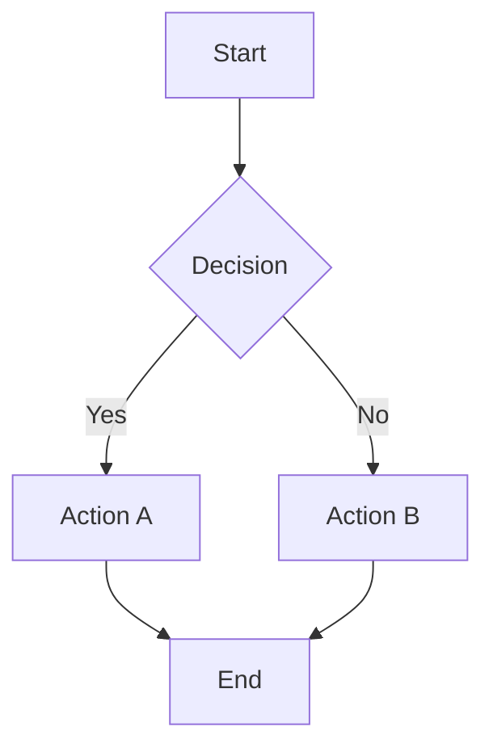
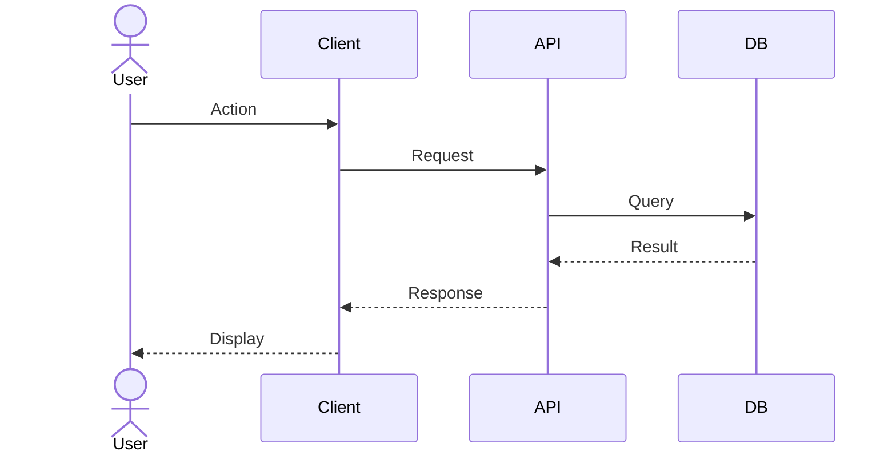
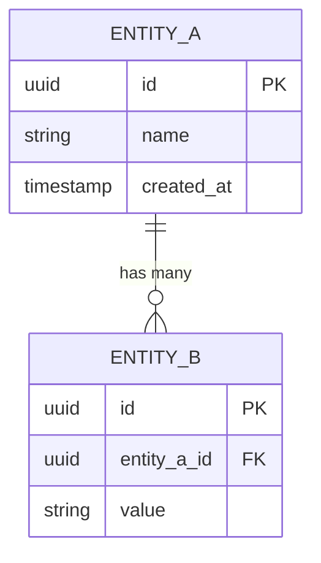
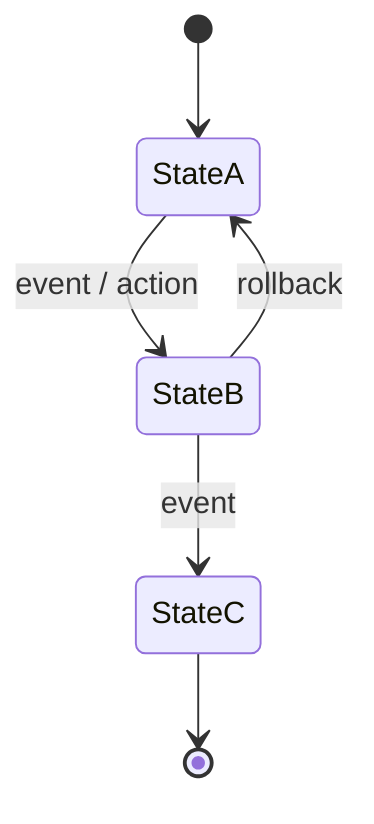
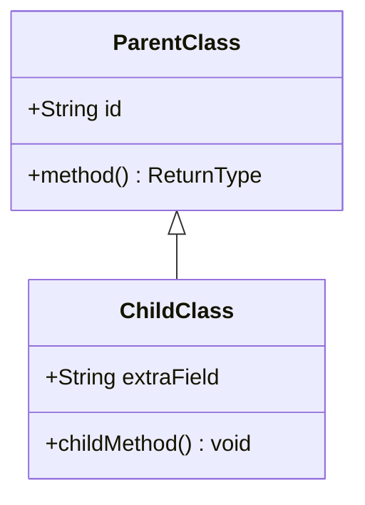

# Create Mermaid Diagram

## Process

1. **Understand the subject**: Identify what is being diagrammed — read relevant docs, ADRs, or design files if needed
2. **Choose the right diagram type**: Select the most appropriate Mermaid diagram type (see types below)
3. **Draft the diagram**: Write the Mermaid syntax
4. **Embed or save**: Either embed inline in the target document or create a standalone `.md` file in `docs/design/`

## Diagram Types

| Type | Syntax keyword | Use for |
|------|---------------|---------|
| Flowchart | `flowchart LR` / `flowchart TD` | Processes, decision trees, pipelines |
| Sequence | `sequenceDiagram` | Actor interactions, API call flows, auth flows |
| Entity-Relationship | `erDiagram` | Data models, schema relationships |
| State Machine | `stateDiagram-v2` | Object lifecycle, status transitions |
| Class | `classDiagram` | OOP structures, type hierarchies |
| C4 Context | `C4Context` | System context and container views |
| Gantt | `gantt` | Project timelines, phase planning |
| Mindmap | `mindmap` | Feature trees, concept maps |

## Templates

### Flowchart

### Sequence Diagram

### ER Diagram

### State Machine

### Class Diagram

## Guidelines

- **Orientation**: Use `TD` (top-down) for hierarchies and pipelines; `LR` (left-right) for flows with many parallel paths.
- **Labels**: Keep node labels short. Put detail in surrounding prose, not inside the diagram.
- **Styling**: Add `classDef` and `class` statements to highlight critical paths or error states when it aids clarity.
- **Accuracy over completeness**: A diagram that shows the key relationships clearly is better than one that tries to show everything. Omit noise.
- **Standalone files**: If the diagram is significant enough to be referenced from multiple documents, save it as `docs/design/TOPIC-diagram.md` with a brief prose explanation above the code block.
- **Inline embedding**: For diagrams tied to a single document (e.g., an ADR or design doc), embed the Mermaid block directly in that file.
- **Validate syntax**: Mermaid is strict about indentation and special characters in labels — wrap labels containing punctuation or spaces in quotes (`"label text"`).
