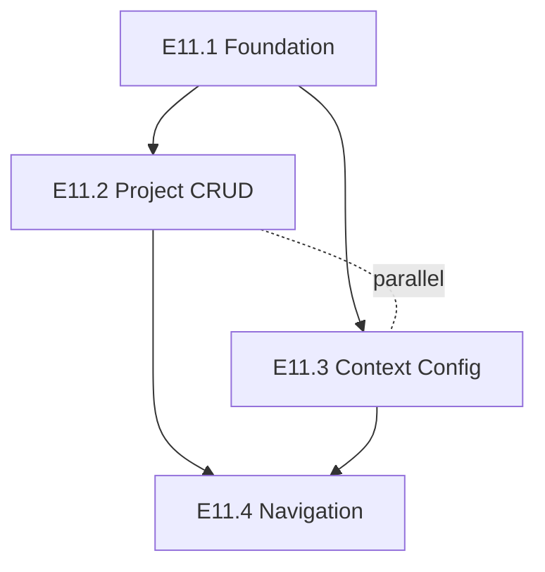

# Kickoff — Version Bootstrap

Takes a versioned requirements document (`docs/requirements/<version>-requirements.md`)
and produces the design artefacts needed before `/architect` can generate
LLDs and `/feature` can implement. Owns Levels 1–3 of the design-down
process at version-wide scope.

The unit of delivery is the **epic** (ADR-0018). This skill produces a
plan that sequences epics and creates one GitHub issue per epic. It does
**not** produce per-task issues — `/architect` handles task breakdown
within each epic.

See [ADR-0021](../../../docs/adr/0021-project-bootstrap-pipeline.md) for
the pipeline rationale and [ADR-0018](../../../docs/adr/0018-epic-task-organisation.md)
for the epic model.

**Model:** Use Opus for this skill and any sub-agents. Pass `model: "opus"`
when launching agents.

## Usage

- `/kickoff` — reads the most recent file in `docs/requirements/`
- `/kickoff docs/requirements/v11-requirements.md` — reads a specific file

## Bootstrap modes

The skill detects mode from existing artefacts and adapts.

| Mode | Trigger | HLD | CLAUDE.md | First epic on board |
|---|---|---|---|---|
| **Initial** (v1) | No `docs/design/v*-design.md` exists | Full HLD | Fill template blocks | Yes |
| **Major-version delta** (v2, v11, …) | Prior-version HLD exists | Delta HLD referencing prior | Skip (only update if new ADRs invalidate a block) | Yes |

In both modes the plan is epic-shaped, ADRs are reviewed individually,
and drift scans gate progression.

## Inputs and outputs

**Inputs**

- `docs/requirements/<version>-requirements.md` — the version's requirements
- `docs/design/v*-design.md` — prior-version HLDs (delta mode only)
- `docs/adr/` — existing ADRs (do not contradict)
- `CLAUDE.md` — project conventions to preserve

**Outputs (in order)**

1. `docs/design/<version>-design.md` — HLD (full for initial, delta for major-version)
2. `docs/adr/NNNN-*.md` — one ADR per load-bearing decision
3. `docs/plans/YYYY-MM-DD-<version>-implementation-plan.md` — epic-shaped plan
4. GitHub epic issues with `version:<slug>` label and HLD/ADR cross-references
5. (Initial mode only) `CLAUDE.md` filled in with stack, verification commands, structure

`<version>` is derived from the requirements filename: `v11-requirements.md` → `v11`.
If the filename does not match `<version>-requirements.md`, stop and ask the user.

## Human gates

Three mandatory stop points. Do not proceed past any gate without explicit user approval.

1. **After orientation summary (Step 1)** — confirm detected mode, version,
   and proposed scope before any artefact is written
2. **After HLD + drift-scan 1 (Step 3)** — coverage matrix reviewed, HLD patched if needed
3. **After plan + drift-scan 2 (Step 6)** — coverage matrix reviewed, plan patched if needed

Plus a per-ADR gate inside Step 4 (one ADR drafted, committed, approved, then the next).

## Process

Use `TodoWrite` to track progress.

### Step 1: Read inputs and orient

1. Resolve the requirements file: `$ARGUMENTS` if a path was supplied,
   otherwise the most recent `docs/requirements/*.md` by mtime.
2. Derive `<version>` from the filename (`<version>-requirements.md`).
   Stop and ask if the pattern doesn't match.
3. Read the requirements file fully. Extract user stories, acceptance
   criteria, non-functional constraints, explicit non-goals, and any
   technology choices already locked in.
4. List existing artefacts:
   - `docs/adr/` — read load-bearing ones; do not re-decide
   - `docs/design/v*-design.md` — read all for delta-mode context
   - `docs/plans/` — note what exists
   - `CLAUDE.md` — note current conventions
5. **Detect mode:**
   - No `docs/design/v*-design.md` exists → **initial bootstrap**
   - One or more prior `v*-design.md` exists → **major-version delta**
   - `docs/design/<version>-design.md` already exists → ask user if this is
     a rewrite (otherwise abort)
6. Present a short orientation summary: detected version, mode,
   requirement count, load-bearing-ADR candidates spotted, prior artefacts
   to be referenced. **Wait for user confirmation.**

### Step 2: Draft the HLD

Produce `docs/design/<version>-design.md`.

**Initial mode** — full HLD with three levels:

- **Level 1 — Capabilities.** One short paragraph per capability, named at
  system level. No components, no technology. Cross-check every requirement
  has at least one capability. Flag uncovered requirements — that is where
  AI bias toward novel problems shows up.
- **Level 2 — Components.** Name, purpose, responsibilities (3–6 bullets),
  **non-responsibilities** (the single most valuable section for catching
  boundary errors later), depends-on. Include a Mermaid component diagram.
  Keep it abstract — "GitHub adapter", not "Octokit 22.1.0".
- **Level 3 — Interactions.** Mermaid sequence diagrams for the top 3–5
  flows: primary happy path, primary error path, any flow crossing a trust
  boundary. Each diagram gets a short prose walkthrough naming contracts
  to be pinned at Level 4 (don't specify them here).

**Delta mode** — thin delta document referencing the prior HLD by anchor.
Cover only what changes in `<version>`:

- Capabilities added or reshaped
- New components and the non-responsibilities that pin their boundaries
- Sequence diagrams only for flows that change
- Reference unchanged areas: `See [v1 HLD §<anchor>](v1-design.md#<anchor>)`

Target length for delta: under 300 lines.

Commit:

```bash
git add docs/design/<version>-design.md
git commit -m "docs: HLD <version> — capabilities, components, interactions"
```

### Step 3: Gate 1 — drift scan and review

Run the `requirements-design-drift` agent against the requirements doc and
the new HLD. The agent emits a coverage matrix mapping every requirement
to a capability and component.

Present the matrix. Flag:

- **Uncovered requirements** — critical, AI-bias signal
- **Over-covered requirements** — spec bloat
- **Components with no requirement** — scope creep

**Stop. Wait for user approval.** Apply patches and re-run the scan as
many times as needed.

### Step 4: Propose and draft load-bearing ADRs

From the HLD, identify load-bearing decisions — those that shape multiple
components or constrain future choices. Typical categories:

- Tenant model and security boundary
- Runtime / hosting / primary datastore
- Authentication and authorisation, role model
- External service integration pattern
- Test strategy
- Observability
- Any framework choice spanning multiple components

Present the proposed ADR list with one-line rationales. **Wait for the
user to confirm the list** before drafting any ADR.

For each confirmed ADR:

1. Use `/create-adr` to draft. Follow the project's ADR format and
   numbering (next free number in `docs/adr/`).
2. Commit:
   ```bash
   git add docs/adr/NNNN-*.md
   git commit -m "docs: ADR-NNNN <title>"
   ```
3. **Stop. Wait for user approval before drafting the next ADR.**

Do not draft ADRs for non-load-bearing decisions. Those belong in LLDs
produced later by `/architect`.

### Step 5: Draft the epic-shaped plan

Produce `docs/plans/YYYY-MM-DD-<version>-implementation-plan.md`. The plan
sequences epics within the version, derived from the HLD.

Per ADR-0018, **epics are the unit of work — not phases**. The plan
contains 3–6 epics for the version with explicit ordering.

Required structure:

```markdown
# <version> Implementation Plan

**Date:** YYYY-MM-DD
**Version:** <version>
**HLD:** docs/design/<version>-design.md
**Related ADRs:** ADR-NNNN, ADR-MMMM

## Overview
<2–3 sentences naming what this version delivers and why now.>

## Out of Scope
<Pulled from requirements Non-Goals.>

## Epics

### Epic E<n>.1 — <name>
- **HLD anchor:** <link to capability or component section>
- **Scope:** <one-sentence what>
- **Owns (components):** <component names from the HLD this epic creates or substantially modifies>
- **Touches (components):** <components this epic reads or lightly extends without owning>
- **Depends on:** <none | E<n>.0>
- **Parallelisable with:** <epic IDs that can be worked concurrently — i.e. disjoint Owns sets and no hard dependency>
- **Rough task shape:** <bullet list of expected tasks — /architect will turn these into LLDs and task issues>
- **Exit criteria:** <observable signal that this epic is done>

### Epic E<n>.2 — <name>
…

## Parallelisation Map

Mermaid graph showing dependencies (solid arrows) and parallel-safe groups
(dashed boxes). Two epics are parallel-safe when their `Owns` sets are
disjoint and neither depends on the other.



Recommendation for the human running `/feature-team`: the `parallel-safe`
groups are candidate batches. File-level conflict analysis happens later
in `/architect` and may further constrain ordering once tasks are known.
```

Numbering: use `E<version-number>.<sequence>` (e.g. `E11.1`, `E11.2`) so
epic IDs are stable across versions.

Commit:

```bash
git add docs/plans/YYYY-MM-DD-<version>-implementation-plan.md
git commit -m "docs: <version> implementation plan"
```

### Step 6: Gate 2 — second drift scan and review

Run `requirements-design-drift` again, this time checking that the plan's
epics cover the HLD (and transitively the requirements). Present the
matrix.

**Stop. Wait for user approval.** Patch and re-run as needed.

### Step 7: Create epic issues on the board

Propose the list of epics with their titles, scopes, and dependencies as
a summary table. **Wait for user confirmation** before creating anything.

For each epic:

```bash
BODY=$(cat <<'EOF'
## Scope
<one paragraph>

## Exit criteria
- [ ] <observable signal 1>
- [ ] <observable signal 2>

## HLD reference
docs/design/<version>-design.md#<anchor>

## Related ADRs
- ADR-NNNN <title>

## Depends on
- #<other-epic-issue> (or "none")

## Tasks
- [ ] (to be filled by /architect)
EOF
)
RESULT=$(./scripts/gh-create-issue.sh \
  --title "Epic E<n>.<m>: <name>" \
  --body "$BODY" \
  --labels "epic,version:<version>,area:<area>" \
  --add-to-board)
```

**Do not create task issues here.** `/architect` produces tasks per epic
along with their LLDs.

### Step 8: Update CLAUDE.md (initial mode only)

Skip this step entirely in delta mode unless a new ADR explicitly
invalidates a CLAUDE.md block.

For initial bootstrap, fill in the template blocks:

- Tech stack (derived from ADRs)
- Verification commands (type check, tests, lint, build)
- Project structure

Commit:

```bash
git add CLAUDE.md
git commit -m "docs: CLAUDE.md — project-specific configuration"
```

### Step 9: Session log

Follow `.claude/skills/shared/session-log.md`. Use `<skill>=kickoff` and
`<slug>=<version>-bootstrap`. Record drift-scan verdicts from Steps 3 and
6, ADRs produced, and any gate-driven course corrections.

### Step 10: Report and stop

Summarise to the user:

- HLD file produced (full or delta)
- ADRs produced (numbers and titles)
- Plan file
- Epic issues created (numbers, titles, dependency order)
- Drift-scan verdicts (both runs)
- Suggested next step: `/architect <first-epic-issue>` to produce per-task
  LLDs and task issues for the first epic in the dependency order

**Stop.** Do not auto-trigger `/architect` or `/feature`. Bootstrap is a
deliberate, gated process — the user drives the transition to
implementation.

## Guidelines

- **Do not implement.** Design and planning artefacts only. Zero production code.
- **HLD before plan.** A plan drafted before the HLD plans activities
  rather than component deliveries. ADR-0021.
- **Epics, not phases.** Per ADR-0018, the version contains epics; do not
  introduce a phase layer.
- **Delta mode reuses prior HLDs.** Do not restate v1 in v11. Reference
  unchanged areas by anchor.
- **One ADR at a time.** Batching ADR review encourages rubber-stamping.
- **No task issues from kickoff.** Task creation is `/architect`'s job per
  ADR-0018.
- **Plan for parallelism, but only at epic granularity.** Decide which
  epics can run concurrently based on disjoint component ownership and
  dependency order. File-level conflict analysis is `/architect`'s job —
  it has the actual file paths. If component ownership cannot be made
  disjoint (e.g. two epics genuinely both modify the same component),
  serialise them rather than pretending they parallelise.
- **Drift scans are gates.** Do not proceed past Step 3 or Step 6 without
  running the scan and showing the matrix.
- **Respect existing ADRs.** If requirements contradict an accepted ADR,
  stop and ask — do not silently re-decide.
- **Reference, do not duplicate.** HLD references requirements; ADRs
  reference the HLD; plan references both. One source of truth per fact.
- **Do not invent requirements.** If the requirements doc is ambiguous,
  stop and ask.
- **Keep the HLD proportional.** Three levels covering the main shape —
  not an exhaustive design. Level 4 detail belongs in LLDs produced by
  `/architect`.
- **British English.** No Co-Authored-By trailers.
