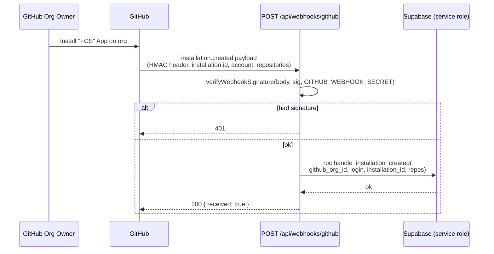
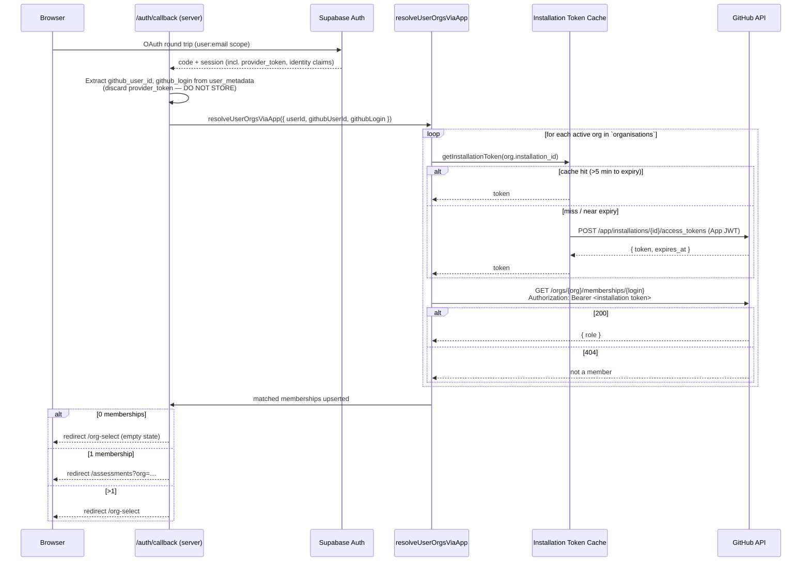
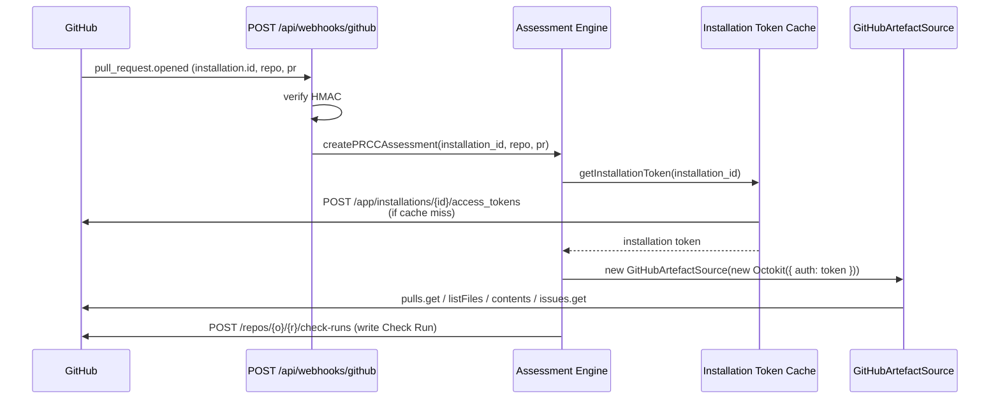
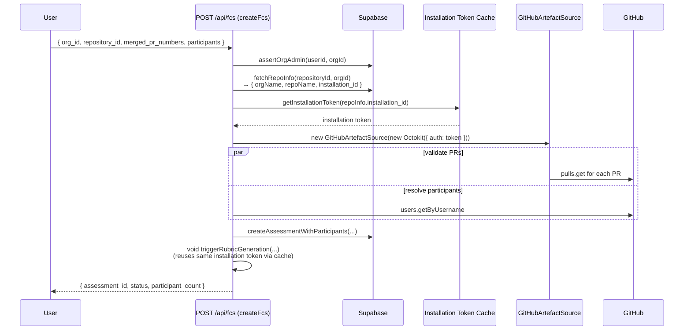

# GitHub Auth & Token Handling — High-Level Design

**Date:** 2026-04-07
**Status:** Draft (pending human security sign-off)
**Owner:** LS
**Issue:** #186
**Parent epic:** #176 (Onboarding & Auth)
**Related ADRs:** [ADR-0001](../adr/0001-github-app-integration.md), [ADR-0003](../adr/0003-auth-supabase-auth-github-oauth.md), [ADR-0020](../adr/0020-org-membership-via-installation-token.md)
**Supersedes (in part):** `v1-design.md` §3 token-context table (annotated below)

## 1. Purpose and Scope

This document is the single source of truth for **how FCS authenticates to GitHub**. It covers:

- every GitHub API call site in the repository, as of commit `eb4bad1`;
- which token each site uses today, and which it *should* use under ADR-0020;
- the target-state token model (installation tokens for all server-to-server calls; user OAuth token for identity only);
- private-key lifecycle, cache semantics, and a concrete migration plan to reach the target state.

Out of scope: the Supabase Auth session model itself (owned by ADR-0003), LLM-provider auth (ADR-0015), and infrastructure secrets unrelated to GitHub.

## 2. Background

ADR-0020 chose **GitHub App installation tokens** as the authorisation mechanism for organisation-membership lookup, and reframed the user's OAuth provider token as an identity proof only. It deliberately deferred the full system-level design — the assumption baked into the ADR ("all repo reads already use the installation token") is **not true of the current implementation**. The PR-data fetch in [src/app/api/fcs/service.ts](../../src/app/api/fcs/service.ts) still uses the user OAuth token via [createGithubClient](../../src/lib/github/client.ts).

Without reconciling this gap, task #178 (cutover) cannot land safely: deleting the `user_github_tokens` storage path would break FCS rubric generation. This HLD provides the reconciliation design.

## 3. Current-State Audit

Produced by grepping `src/` for `octokit`, `github.com`, `Authorization.*Bearer`, and `Authorization.*token`, then tracing every call site to its token source.

### 3.1 Call-site inventory

| # | File | Function / Route | Token used today | How it is obtained | GitHub endpoint(s) |
|---|------|------------------|------------------|--------------------|--------------------|
| 1 | [src/lib/github/client.ts](../../src/lib/github/client.ts) | `createGithubClient(adminSupabase, userId)` | **User OAuth provider token** | `adminSupabase.rpc('get_github_token', …)` reads the encrypted token from `user_github_tokens` (Vault-decrypted by the RPC). | None directly — returns `Octokit` for callers. |
| 2 | [src/app/api/fcs/service.ts:275](../../src/app/api/fcs/service.ts#L275) | `triggerRubricGeneration` | **User OAuth** (via #1) | Passes the resulting Octokit to `GitHubArtefactSource.extractFromPRs`. | `GET /repos/{o}/{r}/pulls/{n}` (+ `.diff`), `listFiles`, `contents`, `git/trees`, `issues`. |
| 3 | [src/app/api/fcs/service.ts:328](../../src/app/api/fcs/service.ts#L328) | `createFcs` | **User OAuth** (via #1) | Uses the Octokit for `validateMergedPRs` and `resolveParticipants`. | `pulls.get`, `users.getByUsername`. |
| 4 | [src/lib/github/artefact-source.ts](../../src/lib/github/artefact-source.ts) | `GitHubArtefactSource` (class) | Inherits from whichever Octokit is injected — **currently user OAuth**. | Constructor injection. | See #2. |
| 5 | [src/lib/github/app-auth.ts](../../src/lib/github/app-auth.ts) | `createAppJwt`, `createInstallationToken`, `getInstallationToken` | **App JWT → installation token** | RS256-signs a JWT with `GITHUB_APP_PRIVATE_KEY` (env), then `POST /app/installations/{id}/access_tokens`. In-memory cache keyed by `installationId`, 5-minute refresh margin. | `POST /app/installations/{id}/access_tokens`. |
| 6 | [src/lib/supabase/org-membership.ts](../../src/lib/supabase/org-membership.ts) | `resolveUserOrgsViaApp` | **Installation token** (via #5) | `getInstallationToken(org.installation_id)` per installed org. | `GET /orgs/{org}/memberships/{user}`. **Not yet wired into `/auth/callback`.** Requires the App to hold `Organisation members (read)` — see M1.5. |
| 7 | [src/lib/supabase/org-sync.ts](../../src/lib/supabase/org-sync.ts) | `syncOrgMembership` | **User OAuth provider token** (passed in by caller) | Called from `/auth/callback` with `session.provider_token`. | `GET /user`, `GET /user/orgs`, `GET /orgs/{org}/memberships/{user}`. **Legacy path to be removed by ADR-0020 cutover.** |
| 8 | [src/lib/github/installation-handlers.ts](../../src/lib/github/installation-handlers.ts) | `handleWebhookEvent` and siblings | **No GitHub API call.** Pure DB mutation in response to webhook payloads. | — | — |
| 9 | [src/app/api/webhooks/github/route.ts](../../src/app/api/webhooks/github/route.ts) | `POST /api/webhooks/github` | **HMAC-SHA256 of shared webhook secret.** Not a bearer token; proves the sender is GitHub. | `GITHUB_WEBHOOK_SECRET` env. | — |
| 10 | [src/lib/github/webhook-verification.ts](../../src/lib/github/webhook-verification.ts) | `verifyWebhookSignature` | Same as #9. | — | — |

### 3.2 Divergence from intent

| Concern | `v1-design.md` §3 intent | ADR-0020 intent | Reality today |
|---|---|---|---|
| PR diff / file listing / file contents (FCS rubric + validation) | **User OAuth** ("user-initiated, not webhook-triggered") | Asserts: "all repository reads already use the installation token (ADR-0001)". | **User OAuth.** ADR-0020's claim is aspirational, not current. |
| PR diff / Check Run writes (PRCC) | **Installation token** | Installation token | Not implemented yet — no PRCC webhook code exists. Target state is already correct. |
| Org membership at sign-in | **User OAuth** (`/user/orgs`) | **Installation token** (per installed org) | Both code paths exist: `org-sync.ts` (user OAuth, wired) and `resolveUserOrgsViaApp` (installation, **not** wired). |
| User provider-token storage | `user_github_tokens` (pgsodium-encrypted) | To be deleted | Table + Vault key still in use. Deletion blocked on FCS cutover (#2 above). |
| OAuth scopes | `read:user`, `read:org`, `repo` | `read:user` only | `read:user`, `read:org`, `repo` still requested by `SignInButton`. |

**Conclusion.** The system is mid-migration. Identity is fine; org membership has both code paths; PR fetching is still stuck on user OAuth. The ADR-0020 cutover cannot land atomically until FCS PR fetching moves too.

## 4. Target State

One principle: **server-to-server GitHub API calls always use an installation token. The user OAuth provider token is used only to complete the Supabase identity handshake and is never stored.**

### 4.1 Token contexts (canonical)

| Context | Authenticates as | How minted | Lifetime | Where stored | Used for |
|---|---|---|---|---|---|
| **A. User OAuth provider token** | The signing-in human | Supabase Auth returns `session.provider_token` once at `/auth/callback`. | Until revoked. | **Nowhere** — read from the session once, used to fetch identity claims if needed, then discarded. | *Identity handshake only.* No GitHub API calls in the target state — `github_user_id` and `github_login` come from the Supabase identity claim (`user.user_metadata.provider_id` / `user_name`). |
| **B. GitHub App JWT** | The GitHub App itself | `createSign('RSA-SHA256')` with `GITHUB_APP_PRIVATE_KEY` (env), `iss=GITHUB_APP_ID`, 10-minute TTL. | 10 min. | Never persisted — minted per request in memory. | Exchanged for an installation token via `POST /app/installations/{id}/access_tokens`. |
| **C. Installation access token** | The GitHub App, scoped to one installation | Exchange of B for a specific `installation_id`. | 1 h. | In-memory LRU cache keyed by `installation_id`, refreshed 5 min before expiry. | **All** server-to-server GitHub API reads and writes: PR diffs/files/contents, issue metadata, Check Runs (future PRCC), `members/{user}` lookups. |

`v1-design.md` §3's two-context table (Installation + "User OAuth — for FCS and org membership") is **superseded** by this section. The HLD is now the authoritative reference for GitHub auth contexts; v1-design.md gets a pointer in the change log.

### 4.1a The Supabase session JWT (context D) — not a GitHub token, but critical

A reader walking away from §4.1 with only three contexts would be missing the token that actually authenticates the human to *us* and makes edge **E3** of §4.3 work. It is not a GitHub credential — GitHub never sees it — but it is the trust root for every user-initiated GitHub call, so it belongs in this document.

| Context | Authenticates as | How minted | Lifetime | Where stored | Used for |
|---|---|---|---|---|---|
| **D. Supabase session JWT** | A specific signed-in user | Issued by Supabase Auth after the OAuth round-trip completes at `/auth/callback`. Signed by Supabase with a key we do not possess. | Access token ~1 h; refresh token long-lived. Refresh handled automatically by `@supabase/ssr`. | HTTP-only cookie (`sb-<project>-auth-token`) set by `@supabase/ssr` on the browser. Never in application storage, never in our DB, never logged. | (a) Authenticating the user to our Next.js API routes. (b) Populating `auth.uid()` in Postgres so RLS policies on `organisations`, `user_organisations`, `assessments`, etc. fire. (c) **Proving authorisation at edge E3** — when user-scoped Supabase clients issue queries carrying this JWT as `Authorization: Bearer`, Postgres enforces row-level access on the authenticated user's behalf. |

**What we do with it.** Nothing beyond handing it to `@supabase/ssr` via `createServerSupabaseClient` / the middleware helper. We do not parse its claims ourselves, do not validate signatures (Supabase's RLS does, implicitly), do not pass it to any external service, do not store it anywhere other than the cookie Supabase sets. Every server-side file that touches authenticated state does so through one of four helpers in `src/lib/supabase/` (`server.ts`, `middleware.ts`, `route-handler.ts`, `route-handler-readonly.ts`). That is the total surface area.

**Why it matters to §4.3.** Edge E3 says "user-scoped DB read, authorised by the session JWT". The integrity of the entire cross-org isolation guarantee depends on that JWT being unforgeable: if an attacker could mint a valid JWT for a user who is a member of org Y, they could legitimately read org Y's `installation_id` through a user-scoped client and hand themselves a working GitHub token for the wrong org. This is not a theoretical concern — it is the threat model E3 is defending against. The defence is that Supabase signs the JWT with a key held only by the Supabase project, and the Postgres RLS engine validates that signature on every query. We trust Supabase for this; ADR-0003 owns the decision.

**Non-goals for this HLD.** Supabase session signing keys, session cookie rotation, refresh token rotation, CSRF protection on cookie-based auth, and session revocation on sign-out are all owned by ADR-0003 and the Supabase platform. They are listed here only so a reader of §4 does not mistake their absence for an oversight.

### 4.2 Required GitHub App permissions

| Permission | Access | Used by | Notes |
|---|---|---|---|
| Pull requests | Read | FCS rubric generation, PRCC (future) | Replaces current user-OAuth `repo` scope. |
| Contents | Read | `GitHubArtefactSource.fetchContextFiles` / `fetchSingleFile` | Needed for context-file patterns and top-N file contents. |
| Metadata | Read | Implicit with any install. | — |
| Checks | Write | PRCC (future) | Not yet used, but pre-authorised at install time. |
| Issues | Read | `GitHubArtefactSource.fetchLinkedIssues` | Reads linked issue title/body. |
| Organisation members | Read | `resolveUserOrgsViaApp` | Added by ADR-0020 and **already present on the `mironyx` App manifest** (landed with #185). M1.5 is a verification step, not a manifest edit. |

No `repo`, `read:org`, or `read:user` scope is ever requested from the user — the OAuth grant drops to `user:email` (identity minimum).

### 4.3 Cross-Org Isolation — The Core Security Concern

Moving all server-to-server GitHub calls onto installation tokens removes a defense-in-depth layer we had with user OAuth. With user OAuth, GitHub refuses any call where the user is not a member of the target org — GitHub itself is a safety net against bugs in our authorisation code. With installation tokens, **the App holds a credential for every installed org simultaneously**, and GitHub will happily serve data for any org whose installation we point at. The entire cross-org isolation guarantee collapses onto **our** code picking the right `installation_id` for the current request.

This is the single biggest risk introduced by this HLD. It must be addressed by design, not by vigilance.

#### Principle

> **Minimise the number of places in the codebase where a bug could cross org boundaries. Do not rely on every future developer remembering to call the right check in the right order.**

The concrete expression of this principle is:

1. **`installation_id` enters the system at a small, fixed set of edges.** Every entry is gated by an authorisation decision made *at that edge*. There are exactly three edges:

    | # | Edge | Authorisation mechanism | Used by |
    |---|---|---|---|
    | E1 | **Verified GitHub webhook payload** | HMAC-SHA256 of `GITHUB_WEBHOOK_SECRET` proves the sender is GitHub. GitHub is telling us which installation the event belongs to — we do not choose. | Install lifecycle, `installation_repositories`, PRCC (future). |
    | E2 | **Sign-in resolver** (`resolveUserOrgsViaApp`) | Deliberately iterates every active `organisations` row and calls `/orgs/{org}/memberships/{login}`. The authorisation *outcome* is what it computes — the set of orgs the user is allowed to see. | `/auth/callback` only. |
    | E3 | **User-scoped DB read** | The `organisations` row (and any denormalised copy of `installation_id`) is readable only through Supabase RLS. The authorisation proof is the **Supabase session JWT (context D, §4.1a)** — transported as the `sb-*-auth-token` HTTP-only cookie, carried into Postgres via `@supabase/ssr`, and validated by RLS policies keyed on `auth.uid()`. If the user is not in `user_organisations` for that org, the read returns empty. | `createFcs`, future user-initiated GitHub calls. |

2. **Downstream code never re-derives `installation_id`.** It receives it as a parameter from one of the three edges, or from a DB row that was itself written under one of them (see point 3). There is no middle-of-pipeline lookup that a refactor can quietly point at the wrong org.

3. **Trust-by-construction via denormalisation on work rows.** Rows representing deferred work (`assessments`, future PRCC state tables) carry `installation_id` as a column. The row is *written* under RLS — meaning the user who created it proved membership of the org at write time. Background jobs, retries, and async workers then read `installation_id` straight off the row without re-authorising. The authz happened at the door; the middle of the pipeline is algebraic.

4. **No service-role free-form `installation_id` lookup.** `adminSupabase` (service role, bypasses RLS) is never used to look up `installation_id` from an arbitrary `org_id`. If a code path believes it needs this, it is wrong — either the value should have been persisted on a work row at creation time, or the path should be expressed as E1 (webhook) or E3 (user session).

#### Deferred belt-and-braces (known risk, accepted for V1)

The §4.3 guarantee relies on developer discipline to keep service-role code away from the `installation_id` column. The CLAUDE.md rule and code review catch this, but they are human checks. A stronger mechanical guard would be a database-level wrapper — e.g. revoking `SELECT (installation_id)` from the service role on the `organisations` table and exposing installation tokens only through a set of whitelisted `SECURITY DEFINER` functions that log every access. This pushes the boundary into the database itself, so a future refactor that adds a naive `adminSupabase.from('organisations').select('installation_id')` would fail at runtime, not at code review. **Deferred for V1** — the single-digit number of call sites makes human review tractable, and the whitelisted-function pattern adds friction to every new legitimate use. Revisit when the codebase has more than ~5 distinct `installation_id` consumers or when a second team contributes.

#### Why this works

The attack surface shrinks from "every GitHub call site in the codebase" to "the three edges where `installation_id` enters the system." Auditing the three edges is tractable and can be enforced by code review, tests, and a lint rule. Every call site downstream is safe by construction because it cannot obtain a wrong `installation_id` — the only value available is the one that was authorised at the edge.

Belt-and-braces mitigations (explicit `assertOrgAdmin` calls at function entry, branded Octokit types, adversarial cross-org tests, audit logging of GitHub calls) remain useful and should be added, but they are **defense in depth on top of** the structural guarantee, not the primary line of defense. The primary line of defense is that a wrong `installation_id` is not a value you can obtain.

#### Schema implication

`assessments` gains an `installation_id bigint not null` column, populated from the joined `organisations` row at the moment of insert (which itself runs under RLS via the user's session). This is the denormalisation that makes rubric generation and retries safe without requiring them to re-authorise. Covered in §8 M1.

#### CLAUDE.md rule (to be added as part of M1)

> **Installation IDs have three entry points: verified webhook payloads, the sign-in resolver, and RLS-scoped DB reads on behalf of an authenticated user. Downstream code must receive `installation_id` as a parameter or from a persisted row written under one of those entry points. `adminSupabase` must never be used to translate an arbitrary `org_id` into an `installation_id`.**

## 5. Sequence Diagrams

All diagrams render on GitHub (Mermaid `sequenceDiagram`).

### 5.1 Install webhook → `organisations` row with `installation_id`

No GitHub API call is made from this path. The webhook is purely a DB write; all subsequent GitHub reads happen lazily via context C.

### 5.2 Sign-in → identity → resolve memberships → `/org-select` or `/assessments`

### 5.3 PR webhook → assessment engine → installation token (PRCC, future)

### 5.4 FCS user-initiated → installation token for PR fetch (**target state**)

Critically, `createFcs` and `triggerRubricGeneration` now depend on the **org's `installation_id`**, not the calling user's stored token. `fetchRepoInfo` already returns the org row; it will be extended to select `installation_id`.

## 6. Private-Key Lifecycle

The GitHub App private key (`GITHUB_APP_PRIVATE_KEY`) is the root of trust for **every** server-to-server GitHub call. If it leaks, every installation's data is readable by the attacker until we rotate — the blast radius is the entire customer base of the App.

### 6.1 Storage tiers

| Environment | Storage | Access | Format |
|---|---|---|---|
| **Local dev** | `.env.local` (gitignored) | Developer workstation only. Each dev has an individual dev-only GitHub App with its own key; the production key is never pulled locally. | PEM string, `\n` literal-escaped for single-line env var. |
| **CI (GitHub Actions)** | Repository-level **Actions secret** `GITHUB_APP_PRIVATE_KEY` | Only exposed to workflows on protected branches; not available to workflows from forks. | Same PEM encoding. |
| **Production (Cloud Run)** | **Google Secret Manager** secret `fcs-github-app-private-key`, mounted at container start as env var. | Service account bound to the Cloud Run revision only. Secret Manager audit log enabled. | Same PEM encoding. |

### 6.2 Provisioning

1. GitHub App is created (or updated) in the GitHub UI by the project owner.
2. A new private key is generated from the App settings page. GitHub shows the PEM **once**; save directly into Google Secret Manager (production) and distribute to CI via `gh secret set` (CI).
3. For local dev, the developer creates a *separate* App (`FCS (dev)`) pointed at `http://localhost:3000`, generates its own key, and writes it into `.env.local`. Production keys never touch workstations.
4. The App ID is stored alongside the key in the same tier (`GITHUB_APP_ID`).

### 6.3 Rotation

Routine rotation cadence: **90 days**, or immediately on any suspicion of compromise.

1. Generate a second private key in the GitHub App settings. GitHub supports multiple active keys simultaneously — this is the mechanism for zero-downtime rotation.
2. Update Google Secret Manager: create a new version of `fcs-github-app-private-key` containing the new PEM.
3. Trigger a Cloud Run revision rollout (new revision picks up the new secret version).
4. Observe: `POST /app/installations/*/access_tokens` should continue to succeed with the new key. If there are background workers with longer-lived token caches, call `__resetInstallationTokenCache()` via a deployment-time hook (new route `POST /internal/ops/reset-token-cache`, authenticated by a separate ops shared secret — not in V1).
5. Delete the old key in the GitHub App settings. This is the commit point.
6. Mark the old Secret Manager version as disabled (retain for audit, but no longer served).

Rotation runbook lives at `docs/runbooks/github-app-key-rotation.md` (to be authored as a follow-up task).

### 6.4 Revocation (emergency)

Triggered by: key suspected leaked, dev laptop lost, Secret Manager audit log shows unexpected access, rogue workflow exfiltrates the CI secret.

1. Immediately delete the compromised key from the GitHub App settings UI. This invalidates *every* App JWT signed with it within seconds.
2. All cached installation tokens (context C) are still valid for up to 1 h — they were minted *before* revocation and are held by GitHub. If we need to invalidate those too, uninstall and reinstall the App on every customer (nuclear — requires customer action and breaks live Check Runs).
3. Generate a replacement key, deploy as in §6.3 steps 1–3.
4. Security review: audit Secret Manager access logs for the compromise window; check GitHub App audit log for any API calls we did not originate.
5. File an incident report in `docs/reports/YYYY-MM-DD-github-key-incident.md`. ADR if the rotation procedure changes as a result.

### 6.5 Blast radius

- **Key leak, undetected.** Attacker mints App JWTs and installation tokens for every installation. They can read pull requests, contents, issues, and (once we enable PRCC) write Check Runs on every customer repository. They cannot read anything the App was not granted — no admin actions, no secrets, no code push. Customer discovery is possible via GitHub audit logs on their side but not proactive on ours.
- **Key leak, detected.** §6.4 playbook. Rotation is fast; the residual 1 h of cached installation tokens is the unavoidable tail.
- **Installation token leak** (e.g. logged by mistake). Scoped to one installation, expires within an hour, cannot be directly invalidated by us. We can mitigate impact by calling `__resetInstallationTokenCache()` and refusing to re-mint — but the leaked token remains valid at GitHub until TTL. **Mitigation for this HLD:** installation tokens must never be logged; the existing `logger.info` calls in `app-auth.ts` log only structural info, not the token string. Add a lint rule in a follow-up to catch `logger.*token` patterns.
- **Webhook secret leak** (`GITHUB_WEBHOOK_SECRET`). Attacker can forge webhook payloads and trigger `installation.created` / `installation.deleted` events. Effect: spurious `organisations` rows or deactivations. Mitigated by per-delivery replay detection (GitHub sends `X-GitHub-Delivery`; we currently do not track it — tracked as a follow-up risk, out of scope for this HLD).

## 7. Cache Semantics

Implemented in [src/lib/github/app-auth.ts:64-85](../../src/lib/github/app-auth.ts#L64-L85).

| Property | Value | Rationale |
|---|---|---|
| Keyed by | `installationId: number` | Tokens are per-installation; no cross-installation reuse. |
| Scope | Module-level `Map` in the Node process. | Cloud Run runs N container instances; each has its own cache. Accepted because GitHub tokens are cheap to re-mint (one signed JWT + one POST) and 1 h TTL means steady-state mint rate is ≤1/h/installation/instance. |
| TTL | `expires_at` from GitHub (nominally 1 h). | Authoritative — don't guess. |
| Refresh margin | 5 min before expiry. | Avoids using a token within GitHub's clock-skew window and avoids mid-request expiry. |
| In-flight dedup | **No.** Two concurrent cache-miss calls for the same `installationId` will each mint a token. | Acceptable: GitHub allows multiple valid tokens per installation, the extra mint is rare (only on cold start or near expiry), and adding a promise-keyed mutex adds complexity with marginal benefit at V1 scale. The realistic worst case is a cold-start deploy that immediately receives a burst of queued assessment requests for the same org — N concurrent mints for one `installationId` instead of one. GitHub's rate limit for `POST /app/installations/*/access_tokens` (currently effectively unlimited for normal App usage) absorbs this comfortably. Revisit if we ever see 429s on that endpoint. |
| Cross-request behaviour | Shared within one Node process, not across instances. | Serverless / autoscaled. Per-instance warm cache is the pragmatic sweet spot — no Redis, no distributed lock. |
| Persistence across deploys | **None.** New revision = cold cache. | Fine — cold-start cost is one extra mint per installation touched in the first minute. |
| Test reset | `__resetInstallationTokenCache()` exported for Vitest. | Needed to isolate tests. |

**Non-goals.** We do **not** cache the user OAuth provider token (it is not persisted), do not cache the App JWT (always minted fresh because it is 10 min TTL and cheap), and do not cache the webhook HMAC secret lookup (it is a single env read at boot).

## 8. Migration Plan: Current → Target

Small, reversible steps. Each step leaves the system in a working state.

### Step M1 — FCS PR fetch moves to installation token (pre-cutover)

This step operationalises the §4.3 principle. It is the first place in the codebase where we apply the "three entry points + trust-by-construction" discipline.

- **Schema change (declarative, via the workflow in CLAUDE.md):**
  - Add `installation_id bigint not null` to `assessments` in `supabase/schemas/tables.sql`.
  - Populate on insert from the joined `organisations` row. The insert path in `createFcs` already runs under the user's session (user-scoped Supabase client), so RLS enforces that the user is a member of the org being inserted for — satisfying edge **E3** from §4.3.
  - No RLS policy change needed: existing membership policies on `assessments` continue to cover the new column. The column is purely a denormalisation for downstream trust-by-construction.
  - Generate the migration via `npx supabase db diff -f add_assessments_installation_id`.
- **File changes:**
  - New file `src/lib/github/installation-octokit.ts` exporting `createInstallationOctokit(installationId): Promise<Octokit>` — thin wrapper around `getInstallationToken` that returns an authenticated `Octokit`. This is the **only** place that turns an `installation_id` into a usable GitHub client on the user-initiated path.
  - `src/app/api/fcs/service.ts`:
    - `fetchRepoInfo` selects `installation_id` alongside org/repo names (via the user-scoped Supabase client — **not** `adminSupabase` — to preserve edge E3).
    - `createFcs` reads `installation_id` from `repoInfo` and passes it through `createAssessmentWithParticipants` so the new column is populated at insert time.
    - `triggerRubricGeneration` accepts `installationId` on its param type and calls `createInstallationOctokit(installationId)` instead of `createGithubClient(adminSupabase, userId)`.
    - `retriggerRubricForAssessment` reads `installation_id` from the `assessments` row it already loads (trust-by-construction — the row exists, therefore a member of the org created it). The `userId` parameter is retained only for logging/attribution, not authorisation.
  - `createGithubClient` is **not yet deleted** in this step — only its call sites in `fcs/service.ts`. Deletion happens in M3 alongside `user_github_tokens`.
- **CLAUDE.md:** add the rule from §4.3 ("Installation IDs have three entry points…") in the Coding Principles section.
- **Tests:**
  - Update FCS service tests to mock `getInstallationToken` instead of `get_github_token` RPC.
  - Add an adversarial test: user who is not a member of org B attempts to create an FCS assessment targeting a repository in org B. Expected: `assertOrgAdmin` rejects; if that check were bypassed, the user-scoped `fetchRepoInfo` would return an empty row and `installation_id` would be undefined — two independent failures, not one.
  - Add a unit test on `retriggerRubricForAssessment` verifying it uses `assessment.installation_id` and never touches `organisations` for a fresh lookup.
- **Risk:** requires every active `organisations` row to have an `installation_id`. Verified in prod (single row: mironyx, installation present). The new column is `not null`, so any `organisations` row with a null `installation_id` would block assessment creation — intentional; such a row is already broken.
- **Reversibility:** revert the two call sites and drop the column (`ALTER TABLE assessments DROP COLUMN installation_id` generated via the declarative workflow). `user_github_tokens` is still populated throughout this step.
- **Error path — uninstalled between creation and retrigger.** If an org uninstalls the App between assessment creation and rubric generation (or between creation and a later retrigger), the background worker will fail to mint an installation token for the stored `installation_id` (GitHub 404). The worker catches this in the existing `markRubricFailed` path and the assessment transitions to `rubric_failed`. The user-facing surface in the assessments list must show a specific, actionable message — "This organisation's GitHub App installation is no longer active. Ask an owner to reinstall it, then retrigger." — rather than the generic "Rubric generation failed" text. Tracked as a small UI task under M1; implementation is a check on whether the org's row is `status='inactive'` at the point of rendering the failure.

### Step M1.5 — Verify `members:read` consent on active installations

**Sequencing:** the `Organisation members (read)` permission must be held by every active installation **before** M2 wires `resolveUserOrgsViaApp` into `/auth/callback`. The resolver calls `GET /orgs/{org}/memberships/{login}` with an installation token; that endpoint requires the permission. Without it, the resolver returns 403.

**Current state (confirmed 2026-04-07):** the `mironyx` GitHub App manifest **already has** `Organisation members (read)`. The permission was added as part of #185. This step therefore reduces to a runtime verification and an operator script — no manifest edit, no re-consent email, no waiting.

- Add an operator script `scripts/check-members-read-consent.ts` that iterates every active row in `organisations`, mints an installation token, and performs a dry-run `GET /orgs/{login}/memberships/{known-user}` call. Report per-install: `ok`, `403 (needs re-consent)`, or `404 (known user not a member — still ok, permission is held)`. Exit non-zero if any row reports `403`.
- Run the script against production before M2 is merged. Expected output at current scale: one row (`mironyx`), `ok`.
- If a new customer installs the App between M1.5 and M2, they inherit the permission from the manifest automatically — no special handling needed. The script is rerun as part of M2's pre-merge checklist.
- **Not needed:** manifest edit, re-consent email workflow, customer communication. All of that would have applied if `members:read` had been missing from the manifest; it isn't.

### Step M2 — ADR-0020 sign-in cutover (already scoped as #179)

- Wire `resolveUserOrgsViaApp` into `/auth/callback`; delete the `syncOrgMembership` call.
- Drop `read:org` and `repo` scopes from `SignInButton.tsx` (keep `user:email`).
- Do **not** read `session.provider_token` anymore; identity comes from `user.user_metadata`.
- **Session invalidation / cached tokens.** The scope reduction affects only *new* sign-ins. Users who already have an active Supabase session retain whatever `provider_token` was captured under the old scopes, and that token continues to sit in `user_github_tokens` with its original `repo`/`read:org` scopes until the session expires or M3 drops the table. This is not a security regression — post-M1, FCS no longer reads the stored token at all, so its elevated scope is unused. After M3, the table is gone regardless of session state. We do **not** force a global sign-out; natural session expiry plus the M3 table drop is sufficient.

Unblocked by M1 **and M1.5**. Before M1, M2 would break FCS. Before M1.5, M2 would break sign-in itself.

### Step M3 — Delete the user-token storage path

- Drop `createGithubClient`, `src/lib/github/client.ts`, `syncOrgMembership`, `src/lib/supabase/org-sync.ts`.
- Migration: `DROP TABLE user_github_tokens;` + remove the pgsodium key entry. Generated via the declarative-schema workflow in CLAUDE.md.
- Update `v1-design.md` §4.1 to remove the `user_github_tokens` section and point readers at this HLD for the token model.
- CodeScene sweep: the `get_github_token` RPC function in `supabase/schemas/functions.sql` is removed too.

### Step M4 — (removed)

The permission upgrade that was originally scoped as M4 is now **M1.5** — it must run before M2, not after. See the sequencing correction in M1.5 above.

Order: **M1 → M1.5 → M2 → M3.** M1.5 and M1 are independent and can overlap, but both must complete before M2.

### Step M5 — Hardening follow-ups (post-cutover, not blockers for #186)

- Lint rule forbidding logging of anything named `token` at info/debug levels.
- `X-GitHub-Delivery` replay detection on the webhook route.
- Runbooks for rotation (§6.3) and permission upgrade.
- Revisit cache dedup if GitHub App rate-limit pressure appears.
- **Observability for installation-token minting.** Structured log every successful mint with `{ installation_id, expires_at, latency_ms }` and every failure with `{ installation_id, http_status }`. Prometheus counter `github_installation_token_mints_total{installation_id,outcome}`. Alert rule: `rate(github_installation_token_mints_total[5m]) > N_per_installation_per_hour` — firing indicates either the cache is broken or a runaway loop is re-minting. Separate alert on `github_installation_token_mints_total{outcome="failed"}` spike — firing indicates permission revocation, key rotation mid-deploy, or GitHub outage. Ties the §6.4 revocation playbook to a detection mechanism rather than relying on a customer to tell us something is wrong.
- **Whitelisted-function pattern for `installation_id` reads** (the deferred belt-and-braces from §4.3). Revisit trigger: codebase grows past ~5 consumers, or a second team contributes.

## 9. Open Questions

1. **Should the M1 helper construct a fresh Octokit per call, or cache Octokit instances?** Installation tokens change hourly, so the natural grain is per-request. Recommend: per-request Octokit, relying on the token cache behind it. Cheap allocation, clean ownership. **Clarification:** "per-request" here means "once per FCS assessment request / per webhook delivery", not "once per GitHub API call". A single `triggerRubricGeneration` that makes diff + files + contents + issues calls creates one Octokit at the top and reuses it across all of them — the Octokit is a vehicle for the token, and the token is already cached.
2. **How do we keep `installation_id` in sync when an org uninstalls and reinstalls?** Current webhook handler sets `status='inactive'` on delete. On a fresh `installation.created` with the same `github_org_id`, `handle_installation_created` must update the existing row's `installation_id` and reactivate it. Verified in [handle_installation_created](../../supabase/schemas/functions.sql) — out-of-scope to re-audit here but worth calling out for the drift scan. **Interaction with the denormalised `assessments.installation_id`:** existing assessments created under the old installation still carry the old id. When the background rubric worker tries to mint a token for a deactivated installation, it will fail cleanly (GitHub returns 404). Acceptable — the assessment transitions to `rubric_failed` and can be retriggered after reinstall. A migration to rewrite stale `installation_id` values on reinstall is *not* needed at V1 scale.
3. **PRCC webhook route is not yet implemented.** When it is, it will share the same installation-token cache and receive `installation_id` via edge **E1** (verified webhook payload), consistent with §4.3. No design gap — just a forward-looking note.
4. **Should we promote the §4.3 principle to its own ADR?** It is significant enough to deserve one ("Installation-ID handling — three entry points and trust-by-construction") but also tightly coupled to ADR-0020. Recommendation: extract to a standalone ADR if and only if a second use case (beyond FCS + PRCC) appears that needs the same discipline. For now, the HLD is the reference.

## 10. Change Log

| Date | Author | Change |
|---|---|---|
| 2026-04-07 | LS / Claude | Initial draft (issue #186). |
| 2026-04-07 | LS / Claude | Added §4.3 cross-org isolation principle (three entry points, trust-by-construction). Updated §8 M1 to include `assessments.installation_id` denormalisation, user-scoped `fetchRepoInfo`, adversarial test, and CLAUDE.md rule. Added open question on the principle's potential ADR promotion. |
| 2026-04-07 | LS / Claude | Review pass: added §4.3 deferred whitelisted-function risk; §7 cold-start burst note; §8 M1 error-path UX for uninstall-between-creation-and-retrigger; **corrected migration ordering — `members:read` is now M1.5 and must land before M2, not after** (previously M4); M2 session-invalidation note for cached tokens; §9 Q1 clarification that "per-request" is per-assessment; §M5 observability bullet for installation-token mint rate. |
| 2026-04-07 | LS / Claude | Confirmed by project owner that the `mironyx` App manifest already holds `Organisation members (read)` (landed with #185). M1.5 simplified to a verification script — no manifest edit, no re-consent email. §4.2 permissions table updated accordingly. |
| 2026-04-08 | LS / Claude | Added §4.1a naming the Supabase session JWT as context D — not a GitHub token, but the trust root for edge E3 and the only thing that makes RLS-scoped reads meaningful. §4.3 E3 updated to reference context D explicitly. Non-goals for session handling (signing keys, cookie rotation, CSRF) called out as owned by ADR-0003 and Supabase, so their absence from this HLD is deliberate. |
