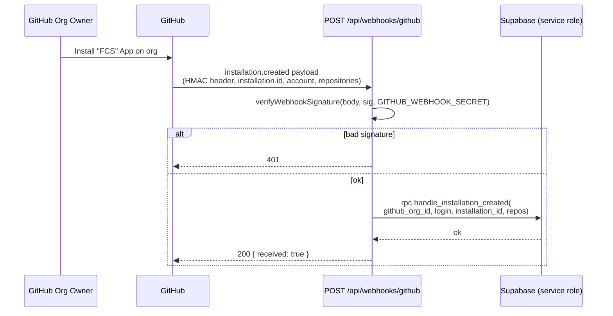
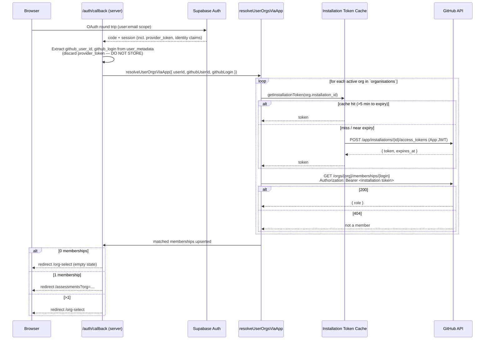
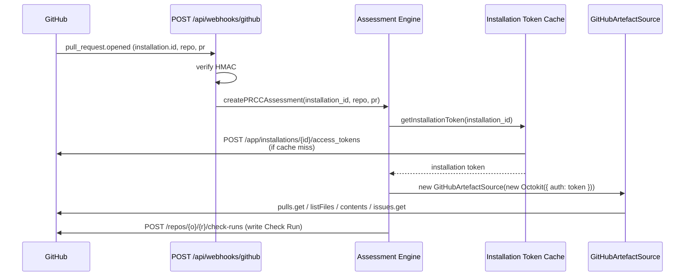
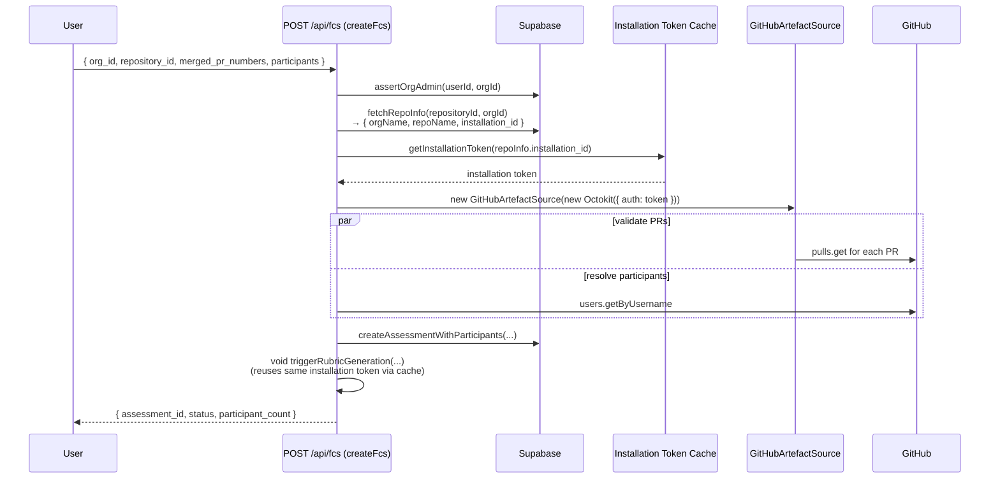

# GitHub Auth & Token Handling — High-Level Design

**Date:** 2026-04-07
**Status:** Draft (pending human security sign-off)
**Owner:** LS
**Issue:** #186
**Parent epic:** #176 (Onboarding & Auth)
**Related ADRs:** [ADR-0001](../adr/0001-github-app-integration.md), [ADR-0003](../adr/0003-auth-supabase-auth-github-oauth.md), [ADR-0020](../adr/0020-org-membership-via-installation-token.md)
**Supersedes (in part):** `v1-design.md` §3 token-context table (annotated below)

## 1. Purpose and Scope

This document is the single source of truth for **how FCS authenticates to GitHub**. It covers:

- every GitHub API call site in the repository, as of commit `eb4bad1`;
- which token each site uses today, and which it *should* use under ADR-0020;
- the target-state token model (installation tokens for all server-to-server calls; user OAuth token for identity only);
- private-key lifecycle, cache semantics, and a concrete migration plan to reach the target state.

Out of scope: the Supabase Auth session model itself (owned by ADR-0003), LLM-provider auth (ADR-0015), and infrastructure secrets unrelated to GitHub.

## 2. Background

ADR-0020 chose **GitHub App installation tokens** as the authorisation mechanism for organisation-membership lookup, and reframed the user's OAuth provider token as an identity proof only. It deliberately deferred the full system-level design — the assumption baked into the ADR ("all repo reads already use the installation token") is **not true of the current implementation**. The PR-data fetch in [src/app/api/fcs/service.ts](../../src/app/api/fcs/service.ts) still uses the user OAuth token via [createGithubClient](../../src/lib/github/client.ts).

Without reconciling this gap, task #178 (cutover) cannot land safely: deleting the `user_github_tokens` storage path would break FCS rubric generation. This HLD provides the reconciliation design.

## 3. Current-State Audit

Produced by grepping `src/` for `octokit`, `github.com`, `Authorization.*Bearer`, and `Authorization.*token`, then tracing every call site to its token source.

### 3.1 Call-site inventory

| # | File | Function / Route | Token used today | How it is obtained | GitHub endpoint(s) |
|---|------|------------------|------------------|--------------------|--------------------|
| 1 | [src/lib/github/client.ts](../../src/lib/github/client.ts) | `createGithubClient(adminSupabase, userId)` | **User OAuth provider token** | `adminSupabase.rpc('get_github_token', …)` reads the encrypted token from `user_github_tokens` (Vault-decrypted by the RPC). | None directly — returns `Octokit` for callers. |
| 2 | [src/app/api/fcs/service.ts:275](../../src/app/api/fcs/service.ts#L275) | `triggerRubricGeneration` | **User OAuth** (via #1) | Passes the resulting Octokit to `GitHubArtefactSource.extractFromPRs`. | `GET /repos/{o}/{r}/pulls/{n}` (+ `.diff`), `listFiles`, `contents`, `git/trees`, `issues`. |
| 3 | [src/app/api/fcs/service.ts:328](../../src/app/api/fcs/service.ts#L328) | `createFcs` | **User OAuth** (via #1) | Uses the Octokit for `validateMergedPRs` and `resolveParticipants`. | `pulls.get`, `users.getByUsername`. |
| 4 | [src/lib/github/artefact-source.ts](../../src/lib/github/artefact-source.ts) | `GitHubArtefactSource` (class) | Inherits from whichever Octokit is injected — **currently user OAuth**. | Constructor injection. | See #2. |
| 5 | [src/lib/github/app-auth.ts](../../src/lib/github/app-auth.ts) | `createAppJwt`, `createInstallationToken`, `getInstallationToken` | **App JWT → installation token** | RS256-signs a JWT with `GITHUB_APP_PRIVATE_KEY` (env), then `POST /app/installations/{id}/access_tokens`. In-memory cache keyed by `installationId`, 5-minute refresh margin. | `POST /app/installations/{id}/access_tokens`. |
| 6 | [src/lib/supabase/org-membership.ts](../../src/lib/supabase/org-membership.ts) | `resolveUserOrgsViaApp` | **Installation token** (via #5) | `getInstallationToken(org.installation_id)` per installed org. | `GET /orgs/{org}/memberships/{user}`. **Not yet wired into `/auth/callback`.** |
| 7 | [src/lib/supabase/org-sync.ts](../../src/lib/supabase/org-sync.ts) | `syncOrgMembership` | **User OAuth provider token** (passed in by caller) | Called from `/auth/callback` with `session.provider_token`. | `GET /user`, `GET /user/orgs`, `GET /orgs/{org}/memberships/{user}`. **Legacy path to be removed by ADR-0020 cutover.** |
| 8 | [src/lib/github/installation-handlers.ts](../../src/lib/github/installation-handlers.ts) | `handleWebhookEvent` and siblings | **No GitHub API call.** Pure DB mutation in response to webhook payloads. | — | — |
| 9 | [src/app/api/webhooks/github/route.ts](../../src/app/api/webhooks/github/route.ts) | `POST /api/webhooks/github` | **HMAC-SHA256 of shared webhook secret.** Not a bearer token; proves the sender is GitHub. | `GITHUB_WEBHOOK_SECRET` env. | — |
| 10 | [src/lib/github/webhook-verification.ts](../../src/lib/github/webhook-verification.ts) | `verifyWebhookSignature` | Same as #9. | — | — |

### 3.2 Divergence from intent

| Concern | `v1-design.md` §3 intent | ADR-0020 intent | Reality today |
|---|---|---|---|
| PR diff / file listing / file contents (FCS rubric + validation) | **User OAuth** ("user-initiated, not webhook-triggered") | Asserts: "all repository reads already use the installation token (ADR-0001)". | **User OAuth.** ADR-0020's claim is aspirational, not current. |
| PR diff / Check Run writes (PRCC) | **Installation token** | Installation token | Not implemented yet — no PRCC webhook code exists. Target state is already correct. |
| Org membership at sign-in | **User OAuth** (`/user/orgs`) | **Installation token** (per installed org) | Both code paths exist: `org-sync.ts` (user OAuth, wired) and `resolveUserOrgsViaApp` (installation, **not** wired). |
| User provider-token storage | `user_github_tokens` (pgsodium-encrypted) | To be deleted | Table + Vault key still in use. Deletion blocked on FCS cutover (#2 above). |
| OAuth scopes | `read:user`, `read:org`, `repo` | `read:user` only | `read:user`, `read:org`, `repo` still requested by `SignInButton`. |

**Conclusion.** The system is mid-migration. Identity is fine; org membership has both code paths; PR fetching is still stuck on user OAuth. The ADR-0020 cutover cannot land atomically until FCS PR fetching moves too.

## 4. Target State

One principle: **server-to-server GitHub API calls always use an installation token. The user OAuth provider token is used only to complete the Supabase identity handshake and is never stored.**

### 4.1 Token contexts (canonical)

| Context | Authenticates as | How minted | Lifetime | Where stored | Used for |
|---|---|---|---|---|---|
| **A. User OAuth provider token** | The signing-in human | Supabase Auth returns `session.provider_token` once at `/auth/callback`. | Until revoked. | **Nowhere** — read from the session once, used to fetch identity claims if needed, then discarded. | *Identity handshake only.* No GitHub API calls in the target state — `github_user_id` and `github_login` come from the Supabase identity claim (`user.user_metadata.provider_id` / `user_name`). |
| **B. GitHub App JWT** | The GitHub App itself | `createSign('RSA-SHA256')` with `GITHUB_APP_PRIVATE_KEY` (env), `iss=GITHUB_APP_ID`, 10-minute TTL. | 10 min. | Never persisted — minted per request in memory. | Exchanged for an installation token via `POST /app/installations/{id}/access_tokens`. |
| **C. Installation access token** | The GitHub App, scoped to one installation | Exchange of B for a specific `installation_id`. | 1 h. | In-memory LRU cache keyed by `installation_id`, refreshed 5 min before expiry. | **All** server-to-server GitHub API reads and writes: PR diffs/files/contents, issue metadata, Check Runs (future PRCC), `members/{user}` lookups. |

`v1-design.md` §3's two-context table (Installation + "User OAuth — for FCS and org membership") is **superseded** by this section. The HLD is now the authoritative reference for GitHub auth contexts; v1-design.md gets a pointer in the change log.

### 4.2 Required GitHub App permissions

| Permission | Access | Used by | Notes |
|---|---|---|---|
| Pull requests | Read | FCS rubric generation, PRCC (future) | Replaces current user-OAuth `repo` scope. |
| Contents | Read | `GitHubArtefactSource.fetchContextFiles` / `fetchSingleFile` | Needed for context-file patterns and top-N file contents. |
| Metadata | Read | Implicit with any install. | — |
| Checks | Write | PRCC (future) | Not yet used, but pre-authorised at install time. |
| Issues | Read | `GitHubArtefactSource.fetchLinkedIssues` | Reads linked issue title/body. |
| Organisation members | Read | `resolveUserOrgsViaApp` | Added by ADR-0020. Requires re-consent on existing installs. |

No `repo`, `read:org`, or `read:user` scope is ever requested from the user — the OAuth grant drops to `user:email` (identity minimum).

## 5. Sequence Diagrams

All diagrams render on GitHub (Mermaid `sequenceDiagram`).

### 5.1 Install webhook → `organisations` row with `installation_id`

No GitHub API call is made from this path. The webhook is purely a DB write; all subsequent GitHub reads happen lazily via context C.

### 5.2 Sign-in → identity → resolve memberships → `/org-select` or `/assessments`

### 5.3 PR webhook → assessment engine → installation token (PRCC, future)

### 5.4 FCS user-initiated → installation token for PR fetch (**target state**)

Critically, `createFcs` and `triggerRubricGeneration` now depend on the **org's `installation_id`**, not the calling user's stored token. `fetchRepoInfo` already returns the org row; it will be extended to select `installation_id`.

## 6. Private-Key Lifecycle

The GitHub App private key (`GITHUB_APP_PRIVATE_KEY`) is the root of trust for **every** server-to-server GitHub call. If it leaks, every installation's data is readable by the attacker until we rotate — the blast radius is the entire customer base of the App.

### 6.1 Storage tiers

| Environment | Storage | Access | Format |
|---|---|---|---|
| **Local dev** | `.env.local` (gitignored) | Developer workstation only. Each dev has an individual dev-only GitHub App with its own key; the production key is never pulled locally. | PEM string, `\n` literal-escaped for single-line env var. |
| **CI (GitHub Actions)** | Repository-level **Actions secret** `GITHUB_APP_PRIVATE_KEY` | Only exposed to workflows on protected branches; not available to workflows from forks. | Same PEM encoding. |
| **Production (Cloud Run)** | **Google Secret Manager** secret `fcs-github-app-private-key`, mounted at container start as env var. | Service account bound to the Cloud Run revision only. Secret Manager audit log enabled. | Same PEM encoding. |

### 6.2 Provisioning

1. GitHub App is created (or updated) in the GitHub UI by the project owner.
2. A new private key is generated from the App settings page. GitHub shows the PEM **once**; save directly into Google Secret Manager (production) and distribute to CI via `gh secret set` (CI).
3. For local dev, the developer creates a *separate* App (`FCS (dev)`) pointed at `http://localhost:3000`, generates its own key, and writes it into `.env.local`. Production keys never touch workstations.
4. The App ID is stored alongside the key in the same tier (`GITHUB_APP_ID`).

### 6.3 Rotation

Routine rotation cadence: **90 days**, or immediately on any suspicion of compromise.

1. Generate a second private key in the GitHub App settings. GitHub supports multiple active keys simultaneously — this is the mechanism for zero-downtime rotation.
2. Update Google Secret Manager: create a new version of `fcs-github-app-private-key` containing the new PEM.
3. Trigger a Cloud Run revision rollout (new revision picks up the new secret version).
4. Observe: `POST /app/installations/*/access_tokens` should continue to succeed with the new key. If there are background workers with longer-lived token caches, call `__resetInstallationTokenCache()` via a deployment-time hook (new route `POST /internal/ops/reset-token-cache`, authenticated by a separate ops shared secret — not in V1).
5. Delete the old key in the GitHub App settings. This is the commit point.
6. Mark the old Secret Manager version as disabled (retain for audit, but no longer served).

Rotation runbook lives at `docs/runbooks/github-app-key-rotation.md` (to be authored as a follow-up task).

### 6.4 Revocation (emergency)

Triggered by: key suspected leaked, dev laptop lost, Secret Manager audit log shows unexpected access, rogue workflow exfiltrates the CI secret.

1. Immediately delete the compromised key from the GitHub App settings UI. This invalidates *every* App JWT signed with it within seconds.
2. All cached installation tokens (context C) are still valid for up to 1 h — they were minted *before* revocation and are held by GitHub. If we need to invalidate those too, uninstall and reinstall the App on every customer (nuclear — requires customer action and breaks live Check Runs).
3. Generate a replacement key, deploy as in §6.3 steps 1–3.
4. Security review: audit Secret Manager access logs for the compromise window; check GitHub App audit log for any API calls we did not originate.
5. File an incident report in `docs/reports/YYYY-MM-DD-github-key-incident.md`. ADR if the rotation procedure changes as a result.

### 6.5 Blast radius

- **Key leak, undetected.** Attacker mints App JWTs and installation tokens for every installation. They can read pull requests, contents, issues, and (once we enable PRCC) write Check Runs on every customer repository. They cannot read anything the App was not granted — no admin actions, no secrets, no code push. Customer discovery is possible via GitHub audit logs on their side but not proactive on ours.
- **Key leak, detected.** §6.4 playbook. Rotation is fast; the residual 1 h of cached installation tokens is the unavoidable tail.
- **Installation token leak** (e.g. logged by mistake). Scoped to one installation, expires within an hour, cannot be directly invalidated by us. We can mitigate impact by calling `__resetInstallationTokenCache()` and refusing to re-mint — but the leaked token remains valid at GitHub until TTL. **Mitigation for this HLD:** installation tokens must never be logged; the existing `logger.info` calls in `app-auth.ts` log only structural info, not the token string. Add a lint rule in a follow-up to catch `logger.*token` patterns.
- **Webhook secret leak** (`GITHUB_WEBHOOK_SECRET`). Attacker can forge webhook payloads and trigger `installation.created` / `installation.deleted` events. Effect: spurious `organisations` rows or deactivations. Mitigated by per-delivery replay detection (GitHub sends `X-GitHub-Delivery`; we currently do not track it — tracked as a follow-up risk, out of scope for this HLD).

## 7. Cache Semantics

Implemented in [src/lib/github/app-auth.ts:64-85](../../src/lib/github/app-auth.ts#L64-L85).

| Property | Value | Rationale |
|---|---|---|
| Keyed by | `installationId: number` | Tokens are per-installation; no cross-installation reuse. |
| Scope | Module-level `Map` in the Node process. | Cloud Run runs N container instances; each has its own cache. Accepted because GitHub tokens are cheap to re-mint (one signed JWT + one POST) and 1 h TTL means steady-state mint rate is ≤1/h/installation/instance. |
| TTL | `expires_at` from GitHub (nominally 1 h). | Authoritative — don't guess. |
| Refresh margin | 5 min before expiry. | Avoids using a token within GitHub's clock-skew window and avoids mid-request expiry. |
| In-flight dedup | **No.** Two concurrent cache-miss calls for the same `installationId` will each mint a token. | Acceptable: GitHub allows multiple valid tokens per installation, the extra mint is rare (only on cold start or near expiry), and adding a promise-keyed mutex adds complexity with marginal benefit at V1 scale. Revisit if we ever see rate-limit pressure on `POST /app/installations/*/access_tokens`. |
| Cross-request behaviour | Shared within one Node process, not across instances. | Serverless / autoscaled. Per-instance warm cache is the pragmatic sweet spot — no Redis, no distributed lock. |
| Persistence across deploys | **None.** New revision = cold cache. | Fine — cold-start cost is one extra mint per installation touched in the first minute. |
| Test reset | `__resetInstallationTokenCache()` exported for Vitest. | Needed to isolate tests. |

**Non-goals.** We do **not** cache the user OAuth provider token (it is not persisted), do not cache the App JWT (always minted fresh because it is 10 min TTL and cheap), and do not cache the webhook HMAC secret lookup (it is a single env read at boot).

## 8. Migration Plan: Current → Target

Small, reversible steps. Each step leaves the system in a working state.

### Step M1 — FCS PR fetch moves to installation token (pre-cutover)

- **File changes:**
  - `src/app/api/fcs/service.ts` — replace `createGithubClient(adminSupabase, userId)` with a new helper `createInstallationOctokit(installationId)` that wraps `getInstallationToken` and returns an authenticated `Octokit`. Location: new file `src/lib/github/installation-octokit.ts`.
  - `fetchRepoInfo` selects `installation_id` alongside org/repo names.
  - Both `createFcs` and `triggerRubricGeneration` accept `installationId` on their internal param types instead of `userId`.
  - `createGithubClient` is **not yet deleted** — only its call sites.
- **Tests:** update fcs service tests to mock `getInstallationToken` instead of `get_github_token` RPC.
- **Risk:** requires every active `organisations` row to have an `installation_id`. Verified in prod (single row: mironyx, installation present).
- **Reversibility:** revert the two call sites; `user_github_tokens` is still populated.

### Step M2 — ADR-0020 sign-in cutover (already scoped as #179)

- Wire `resolveUserOrgsViaApp` into `/auth/callback`; delete the `syncOrgMembership` call.
- Drop `read:org` and `repo` scopes from `SignInButton.tsx` (keep `user:email`).
- Do **not** read `session.provider_token` anymore; identity comes from `user.user_metadata`.

Unblocked by M1. Before M1, M2 would break FCS.

### Step M3 — Delete the user-token storage path

- Drop `createGithubClient`, `src/lib/github/client.ts`, `syncOrgMembership`, `src/lib/supabase/org-sync.ts`.
- Migration: `DROP TABLE user_github_tokens;` + remove the pgsodium key entry. Generated via the declarative-schema workflow in CLAUDE.md.
- Update `v1-design.md` §4.1 to remove the `user_github_tokens` section and point readers at this HLD for the token model.
- CodeScene sweep: the `get_github_token` RPC function in `supabase/schemas/functions.sql` is removed too.

### Step M4 — Add `members:read` to the App manifest

- GitHub App settings UI: add the permission.
- GitHub auto-emails existing org owners to re-consent.
- Document in `docs/runbooks/github-app-permission-upgrade.md` (follow-up).
- No code change — existing installation tokens automatically gain the new permission once owners approve.

Order: **M1 → M2 → M3 → M4.** M4 can slip before M2 if timing works but must not precede M1.

### Step M5 — Hardening follow-ups (post-cutover, not blockers for #186)

- Lint rule forbidding logging of anything named `token` at info/debug levels.
- `X-GitHub-Delivery` replay detection on the webhook route.
- Runbooks for rotation (§6.3) and permission upgrade.
- Revisit cache dedup if GitHub App rate-limit pressure appears.

## 9. Open Questions

1. **Should the M1 helper construct a fresh Octokit per call, or cache Octokit instances?** Installation tokens change hourly, so the natural grain is per-request. Recommend: per-request Octokit, relying on the token cache behind it. Cheap allocation, clean ownership.
2. **How do we keep `installation_id` in sync when an org uninstalls and reinstalls?** Current webhook handler sets `status='inactive'` on delete. On a fresh `installation.created` with the same `github_org_id`, `handle_installation_created` must update the existing row's `installation_id` and reactivate it. Verified in [handle_installation_created](../../supabase/schemas/functions.sql) — out-of-scope to re-audit here but worth calling out for the drift scan.
3. **PRCC webhook route is not yet implemented.** When it is, it will share the same installation-token cache. No design gap — just a forward-looking note.

## 10. Change Log

| Date | Author | Change |
|---|---|---|
| 2026-04-07 | LS / Claude | Initial draft (issue #186). |
