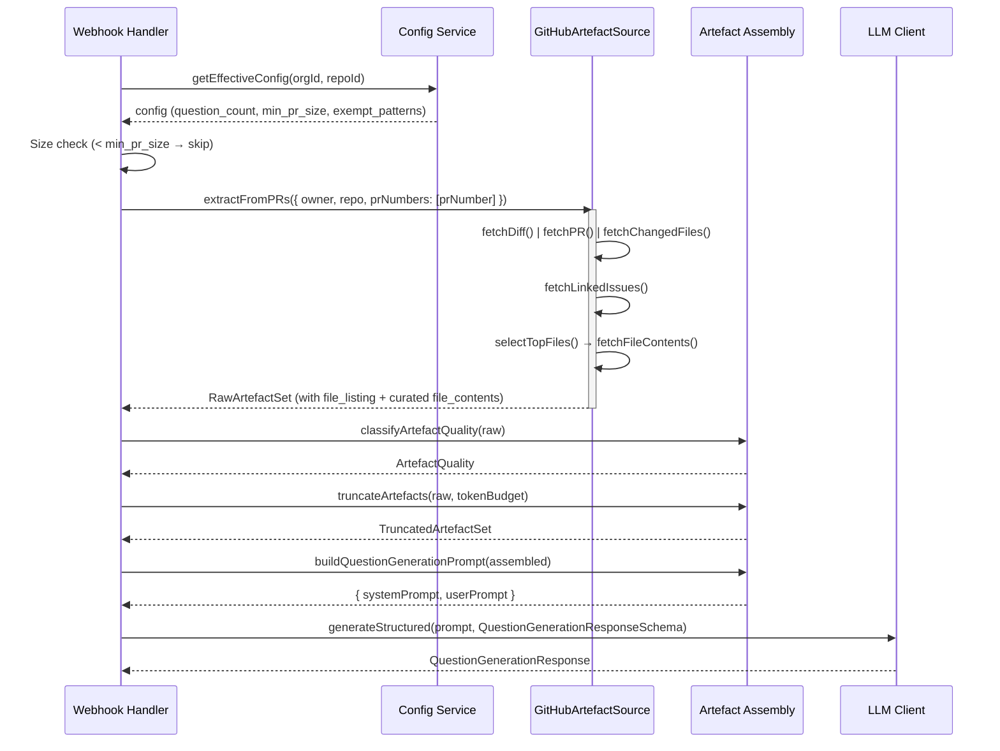
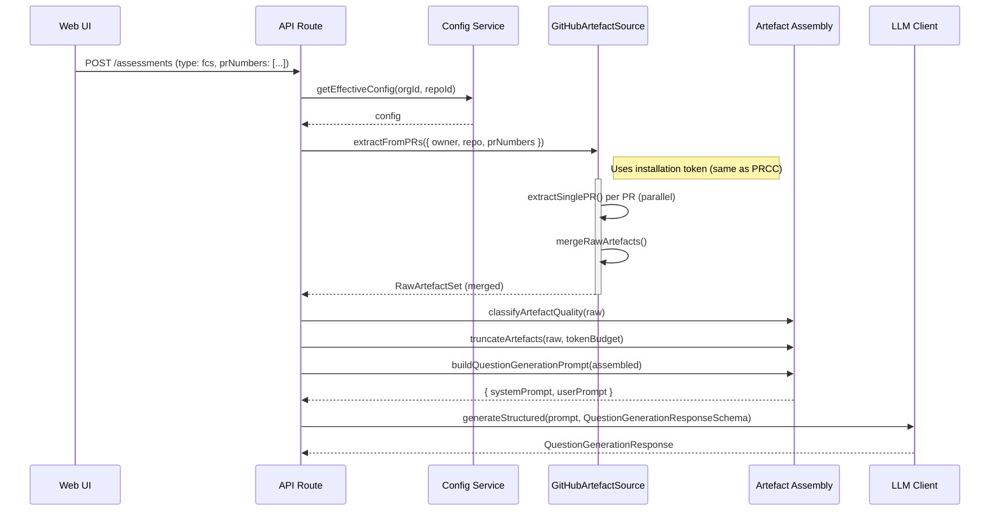

# Low-Level Design: Artefact Pipeline

## Document Control

| Field | Value |
|-------|-------|
| Version | 0.2 |
| Status | Draft |
| Author | LS / Claude |
| Created | 2026-03-13 |
| Parent | [v1-design.md](v1-design.md) section 4.6 |
| Stories | 4.1 (Question Generation), 2.2 (PR Context Extraction), 3.1 (FCS Artefact Selection) |

---

## 1. Overview

This document details the internal design of the artefact pipeline — the system that
sources development artefacts from GitHub and assembles them into prompt-ready input
for the assessment engine. It extends the L4 contracts in the main design doc with
implementation-level structure.

**Two concerns, two layers:**

| Layer | Responsibility | Location | Dependencies |
|-------|---------------|----------|-------------|
| **Extraction** | Fetch raw data from GitHub API | `src/lib/github/` | Octokit, GitHub tokens |
| **Assembly** | Classify, budget, format into prompt input | `src/lib/engine/prompts/` | Pure logic, no I/O |

The engine depends on extraction via a port interface (dependency inversion).
Extraction is an adapter that implements that port.

---

## 2. Artefact Extraction (GitHub Adapter)

### 2.1 Port Interface

The engine defines what it needs. The GitHub adapter implements it.

```typescript
// src/lib/engine/ports/artefact-source.ts

interface ArtefactSource {
  extractFromPRs(params: PRExtractionParams): Promise<RawArtefactSet>;
}

interface PRExtractionParams {
  owner: string;
  repo: string;
  prNumbers: number[];  // single PR = [42], FCS = [42, 43, 44]
}
```

### 2.2 GitHub Adapter

Implements `ArtefactSource` using Octokit. Artefact extraction only requires
read access to PRs, contents, and issues — all covered by the **installation
token** (GitHub App JWT exchange). This applies to both PRCC and FCS flows,
since the app is installed on the target repository in both cases.

The adapter receives an installation-authenticated Octokit instance.

```typescript
// src/lib/github/artefact-source.ts

class GitHubArtefactSource implements ArtefactSource {
  constructor(private readonly octokit: Octokit) {}

  async extractFromPRs(params: PRExtractionParams): Promise<RawArtefactSet> {
    // Extract from each PR in parallel, then merge
    const perPR = await Promise.all(
      params.prNumbers.map(prNumber =>
        this.extractSinglePR(params.owner, params.repo, prNumber)
      )
    );
    const artefactType = params.prNumbers.length === 1
      ? 'pull_request'
      : 'feature';
    return mergeRawArtefacts(perPR, artefactType);
  }

  // Internal — fetches artefacts for a single PR
  private async extractSinglePR(
    owner: string, repo: string, prNumber: number,
  ): Promise<RawArtefactSet> {
    const [diff, pr, changedFiles] = await Promise.all([
      this.fetchDiff(owner, repo, prNumber),
      this.fetchPR(owner, repo, prNumber),
      this.fetchChangedFiles(owner, repo, prNumber),  // file listing with stats
    ]);
    const linkedIssues = await this.fetchLinkedIssues(owner, repo, pr.body);

    // Build lightweight file listing (always included — cheap, high value)
    const fileListing = changedFiles.map(f => ({
      path: f.filename,
      additions: f.additions,
      deletions: f.deletions,
      status: f.status,  // added, modified, removed, renamed
    }));

    // Full content only for top N files by lines changed (selective fetch)
    const topFiles = this.selectTopFiles(changedFiles, { maxFiles: 10 });
    const fileContents = await this.fetchFileContents(owner, repo, pr.head.sha, topFiles);
    const testFiles = this.filterTestFiles(fileContents);
    const sourceFiles = this.filterSourceFiles(fileContents);

    return {
      artefact_type: 'pull_request',
      pr_description: pr.body ?? undefined,
      pr_diff: diff,
      file_listing: fileListing,
      file_contents: sourceFiles,
      test_files: testFiles,
      linked_issues: linkedIssues,
    };
  }
}
```

### 2.3 GitHub API Calls

| Data | API Endpoint | Notes |
|------|-------------|-------|
| Unified diff | `GET /repos/{owner}/{repo}/pulls/{pull_number}` with `Accept: application/vnd.github.diff` | Raw diff text |
| PR metadata | `GET /repos/{owner}/{repo}/pulls/{pull_number}` | Title, body, head SHA, author, reviewers |
| File listing + stats | `GET /repos/{owner}/{repo}/pulls/{pull_number}/files` | Paginated. Returns filename, status, additions, deletions per file. Cheap — always fetched. |
| File contents (selective) | `GET /repos/{owner}/{repo}/contents/{path}?ref={sha}` | Per-file, base64 encoded. Only fetched for top N files by lines changed. |
| Linked issues | Parse PR body for `closes #N`, `fixes #N` patterns, then `GET /repos/{owner}/{repo}/issues/{issue_number}` | Best-effort; not all issues are linked explicitly |

**Note:** The file listing endpoint returns stats (additions/deletions) for all
changed files without fetching content. This enables the adapter to select which
files deserve full content fetches, reducing both API calls and token usage.
A future optimisation could use the GitHub GraphQL API to fetch PR metadata,
file listing, and linked issues in a single query — reducing 3+ REST calls to
one. The diff still requires REST (Accept header), but this is a single
additional call alongside the GraphQL query.

### 2.4 File Filtering

Test files are identified by path pattern matching against configurable patterns.
Default heuristic:

```typescript
const DEFAULT_TEST_PATTERNS = [
  /^tests?\//,           // tests/ or test/
  /\.test\.[jt]sx?$/,    // *.test.ts, *.test.js
  /\.spec\.[jt]sx?$/,    // *.spec.ts, *.spec.js
  /__tests__\//,         // __tests__/
];
```

Exempt file patterns (from `org_config.exempt_file_patterns`) are excluded entirely —
they do not appear in `file_contents` or `test_files`.

### 2.5 Supplementary Context Files

Good comprehension questions — especially for design justification — require
context beyond what's in the PR itself: requirements documents, design docs, ADRs.
These are not part of the PR diff but live in the repo.

**Configuration:** During repo setup, the Org Admin specifies supplementary context
paths — glob patterns pointing to files that should be included alongside PR
artefacts. Stored in `org_config`:

```typescript
// Example configuration
context_file_patterns: [
  'docs/requirements/*.md',
  'docs/design/*.md',
  'docs/adr/*.md',
]
```

**Extraction:** The adapter fetches matching files from the repo (at HEAD of the
target branch) and includes them in `RawArtefactSet` as a new field:
`context_files: ArtefactFile[]`.

**V1 approach — no caching.** Context files are fetched fresh on every assessment
creation. This is simple, always correct, and avoids cache invalidation complexity.
The token cost is acceptable: design docs and requirements are typically small
compared to source code. If context files are large, the truncation pipeline
handles them like any other artefact.

**Quality impact:** Including context files elevates artefact quality classification.
When context files are present, the quality can reach `code_requirements_and_design`
— making that label accurate rather than aspirational.

### 2.6 Multi-PR Merge Strategy (FCS)

When extracting from multiple PRs for an FCS assessment:

1. **Diffs** — concatenated with PR header separators (`## PR #42: Title`)
2. **File listing** — deduplicated by path; if the same file appears in multiple PRs,
   aggregate additions/deletions across PRs
3. **File contents** — deduplicated by path. If the same file is modified in PR #42
   and PR #45, include the version from the latest PR (by merge date). Rationale:
   the latest version reflects the final state of the feature.
4. **Descriptions** — concatenated with PR number headers. Each PR's description
   adds context; they are not merged into one.
5. **Linked issues** — deduplicated by issue number. An issue linked from multiple
   PRs is included once.
6. **Test files** — deduplicated by path (latest version wins, same as file contents)
7. **Context files** — fetched once (they are repo-level, not PR-specific)

**Token budget concern:** With N PRs, diffs and descriptions grow linearly. The
truncation pipeline (section 3.4) applies globally after merge — it doesn't
matter how many PRs contributed. Large features (many PRs) will naturally hit
the token budget and get truncated by priority. The file listing remains small
regardless of PR count, giving the LLM scope awareness even when content is
truncated.


---

## 3. Artefact Assembly (Engine Logic)

### 3.1 Data Flow

```
RawArtefactSet (from extraction)
  │
  ▼
classifyArtefactQuality()  →  ArtefactQuality enum
  │
  ▼
truncateArtefacts()        →  AssembledArtefactSet (fits token budget)
  │
  ▼
buildQuestionGenerationPrompt()  →  { systemPrompt, userPrompt }
  │
  ▼
LLMClient.generateStructured()
```

### 3.2 Types

```typescript
// src/lib/engine/prompts/artefact-types.ts

interface ArtefactFile {
  path: string;         // e.g. 'src/lib/engine/scoring.ts'
  content: string;      // full file content or truncated
}

interface FileListingEntry {
  path: string;         // e.g. 'src/lib/engine/scoring.ts'
  additions: number;    // lines added
  deletions: number;    // lines removed
  status: string;       // 'added' | 'modified' | 'removed' | 'renamed'
}

interface LinkedIssue {
  title: string;
  body: string;
}

// Raw artefacts as extracted from GitHub — before token budgeting
interface RawArtefactSet {
  artefact_type: 'pull_request' | 'feature';
  pr_description?: string;
  pr_diff: string;
  file_listing: FileListingEntry[];  // all changed files (lightweight, always present)
  file_contents: ArtefactFile[];     // curated subset — top N files by lines changed
  test_files?: ArtefactFile[];       // curated subset — top N test files
  linked_issues?: LinkedIssue[];
  context_files?: ArtefactFile[];    // supplementary docs (design, requirements, ADRs)
}

// Token-budgeted artefacts ready for prompt assembly
interface AssembledArtefactSet extends RawArtefactSet {
  question_count: number;           // 3–5, from effective config
  artefact_quality: ArtefactQuality;  // classified from available artefacts
  token_budget_applied: boolean;    // true if any truncation occurred
  truncation_notes?: string[];      // human-readable notes on what was truncated/dropped
}
```

**Key design choice:** The diff is always included in full (it's the primary
artefact). `file_listing` is always included as a lightweight index of all changed
files. `file_contents` is a **curated subset** — the adapter selects the top N
most substantive files (by lines changed) for full content fetching. This avoids
fetching and sending full content for every changed file, which would be wasteful
for large PRs. The LLM sees the full diff for all files, the listing for scope
awareness, and full content only where it adds the most value. This is the natural
seam for Option C evolution (ADR 0011): give the LLM a tool to fetch additional
files from the listing on demand.

### 3.3 Artefact Quality Classification

Pure function, no I/O. Determines what categories of artefacts are present using
a lookup table keyed on three boolean flags: `hasTests`, `hasRequirements`,
`hasDesignDocs`.

```typescript
type QualityKey = `${boolean}-${boolean}-${boolean}`;

/** Key: hasTests-hasRequirements-hasDesignDocs */
const qualityMap: Record<QualityKey, ArtefactQuality> = {
  'true-true-true':   'code_requirements_and_design',
  'true-true-false':  'code_and_requirements',
  'true-false-true':  'code_and_design',
  'true-false-false': 'code_and_tests',
  'false-true-true':  'code_requirements_and_design',
  'false-true-false': 'code_and_requirements',
  'false-false-true': 'code_and_design',
  'false-false-false': 'code_only',
};

function classifyArtefactQuality(artefacts: RawArtefactSet): ArtefactQuality {
  const hasTests = (artefacts.test_files?.length ?? 0) > 0;
  const hasRequirements =
    (artefacts.pr_description?.length ?? 0) > 0 ||
    (artefacts.linked_issues?.length ?? 0) > 0;
  const hasDesignDocs = (artefacts.context_files?.length ?? 0) > 0;

  return qualityMap[`${hasTests}-${hasRequirements}-${hasDesignDocs}`];
}
```

**Five quality levels:** `code_only`, `code_and_tests`, `code_and_requirements`,
`code_and_design`, `code_requirements_and_design`. The `code_and_design` variant
distinguishes design docs (`context_files`) from requirements (`pr_description`,
`linked_issues`). Tests do not upgrade the quality tier when requirements or
design docs are present — they add coverage evidence but don't change the
artefact category for question generation purposes.

Token budget concerns are handled by the truncation pipeline: if context files
are large, they are truncated by the same priority ordering as other artefacts.

### 3.4 Token Budget and Truncation

**Strategy:** Fit artefacts within a configurable token budget. Default: 100,000
tokens (conservative for Claude's 200k context window, leaving room for system
prompt, response, and safety margin).

**Priority ordering** (from requirements Story 4.1 and issue #25):

| Priority | Artefact | Rationale |
|----------|---------|-----------|
| 1 (highest) | `pr_description` | Concise, high signal-to-noise |
| 2 | `linked_issues` | Requirements context |
| 3 | `file_listing` | Lightweight scope awareness — always included |
| 4 | `context_files` | Design/requirements docs — high value for design justification questions |
| 5 | `pr_diff` | Shows what changed with context |
| 6 | `file_contents` | Full context for top files — curated subset |
| 7 (lowest) | `test_files` | Useful but expendable |

Priorities 1–3 are small and always included in full. Truncation applies to
priorities 4–7 when the total exceeds the token budget.

**Algorithm:**

```typescript
function truncateArtefacts(
  raw: RawArtefactSet,
  options: TruncationOptions,
): AssembledArtefactSet {
  // 1. Deduct high-priority items (pr_description, linked_issues, file_listing)
  //    — always included even if they exceed budget (soft cap)
  // 2. Clamp remaining budget to zero if high-priority items exceeded it
  // 3. Truncate context_files if they exceed 30% of remaining budget
  // 4. Truncate pr_diff if it exceeds 60% of remaining budget
  // 5. Include file_contents up to 70% of remaining budget — drop from tail
  // 6. Include test_files with whatever budget remains — drop if none left
  // 7. Populate truncation_notes describing what was truncated/dropped
  // 8. Set token_budget_applied = true if any notes were generated
}
```

**Token estimation:** Use a simple heuristic (chars / 4) rather than a tokeniser
dependency. This is conservative and avoids adding `tiktoken` or similar. The exact
count doesn't matter — we're budgeting, not billing.

**File prioritisation within `file_contents`:** Already sorted by lines changed
(most substantive first) by the adapter's `selectTopFiles()`. If the total still
exceeds budget, drop files from the tail. Files exceeding an individual file budget
(e.g. 10k tokens) get truncated with a `... [truncated]` marker.

### 3.5 Prompt Builders

One prompt builder for question generation. It takes an `AssembledArtefactSet` and
returns `{ systemPrompt: string, userPrompt: string }`. The system prompt describes
all three Naur layers; the LLM generates questions across all three in a single call.

**Correction from issue #25:** The issue says "Build three system prompts (one per
Naur layer)". However, the L4 contract (design doc section 4.6) specifies a **single
LLM call** that generates questions across all three layers. The system prompt
describes all three layers; the LLM decides distribution. This matches requirements
Story 4.1: "generates 3-5 questions targeting Naur's three layers". So we build
**one** prompt builder for question generation.

The three separate prompt texts from Story 4.1 in the requirements doc are
**reference material** for what each layer tests — they inform the system prompt
content, but they are not three separate LLM calls.

```typescript
// src/lib/engine/prompts/prompt-builder.ts

interface PromptPair {
  systemPrompt: string;
  userPrompt: string;
}

function buildQuestionGenerationPrompt(
  artefacts: AssembledArtefactSet,
): PromptPair {
  return {
    systemPrompt: QUESTION_GENERATION_SYSTEM_PROMPT,
    userPrompt: formatUserPrompt(artefacts),
  };
}
```

**System prompt structure:**

1. Role assignment — software comprehension assessor
2. Framework — Peter Naur's Theory Building
3. Three layer definitions with example question patterns
4. Output format instructions (JSON schema)
5. Constraints — derive answers strictly from artefacts, flag quality
6. Artefact type context (`pull_request` vs `feature`)

**User prompt structure:**

```
## Assessment Context
- Type: {artefact_type}
- Question count: {question_count}

## PR Description
{pr_description}

## Linked Issues
### Issue: {title}
{body}

## Changed Files Overview
| File | Status | +/- |
|------|--------|-----|
| {path} | {status} | +{additions} -{deletions} |

## Context Documents
### {path}
{content}

## Code Diff
{pr_diff}

## Full File Contents (selected)
### {path}
{content}

## Test Files (selected)
### {path}
{content}

## Truncation Notice
Some artefacts were truncated or dropped to fit the token budget:
- {truncation_notes[]}
Derive your reference answers only from the artefacts provided.
Note any limitations caused by truncation.
```

Sections are omitted if the corresponding artefact is absent (e.g. no linked
issues section if `linked_issues` is empty, no truncation notice if nothing was
truncated). Context documents appear before the code diff so the LLM has design
context before seeing the changes. The "Changed Files Overview" gives the LLM
scope awareness of all changes even when full content is only provided for a
subset.

**Future improvements:**

- **Dogfooding / prompt testing** — Before the product is live, we can validate
  our prompt templates by manually running them against our own project's PRs.
  This is essentially what the product automates — and confirms the prompts
  produce meaningful comprehension questions.
- **Ad-hoc file selection** — When creating an assessment (especially FCS), allow
  the user to specify additional repo files beyond the configured context paths.
  Useful when specific files are relevant to a feature but not covered by the
  default patterns.

---

## 4. Sequence Diagram: PRCC Artefact Flow



---

## 5. Sequence Diagram: FCS Artefact Flow



---

## 6. Issue Scope Mapping

| Component | Issue | Status |
|-----------|-------|--------|
| `ArtefactFile`, `LinkedIssue`, `RawArtefactSet`, `AssembledArtefactSet` types + Zod schemas | #25 | Current |
| `classifyArtefactQuality()` | #25 | Current |
| `truncateArtefacts()` with priority ordering | #25 | Current |
| `buildQuestionGenerationPrompt()` + system/user prompt text | #25 | Current |
| `ArtefactSource` port interface | New issue needed | — |
| `GitHubArtefactSource` adapter (Octokit) | New issue needed | — |
| Multi-PR merge strategy | New issue needed (or part of GH adapter) | — |

---

## 7. Security and Data Trust Model

The artefact pipeline reads source code from customer repositories. This section
documents the trust guarantees we make about how that data is handled.

### 7.1 Access Scope

- **Read-only permissions.** The GitHub App requests `pull_requests: read`,
  `contents: read`, and `metadata: read`. No write access to code, branches,
  or repository settings.
- **Explicit repository selection.** The Org Admin chooses which repositories the
  app can access during installation. The app cannot see repositories it has not
  been granted access to.
- **Installation token scope.** Each API call uses a short-lived installation token
  (expires after 1 hour) scoped to the granted repositories. No long-lived
  credentials are stored for repo access.

### 7.2 Data Lifecycle

| Data | Retention | Storage |
|------|-----------|---------|
| Raw artefacts (diffs, file contents, descriptions) | **Transient only** — held in memory during assessment creation, never persisted | Application memory |
| File listing (paths, line counts) | **Transient only** | Application memory |
| Generated rubric (questions, reference answers, weights) | **Persisted** — stored in Supabase | `assessment_questions` table |
| Artefact quality classification | **Persisted** — metadata flag | `assessments.artefact_quality` |
| Participant answers and scores | **Persisted** | `participant_answers` table |

**Key guarantee:** Raw source code is never stored in our database. Only the
derived rubric (questions and reference answers) is persisted. The reference
answers are short-form text derived from the artefacts, not code excerpts.

### 7.3 Third-Party Data Handling

Artefacts are sent to the Anthropic Claude API for question generation and scoring.

- Anthropic's API does not use customer data for model training (per their
  commercial terms).
- API requests are encrypted in transit (TLS).
- Anthropic retains API inputs/outputs for up to 30 days for trust and safety
  purposes (abuse detection), unless the customer has a Zero Data Retention
  agreement.
- For enterprise customers requiring stricter guarantees, a Zero Data Retention
  arrangement with Anthropic can be explored.

### 7.4 Future Considerations

**Target market note:** Security-conscious engineering organisations (finance,
healthcare, enterprise) are likely the primary audience for this product — teams
that care enough about code comprehension to measure it are also teams that care
about how their code is handled. The extraction strategy should evolve with this
audience in mind.

- **GitHub Action artefact collector (likely V2)** — A published GitHub Action
  (`uses: leonids2005/fcs-artefact-collector@v1`) that runs in the customer's own
  CI environment on `pull_request` events. It checks out the repo (already
  available in CI), collects diff, metadata, file contents, and linked issues,
  zips them, and uploads as a workflow artifact. Our app then downloads the
  artifact via the GitHub API — no direct code access needed. Benefits:
  - Code never leaves GitHub's infrastructure until it reaches the LLM
  - Customer controls what runs in their pipeline (auditable)
  - Full repo context available (can include non-diff files)
  - Our app only needs artifact download permissions, not contents read
  - Pairs well with enterprise security review processes

  Trade-off: Adds onboarding friction (user must add a workflow step). V1 stays
  zero-friction (API-based); the Action becomes an opt-in "enhanced mode" for
  organisations that require it. Both produce the same `RawArtefactSet` — the
  `ArtefactSource` port abstracts the difference.

- **Repo cloning** — A future optimisation could use shallow clones (`git clone
  --depth 1`) instead of per-file API fetches. This would execute within an
  ephemeral container (Cloud Run) with no persistent disk. The clone would be
  read-only and discarded after artefact extraction. Same trust model as API
  fetches — no code is persisted.
- **User-facing trust page** — A public-facing security/trust documentation page
  should be created for the product, summarising these guarantees for prospective
  customers. (See #33.)

---

## 8. Open Questions

1. **Token estimation accuracy** — Is `chars / 4` sufficient, or should we use a
   lightweight tokeniser? The budget is generous (100k of 200k), so rough estimation
   should be safe for V1.

2. ~~**Design document artefacts**~~ — **Resolved.** Supplementary context files
   (section 2.5) address this. Org Admin configures paths to design/requirements
   docs during repo setup. These are included as `context_files` in the artefact
   set and elevate quality classification to `code_requirements_and_design`.

3. **FCS multi-PR token budget** — With multiple PRs, the total artefact size grows
   linearly. Global truncation across all merged PRs (not per-PR budgets) is the
   current approach. Is this sufficient?

4. **Top N file count** — Default `maxFiles: 10` for full content fetching. Is this
   the right number? Too few and the LLM lacks context; too many and we waste tokens
   on low-value files. Configurable per org, or fixed for V1?
