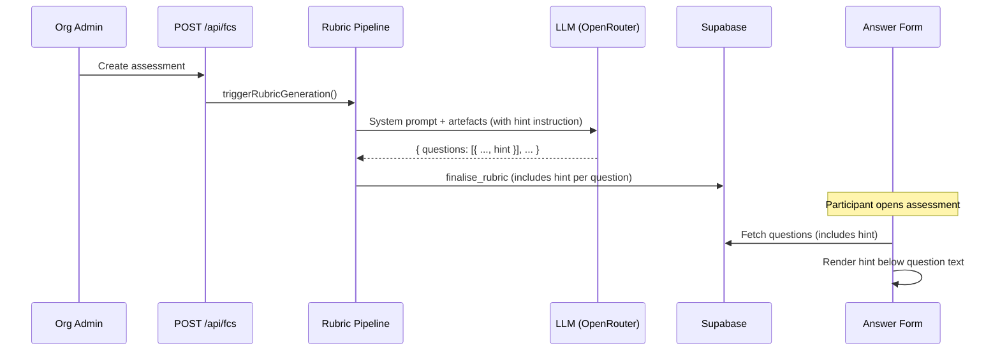

# LLD — E1: Answer Guidance Hints (#214)

## Change Log

| Date | Author | Changes |
|------|--------|---------|
| 2026-04-14 | Claude | Initial LLD |

## Part A — Human-Reviewable

### Purpose

Extend the rubric generation pipeline to produce a `hint` field per question — a short guidance sentence shown to participants indicating expected answer depth and format, without revealing the reference answer. Addresses the calibration failure observed in the 2026-04-13 assessment where participants wrote 5–10 word answers against paragraph-length reference answers.

### Behavioural Flows



### Invariants

| # | Invariant | Verification |
|---|-----------|-------------|
| 1 | Hints never reveal reference answer content | LLM prompt constraint + manual review of generated output |
| 2 | Hint generation failure does not block rubric generation | Unit test: null hint accepted by schema |
| 3 | Existing assessments with no hints render correctly | Unit test: null hint → no hint UI element |
| 4 | Hint max length ≤ 200 characters | Zod schema constraint on `QuestionSchema` |

### Acceptance Criteria

1. Each generated question includes an optional `hint` string field.
2. Hints describe expected answer format/depth without revealing reference answer content.
3. Hints are 1–2 sentences, max 200 characters.
4. Hint generation failure (null) does not block rubric generation.
5. `assessment_questions` table has a nullable `hint` column.
6. Hints are displayed below question text in the answer form, in muted style.
7. Null hints render no UI element — no empty space.
8. Hints appear on the results page alongside questions and reference answers.

---

## Part B — Agent-Implementable

### Story 1.1: Generate hints in rubric pipeline

**Layer:** Engine (pure domain logic)

**Files to modify:**

- `src/lib/engine/llm/schemas.ts` — add optional `hint` field to `QuestionSchema`
- `src/lib/engine/prompts/prompt-builder.ts` — add hint generation instruction to system prompt

#### Schema change (`schemas.ts`)

Add `hint` to the `QuestionSchema` Zod object:

```typescript
// In QuestionSchema, after reference_answer:
hint: z.string().max(200).nullable().optional(),
```

Update the `Question` type (inferred from schema) — no manual type needed.

#### Prompt change (`prompt-builder.ts`)

Add to `QUESTION_GENERATION_SYSTEM_PROMPT`, in the Output Format section, after the `reference_answer` field description:

```
- hint: A 1–2 sentence guidance hint (max 200 characters) shown to participants alongside the question. The hint describes the expected answer depth and format (e.g. "Describe 2–3 specific scenarios and explain the design rationale") WITHOUT revealing any content from the reference answer. If you cannot generate a suitable hint, set it to null.
```

Add to the JSON schema example in the prompt:

```json
"hint": "Describe 2–3 scenarios and explain the design rationale"
```

#### BDD specs

```
describe('QuestionSchema')
  it('accepts a question with a valid hint string')
  it('accepts a question with hint set to null')
  it('accepts a question with hint omitted')
  it('rejects a hint longer than 200 characters')

describe('buildQuestionGenerationPrompt')
  it('includes hint generation instruction in system prompt')
```

#### Test files

- `tests/lib/engine/llm/schemas.test.ts` (existing or new)
- `tests/lib/engine/prompts/prompt-builder.test.ts` (existing or new)

---

### Story 1.2: Store hints in assessment questions

**Layer:** Database + RPC

**Files to modify:**

- `supabase/schemas/tables.sql` — add `hint` column to `assessment_questions`
- `supabase/schemas/functions.sql` — update `finalise_rubric` to insert `hint`

#### Schema change (`tables.sql`)

Add to `assessment_questions` table definition, after `reference_answer`:

```sql
hint text,
```

Nullable, no default. Existing rows get `NULL`.

#### RPC change (`functions.sql`)

Update `finalise_rubric` to include `hint` in the INSERT:

```sql
INSERT INTO assessment_questions (
  org_id, assessment_id, question_number,
  naur_layer, question_text, weight, reference_answer, hint
)
SELECT p_org_id, p_assessment_id,
  (q->>'question_number')::integer, q->>'naur_layer',
  q->>'question_text', (q->>'weight')::integer, q->>'reference_answer',
  q->>'hint'
FROM jsonb_array_elements(p_questions) AS q;
```

#### Migration

Generate via `npx supabase db diff -f add-hint-and-comprehension-depth`. Single migration for both E1 and E2 schema changes (see E2 LLD).

#### BDD specs

```
describe('finalise_rubric RPC')
  it('stores hint value when present in question JSON')
  it('stores NULL hint when hint is absent from question JSON')
  it('preserves existing questions without hint column (backward compat)')
```

#### Test files

- `tests/app/api/fcs.test.ts` (integration — verify hint flows through to DB)

---

### Story 1.3: Display hints in participant answer form

**Layer:** Frontend (React components)

**Files to modify:**

- `src/components/question-card.tsx` — add optional `hint` prop, render below question text
- `src/app/assessments/[id]/answering-form.tsx` — pass `hint` from question data to `QuestionCard`
- `src/app/assessments/[id]/results/page.tsx` — display hint alongside question on results page
- `src/app/api/assessments/[id]/route.ts` or helpers — include `hint` in question response

#### QuestionCard change

Add `hint` prop to `QuestionCardProps`:

```typescript
readonly hint: string | null;
```

Render conditionally between question text and the relevance warning:

```tsx
{hint && (
  <p className="text-caption text-text-secondary italic">{hint}</p>
)}
```

#### AnsweringForm change

The `Question` interface used in `AnsweringFormProps` gains `hint: string | null`. Pass it through to `QuestionCard`.

#### Results page change

In the question list rendering, after the question text and before the reference answer details, render the hint in the same muted style when non-null.

#### API response change

Ensure `GET /api/assessments/[id]` includes `hint` in the `FilteredQuestion` type returned for each question. The field is already in the DB row type — verify the select query includes it.

#### BDD specs

```
describe('QuestionCard')
  it('renders hint text below question when hint is non-null')
  it('renders no hint element when hint is null')
  it('renders hint before the answer textarea')
  it('renders hint in muted/italic style')

describe('Results page')
  it('displays hint alongside question text when hint is non-null')
  it('displays no hint when hint is null')
```

#### Test files

- `tests/components/question-card.test.tsx` (new or existing)
- E2E coverage deferred — manual verification sufficient for styling.

---

### Implementation sequence

1. **Story 1.1** — schema + prompt (engine layer, no DB dependency)
2. **Story 1.2** — DB column + RPC (combined migration with E2 Story 2.1)
3. **Story 1.3** — UI display (needs both 1.1 and 1.2 complete)
