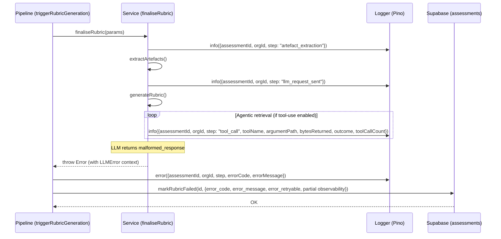
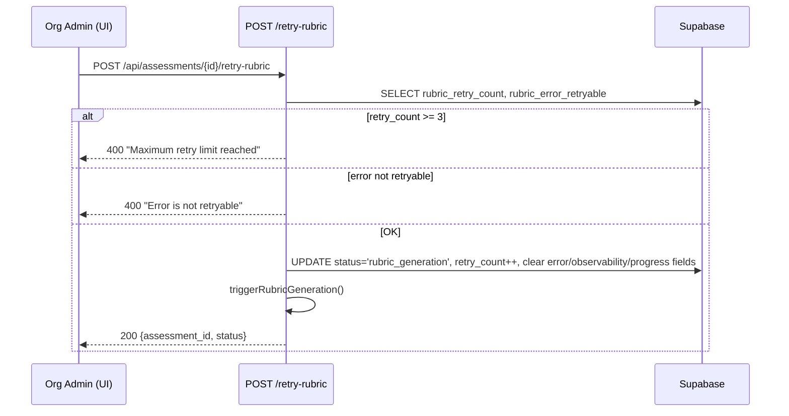
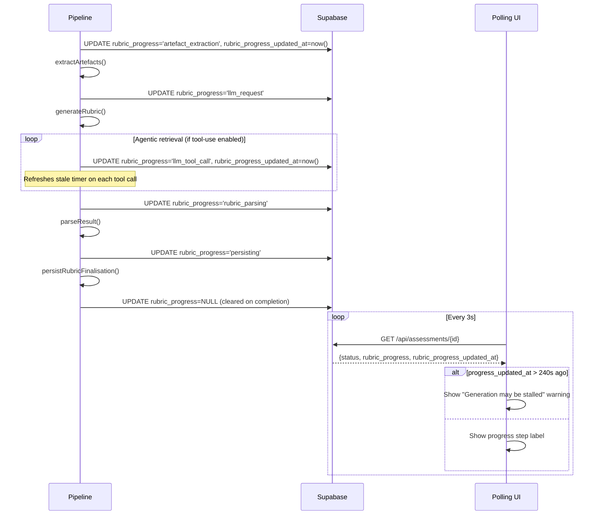
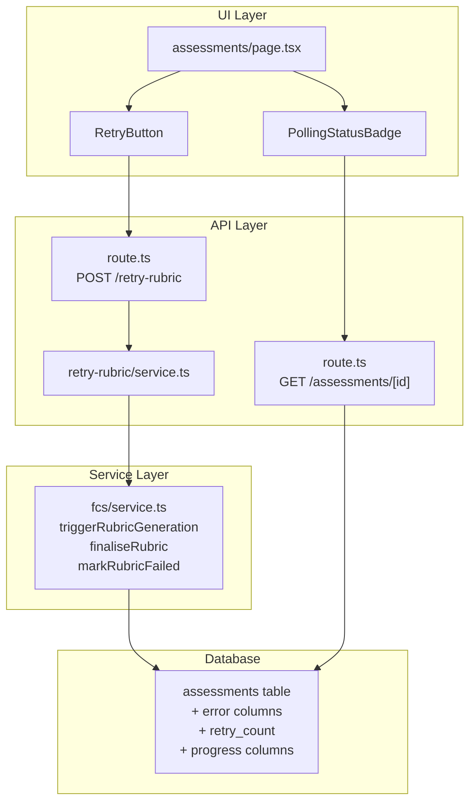

# LLD — Epic 18: Pipeline Observability & Recovery

**Epic:** #271
**Requirements:** `docs/requirements/v2-requirements.md` — Epic 18
**HLD reference:** `docs/design/v1-design.md` §3 (Assessment Lifecycle)

## Change log

| Date | Author | Changes |
|------|--------|---------|
| 2026-04-20 | LS / Claude | Initial LLD — Stories 18.1, 18.2, 18.3 |
| 2026-04-20 | LS / Claude | Added agentic retrieval tool-call logging (18.1) and `llm_tool_call` progress step (18.3). `onToolCall` callback injected into tool loop for structured logging + progress refresh. |
| 2026-04-20 | LS / Claude | Post-implementation sync (issue #274, PR #276): updated §18.3 to reflect `updateProgress` signature change (added `orgId` for tenant-scoping), `pendingWrites` flush pattern replacing fire-and-forget void, and LLD-deviation helpers (`makeToolCallProgressHandler`, `extractArtefacts`, `toSnapshot`). |
| 2026-04-20 | LS / Claude | Post-implementation sync (issue #272, PR #275): §18.1 — `markRubricFailed` now takes `orgId` (ADR-0025) and clears `rubric_progress` via `buildFailureUpdate`; helper renamed `extractLlmError` → `toFailureDetails`; `malformed_response` warn log carries `LLMError` fields instead of raw response shape. |
| 2026-04-21 | LS / Claude | Post-implementation sync (issue #273, PR #277): §18.2 — initial assessment SELECT switched from `ctx.adminSupabase` to `ctx.supabase` (RLS-scoped) to prevent cross-org existence leaks; `retriggerRubricForAssessment` update now scoped by both `id` and `org_id` (ADR-0025); private helpers `buildRetryResetUpdate` and `getDisabledReason` extracted to keep callers under the 20-line body budget (with `// Justification:` comments); error-display format deviated from the inline `Failed: malformed_response` example — rendered as two adjacent elements (`<StatusBadge>` + error-code span) to avoid hard-coding literal text in the badge; added exported constant `MAX_RUBRIC_RETRIES = 3` in `src/app/api/fcs/service.ts`. |
| 2026-04-21 | LS / Claude | Post-implementation sync (issue #281, PR #284): §18.3 — added explicit activation rule for `PollingStatusBadge` on the list page. The initial implementation gated polling on `?created=<id>` matching the row id, which broke polling on any subsequent visit (navigation, refresh, restart) and after retry. Gate reduced to `status === 'rubric_generation'`. |

---

# Part A — Human-reviewable

## Purpose

Close the observability gap in the rubric-generation pipeline. Today, when generation fails the admin sees "Failed" with no explanation, no diagnostic trail, and no retry guardrails. This epic:

1. **18.1** — Captures error details and partial observability on failure, adds structured pipeline step logging.
2. **18.2** — Surfaces error details in the UI, adds retry count limits and retryable checks.
3. **18.3** — Shows real-time pipeline progress and detects stalled generation.

## Behavioural flows

### 18.1 — Error capture on pipeline failure



### 18.2 — Retry with guardrails



### 18.3 — Progress visibility



## Structural overview



## Invariants

| # | Invariant | Verification |
|---|-----------|-------------|
| I1 | Error fields are only populated when `status = 'rubric_failed'` | Unit test: markRubricFailed sets error fields; retry clears them |
| I2 | `rubric_retry_count` monotonically increases; never decremented | Unit test: retriggerRubricForAssessment increments count |
| I3 | `rubric_retry_count` capped at 3; API rejects retry beyond | Unit test: retryRubricGeneration returns 400 at count >= 3 |
| I4 | Non-retryable errors cannot be retried via API | Unit test: retryRubricGeneration returns 400 when retryable = false |
| I5 | `rubric_progress` is cleared to null on completion (success or failure) | Unit test: both finaliseRubric and markRubricFailed clear progress |
| I6 | Every structured log entry includes `assessmentId` and `orgId` | Grep test: all logger calls in pipeline include both fields |
| I7 | Retry clears all previous-attempt tracking data | Unit test: status reset clears error, observability, and progress fields |
| I8 | `onToolCall` is only invoked for successful tool executions, not breaches | Unit test: breach paths (budget/iteration limit) do not invoke callback |
| I9 | `onToolCall` callback is optional — tool loop works without it | Unit test: `generateWithTools` without `onToolCall` behaves identically to current |

---

# Part B — Agent-implementable

## Story 18.1: Pipeline Error Capture & Structured Logging

### Schema changes

Add to `supabase/schemas/tables.sql` on the `assessments` table, after the existing observability columns (line 166):

```sql
-- Pipeline error capture (V2 Epic 18). Populated on rubric_failed status.
-- See docs/design/lld-e18.md §18.1.
rubric_error_code        text,
rubric_error_message     text,
rubric_error_retryable   boolean,
```

### Files to modify

| File | Change |
|------|--------|
| `supabase/schemas/tables.sql` | Add 3 error columns to `assessments` |
| `src/app/api/fcs/service.ts` | Extend `markRubricFailed` signature; add partial observability persistence on failure; add structured step logging; wire `onToolCall` callback |
| `src/lib/engine/llm/tools.ts` | Add optional `onToolCall` callback to `GenerateWithToolsRequest` |
| `src/lib/engine/llm/tool-loop.ts` | Invoke `onToolCall` after each tool call completes in `processOneToolCall` |
| `src/lib/engine/pipeline/assess-pipeline.ts` | Propagate `LLMError` from `generateRubric` failure path (if not already surfaced) |

### Internal decomposition

#### `markRubricFailed` extension

Current signature:
```typescript
async function markRubricFailed(
  adminSupabase: ServiceClient,
  assessmentId: AssessmentId,
): Promise<void>
```

New signature:
```typescript
interface RubricFailureDetails {
  errorCode: LLMErrorCode;
  errorMessage: string;
  errorRetryable: boolean;
  partialObservability?: Partial<RubricObservability>;
}

async function markRubricFailed(
  adminSupabase: ServiceClient,
  assessmentId: AssessmentId,
  orgId: OrgId,
  details?: RubricFailureDetails,
): Promise<void>
```

The `details` parameter is optional for backward compatibility with non-LLM failures (e.g. GitHub API errors). When provided, persists:
- `rubric_error_code` — from `details.errorCode`
- `rubric_error_message` — `details.errorMessage.slice(0, 1000)`
- `rubric_error_retryable` — from `details.errorRetryable`
- `rubric_input_tokens`, `rubric_output_tokens`, `rubric_tool_call_count`, `rubric_tool_calls`, `rubric_duration_ms` — from `details.partialObservability` if present

> **Implementation note (issue #272):** `markRubricFailed` now takes `orgId` and filters its UPDATE by both `.eq('id', assessmentId).eq('org_id', orgId)` as defence-in-depth against service-role RLS bypass. See [ADR-0025](../adr/0025-service-role-writes-require-org-scoping.md).

Also clears `rubric_progress` and `rubric_progress_updated_at` to `null` (invariant I5). After the rebase onto E18.3, `buildFailureUpdate` always emits these two fields as `null` in the base patch, so every failure path — LLM, GitHub, or generic — clears progress in a single UPDATE.

#### `triggerRubricGeneration` catch block

Extend the catch block to extract `LLMError` from the thrown error and pass it to `markRubricFailed`:

```typescript
catch (err) {
  const details = toFailureDetails(err);
  logger.error({ err, assessmentId, orgId }, 'triggerRubricGeneration: failed');
  await markRubricFailed(adminSupabase, assessmentId, orgId, details);
}
```

`toFailureDetails` is a small helper: if `err` is a `RubricGenerationError`, it builds a `RubricFailureDetails` shape (the exact shape `markRubricFailed` needs) directly from `err.llmError` and `err.partialObservability`. Otherwise it returns `undefined`.

> **Implementation note (issue #272):** Named `toFailureDetails` (not `extractLlmError`) and returns `RubricFailureDetails` directly rather than an intermediate `LLMError`. This removes one conversion hop in the caller and keeps `triggerRubricGeneration`'s catch block within the 20-line body budget.

The service layer also extracts a handful of small private helpers (`makeOnToolCall`, `logResponseReceived`, `failGeneration`, `runGeneration`, `buildFailureUpdate`) so that `finaliseRubric` and `triggerRubricGeneration` stay within CLAUDE.md's 20-line body budget. Each helper has a single responsibility; their role is purely decomposition, not new behaviour.

#### `finaliseRubric` — propagate LLMError

Currently `finaliseRubric` throws a plain `Error` on generation failure:
```typescript
if (result.status === 'generation_failed') throw new Error(`Rubric generation failed: ${result.error.code}`);
```

Change to throw a typed error that carries the `LLMError` and partial observability:

```typescript
class RubricGenerationError extends Error {
  constructor(
    readonly llmError: LLMError,
    readonly partialObservability?: Partial<RubricObservability>,
  ) {
    super(`Rubric generation failed: ${llmError.code}`);
    this.name = 'RubricGenerationError';
  }
}
```

#### Structured logging

Add `logger.info` calls at each pipeline step boundary in `finaliseRubric`:

| Step name | Where | Extra fields |
|-----------|-------|-------------|
| `artefact_extraction` | Before `source.extractFromPRs()` in `triggerRubricGeneration` | — |
| `llm_request_sent` | Before `generateRubric()` in `finaliseRubric` | — |
| `tool_call` | After each tool call completes in the tool-use loop (via `onToolCall` callback) | `toolName`, `argumentPath`, `bytesReturned`, `outcome`, `toolCallCount` |
| `llm_response_received` | After `generateRubric()` returns successfully | `inputTokens`, `outputTokens`, `toolCallCount`, `durationMs` |
| `rubric_parsing` | After `generateRubric()` success, before `persistRubricFinalisation` | — |
| `rubric_persisted` | After `persistRubricFinalisation` returns | — |

All log entries include `{ assessmentId, orgId, step }`.

On `malformed_response` error: log at `warn` level with the raw response shape (top-level keys and types only).

> **Implementation note (issue #272):** The warn log carries `{ errorCode, errorMessage, step }` instead of the raw response shape. By the time `failGeneration` runs, the raw LLM response has already been consumed by the tool loop and only the typed `LLMError` is available on the caught exception. Surfacing the raw response shape would require threading it through `LLMError.context` from the engine layer — deferred until observability needs it.

#### `onToolCall` callback — engine-to-service bridge

The tool-use loop runs inside the engine layer (`src/lib/engine/llm/tool-loop.ts`), which must remain framework-agnostic (no Pino, no Supabase). To enable structured logging and progress updates from inside the loop, add an optional callback to the request:

**In `src/lib/engine/llm/tools.ts`:**

```typescript
export interface ToolCallEvent {
  readonly toolName: string;
  readonly argumentPath: string;
  readonly bytesReturned: number;
  readonly outcome: ToolCallOutcome;
  readonly toolCallCount: number;  // cumulative count so far
}

// Add to GenerateWithToolsRequest:
onToolCall?: (event: ToolCallEvent) => void;
```

**In `src/lib/engine/llm/tool-loop.ts`:**

After the `recordOutcome` call in `processOneToolCall` (for successful tool calls, not breaches), invoke the callback:

```typescript
req.onToolCall?.({
  toolName: tc.function.name,
  argumentPath: input.path,
  bytesReturned: result.bytes,
  outcome: result.kind,
  toolCallCount: state.callCount,
});
```

**In `src/app/api/fcs/service.ts` — wiring the callback:**

When building the `generateRubric` request in `finaliseRubric`, pass an `onToolCall` callback that:
1. Emits a structured log at `info` level with `{ assessmentId, orgId, step: 'tool_call', ...event }` _(18.1 — not yet implemented)_
2. Calls `updateProgress(adminSupabase, assessmentId, orgId, 'llm_tool_call')` to refresh the stale timer (Story 18.3)

```typescript
// 18.3 wires only the progress-refresh side of the callback; 18.1 will add logger.info.
const onToolCall = makeToolCallProgressHandler(
  adminSupabase, assessmentId, orgId, settings.tool_use_enabled, pendingWrites,
);
// ... pass onToolCall into generateRubric, then:
await Promise.allSettled(pendingWrites); // flush before the next step
```

> **Implementation note (issue #274):** the `onToolCall` bridge was landed as part of 18.3 rather than 18.1 because AC-3 of 18.3 requires it first. 18.1 will layer the structured logging onto the same `ToolCallEvent` shape. Also, the original "fire-and-forget with `void`" pattern was replaced by collecting writes into a `pendingWrites` array and flushing with `Promise.allSettled` after `generateRubric` returns — see §18.3 for the race-condition rationale.

**Design constraint:** The `onToolCall` callback is optional. When tools are not enabled or no callback is provided, the tool loop behaves exactly as before. This preserves backward compatibility and keeps the engine layer decoupled from infrastructure.

### BDD specs

```typescript
describe('Story 18.1: Pipeline Error Capture & Structured Logging', () => {
  describe('markRubricFailed', () => {
    it('should persist error code, message, and retryable flag on the assessment row', () => {
      // Given a rubric generation that failed with LLMError { code: 'malformed_response', message: 'Invalid JSON', retryable: true }
      // When markRubricFailed is called with those details
      // Then the assessment row has rubric_error_code='malformed_response', rubric_error_message='Invalid JSON', rubric_error_retryable=true
    });

    it('should truncate error message to 1000 characters', () => {
      // Given an error message longer than 1000 characters
      // When markRubricFailed is called
      // Then rubric_error_message is truncated to 1000 characters
    });

    it('should persist partial observability data when available', () => {
      // Given a failure after LLM response with inputTokens=500, outputTokens=200, durationMs=3000
      // When markRubricFailed is called with partialObservability
      // Then the assessment row has rubric_input_tokens=500, rubric_output_tokens=200, rubric_duration_ms=3000
    });

    it('should clear rubric_progress to null on failure', () => {
      // Given an assessment with rubric_progress='llm_request'
      // When markRubricFailed is called
      // Then rubric_progress is null
    });

    it('should handle calls without details (non-LLM failures)', () => {
      // Given a failure from GitHub API (no LLMError)
      // When markRubricFailed is called without details
      // Then status is rubric_failed, error fields are null
    });
  });

  describe('triggerRubricGeneration error path', () => {
    it('should extract LLMError from RubricGenerationError and pass to markRubricFailed', () => {
      // Given finaliseRubric throws RubricGenerationError with llmError
      // When triggerRubricGeneration catches it
      // Then markRubricFailed receives the error details
    });
  });

  describe('structured logging', () => {
    it('should emit info log at each pipeline step with assessmentId and orgId', () => {
      // Given a successful rubric generation
      // When the pipeline completes
      // Then logger.info was called for steps: artefact_extraction, llm_request_sent, llm_response_received, rubric_parsing, rubric_persisted
    });

    it('should include token counts and duration in llm_response_received log', () => {
      // Given a successful LLM response
      // When the log entry is emitted
      // Then it includes inputTokens, outputTokens, toolCallCount, durationMs
    });

    it('should emit error log with step name and error details on pipeline failure', () => {
      // Given a pipeline failure at the llm_request step
      // When the error is caught
      // Then logger.error includes assessmentId, orgId, step, and error details
    });
  });

  describe('tool-call logging (agentic retrieval)', () => {
    it('should invoke onToolCall callback after each tool call completes', () => {
      // Given tool-use is enabled and onToolCall callback is provided
      // When the LLM makes 3 tool calls
      // Then onToolCall is invoked 3 times with toolName, argumentPath, bytesReturned, outcome, toolCallCount
    });

    it('should emit info log for each tool call with assessmentId and orgId', () => {
      // Given the onToolCall callback is wired in finaliseRubric
      // When a tool call completes
      // Then logger.info is called with step='tool_call', toolName, argumentPath, bytesReturned, outcome, toolCallCount
    });

    it('should not invoke onToolCall for breached tool calls (budget/iteration limit)', () => {
      // Given a tool call that hits the iteration limit
      // When processOneToolCall runs the breach path
      // Then onToolCall is not invoked
    });

    it('should not fail when onToolCall is not provided', () => {
      // Given no onToolCall callback
      // When tool calls complete
      // Then the tool loop runs without error
    });
  });
});
```

### Acceptance criteria

- [ ] `markRubricFailed` persists `rubric_error_code`, `rubric_error_message` (≤ 1000 chars), `rubric_error_retryable` on failure
- [ ] Partial observability (tokens, duration, tool calls) persisted on failure path
- [ ] `rubric_progress` cleared to null on failure
- [ ] Structured log at each pipeline step with `assessmentId`, `orgId`, step name
- [ ] `llm_response_received` log includes token counts and duration
- [ ] `malformed_response` logged at `warn` with response shape (keys/types only)
- [ ] `RubricGenerationError` carries `LLMError` from engine to catch block
- [ ] `onToolCall` callback on `GenerateWithToolsRequest` — invoked after each successful tool call with `ToolCallEvent`
- [ ] Service wires `onToolCall` to emit structured log (`step: 'tool_call'`) with `toolName`, `argumentPath`, `bytesReturned`, `outcome`, `toolCallCount`
- [ ] Schema: 3 new columns on `assessments` table
- [ ] `npx vitest run` passes, `npx tsc --noEmit` passes

---

## Story 18.2: Assessment Retry from UI with Guardrails

### Schema changes

Add to `supabase/schemas/tables.sql` on the `assessments` table, after the error columns:

```sql
rubric_retry_count       integer NOT NULL DEFAULT 0,
```

### Files to modify

| File | Change |
|------|--------|
| `supabase/schemas/tables.sql` | Add `rubric_retry_count` column |
| `src/app/api/assessments/[id]/retry-rubric/service.ts` | Add guardrail checks (retry count, retryable flag) |
| `src/app/api/fcs/service.ts` | `retriggerRubricForAssessment` — increment retry count, clear error/observability/progress fields |
| `src/app/(authenticated)/assessments/page.tsx` | Fetch + display error code alongside "Failed" badge |
| `src/app/(authenticated)/assessments/retry-button.tsx` | Accept guardrail props, disable with messages |

### Internal decomposition

#### Retry API service — guardrail checks

In `src/app/api/assessments/[id]/retry-rubric/service.ts`, add the select to include `rubric_retry_count` and `rubric_error_retryable`. The read goes through the **user-scoped** client so Row Level Security filters by the caller's org memberships — `adminSupabase` would bypass RLS and leak cross-org assessment existence before `assertOrgAdmin` runs.

```typescript
const { data: assessment } = await ctx.supabase
  .from('assessments')
  .select('id, org_id, repository_id, status, config_question_count, config_comprehension_depth, rubric_retry_count, rubric_error_retryable')
  .eq('id', assessmentId)
  .single();

if (assessment.rubric_retry_count >= MAX_RUBRIC_RETRIES)
  throw new ApiError(400, 'Maximum retry limit reached');
if (assessment.rubric_error_retryable === false)
  throw new ApiError(400, 'Error is not retryable');
```

`MAX_RUBRIC_RETRIES = 3` is an exported constant in `src/app/api/fcs/service.ts`.

> **Implementation note (issue #273):** the initial SELECT uses `ctx.supabase` (RLS-scoped) rather than `ctx.adminSupabase`. Service-role reads on single-row lookups leak cross-tenant existence; the user-scoped client returns no row for non-members and drives a clean 404. The downstream update still uses `adminSupabase` (see next subsection) with explicit `.eq('org_id', …)` defence-in-depth per ADR-0025.

#### `retriggerRubricForAssessment` — clear previous attempt data

Extend the status reset update to also:
- Increment `rubric_retry_count`
- Clear error fields: `rubric_error_code`, `rubric_error_message`, `rubric_error_retryable` → `null`
- Clear observability fields: `rubric_input_tokens`, `rubric_output_tokens`, `rubric_tool_call_count`, `rubric_tool_calls`, `rubric_duration_ms` → `null`
- Clear progress fields: `rubric_progress`, `rubric_progress_updated_at` → `null`

```typescript
const { error } = await adminSupabase
  .from('assessments')
  .update(buildRetryResetUpdate(assessment.rubric_retry_count))
  .eq('id', assessmentId)
  .eq('org_id', assessment.org_id);
```

`buildRetryResetUpdate(retryCount)` is a private helper that returns the reset payload (status, incremented counter, and all cleared error/observability/progress fields). Extracted to keep `retriggerRubricForAssessment` under the 20-line body budget; carries a `// Justification:` comment referencing this section.

Note: `retriggerRubricForAssessment` must receive the current `rubric_retry_count` and `org_id` from the caller. Add both to `AssessmentRetryRow`.

> **Implementation note (issue #273):** the update is scoped by both `id` and `org_id` (ADR-0025 defence-in-depth) because the write goes through `adminSupabase` which bypasses RLS. The payload-construction helper `buildRetryResetUpdate` is not listed in the decomposition table above — it was extracted during implementation to isolate the pure payload from the I/O call.

#### UI — error display on assessments page

Extend the Supabase query in `page.tsx` to fetch `rubric_error_code`, `rubric_retry_count`, `rubric_error_retryable`. Display the error code alongside the status badge for failed assessments.

> **Implementation note (issue #273):** the initial example showed a single concatenated string (`Failed: malformed_response`). The implementation instead renders the `<StatusBadge>` component and the error code as two adjacent inline elements so the literal text `"Failed"` is not duplicated between the badge and the error row. Visually the result reads `[Failed] malformed_response`, which satisfies the AC "UI shows error code alongside 'Failed' badge" without hard-coding status copy at the page level.

#### UI — RetryButton guardrails

Extend `RetryButton` props:

```typescript
interface RetryButtonProps {
  assessmentId: string;
  retryCount: number;
  maxRetries: number;       // 3
  errorRetryable: boolean | null;
}
```

When `retryCount >= maxRetries`: button disabled, message "Maximum retries reached (3 of 3)".
When `errorRetryable === false`: button disabled, message "This error is not retryable".
Otherwise: button enabled, shows "Retry (Attempt N of 3)".

The guardrail precedence (retries-reached beats not-retryable) lives in a private helper `getDisabledReason(retryCount, maxRetries, errorRetryable): string | null` alongside the component. Extracted during implementation to keep the `RetryButton` body under the 20-line budget and to make the precedence independently testable; carries a `// Justification:` comment.

### BDD specs

```typescript
describe('Story 18.2: Assessment Retry with Guardrails', () => {
  describe('retryRubricGeneration service', () => {
    it('should return 400 when rubric_retry_count >= 3', () => {
      // Given an assessment with rubric_retry_count=3
      // When POST /api/assessments/{id}/retry-rubric is called
      // Then it returns 400 with error "Maximum retry limit reached"
    });

    it('should return 400 when rubric_error_retryable is false', () => {
      // Given an assessment with rubric_error_retryable=false
      // When POST /api/assessments/{id}/retry-rubric is called
      // Then it returns 400 with error "Error is not retryable"
    });

    it('should increment rubric_retry_count on successful retry', () => {
      // Given an assessment with rubric_retry_count=1
      // When retry succeeds
      // Then rubric_retry_count=2
    });

    it('should clear all previous-attempt tracking data on retry', () => {
      // Given an assessment with error and observability fields populated
      // When retry is triggered
      // Then rubric_error_code, rubric_error_message, rubric_error_retryable, rubric_input_tokens, rubric_output_tokens, rubric_tool_call_count, rubric_tool_calls, rubric_duration_ms, rubric_progress, rubric_progress_updated_at are all null
    });
  });

  describe('RetryButton UI', () => {
    it('should disable button and show "Maximum retries reached (3 of 3)" when retryCount >= 3', () => {
      // Given retryCount=3, maxRetries=3
      // When rendered
      // Then button is disabled with message
    });

    it('should disable button and show "This error is not retryable" when errorRetryable is false', () => {
      // Given errorRetryable=false
      // When rendered
      // Then button is disabled with message
    });

    it('should show attempt count "Retry (Attempt 2 of 3)" when retries remain', () => {
      // Given retryCount=1, maxRetries=3, errorRetryable=true
      // When rendered
      // Then button label shows attempt info
    });
  });

  describe('assessments list page', () => {
    it('should show error code alongside Failed badge for rubric_failed assessments', () => {
      // Given an assessment with status=rubric_failed and rubric_error_code='malformed_response'
      // When the page renders
      // Then "Failed: malformed_response" is displayed
    });
  });
});
```

### Acceptance criteria

- [ ] API returns 400 when `rubric_retry_count >= 3`
- [ ] API returns 400 when `rubric_error_retryable = false`
- [ ] Retry increments `rubric_retry_count` (server-side, not client)
- [ ] Retry clears all error, observability, and progress fields to null
- [ ] UI shows error code alongside "Failed" badge
- [ ] RetryButton disabled with message for max retries or non-retryable errors
- [ ] RetryButton shows attempt count when retries remain
- [ ] Schema: `rubric_retry_count integer NOT NULL DEFAULT 0`
- [ ] `npx vitest run` passes, `npx tsc --noEmit` passes

---

## Story 18.3: Pipeline Progress Visibility

### Schema changes

Add to `supabase/schemas/tables.sql` on the `assessments` table, after the retry count column:

```sql
-- Pipeline progress tracking (V2 Epic 18). Updated during rubric generation.
-- See docs/design/lld-e18.md §18.3.
rubric_progress            text,
rubric_progress_updated_at timestamptz,
```

### Files to modify

| File | Change |
|------|--------|
| `supabase/schemas/tables.sql` | Add 2 progress columns |
| `src/app/api/fcs/service.ts` | Add `updateProgress` helper; call at each pipeline step boundary |
| `src/app/api/assessments/[id]/route.ts` | Include progress fields in response |
| `src/app/(authenticated)/assessments/polling-status-badge.tsx` | Display progress step label |
| `src/app/(authenticated)/assessments/poll-status.ts` | Pass progress data through callbacks |
| `src/app/(authenticated)/assessments/use-status-poll.ts` | Expose progress + stale state |

### Internal decomposition

#### `updateProgress` helper

Add to `src/app/api/fcs/service.ts`:

```typescript
type PipelineStep = 'artefact_extraction' | 'llm_request' | 'llm_tool_call' | 'rubric_parsing' | 'persisting';

async function updateProgress(
  adminSupabase: ServiceClient,
  assessmentId: AssessmentId,
  orgId: OrgId,
  step: PipelineStep,
): Promise<void> {
  await adminSupabase
    .from('assessments')
    .update({ rubric_progress: step, rubric_progress_updated_at: new Date().toISOString() })
    .eq('id', assessmentId)
    .eq('org_id', orgId);
}
```

> **Implementation note (issue #274):** `orgId` was added as a required parameter and the update filter was extended with `.eq('org_id', orgId)`. `adminSupabase` is the service-role client and bypasses RLS; a mis-computed `assessmentId` would otherwise silently write progress onto another tenant's row. This mirrors the `p_org_id` contract already used by `create_fcs_assessment` and `finalise_rubric` RPCs.

Call at each step boundary in `triggerRubricGeneration` and `finaliseRubric`:
1. `updateProgress(adminSupabase, assessmentId, orgId, 'artefact_extraction')` — before artefact extraction
2. `updateProgress(adminSupabase, assessmentId, orgId, 'llm_request')` — before `generateRubric()`
3. `updateProgress(adminSupabase, assessmentId, orgId, 'llm_tool_call')` — after each tool call completes during agentic retrieval (via `onToolCall` callback, collected into `pendingWrites`)
4. `updateProgress(adminSupabase, assessmentId, orgId, 'rubric_parsing')` — after successful LLM response
5. `updateProgress(adminSupabase, assessmentId, orgId, 'persisting')` — before `persistRubricFinalisation()`

Step 3 is driven by the `onToolCall` callback (see §18.1). Each tool call refreshes `rubric_progress_updated_at`, preventing false stale warnings during active multi-turn retrieval.

> **Implementation note (issue #274):** the original "fire-and-forget with `void`" pattern was replaced by a `pendingWrites: Promise<void>[]` array collected inside `finaliseRubric`. After `generateRubric` returns, `await Promise.allSettled(pendingWrites)` flushes any in-flight `llm_tool_call` writes before advancing to `'rubric_parsing'`. Without this, a late-resolving tool-call write could land after the next step transition and clobber `rubric_progress` back to `'llm_tool_call'`. `allSettled` (not `all`) preserves the original best-effort semantics — a failed progress write is logged but does not abort the pipeline.

#### LLD-deviation helpers (issue #274)

The implementation added three small helpers that are not in the original decomposition. Each was extracted to keep its parent function under the 20-line complexity budget; justification comments are in-code.

| Helper | Location | Why |
|--------|----------|-----|
| `makeToolCallProgressHandler(adminSupabase, assessmentId, orgId, enabled, pendingWrites)` | `src/app/api/fcs/service.ts` | Builds the `onToolCall` closure when `tool_use_enabled` is true; returns `undefined` otherwise. Collects writes into `pendingWrites` so `finaliseRubric` can flush them before the next step. |
| `extractArtefacts(adminSupabase, octokit, repoInfo, prNumbers, depth)` | `src/app/api/fcs/service.ts` | Parallel fetch of PR artefacts + org prompt context, assembles `AssembledArtefactSet`. Extracted from `triggerRubricGeneration`. |
| `toSnapshot(data)` | `src/app/(authenticated)/assessments/poll-status.ts` | Maps the snake_case API response (`rubric_progress`, `rubric_progress_updated_at`) to the camelCase `PollSnapshot` consumed by `use-status-poll` / `PollingStatusBadge`. |

Progress is cleared to null on completion (by `finalise_rubric` RPC setting `rubric_progress = null`) and on failure (by `markRubricFailed`).

#### `finalise_rubric` RPC update

Extend the observability overload of `finalise_rubric` in `supabase/schemas/functions.sql` to also clear progress:

```sql
rubric_progress            = NULL,
rubric_progress_updated_at = NULL,
```

#### Polling response extension

In `src/app/api/assessments/[id]/route.ts`, add to `AssessmentDetailResponse`:

```typescript
rubric_progress: string | null;
rubric_progress_updated_at: string | null;
```

And map from the assessment row in `buildResponse`.

#### Progress label mapping (client-side)

```typescript
const PROGRESS_LABELS: Record<string, string> = {
  artefact_extraction: 'Extracting artefacts from repository',
  llm_request: 'Waiting for LLM response',
  llm_tool_call: 'Retrieving additional files from repository',
  rubric_parsing: 'Processing LLM response',
  persisting: 'Saving results',
};
```

#### Stale detection (client-side)

In `PollingStatusBadge`, compare `rubric_progress_updated_at` against `Date.now()`. If older than 240 seconds, show warning: "Generation may be stalled — consider retrying". Warning is removed when status transitions to a terminal state.

#### PollingStatusBadge activation rule (list page)

On `src/app/(authenticated)/assessments/page.tsx`, any row with `status === 'rubric_generation'` renders `PollingStatusBadge`. The `?created=<id>` query param is used only for the post-creation flash message — it does not gate polling.

> **Implementation note (issue #281):** the initial implementation gated polling on `created === a.id && a.status === 'rubric_generation'`. After any navigation, refresh, or app restart the `?created` param was gone, so all in-progress rows fell through to the static `StatusBadge` and never polled. The gate was reduced to `a.status === 'rubric_generation'` so polling activates for any row the pipeline is working on — including retry-initiated generation (where `?created` is never set) and concurrent assessments.

### BDD specs

```typescript
describe('Story 18.3: Pipeline Progress Visibility', () => {
  describe('updateProgress', () => {
    it('should set rubric_progress and rubric_progress_updated_at on the assessment row', () => {
      // Given an assessment in rubric_generation status
      // When updateProgress is called with step='llm_request'
      // Then rubric_progress='llm_request' and rubric_progress_updated_at is recent
    });
  });

  describe('progress cleared on completion', () => {
    it('should clear rubric_progress to null after successful finalisation', () => {
      // Given rubric_progress='persisting'
      // When finalise_rubric RPC completes
      // Then rubric_progress is null
    });

    it('should clear rubric_progress to null on failure', () => {
      // Given rubric_progress='llm_request'
      // When markRubricFailed is called
      // Then rubric_progress is null
    });
  });

  describe('GET /api/assessments/[id] response', () => {
    it('should include rubric_progress and rubric_progress_updated_at in response', () => {
      // Given an assessment with rubric_progress='llm_request'
      // When GET /api/assessments/{id} is called
      // Then response includes rubric_progress='llm_request' and rubric_progress_updated_at
    });
  });

  describe('tool-call progress refresh (agentic retrieval)', () => {
    it('should update rubric_progress to llm_tool_call on each tool call', () => {
      // Given agentic retrieval is enabled and tool calls are executing
      // When a tool call completes
      // Then rubric_progress='llm_tool_call' and rubric_progress_updated_at is refreshed
    });

    it('should prevent false stale warnings during active multi-turn retrieval', () => {
      // Given 5 tool calls over 60 seconds
      // When each tool call refreshes rubric_progress_updated_at
      // Then the stale timer never exceeds 240 seconds between updates
    });
  });

  describe('PollingStatusBadge', () => {
    it('should display progress step label when rubric_progress is non-null', () => {
      // Given status=rubric_generation, rubric_progress='llm_request'
      // When rendered
      // Then shows "Waiting for LLM response" below the badge
    });

    it('should display llm_tool_call label during agentic retrieval', () => {
      // Given rubric_progress='llm_tool_call'
      // When rendered
      // Then shows "Retrieving additional files from repository"
    });

    it('should show stale warning when progress_updated_at is older than 240 seconds', () => {
      // Given rubric_progress_updated_at is 300 seconds ago
      // When rendered
      // Then shows "Generation may be stalled — consider retrying"
    });

    it('should remove stale warning when status transitions to terminal', () => {
      // Given stale warning is shown
      // When status changes to rubric_failed
      // Then warning is removed
    });

    it('should show no progress text when rubric_progress is null', () => {
      // Given rubric_progress=null
      // When rendered
      // Then no progress label is displayed
    });
  });
});
```

### Acceptance criteria

- [ ] `rubric_progress` updated at each pipeline step boundary
- [ ] `rubric_progress_updated_at` set alongside progress updates
- [ ] `rubric_progress` set to `llm_tool_call` and `rubric_progress_updated_at` refreshed on each tool call during agentic retrieval (via `onToolCall` callback, fire-and-forget)
- [ ] Progress cleared to null on success (via finalise_rubric RPC)
- [ ] Progress cleared to null on failure (via markRubricFailed)
- [ ] GET `/api/assessments/[id]` includes `rubric_progress` and `rubric_progress_updated_at`
- [ ] UI displays human-readable progress label during generation (including `llm_tool_call` → "Retrieving additional files from repository")
- [ ] UI shows stale warning when `rubric_progress_updated_at` > 240 seconds ago
- [ ] Stale warning removed on terminal status transition
- [ ] Schema: `rubric_progress text`, `rubric_progress_updated_at timestamptz`
- [ ] `npx vitest run` passes, `npx tsc --noEmit` passes

---

## Tasks

| Task | Story | Est. lines | Wave | Depends on |
|------|-------|-----------|------|------------|
| 18.1 — Error capture & structured logging | 18.1 | ~180 | 1 | — |
| 18.3 — Pipeline progress visibility | 18.3 | ~160 | 1 | — |
| 18.2 — Retry guardrails | 18.2 | ~180 | 2 | 18.1 |
