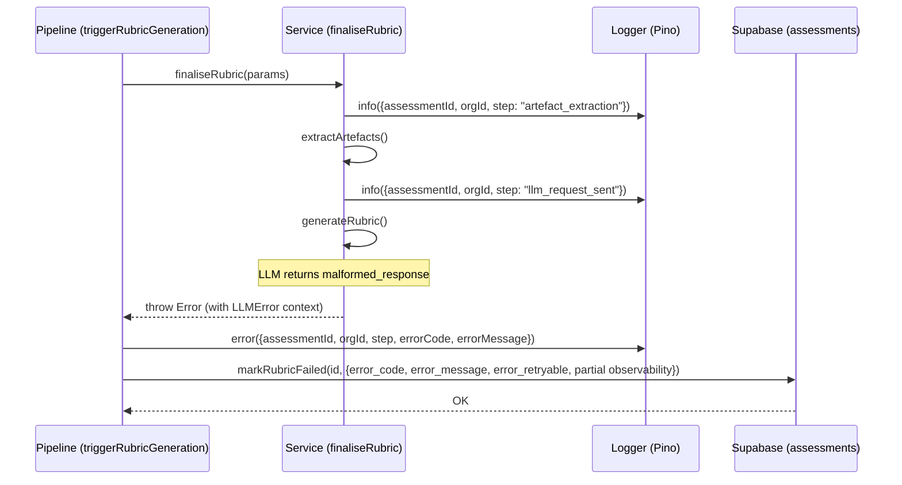
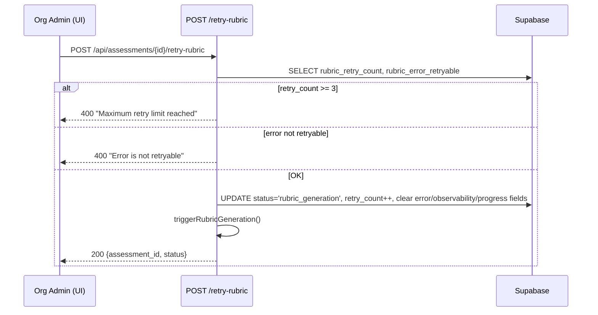
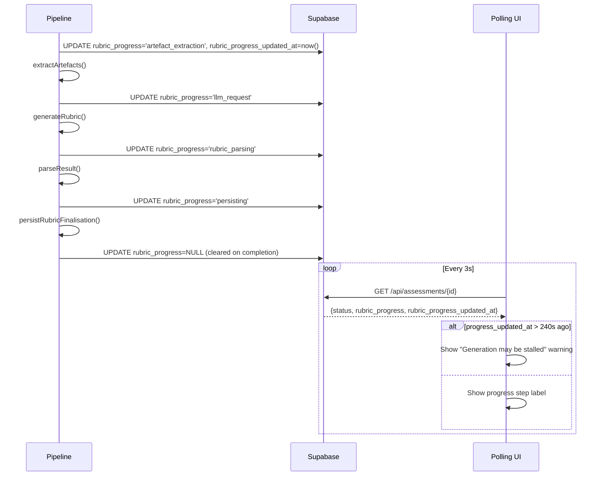
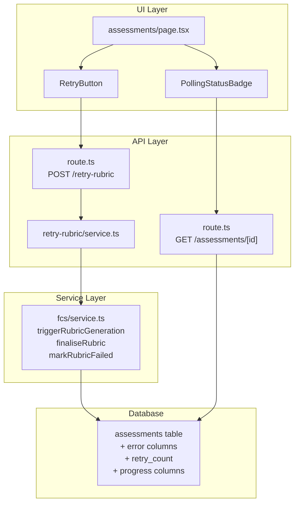

# LLD — Epic 18: Pipeline Observability & Recovery

**Epic:** #271
**Requirements:** `docs/requirements/v2-requirements.md` — Epic 18
**HLD reference:** `docs/design/v1-design.md` §3 (Assessment Lifecycle)

## Change log

| Date | Author | Changes |
|------|--------|---------|
| 2026-04-20 | LS / Claude | Initial LLD — Stories 18.1, 18.2, 18.3 |

---

# Part A — Human-reviewable

## Purpose

Close the observability gap in the rubric-generation pipeline. Today, when generation fails the admin sees "Failed" with no explanation, no diagnostic trail, and no retry guardrails. This epic:

1. **18.1** — Captures error details and partial observability on failure, adds structured pipeline step logging.
2. **18.2** — Surfaces error details in the UI, adds retry count limits and retryable checks.
3. **18.3** — Shows real-time pipeline progress and detects stalled generation.

## Behavioural flows

### 18.1 — Error capture on pipeline failure



### 18.2 — Retry with guardrails



### 18.3 — Progress visibility



## Structural overview



## Invariants

| # | Invariant | Verification |
|---|-----------|-------------|
| I1 | Error fields are only populated when `status = 'rubric_failed'` | Unit test: markRubricFailed sets error fields; retry clears them |
| I2 | `rubric_retry_count` monotonically increases; never decremented | Unit test: retriggerRubricForAssessment increments count |
| I3 | `rubric_retry_count` capped at 3; API rejects retry beyond | Unit test: retryRubricGeneration returns 400 at count >= 3 |
| I4 | Non-retryable errors cannot be retried via API | Unit test: retryRubricGeneration returns 400 when retryable = false |
| I5 | `rubric_progress` is cleared to null on completion (success or failure) | Unit test: both finaliseRubric and markRubricFailed clear progress |
| I6 | Every structured log entry includes `assessmentId` and `orgId` | Grep test: all logger calls in pipeline include both fields |
| I7 | Retry clears all previous-attempt tracking data | Unit test: status reset clears error, observability, and progress fields |

---

# Part B — Agent-implementable

## Story 18.1: Pipeline Error Capture & Structured Logging

### Schema changes

Add to `supabase/schemas/tables.sql` on the `assessments` table, after the existing observability columns (line 166):

```sql
-- Pipeline error capture (V2 Epic 18). Populated on rubric_failed status.
-- See docs/design/lld-e18.md §18.1.
rubric_error_code        text,
rubric_error_message     text,
rubric_error_retryable   boolean,
```

### Files to modify

| File | Change |
|------|--------|
| `supabase/schemas/tables.sql` | Add 3 error columns to `assessments` |
| `src/app/api/fcs/service.ts` | Extend `markRubricFailed` signature; add partial observability persistence on failure; add structured step logging |
| `src/lib/engine/pipeline/assess-pipeline.ts` | Propagate `LLMError` from `generateRubric` failure path (if not already surfaced) |

### Internal decomposition

#### `markRubricFailed` extension

Current signature:
```typescript
async function markRubricFailed(
  adminSupabase: ServiceClient,
  assessmentId: AssessmentId,
): Promise<void>
```

New signature:
```typescript
interface RubricFailureDetails {
  errorCode: LLMErrorCode;
  errorMessage: string;
  errorRetryable: boolean;
  partialObservability?: Partial<RubricObservability>;
}

async function markRubricFailed(
  adminSupabase: ServiceClient,
  assessmentId: AssessmentId,
  details?: RubricFailureDetails,
): Promise<void>
```

The `details` parameter is optional for backward compatibility with non-LLM failures (e.g. GitHub API errors). When provided, persists:
- `rubric_error_code` — from `details.errorCode`
- `rubric_error_message` — `details.errorMessage.slice(0, 1000)`
- `rubric_error_retryable` — from `details.errorRetryable`
- `rubric_input_tokens`, `rubric_output_tokens`, `rubric_tool_call_count`, `rubric_tool_calls`, `rubric_duration_ms` — from `details.partialObservability` if present

Also clears `rubric_progress` to `null` (invariant I5).

#### `triggerRubricGeneration` catch block

Extend the catch block to extract `LLMError` from the thrown error and pass it to `markRubricFailed`:

```typescript
catch (err) {
  const llmError = extractLlmError(err);
  logger.error({ err, assessmentId, orgId }, 'triggerRubricGeneration: failed');
  await markRubricFailed(adminSupabase, assessmentId, llmError);
}
```

`extractLlmError` is a small helper: if the error message matches the pattern `"Rubric generation failed: <code>"` and the original `LLMError` is available, extract it. Otherwise return `undefined`.

#### `finaliseRubric` — propagate LLMError

Currently `finaliseRubric` throws a plain `Error` on generation failure:
```typescript
if (result.status === 'generation_failed') throw new Error(`Rubric generation failed: ${result.error.code}`);
```

Change to throw a typed error that carries the `LLMError` and partial observability:

```typescript
class RubricGenerationError extends Error {
  constructor(
    readonly llmError: LLMError,
    readonly partialObservability?: Partial<RubricObservability>,
  ) {
    super(`Rubric generation failed: ${llmError.code}`);
    this.name = 'RubricGenerationError';
  }
}
```

#### Structured logging

Add `logger.info` calls at each pipeline step boundary in `finaliseRubric`:

| Step name | Where | Extra fields |
|-----------|-------|-------------|
| `artefact_extraction` | Before `source.extractFromPRs()` in `triggerRubricGeneration` | — |
| `llm_request_sent` | Before `generateRubric()` in `finaliseRubric` | — |
| `llm_response_received` | After `generateRubric()` returns successfully | `inputTokens`, `outputTokens`, `toolCallCount`, `durationMs` |
| `rubric_parsing` | After `generateRubric()` success, before `persistRubricFinalisation` | — |
| `rubric_persisted` | After `persistRubricFinalisation` returns | — |

All log entries include `{ assessmentId, orgId, step }`.

On `malformed_response` error: log at `warn` level with the raw response shape (top-level keys and types only).

### BDD specs

```typescript
describe('Story 18.1: Pipeline Error Capture & Structured Logging', () => {
  describe('markRubricFailed', () => {
    it('should persist error code, message, and retryable flag on the assessment row', () => {
      // Given a rubric generation that failed with LLMError { code: 'malformed_response', message: 'Invalid JSON', retryable: true }
      // When markRubricFailed is called with those details
      // Then the assessment row has rubric_error_code='malformed_response', rubric_error_message='Invalid JSON', rubric_error_retryable=true
    });

    it('should truncate error message to 1000 characters', () => {
      // Given an error message longer than 1000 characters
      // When markRubricFailed is called
      // Then rubric_error_message is truncated to 1000 characters
    });

    it('should persist partial observability data when available', () => {
      // Given a failure after LLM response with inputTokens=500, outputTokens=200, durationMs=3000
      // When markRubricFailed is called with partialObservability
      // Then the assessment row has rubric_input_tokens=500, rubric_output_tokens=200, rubric_duration_ms=3000
    });

    it('should clear rubric_progress to null on failure', () => {
      // Given an assessment with rubric_progress='llm_request'
      // When markRubricFailed is called
      // Then rubric_progress is null
    });

    it('should handle calls without details (non-LLM failures)', () => {
      // Given a failure from GitHub API (no LLMError)
      // When markRubricFailed is called without details
      // Then status is rubric_failed, error fields are null
    });
  });

  describe('triggerRubricGeneration error path', () => {
    it('should extract LLMError from RubricGenerationError and pass to markRubricFailed', () => {
      // Given finaliseRubric throws RubricGenerationError with llmError
      // When triggerRubricGeneration catches it
      // Then markRubricFailed receives the error details
    });
  });

  describe('structured logging', () => {
    it('should emit info log at each pipeline step with assessmentId and orgId', () => {
      // Given a successful rubric generation
      // When the pipeline completes
      // Then logger.info was called for steps: artefact_extraction, llm_request_sent, llm_response_received, rubric_parsing, rubric_persisted
    });

    it('should include token counts and duration in llm_response_received log', () => {
      // Given a successful LLM response
      // When the log entry is emitted
      // Then it includes inputTokens, outputTokens, toolCallCount, durationMs
    });

    it('should emit error log with step name and error details on pipeline failure', () => {
      // Given a pipeline failure at the llm_request step
      // When the error is caught
      // Then logger.error includes assessmentId, orgId, step, and error details
    });
  });
});
```

### Acceptance criteria

- [ ] `markRubricFailed` persists `rubric_error_code`, `rubric_error_message` (≤ 1000 chars), `rubric_error_retryable` on failure
- [ ] Partial observability (tokens, duration, tool calls) persisted on failure path
- [ ] `rubric_progress` cleared to null on failure
- [ ] Structured log at each pipeline step with `assessmentId`, `orgId`, step name
- [ ] `llm_response_received` log includes token counts and duration
- [ ] `malformed_response` logged at `warn` with response shape (keys/types only)
- [ ] `RubricGenerationError` carries `LLMError` from engine to catch block
- [ ] Schema: 3 new columns on `assessments` table
- [ ] `npx vitest run` passes, `npx tsc --noEmit` passes

---

## Story 18.2: Assessment Retry from UI with Guardrails

### Schema changes

Add to `supabase/schemas/tables.sql` on the `assessments` table, after the error columns:

```sql
rubric_retry_count       integer NOT NULL DEFAULT 0,
```

### Files to modify

| File | Change |
|------|--------|
| `supabase/schemas/tables.sql` | Add `rubric_retry_count` column |
| `src/app/api/assessments/[id]/retry-rubric/service.ts` | Add guardrail checks (retry count, retryable flag) |
| `src/app/api/fcs/service.ts` | `retriggerRubricForAssessment` — increment retry count, clear error/observability/progress fields |
| `src/app/(authenticated)/assessments/page.tsx` | Fetch + display error code alongside "Failed" badge |
| `src/app/(authenticated)/assessments/retry-button.tsx` | Accept guardrail props, disable with messages |

### Internal decomposition

#### Retry API service — guardrail checks

In `src/app/api/assessments/[id]/retry-rubric/service.ts`, add the select to include `rubric_retry_count` and `rubric_error_retryable`:

```typescript
const { data: assessment } = await ctx.adminSupabase
  .from('assessments')
  .select('id, org_id, repository_id, status, config_question_count, config_comprehension_depth, rubric_retry_count, rubric_error_retryable')
  .eq('id', assessmentId)
  .single();

if (assessment.rubric_retry_count >= 3)
  throw new ApiError(400, 'Maximum retry limit reached');
if (assessment.rubric_error_retryable === false)
  throw new ApiError(400, 'Error is not retryable');
```

#### `retriggerRubricForAssessment` — clear previous attempt data

Extend the status reset update to also:
- Increment `rubric_retry_count`
- Clear error fields: `rubric_error_code`, `rubric_error_message`, `rubric_error_retryable` → `null`
- Clear observability fields: `rubric_input_tokens`, `rubric_output_tokens`, `rubric_tool_call_count`, `rubric_tool_calls`, `rubric_duration_ms` → `null`
- Clear progress fields: `rubric_progress`, `rubric_progress_updated_at` → `null`

```typescript
const { error } = await adminSupabase.from('assessments').update({
  status: 'rubric_generation',
  rubric_retry_count: assessment.rubric_retry_count + 1,
  rubric_error_code: null,
  rubric_error_message: null,
  rubric_error_retryable: null,
  rubric_input_tokens: null,
  rubric_output_tokens: null,
  rubric_tool_call_count: null,
  rubric_tool_calls: null,
  rubric_duration_ms: null,
  rubric_progress: null,
  rubric_progress_updated_at: null,
}).eq('id', assessmentId);
```

Note: `retriggerRubricForAssessment` must receive the current `rubric_retry_count` from the caller. Add it to `AssessmentRetryRow`.

#### UI — error display on assessments page

Extend the Supabase query in `page.tsx` to fetch `rubric_error_code`, `rubric_retry_count`, `rubric_error_retryable`. Display the error code alongside the status badge for failed assessments:

```
Failed: malformed_response
```

#### UI — RetryButton guardrails

Extend `RetryButton` props:

```typescript
interface RetryButtonProps {
  assessmentId: string;
  retryCount: number;
  maxRetries: number;       // 3
  errorRetryable: boolean | null;
}
```

When `retryCount >= maxRetries`: button disabled, message "Maximum retries reached (3 of 3)".
When `errorRetryable === false`: button disabled, message "This error is not retryable".
Otherwise: button enabled, shows "Retry (Attempt N of 3)".

### BDD specs

```typescript
describe('Story 18.2: Assessment Retry with Guardrails', () => {
  describe('retryRubricGeneration service', () => {
    it('should return 400 when rubric_retry_count >= 3', () => {
      // Given an assessment with rubric_retry_count=3
      // When POST /api/assessments/{id}/retry-rubric is called
      // Then it returns 400 with error "Maximum retry limit reached"
    });

    it('should return 400 when rubric_error_retryable is false', () => {
      // Given an assessment with rubric_error_retryable=false
      // When POST /api/assessments/{id}/retry-rubric is called
      // Then it returns 400 with error "Error is not retryable"
    });

    it('should increment rubric_retry_count on successful retry', () => {
      // Given an assessment with rubric_retry_count=1
      // When retry succeeds
      // Then rubric_retry_count=2
    });

    it('should clear all previous-attempt tracking data on retry', () => {
      // Given an assessment with error and observability fields populated
      // When retry is triggered
      // Then rubric_error_code, rubric_error_message, rubric_error_retryable, rubric_input_tokens, rubric_output_tokens, rubric_tool_call_count, rubric_tool_calls, rubric_duration_ms, rubric_progress, rubric_progress_updated_at are all null
    });
  });

  describe('RetryButton UI', () => {
    it('should disable button and show "Maximum retries reached (3 of 3)" when retryCount >= 3', () => {
      // Given retryCount=3, maxRetries=3
      // When rendered
      // Then button is disabled with message
    });

    it('should disable button and show "This error is not retryable" when errorRetryable is false', () => {
      // Given errorRetryable=false
      // When rendered
      // Then button is disabled with message
    });

    it('should show attempt count "Retry (Attempt 2 of 3)" when retries remain', () => {
      // Given retryCount=1, maxRetries=3, errorRetryable=true
      // When rendered
      // Then button label shows attempt info
    });
  });

  describe('assessments list page', () => {
    it('should show error code alongside Failed badge for rubric_failed assessments', () => {
      // Given an assessment with status=rubric_failed and rubric_error_code='malformed_response'
      // When the page renders
      // Then "Failed: malformed_response" is displayed
    });
  });
});
```

### Acceptance criteria

- [ ] API returns 400 when `rubric_retry_count >= 3`
- [ ] API returns 400 when `rubric_error_retryable = false`
- [ ] Retry increments `rubric_retry_count` (server-side, not client)
- [ ] Retry clears all error, observability, and progress fields to null
- [ ] UI shows error code alongside "Failed" badge
- [ ] RetryButton disabled with message for max retries or non-retryable errors
- [ ] RetryButton shows attempt count when retries remain
- [ ] Schema: `rubric_retry_count integer NOT NULL DEFAULT 0`
- [ ] `npx vitest run` passes, `npx tsc --noEmit` passes

---

## Story 18.3: Pipeline Progress Visibility

### Schema changes

Add to `supabase/schemas/tables.sql` on the `assessments` table, after the retry count column:

```sql
-- Pipeline progress tracking (V2 Epic 18). Updated during rubric generation.
-- See docs/design/lld-e18.md §18.3.
rubric_progress            text,
rubric_progress_updated_at timestamptz,
```

### Files to modify

| File | Change |
|------|--------|
| `supabase/schemas/tables.sql` | Add 2 progress columns |
| `src/app/api/fcs/service.ts` | Add `updateProgress` helper; call at each pipeline step boundary |
| `src/app/api/assessments/[id]/route.ts` | Include progress fields in response |
| `src/app/(authenticated)/assessments/polling-status-badge.tsx` | Display progress step label |
| `src/app/(authenticated)/assessments/poll-status.ts` | Pass progress data through callbacks |
| `src/app/(authenticated)/assessments/use-status-poll.ts` | Expose progress + stale state |

### Internal decomposition

#### `updateProgress` helper

Add to `src/app/api/fcs/service.ts`:

```typescript
type PipelineStep = 'artefact_extraction' | 'llm_request' | 'rubric_parsing' | 'persisting';

async function updateProgress(
  adminSupabase: ServiceClient,
  assessmentId: AssessmentId,
  step: PipelineStep,
): Promise<void> {
  await adminSupabase
    .from('assessments')
    .update({ rubric_progress: step, rubric_progress_updated_at: new Date().toISOString() })
    .eq('id', assessmentId);
}
```

Call at each step boundary in `triggerRubricGeneration` and `finaliseRubric`:
1. `updateProgress(adminSupabase, assessmentId, 'artefact_extraction')` — before artefact extraction
2. `updateProgress(adminSupabase, assessmentId, 'llm_request')` — before `generateRubric()`
3. `updateProgress(adminSupabase, assessmentId, 'rubric_parsing')` — after successful LLM response
4. `updateProgress(adminSupabase, assessmentId, 'persisting')` — before `persistRubricFinalisation()`

Progress is cleared to null on completion (by `finalise_rubric` RPC setting `rubric_progress = null`) and on failure (by `markRubricFailed`).

#### `finalise_rubric` RPC update

Extend the observability overload of `finalise_rubric` in `supabase/schemas/functions.sql` to also clear progress:

```sql
rubric_progress            = NULL,
rubric_progress_updated_at = NULL,
```

#### Polling response extension

In `src/app/api/assessments/[id]/route.ts`, add to `AssessmentDetailResponse`:

```typescript
rubric_progress: string | null;
rubric_progress_updated_at: string | null;
```

And map from the assessment row in `buildResponse`.

#### Progress label mapping (client-side)

```typescript
const PROGRESS_LABELS: Record<string, string> = {
  artefact_extraction: 'Extracting artefacts from repository',
  llm_request: 'Waiting for LLM response',
  rubric_parsing: 'Processing LLM response',
  persisting: 'Saving results',
};
```

#### Stale detection (client-side)

In `PollingStatusBadge`, compare `rubric_progress_updated_at` against `Date.now()`. If older than 240 seconds, show warning: "Generation may be stalled — consider retrying". Warning is removed when status transitions to a terminal state.

### BDD specs

```typescript
describe('Story 18.3: Pipeline Progress Visibility', () => {
  describe('updateProgress', () => {
    it('should set rubric_progress and rubric_progress_updated_at on the assessment row', () => {
      // Given an assessment in rubric_generation status
      // When updateProgress is called with step='llm_request'
      // Then rubric_progress='llm_request' and rubric_progress_updated_at is recent
    });
  });

  describe('progress cleared on completion', () => {
    it('should clear rubric_progress to null after successful finalisation', () => {
      // Given rubric_progress='persisting'
      // When finalise_rubric RPC completes
      // Then rubric_progress is null
    });

    it('should clear rubric_progress to null on failure', () => {
      // Given rubric_progress='llm_request'
      // When markRubricFailed is called
      // Then rubric_progress is null
    });
  });

  describe('GET /api/assessments/[id] response', () => {
    it('should include rubric_progress and rubric_progress_updated_at in response', () => {
      // Given an assessment with rubric_progress='llm_request'
      // When GET /api/assessments/{id} is called
      // Then response includes rubric_progress='llm_request' and rubric_progress_updated_at
    });
  });

  describe('PollingStatusBadge', () => {
    it('should display progress step label when rubric_progress is non-null', () => {
      // Given status=rubric_generation, rubric_progress='llm_request'
      // When rendered
      // Then shows "Waiting for LLM response" below the badge
    });

    it('should show stale warning when progress_updated_at is older than 240 seconds', () => {
      // Given rubric_progress_updated_at is 300 seconds ago
      // When rendered
      // Then shows "Generation may be stalled — consider retrying"
    });

    it('should remove stale warning when status transitions to terminal', () => {
      // Given stale warning is shown
      // When status changes to rubric_failed
      // Then warning is removed
    });

    it('should show no progress text when rubric_progress is null', () => {
      // Given rubric_progress=null
      // When rendered
      // Then no progress label is displayed
    });
  });
});
```

### Acceptance criteria

- [ ] `rubric_progress` updated at each pipeline step boundary
- [ ] `rubric_progress_updated_at` set alongside progress updates
- [ ] Progress cleared to null on success (via finalise_rubric RPC)
- [ ] Progress cleared to null on failure (via markRubricFailed)
- [ ] GET `/api/assessments/[id]` includes `rubric_progress` and `rubric_progress_updated_at`
- [ ] UI displays human-readable progress label during generation
- [ ] UI shows stale warning when `rubric_progress_updated_at` > 240 seconds ago
- [ ] Stale warning removed on terminal status transition
- [ ] Schema: `rubric_progress text`, `rubric_progress_updated_at timestamptz`
- [ ] `npx vitest run` passes, `npx tsc --noEmit` passes

---

## Tasks

| Task | Story | Est. lines | Wave | Depends on |
|------|-------|-----------|------|------------|
| 18.1 — Error capture & structured logging | 18.1 | ~180 | 1 | — |
| 18.3 — Pipeline progress visibility | 18.3 | ~160 | 1 | — |
| 18.2 — Retry guardrails | 18.2 | ~180 | 2 | 18.1 |
