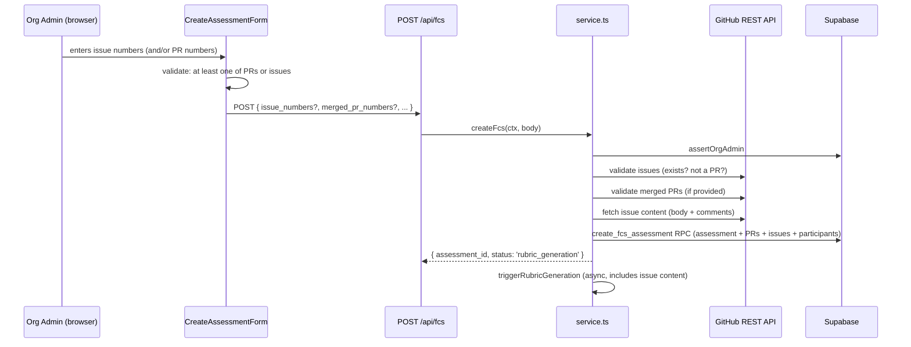
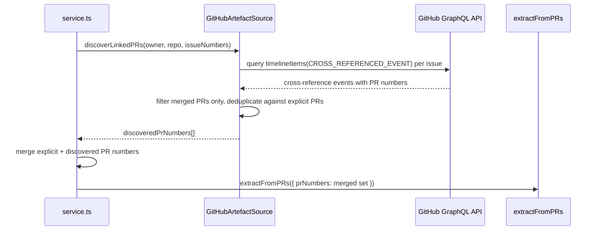
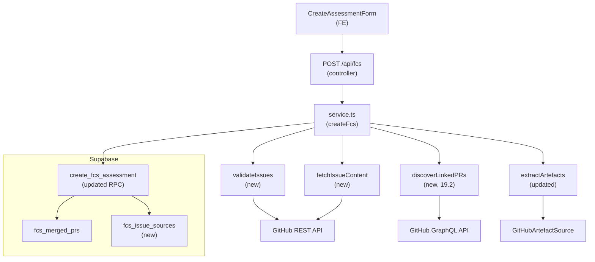

# LLD — Epic 19: GitHub Issues as Artefact Source

| Field | Value |
|-------|-------|
| Epic | E19 |
| Status | Revised |
| Created | 2026-04-21 |
| Revised | 2026-04-21 | Issue #288 — port uses shared `IssueQueryParams`; `RepoCoordsSchema` as base; `resolveMergedPrSet` helper in `extractArtefacts` |
| Revised | 2026-04-21 | Issue #291 — implementation realigned with §19.1 spec: `validateIssues` now returns `ValidatedIssue[]`; `fcs_issue_sources.issue_title` added (was specified in §19.1 but dropped from initial implementation) |
| Requirements | `docs/requirements/v2-requirements.md` — Epic 19 |
| HLD reference | `docs/design/v1-design.md` §C5 (Artefact Extraction), §4.2 (POST /api/fcs) |

---

## Purpose

Assessment creation currently requires explicit merged PR numbers. This epic lets the Org Admin provide GitHub issue numbers instead of (or alongside) PR numbers. The system fetches issue content for rubric context and discovers linked merged PRs automatically.

---

## Part A — Human-Reviewable Design

### Behavioural flows

#### 19.1 — Assessment creation with issue numbers



#### 19.2 — Linked PR discovery from issues



### Structural overview



### Invariants

| # | Invariant | Verification |
|---|-----------|-------------|
| I1 | At least one of `merged_pr_numbers` or `issue_numbers` must be provided | Zod `.refine()` + unit test |
| I2 | Issue numbers that are actually PRs are rejected with HTTP 422 | Unit test: mock issue with `pull_request` field |
| I3 | Discovered PRs are deduplicated against explicit PRs | Unit test: overlapping sets → no duplicates |
| I4 | Only merged discovered PRs are included | Unit test: open/closed-unmerged PRs filtered out |
| I5 | Issue content (body + comments) flows into `linked_issues` in `AssembledArtefactSet` | Unit test: verify `linked_issues` array contents |
| I6 | Comments are truncated before issue body when token budget requires it | Defer to existing truncation priority (tier 2) |
| I7 | `fcs_issue_sources` rows are persisted for retry recovery | Integration test: retry reads back issue numbers |
| I8 | Form validates "at least one of PRs or issues" client-side | Unit test on `validate()` function |

### Acceptance criteria

Consolidated from requirements (Stories 19.1, 19.2, 19.3) plus the missing frontend ACs.

**Story 19.1 — Accept issue numbers at assessment creation:**

- API accepts `issue_numbers` alongside or instead of `merged_pr_numbers`
- HTTP 422 when neither is provided
- HTTP 422 when an issue number does not exist in the repo
- HTTP 422 when an issue number is actually a PR
- Issue body and comments fetched into `linked_issues`
- Comments truncated before issue body under token budget
- Issue numbers persisted in `fcs_issue_sources` table
- **Frontend:** "Issue numbers" input field added to create-assessment form
- **Frontend:** Form validation allows PRs-only, issues-only, or both

**Story 19.2 — Discover linked PRs from issues:**

- PRs that close/reference provided issues are discovered via GraphQL
- Discovered PRs deduplicated against explicit `merged_pr_numbers`
- Non-merged discovered PRs excluded (logged at info)
- Issues with no linked PRs: no error, issue content still included
- Retry path recovers both stored PR numbers and issue numbers

**Story 19.3 — Enhanced artefact extraction logging (#282):**

- `logArtefactSummary` includes `filePaths` field (from `file_contents`)
- `logArtefactSummary` includes `issueNumbers` field when issues present
- Existing log fields preserved unchanged
- File paths truncated at 50 entries with `filePaths_truncated: true`

---

## Part B — Agent-Implementable Design

### Story 19.1 — Accept issue numbers at assessment creation

#### Database layer

**New table: `fcs_issue_sources`** in `supabase/schemas/tables.sql`:

```sql
CREATE TABLE fcs_issue_sources (
  id            uuid PRIMARY KEY DEFAULT gen_random_uuid(),
  org_id        uuid NOT NULL
                   REFERENCES organisations(id) ON DELETE CASCADE,
  assessment_id uuid NOT NULL
                   REFERENCES assessments(id) ON DELETE CASCADE,
  issue_number  integer NOT NULL,
  issue_title   text NOT NULL,
  created_at    timestamptz NOT NULL DEFAULT now()
);

CREATE INDEX idx_fcs_issues_assessment ON fcs_issue_sources (assessment_id);
```

**RLS** in `supabase/schemas/policies.sql` (mirrors `fcs_merged_prs`):

```sql
ALTER TABLE fcs_issue_sources ENABLE ROW LEVEL SECURITY;

CREATE POLICY fcs_issues_select_member ON fcs_issue_sources
  FOR SELECT USING (org_id IN (SELECT get_user_org_ids()));
```

**RPC update** — `create_fcs_assessment` in `supabase/schemas/functions.sql`:

Add parameter `p_issue_sources jsonb DEFAULT '[]'::jsonb`. After the existing `fcs_merged_prs` insert, add:

```sql
INSERT INTO fcs_issue_sources (org_id, assessment_id, issue_number, issue_title)
SELECT p_org_id, p_id, (iss->>'issue_number')::integer, iss->>'issue_title'
FROM jsonb_array_elements(p_issue_sources) AS iss;
```

#### Backend layer

**Files to modify:**

| File | Change |
|------|--------|
| `src/app/api/fcs/service.ts` | Schema, validation, issue fetching, RPC call, retry path |
| `src/lib/github/artefact-source.ts` | New public `fetchIssues` method |
| `src/lib/engine/ports/artefact-source.ts` | Extend port with `fetchIssues` |
| `src/lib/engine/prompts/artefact-types.ts` | Extend `LinkedIssueSchema` with optional `comments` field |

**Schema change — `FcsCreateBodySchema`** (`service.ts`):

```typescript
export const FcsCreateBodySchema = z.object({
  org_id: z.uuid(),
  repository_id: z.uuid(),
  feature_name: z.string().min(1),
  feature_description: z.string().optional(),
  merged_pr_numbers: z.array(z.number().int().positive()).optional(),
  issue_numbers: z.array(z.number().int().positive()).optional(),
  participants: z.array(z.object({ github_username: z.string().min(1) })).min(1),
  comprehension_depth: z.enum(['conceptual', 'detailed']).default('conceptual'),
}).refine(
  (data) => (data.merged_pr_numbers?.length ?? 0) > 0 || (data.issue_numbers?.length ?? 0) > 0,
  { message: 'At least one of merged_pr_numbers or issue_numbers is required' },
);
```

**New type — `ValidatedIssue`** (`service.ts`):

```typescript
interface ValidatedIssue {
  issue_number: number;
  issue_title: string;
}
```

**New function — `validateIssues`** (`service.ts`):

```typescript
async function validateIssues(
  octokit: Octokit, owner: string, repo: string, issueNumbers: number[],
): Promise<ValidatedIssue[]>
```

- Calls `octokit.rest.issues.get` per issue number.
- If `response.data.pull_request` is defined → throw `ApiError(422, '#N is a pull request, not an issue. Use merged_pr_numbers for PRs.')`.
- If 404 → throw `ApiError(422, 'Issue #N not found in repository')`.
- Returns `{ issue_number, issue_title }[]`.

**New function — `fetchIssueContent`** (`artefact-source.ts`):

```typescript
async fetchIssueContent(params: IssueQueryParams): Promise<LinkedIssue[]>
```

> **Implementation note (issue #288):** The port now uses a params-object signature (`IssueQueryParams = RepoCoordsSchema.extend({ issueNumbers })`) instead of positional `coords, issueNumbers`. This keeps the Zod schema as the single source of truth at the port boundary and matches the sibling `PRExtractionParams` shape. `IssueQueryParams` is shared with `discoverLinkedPRs` since both methods take the same input — a set of issues on a repo.

- For each issue: fetch body via `octokit.rest.issues.get`, fetch comments via `octokit.rest.issues.listComments`.
- Map to `LinkedIssue`: `title` = issue title, `body` = issue body + `\n\n---\n\n### Comments\n\n` + joined comment bodies.
- Comments concatenated body-only (no metadata). Comment text appended after the issue body, separated clearly. When truncation occurs, the comment portion is at the end of the `body` string and will be truncated first by the existing priority system.

**Port extension** (`src/lib/engine/ports/artefact-source.ts`):

```typescript
export interface ArtefactSource {
  extractFromPRs(params: PRExtractionParams): Promise<RawArtefactSet>;
  fetchIssueContent(params: IssueQueryParams): Promise<LinkedIssue[]>;
}
```

**`createFcs` update** (`service.ts`):

1. Validate issues (if provided) in parallel with PR validation.
2. Pass `validatedIssues` to `createAssessmentWithParticipants` → RPC `p_issue_sources`.
3. Pass `issueNumbers` to `triggerRubricGeneration` via extended `RubricTriggerParams`.

**`extractArtefacts` update** (`service.ts`):

1. Accept `issueNumbers?: number[]` parameter.
2. If `issueNumbers` provided, call `source.fetchIssueContent(owner, repo, issueNumbers)`.
3. Merge result into `raw.linked_issues` (append to any PR-discovered issues, deduplicate by title via existing `mergeRawArtefacts` logic).

**`retriggerRubricForAssessment` update** (`service.ts`):

1. After fetching PR numbers from `fcs_merged_prs`, also fetch issue numbers from `fcs_issue_sources`.
2. Pass both to `triggerRubricGeneration`.

#### Internal decomposition — `createFcs` flow

```
Controller (route.ts, ≤ 5 lines):
  createApiContext(request) → validateBody(FcsCreateBodySchema) → createFcs(ctx, body)

Service (service.ts — createFcs):
  1. assertOrgAdmin(ctx.supabase, userId, orgId)
  2. fetchRepoInfo(adminSupabase, repositoryId, orgId)
  3. createGithubClient(installationId)
  4. Promise.all([
       validateMergedPRs(octokit, ..., body.merged_pr_numbers ?? []),  // skip if empty
       validateIssues(octokit, ..., body.issue_numbers ?? []),          // skip if empty
       resolveParticipants(octokit, body.participants),
     ])
  5. createAssessmentWithParticipants(adminSupabase, { body, repoInfo, validatedPRs, validatedIssues, participants })
  6. void triggerRubricGeneration({ ..., prNumbers, issueNumbers })
  7. return response
```

Constraint: service never calls `createClient()` or any infrastructure factory — `ApiContext` is injected by the controller.

#### Frontend layer

**File:** `src/app/(authenticated)/assessments/new/create-assessment-form.tsx`

**Changes:**

1. Add `issueNumbers: string` to `FormState` (initial: `''`).
2. Add `issue_numbers?: number[]` to `AssessmentPayload`.
3. Add `parseIssueNumbers` function (same pattern as `parsePrNumbers`).
4. Update `validate`:
   - Remove the current "Enter at least one merged PR number" check.
   - Replace with: if both `parsePrNumbers` and `parseIssueNumbers` are empty → `'Enter at least one merged PR number or issue number.'`
   - Keep individual format validation for each field when non-empty.
5. Update `postAssessment` payload: include `issue_numbers` when non-empty, omit `merged_pr_numbers` when empty.
6. Add input field for "Issue numbers (comma-separated)" between the PR numbers field and participants field. Same styling and pattern as the PR numbers input. Placeholder: `e.g. 10, 15`.
7. Update the PR numbers label from `*` (required) to remove the asterisk, since neither field is individually required. Add helper text: `"Enter PR numbers, issue numbers, or both."`

#### BDD specs — Story 19.1

```typescript
describe('POST /api/fcs — issue numbers', () => {
  describe('schema validation', () => {
    it('accepts issue_numbers alongside merged_pr_numbers')
    it('accepts issue_numbers without merged_pr_numbers')
    it('accepts merged_pr_numbers without issue_numbers (backward compat)')
    it('rejects request with neither merged_pr_numbers nor issue_numbers — 422')
  })

  describe('issue validation', () => {
    it('rejects issue number that does not exist — 422')
    it('rejects issue number that is actually a PR — 422 with guidance message')
  })

  describe('issue content extraction', () => {
    it('fetches issue body and comments into linked_issues')
    it('comments appended after issue body, separated by heading')
    it('deduplicates issues already discovered from PR bodies')
  })

  describe('persistence', () => {
    it('stores issue numbers in fcs_issue_sources table')
    it('retry recovers issue numbers from fcs_issue_sources')
  })
})

describe('CreateAssessmentForm — issue numbers', () => {
  it('renders issue numbers input field')
  it('validates: at least one of PRs or issues required')
  it('submits with issue_numbers when provided')
  it('omits merged_pr_numbers from payload when empty')
})
```

---

### Story 19.2 — Discover linked PRs from issues

#### Backend layer

**Files to modify:**

| File | Change |
|------|--------|
| `src/lib/github/artefact-source.ts` | New `discoverLinkedPRs` method (GraphQL) |
| `src/lib/engine/ports/artefact-source.ts` | Extend port |
| `src/app/api/fcs/service.ts` | Wire discovery into `extractArtefacts` |

**New method — `discoverLinkedPRs`** (`artefact-source.ts`):

```typescript
async discoverLinkedPRs(params: IssueQueryParams): Promise<number[]>
```

> **Implementation note (issue #288):** `discoverLinkedPRs` reuses `IssueQueryParams` (the shared schema introduced for `fetchIssueContent`) since both methods take `{ owner, repo, issueNumbers }` as input. A separate `DiscoverLinkedPRsParamsSchema` was dropped — two schemas with identical fields is duplication for no gain. The output differs (issue content vs. PR numbers) and that's already expressed by the return type.

Uses `this.octokit.graphql()` to fetch cross-reference events:

```graphql
query($owner: String!, $repo: String!, $issueNumber: Int!) {
  repository(owner: $owner, name: $repo) {
    issue(number: $issueNumber) {
      timelineItems(first: 100, itemTypes: [CROSS_REFERENCED_EVENT]) {
        nodes {
          ... on CrossReferencedEvent {
            source {
              ... on PullRequest {
                number
                merged
              }
            }
          }
        }
      }
    }
  }
}
```

- One query per issue (GraphQL does not support batching issue lookups by number in a single query without aliases; use `Promise.all` for concurrency).
- Filter: only `merged === true`.
- Returns deduplicated PR numbers.

**Port extension** (`src/lib/engine/ports/artefact-source.ts`):

```typescript
export const RepoCoordsSchema = z.object({
  owner: z.string().min(1),
  repo: z.string().min(1),
});
export type RepoCoords = z.infer<typeof RepoCoordsSchema>;

export const IssueQueryParamsSchema = RepoCoordsSchema.extend({
  issueNumbers: z.array(z.number().int().positive()).min(1),
});
export type IssueQueryParams = z.infer<typeof IssueQueryParamsSchema>;

export interface ArtefactSource {
  extractFromPRs(params: PRExtractionParams): Promise<RawArtefactSet>;
  fetchIssueContent(params: IssueQueryParams): Promise<LinkedIssue[]>;
  discoverLinkedPRs(params: IssueQueryParams): Promise<number[]>;
}
```

> **Implementation note (issue #288):** `RepoCoordsSchema` is extracted as the shared base so `PRExtractionParamsSchema`, `IssueQueryParamsSchema` all `.extend()` from it. `GitHubArtefactSource` imports `RepoCoords` from the port (no local duplicate). `src/app/api/fcs/service.ts` also uses it in place of an inline `{ owner, repo }` shape.

**`extractArtefacts` update** (`service.ts`):

1. If `issueNumbers` provided, call `source.discoverLinkedPRs({ ...coords, issueNumbers })` via a private helper `resolveMergedPrSet`.
2. Merge discovered PRs with explicit `prNumbers`, deduplicate (Set union).
3. Log discovered PRs at `info` level: `{ explicitPrs, discoveredPrs, mergedPrs }`.
4. Pass merged set to `source.extractFromPRs`.

> **Implementation note (issue #288):** the discovery + union logic is extracted into a private helper `resolveMergedPrSet(source, coords: RepoCoords, explicitPrs, issueNumbers): Promise<number[]>` so `extractArtefacts` stays under the 20-line complexity budget and the single info-level discovery log sits at the join point.

**Edge cases:**

- Issue with no cross-references → empty array, no error.
- Discovered PR already in explicit list → deduplicated (Set union).
- Non-merged PR in cross-references → filtered out, logged at `info`.

#### BDD specs — Story 19.2

```typescript
describe('discoverLinkedPRs', () => {
  it('discovers merged PRs that close the issue via GraphQL')
  it('excludes non-merged PRs from discovery')
  it('deduplicates discovered PRs against explicit PR numbers')
  it('returns empty array when issue has no cross-references')
  it('handles multiple issues, aggregates all linked PRs')
})

describe('extractArtefacts with issue numbers', () => {
  it('discovers linked PRs and includes them in extraction')
  it('combines issue content and discovered PR artefacts')
  it('logs discovered vs explicit PR numbers')
})
```

---

### Story 19.3 — Enhanced artefact extraction logging (#282)

#### Backend layer

**File:** `src/app/api/fcs/service.ts` — `logArtefactSummary` function (line 244).

**Change:** Extend the log payload:

```typescript
function logArtefactSummary(artefacts: AssembledArtefactSet): void {
  const filePaths = artefacts.file_contents.map(f => f.path);
  const truncated = filePaths.length > 50;
  logger.info({
    fileCount: artefacts.file_contents.length,
    testFileCount: artefacts.test_files?.length ?? 0,
    artefactQuality: artefacts.artefact_quality,
    questionCount: artefacts.question_count,
    tokenBudgetApplied: artefacts.token_budget_applied,
    filePaths: truncated ? filePaths.slice(0, 50) : filePaths,
    ...(truncated && { filePaths_truncated: true }),
    ...(artefacts.linked_issues?.length && {
      issueCount: artefacts.linked_issues.length,
    }),
  }, 'Rubric generation: artefact summary');
}
```

Note: `issueNumbers` (the actual numbers) are not available in `AssembledArtefactSet` — only `linked_issues` titles/bodies. The log will include `issueCount`. If the caller (19.1) needs to log specific issue numbers, that should happen at the `extractArtefacts` call site, not in `logArtefactSummary`.

#### BDD specs — Story 19.3

```typescript
describe('logArtefactSummary — enhanced logging', () => {
  it('includes filePaths array in log entry')
  it('truncates filePaths at 50 entries with filePaths_truncated flag')
  it('includes issueCount when linked_issues are present')
  it('preserves all existing log fields unchanged')
  it('omits issueCount when no linked_issues')
})
```

---

## Tasks

| # | Task | Story | Est. lines | Key files |
|---|------|-------|-----------|-----------|
| T1 | Accept issue numbers at assessment creation | 19.1 | ~150 | `tables.sql`, `functions.sql`, `policies.sql`, `service.ts`, `artefact-source.ts`, `artefact-types.ts`, `create-assessment-form.tsx` |
| T2 | Enhanced artefact extraction logging | 19.3 | ~30 | `service.ts` |
| T3 | Discover linked PRs from issues | 19.2 | ~120 | `artefact-source.ts`, `artefact-source.ts` (port), `service.ts` |

**Execution order:** T1 → T2 → T3 (all sequential, shared `service.ts`).
