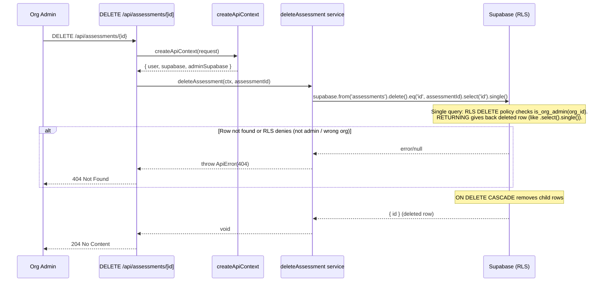
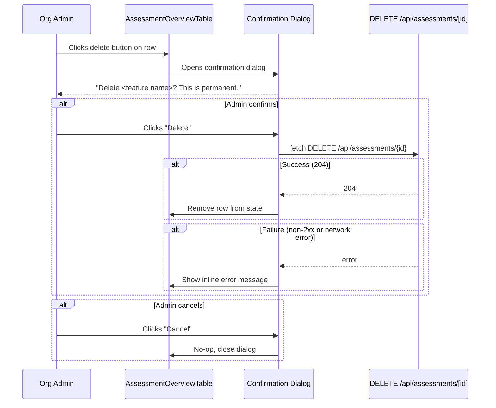
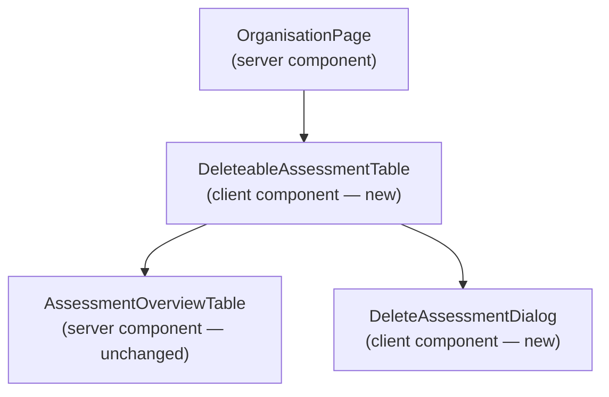

# LLD — Epic 3: Assessment Deletion

## Document Control

| Field | Value |
|-------|-------|
| Epic | #317 — V4 assessment deletion |
| Requirements | `docs/requirements/v4-requirements.md` §Epic 3 |
| HLD reference | `docs/design/v1-design.md` §L4 (schema, RLS, API contracts) |
| Status | Story 3.1 implemented (#318); Story 3.2 draft |
| Created | 2026-04-24 |
| Revised | 2026-04-24 — Story 3.1 (#318) synced |

---

## Part A — Human-Reviewable Design

### Purpose

Add the ability for Org Admins to permanently delete assessments (any status) from the organisation dashboard. Two stories: a DELETE API endpoint with RLS policy (3.1) and a UI delete action with confirmation dialog (3.2).

### Behavioural Flows

#### Story 3.1 — Delete API Endpoint



#### Story 3.2 — Delete from Organisation Page



### Invariants

| # | Invariant | Verification |
|---|-----------|-------------|
| I1 | Only org admins can delete assessments | RLS DELETE policy + test: non-admin DELETE returns 404 |
| I2 | Cascade removes all child data (questions, participants, answers, artefact PRs, artefact issues) | Test: after delete, count of child rows = 0 |
| I3 | Assessment in any status can be deleted | Test: delete succeeds for each status value |
| I4 | Confirmation dialog prevents accidental deletion | E2E/manual: clicking delete shows dialog before API call |
| I5 | Failed delete does not remove the row from the UI | Test: on API error, row remains in table |

### Acceptance Criteria + BDD Specs

See Part B §3.1 and §3.2 for per-story BDD specs.

---

## Part B — Agent-Implementable Design

### Story 3.1: Delete Assessment API Endpoint

#### Layers

- **DB** — New RLS DELETE policy on `assessments`
- **BE** — DELETE handler in `src/app/api/assessments/[id]/route.ts`, service in `src/app/api/assessments/[id]/delete-service.ts`

#### Database — RLS DELETE policy

Add to `supabase/schemas/policies.sql`:

```sql
CREATE POLICY assessments_delete_admin ON assessments
  FOR DELETE USING (is_org_admin(org_id));
```

Pattern matches existing `assessments_update_admin` policy. No additional policies needed on child tables — `ON DELETE CASCADE` foreign keys handle cleanup.

#### Internal decomposition

**Controller** (`src/app/api/assessments/[id]/route.ts` — add `DELETE` export):

```typescript
export async function DELETE(
  request: NextRequest,
  { params }: RouteContext,
) {
  try {
    const { id } = await params;
    const ctx = await createApiContext(request);
    await deleteAssessment(ctx, id);
    return new NextResponse(null, { status: 204 });
  } catch (error) {
    return handleApiError(error);
  }
}
```

Controller is ≤5 lines in body. Calls `createApiContext(request)`, delegates to service.

**Service** (`src/app/api/assessments/[id]/delete-service.ts`):

```typescript
import { ApiError } from '@/lib/api/errors';
import { logger } from '@/lib/logger';
import type { ApiContext } from '@/lib/api/context';

export async function deleteAssessment(
  ctx: ApiContext,
  assessmentId: string,
): Promise<void> {
  // Use user-scoped client so RLS enforces org membership + admin role.
  // The SELECT confirms existence; the DELETE enforces admin via RLS policy.
  const { data, error } = await ctx.supabase
    .from('assessments')
    .delete()
    .eq('id', assessmentId)
    .select('id')
    .single();

  if (error || !data) {
    logger.warn({ assessmentId, err: error }, 'DELETE /api/assessments/[id]: not found or denied');
    throw new ApiError(404, 'Assessment not found');
  }
}
```

Key decisions:
- Uses `ctx.supabase` (user-scoped), NOT `ctx.adminSupabase`. RLS enforces both existence check and admin authorisation in a single query.
- `.delete().eq('id', assessmentId).select('id').single()` — the `.select().single()` chain lets us detect whether the row was actually deleted (returns the deleted row) vs not found/denied (returns error/null).
- No need for a separate `assertOrgAdmin` call — the RLS DELETE policy handles it. If the user is not an org admin, the delete returns 0 rows, which we treat as 404 (matching the existing pattern of hiding row existence from non-admins).
- No `org_id` scoping needed (ADR-0025 applies to service-role writes only; this is a user-scoped query with RLS).

#### Contract types (ADR-0014)

Add to the existing route file's contract block:

```typescript
/**
 * DELETE /api/assessments/[id]
 *
 * Path parameters:
 *   id  (string, required) — assessment UUID
 *
 * Returns 204 No Content | 401 unauthenticated | 404 not found (RLS hides)
 */
```

No response body — 204 returns empty.

#### BDD specs

```typescript
describe('DELETE /api/assessments/[id]', () => {
  describe('Given an authenticated Org Admin', () => {
    it('should return 204 and delete the assessment when the ID exists', () => {});
    it('should cascade-delete all child rows (questions, participants, answers, artefact PRs, artefact issues)', () => {});
    it('should return 404 when the assessment ID does not exist', () => {});
    it('should delete assessments regardless of status (created, awaiting_responses, completed, rubric_failed, etc.)', () => {});
  });

  describe('Given an unauthenticated request', () => {
    it('should return 401 Unauthorized', () => {});
  });

  describe('Given an authenticated user who is not an Org Admin', () => {
    it('should return 404 Not Found (RLS hides the row)', () => {});
  });
});
```

#### Files touched

| File | Change |
|------|--------|
| `supabase/schemas/policies.sql` | Add `assessments_delete_admin` RLS policy |
| `src/app/api/assessments/[id]/route.ts` | Add DELETE export + contract JSDoc |
| `src/app/api/assessments/[id]/delete-service.ts` | New file — `deleteAssessment` service function |
| `supabase/migrations/<generated>` | Generated via `supabase db diff` |
| `tests/app/api/assessments/delete-assessment.test.ts` | New test file |

> **Implementation note (issue #318):** Built exactly as specified. Policy, service, controller,
> and contract JSDoc match the LLD verbatim. 13 tests covering all 7 acceptance criteria and
> invariants I1–I3. No design deviations.

---

### Story 3.2: Delete Assessment from Organisation Page

#### Layers

- **FE** — Client component wrapper for delete action, confirmation dialog

#### Structural overview



The existing `AssessmentOverviewTable` is a pure presentational server component. Rather than converting it to a client component (which would pull in unnecessary client JS for the table rendering), wrap it in a thin client component that manages delete state.

#### Internal decomposition

**`DeleteableAssessmentTable`** (`src/app/(authenticated)/organisation/deleteable-assessment-table.tsx`):

Client component that:
1. Holds `assessments` state (initialised from server-fetched data)
2. Renders `AssessmentOverviewTable` with an extra "Actions" column via a render prop or by extending the table
3. On delete button click, opens `DeleteAssessmentDialog`
4. On confirmed delete, calls `DELETE /api/assessments/{id}`, removes row from state on success, shows error on failure

**Approach decision — extend table vs wrap:**

The simplest approach: modify `AssessmentOverviewTable` to accept an optional `onDelete` callback prop. When provided, render a delete button in each row. The table remains a presentational component (no `'use client'` needed — it receives the callback from the client parent). The client wrapper provides the callback and manages state.

Updated `AssessmentOverviewTable` signature:

```typescript
interface AssessmentOverviewTableProps {
  assessments: AssessmentListItem[];
  onDelete?: (id: string) => void;
}
```

When `onDelete` is provided, add an "Actions" column with a delete button (trash icon or text).

**`DeleteAssessmentDialog`** (`src/app/(authenticated)/organisation/delete-assessment-dialog.tsx`):

Client component that renders a modal/dialog:
- Props: `assessment: { id: string; feature_name: string | null; pr_number: number | null } | null`, `onConfirm: () => void`, `onCancel: () => void`, `isDeleting: boolean`, `error: string | null`
- Shows assessment name (feature name or `PR #N`)
- States: "Delete {name}? This action is permanent and cannot be undone."
- Two buttons: "Cancel" (secondary) and "Delete" (destructive/red)
- While deleting: "Delete" button shows loading state
- On error: inline error message below the dialog text

Uses the native HTML `<dialog>` element (no library dependency needed). Style with existing design tokens.

**`DeleteableAssessmentTable`** (`src/app/(authenticated)/organisation/deleteable-assessment-table.tsx`):

```typescript
'use client';

interface Props {
  initialAssessments: AssessmentListItem[];
}

export function DeleteableAssessmentTable({ initialAssessments }: Props) {
  // State: assessments list, dialog target, loading, error
  // onDelete callback: set dialog target
  // onConfirm: fetch DELETE, remove from list on success, set error on failure
  // Render: <AssessmentOverviewTable assessments={...} onDelete={...} />
  //         <DeleteAssessmentDialog ... />
}
```

**Organisation page update** (`src/app/(authenticated)/organisation/page.tsx`):

Replace `<AssessmentOverviewTable assessments={assessments} />` with `<DeleteableAssessmentTable initialAssessments={assessments} />`.

#### BDD specs

```typescript
describe('DeleteableAssessmentTable', () => {
  describe('Given the assessment overview table', () => {
    it('should render a delete button for each assessment row', () => {});
  });

  describe('Given the admin clicks the delete button', () => {
    it('should open a confirmation dialog showing the assessment feature name', () => {});
    it('should show "PR #N" when the assessment has no feature name', () => {});
  });

  describe('Given the admin confirms deletion', () => {
    it('should call DELETE /api/assessments/[id]', () => {});
    it('should remove the row from the table on success (no page reload)', () => {});
  });

  describe('Given the admin cancels the confirmation dialog', () => {
    it('should not call the API and leave the table unchanged', () => {});
  });

  describe('Given the delete API call fails', () => {
    it('should display an inline error message near the table', () => {});
    it('should keep the assessment row in the table', () => {});
  });
});
```

#### Files touched

| File | Change |
|------|--------|
| `src/app/(authenticated)/organisation/assessment-overview-table.tsx` | Add optional `onDelete` prop + Actions column |
| `src/app/(authenticated)/organisation/deleteable-assessment-table.tsx` | New client component — delete state management |
| `src/app/(authenticated)/organisation/delete-assessment-dialog.tsx` | New client component — confirmation dialog |
| `src/app/(authenticated)/organisation/page.tsx` | Replace `AssessmentOverviewTable` with `DeleteableAssessmentTable` |
| `tests/app/(authenticated)/organisation/deleteable-assessment-table.test.tsx` | New test file |
