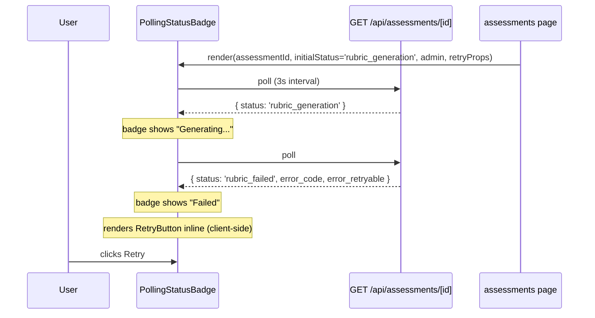
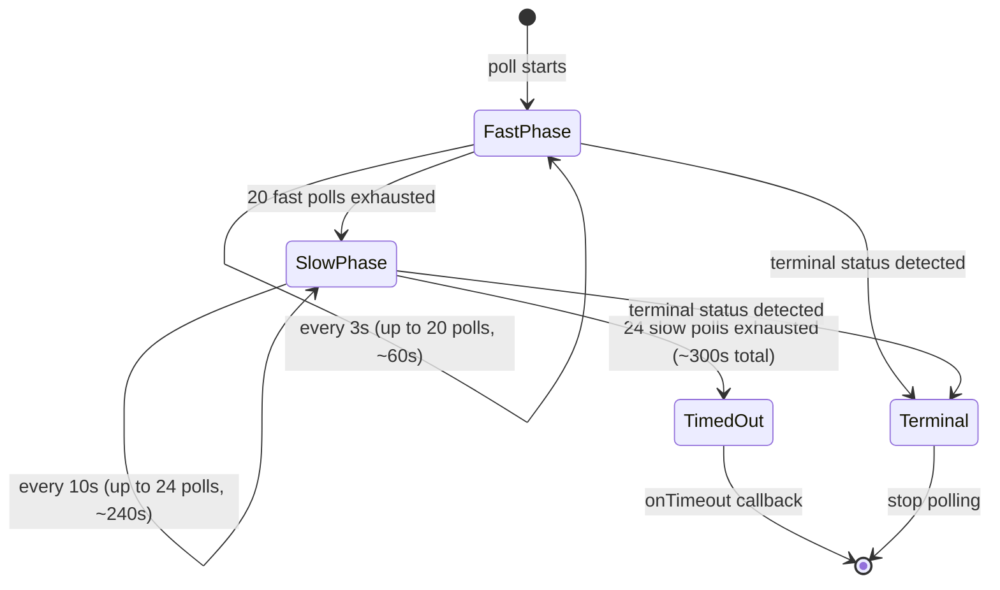

# LLD — #333: LLM Resilience (Retry, Polling, Abort)

## Change Log

| Date | Author | Changes |
|------|--------|---------|
| 2026-04-25 | LS / Claude | Initial LLD — four fixes: withRetry on generateWithTools, client-side retry button, adaptive polling, AbortSignal on chatCall. |

---

## Part A — Human-Reviewable

### Purpose

Fix four related resilience gaps in the rubric generation pipeline that surfaced when OpenRouter returned a 429 rate limit during a tool-use rubric generation call:

- **A.** `generateWithTools` does not retry on transient HTTP errors (429, 5xx).
- **B.** The retry button is invisible after polling detects `rubric_failed` (server/client rendering boundary).
- **C.** The polling window (60s) is shorter than the LLM pipeline timeout (120s+).
- **D.** The loop-level `AbortSignal` is not passed to `chatCall`, so the timeout cannot cancel in-flight LLM requests.

### Behavioural Flow — Fix A: Retry on Transient Errors

```mermaid
sequenceDiagram
  participant Caller as assess-pipeline
  participant Client as OpenRouterClient
  participant Loop as runToolLoop
  participant LLM as OpenRouter

  Caller->>Client: generateWithTools(req)
  Client->>Client: withRetry(fn)
  Client->>Loop: runToolLoop(params)
  Loop->>LLM: chatCall(sdkReq)
  LLM-->>Loop: 429 RateLimitError
  Loop-->>Client: throws RateLimitError
  Client->>Client: classifyException → rate_limit, retryable: true
  Client->>Client: delay(attempt=0) → 1000ms
  Client->>Loop: runToolLoop(params) [retry 1]
  Loop->>LLM: chatCall(sdkReq)
  LLM-->>Loop: 200 OK
  Loop-->>Client: LLMResult success
  Client-->>Caller: LLMResult success
```

### Behavioural Flow — Fix B: Retry Button After Polling



### Behavioural Flow — Fix C: Adaptive Polling



### Invariants

| # | Invariant | Verification |
|---|-----------|-------------|
| I1 | `generateWithTools` retries transient errors (429, 5xx) with exponential backoff, up to `maxRetries` attempts | Unit test: mock chatCall to throw 429 twice then succeed; assert 3 calls total |
| I2 | `generateWithTools` does not retry non-transient errors (401, 403) | Unit test: mock chatCall to throw 401; assert 1 call total |
| I3 | Each retry starts a fresh tool loop (new message history, reset counters) | Unit test: verify `runToolLoop` receives fresh `startMs` on each retry |
| I4 | Retry button appears client-side when polling detects `rubric_failed` without page refresh | Unit test: render `PollingStatusBadge` with admin=true, mock fetch to return `rubric_failed`, assert `RetryButton` rendered |
| I5 | Polling covers at least 300s before timing out | Unit test: assert `FAST_POLLS * FAST_INTERVAL + SLOW_POLLS * SLOW_INTERVAL >= 300_000` |
| I6 | Polling slows from 3s to 10s after the fast phase | Unit test: advance timers through fast phase, verify next poll scheduled at 10s |
| I7 | `AbortSignal` passed to `chatCall` can cancel in-flight LLM requests | Unit test: abort the signal mid-call, assert chatCall rejects with AbortError |

### Acceptance Criteria

- [ ] Given a 429 from OpenRouter, when `generateWithTools` is called, then it retries with exponential backoff (up to `maxRetries` attempts) before failing
- [ ] Given a non-retryable error (401), when `generateWithTools` is called, then it fails immediately without retry
- [ ] Given a rubric generation that fails during polling, when the status transitions to `rubric_failed`, then the retry button appears without requiring a manual page refresh
- [ ] Given polling has been active for >60s, when the fast phase ends, then the interval increases to 10s
- [ ] Given polling runs for the full duration, then the total window covers at least 300s
- [ ] Given the loop timeout fires, when a chatCall is in flight, then the HTTP request is aborted

---

## Part B — Agent-Implementable

### Fix A — Wrap `generateWithTools` in `withRetry`

**File:** `src/lib/engine/llm/client.ts`

**Current code (lines 52–62):**

```typescript
generateWithTools<T extends z.ZodType>(
  request: GenerateWithToolsRequest<T>,
): Promise<LLMResult<GenerateWithToolsData<z.infer<T>>>> {
  return runToolLoop({
    req: request,
    chatCall: (args: SdkRequest) =>
      this.client.chat.completions.create(args as never) as unknown as Promise<SdkResponse>,
    defaultModel: this.defaultModel,
    startMs: Date.now(),
  });
}
```

**Change:** Wrap the `runToolLoop` call in `this.withRetry()`. The tool loop is idempotent from a fresh start — each retry creates a new message history and resets counters via `makeInitialState`.

```typescript
generateWithTools<T extends z.ZodType>(
  request: GenerateWithToolsRequest<T>,
): Promise<LLMResult<GenerateWithToolsData<z.infer<T>>>> {
  return this.withRetry(() =>
    runToolLoop({
      req: request,
      chatCall: (args: SdkRequest) =>
        this.client.chat.completions.create(args as never) as unknown as Promise<SdkResponse>,
      defaultModel: this.defaultModel,
      startMs: Date.now(),
    }),
  );
}
```

`withRetry` already handles:
- Catching exceptions via `classifyException` (which maps 429 → `rate_limit`, retryable: true)
- Exponential backoff via `this.delay(attempt)`
- Returning non-retryable errors immediately
- Returning `LLMResult` failures after exhausting retries

No changes to `withRetry`, `classifyException`, or `classifyHttpError` needed.

**Test file:** `tests/lib/engine/llm/generate-with-tools.test.ts`

```typescript
describe('Given a transient 429 error from chatCall', () => {
  it('should retry with exponential backoff and succeed on second attempt', async () => {
    // Given: chatCall throws 429 on first call, succeeds on second
    // When: generateWithTools is called
    // Then: result is successful, chatCall was called twice
  });

  it('should return rate_limit error after exhausting retries', async () => {
    // Given: chatCall throws 429 on every call
    // When: generateWithTools is called
    // Then: result.error.code === 'rate_limit', chatCall called maxRetries+1 times
  });
});

describe('Given a non-retryable 401 error from chatCall', () => {
  it('should fail immediately without retry', async () => {
    // Given: chatCall throws 401
    // When: generateWithTools is called
    // Then: result.error.code === 'unknown', chatCall called once
  });
});
```

### Fix B — Client-Side Retry Button After Polling

**Files:**
- `src/app/(authenticated)/assessments/polling-status-badge.tsx` — add retry button rendering
- `src/app/(authenticated)/assessments/page.tsx` — remove server-side retry button conditional for `rubric_generation` rows
- `src/app/(authenticated)/assessments/poll-status.ts` — extend `PollSnapshot` with error fields

#### poll-status.ts changes

Extend `AssessmentPollResponse` and `PollSnapshot` to carry error fields needed by `RetryButton`:

```typescript
interface AssessmentPollResponse {
  status: string;
  rubric_progress?: string | null;
  rubric_progress_updated_at?: string | null;
  rubric_error_code?: string | null;
  rubric_retry_count?: number;
  rubric_error_retryable?: boolean | null;
}

export interface PollSnapshot {
  readonly status: string;
  readonly rubricProgress: string | null;
  readonly rubricProgressUpdatedAt: string | null;
  readonly rubricErrorCode: string | null;
  readonly rubricRetryCount: number;
  readonly rubricErrorRetryable: boolean | null;
}
```

Update `toSnapshot` to map the new fields (defaulting to `null`/`0`).

#### polling-status-badge.tsx changes

Accept additional props for admin status and max retries. When the polled status is `rubric_failed`, render the `RetryButton` inline:

```typescript
interface Props {
  assessmentId: string;
  initialStatus: string;
  admin: boolean;
  maxRetries: number;
}

export function PollingStatusBadge({ assessmentId, initialStatus, admin, maxRetries }: Props) {
  const { status, rubricProgress, rubricProgressUpdatedAt, rubricErrorCode,
          rubricRetryCount, rubricErrorRetryable, timedOut } =
    useStatusPoll(assessmentId, initialStatus);

  // ... existing badge + progress + stale rendering ...

  {admin && status === 'rubric_failed' && (
    <>
      {rubricErrorCode && (
        <span className="text-caption text-text-secondary">{rubricErrorCode}</span>
      )}
      <RetryButton
        assessmentId={assessmentId}
        retryCount={rubricRetryCount}
        maxRetries={maxRetries}
        errorRetryable={rubricErrorRetryable}
      />
    </>
  )}
}
```

#### use-status-poll.ts changes

Extend `PollResult` with the new snapshot fields (`rubricErrorCode`, `rubricRetryCount`, `rubricErrorRetryable`), pass through from snapshot state.

#### page.tsx changes

For rows with `status === 'rubric_generation'`, pass `admin` and `maxRetries` to `PollingStatusBadge`. Remove the separate `RetryButton` conditional for these rows — the badge now handles it.

Keep the existing server-side `RetryButton` rendering for rows that are already `rubric_failed` on page load (those don't need polling).

```tsx
{a.status === 'rubric_generation'
  ? <PollingStatusBadge
      assessmentId={a.id}
      initialStatus={a.status}
      admin={admin}
      maxRetries={MAX_RETRIES}
    />
  : <>
      <StatusBadge status={a.status} />
      {a.status === 'rubric_failed' && a.rubric_error_code && (
        <span className="text-caption text-text-secondary">{a.rubric_error_code}</span>
      )}
      {admin && a.status === 'rubric_failed' && (
        <RetryButton
          assessmentId={a.id}
          retryCount={a.rubric_retry_count}
          maxRetries={MAX_RETRIES}
          errorRetryable={a.rubric_error_retryable}
        />
      )}
    </>}
```

**Constraint:** The GET `/api/assessments/[id]` response already includes `rubric_error_code`, `rubric_retry_count`, and `rubric_error_retryable` — verify this before implementing. If not, add them to the select clause.

**Test file:** `tests/app/(authenticated)/assessments/polling-badge-behaviour.test.ts`

```typescript
describe('Given polling detects rubric_failed for an admin user', () => {
  it('should render RetryButton with error code and retry props');
  it('should not render RetryButton for non-admin users');
});

describe('Given polling detects rubric_failed for a non-admin user', () => {
  it('should render StatusBadge but not RetryButton');
});
```

### Fix C — Adaptive Polling

**File:** `src/app/(authenticated)/assessments/poll-status.ts`

Replace fixed `MAX_POLLS` with a two-phase approach:

```typescript
export const FAST_INTERVAL_MS = 3_000;
export const SLOW_INTERVAL_MS = 10_000;
export const FAST_POLLS = 20;   // ~60s at 3s
export const SLOW_POLLS = 24;   // ~240s at 10s — total ~300s
```

Update `startStatusPoll` to track which phase the poll is in:

```typescript
export function startStatusPoll(
  assessmentId: string,
  callbacks: PollCallbacks,
  fetchFn: typeof fetch = fetch,
): () => void {
  const controller = new AbortController();
  let pollCount = 0;
  let timerId: ReturnType<typeof setTimeout>;

  function currentInterval(): number {
    return pollCount <= FAST_POLLS ? FAST_INTERVAL_MS : SLOW_INTERVAL_MS;
  }

  function maxTotalPolls(): number {
    return FAST_POLLS + SLOW_POLLS;
  }

  const poll = async () => {
    pollCount += 1;
    if (pollCount > maxTotalPolls()) {
      callbacks.onTimeout();
      return;
    }

    try {
      const res = await fetchFn(`/api/assessments/${assessmentId}`, {
        signal: controller.signal,
      });
      if (!res.ok) {
        timerId = setTimeout(poll, currentInterval());
        return;
      }
      const data = await res.json() as AssessmentPollResponse;
      const snapshot = toSnapshot(data);
      callbacks.onStatusChange(snapshot);
      if (isTerminalStatus(snapshot.status)) return;
    } catch {
      if (controller.signal.aborted) return;
    }

    timerId = setTimeout(poll, currentInterval());
  };

  timerId = setTimeout(poll, currentInterval());

  return () => {
    controller.abort();
    clearTimeout(timerId);
  };
}
```

**Backward compatibility:** `POLL_INTERVAL_MS` and `MAX_POLLS` are currently exported. Check if anything imports them. If so, re-export `FAST_INTERVAL_MS` as `POLL_INTERVAL_MS` and `FAST_POLLS + SLOW_POLLS` as `MAX_POLLS` for compatibility — or update importers directly.

**Test file:** `tests/app/(authenticated)/assessments/poll-status.test.ts`

```typescript
describe('Given adaptive polling intervals', () => {
  it('should poll at 3s intervals during the fast phase (first 20 polls)');
  it('should poll at 10s intervals during the slow phase (polls 21–44)');
  it('should time out after the slow phase (~300s total)');
  it('should stop immediately when a terminal status is received during slow phase');
});
```

### Fix D — Pass AbortSignal to chatCall

**File:** `src/lib/engine/llm/tool-loop.ts`

**Current code (line 295):**

```typescript
const resp = await chatCall({
  model,
  max_tokens: maxTokens,
  messages: state.messages,
  tools: req.tools.length ? req.tools.map(toOpenAIToolSpec) : undefined,
  response_format: { type: 'json_object' },
});
```

**Change:** Extend `SdkRequest` with an optional `signal` field and pass the loop signal:

```typescript
export interface SdkRequest {
  readonly model: string;
  readonly max_tokens: number;
  readonly messages: readonly unknown[];
  readonly tools?: readonly unknown[];
  readonly response_format?: { readonly type: 'json_object' };
  readonly signal?: AbortSignal;
}
```

In `runToolLoop`, pass the signal:

```typescript
const resp = await chatCall({
  model,
  max_tokens: maxTokens,
  messages: state.messages,
  tools: req.tools.length ? req.tools.map(toOpenAIToolSpec) : undefined,
  response_format: { type: 'json_object' },
  signal: loopSignal,
});
```

In `client.ts`, thread the signal through to the OpenAI SDK:

```typescript
chatCall: (args: SdkRequest) =>
  this.client.chat.completions.create(
    { ...args, signal: undefined } as never,
    { signal: args.signal },
  ) as unknown as Promise<SdkResponse>,
```

The OpenAI SDK accepts `signal` as a request option (second argument), not as a body parameter.

**Test file:** `tests/lib/engine/llm/generate-with-tools.test.ts`

```typescript
describe('Given the loop AbortSignal fires during a chatCall', () => {
  it('should reject with an abort error');
});
```

### BDD Specs Summary

```typescript
// Fix A — tests/lib/engine/llm/generate-with-tools.test.ts
describe('generateWithTools retry on transient errors (#333 Fix A)', () => {
  it('retries on 429 rate limit with exponential backoff');
  it('returns rate_limit error after exhausting retries');
  it('does not retry on non-retryable errors (401, 403)');
  it('starts a fresh tool loop on each retry attempt');
});

// Fix B — tests/app/(authenticated)/assessments/polling-badge-behaviour.test.ts
describe('retry button visibility after polling (#333 Fix B)', () => {
  it('renders RetryButton when polling detects rubric_failed for admin');
  it('does not render RetryButton for non-admin users');
  it('shows error code alongside retry button');
  it('respects max retry count and retryable flag from poll response');
});

// Fix C — tests/app/(authenticated)/assessments/poll-status.test.ts
describe('adaptive polling (#333 Fix C)', () => {
  it('polls at 3s intervals during fast phase (first 20 polls)');
  it('polls at 10s intervals during slow phase (polls 21-44)');
  it('times out after ~300s total');
  it('stops on terminal status during slow phase');
});

// Fix D — tests/lib/engine/llm/generate-with-tools.test.ts
describe('AbortSignal on chatCall (#333 Fix D)', () => {
  it('passes loop AbortSignal to chatCall');
  it('aborts in-flight LLM request when loop timeout fires');
});
```

### Design References

- [lld-v2-e17-agentic-retrieval.md](lld-v2-e17-agentic-retrieval.md) — tool-use loop design; §17.1c covers `runToolLoop`, needs changelog entry for retry + abort signal additions
- [lld-phase-2-demo-ready.md](lld-phase-2-demo-ready.md) §2d.1 — retry button design; needs changelog entry for client-side rendering after polling
- [ADR-0023](../adr/0023-tool-use-loop-rubric-generation.md) — tool-use loop architectural decision
