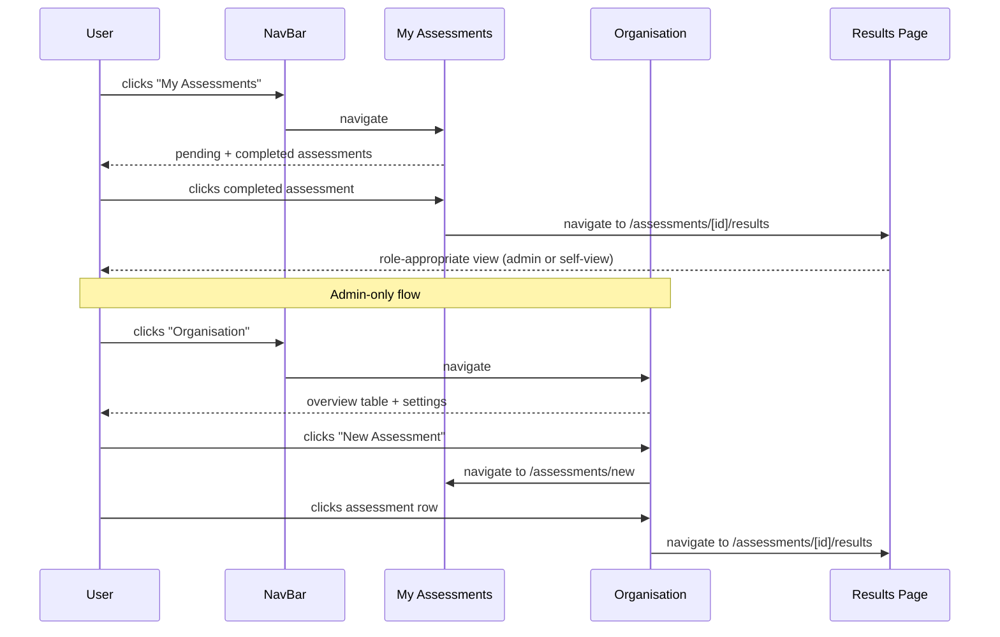
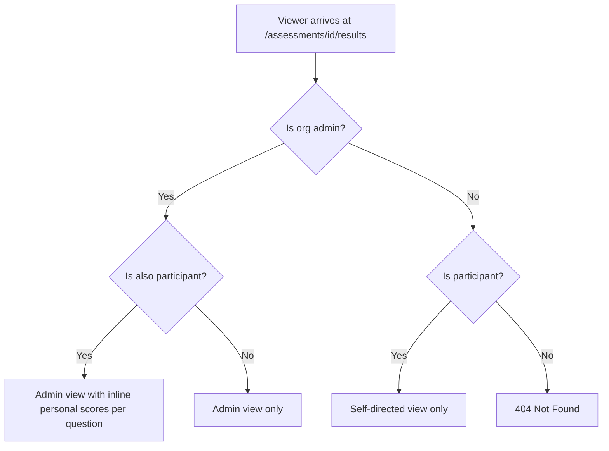
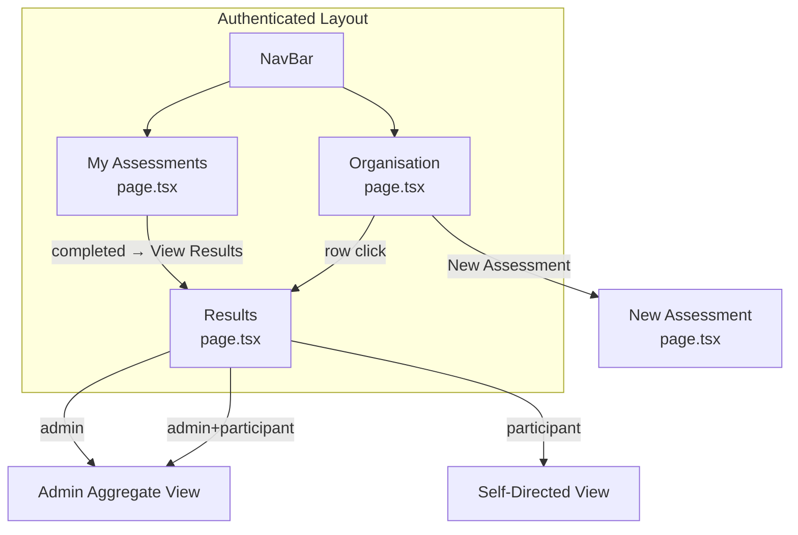

# Low-Level Design: Navigation & Results View Separation

## Document Control

| Field | Value |
|-------|-------|
| Version | 1.6 |
| Status | Revised |
| Author | LS / Claude |
| Created | 2026-04-21 |
| Revised | 2026-04-21 — Issue #296 sync; 2026-04-22 — Issues #297 + #295 sync; 2026-04-24 — Issue #315 sync; 2026-04-27 — Issue #377 sync; 2026-04-27 — Issue #377 creation-flow correction |
| Parent | [v1-design.md](v1-design.md) |
| Epic | #294 |

---

## Part A — Human-Reviewable Design

### Purpose

Separate admin and participant concerns across the navigation, assessments list, organisation page, and results views. Currently these are mixed: admin actions appear on participant pages, completed assessments are invisible, and the results page shows a single view regardless of role.

### Stories covered

| Story | Summary |
|-------|---------|
| 5.4 | Navigation and Layout — My Assessments (pending + completed), Organisation (admin dashboard) |
| 3.3 | Completion dashboard (admin sees which participants answered) |
| 3.4 | FCS Scoring and Results — self-directed private view for participants |
| 6.2 | FCS Assessment Results Page — admin aggregate view |
| 6.3 | Organisation Assessment Overview — minimal table (no filtering/sorting in first pass) |

### Behavioural flows

#### Assessment navigation flow



#### Results page role detection



### Structural overview



### Invariants

| # | Invariant | Verification |
|---|-----------|-------------|
| I1 | Participant self-view never shows reference answers | BDD spec: `it('does not show reference answers')` |
| I2 | Org Admin never sees individual participant scores (only aggregate) | BDD spec: `it('does not show individual participant scores')` |
| I3 | "New Assessment" button only appears on Organisation page, never My Assessments | BDD spec on both pages |
| I4 | Participant's own scores are queried via their authenticated session (RLS), not admin client | Code review: self-view query uses `supabase` not `adminSupabase` |
| I5 | Team aggregate is the organisational metric — self-view is a private learning aid | ADR-0005 |

### Acceptance criteria

See individual task issues: #295, #296, #297.

---

## Part B — Agent-Implementable Detail

### §1 — My Assessments: Show All Statuses and Link to Results

**Task:** #295
**Stories:** 5.4
**Layers:** FE
**Affected file:** `src/app/(authenticated)/assessments/page.tsx`

#### HLD reference

- [v1-design.md §C7](v1-design.md) — Web UI capabilities
- [frontend-system.md § Layout Shell](frontend-system.md) — page structure

#### Current state

The page queries assessments with `.in('status', ['rubric_generation', 'rubric_failed', 'awaiting_responses'])` — only pending statuses. Completed assessments are invisible. The page also renders a "New Assessment" link for admins.

#### Changes

1. **Remove status filter** — query all assessments for the org (remove the `.in('status', [...])` filter). **Scope to participant** — join through `assessment_participants!inner(user_id)` and filter `.eq('assessment_participants.user_id', user.id)` so the page shows only assessments the current user participates in, regardless of admin status. The admin RLS policy (`assessments_select_admin`) intentionally returns all org assessments for admin-specific views (Organisation page); this application-layer filter ensures the My Assessments page shows the correct personal scope. (Issue #306.)
2. **Partition into two groups** — in the component, split the fetched assessments into:
   - `pending`: status in `rubric_generation`, `rubric_failed`, `awaiting_responses`
   - `completed`: status in `completed`, `scoring`
3. **Render two sections** — "Pending" and "Completed" with separate empty states.
4. **Completed row** — show feature name, aggregate score (formatted as percentage), and a link to `/assessments/[id]/results`.
5. **Remove "New Assessment" button** — delete the `newAssessmentAction` block. **Remove** the `isOrgAdmin` / membership query — it was only kept for `RetryButton`, which is now in the Organisation admin view.

> **Implementation note (issue #295):** The membership query was retained because `RetryButton` was conditionally rendered for admins on failed rubric rows. Removing the query would have broken admin retry UX at the time.

> **Implementation note (issue #377):** The membership query and `RetryButton` were subsequently removed from the My Assessments page. Retry is an admin operational action and belongs in the Organisation admin view, not the participant list. `PollingStatusBadge` had its `admin` and `maxRetries` props removed at the same time. The `isAdmin` prop was also removed from `CreateAssessmentForm` (and its callers) as it was only used to pass `admin` to `PollingStatusBadge`. `RetryButton` is still rendered in the `rubric_failed` branch of `CreationProgress` (inside `create-assessment-form.tsx`) — directly from `useStatusPoll`, not via `PollingStatusBadge` — so admins can retry without navigating away during assessment creation.

#### Contract types

```typescript
// Extends PendingAssessment with fields needed for completed view
interface AssessmentItem {
  id: string;
  feature_name: string | null;
  status: AssessmentRow['status'];
  aggregate_score: number | null;
  created_at: string;
  rubric_error_code: string | null;
  rubric_retry_count: number;
  rubric_error_retryable: boolean | null;
}
```

#### Internal decomposition

No API route involved — this is a server component page that queries Supabase directly. The partition logic is a pure function:

```typescript
function partitionAssessments(
  assessments: AssessmentItem[],
): { pending: AssessmentItem[]; completed: AssessmentItem[] }

function toPercent(score: number | null): string
```

| File | Purpose |
|------|---------|
| `src/app/(authenticated)/assessments/page.tsx` | Server component — fetches, partitions, renders Pending and Completed sections. Defines local `toPercent` helper. |
| `src/app/(authenticated)/assessments/partition.ts` | Exports `AssessmentItem` interface and `partitionAssessments` function. |

> **Implementation note (issue #295):** `AssessmentItem` and `partitionAssessments` live in a sibling `partition.ts` module rather than in `page.tsx`. Next.js App Router restricts Page files to a narrow set of permitted exports (`default`, `metadata`, `generateMetadata`, etc.); the build fails with `"partitionAssessments" is not a valid Page export field` if non-page symbols are exported alongside the default page component. Caught by CI, not by `vitest`/`tsc` — `next build` runs an additional Page-export validator. `toPercent` is a single-use formatter and stays inlined in `page.tsx`.

#### BDD specs

```
describe('My Assessments page')
  describe('assessment list')
    it('shows pending assessments with status badges')
    it('shows completed assessments with aggregate score')
    it('links completed assessments to /assessments/[id]/results')
    it('does not show "New Assessment" button')
  describe('empty states')
    it('shows "No pending assessments" when none pending')
    it('shows "No completed assessments" when none completed')
```

---

### §2 — Organisation Page: Assessment Overview and New Assessment Action

**Task:** #296
**Stories:** 5.4, 6.3
**Layers:** FE
**Affected files:** `src/app/(authenticated)/organisation/page.tsx`, `src/app/(authenticated)/organisation/assessment-overview-table.tsx`, `src/app/(authenticated)/organisation/load-assessments.ts`

> **Implementation note (issue #296):** The table and the Supabase query were extracted into sibling
> files rather than inlined in `page.tsx`. This keeps the page within the 25-line route-body budget
> and lets the table component be exercised directly by isolated tests.

#### HLD reference

- [v1-design.md §C7](v1-design.md) — Web UI capabilities
- Story 6.3 — Organisation Assessment Overview

#### Current state

The page shows `PageHeader` with title "Organisation" and two forms: `OrgContextForm` and `RetrievalSettingsForm`. No assessment data is displayed.

#### Changes

1. **Add "New Assessment" action** to the `PageHeader` — same link as previously on My Assessments: `/assessments/new`.
2. **Add assessment overview table** between the header and the settings forms.
3. **Data fetching** — query assessments for the org with participant counts (reuse `fetchParticipantCounts` from `src/app/api/assessments/helpers.ts`, or inline a simpler server-component query).

#### Data query

The page is a server component using `createServerSupabaseClient`. The query and
participant-count enrichment are wrapped in an exported loader in
`load-assessments.ts`:

```typescript
export async function loadOrgAssessmentsOverview(
  supabase: SupabaseClient<Database>,
  orgId: string,
): Promise<AssessmentListItem[]> {
  const { data, error } = await supabase
    .from('assessments')
    .select(
      'id, type, status, pr_number, feature_name, aggregate_score, conclusion, ' +
      'config_comprehension_depth, created_at, rubric_error_code, rubric_retry_count, ' +
      'rubric_error_retryable, repositories!inner(github_repo_name)',
    )
    .eq('org_id', orgId)
    .order('created_at', { ascending: false })
    .limit(50);

  if (error) throw new Error(`loadOrgAssessmentsOverview: ${error.message}`);
  const rows = data ?? [];
  if (rows.length === 0) return [];

  const counts = await fetchParticipantCounts(rows.map((r) => r.id));
  return rows.map((row) => toListItem(row, counts));
}
```

For participant counts, `fetchParticipantCounts` (in `src/app/api/assessments/helpers.ts`)
uses `createSecretSupabaseClient` — RLS on `assessment_participants` restricts non-admin
reads to own rows only, so the admin page needs the service client for accurate totals.

> **Implementation note (issue #296):** The select list was extended to include
> `pr_number`, `conclusion`, and `config_comprehension_depth` so the loader can reuse
> `toListItem` and return the shared `AssessmentListItem` shape already used by
> `/api/assessments`. Keeping one projection across surfaces avoids a second row-mapping
> helper for the overview table.
>
> The loader throws on Supabase errors rather than silently returning an empty array
> (matching the `loadOrgPromptContext` pattern) — the evaluator flagged the silent-
> failure risk during Step 6b.

#### Table columns

| Column | Source |
|--------|--------|
| Feature / PR | `feature_name` or `PR #${pr_number}` |
| Repository | `repositories.github_repo_name` |
| Type | `type` (FCS / PRCC) |
| Status | `status`; inline `RetryButton` for `rubric_failed` rows (with `rubric_error_code` label); `RetryButton` disabled when `rubric_retry_count >= 3` or `rubric_error_retryable === false` |
| Score | `aggregate_score` (percentage or "—") |
| Completion | `completed/total` participants |
| Date | `created_at` (formatted) |

Each row links to `/assessments/[id]/results`.

#### Internal decomposition

No API route — server component. Two sibling modules plus a handful of private helpers:

```typescript
// load-assessments.ts
const ROW_LIMIT = 50;
export async function loadOrgAssessmentsOverview(
  supabase: SupabaseClient<Database>,
  orgId: string,
): Promise<AssessmentListItem[]>;

// assessment-overview-table.tsx
const MAX_RETRIES = 3;

export function AssessmentOverviewTable(
  { assessments, onDelete }: AssessmentOverviewTableProps,
): JSX.Element;

// Private helpers inside assessment-overview-table.tsx:
function formatFeature(item: AssessmentListItem): string;   // feature_name || 'PR #N' || '—'
function formatScore(score: number | null): string;         // '82%' or '—'
function formatDate(iso: string): string;                   // ISO date slice
function renderRow(a: AssessmentListItem, onDelete?: (a: AssessmentListItem) => void): JSX.Element;
function renderActionsCell(a: AssessmentListItem, onDelete: (a: AssessmentListItem) => void): JSX.Element;
function renderEmptyState(): JSX.Element;
```

> **Implementation note (issue #296):** The signature was simplified from
> `{ assessments, participantCounts }` to `{ assessments }`. Participant counts are baked
> into each `AssessmentListItem` by `toListItem` in the loader, so the table does not
> need a second prop. This keeps the component's props aligned with the shape returned
> by `/api/assessments` and the My Assessments list.

> **Implementation note (issue #377):** `AssessmentListItem` was extended with
> `rubric_error_code: string | null`, `rubric_retry_count: number`, and
> `rubric_error_retryable: boolean | null`. The loader select was updated accordingly.
> `AssessmentOverviewTable` renders `RetryButton` inline in the Status cell for
> `rubric_failed` rows, preceded by a `rubric_error_code` label when present.
> `MAX_RETRIES = 3` is a module-level constant in the table file.

#### BDD specs

```
describe('Organisation page')
  describe('assessment overview table')
    it('shows all assessments for the organisation')
    it('displays feature name, repo, type, status, score, completion, date')
    it('links each row to the results page')
    it('shows empty state when no assessments exist')
  describe('New Assessment action')
    it('shows "New Assessment" button in the page header')
    it('links to /assessments/new')
```

---

### §3 — Results Page: Role-Based View Separation

**Task:** #297
**Stories:** 3.4, 6.2
**Layers:** FE
**Affected file:** `src/app/assessments/[id]/results/page.tsx`

#### HLD reference

- [v1-design.md §C3](v1-design.md) — FCS capabilities (self-directed view)
- ADR-0005 — Single Aggregate Score with Self-Directed View (Option 4)
- Story 3.4 — FCS Scoring and Results
- Story 6.2 — FCS Assessment Results Page

#### Current state

The results page (`fetchResultsData`) already checks `isAdmin` and `isParticipant` for access control, but renders the same view for both. The `shouldRevealReferenceAnswers` gate controls reference answer visibility, but there is no self-directed view showing the participant's own scores.

#### Role detection

Already computed in `fetchResultsData`:
- `isAdmin` — from `orgMembershipResult.data?.github_role === 'admin'`
- `isParticipant` — from `participationResult.data`

Expose these to the page component (currently used only for the 404 guard).

#### Self-view data: participant's own scores

New query in `fetchResultsData` (only when `isParticipant`). The caller passes the viewer's own
`participant_id` (from `participationResult.data.id`) into the helper so the query stays tight
regardless of which RLS policy admits the rows:

```typescript
// Use the user's own session (RLS enforced) — NOT adminSupabase
const userSupabase = await createServerSupabaseClient();
const { data: myAnswers } = await userSupabase
  .from('participant_answers')
  .select('question_id, answer_text, score, score_rationale')
  .eq('assessment_id', assessmentId)
  .eq('participant_id', participantId)    // defence-in-depth vs OR'd admin RLS
  .eq('is_reassessment', false)
  .order('created_at', { ascending: true });
```

> **Implementation note (issue #297):** The original spec relied on `answers_select_own` alone
> to restrict rows to the authenticated user. In practice `policies.sql` OR's `answers_select_own`
> with `answers_select_admin`, so an admin-who-is-also-a-participant viewer would have received
> every participant's answers; `MyScoresSection`'s `.find(a => a.question_id === q.id)` would
> then have rendered an arbitrary match as "Your score"/"Your answer" — a correctness bug and a
> cross-participant data leak. The explicit `.eq('participant_id', participantId)` filter makes
> the helper correct regardless of which RLS policy admits the rows. This still satisfies
> invariant I4 (no admin client used).

#### Contract types

```typescript
interface MyAnswer {
  question_id: string;
  answer_text: string;
  score: number | null;
  score_rationale: string | null;
}

interface ResultsData {
  assessment: AssessmentWithRelations;
  questions: ScoredQuestion[];
  participantTotal: number;
  participantCompleted: number;
  isAdmin: boolean;
  isParticipant: boolean;
  myAnswers: MyAnswer[];  // empty if not a participant
}
```

#### View rendering logic

```typescript
// In the page component:
if (isAdmin) {
  // Render AdminAggregateView.
  // Pass myAnswers when isParticipant — AdminQuestionCard renders personal scores inline.
}

if (!isAdmin && isParticipant) {
  // Render SelfDirectedView only
  // - Questions with own scores and Naur layer labels
  // - Own submitted answers
  // - NO reference answers
}

// Combined admin+participant: handled above — AdminAggregateView receives myAnswers prop.
```

#### Self-directed view layout

For each question:
- Question number and text
- Naur layer label (using existing `NAUR_LABELS` map)
- Own score: formatted as `0.0–1.0` (not percentage — per Story 3.4 spec)
- Own submitted answer (from `myAnswers` matched by `question_id`)
- No reference answer shown

#### Internal decomposition

View sections are presentational — no data fetching, no side effects:

```typescript
function HeaderSection({ assessment, repoFullName, participantTotal, participantCompleted })
function AdminAggregateView({ assessment, questions, revealAnswers, myAnswers? })
function AdminQuestionCard({ q, scoringIncomplete, revealAnswers, mine?, isPersonalised })
function SelfDirectedView({ questions, myAnswers })

// Shared sub-components used by both AdminQuestionCard and SelfDirectedView:
function QuestionHeader({ q })           // question number + Badge(naur_layer) + question text + hint
function PersonalScoresBlock({ mine })   // "My Scores" label + decimal score + submitted answer text
```

> **Implementation note (issue #315):** The original spec included `MyScoresSection({ questions, myAnswers })` — a separate section that re-rendered all question text for combined admin+participant viewers. This caused verbatim question-text duplication (the core bug in #315). The section was removed and replaced with `AdminQuestionCard`, which merges personal scores inline within each question card in `AdminAggregateView`. The `AdminAggregateView` now accepts an optional `myAnswers` prop; when present, each card renders a `PersonalScoresBlock` beneath the aggregate data. The "My Scores" label is preserved inside each card, satisfying the existing test contract (`html.toContain('My Scores')`). `QuestionHeader` and `PersonalScoresBlock` are shared helpers that eliminate layout duplication between `AdminQuestionCard` and `SelfDirectedView`.

Data-fetching and formatting helpers:

```typescript
async function fetchMyAnswers(assessmentId: string, participantId: string): Promise<MyAnswer[]>
function toPercent(score: number | null): string       // aggregate scores
function toDecimalScore(score: number | null): string  // participant self-view scores (0.0–1.0)
function formatDate(iso: string): string
```

> **Implementation note (issue #297):** `HeaderSection` was extracted so the shared page
> header (feature name, repo, date, participant completion, depth badge) is rendered once
> across all three role branches. `toDecimalScore` complements `toPercent` because Story 3.4
> requires own scores in `0.00`–`1.00` form while aggregate scores stay in percentage form.

#### BDD specs

```
describe('Results page')
  describe('admin view')
    it('shows aggregate comprehension score')
    it('shows per-question aggregate scores')
    it('shows reference answers when all participants have submitted')
    it('does not show individual participant scores')
  describe('participant self-directed view')
    it('shows own per-question scores as 0.0–1.0')
    it('shows Naur layer label for each question')
    it('shows own submitted answers')
    it('does not show reference answers')
  describe('admin + participant combined view')
    it('shows admin aggregate view')
    it('shows personal score inline per question card (no separate My Scores section)')
    it('renders each question text exactly once (no duplication)')
  describe('access control')
    it('returns 404 for non-admin non-participant')
```

---

## Tasks

| # | Issue | Title | Layer | Est. lines | Wave |
|---|-------|-------|-------|-----------|------|
| T1 | #295 | My Assessments — show all statuses + link to results | FE | ~80 | 1 |
| T2 | #296 | Organisation page — assessment overview + New Assessment | FE | ~120 | 1 |
| T3 | #297 | Results page — role-based view separation | FE | ~150 | 1 |
| T4 | #441 | Org overview: project name column + filter; project dashboard reuses overview table | FE | ~130 | 2 |

T1–T3 are in Wave 1 — no shared files, fully parallelisable.
T4 depends on V11 E11.1–E11.4 being complete (projects exist, assessment `project_id` is non-null for FCS rows).

---

### §4 — Org Overview: Project Column + Filter; Project Dashboard Reuses Table

**Task:** #441
**Driver:** V11 post-implementation fix — two related issues resolved together:

1. **Story 2.2 violation:** The project dashboard built a bespoke card list (`assessment-list.tsx`) instead of reusing `AssessmentOverviewTable` as required by Story 2.2 AC 1 ("same columns as the existing pre-V11 FCS assessment list … reuses the existing list component").
2. **New enhancement:** The org overview table should surface project name and a project filter so admins can see which assessments belong to which project without navigating per-project.

Both are fixed in one PR because the shared fix is to extend `AssessmentOverviewTable` with an optional project column and filter, then use it in both surfaces.

#### Changes

**1. `AssessmentListItem` — add `project_name: string | null`**

Extend the type in `src/app/api/assessments/helpers.ts` and `toListItem` to carry the project name. PRCC rows have `project_id = null` and will have `project_name = null`.

```ts
export interface AssessmentListItem {
  // ... existing fields
  project_id: string | null;
  project_name: string | null; // NEW — null for PRCC rows
}
```

**2. `loadOrgAssessmentsOverview` — JOIN projects**

```ts
// load-assessments.ts
.select(
  '..., project_id, projects(name)',  // LEFT JOIN — PRCC rows have no project
)
```

Map `row.projects?.name ?? null` into `project_name` via `toListItem`.

**3. `AssessmentOverviewTable` — optional Project column + filter**

Add a `showProjectColumn?: boolean` prop. When true:
- Inserts "Project" as a header column.
- Each row cell renders `project_name` or "—" for PRCC rows.
- Renders a client-side project dropdown above the table (extracted as `ProjectFilter` if not already available from the pending queue — reuse `src/app/(authenticated)/assessments/project-filter.tsx` shape).

```ts
interface AssessmentOverviewTableProps {
  assessments: AssessmentListItem[];
  onDelete?: (assessment: AssessmentListItem) => void;
  showProjectColumn?: boolean; // default false — backward-compat
}
```

**4. Org page — pass `showProjectColumn`**

```tsx
<AssessmentOverviewTable
  assessments={assessments}
  onDelete={onDelete}
  showProjectColumn
/>
```

**5. Project dashboard — replace `assessment-list.tsx` with `AssessmentOverviewTable`**

`src/app/(authenticated)/projects/[id]/page.tsx`:
- Remove `<AssessmentList projectId={id} />` import.
- Fetch assessments directly in the page (server component pattern) filtered by `project_id`.
- Render `<AssessmentOverviewTable assessments={rows} />` (no `showProjectColumn` — scoped dashboard; no `onDelete` — deletion not available per-project in V11).
- Keep the empty-state path: when `rows.length === 0`, render the existing "No assessments yet" text + "Create the first assessment" CTA.
- Add a persistent "New Assessment" button above/alongside the section (Story 1.3 AC 1, Invariant I9 of E11.1 LLD).

#### Invariants

| # | Invariant | Verified by |
|---|-----------|-------------|
| I1 | Project dashboard uses `AssessmentOverviewTable`, not a bespoke list | Component identity test |
| I2 | Org overview "Project" column shows project name for FCS rows and "—" for PRCC rows | Unit test on `AssessmentOverviewTable` with `showProjectColumn=true` |
| I3 | Project filter on org overview is derived from the current dataset (not the full org project list) | Test: only projects represented in the loaded rows appear in the filter |
| I4 | Removing `assessment-list.tsx` does not leave any import site broken | `npx tsc --noEmit` |

#### BDD specs

```
describe('AssessmentOverviewTable — showProjectColumn')
  it('renders a Project column header when showProjectColumn is true')
  it('renders project_name in each row for FCS assessments')
  it('renders "—" in the Project cell for PRCC rows (project_id = null)')
  it('does NOT render a Project column when showProjectColumn is false (default)')

describe('Project dashboard — shared table')
  it('renders AssessmentOverviewTable filtered by project_id, not the bespoke card list')
  it('renders all standard columns: Feature/PR, Repository, Type, Status, Score, Completion, Date')
  it('renders New Assessment button even when assessments already exist')
  it('renders empty state CTA when project has no assessments')

describe('Org overview — project filter')
  it('project filter shows distinct projects from the loaded assessment rows')
  it('selecting a project filters the table to that project only')
  it('selecting "All projects" shows all rows')
```
