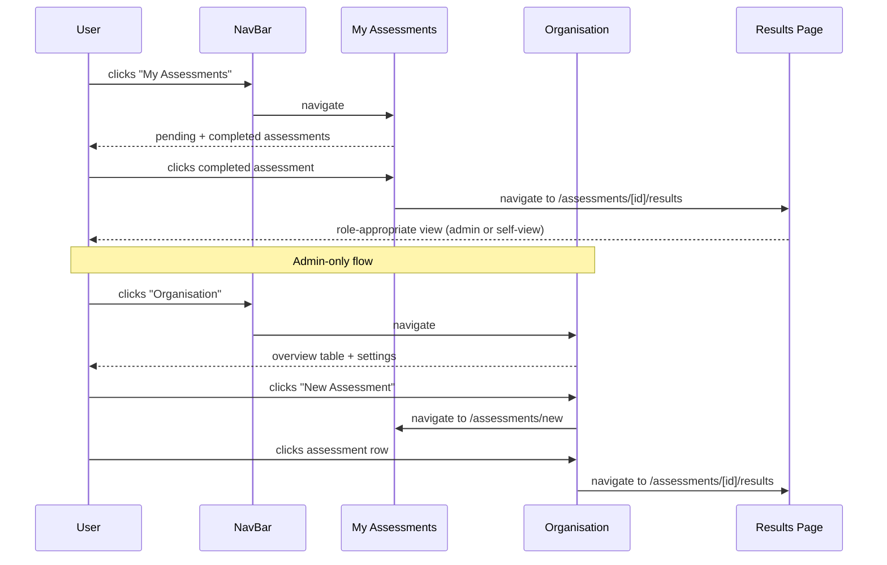
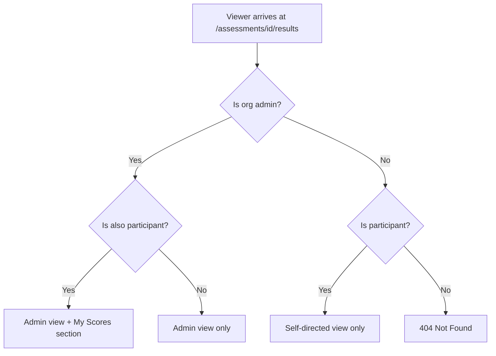
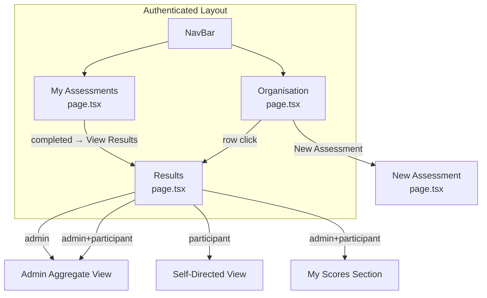

# Low-Level Design: Navigation & Results View Separation

## Document Control

| Field | Value |
|-------|-------|
| Version | 1.1 |
| Status | Revised |
| Author | LS / Claude |
| Created | 2026-04-21 |
| Revised | 2026-04-21 — Issue #296 sync |
| Parent | [v1-design.md](v1-design.md) |
| Epic | #294 |

---

## Part A — Human-Reviewable Design

### Purpose

Separate admin and participant concerns across the navigation, assessments list, organisation page, and results views. Currently these are mixed: admin actions appear on participant pages, completed assessments are invisible, and the results page shows a single view regardless of role.

### Stories covered

| Story | Summary |
|-------|---------|
| 5.4 | Navigation and Layout — My Assessments (pending + completed), Organisation (admin dashboard) |
| 3.3 | Completion dashboard (admin sees which participants answered) |
| 3.4 | FCS Scoring and Results — self-directed private view for participants |
| 6.2 | FCS Assessment Results Page — admin aggregate view |
| 6.3 | Organisation Assessment Overview — minimal table (no filtering/sorting in first pass) |

### Behavioural flows

#### Assessment navigation flow



#### Results page role detection



### Structural overview



### Invariants

| # | Invariant | Verification |
|---|-----------|-------------|
| I1 | Participant self-view never shows reference answers | BDD spec: `it('does not show reference answers')` |
| I2 | Org Admin never sees individual participant scores (only aggregate) | BDD spec: `it('does not show individual participant scores')` |
| I3 | "New Assessment" button only appears on Organisation page, never My Assessments | BDD spec on both pages |
| I4 | Participant's own scores are queried via their authenticated session (RLS), not admin client | Code review: self-view query uses `supabase` not `adminSupabase` |
| I5 | Team aggregate is the organisational metric — self-view is a private learning aid | ADR-0005 |

### Acceptance criteria

See individual task issues: #295, #296, #297.

---

## Part B — Agent-Implementable Detail

### §1 — My Assessments: Show All Statuses and Link to Results

**Task:** #295
**Stories:** 5.4
**Layers:** FE
**Affected file:** `src/app/(authenticated)/assessments/page.tsx`

#### HLD reference

- [v1-design.md §C7](v1-design.md) — Web UI capabilities
- [frontend-system.md § Layout Shell](frontend-system.md) — page structure

#### Current state

The page queries assessments with `.in('status', ['rubric_generation', 'rubric_failed', 'awaiting_responses'])` — only pending statuses. Completed assessments are invisible. The page also renders a "New Assessment" link for admins.

#### Changes

1. **Remove status filter** — query all assessments for the org (remove the `.in('status', [...])` filter).
2. **Partition into two groups** — in the component, split the fetched assessments into:
   - `pending`: status in `rubric_generation`, `rubric_failed`, `awaiting_responses`
   - `completed`: status in `completed`, `scoring`
3. **Render two sections** — "Pending" and "Completed" with separate empty states.
4. **Completed row** — show feature name, aggregate score (formatted as percentage), and a link to `/assessments/[id]/results`.
5. **Remove "New Assessment" button** — delete the `newAssessmentAction` block and the `isOrgAdmin` / membership query (no longer needed on this page unless used for other purposes — check before removing).

#### Contract types

```typescript
// Extends PendingAssessment with fields needed for completed view
interface AssessmentItem {
  id: string;
  feature_name: string | null;
  status: AssessmentRow['status'];
  aggregate_score: number | null;
  created_at: string;
  rubric_error_code: string | null;
  rubric_retry_count: number;
  rubric_error_retryable: boolean | null;
}
```

#### Internal decomposition

No API route involved — this is a server component page that queries Supabase directly. The partition logic is a pure function:

```typescript
function partitionAssessments(
  assessments: AssessmentItem[],
): { pending: AssessmentItem[]; completed: AssessmentItem[] }
```

#### BDD specs

```
describe('My Assessments page')
  describe('assessment list')
    it('shows pending assessments with status badges')
    it('shows completed assessments with aggregate score')
    it('links completed assessments to /assessments/[id]/results')
    it('does not show "New Assessment" button')
  describe('empty states')
    it('shows "No pending assessments" when none pending')
    it('shows "No completed assessments" when none completed')
```

---

### §2 — Organisation Page: Assessment Overview and New Assessment Action

**Task:** #296
**Stories:** 5.4, 6.3
**Layers:** FE
**Affected files:** `src/app/(authenticated)/organisation/page.tsx`, `src/app/(authenticated)/organisation/assessment-overview-table.tsx`, `src/app/(authenticated)/organisation/load-assessments.ts`

> **Implementation note (issue #296):** The table and the Supabase query were extracted into sibling
> files rather than inlined in `page.tsx`. This keeps the page within the 25-line route-body budget
> and lets the table component be exercised directly by isolated tests.

#### HLD reference

- [v1-design.md §C7](v1-design.md) — Web UI capabilities
- Story 6.3 — Organisation Assessment Overview

#### Current state

The page shows `PageHeader` with title "Organisation" and two forms: `OrgContextForm` and `RetrievalSettingsForm`. No assessment data is displayed.

#### Changes

1. **Add "New Assessment" action** to the `PageHeader` — same link as previously on My Assessments: `/assessments/new`.
2. **Add assessment overview table** between the header and the settings forms.
3. **Data fetching** — query assessments for the org with participant counts (reuse `fetchParticipantCounts` from `src/app/api/assessments/helpers.ts`, or inline a simpler server-component query).

#### Data query

The page is a server component using `createServerSupabaseClient`. The query and
participant-count enrichment are wrapped in an exported loader in
`load-assessments.ts`:

```typescript
export async function loadOrgAssessmentsOverview(
  supabase: SupabaseClient<Database>,
  orgId: string,
): Promise<AssessmentListItem[]> {
  const { data, error } = await supabase
    .from('assessments')
    .select(
      'id, type, status, pr_number, feature_name, aggregate_score, conclusion, ' +
      'config_comprehension_depth, created_at, repositories!inner(github_repo_name)',
    )
    .eq('org_id', orgId)
    .order('created_at', { ascending: false })
    .limit(50);

  if (error) throw new Error(`loadOrgAssessmentsOverview: ${error.message}`);
  const rows = data ?? [];
  if (rows.length === 0) return [];

  const counts = await fetchParticipantCounts(rows.map((r) => r.id));
  return rows.map((row) => toListItem(row, counts));
}
```

For participant counts, `fetchParticipantCounts` (in `src/app/api/assessments/helpers.ts`)
uses `createSecretSupabaseClient` — RLS on `assessment_participants` restricts non-admin
reads to own rows only, so the admin page needs the service client for accurate totals.

> **Implementation note (issue #296):** The select list was extended to include
> `pr_number`, `conclusion`, and `config_comprehension_depth` so the loader can reuse
> `toListItem` and return the shared `AssessmentListItem` shape already used by
> `/api/assessments`. Keeping one projection across surfaces avoids a second row-mapping
> helper for the overview table.
>
> The loader throws on Supabase errors rather than silently returning an empty array
> (matching the `loadOrgPromptContext` pattern) — the evaluator flagged the silent-
> failure risk during Step 6b.

#### Table columns

| Column | Source |
|--------|--------|
| Feature / PR | `feature_name` or `PR #${pr_number}` |
| Repository | `repositories.github_repo_name` |
| Type | `type` (FCS / PRCC) |
| Status | `status` |
| Score | `aggregate_score` (percentage or "—") |
| Completion | `completed/total` participants |
| Date | `created_at` (formatted) |

Each row links to `/assessments/[id]/results`.

#### Internal decomposition

No API route — server component. Two sibling modules plus a handful of private helpers:

```typescript
// load-assessments.ts
const ROW_LIMIT = 50;
export async function loadOrgAssessmentsOverview(
  supabase: SupabaseClient<Database>,
  orgId: string,
): Promise<AssessmentListItem[]>;

// assessment-overview-table.tsx
export function AssessmentOverviewTable(
  { assessments }: { assessments: AssessmentListItem[] },
): JSX.Element;

// Private helpers inside assessment-overview-table.tsx:
function formatFeature(item: AssessmentListItem): string;   // feature_name || 'PR #N' || '—'
function formatScore(score: number | null): string;         // '82%' or '—'
function formatDate(iso: string): string;                   // ISO date slice
function renderRow(a: AssessmentListItem): JSX.Element;
function renderEmptyState(): JSX.Element;
```

> **Implementation note (issue #296):** The signature was simplified from
> `{ assessments, participantCounts }` to `{ assessments }`. Participant counts are baked
> into each `AssessmentListItem` by `toListItem` in the loader, so the table does not
> need a second prop. This keeps the component's props aligned with the shape returned
> by `/api/assessments` and the My Assessments list.

#### BDD specs

```
describe('Organisation page')
  describe('assessment overview table')
    it('shows all assessments for the organisation')
    it('displays feature name, repo, type, status, score, completion, date')
    it('links each row to the results page')
    it('shows empty state when no assessments exist')
  describe('New Assessment action')
    it('shows "New Assessment" button in the page header')
    it('links to /assessments/new')
```

---

### §3 — Results Page: Role-Based View Separation

**Task:** #297
**Stories:** 3.4, 6.2
**Layers:** FE
**Affected file:** `src/app/assessments/[id]/results/page.tsx`

#### HLD reference

- [v1-design.md §C3](v1-design.md) — FCS capabilities (self-directed view)
- ADR-0005 — Single Aggregate Score with Self-Directed View (Option 4)
- Story 3.4 — FCS Scoring and Results
- Story 6.2 — FCS Assessment Results Page

#### Current state

The results page (`fetchResultsData`) already checks `isAdmin` and `isParticipant` for access control, but renders the same view for both. The `shouldRevealReferenceAnswers` gate controls reference answer visibility, but there is no self-directed view showing the participant's own scores.

#### Role detection

Already computed in `fetchResultsData`:
- `isAdmin` — from `orgMembershipResult.data?.github_role === 'admin'`
- `isParticipant` — from `participationResult.data`

Expose these to the page component (currently used only for the 404 guard).

#### Self-view data: participant's own scores

New query in `fetchResultsData` (only when `isParticipant`):

```typescript
// Use the user's own session (RLS enforced) — NOT adminSupabase
const userSupabase = await createServerSupabaseClient();
const { data: myAnswers } = await userSupabase
  .from('participant_answers')
  .select('question_id, answer_text, score, score_rationale')
  .eq('assessment_id', assessmentId)
  .eq('is_reassessment', false)
  .order('created_at', { ascending: true });
```

RLS policy `answers_select_own` ensures this returns only the authenticated user's answers. No admin client needed — this enforces invariant I4.

#### Contract types

```typescript
interface MyAnswer {
  question_id: string;
  answer_text: string;
  score: number | null;
  score_rationale: string | null;
}

interface ResultsData {
  assessment: AssessmentWithRelations;
  questions: ScoredQuestion[];
  participantTotal: number;
  participantCompleted: number;
  isAdmin: boolean;
  isParticipant: boolean;
  myAnswers: MyAnswer[];  // empty if not a participant
}
```

#### View rendering logic

```typescript
// In the page component:
if (isAdmin) {
  // Render admin aggregate view (existing code)
}

if (!isAdmin && isParticipant) {
  // Render self-directed view only
  // - Questions with own scores and Naur layer labels
  // - Own submitted answers
  // - NO reference answers
}

if (isAdmin && isParticipant) {
  // Render admin view (above) PLUS "My Scores" section
}
```

#### Self-directed view layout

For each question:
- Question number and text
- Naur layer label (using existing `NAUR_LABELS` map)
- Own score: formatted as `0.0–1.0` (not percentage — per Story 3.4 spec)
- Own submitted answer (from `myAnswers` matched by `question_id`)
- No reference answer shown

#### Internal decomposition

Extract view sections into helper components if the page exceeds complexity budget:

```typescript
function AdminAggregateView({ questions, assessment, revealAnswers, ... }: Props): JSX.Element
function SelfDirectedView({ questions, myAnswers }: Props): JSX.Element
function MyScoresSection({ questions, myAnswers }: Props): JSX.Element
```

These are presentational — no data fetching, no side effects.

#### BDD specs

```
describe('Results page')
  describe('admin view')
    it('shows aggregate comprehension score')
    it('shows per-question aggregate scores')
    it('shows reference answers when all participants have submitted')
    it('does not show individual participant scores')
  describe('participant self-directed view')
    it('shows own per-question scores as 0.0–1.0')
    it('shows Naur layer label for each question')
    it('shows own submitted answers')
    it('does not show reference answers')
  describe('admin + participant combined view')
    it('shows admin aggregate view')
    it('appends "My Scores" section with own per-question scores')
  describe('access control')
    it('returns 404 for non-admin non-participant')
```

---

## Tasks

| # | Issue | Title | Layer | Est. lines | Wave |
|---|-------|-------|-------|-----------|------|
| T1 | #295 | My Assessments — show all statuses + link to results | FE | ~80 | 1 |
| T2 | #296 | Organisation page — assessment overview + New Assessment | FE | ~120 | 1 |
| T3 | #297 | Results page — role-based view separation | FE | ~150 | 1 |

All three tasks are in Wave 1 — no shared files, fully parallelisable.
