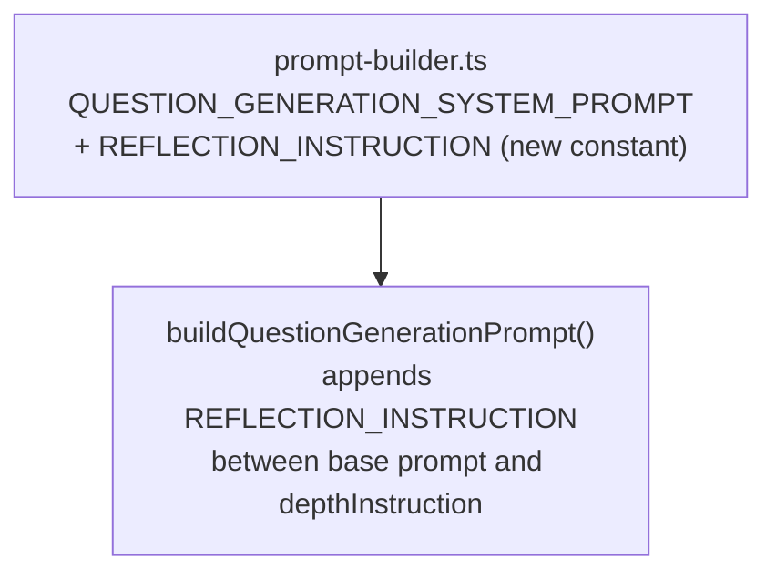

# LLD — V10 E1: Embedded Reflection in Question Generation

## Change Log

| Date | Author | Changes |
|------|--------|---------|
| 2026-04-28 | LS / Claude | Initial LLD — single story |
| 2026-04-28 | LS / Claude | Story 1.2 — depth compliance probe, hint conflict, diversity, weight criteria |

## Part A — Human-Reviewable

### Purpose

Embed a structured draft-critique-rewrite instruction into `QUESTION_GENERATION_SYSTEM_PROMPT` so the LLM performs an explicit self-check against the Naur rubric before producing its final question set. The current prompt states the rubric as passive constraints; this change makes them an active, ordered step the model must execute.

The change is additive and prompt-only. No schemas, API routes, database tables, or function signatures are altered. The only file modified is `src/lib/engine/prompts/prompt-builder.ts`.

See [V10 requirements](../requirements/v10-requirements.md) for full context and rationale.

### Behavioural Flows

No new flows. The existing question generation flow is structurally unchanged. The LLM receives the same input and produces the same JSON schema output. The reflection step is internal to the model's reasoning:

```
[Artefact context + existing constraints] → LLM drafts candidates → critiques each → rewrites failures → outputs final JSON
```

### Structural Overview

No new modules. Changes are confined to one string constant in one file:



`REFLECTION_INSTRUCTION` is exported so unit tests can assert on it directly.

### Invariants

| # | Invariant | Verification |
|---|-----------|-------------|
| 1 | Output schema (`QuestionGenerationResponseSchema`) is unchanged | No schema file is modified — grep confirms |
| 2 | Question count is preserved — failing candidates are rewritten, not dropped | Prompt instruction + existing count constraint retained |
| 3 | `reference_answer` and `hint` are regenerated for any rewritten question | Prompt instruction: "Regenerate `reference_answer` and `hint`…" |
| 4 | All existing constraints remain unchanged | Reflection section is appended after `## Constraints`; no prior text is removed |
| 5 | `buildQuestionGenerationPrompt` signature is unchanged | Function header not modified |
| 6 | Only `prompt-builder.ts` is modified | Enforced by design scope; confirmed by diff |

### Acceptance Criteria

All acceptance criteria from [V10 requirements](../requirements/v10-requirements.md) Story 1.1 apply. See Part B for implementation mapping.

---

## Part B — Agent-Implementable

### HLD reference

- [v1-design.md §3 Question Generation](../design/v1-design.md) — prompt pipeline overview
- [ADR-0012](../adr/0012-llm-client-interface-and-model-default.md) — LLM client interface

### Layer

Engine — pure domain logic (`src/lib/engine/prompts/`). No framework imports, no I/O.

### Files

| File | Change |
|------|--------|
| `src/lib/engine/prompts/prompt-builder.ts` | Add `REFLECTION_INSTRUCTION` constant; update `buildQuestionGenerationPrompt` to append it |
| `tests/lib/engine/prompts/prompt-builder.test.ts` | Add BDD specs asserting reflection section content |

No other files change.

### Implementation Detail

#### 1. New exported constant

Add immediately after `QUESTION_GENERATION_SYSTEM_PROMPT` (before `CONCEPTUAL_DEPTH_INSTRUCTION`):

```typescript
export const REFLECTION_INSTRUCTION = `## Reflection: Draft, Critique, Rewrite

Before producing the final JSON output, apply the following three-step process internally:

### Step 1: Draft

Generate a candidate set of questions — the full requested count. These are internal drafts only; do not include them in the output.

### Step 2: Critique

For each candidate question, apply the three Naur probes:

**Rationale probe** — Does this question require the developer to explain *why* a decision was made, not just *what* exists? If the question can be answered with a description of what the code does rather than why it exists or why it is structured that way, it fails this probe.

**Depth probe** — Could a developer answer this by reading the code for 30 seconds — scanning variable names, default values, or specific syntax? If yes, the question is too shallow and fails this probe.

**Theory persistence probe** — Does this question test knowledge a developer retains after moving on to other work — the kind of understanding needed to judge whether a proposed change is safe? If the question tests knowledge a developer could reconstruct on demand by re-reading the code, it fails this probe.

### Step 3: Rewrite

For each candidate that fails one or more probes, rewrite the question to pass all three. Do not drop failing candidates — rewrite them. Regenerate \`reference_answer\` and \`hint\` for any rewritten question to match the new question text; do not carry over these fields from the candidate.

Output only the final, post-critique questions in the JSON response.`;
```

#### 2. Update `buildQuestionGenerationPrompt`

Current (line 117):

```typescript
systemPrompt: `${QUESTION_GENERATION_SYSTEM_PROMPT}\n\n${depthInstruction(artefacts.comprehension_depth)}`,
```

Replace with:

```typescript
systemPrompt: `${QUESTION_GENERATION_SYSTEM_PROMPT}\n\n${REFLECTION_INSTRUCTION}\n\n${depthInstruction(artefacts.comprehension_depth)}`,
```

This positions the reflection step after all existing constraints and before the depth instruction, so the model reads: framework → output format → constraints → **reflection instruction** → depth instruction → user prompt.

#### 3. Token cost

`REFLECTION_INSTRUCTION` adds approximately 180 tokens to the system prompt. This is within the estimate in the requirements (150–200 tokens) and negligible relative to artefact context (typically 20k–100k tokens).

### BDD Specs

Append to `tests/lib/engine/prompts/prompt-builder.test.ts`:

```typescript
import { REFLECTION_INSTRUCTION } from '../../../../src/lib/engine/prompts/prompt-builder';

describe('REFLECTION_INSTRUCTION — V10 embedded reflection (Story 1.1)', () => {
  it('contains the reflection section header', () => {
    expect(REFLECTION_INSTRUCTION).toContain('## Reflection: Draft, Critique, Rewrite');
  });

  it('names the rationale probe', () => {
    expect(REFLECTION_INSTRUCTION).toContain('Rationale probe');
  });

  it('names the depth probe', () => {
    expect(REFLECTION_INSTRUCTION).toContain('Depth probe');
  });

  it('names the theory persistence probe', () => {
    expect(REFLECTION_INSTRUCTION).toContain('Theory persistence probe');
  });

  it('instructs the model not to drop failing candidates', () => {
    expect(REFLECTION_INSTRUCTION).toContain('Do not drop failing candidates');
  });

  it('instructs regeneration of reference_answer and hint for rewritten questions', () => {
    expect(REFLECTION_INSTRUCTION).toContain('Regenerate `reference_answer` and `hint`');
  });

  it('instructs output of only post-critique questions', () => {
    expect(REFLECTION_INSTRUCTION).toContain('post-critique questions in the JSON response');
  });
});

describe('buildQuestionGenerationPrompt — reflection included in system prompt', () => {
  it('includes reflection instruction in system prompt', () => {
    const artefacts = buildMinimalArtefactSet(); // use existing fixture helper
    const { systemPrompt } = buildQuestionGenerationPrompt(artefacts);
    expect(systemPrompt).toContain('## Reflection: Draft, Critique, Rewrite');
  });

  it('positions reflection after constraints and before depth instruction', () => {
    const artefacts = buildMinimalArtefactSet();
    const { systemPrompt } = buildQuestionGenerationPrompt(artefacts);
    const constraintsPos = systemPrompt.indexOf('## Constraints');
    const reflectionPos = systemPrompt.indexOf('## Reflection');
    const depthPos = systemPrompt.indexOf('## Comprehension Depth');
    expect(reflectionPos).toBeGreaterThan(constraintsPos);
    expect(depthPos).toBeGreaterThan(reflectionPos);
  });
});

describe('QUESTION_GENERATION_SYSTEM_PROMPT — existing constraints preserved (V10 invariant)', () => {
  it('retains the generate-exactly constraint', () => {
    expect(QUESTION_GENERATION_SYSTEM_PROMPT).toContain(
      'Generate exactly the number of questions specified',
    );
  });

  it('retains the system-specific knowledge constraint', () => {
    expect(QUESTION_GENERATION_SYSTEM_PROMPT).toContain('specific to THIS system');
  });
});
```

**Note:** If `buildMinimalArtefactSet` does not exist as a fixture helper in `prompt-builder.test.ts`, create it inline in the test file — a minimal `AssembledArtefactSet` with required fields populated.

### Complexity Budget

No new control flow. `buildQuestionGenerationPrompt` gains one string interpolation. `REFLECTION_INSTRUCTION` is a pure string constant. CodeScene impact: none expected.

### Task Sizing

Single task. Estimated PR diff:

| Component | Lines |
|-----------|-------|
| New `REFLECTION_INSTRUCTION` constant (~25 lines) | ~25 |
| `buildQuestionGenerationPrompt` update (1 line) | ~1 |
| BDD test specs | ~50 |
| **Total** | **~76** |

Well within the 200-line budget. No split needed.

---

## Story 1.2 — Depth compliance probe, hint conflict, diversity, weight criteria (#388)

### Purpose

Four structural fixes to `QUESTION_GENERATION_SYSTEM_PROMPT` and `REFLECTION_INSTRUCTION` identified during manual review of generated questions from epic #240.

### Changes

#### 1. Depth compliance probe in `REFLECTION_INSTRUCTION`

Add a fourth probe to Step 2 (Critique) in `REFLECTION_INSTRUCTION`, immediately after the Theory persistence probe:

> **Depth compliance probe** — Does this question, reference answer, and hint comply with the selected comprehension depth? For conceptual: no specific identifiers, file paths, or function signatures in `question_text`, `reference_answer`, or `hint`. For detailed: at least one concrete anchor (type, file, or function) in `question_text` or `hint`.

#### 2. Hint conflict resolution in `QUESTION_GENERATION_SYSTEM_PROMPT`

The base hint description previously read: "The hint names a recognisable code landmark — a function, type, file, or observable behaviour — that the participant can reason from". This conflicts with `CONCEPTUAL_DEPTH_INSTRUCTION` which forbids naming specific identifiers in hints.

Fix: replace "names a recognisable code landmark — a function, type, file, or observable behaviour — that the participant can reason from" with "gives the participant a recognisable code landmark to reason from", and append "(see Comprehension Depth section for depth-specific hint rules)".

#### 3. Coverage diversity constraint in `QUESTION_GENERATION_SYSTEM_PROMPT`

Add to `## Constraints` (after the existing focus-questions constraint):

> Spread questions across distinct files and subsystems. Do not ground more than one question primarily in the same source file or function. If the diff spans N distinct modules, draw from at least min(N, question_count) distinct modules.

#### 4. Concrete weight criteria in `QUESTION_GENERATION_SYSTEM_PROMPT`

Replace `weight: Integer 1-3 reflecting importance (3 = critical to understanding)` with:

```
weight: Integer 1-3 reflecting importance:
  - 3 = Understanding this is required to safely change any other part of the system
  - 2 = Understanding this is required to safely change this component
  - 1 = Useful context but not a blocker for safe change
```

### Updated Invariants

| # | Invariant | Verification |
|---|-----------|-------------|
| 7 | `REFLECTION_INSTRUCTION` contains a depth compliance probe | Test: `REFLECTION_INSTRUCTION.toContain('Depth compliance probe')` |
| 8 | Base hint description does not name identifier types | Test: not contain "a function, type, file, or observable behaviour" |
| 9 | `QUESTION_GENERATION_SYSTEM_PROMPT` contains the diversity constraint | Test: contains "Spread questions across distinct files" |
| 10 | Weight criteria are concrete, not vague | Test: contains "safely change any other part of the system" |

### BDD Specs (added to `tests/lib/engine/prompts/prompt-builder.test.ts`)

```typescript
describe('REFLECTION_INSTRUCTION — depth compliance probe (Story 1.2)', () => {
  it('names the depth compliance probe');
  it('specifies the conceptual no-identifier rule for question_text, reference_answer, and hint');
  it('specifies the detailed at-least-one-anchor rule for question_text or hint');
});

describe('QUESTION_GENERATION_SYSTEM_PROMPT — hint conflict resolved (Story 1.2)', () => {
  it('does not instruct the model to name a function, type, or file in the base hint description');
  it('includes a cross-reference to the Comprehension Depth section in the hint description');
});

describe('QUESTION_GENERATION_SYSTEM_PROMPT — coverage diversity constraint (Story 1.2)', () => {
  it('instructs the model to spread questions across distinct files and subsystems');
  it('forbids grounding more than one question in the same source file or function');
});

describe('QUESTION_GENERATION_SYSTEM_PROMPT — concrete weight criteria (Story 1.2)', () => {
  it('defines weight 3 as required to safely change any other part of the system');
  it('defines weight 2 as required to safely change this component');
  it('defines weight 1 as useful context but not a blocker');
});
```

### Complexity Budget

No new control flow. All changes are text edits to existing string constants. CodeScene score: 10.0.
