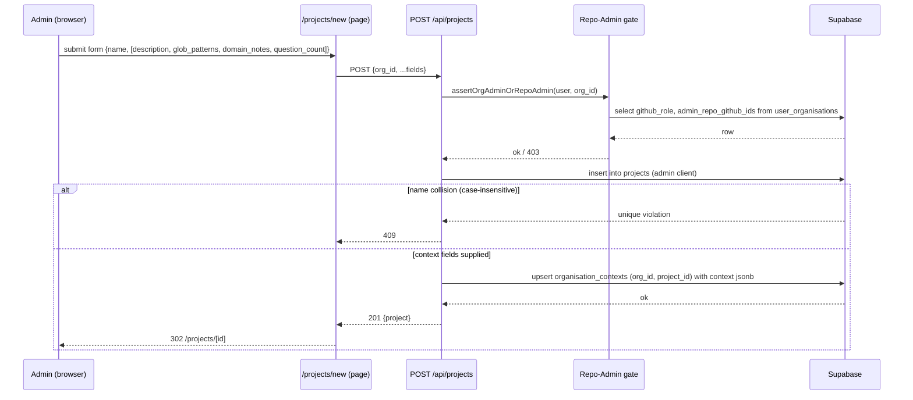
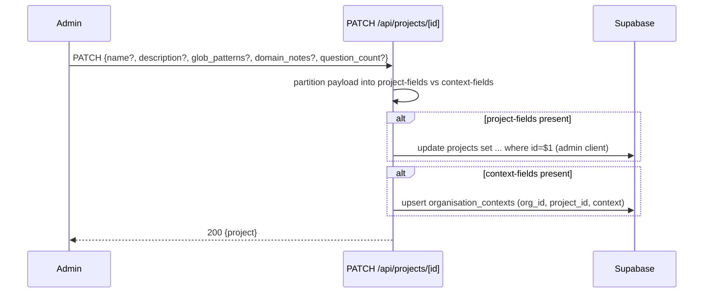
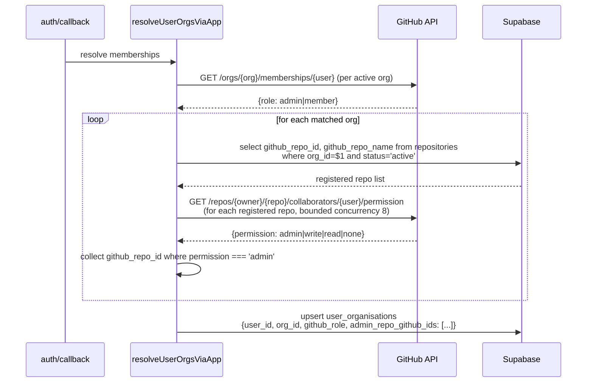
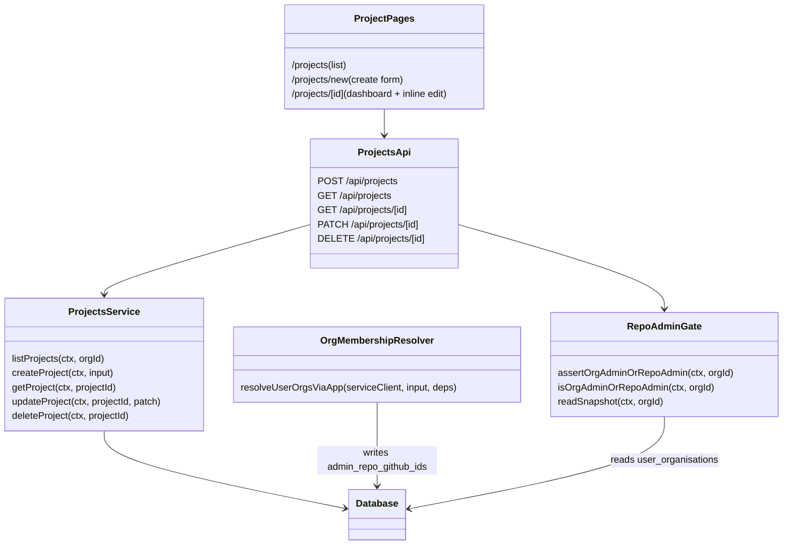

# LLD — V11 Epic E11.1: Project Management

**Date:** 2026-04-30
**Revised:** 2026-04-30 (issue #395 — lld-sync), 2026-05-01 (issue #396 — lld-sync), 2026-05-01 (issue #397 — lld-sync), 2026-05-01 (issue #398 — lld-sync), 2026-05-01 (issue #399 — lld-sync), 2026-05-01 (issue #408 — lld-sync)
**Version:** 0.6
**Epic:** E11.1 (foundation)
**Plan:** [docs/plans/2026-04-30-v11-implementation-plan.md](../plans/2026-04-30-v11-implementation-plan.md)
**HLD:** [v11-design.md §C1, §Level 2](v11-design.md#c1-organisation-management--extended)
**Requirements:** [v11-requirements.md §Epic 1](../requirements/v11-requirements.md#epic-1-project-management-priority-high)
**Related ADRs:** [0027](../adr/0027-project-as-sub-tenant-within-org.md) (project as sub-tenant), [0028](../adr/0028-project-context-reuses-organisation-contexts.md) (reuse `organisation_contexts`), [0029](../adr/0029-repo-admin-permission-runtime-derived.md) (sign-in snapshot)

---

## Part A — Human-reviewable

### Purpose

Stand up the `Project` entity end-to-end so V11's other epics have a stable foundation:

1. Schema for projects + the FK on `organisation_contexts.project_id` from ADR-0028 + the admin-repo snapshot column from ADR-0029.
2. Sign-in extension that populates the admin-repo snapshot, plus the coarse Repo-Admin gate helper that V11.1 + V11.3 use on every project-write request.
3. Five HTTP endpoints (`POST/GET /api/projects`, `GET/PATCH/DELETE /api/projects/[id]`) with the partial-payload PATCH that E11.3 will extend additively.
4. Three pages (`/projects`, `/projects/new`, `/projects/[id]`) that exercise the API surface and redirect Org Members to `/assessments`.

Out of scope (covered by other E11 epics): assessment-list filter integration (E11.2), settings page (E11.3), NavBar / breadcrumbs / root redirect / last-visited (E11.4).

#### Recent revisions

- **Rev 2 (2026-05-03):** v11-requirements rev 1.3 added Story 1.6 ("Back to project" affordance on settings page) and reshaped Story 1.3's Settings affordance from a faint inline link to a header-area icon-and-label control. New design covered in [§Pending changes — Rev 2](#pending-changes-rev-2).

### Behavioural flows

#### A.1 Create project (Story 1.1)



#### A.2 Edit project — partial payload (Story 1.4)



> The PATCH endpoint is created in T1.4 with full partial-payload support. E11.3 reuses it for the settings page without backend changes (plan exit-criteria addendum).

#### A.3 Delete project — empty-only (Story 1.5)

```mermaid
sequenceDiagram
  participant U as Org Admin
  participant API as DELETE /api/projects/[id]
  participant DB as Supabase
  U->>API: DELETE
  API->>DB: select github_role; require 'admin'
  API->>DB: select count(*) from assessments where project_id=$1
  alt count > 0
    API-->>U: 409 {error: "project_not_empty"}
  else count == 0
    API->>DB: delete from projects where id=$1
  end
  alt row deleted
    API-->>U: 204
  else not found (already deleted)
    API-->>U: 404
  end
```

#### A.4 Sign-in admin-repo snapshot (T1.2 — supports ADR-0029)



The admin-repo set is computed by fetching the product-registered repos for the org from the `repositories` table, then checking per-repo collaborator permission via the GitHub API. Only repos already registered in the product are permission-checked — this avoids querying all installation repos and prevents over-granting access based on unregistered repos. Implementation details in §B.

### Structural overview



### Invariants

| # | Invariant | Verified by |
|---|-----------|-------------|
| I1 | Every project row has an `org_id` matching an active organisation | FK + RLS policy `projects_select_member` |
| I2 | Project names are unique within an org, case-insensitive | Unique index on `(org_id, lower(name))` |
| I3 | A project can only be deleted when no assessments reference it | _(deferred → assessments.project_id not yet in schema; service-level check will be added when column lands)_ |
| I4 | `organisation_contexts.project_id` references a real project (or is NULL for legacy org rows) | FK with `ON DELETE CASCADE` (added in T1.1) |
| I5 | Project CRUD endpoints require Org Admin OR Repo Admin (snapshot non-empty); DELETE additionally requires Org Admin | Gate helper + service authorisation (BDD specs in §B) |
| I6 | The admin-repo snapshot is refreshed atomically with the membership upsert during sign-in | Single transaction in `resolveUserOrgsViaApp` (no partial state visible) |
| I7 | `PATCH /api/projects/[id]` mutates only the fields present in the payload | BDD spec in T1.4 |
| I8 | Org Members hitting `/projects`, `/projects/new`, `/projects/[id]` are redirected to `/assessments` | Page-level guard (T1.5/T1.6 BDD) |
| I9 | The 'New assessment' CTA (link to `/projects/[id]/assessments/new`) is visible on the project dashboard regardless of whether assessments exist (Story 1.3 AC 1). The initial implementation placed it only inside `AssessmentList`'s empty-state branch — the fix hoists it to the page level. | Page-level render test; see fix issue #440 |
| I10 | The project dashboard renders a 'Settings' link (href = `/projects/[id]/settings`) visible to both Org Admin and Repo Admin (Org Members have no UI path to settings). Initially omitted by E11.3 implementation; added by fix issue #440. | Dashboard page test |
| I11 | *(rev 1.3)* The Settings link on the project dashboard is a header-area icon-and-label control rendered alongside the "New Assessment" CTA — not a faint inline `text-secondary` link in the page body. Reachable without scrolling on 1280×720. | Dashboard page test (issue #450) |
| I12 | *(rev 1.3, Story 1.6)* The project settings page renders a "Back to project" link near the top of the content area (above the form, below the breadcrumb registration) for both admin and repo_admin. Visible without scrolling on 1280×720. Breadcrumbs remain in addition. | Settings page test (issue #451) |

### Acceptance criteria

Maps directly to v11-requirements §Epic 1 ACs. Story-level coverage:

- **Story 1.1** — POST validates name (1–200 chars), enforces case-insensitive uniqueness (409), accepts optional context fields, returns 201 with redirect target.
- **Story 1.2** — GET /api/projects lists all projects in caller's org regardless of repo-admin scope; returns name, description, created_at, updated_at; redirect for Org Members on `/projects`.
- **Story 1.3** — `/projects/[id]` renders project header + (placeholder) assessment list slot + "New assessment" CTA; 404 on missing/cross-org/deleted; redirect for Org Members.
  - **Rev 1.3 amendment** — Settings affordance is a header-area icon-and-label control with the same visual prominence as the "New Assessment" button, visible without scrolling on a 1280×720 viewport. The faint inline `text-secondary` link from rev 9 is rejected. See [§Pending changes — Rev 2](#pending-changes-rev-2) for design and issue [#450](https://github.com/mironyx/feature-comprehension-score/issues/450).
- **Story 1.4** — PATCH accepts any subset of `{name, description, glob_patterns, domain_notes, question_count}`; partial-only mutation; 400 on validation; 409 on duplicate name; 403 for Org Members.
- **Story 1.5** — DELETE requires Org Admin (403 for Repo Admin); 409 if project has assessments; 204 on success; 404 on already-deleted (idempotent for the caller).
- **Story 1.6** *(new in rev 1.3)* — `/projects/[id]/settings` renders a "Back to project" link near the top of the content area (above the form, below the breadcrumb registration), visible without scrolling on 1280×720. Clicking returns to `/projects/[id]`. Accessible name identifies the destination by project name or generic "Back to project" label. Rendered for both admin and repo_admin roles. See [§Pending changes — Rev 2](#pending-changes-rev-2) for design and issue [#451](https://github.com/mironyx/feature-comprehension-score/issues/451).

### BDD specs

```
describe('POST /api/projects')
  it('Org Admin creates a project with only {name}, defaults applied, redirected to dashboard')
  it('Repo Admin creates a project with name + description + context fields persisted')
  it('Empty name returns 400; name > 200 chars returns 400')
  it('Org Member returns 403; no project row created')
  it('Duplicate name within same org (case-insensitive) returns 409')

describe('GET /api/projects')
  it('Returns all projects in caller org with name/description/created_at/updated_at')
  it('Returns empty array when org has no projects')
  it('Returns 401 when unauthenticated, 403 when caller has no membership in queried org')

describe('GET /api/projects/[id]')
  it('Returns project for Org Admin or Repo Admin in same org')
  it('Returns 404 when id does not exist or belongs to a different org')

describe('PATCH /api/projects/[id]')
  it('Mutates only fields present in the payload (name only, then domain_notes only)')
  it('Returns 409 on duplicate name within org (case-insensitive)')
  it('Returns 400 when name empty or > 200 chars')
  it('Returns 400 when question_count outside 3–5')
  it('Returns 403 for Org Member')

describe('DELETE /api/projects/[id]')
  it('Hard-deletes empty project, returns 204')
  it('Returns 409 when project has at least one assessment')
  it('Returns 403 for Repo Admin (delete is Org Admin only)')
  it('Returns 404 on second delete (idempotent for caller)')

describe('Sign-in admin-repo snapshot')
  it('Populates admin_repo_github_ids with repos where authenticated user has permissions.admin = true')
  it('Empty array when user holds no admin repos in the org')
  it('Refreshed atomically with the user_organisations upsert')

describe('Project pages')
  it('Org Member visiting /projects is redirected to /assessments')
  it('Org Member visiting /projects/new is redirected to /assessments')
  it('Org Member visiting /projects/[id] is redirected to /assessments')
  it('Admin sees empty-state CTA on /projects when org has no projects')
  it('Admin clicks inline edit pencil → submits {name, description} → dashboard re-renders new values')
  it('Admin sees New Assessment button when project already has assessments (not only in empty state)')
  it('Admin sees Settings link on the dashboard; Org Member does not (redirected before render)')

# Rev 1.3 additions — see §Pending changes — Rev 2 for full BDD specs
describe('Project dashboard — Settings affordance (rev 1.3, issue #450)')
  it('renders Settings link with icon and label inside the page header action slot')
  it('renders Settings alongside New Assessment as a sibling header control')
  it('does not render the legacy faint inline Settings link')

describe('Project settings page — Back to project (Story 1.6, rev 1.3, issue #451)')
  it('renders an anchor pointing to /projects/[id]')
  it('uses an accessible name that identifies the destination (project name or "Back to project")')
  it('renders for both admin and repo_admin roles')
  it('positions the link above the settings form, below the breadcrumb registration')
```

---

## Part B — Agent-implementable

<a id="LLD-v11-e11-1-layer-map"></a>

### B.0 Layer map

| Layer | Files |
|-------|-------|
| **DB** | `supabase/schemas/tables.sql`, `supabase/schemas/policies.sql`, generated migration |
| **BE — auth** | `src/lib/supabase/org-membership.ts` (extend), `src/lib/api/repo-admin-gate.ts` (new), `src/lib/github/repo-admin-list.ts` (new) |
| **BE — API** | `src/app/api/projects/route.ts`, `src/app/api/projects/service.ts`, `src/app/api/projects/[id]/route.ts`, `src/app/api/projects/[id]/service.ts`, `src/app/api/projects/validation.ts` |
| **FE** | `src/app/(authenticated)/projects/page.tsx`, `new/page.tsx`, `new/create-form.tsx`, `[id]/page.tsx`, `[id]/inline-edit-header.tsx`, `[id]/delete-button.tsx` |
| **Types** | `src/types/projects.ts` |
| **Tests** | `tests/app/api/projects/*.test.ts`, `tests/lib/supabase/org-membership-snapshot.test.ts`, `tests/lib/api/repo-admin-gate.test.ts` |

<a id="LLD-v11-e11-1-schema"></a>

### B.1 — Task T1.1: Schema

**Files:**

- `supabase/schemas/tables.sql` — add `projects` table, FK on `organisation_contexts.project_id`, snapshot column on `user_organisations`.
- `supabase/schemas/policies.sql` — RLS on `projects`.
- `supabase/migrations/<timestamp>_v11_e11_1_projects.sql` — generated via `npx supabase db diff`.
- `src/lib/supabase/types.ts` — **manually patched** (add `projects` Row/Insert/Update block; add `admin_repo_github_ids: number[]` to `user_organisations`).
- `tests/helpers/v11-e11-1-projects-schema.integration.test.ts` — 6 integration specs covering all BDD acceptance criteria.

> **Implementation note (issue #394):** `src/lib/supabase/types.ts` cannot be auto-regenerated via `supabase gen types typescript --local` — doing so replaces all literal union type columns (e.g. `'prcc' | 'fcs'`, `'active' | 'inactive'`) with plain `string`, breaking downstream consumers. The file is maintained manually; only the new `projects` block and `admin_repo_github_ids` field were added.

**Schema additions:**

```sql
-- projects: V11 organising layer within an org. ADR-0027.
CREATE TABLE projects (
  id          uuid PRIMARY KEY DEFAULT gen_random_uuid(),
  org_id      uuid NOT NULL REFERENCES organisations(id) ON DELETE CASCADE,
  name        text NOT NULL CHECK (char_length(name) BETWEEN 1 AND 200),
  description text,
  created_at  timestamptz NOT NULL DEFAULT now(),
  updated_at  timestamptz NOT NULL DEFAULT now()
);
CREATE UNIQUE INDEX uq_projects_org_lower_name ON projects (org_id, lower(name));
CREATE INDEX idx_projects_org ON projects (org_id);

-- Backfill FK on organisation_contexts.project_id (column exists since Phase 2). ADR-0028.
ALTER TABLE organisation_contexts
  ADD CONSTRAINT organisation_contexts_project_id_fkey
  FOREIGN KEY (project_id) REFERENCES projects(id) ON DELETE CASCADE;

-- Admin-repo snapshot for Repo-Admin gate. ADR-0029.
ALTER TABLE user_organisations
  ADD COLUMN admin_repo_github_ids bigint[] NOT NULL DEFAULT '{}';
```

**RLS policies (`policies.sql`):**

```sql
ALTER TABLE projects ENABLE ROW LEVEL SECURITY;

CREATE POLICY projects_select_member ON projects
  FOR SELECT USING (org_id IN (SELECT get_user_org_ids()));

-- INSERT/UPDATE/DELETE flow via service role (admin client) after gate-helper authorisation.
-- No INSERT/UPDATE/DELETE policies for the user JWT — matches ADR-0025 pattern (org-scoped writes via admin client).
```

**Acceptance:**
- `npx supabase db reset` succeeds; `npx supabase db diff` empty after running.
- `npx tsc --noEmit` passes after manually patching `src/lib/supabase/types.ts` (see Files note above — do not auto-regenerate).

**Tasks:**
1. Edit `tables.sql` (additions above).
2. Edit `policies.sql` (RLS).
3. `npx supabase db diff -f v11_e11_1_projects` → review.
4. `npx supabase db reset` → verify diff empty.

<a id="LLD-v11-e11-1-sign-in-snapshot-and-gate"></a>

### B.2 — Task T1.2: Sign-in admin-repo snapshot + Repo-Admin gate

**Files:**

- `src/lib/supabase/org-membership.ts` — extend `MatchedOrg`, `buildUpsertRows`, and `fetchMembershipRole` to include `adminRepoGithubIds`.
- `src/lib/github/repo-admin-list.ts` (new) — fetch repos visible to the installation token where the authenticated GitHub user has admin permission.
- `src/lib/api/repo-admin-gate.ts` (new) — gate helper.
- `tests/lib/supabase/org-membership-snapshot.test.ts`, `tests/lib/api/repo-admin-gate.test.ts`.

**Internal decomposition — `repo-admin-list.ts`:**

```ts
// Check admin permission on repos registered in the product.
// Caller pre-filters the repo list from the repositories table — avoids querying
// all installation repos and prevents over-granting on unregistered repos.
//
// Concrete approach (per registered repo, parallelised, bounded concurrency 8):
//   1. Caller fetches registered repos from repositories table (org_id + status='active').
//   2. For each RegisteredRepo, GET /repos/{owner}/{repo}/collaborators/{username}/permission
//      → { permission: 'admin'|'write'|'read'|'none' }.
//   3. Collect github_repo_id where permission === 'admin'.
//
// Uses global fetch; MSW intercepts in tests. No fetchImpl injection.

export interface RegisteredRepo {
  githubRepoId: number;
  repoFullName: string; // "owner/repo" as stored in repositories.github_repo_name
}

export interface ListAdminReposInput {
  installationId: number;
  githubLogin: string;
  repos: RegisteredRepo[]; // pre-filtered from DB; not queried from GitHub
}

export interface ListAdminReposDeps {
  getInstallationToken?: (id: number) => Promise<string>;
  // fetchImpl removed — global fetch used directly; MSW intercepts in tests
}

export async function listAdminReposForUser(
  input: ListAdminReposInput,
  deps?: ListAdminReposDeps,
): Promise<number[]>; // returns github_repo_id list
```

> **Implementation note (issue #395):** The LLD originally specified `orgGithubName: string` and `GET /installation/repositories` as step 1 to enumerate all repos visible to the installation. This was amended during implementation: the caller now passes `repos: RegisteredRepo[]` pre-fetched from the `repositories` DB table. Rationale: scopes permission checks to product-registered repos only; avoids a GitHub API round trip; prevents over-granting based on repos not yet registered. `fetchImpl` was also removed from `ListAdminReposDeps` — CLAUDE.md requires MSW for HTTP mocking, so `fetch` is used directly.

> **Implementation note (issue #395):** `fetchRegisteredRepos(serviceClient, orgId)` was added to `org-membership.ts` as a private helper to query the `repositories` table per matched org. It is called inside `matchOrgsForUser`, with a short-circuit for personal-account installs (`org.github_org_id === input.githubUserId`) that skips the DB lookup entirely. `checkMembershipRole` was also extracted from `fetchMembershipRole` to stay within the 20-line function budget.

**Internal decomposition — `repo-admin-gate.ts`:**

```ts
// Reads the snapshot from user_organisations. Zero GitHub calls.
// ADR-0029 §2 — both project CRUD and FCS create read this same snapshot.

import type { ApiContext } from '@/lib/api/context';

export interface RepoAdminSnapshot {
  githubRole: 'admin' | 'member';
  adminRepoGithubIds: number[];
}

export async function readSnapshot(
  ctx: ApiContext,
  orgId: string,
): Promise<RepoAdminSnapshot | null>; // null if no membership row

export async function isOrgAdminOrRepoAdmin(
  ctx: ApiContext,
  orgId: string,
): Promise<boolean>; // true iff role=admin OR adminRepoGithubIds non-empty

export async function assertOrgAdminOrRepoAdmin(
  ctx: ApiContext,
  orgId: string,
): Promise<void>; // throws ApiError(403) on false; ApiError(401) if no membership

export async function assertOrgAdmin(
  ctx: ApiContext,
  orgId: string,
): Promise<void>; // delete-only path: requires github_role = 'admin'
```

**Membership-resolver extension:**

`MatchedOrg` becomes `{ org, role, adminRepoGithubIds: number[] }`. `fetchMembershipRole` calls `listAdminReposForUser` only when `role !== 'admin'` for the personal account match (org admins implicitly see all admin repos, but for snapshot consistency the field still records the actual admin-repo IDs — populated for both roles so the gate can answer "any admin repo" uniformly). `buildUpsertRows` adds `admin_repo_github_ids` to the upsert payload.

**Tasks:**
1. Add `listAdminReposForUser` with unit tests (MSW-mocked GitHub responses).
2. Extend `org-membership.ts` (parameterised tests cover: admin-with-repos, member-with-repos, member-with-none).
3. Add `repo-admin-gate.ts` with unit tests against a Supabase mock — covers I5.
4. Verify atomicity (I6): single upsert call carries the snapshot column.

**Acceptance:**
- `npx vitest run tests/lib/supabase tests/lib/api/repo-admin-gate.test.ts` passes.
- `npx tsc --noEmit` passes.

<a id="LLD-v11-e11-1-projects-api-create-list"></a>

### B.3 — Task T1.3: Projects API — create + list

**Files:**

- `src/app/api/projects/route.ts` (controller, ≤ 25 lines per handler)
- `src/app/api/projects/service.ts` (createProject, listProjects)
- `src/app/api/projects/validation.ts` (Zod schemas)
- `src/types/projects.ts`
- `tests/app/api/projects/create.test.ts`, `tests/app/api/projects/list.test.ts`

**Internal decomposition — controller (`route.ts`):**

```ts
// Types live in src/types/projects.ts (see implementation note below).
import type { ProjectsListResponse } from '@/types/projects';

export async function POST(request: NextRequest) {
  try {
    const ctx = await createApiContext(request);
    const body = await validateBody(request, CreateProjectSchema);
    const project = await createProject(ctx, body);
    return json(project, 201);
  } catch (e) { return handleApiError(e); }
}

export async function GET(request: NextRequest) {
  try {
    const ctx = await createApiContext(request);
    const orgId = new URL(request.url).searchParams.get('org_id');
    if (!orgId) throw new ApiError(400, 'org_id required');
    const projects = await listProjects(ctx, orgId);
    const body: ProjectsListResponse = { projects };
    return json(body);
  } catch (e) { return handleApiError(e); }
}
```

> **Implementation note (issue #396):** The LLD originally specified ADR-0014 inline contract types (`CreateProjectRequest`, `ProjectResponse`, `ProjectsListResponse`) in `route.ts`. During implementation, `ProjectResponse` was already in `src/types/projects.ts` from the T1.1 schema work. For consistency, all three types were consolidated into `src/types/projects.ts` rather than duplicating them inline. The ADR-0014 intent (types co-located with the route contract) is satisfied by the shared types file. The `json()` helper also takes a positional status code (`json(body, 201)`) not an options object.

**Service contracts (`service.ts`):**

```ts
import type { ApiContext } from '@/lib/api/context';
import { assertOrgAdminOrRepoAdmin } from '@/lib/api/repo-admin-gate';
// service receives ApiContext; never calls createClient() directly (CLAUDE.md).

// Private helper — decomposed from createProject to stay within 20-line budget.
async function upsertContextFields(
  ctx: ApiContext,
  orgId: string,
  projectId: string,
  input: CreateProjectInput,
): Promise<void>;
// upsert organisation_contexts (org_id, project_id, context = {globs, notes, count})
// onConflict: 'org_id,project_id'

// Private helper — decomposed from listProjects (20-line budget + 403-consistency, see note).
async function requireAdminOrRepoAdmin(ctx: ApiContext, orgId: string): Promise<void>;
// reads user_organisations via ctx.supabase (RLS-scoped)
// throws ApiError(403) for both missing membership AND insufficient role

export async function createProject(
  ctx: ApiContext,
  input: CreateProjectInput,
): Promise<ProjectResponse>;
// 1. assertOrgAdminOrRepoAdmin(ctx, input.org_id)
// 2. insert via ctx.adminSupabase; map unique_violation -> ApiError(409, 'name_taken')
// 3. if any of {glob_patterns, domain_notes, question_count} present:
//    upsertContextFields(ctx, input.org_id, project.id, input)
// 4. return mapped row

export async function listProjects(
  ctx: ApiContext,
  orgId: string,
): Promise<ProjectResponse[]>;
// 1. requireAdminOrRepoAdmin(ctx, orgId) — throws 403/403 (see implementation note)
// 2. select id, org_id, name, description, created_at, updated_at from projects
//    where org_id = $1 order by created_at desc (RLS enforces too — defence in depth)
```

> **Implementation note (issue #396):** The original LLD comment said "401/403 if not member of orgId". However, `assertOrgAdminOrRepoAdmin` (from §B.2) throws `ApiError(401)` for a missing membership row, which contradicts issue #396 AC: "GET returns 403 for non-member of queried org." A local private helper `requireAdminOrRepoAdmin` was added to `service.ts` that throws `ApiError(403)` consistently — both for missing membership and for insufficient role. The `assertOrgAdminOrRepoAdmin` gate is still used by `createProject` (which inherits the 401 behaviour; its AC does not specify a non-member code). The LLD comment has been updated to reflect 403/403 for `listProjects`.

> **Implementation note (issue #396):** Two private helpers were extracted to satisfy CLAUDE.md's 20-line function budget: `upsertContextFields` (handles the `organisation_contexts` upsert leg) and `requireAdminOrRepoAdmin` (handles the gate check for `listProjects`). Both carry `// Justification:` comments in the source.

**Validation (`validation.ts`):**

```ts
export const CreateProjectSchema = z.object({
  org_id: z.string().uuid(),
  name: z.string().min(1).max(200),
  description: z.string().max(2000).optional(),
  glob_patterns: z.array(z.string().min(1)).max(50).optional(),
  domain_notes: z.string().max(2000).optional(),
  question_count: z.number().int().min(3).max(5).optional(),
});
```

**Tasks:**
1. Write Zod + types.
2. Write service `createProject` with unique-violation mapping.
3. Write controller.
4. Tests: 5 BDD specs from §"BDD specs" §POST + 3 specs from §GET. MSW for any GitHub touchpoints (none expected — gate reads snapshot only).
5. Repeat for list.

**Acceptance:** all `POST /api/projects` and `GET /api/projects` BDD specs pass; `npx tsc --noEmit` clean; `/diag` clean on changed files.

<a id="LLD-v11-e11-1-projects-api-read-edit-delete"></a>

### B.4 — Task T1.4: Projects API — read + edit + delete

**Files:**

- `src/app/api/projects/[id]/route.ts` (GET, PATCH, DELETE)
- `src/app/api/projects/[id]/service.ts` (getProject, updateProject, deleteProject, requireOrgMembership, resolveProject)
- `src/lib/api/context.ts` (ApiContext — added `orgId: string | null`)
- `supabase/schemas/functions.sql` (patch_project DB function)
- `tests/app/api/projects/get-by-id.test.ts`, `tests/app/api/projects/update.test.ts`, `tests/app/api/projects/delete.test.ts`
- `tests/evaluation/projects-api-crud.eval.test.ts`

**Internal decomposition — controller:**

```ts
interface UpdateProjectRequest {
  name?: string;
  description?: string;
  glob_patterns?: string[];
  domain_notes?: string;
  question_count?: number;
}
interface RouteContext { params: Promise<{ id: string }> }

export async function GET(request: NextRequest, { params }: RouteContext) {
  try {
    const ctx = await createApiContext(request);
    const { id } = await params;
    return json(await getProject(ctx, id));
  } catch (e) { return handleApiError(e); }
}

export async function PATCH(request: NextRequest, { params }: RouteContext) {
  try {
    const ctx = await createApiContext(request);
    const { id } = await params;
    const body = await validateBody(request, UpdateProjectSchema);
    return json(await updateProject(ctx, id, body));
  } catch (e) { return handleApiError(e); }
}

export async function DELETE(request: NextRequest, { params }: RouteContext) {
  try {
    const ctx = await createApiContext(request);
    const { id } = await params;
    await deleteProject(ctx, id);
    return new Response(null, { status: 204 });
  } catch (e) { return handleApiError(e); }
}
```

**Service contracts (`service.ts`):**

```ts
export async function getProject(ctx: ApiContext, projectId: string): Promise<ProjectResponse>;
// 1. select id, org_id, name, description, created_at, updated_at from projects where id=$1
// 2. if not found -> ApiError(404)
// 3. assertOrgAdminOrRepoAdmin(ctx, project.org_id)

export async function updateProject(
  ctx: ApiContext,
  projectId: string,
  patch: UpdateProjectInput,
): Promise<ProjectResponse>;
// 1. requireOrgMembership(ctx, 'admin_or_repo_admin') — reads fcs-org-id cookie,
//    single SELECT from user_organisations WHERE user_id=$1 AND org_id=$2, returns orgId
// 2. partition patch into projectFields (name, description) and contextFields
//    (glob_patterns, domain_notes, question_count)
// 3. adminSupabase.rpc('patch_project', { p_project_id, p_org_id, p_project_fields, p_context_fields })
//    — atomically updates projects row and merges context via jsonb ||
//    — RAISE EXCEPTION 'project_not_found' if project not in org -> ApiError(404)
//    — unique violation code 23505 -> ApiError(409, 'name_taken')
// 4. return rpc result row (ProjectResponse shape)

export async function deleteProject(ctx: ApiContext, projectId: string): Promise<void>;
// 1. requireOrgMembership(ctx, 'admin') — fcs-org-id cookie + single membership SELECT
// 2. adminSupabase.from('projects').delete({ count: 'exact' })
//      .eq('id', projectId).eq('org_id', orgId)
//    — count = 0 -> ApiError(404, 'project_not_found')  ← idempotent
```

> **Implementation note (issue #397):** The LLD specified a 5–6 step flow for `updateProject` (resolveProject → assertOrgAdminOrRepoAdmin → partition → update projects → upsert organisation_contexts → reload) and a 4-step flow for `deleteProject` (resolveProject → assertOrgAdmin → assessment count check → delete). The implementation differs on two points:
>
> 1. **Org context from cookie, not project row.** Both `updateProject` and `deleteProject` read the currently selected org from the `fcs-org-id` cookie (`ApiContext.orgId`) and do a single `user_organisations` lookup scoped to that org. This replaces the `resolveProject` + `assertOrgAdmin(OrRepoAdmin)` pre-flight (saves one DB round-trip each).
>
> 2. **Atomic context merge via DB function.** `updateProject` calls a new Postgres function `patch_project(p_project_id, p_org_id, p_project_fields, p_context_fields)` instead of the read-then-upsert approach. The function uses `jsonb ||` for the context merge (atomic, preserves I7) and raises `project_not_found` if the project does not belong to `p_org_id`. This replaces steps 4–6 with a single RPC.
>
> 3. **I3 assessment check deferred.** The DELETE no longer checks for assessments before deleting (`assessments.project_id` does not exist in the current schema). Invariant I3 is deferred until that column is added.
>
> `ApiContext` now carries `orgId: string | null` (read from `fcs-org-id` cookie in `createApiContext`). The private `requireOrgMembership(ctx, role)` helper encapsulates the single-org gate for both `updateProject` and `deleteProject`.

**Validation:**

```ts
export const UpdateProjectSchema = z.object({
  name: z.string().min(1).max(200).optional(),
  description: z.string().max(2000).optional(),
  glob_patterns: z.array(z.string().min(1)).max(50).optional(),
  domain_notes: z.string().max(2000).optional(),
  question_count: z.number().int().min(3).max(5).optional(),
}).refine((o) => Object.keys(o).length > 0, { message: 'at_least_one_field' });
```

**Tasks:**
1. Service functions with unit tests covering all PATCH/DELETE BDD specs.
2. Controller.
3. Confirm I7 with two specs: "PATCH name only does not change description"; "PATCH domain_notes only does not change name".

**Acceptance:** all `[id]` BDD specs pass; partial-payload mutation explicitly verified.

<a id="LLD-v11-e11-1-project-pages-list-create"></a>

### B.5 — Task T1.5: Project pages — list + create

**Files:**

- `src/app/(authenticated)/projects/page.tsx` (server component — list)
- `src/app/(authenticated)/projects/new/page.tsx` (server component shell)
- `src/app/(authenticated)/projects/new/create-form.tsx` (client component — form)
- `tests/app/(authenticated)/projects/list-page.test.ts`, `new-page.test.ts`

**Behaviour:**

- Both pages: call `isAdminOrRepoAdmin(supabase, user.id, orgId)` from `src/lib/supabase/membership.ts`; if false `redirect('/assessments')`.
- List page: inline Supabase query (see implementation note below); render list; show empty-state "Create project" CTA when no rows.
- New page: render `<CreateProjectForm />` client component which POSTs to `/api/projects` and calls `router.push(/projects/${id})` on success. Surface 409 inline with "Name already in use".

**Tasks:**
1. Org ID from existing `getSelectedOrgId(cookieStore)` helper (already in `src/lib/supabase/org-context.ts`) — no new helper needed.
2. List page (server-rendered) + redirect guard.
3. New page server shell + `create-form.tsx` client.
4. Component tests covering Org Member redirect and admin empty-state.

> **Implementation note (issue #398):** The LLD specified `assertAdminOrRepoAdminForCurrentOrg()` as the guard function, but no such function exists. The implementation uses `isAdminOrRepoAdmin(supabase, user.id, orgId)` exported from the existing `src/lib/supabase/membership.ts` module. This function was extended in T1.5 (previously it only held `isOrgAdmin`). The shared helper eliminates duplication between both project pages.

> **Implementation note (issue #398):** The LLD said to call `listProjects(ctx, orgId)` directly to avoid HTTP self-fetch. In practice, `listProjects` expects `ApiContext` assembled from route-handler clients, which does not compose cleanly with server-component `createServerSupabaseClient()`. Rather than type-casting, an inline query was used — the same pattern that `src/app/(authenticated)/assessments/page.tsx` already establishes. The deviation is documented with a `// Design deviation:` comment in the source file.

> **Implementation note (issue #398):** `getCurrentOrgId(supabase, userId)` was not created. The existing `getSelectedOrgId(cookieStore)` from `src/lib/supabase/org-context.ts` already handles org selection from the cookie — no new helper was needed.

> **Implementation note (issue #398):** Test file extensions are `.ts`, not `.tsx` — the test files do not contain JSX and use source-text assertions (`readFileSync`) for the client component contracts rather than `@testing-library/react`.

<a id="LLD-v11-e11-1-project-dashboard-inline-edit"></a>

### B.6 — Task T1.6: Project dashboard + inline edit

**Files:**

- `src/app/(authenticated)/projects/[id]/page.tsx` (server component)
- `src/app/(authenticated)/projects/[id]/inline-edit-header.tsx` (client — pencil affordance)
- `src/app/(authenticated)/projects/[id]/delete-button.tsx` (client — Org Admin only)
- `tests/app/(authenticated)/projects/dashboard-page.test.ts`, `inline-edit-header.test.ts`, `delete-button.test.ts`

**Behaviour:**

- Server component fetches the project via `getProject` service (direct, not HTTP); 404 on missing/cross-org/deleted.
- Org Member → `redirect('/assessments')`.
- Page renders: header with name + description + pencil (visible to admins/repo-admins), delete button (visible only to Org Admin), a **'Settings' link** pointing to `/projects/${id}/settings` (admin/repo-admin only — see I10), and an **'Assessments'** section with `<AssessmentList projectId={id} />` plus a persistent **'New assessment'** button (link to `/projects/[id]/assessments/new`) in the section header — visible whether the project has assessments or not (I9). The CTA was initially placed only inside `AssessmentList`'s empty-state branch; the fix for issue #440 hoists it to the page so it always renders.
- Inline edit submits PATCH `/api/projects/[id]` with `{name, description}`, optimistic update, error toast on 409.
- Delete button confirms then DELETEs; redirects to `/projects` on 204; surfaces 409 "project not empty" inline.

> **Implementation note (issue #399):** The LLD specified calling `getProject(ctx, id)` directly. As with B.5 (issue #398), `getProject` is designed for `ApiContext` assembled from route-handler clients — composing it in a server component would require a fake `ApiContext`. Inline queries via `createServerSupabaseClient()` were used instead, consistent with all other server pages in this codebase.

> **Implementation note (issue #399, updated #408):** Access guard originally used `isAdminOrRepoAdmin(supabase, userId, orgId)` (returns `boolean`) with a parallel `user_organisations` query to read `github_role` for the delete-button decision. Issue #408 replaced this with `getOrgRole(supabase, userId, orgId)` (returns `'admin' | 'repo_admin' | null`) from `src/lib/supabase/membership.ts`. The page now redirects when `role` is `null`, and derives `isAdmin = role === 'admin'` directly — eliminating the second query. `isAdminOrRepoAdmin` is kept as a thin wrapper around `getOrgRole` for backwards compatibility with the list/create pages.

> **Implementation note (issue #399):** LLD specifies "error toast on 409". No toast library is installed in this codebase. Implemented as an inline error `<p role="alert">` state with a 5 s `useEffect` auto-dismiss — equivalent UX without a new dependency.

> **Implementation note (issue #399):** Test file extensions are `.ts`, not `.tsx` — the test files do not contain JSX. `delete-button.test.ts` is a separate file from `dashboard-page.test.ts` because `vi.mock` applies file-wide; mocking the `DeleteButton` module in the page tests conflicts with testing `DeleteButton` itself.

**Tasks:**
1. Dashboard page + redirect guard + 404 path.
2. Inline edit client component + tests.
3. Delete button (visible iff `getOrgRole` returns `'admin'`) + tests.

**Acceptance:**
- All §A.1-related BDD specs for the dashboard + inline edit pass.
- Org Member redirect verified.
- 404 path for cross-org and non-existent IDs verified.

<a id="LLD-v11-e11-1-cross-cutting"></a>

### B.7 Cross-cutting

- **British English** in all new docs and comments.
- **CLAUDE.md complexity budget**: every handler ≤ 25 lines; every service function ≤ 20 lines (decompose internally if needed); nesting ≤ 3.
- **Tests style**: BDD `Given/When/Then` in `describe`/`it`; MSW for GitHub mocks in T1.2; Supabase mocked via existing test helpers.
- **No silent catch**: every catch logs or rethrows.

<a id="LLD-v11-e11-1-out-of-scope"></a>

### B.8 Out-of-scope reminders

- Project-scoped assessment list filter — **E11.2** (T1.6 only renders a placeholder slot).
- Settings page (`/projects/[id]/settings`) — **E11.3** (extends PATCH endpoint additively).
- NavBar "Projects" item, breadcrumbs, root redirect, last-visited — **E11.4**.
- The Org-Member redirect on `/projects` (Story 4.2) is implemented here in T1.5 so the page works on day one. E11.4 inherits this without rework.

---

<a id="pending-changes-rev-2"></a>

## Pending changes — Rev 2

Triggered by [v11-requirements rev 1.3](../requirements/v11-requirements.md#change-log) (2026-05-03). Two stories revise this epic: Story 1.3 amends the Settings affordance shape on the project dashboard, and Story 1.6 is a new story for a "Back to project" link on the settings page.

### Story REQ-project-management-view-project-dashboard (Story 1.3 — Settings affordance prominence)

**Stories:** 1.3 (rev 1.3 amendment)
**Issue:** [#450](https://github.com/mironyx/feature-comprehension-score/issues/450) (bundles 1.3 + Story 2.2 because both edit `projects/[id]/page.tsx`)
**Section to amend:** [§B.6 — Task T1.6: Project dashboard + inline edit](#LLD-v11-e11-1-project-dashboard-inline-edit)

**Files:**

- `src/app/(authenticated)/projects/[id]/page.tsx` — replace the inline `text-secondary` Settings link (currently lines 81–86) with a header-area icon-and-label control rendered alongside "New Assessment".
- `src/app/(authenticated)/projects/[id]/page.test.ts` (or `.tsx`) — extend with assertion for the new affordance shape.

**Reused helpers — DO NOT re-implement:**

| Need | Use this | Defined in |
|------|---------|------------|
| Settings icon | `Settings` from `lucide-react` | `lucide-react` (same package as `Trash2`, `MoreHorizontal` already used in `assessment-overview-table.tsx`) |
| Anchor button styling | Existing "New Assessment" Tailwind classes (`inline-flex items-center rounded-sm text-label font-medium bg-accent text-background h-9 px-3.5`) | `projects/[id]/page.tsx:97-99` |
| Page header layout | `PageHeader` `action` slot | `src/components/ui/page-header.tsx` |

**Layout pattern.** The current page renders `PageHeader` (with `DeleteButton` action), then a faint Settings link, then `InlineEditHeader`, then the assessments section with a "New Assessment" link in its sub-header. Rev 2 layout:

- Move "New Assessment" out of the assessments sub-header into the page header `action` slot, joined with **Settings** as a sibling icon-and-label control. Both render in the page header's right-hand action area at the same visual prominence.
- Keep the empty-state CTA ("Create the first assessment") in the assessment list section — that empty-state path is unchanged.
- Keep `DeleteButton` in the page header as today (admin-only). Settings + New Assessment render for both admin and repo_admin (the page already redirects Org Members at the role check).

**Action slot composition sketch:**

```tsx
// projects/[id]/page.tsx (Rev 2 — header action slot)
const headerActions = (
  <div className="flex items-center gap-2">
    <Link
      href={`/projects/${id}/settings`}
      className="inline-flex items-center gap-1.5 rounded-sm text-label font-medium border border-border h-9 px-3.5 text-text-primary hover:bg-surface-raised"
      aria-label="Project settings"
    >
      <Settings size={16} aria-hidden />
      Settings
    </Link>
    <Link
      href={`/projects/${id}/assessments/new`}
      className="inline-flex items-center rounded-sm text-label font-medium bg-accent text-background h-9 px-3.5"
    >
      New Assessment
    </Link>
    {isAdmin && <DeleteButton projectId={id} />}
  </div>
);
return (
  <div className="space-y-section-gap">
    <TrackLastVisitedProject projectId={id} />
    <SetBreadcrumbs segments={[{ label: 'Projects', href: '/projects' }, { label: project.name }]} />
    <PageHeader title={project.name} action={headerActions} />
    <InlineEditHeader projectId={id} initialName={project.name} initialDescription={project.description} />
    {/* …assessments section, no New Assessment link in sub-header… */}
  </div>
);
```

> **Why button-like Settings (not a primary button)?** Visual prominence parity with "New Assessment" is required by AC, but Settings is not the primary action on this page — Settings stays as a secondary control (bordered, surface-raised hover) while "New Assessment" remains the accent-coloured CTA. Both occupy the same header strip and are reachable without scrolling on 1280×720.

**Acceptance criteria (verbatim from rev 1.3 §Story 1.3):**

> Given an admin views `/projects/[id]`, when the page renders, then a Settings affordance is visible in the page-header area (icon + "Settings" label, not a small inline link), positioned with the same visual prominence as the "New Assessment" button, and is reachable without scrolling on a 1280×720 viewport.

**BDD specs:**

```
describe('Project dashboard — Settings affordance (rev 1.3)')
  it('renders Settings link with icon and label inside the page header action slot')
  it('renders Settings alongside New Assessment as a sibling header control')
  it('does not render the legacy faint inline Settings link')
  it('Settings link href is /projects/[id]/settings')
```

**Out of scope:** Settings page back-navigation — covered in Story 1.6 below.

---

### Story REQ-project-management-back-to-project-from-settings (Story 1.6 — NEW)

**Stories:** 1.6 (new in rev 1.3)
**Issue:** [#451](https://github.com/mironyx/feature-comprehension-score/issues/451)
**Section to amend:** none yet — this story has no prior LLD section. Implementation belongs alongside the settings page (E11.3 §B.1), but the affordance itself is project-management navigation. Anchor created here as the source of truth; E11.3 §B.1 LLD will reference it.

**Files:**

- `src/app/(authenticated)/projects/[id]/settings/page.tsx` — add a "Back to project" link rendered above the `<SettingsForm>`. Server component already has `project.name` and `projectId` in scope.
- `tests/app/(authenticated)/projects/[id]/settings/page.test.ts` (existing) — extend with assertion for the back link.

**Reused helpers — DO NOT re-implement:**

| Need | Use this | Defined in |
|------|---------|------------|
| Left-arrow icon | `ArrowLeft` from `lucide-react` | `lucide-react` (peer of `Settings`, `Trash2`) |
| Anchor styling | Reuse the secondary-button class set defined for Settings affordance above (`inline-flex items-center gap-1.5 rounded-sm text-label font-medium border border-border h-9 px-3.5 text-text-primary hover:bg-surface-raised`) | new shared Tailwind utility — keep inline for now (one extra call site does not justify extraction) |
| Project name + id | Already loaded by the page server component | `projects/[id]/settings/page.tsx:48-53` |

**Placement.** Rendered as the first element inside the page content area, **above** `<SettingsForm>` and **below** the `<SetBreadcrumbs>` registration (which renders into the global breadcrumb bar, not the page body). On a 1280×720 viewport this places the back affordance ~80–100 px below the top of the viewport — visible without scrolling per AC.

**Sketch:**

```tsx
// projects/[id]/settings/page.tsx (Rev 2 — back-to-project link)
import Link from 'next/link';
import { ArrowLeft } from 'lucide-react';
// …existing imports + load…

return (
  <>
    <SetBreadcrumbs segments={[
      { label: 'Projects', href: '/projects' },
      { label: project.name, href: `/projects/${projectId}` },
      { label: 'Settings' },
    ]} />
    <Link
      href={`/projects/${projectId}`}
      className="inline-flex items-center gap-1.5 rounded-sm text-label font-medium border border-border h-9 px-3.5 text-text-primary hover:bg-surface-raised mb-section-gap"
      aria-label={`Back to ${project.name}`}
    >
      <ArrowLeft size={16} aria-hidden />
      Back to {project.name}
    </Link>
    <SettingsForm projectId={projectId} projectName={project.name} initial={initial} />
  </>
);
```

> **Accessible name choice.** AC offers two options ("Back to <project name>" or generic "Back to project"). The sketch above uses the project-name form because the page already loads `project.name` for breadcrumbs — no extra cost — and a named destination is more informative for screen-reader users. Implementation may switch to the generic label if name length causes overflow on narrow viewports; mobile responsiveness is not pinned by AC.

**Acceptance criteria (verbatim from rev 1.3 §Story 1.6):**

> 1. Given an admin is on `/projects/[id]/settings`, when the page renders, then a "Back to project" link/button is visible without scrolling on a 1280×720 viewport, positioned at or near the top of the settings content area.
> 2. Given the admin clicks the "Back to project" link, when navigation completes, then the URL is `/projects/[id]` and the project dashboard renders.
> 3. Given the link is rendered, when its accessible name is read, then it identifies the destination by project name (e.g. "Back to Payment Service") or by the generic "Back to project" label.
> 4. Given a Repo Admin views the page, when it renders, then the same link is shown.

**BDD specs:**

```
describe('Project settings page — Back to project (Story 1.6)')
  it('renders an anchor pointing to /projects/[id]')
  it('uses an accessible name that identifies the destination (project name or "Back to project")')
  it('renders for both admin and repo_admin roles')
  it('positions the link above the settings form, below the breadcrumb registration')
```

**Invariants reaffirmed:**

- Org Members never reach this page — the existing redirect at [page.tsx:58-59](../../src/app/(authenticated)/projects/[id]/settings/page.tsx) sends `role === null` to `/assessments`. The new link does not change auth behaviour.
- Breadcrumbs (Story 4.3, E11.4 §B.2) remain in addition to the Back link — the two affordances coexist per the rev 1.3 Note.

**Manifest entry added (`coverage-v11-e11-1.yaml`):** see entry for `REQ-project-management-back-to-project-from-settings` (issue [#451](https://github.com/mironyx/feature-comprehension-score/issues/451)). Section moves into a stable §B anchor on first /lld-sync after merge.

---

### Tasks (Rev 2)

| Task | Story | Issue | Files | Estimated diff |
|------|-------|-------|-------|----------------|
| T1.7 | 1.3 + 2.2 | [#450](https://github.com/mironyx/feature-comprehension-score/issues/450) | `projects/[id]/page.tsx`, tests | ~120–150 lines |
| T1.8 | 1.6 | [#451](https://github.com/mironyx/feature-comprehension-score/issues/451) | `projects/[id]/settings/page.tsx`, tests | ~30–50 lines |

T1.7 and T1.8 touch different files — parallelisable.
