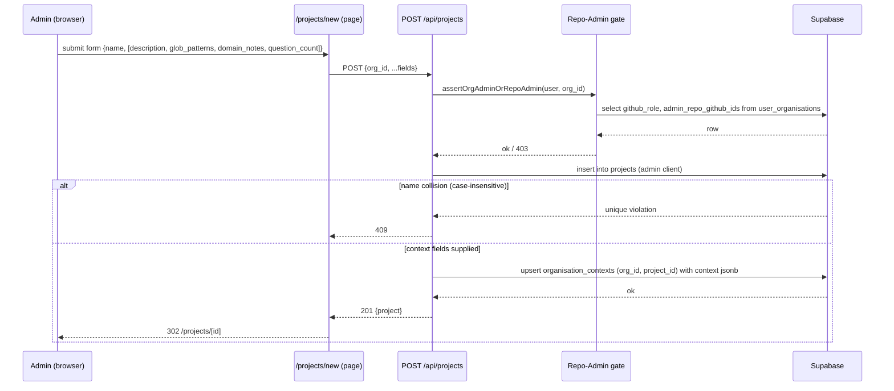
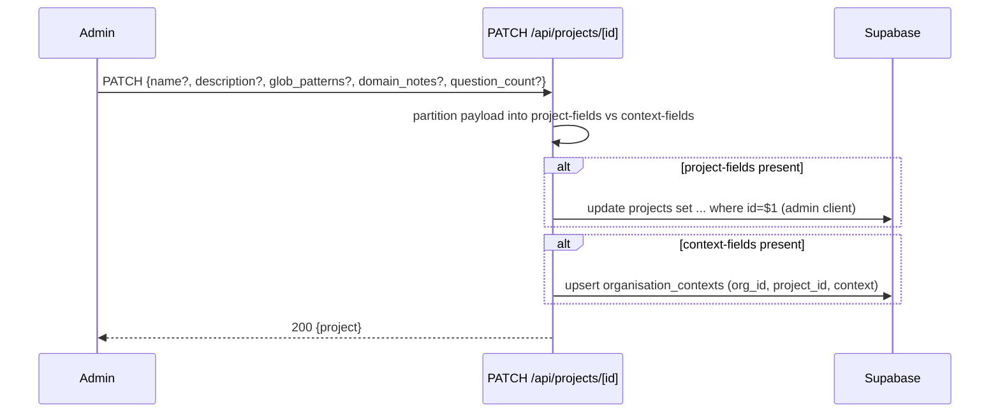
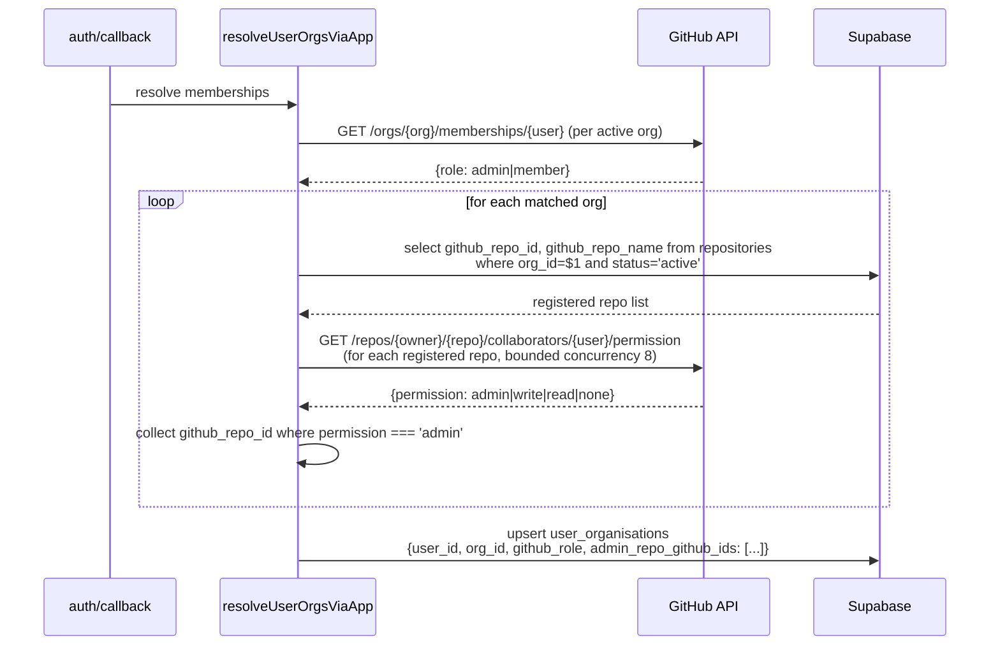
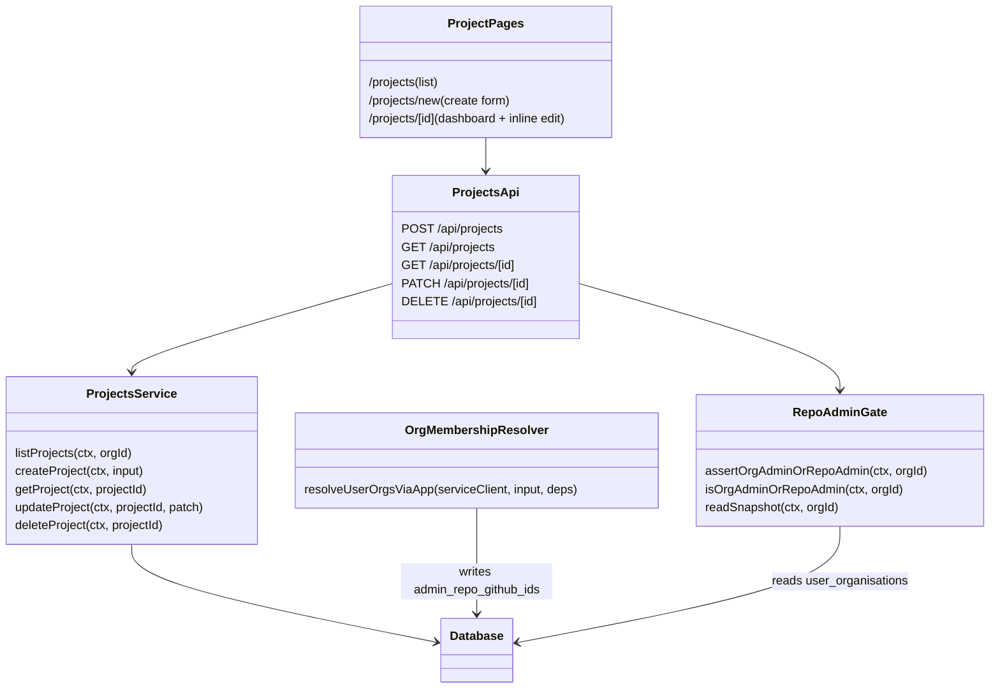

# LLD — V11 Epic E11.1: Project Management

**Date:** 2026-04-30
**Revised:** 2026-04-30 (issue #395 — lld-sync)
**Version:** 0.2
**Epic:** E11.1 (foundation)
**Plan:** [docs/plans/2026-04-30-v11-implementation-plan.md](../plans/2026-04-30-v11-implementation-plan.md)
**HLD:** [v11-design.md §C1, §Level 2](v11-design.md#c1-organisation-management--extended)
**Requirements:** [v11-requirements.md §Epic 1](../requirements/v11-requirements.md#epic-1-project-management-priority-high)
**Related ADRs:** [0027](../adr/0027-project-as-sub-tenant-within-org.md) (project as sub-tenant), [0028](../adr/0028-project-context-reuses-organisation-contexts.md) (reuse `organisation_contexts`), [0029](../adr/0029-repo-admin-permission-runtime-derived.md) (sign-in snapshot)

---

## Part A — Human-reviewable

### Purpose

Stand up the `Project` entity end-to-end so V11's other epics have a stable foundation:

1. Schema for projects + the FK on `organisation_contexts.project_id` from ADR-0028 + the admin-repo snapshot column from ADR-0029.
2. Sign-in extension that populates the admin-repo snapshot, plus the coarse Repo-Admin gate helper that V11.1 + V11.3 use on every project-write request.
3. Five HTTP endpoints (`POST/GET /api/projects`, `GET/PATCH/DELETE /api/projects/[id]`) with the partial-payload PATCH that E11.3 will extend additively.
4. Three pages (`/projects`, `/projects/new`, `/projects/[id]`) that exercise the API surface and redirect Org Members to `/assessments`.

Out of scope (covered by other E11 epics): assessment-list filter integration (E11.2), settings page (E11.3), NavBar / breadcrumbs / root redirect / last-visited (E11.4).

### Behavioural flows

#### A.1 Create project (Story 1.1)



#### A.2 Edit project — partial payload (Story 1.4)



> The PATCH endpoint is created in T1.4 with full partial-payload support. E11.3 reuses it for the settings page without backend changes (plan exit-criteria addendum).

#### A.3 Delete project — empty-only (Story 1.5)

```mermaid
sequenceDiagram
  participant U as Org Admin
  participant API as DELETE /api/projects/[id]
  participant DB as Supabase
  U->>API: DELETE
  API->>DB: select github_role; require 'admin'
  API->>DB: select count(*) from assessments where project_id=$1
  alt count > 0
    API-->>U: 409 {error: "project_not_empty"}
  else count == 0
    API->>DB: delete from projects where id=$1
    alt 0 rows affected
      API-->>U: 404
    else 1 row affected
      API-->>U: 204
    end
  end
```

#### A.4 Sign-in admin-repo snapshot (T1.2 — supports ADR-0029)



The admin-repo set is computed by fetching the product-registered repos for the org from the `repositories` table, then checking per-repo collaborator permission via the GitHub API. Only repos already registered in the product are permission-checked — this avoids querying all installation repos and prevents over-granting access based on unregistered repos. Implementation details in §B.

### Structural overview



### Invariants

| # | Invariant | Verified by |
|---|-----------|-------------|
| I1 | Every project row has an `org_id` matching an active organisation | FK + RLS policy `projects_select_member` |
| I2 | Project names are unique within an org, case-insensitive | Unique index on `(org_id, lower(name))` |
| I3 | A project can only be deleted when no assessments reference it | Service-level count check + 409 on non-empty (no FK CASCADE on assessments.project_id) |
| I4 | `organisation_contexts.project_id` references a real project (or is NULL for legacy org rows) | FK with `ON DELETE CASCADE` (added in T1.1) |
| I5 | Project CRUD endpoints require Org Admin OR Repo Admin (snapshot non-empty); DELETE additionally requires Org Admin | Gate helper + service authorisation (BDD specs in §B) |
| I6 | The admin-repo snapshot is refreshed atomically with the membership upsert during sign-in | Single transaction in `resolveUserOrgsViaApp` (no partial state visible) |
| I7 | `PATCH /api/projects/[id]` mutates only the fields present in the payload | BDD spec in T1.4 |
| I8 | Org Members hitting `/projects`, `/projects/new`, `/projects/[id]` are redirected to `/assessments` | Page-level guard (T1.5/T1.6 BDD) |

### Acceptance criteria

Maps directly to v11-requirements §Epic 1 ACs. Story-level coverage:

- **Story 1.1** — POST validates name (1–200 chars), enforces case-insensitive uniqueness (409), accepts optional context fields, returns 201 with redirect target.
- **Story 1.2** — GET /api/projects lists all projects in caller's org regardless of repo-admin scope; returns name, description, created_at, updated_at; redirect for Org Members on `/projects`.
- **Story 1.3** — `/projects/[id]` renders project header + (placeholder) assessment list slot + "New assessment" CTA; 404 on missing/cross-org/deleted; redirect for Org Members.
- **Story 1.4** — PATCH accepts any subset of `{name, description, glob_patterns, domain_notes, question_count}`; partial-only mutation; 400 on validation; 409 on duplicate name; 403 for Org Members.
- **Story 1.5** — DELETE requires Org Admin (403 for Repo Admin); 409 if project has assessments; 204 on success; 404 on already-deleted (idempotent for the caller).

### BDD specs

```
describe('POST /api/projects')
  it('Org Admin creates a project with only {name}, defaults applied, redirected to dashboard')
  it('Repo Admin creates a project with name + description + context fields persisted')
  it('Empty name returns 400; name > 200 chars returns 400')
  it('Org Member returns 403; no project row created')
  it('Duplicate name within same org (case-insensitive) returns 409')

describe('GET /api/projects')
  it('Returns all projects in caller org with name/description/created_at/updated_at')
  it('Returns empty array when org has no projects')
  it('Returns 401 when unauthenticated, 403 when caller has no membership in queried org')

describe('GET /api/projects/[id]')
  it('Returns project for Org Admin or Repo Admin in same org')
  it('Returns 404 when id does not exist or belongs to a different org')

describe('PATCH /api/projects/[id]')
  it('Mutates only fields present in the payload (name only, then domain_notes only)')
  it('Returns 409 on duplicate name within org (case-insensitive)')
  it('Returns 400 when name empty or > 200 chars')
  it('Returns 400 when question_count outside 3–5')
  it('Returns 403 for Org Member')

describe('DELETE /api/projects/[id]')
  it('Hard-deletes empty project, returns 204')
  it('Returns 409 when project has at least one assessment')
  it('Returns 403 for Repo Admin (delete is Org Admin only)')
  it('Returns 404 on second delete (idempotent for caller)')

describe('Sign-in admin-repo snapshot')
  it('Populates admin_repo_github_ids with repos where authenticated user has permissions.admin = true')
  it('Empty array when user holds no admin repos in the org')
  it('Refreshed atomically with the user_organisations upsert')

describe('Project pages')
  it('Org Member visiting /projects is redirected to /assessments')
  it('Org Member visiting /projects/new is redirected to /assessments')
  it('Org Member visiting /projects/[id] is redirected to /assessments')
  it('Admin sees empty-state CTA on /projects when org has no projects')
  it('Admin clicks inline edit pencil → submits {name, description} → dashboard re-renders new values')
```

---

## Part B — Agent-implementable

<a id="LLD-v11-e11-1-layer-map"></a>

### B.0 Layer map

| Layer | Files |
|-------|-------|
| **DB** | `supabase/schemas/tables.sql`, `supabase/schemas/policies.sql`, generated migration |
| **BE — auth** | `src/lib/supabase/org-membership.ts` (extend), `src/lib/api/repo-admin-gate.ts` (new), `src/lib/github/repo-admin-list.ts` (new) |
| **BE — API** | `src/app/api/projects/route.ts`, `src/app/api/projects/service.ts`, `src/app/api/projects/[id]/route.ts`, `src/app/api/projects/[id]/service.ts`, `src/app/api/projects/validation.ts` |
| **FE** | `src/app/(authenticated)/projects/page.tsx`, `new/page.tsx`, `new/create-form.tsx`, `[id]/page.tsx`, `[id]/inline-edit-header.tsx`, `[id]/delete-button.tsx` |
| **Types** | `src/types/projects.ts` |
| **Tests** | `tests/app/api/projects/*.test.ts`, `tests/lib/supabase/org-membership-snapshot.test.ts`, `tests/lib/api/repo-admin-gate.test.ts` |

<a id="LLD-v11-e11-1-schema"></a>

### B.1 — Task T1.1: Schema

**Files:**

- `supabase/schemas/tables.sql` — add `projects` table, FK on `organisation_contexts.project_id`, snapshot column on `user_organisations`.
- `supabase/schemas/policies.sql` — RLS on `projects`.
- `supabase/migrations/<timestamp>_v11_e11_1_projects.sql` — generated via `npx supabase db diff`.
- `src/lib/supabase/types.ts` — **manually patched** (add `projects` Row/Insert/Update block; add `admin_repo_github_ids: number[]` to `user_organisations`).
- `tests/helpers/v11-e11-1-projects-schema.integration.test.ts` — 6 integration specs covering all BDD acceptance criteria.

> **Implementation note (issue #394):** `src/lib/supabase/types.ts` cannot be auto-regenerated via `supabase gen types typescript --local` — doing so replaces all literal union type columns (e.g. `'prcc' | 'fcs'`, `'active' | 'inactive'`) with plain `string`, breaking downstream consumers. The file is maintained manually; only the new `projects` block and `admin_repo_github_ids` field were added.

**Schema additions:**

```sql
-- projects: V11 organising layer within an org. ADR-0027.
CREATE TABLE projects (
  id          uuid PRIMARY KEY DEFAULT gen_random_uuid(),
  org_id      uuid NOT NULL REFERENCES organisations(id) ON DELETE CASCADE,
  name        text NOT NULL CHECK (char_length(name) BETWEEN 1 AND 200),
  description text,
  created_at  timestamptz NOT NULL DEFAULT now(),
  updated_at  timestamptz NOT NULL DEFAULT now()
);
CREATE UNIQUE INDEX uq_projects_org_lower_name ON projects (org_id, lower(name));
CREATE INDEX idx_projects_org ON projects (org_id);

-- Backfill FK on organisation_contexts.project_id (column exists since Phase 2). ADR-0028.
ALTER TABLE organisation_contexts
  ADD CONSTRAINT organisation_contexts_project_id_fkey
  FOREIGN KEY (project_id) REFERENCES projects(id) ON DELETE CASCADE;

-- Admin-repo snapshot for Repo-Admin gate. ADR-0029.
ALTER TABLE user_organisations
  ADD COLUMN admin_repo_github_ids bigint[] NOT NULL DEFAULT '{}';
```

**RLS policies (`policies.sql`):**

```sql
ALTER TABLE projects ENABLE ROW LEVEL SECURITY;

CREATE POLICY projects_select_member ON projects
  FOR SELECT USING (org_id IN (SELECT get_user_org_ids()));

-- INSERT/UPDATE/DELETE flow via service role (admin client) after gate-helper authorisation.
-- No INSERT/UPDATE/DELETE policies for the user JWT — matches ADR-0025 pattern (org-scoped writes via admin client).
```

**Acceptance:**
- `npx supabase db reset` succeeds; `npx supabase db diff` empty after running.
- `npx tsc --noEmit` passes after manually patching `src/lib/supabase/types.ts` (see Files note above — do not auto-regenerate).

**Tasks:**
1. Edit `tables.sql` (additions above).
2. Edit `policies.sql` (RLS).
3. `npx supabase db diff -f v11_e11_1_projects` → review.
4. `npx supabase db reset` → verify diff empty.

<a id="LLD-v11-e11-1-sign-in-snapshot-and-gate"></a>

### B.2 — Task T1.2: Sign-in admin-repo snapshot + Repo-Admin gate

**Files:**

- `src/lib/supabase/org-membership.ts` — extend `MatchedOrg`, `buildUpsertRows`, and `fetchMembershipRole` to include `adminRepoGithubIds`.
- `src/lib/github/repo-admin-list.ts` (new) — fetch repos visible to the installation token where the authenticated GitHub user has admin permission.
- `src/lib/api/repo-admin-gate.ts` (new) — gate helper.
- `tests/lib/supabase/org-membership-snapshot.test.ts`, `tests/lib/api/repo-admin-gate.test.ts`.

**Internal decomposition — `repo-admin-list.ts`:**

```ts
// Check admin permission on repos registered in the product.
// Caller pre-filters the repo list from the repositories table — avoids querying
// all installation repos and prevents over-granting on unregistered repos.
//
// Concrete approach (per registered repo, parallelised, bounded concurrency 8):
//   1. Caller fetches registered repos from repositories table (org_id + status='active').
//   2. For each RegisteredRepo, GET /repos/{owner}/{repo}/collaborators/{username}/permission
//      → { permission: 'admin'|'write'|'read'|'none' }.
//   3. Collect github_repo_id where permission === 'admin'.
//
// Uses global fetch; MSW intercepts in tests. No fetchImpl injection.

export interface RegisteredRepo {
  githubRepoId: number;
  repoFullName: string; // "owner/repo" as stored in repositories.github_repo_name
}

export interface ListAdminReposInput {
  installationId: number;
  githubLogin: string;
  repos: RegisteredRepo[]; // pre-filtered from DB; not queried from GitHub
}

export interface ListAdminReposDeps {
  getInstallationToken?: (id: number) => Promise<string>;
  // fetchImpl removed — global fetch used directly; MSW intercepts in tests
}

export async function listAdminReposForUser(
  input: ListAdminReposInput,
  deps?: ListAdminReposDeps,
): Promise<number[]>; // returns github_repo_id list
```

> **Implementation note (issue #395):** The LLD originally specified `orgGithubName: string` and `GET /installation/repositories` as step 1 to enumerate all repos visible to the installation. This was amended during implementation: the caller now passes `repos: RegisteredRepo[]` pre-fetched from the `repositories` DB table. Rationale: scopes permission checks to product-registered repos only; avoids a GitHub API round trip; prevents over-granting based on repos not yet registered. `fetchImpl` was also removed from `ListAdminReposDeps` — CLAUDE.md requires MSW for HTTP mocking, so `fetch` is used directly.

> **Implementation note (issue #395):** `fetchRegisteredRepos(serviceClient, orgId)` was added to `org-membership.ts` as a private helper to query the `repositories` table per matched org. It is called inside `matchOrgsForUser`, with a short-circuit for personal-account installs (`org.github_org_id === input.githubUserId`) that skips the DB lookup entirely. `checkMembershipRole` was also extracted from `fetchMembershipRole` to stay within the 20-line function budget.

**Internal decomposition — `repo-admin-gate.ts`:**

```ts
// Reads the snapshot from user_organisations. Zero GitHub calls.
// ADR-0029 §2 — both project CRUD and FCS create read this same snapshot.

import type { ApiContext } from '@/lib/api/context';

export interface RepoAdminSnapshot {
  githubRole: 'admin' | 'member';
  adminRepoGithubIds: number[];
}

export async function readSnapshot(
  ctx: ApiContext,
  orgId: string,
): Promise<RepoAdminSnapshot | null>; // null if no membership row

export async function isOrgAdminOrRepoAdmin(
  ctx: ApiContext,
  orgId: string,
): Promise<boolean>; // true iff role=admin OR adminRepoGithubIds non-empty

export async function assertOrgAdminOrRepoAdmin(
  ctx: ApiContext,
  orgId: string,
): Promise<void>; // throws ApiError(403) on false; ApiError(401) if no membership

export async function assertOrgAdmin(
  ctx: ApiContext,
  orgId: string,
): Promise<void>; // delete-only path: requires github_role = 'admin'
```

**Membership-resolver extension:**

`MatchedOrg` becomes `{ org, role, adminRepoGithubIds: number[] }`. `fetchMembershipRole` calls `listAdminReposForUser` only when `role !== 'admin'` for the personal account match (org admins implicitly see all admin repos, but for snapshot consistency the field still records the actual admin-repo IDs — populated for both roles so the gate can answer "any admin repo" uniformly). `buildUpsertRows` adds `admin_repo_github_ids` to the upsert payload.

**Tasks:**
1. Add `listAdminReposForUser` with unit tests (MSW-mocked GitHub responses).
2. Extend `org-membership.ts` (parameterised tests cover: admin-with-repos, member-with-repos, member-with-none).
3. Add `repo-admin-gate.ts` with unit tests against a Supabase mock — covers I5.
4. Verify atomicity (I6): single upsert call carries the snapshot column.

**Acceptance:**
- `npx vitest run tests/lib/supabase tests/lib/api/repo-admin-gate.test.ts` passes.
- `npx tsc --noEmit` passes.

<a id="LLD-v11-e11-1-projects-api-create-list"></a>

### B.3 — Task T1.3: Projects API — create + list

**Files:**

- `src/app/api/projects/route.ts` (controller, ≤ 25 lines per handler)
- `src/app/api/projects/service.ts` (createProject, listProjects)
- `src/app/api/projects/validation.ts` (Zod schemas)
- `src/types/projects.ts`
- `tests/app/api/projects/create.test.ts`, `tests/app/api/projects/list.test.ts`

**Internal decomposition — controller (`route.ts`):**

```ts
// Convention: ADR-0014 contract types inline.
interface CreateProjectRequest {
  org_id: string;
  name: string;
  description?: string;
  glob_patterns?: string[];
  domain_notes?: string;
  question_count?: number;
}
interface ProjectResponse {
  id: string;
  org_id: string;
  name: string;
  description: string | null;
  created_at: string;
  updated_at: string;
}
interface ProjectsListResponse { projects: ProjectResponse[] }

export async function POST(request: NextRequest) {
  try {
    const ctx = await createApiContext(request);
    const body = await validateBody(request, CreateProjectSchema);
    const project = await createProject(ctx, body);
    return json(project, { status: 201 });
  } catch (e) { return handleApiError(e); }
}

export async function GET(request: NextRequest) {
  try {
    const ctx = await createApiContext(request);
    const orgId = new URL(request.url).searchParams.get('org_id');
    if (!orgId) throw new ApiError(400, 'org_id required');
    const projects = await listProjects(ctx, orgId);
    return json({ projects });
  } catch (e) { return handleApiError(e); }
}
```

**Service contracts (`service.ts`):**

```ts
import type { ApiContext } from '@/lib/api/context';
import { assertOrgAdminOrRepoAdmin } from '@/lib/api/repo-admin-gate';
// service receives ApiContext; never calls createClient() directly (CLAUDE.md).

export async function createProject(
  ctx: ApiContext,
  input: CreateProjectRequest,
): Promise<ProjectResponse>;
// 1. assertOrgAdminOrRepoAdmin(ctx, input.org_id)
// 2. insert via ctx.adminSupabase; map unique_violation -> ApiError(409, 'name_taken')
// 3. if any of {glob_patterns, domain_notes, question_count} present:
//    upsert organisation_contexts (org_id, project_id, context = {globs, notes, count})
// 4. return mapped row

export async function listProjects(
  ctx: ApiContext,
  orgId: string,
): Promise<ProjectResponse[]>;
// 1. read membership row; 401/403 if not member of orgId
// 2. select id, org_id, name, description, created_at, updated_at from projects
//    where org_id = $1 order by created_at desc (RLS enforces too — defence in depth)
```

**Validation (`validation.ts`):**

```ts
export const CreateProjectSchema = z.object({
  org_id: z.string().uuid(),
  name: z.string().min(1).max(200),
  description: z.string().max(2000).optional(),
  glob_patterns: z.array(z.string().min(1)).max(50).optional(),
  domain_notes: z.string().max(2000).optional(),
  question_count: z.number().int().min(3).max(5).optional(),
});
```

**Tasks:**
1. Write Zod + types.
2. Write service `createProject` with unique-violation mapping.
3. Write controller.
4. Tests: 5 BDD specs from §"BDD specs" §POST + 3 specs from §GET. MSW for any GitHub touchpoints (none expected — gate reads snapshot only).
5. Repeat for list.

**Acceptance:** all `POST /api/projects` and `GET /api/projects` BDD specs pass; `npx tsc --noEmit` clean; `/diag` clean on changed files.

<a id="LLD-v11-e11-1-projects-api-read-edit-delete"></a>

### B.4 — Task T1.4: Projects API — read + edit + delete

**Files:**

- `src/app/api/projects/[id]/route.ts` (GET, PATCH, DELETE)
- `src/app/api/projects/[id]/service.ts` (getProject, updateProject, deleteProject)
- `tests/app/api/projects/get-by-id.test.ts`, `tests/app/api/projects/update.test.ts`, `tests/app/api/projects/delete.test.ts`

**Internal decomposition — controller:**

```ts
interface UpdateProjectRequest {
  name?: string;
  description?: string;
  glob_patterns?: string[];
  domain_notes?: string;
  question_count?: number;
}
interface RouteContext { params: Promise<{ id: string }> }

export async function GET(request: NextRequest, { params }: RouteContext) {
  try {
    const ctx = await createApiContext(request);
    const { id } = await params;
    return json(await getProject(ctx, id));
  } catch (e) { return handleApiError(e); }
}

export async function PATCH(request: NextRequest, { params }: RouteContext) {
  try {
    const ctx = await createApiContext(request);
    const { id } = await params;
    const body = await validateBody(request, UpdateProjectSchema);
    return json(await updateProject(ctx, id, body));
  } catch (e) { return handleApiError(e); }
}

export async function DELETE(request: NextRequest, { params }: RouteContext) {
  try {
    const ctx = await createApiContext(request);
    const { id } = await params;
    await deleteProject(ctx, id);
    return new Response(null, { status: 204 });
  } catch (e) { return handleApiError(e); }
}
```

**Service contracts (`service.ts`):**

```ts
export async function getProject(ctx: ApiContext, projectId: string): Promise<ProjectResponse>;
// 1. select * from projects where id=$1 (RLS limits to caller's orgs)
// 2. if not found -> ApiError(404)
// 3. assertOrgAdminOrRepoAdmin on project.org_id

export async function updateProject(
  ctx: ApiContext,
  projectId: string,
  patch: UpdateProjectRequest,
): Promise<ProjectResponse>;
// 1. resolve project (404 if missing)
// 2. assertOrgAdminOrRepoAdmin(ctx, project.org_id)
// 3. partition patch into projectFields (name, description) and contextFields
//    (glob_patterns, domain_notes, question_count)
// 4. if projectFields non-empty: update projects (admin client); map unique_violation -> 409
// 5. if contextFields non-empty: upsert organisation_contexts (org_id, project_id, context = merged)
//    — read existing context first, merge only the supplied keys (preserves I7)
// 6. return reloaded project row

export async function deleteProject(ctx: ApiContext, projectId: string): Promise<void>;
// 1. resolve project (404 if missing)
// 2. assertOrgAdmin(ctx, project.org_id)  ← Org Admin only (Story 1.5)
// 3. select 1 from assessments where project_id = $1 limit 1
// 4. if exists -> ApiError(409, 'project_not_empty')
// 5. delete from projects where id = $1 (admin client)
// 6. if 0 rows affected -> ApiError(404)  ← idempotent
```

**Validation:**

```ts
export const UpdateProjectSchema = z.object({
  name: z.string().min(1).max(200).optional(),
  description: z.string().max(2000).optional(),
  glob_patterns: z.array(z.string().min(1)).max(50).optional(),
  domain_notes: z.string().max(2000).optional(),
  question_count: z.number().int().min(3).max(5).optional(),
}).refine((o) => Object.keys(o).length > 0, { message: 'at_least_one_field' });
```

**Tasks:**
1. Service functions with unit tests covering all PATCH/DELETE BDD specs.
2. Controller.
3. Confirm I7 with two specs: "PATCH name only does not change description"; "PATCH domain_notes only does not change name".

**Acceptance:** all `[id]` BDD specs pass; partial-payload mutation explicitly verified.

<a id="LLD-v11-e11-1-project-pages-list-create"></a>

### B.5 — Task T1.5: Project pages — list + create

**Files:**

- `src/app/(authenticated)/projects/page.tsx` (server component — list)
- `src/app/(authenticated)/projects/new/page.tsx` (server component shell)
- `src/app/(authenticated)/projects/new/create-form.tsx` (client component — form)
- `tests/app/(authenticated)/projects/list-page.test.tsx`, `new-page.test.tsx`

**Behaviour:**

- Both pages: call `assertAdminOrRepoAdminForCurrentOrg()` server-side; on false `redirect('/assessments')`.
- List page: server-fetch `GET /api/projects?org_id=$current` via direct service call (avoid HTTP self-fetch — see issue #376 pattern); render table; show empty-state "Create project" CTA when no rows.
- New page: render `<CreateProjectForm />` client component which POSTs to `/api/projects` and calls `router.push(/projects/${id})` on success. Surface 409 inline with "Name already in use".

**Tasks:**
1. Helper `getCurrentOrgId(supabase, userId)` — reuse existing pattern (look up `user_organisations` first row or current org from session).
2. List page (server-rendered) + redirect guard.
3. New page server shell + `create-form.tsx` client.
4. Component tests covering Org Member redirect and admin empty-state.

<a id="LLD-v11-e11-1-project-dashboard-inline-edit"></a>

### B.6 — Task T1.6: Project dashboard + inline edit

**Files:**

- `src/app/(authenticated)/projects/[id]/page.tsx` (server component)
- `src/app/(authenticated)/projects/[id]/inline-edit-header.tsx` (client — pencil affordance)
- `src/app/(authenticated)/projects/[id]/delete-button.tsx` (client — Org Admin only)
- `tests/app/(authenticated)/projects/dashboard-page.test.tsx`, `inline-edit-header.test.tsx`

**Behaviour:**

- Server component fetches the project via `getProject` service (direct, not HTTP); 404 on missing/cross-org/deleted.
- Org Member → `redirect('/assessments')`.
- Page renders: header with name + description + pencil (visible to admins/repo-admins), delete button (visible only to Org Admin), placeholder "Assessments" section + "New assessment" CTA (link to `/projects/[id]/assessments/new` — route created in E11.2; CTA renders disabled until E11.2 lands, with comment indicating that).
- Inline edit submits PATCH `/api/projects/[id]` with `{name, description}`, optimistic update, error toast on 409.
- Delete button confirms then DELETEs; redirects to `/projects` on 204; surfaces 409 "project not empty" inline.

**Tasks:**
1. Dashboard page + redirect guard + 404 path.
2. Inline edit client component + tests.
3. Delete button (visible iff `github_role === 'admin'`) + tests.

**Acceptance:**
- All §A.1-related BDD specs for the dashboard + inline edit pass.
- Org Member redirect verified.
- 404 path for cross-org and non-existent IDs verified.

<a id="LLD-v11-e11-1-cross-cutting"></a>

### B.7 Cross-cutting

- **British English** in all new docs and comments.
- **CLAUDE.md complexity budget**: every handler ≤ 25 lines; every service function ≤ 20 lines (decompose internally if needed); nesting ≤ 3.
- **Tests style**: BDD `Given/When/Then` in `describe`/`it`; MSW for GitHub mocks in T1.2; Supabase mocked via existing test helpers.
- **No silent catch**: every catch logs or rethrows.

<a id="LLD-v11-e11-1-out-of-scope"></a>

### B.8 Out-of-scope reminders

- Project-scoped assessment list filter — **E11.2** (T1.6 only renders a placeholder slot).
- Settings page (`/projects/[id]/settings`) — **E11.3** (extends PATCH endpoint additively).
- NavBar "Projects" item, breadcrumbs, root redirect, last-visited — **E11.4**.
- The Org-Member redirect on `/projects` (Story 4.2) is implemented here in T1.5 so the page works on day one. E11.4 inherits this without rework.
