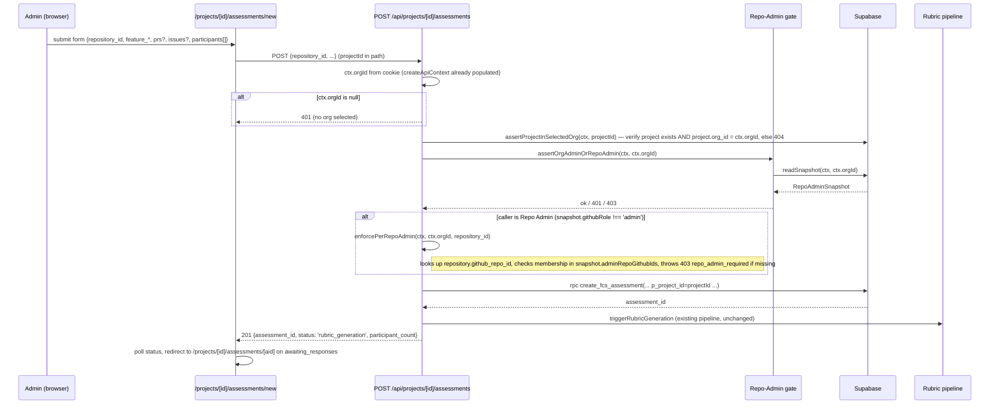
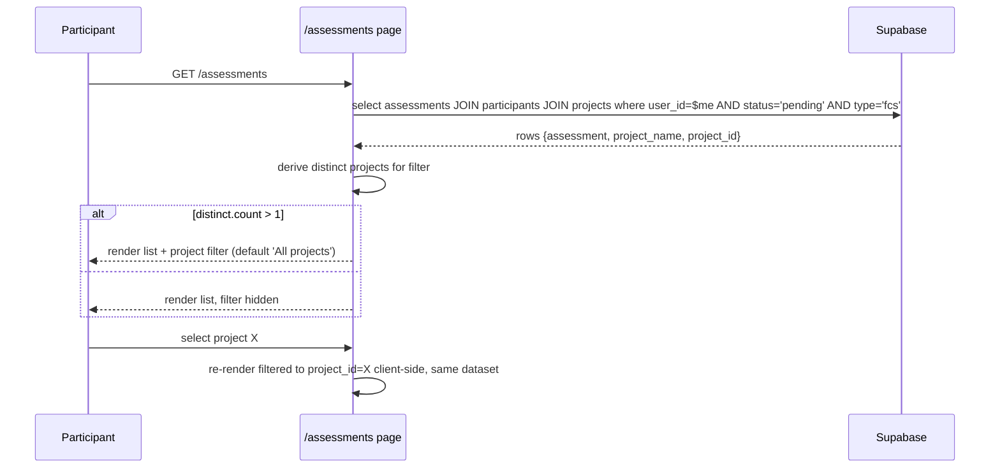
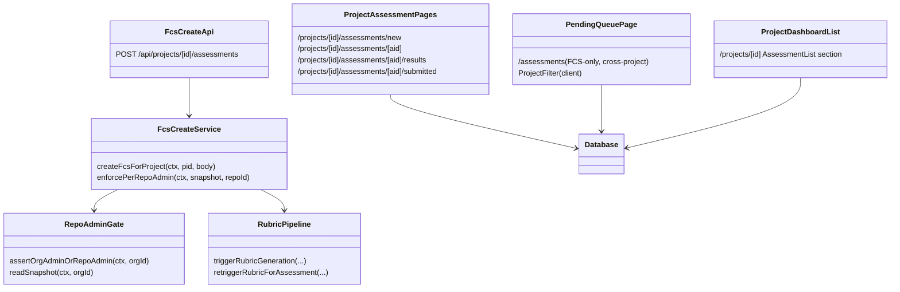
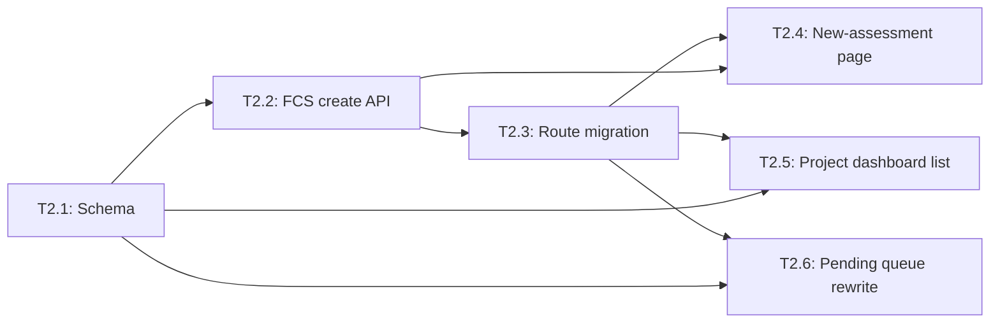

# LLD — V11 Epic E11.2: FCS Scoped to Projects

## Document Control

| Field | Value |
|-------|-------|
| Version | 0.2 |
| Status | Draft |
| Author | LS / Claude |
| Created | 2026-05-01 |
| Epic | E11.2 (#409) |
| Parent HLD | [v11-design.md §C3, §3.V11.1](v11-design.md#c3-feature-comprehension-score-fcs--extended) |
| Implementation plan | [docs/plans/2026-04-30-v11-implementation-plan.md](../plans/2026-04-30-v11-implementation-plan.md) |
| Requirements | [v11-requirements.md §Epic 2](../requirements/v11-requirements.md#epic-2-fcs-scoped-to-projects-priority-high) |
| Related ADRs | [0027](../adr/0027-project-as-sub-tenant-within-org.md) (project as sub-tenant), [0029](../adr/0029-repo-admin-permission-runtime-derived.md) (repo-admin gate) |

## Open questions

These are flagged here rather than silently decided in the body — confirm direction before `/feature` runs.

1. **API-layer `/api/assessments/[id]` hardening (T2.3).** Current draft: `pid`/`aid` mismatch is enforced at the page layer only; `GET /api/assessments/[id]` is unchanged and returns the row regardless of project context (RLS still gates by org). Alternative: also harden the API. Decision affects whether deep-link compatibility (Story 4.5) is purely route-level or extends to API-level.

(Resolved: cross-org probe shape — `assertProjectInSelectedOrg` returns 404 when `project.org_id !== ctx.orgId`, single fail-closed query, no tenant existence leak.)

---

## Part A — Human-reviewable

### Purpose

Wire `project_id` into the FCS creation flow as a hard requirement, scope the assessment list shown on the project dashboard, provide participants a cross-project pending queue (filterable by project), and migrate every assessment URL to the project-first shape `/projects/[id]/assessments/[aid]/...`. The legacy `/assessments/[aid]` shape is removed (returns 404) — pre-prod, no live URLs depend on it (requirements §OQ 5).

Out of scope: settings page (E11.3), context resolver wiring (E11.3), NavBar / breadcrumbs / root redirect (E11.4).

### Behavioural flows

#### A.1 Create FCS assessment (Story 2.1)



#### A.2 Project-scoped list on dashboard (Story 2.2)


#### A.3 My Pending Assessments + filter (Stories 2.3, 2.3a)



#### A.4 Project-scoped assessment URL resolution (Stories 2.4, 4.5)


### Structural overview



### Invariants

| # | Invariant | Verified by |
|---|-----------|-------------|
| I1 | Every FCS assessment row has a non-null `project_id` | DB CHECK `(type <> 'fcs' OR project_id IS NOT NULL)` (T2.1) |
| I2 | PRCC rows may have `project_id` NULL (foundation FK only) | Same CHECK gates only `type = 'fcs'` |
| I3 | A Repo Admin cannot create an FCS assessment for a repo outside their admin-repo snapshot | Service-level check in T2.2 (`enforcePerRepoAdmin`) |
| I4 | A request to `/projects/[id]/assessments/[aid]` where `aid.project_id !== pid` returns 404 | Page-level guard (T2.3) — single SELECT, `notFound()` on mismatch |
| I5 | The legacy URL shape `/assessments/[aid]` returns 404 | Directory removal (T2.3) — Next.js routing gives 404 |
| I6 | The pending queue at `/assessments` shows only FCS rows | Query predicate `assessments.type = 'fcs'` (T2.6) |
| I7 | The project filter on `/assessments` lists only projects represented in the user's pending queue | Filter populated from query result, not from `GET /api/projects` (T2.6) |
| I8 | Project-scoped list filters strictly by `project_id` (no cross-project leak) | `.eq('project_id', pid)` predicate + integration test (T2.5) |
| I9 | Legacy `POST /api/fcs` route is removed | `src/app/api/fcs/` directory deleted (T2.2); shared rubric helpers relocated |

### Acceptance criteria

Maps to v11-requirements §Epic 2 ACs:

- **Story 2.1** — POST creates a row with `project_id = pid`; per-repo admin check enforced; missing `project_id` (path) ⇒ 404; Org Member ⇒ 403; tampered repo for Repo Admin ⇒ 403.
- **Story 2.2** — Dashboard list filters by `project_id` and `type = 'fcs'`; reuses existing list shape; empty state CTA.
- **Story 2.3** — `/assessments` shows pending FCS items across projects, each labelled with project name; submitted items disappear on reload; PRCC excluded.
- **Story 2.3a** — Filter offers "All projects" + distinct projects from queue; hidden when only one.
- **Story 2.4** — Project-first URLs resolve; mismatch ⇒ 404; results & submitted pages also migrated.
- **Story 4.5** — Legacy `/assessments/[aid]` ⇒ 404 (directory deleted); auth round-trip preserves the original URL.

### BDD specs (epic-level summary)

Per-task BDD blocks live on each task issue. Aggregated here for review:

```
describe('POST /api/projects/[id]/assessments')
  it('Org Admin creates an FCS assessment in their org’s project; row has project_id=pid')
  it('Repo Admin creates an assessment for a repo in their admin-repo snapshot')
  it('Repo Admin submitting a repo NOT in their snapshot returns 403 repo_admin_required')
  it('Org Member returns 403; no assessment created')
  it('Unknown project pid returns 404')
  it('Project belongs to a different org than caller’s selected org returns 404')
  it('Missing repository_id returns 400')
  it('Missing both merged_pr_numbers and issue_numbers returns 422')

describe('Schema — assessments.project_id')
  it('FCS row with project_id=NULL is rejected by CHECK')
  it('PRCC row with project_id=NULL is accepted')
  it('ON DELETE SET NULL nullifies project_id when project deleted')

describe('Project-scoped assessment URLs')
  it('GET /projects/<pid>/assessments/<aid> renders detail when assessment belongs to project')
  it('Returns 404 when assessment.project_id !== pid')
  it('GET /assessments/<aid> (legacy) returns 404')

describe('Project dashboard — assessment list')
  it('Lists exactly the FCS assessments whose project_id = pid')
  it('Excludes assessments from sibling projects and PRCC rows')

describe('/assessments — My Pending Assessments')
  it('Lists pending FCS assessments where participant.user_id = current user')
  it('Each item labelled with project name; links to /projects/[id]/assessments/[aid]')
  it('Filter offers All projects + distinct projects from queue, hidden when ≤ 1')
  it('Excludes PRCC and already-submitted rows')

describe('/projects/[id]/assessments/new')
  it('Org Admin sees all org repos; Repo Admin sees only admin-snapshot repos')
  it('Submitting posts to /api/projects/[id]/assessments and routes to detail on success')
```

---

## Part B — Agent-implementable

<a id="LLD-v11-e11-2-layer-map"></a>

### B.0 Layer map

| Layer | Files |
|-------|-------|
| **DB** | `supabase/schemas/tables.sql`, generated migration; `src/lib/supabase/types.ts` (manual patch — see #394) |
| **BE — engine** | `src/lib/engine/fcs-pipeline.ts` (new — extracted from `/api/fcs/service.ts`: `triggerRubricGeneration`, `retriggerRubricForAssessment`, `extractArtefacts`, `finaliseRubric`, `markRubricFailed`, `updateProgress`, `RubricGenerationError`, `MAX_RUBRIC_RETRIES`) |
| **BE — API** | `src/app/api/projects/[id]/assessments/route.ts`, `service.ts`, `validation.ts` (new); `src/app/api/fcs/` (deleted); `src/app/api/assessments/[id]/retry-rubric/...` (import update only) |
| **FE — pages** | `src/app/(authenticated)/projects/[id]/assessments/new/{page,create-assessment-form}.tsx` (move + adapt); `src/app/(authenticated)/projects/[id]/assessments/[aid]/{page,results/page,submitted/page}.tsx` (move from legacy); `src/app/(authenticated)/projects/[id]/page.tsx` (lift placeholder slot to real list); `src/app/(authenticated)/projects/[id]/assessment-list.tsx` (new); `src/app/(authenticated)/assessments/page.tsx` (rewrite); `src/app/(authenticated)/assessments/project-filter.tsx` (new) |
| **FE — deletions** | `src/app/(authenticated)/assessments/[id]/...` directory; `src/app/(authenticated)/assessments/new/` directory |
| **Types** | inline contracts on the new API route file (ADR-0014); shared response shape `CreateFcsResponse` re-exported from the new service |
| **Tests** | `tests/app/api/projects/[id]/assessments/{create,gate}.test.ts`; `tests/app/(authenticated)/projects/[id]/assessments/...` page tests; `tests/app/(authenticated)/assessments/page.test.tsx` (rewrite); schema integration test |

#### Reused helpers — DO NOT re-implement

These helpers already exist (E11.1). Inlining their logic is forbidden — `/feature` agents must import from the listed paths. Each row records the canonical call site.

| Helper | Import path | Use it instead of |
|--------|-------------|-------------------|
| `assertOrgAdminOrRepoAdmin(ctx, orgId)` | `@/lib/api/repo-admin-gate` | Inlining a `user_organisations` query in API routes. Throws `ApiError(401)` / `ApiError(403)`. |
| `readSnapshot(ctx, orgId): Promise<RepoAdminSnapshot \| null>` | `@/lib/api/repo-admin-gate` | Re-querying `github_role, admin_repo_github_ids` in API services. Returns `{ githubRole, adminRepoGithubIds }`. |
| `RepoAdminSnapshot` type | `@/lib/api/repo-admin-gate` | Defining a local snapshot interface. |
| `assertOrgAdmin(ctx, orgId)` | `@/lib/api/repo-admin-gate` | Inline `if (role !== 'admin') throw 403`. |
| `getOrgRole(supabase, userId, orgId): Promise<'admin' \| 'repo_admin' \| null>` | `@/lib/supabase/membership` | Inlining a `user_organisations` query in **server pages**. This is the page-side equivalent of `assertOrgAdminOrRepoAdmin` — pages cannot use `ApiContext`. |
| `isAdminOrRepoAdmin(supabase, userId, orgId)` | `@/lib/supabase/membership` | Boolean variant of `getOrgRole`. |
| `createApiContext(request)` | `@/lib/api/context` | Calling `createClient()` in route handlers. The composition root for all API routes — see [ADR-0019]. |
| `ctx.orgId` (already populated by `createApiContext`) | `@/lib/api/context` | Re-deriving the selected org id from cookies inside a service, **or** doing `select org_id from projects where id=$1` to learn the caller's org. The cookie is the source of truth; the project row is for tenant-isolation checks (`project.org_id = ctx.orgId`), not for setting `orgId`. |
| `getSelectedOrgId(cookies)` | `@/lib/supabase/org-context` | Reading the `fcs-org-id` cookie directly in **server pages**. Page-side equivalent of `ctx.orgId`. |
| `validateBody(request, schema)` | `@/lib/api/validation` | Hand-rolled `await request.json()` + Zod parse. |
| `handleApiError(e)` | `@/lib/api/errors` | Hand-rolled `try/catch` returning `Response.json`. |
| `json(payload, status?)` | `@/lib/api/response` | `new Response(JSON.stringify(...))`. |

> **Constraint for `/feature`:** before writing any new query against `user_organisations`, `projects`, or any auth-related table, grep `src/lib/api/repo-admin-gate.ts`, `src/lib/supabase/membership.ts`, and any `service.ts` under `src/app/api/projects/` for an existing helper. If one exists, use it. If you need a slightly different shape, extend the existing helper rather than duplicating the query — see how `getOrgRole` was added in #408 instead of inlining a second snapshot read.

<a id="LLD-v11-e11-2-schema"></a>

### B.1 — Task T2.1: Schema

**Files:**
- `supabase/schemas/tables.sql` — add column + CHECK + index on `assessments`.
- `supabase/migrations/<timestamp>_v11_e11_2_assessments_project.sql` — generated.
- `src/lib/supabase/types.ts` — manual patch (per #394 note in E11.1 LLD).
- `tests/integration/v11-e11-2-assessments-project.integration.test.ts`.

**Schema additions:**

```sql
ALTER TABLE assessments
  ADD COLUMN project_id uuid REFERENCES projects(id) ON DELETE SET NULL;

ALTER TABLE assessments
  ADD CONSTRAINT assessments_fcs_requires_project
  CHECK (type <> 'fcs' OR project_id IS NOT NULL);

CREATE INDEX idx_assessments_project ON assessments (project_id);
```

> **Why `ON DELETE SET NULL` instead of `CASCADE`?** Story 1.5 (E11.1) already prevents deleting a project that has assessments — the empty-only DELETE returns 409. So in normal operation, the FK never sees a project deletion while child rows exist. `SET NULL` is the safer fallback if a future admin-tool path bypasses the empty check: assessment data is preserved for audit, just orphaned from a project that no longer exists.

**Tasks:**
1. Edit `tables.sql`.
2. `npx supabase db diff -f v11_e11_2_assessments_project` → review.
3. `npx supabase db reset` → verify diff empty.
4. Manually patch `src/lib/supabase/types.ts` (`assessments` Row/Insert/Update: `project_id: string | null`).
5. Integration tests covering I1, I2, plus the SET NULL behaviour.

**Acceptance:** see issue #410.

<a id="LLD-v11-e11-2-fcs-create-api"></a>

### B.2 — Task T2.2: FCS create API + per-repo gate

**Files:**
- `src/app/api/projects/[id]/assessments/route.ts` (controller — handler ≤ 25 lines)
- `src/app/api/projects/[id]/assessments/service.ts` (service)
- `src/app/api/projects/[id]/assessments/validation.ts` (Zod)
- `src/lib/engine/fcs-pipeline.ts` (new — extracted from old `/api/fcs/service.ts`)
- Delete: `src/app/api/fcs/route.ts`, `src/app/api/fcs/service.ts`
- Update import sites (retry-rubric route is the main one; grep for `from '@/app/api/fcs/`).

**Controller:**

```ts
import type { NextRequest } from 'next/server';
import { createApiContext } from '@/lib/api/context';
import { handleApiError } from '@/lib/api/errors';
import { json } from '@/lib/api/response';
import { validateBody } from '@/lib/api/validation';
import { CreateFcsBodySchema, createFcsForProject } from './service';
export type { CreateFcsResponse } from '@/lib/engine/fcs-pipeline';

interface RouteContext { params: Promise<{ id: string }> }

export async function POST(request: NextRequest, { params }: RouteContext) {
  try {
    const ctx = await createApiContext(request);
    const { id: projectId } = await params;
    const body = await validateBody(request, CreateFcsBodySchema);
    return json(await createFcsForProject(ctx, projectId, body), 201);
  } catch (e) { return handleApiError(e); }
}
```

**Service contract:**

```ts
import type { ApiContext } from '@/lib/api/context';
import { z } from 'zod';
import { ApiError } from '@/lib/api/errors';
import { assertOrgAdminOrRepoAdmin, readSnapshot } from '@/lib/api/repo-admin-gate';
import { triggerRubricGeneration, type CreateFcsResponse } from '@/lib/engine/fcs-pipeline';

// Body no longer carries org_id or project_id — pid comes from the path,
// org_id is resolved server-side from the project row.
export const CreateFcsBodySchema = z.object({
  repository_id: z.uuid(),
  feature_name: z.string().min(1),
  feature_description: z.string().optional(),
  merged_pr_numbers: z.array(z.number().int().positive()).optional(),
  issue_numbers: z.array(z.number().int().positive()).optional(),
  participants: z.array(z.object({ github_username: z.string().min(1) })).min(1),
  comprehension_depth: z.enum(['conceptual', 'detailed']).default('conceptual'),
}).refine(
  (b) => (b.merged_pr_numbers?.length ?? 0) > 0 || (b.issue_numbers?.length ?? 0) > 0,
  { message: 'At least one of merged_pr_numbers or issue_numbers is required' },
);
export type CreateFcsBody = z.infer<typeof CreateFcsBodySchema>;

export async function createFcsForProject(
  ctx: ApiContext,
  projectId: string,
  body: CreateFcsBody,
): Promise<CreateFcsResponse>;
// 1. if (!ctx.orgId) throw ApiError(401, 'no_org_selected')   // ctx.orgId is the source of truth
// 2. assertProjectInSelectedOrg(ctx, projectId)               // 404 if project missing or in different org
// 3. assertOrgAdminOrRepoAdmin(ctx, ctx.orgId)                // 401 / 403
// 4. enforcePerRepoAdmin(ctx, body.repository_id)             // see helper below
// 5. fetchRepoInfo(ctx.adminSupabase, body.repository_id, ctx.orgId)
// 6. resolveParticipants + validateMergedPRs + validateIssues (existing helpers, relocated)
// 7. createAssessmentWithParticipants — pass p_project_id = projectId to RPC
// 8. triggerRubricGeneration (fire-and-forget, existing pipeline)
// 9. return { assessment_id, status: 'rubric_generation', participant_count }

// Private helper (≤ 15 lines).
async function assertProjectInSelectedOrg(ctx: ApiContext, projectId: string): Promise<void>;
// select id from projects where id=$1 and org_id=$ctx.orgId
// null ⇒ ApiError(404). Single query enforces both existence AND tenant isolation —
// a project that exists in a different org returns 404, never 403, so existence
// is not leaked across tenants. ctx.orgId is non-null by step 1's guard.

// Private helper (≤ 15 lines).
async function enforcePerRepoAdmin(ctx: ApiContext, repositoryId: string): Promise<void>;
// orgId is read from ctx.orgId — caller already asserted non-null.
// 1. snapshot = readSnapshot(ctx, ctx.orgId)
// 2. if snapshot.githubRole === 'admin' return  // org admin bypass
// 3. select github_repo_id from repositories where id=$1 and org_id=ctx.orgId → null ⇒ 422 'repo_not_in_org'
// 4. if !snapshot.adminRepoGithubIds.includes(repoGithubId) ⇒ ApiError(403, 'repo_admin_required')
```

> **RPC change.** The existing `create_fcs_assessment` Postgres function takes `p_org_id`, `p_repository_id`, etc. Add a new positional argument `p_project_id uuid` and INSERT it into the row. Update `supabase/schemas/functions.sql`. Migration regenerates. The branded type `AssessmentId` and helpers stay; only the call site adds `p_project_id`.

**Pipeline relocation.** Move from `src/app/api/fcs/service.ts` into `src/lib/engine/fcs-pipeline.ts` (no behavioural change, just relocation):

- `triggerRubricGeneration`, `retriggerRubricForAssessment`
- `extractArtefacts`, `finaliseRubric`, `runGeneration`, `failGeneration`, `markRubricFailed`
- `updateProgress`
- `RubricGenerationError`, `MAX_RUBRIC_RETRIES`, `RubricFailureDetails`, related interfaces and helpers
- `validateMergedPRs`, `validateIssues`, `resolveParticipants`, `fetchRepoInfo`, `toRepoInfo`, `validateRepo`, `validateCfg`, `createAssessmentWithParticipants`
- Re-export `CreateFcsResponse` type

The new `service.ts` imports from `@/lib/engine/fcs-pipeline`. The existing `assertOrgAdmin` helper in the old service is replaced by `assertOrgAdminOrRepoAdmin` from the gate (broader role allowance per requirements).

**Tasks:**
1. Add `p_project_id` to the RPC; update migration.
2. Relocate the pipeline module.
3. Implement the new controller, service, and Zod schema.
4. Delete the legacy `/api/fcs/` directory; fix all import sites.
5. Tests: 9 BDD specs (see issue #411).

**Acceptance:** see issue #411.

<a id="LLD-v11-e11-2-route-migration"></a>

### B.3 — Task T2.3: Route migration + 404 on mismatch

**Files (move):**
- `src/app/(authenticated)/assessments/[id]/page.tsx` → `…/projects/[id]/assessments/[aid]/page.tsx`
- `src/app/(authenticated)/assessments/[id]/results/page.tsx` → `…/[aid]/results/page.tsx`
- `src/app/(authenticated)/assessments/[id]/submitted/page.tsx` → `…/[aid]/submitted/page.tsx`
- Co-located client components used only by these pages move with them.

**Files (delete):**
- `src/app/(authenticated)/assessments/[id]/` (entire subtree)
- `src/app/(authenticated)/assessments/new/` (entire subtree — replaced by T2.4)

**Page-level guard pattern (applies to all three migrated pages):**

```ts
// src/app/(authenticated)/projects/[id]/assessments/[aid]/page.tsx
export default async function Page({ params }: { params: Promise<{ id: string; aid: string }> }) {
  const { id: projectId, aid } = await params;
  const supabase = await createServerSupabaseClient();
  // RLS scopes by org; we additionally scope by project to fail closed on mismatch.
  const { data: row } = await supabase
    .from('assessments')
    .select('id, project_id')
    .eq('id', aid)
    .maybeSingle();
  if (!row || row.project_id !== projectId) notFound();
  return <ExistingAssessmentDetail assessmentId={aid} />;
}
```

> The body of the existing detail/results/submitted pages is unchanged structurally — they re-fetch via the API or via direct service calls as before. The only addition is the guard above. Internal `Link href` / `router.push` callers (e.g. links from results back to detail) are updated to the new shape.

**API consideration.** `GET /api/assessments/[id]` is **not** changed in this task. The pid/aid mismatch check happens at the page layer (server-rendered) before the API is called. Rationale: minimises API surface change; the API already enforces RLS on org. If a future caller hits the API directly, it still returns the row — but they would need to know `aid` already, and there is no information leak (the org RLS still gates access).

**Grep gate.** PR description must include the output of `grep -rE "/(?:assessments/\[id\]|assessments/[a-z0-9-]{36})" src/` and confirm no remaining matches outside the new project-first paths.

**Tasks:**
1. Copy files to new locations; add the guard.
2. Update internal `Link`/`router.push` callers to new shape.
3. Delete the legacy subtree.
4. Update tests to new paths; add the mismatch test.

**Acceptance:** see issue #412.

<a id="LLD-v11-e11-2-new-assessment-page"></a>

### B.4 — Task T2.4: New-assessment page + repo-admin filter

**Files:**
- `src/app/(authenticated)/projects/[id]/assessments/new/page.tsx` (server)
- `src/app/(authenticated)/projects/[id]/assessments/new/create-assessment-form.tsx` (client)

**Page (server) sketch:**

```ts
import { notFound, redirect } from 'next/navigation';
import { createServerSupabaseClient } from '@/lib/supabase/server';
import { getOrgRole } from '@/lib/supabase/membership';

export default async function NewAssessmentPage({ params }: { params: Promise<{ id: string }> }) {
  const { id: projectId } = await params;
  const supabase = await createServerSupabaseClient();

  const { data: project } = await supabase
    .from('projects').select('id, org_id, name').eq('id', projectId).maybeSingle();
  if (!project) notFound();

  const { user } = (await supabase.auth.getUser()).data;
  if (!user) redirect('/auth/sign-in');

  const role = await getOrgRole(supabase, user.id, project.org_id);
  if (role === null) redirect('/assessments');

  // Repo Admins also need their snapshot to filter the repo list.
  let adminRepoIds: number[] = [];
  if (role === 'repo_admin') {
    const { data } = await supabase
      .from('user_organisations')
      .select('admin_repo_github_ids')
      .eq('user_id', user.id).eq('org_id', project.org_id).maybeSingle();
    adminRepoIds = (data?.admin_repo_github_ids ?? []) as number[];
  }

  let q = supabase.from('repositories')
    .select('id, github_repo_name, github_repo_id')
    .eq('org_id', project.org_id).order('github_repo_name');
  if (role === 'repo_admin') q = q.in('github_repo_id', adminRepoIds);
  const { data: repos } = await q;

  return <CreateAssessmentForm projectId={projectId} repositories={(repos ?? [])} />;
}
```

> **Implementation note.** `getOrgRole` returns `'admin' | 'repo_admin' | null`. Do NOT inline a `from('user_organisations').select('github_role, admin_repo_github_ids')` query for the role check — that pattern was replaced in E11.1 (#398, #408). The second query above is the only place we need raw snapshot fields, and only because `getOrgRole` does not currently return `adminRepoGithubIds`. If a third caller emerges, extend `getOrgRole` to return the array; do not duplicate the query.

**Form (client) changes vs. existing form:**
- New prop: `projectId: string`. `org_id` is no longer needed — server already resolved it via project.
- POST URL becomes `/api/projects/${projectId}/assessments`; body drops `org_id`.
- Success redirect target becomes `/projects/${projectId}/assessments/${assessment_id}` (instead of `/assessments/${assessment_id}`).

**Tasks:**
1. Move and adapt the form.
2. Implement the page guard (Org Member redirect; unknown pid 404).
3. Server-side filter for Repo Admin's repo list.
4. Tests: 6 specs from issue #413.

**Acceptance:** see issue #413.

<a id="LLD-v11-e11-2-project-scoped-list"></a>

### B.5 — Task T2.5: Project-scoped list on dashboard

**Files:**
- `src/app/(authenticated)/projects/[id]/page.tsx` — replace placeholder slot.
- `src/app/(authenticated)/projects/[id]/assessment-list.tsx` (new — server component or RSC-friendly).

**List query:**

```ts
const { data: rows } = await supabase
  .from('assessments')
  .select('id, type, status, feature_name, feature_description, aggregate_score, created_at, rubric_error_code, rubric_retry_count')
  .eq('project_id', projectId)
  .eq('type', 'fcs')
  .order('created_at', { ascending: false });
```

**Item linkage:**
- Pending or in-progress rows link to `/projects/[id]/assessments/[aid]`.
- Completed rows link to `/projects/[id]/assessments/[aid]/results`.

**Empty state:** "Create the first assessment" CTA pointing at `/projects/[id]/assessments/new`.

**Tasks:**
1. Lift the placeholder slot in dashboard page; render `AssessmentList` with rows.
2. Reuse the existing list visual shape from `(authenticated)/assessments/page.tsx` (extract a shared `AssessmentRow` if it does not already exist; otherwise inline matching markup — minimise duplication).
3. Tests: 5 specs from issue #414.

**Acceptance:** see issue #414.

<a id="LLD-v11-e11-2-pending-queue"></a>

### B.6 — Task T2.6: Pending queue rewrite + project filter

**Files:**
- `src/app/(authenticated)/assessments/page.tsx` — rewrite.
- `src/app/(authenticated)/assessments/project-filter.tsx` (new — client).

**Query (replaces the existing one):**

```ts
const { data } = await supabase
  .from('assessment_participants')
  .select(`
    status,
    assessments!inner(
      id, type, status, feature_name, feature_description, created_at,
      rubric_error_code, rubric_retry_count, rubric_error_retryable,
      project_id,
      projects!inner(id, name)
    )
  `)
  .eq('user_id', user.id)
  .eq('status', 'pending')
  .eq('assessments.type', 'fcs')
  .order('created_at', { foreignTable: 'assessments', ascending: false });
```

**Distinct projects for filter:** derive client-side from the same query result — `Array.from(new Map(rows.map(r => [r.assessments.project_id, r.assessments.projects.name])).entries())`. If `distinct.length <= 1`, do not render the filter.

**Filter component (`project-filter.tsx`):** single-select with "All projects" as the default; `onChange` filters the current list (client-side) by `project_id`. No server round-trip — the dataset is already loaded.

**Item link:** `/projects/${row.assessments.project_id}/assessments/${row.assessments.id}` — uses the new URL shape from T2.3.

**Removed in this rewrite:**
- The "Completed" tab — V11 navigation model says My Pending Assessments only. Completed FCS assessments are reachable from the project dashboard (T2.5).
- The org-wide query that previously listed all `assessments` for the org.

**Tasks:**
1. Rewrite `page.tsx` with the new query.
2. Add `ProjectFilter` client component; wire client-side filtering.
3. Update tests; remove now-irrelevant Completed-tab tests.

**Acceptance:** see issue #415.

<a id="LLD-v11-e11-2-cross-cutting"></a>

### B.7 Cross-cutting

- **Internal decomposition rule (CLAUDE.md):** every new route handler ≤ 25 lines; every service function ≤ 20 lines (decompose with private helpers — see T2.2 for the pattern).
- **Controller never calls `createClient()` directly** — `ApiContext` is the only infrastructure entrypoint per E11.1 convention.
- **British English** throughout.
- **MSW for HTTP mocks** — both the GitHub touchpoints inherited from the rubric pipeline and any new fetch calls.
- **No silent catch.**
- **PRCC unaffected.** The PRCC creation path (webhook-driven) does not pass through `/api/projects/[id]/assessments`. Its `project_id` remains nullable. The CHECK constraint scopes only `type = 'fcs'`.

<a id="LLD-v11-e11-2-out-of-scope"></a>

### B.8 Out-of-scope reminders

- Settings page `/projects/[id]/settings` — **E11.3**.
- Project context resolver wiring into rubric generation — **E11.3** (this epic uses the existing org-context path; E11.3 swaps it for project context).
- NavBar role-conditional item, breadcrumbs, root redirect, last-visited — **E11.4** (Story 4.3 breadcrumbs depend on T2.3 routes existing first — see plan §Coupling notes).
- Repo→project UI mapping — **out of V11**.

---

## Cross-References

### Internal (within this LLD)

- §B.2 (FCS create API) depends on §B.1 (schema) and §B.0 (layer map).
- §B.3 (route migration) depends on §B.2 (new POST endpoint must exist before legacy `/api/fcs` can be deleted and form retargeted).
- §B.4 (new-assessment page) depends on §B.2 (POSTs to the new endpoint) and §B.3 (target route shape).
- §B.5 (project dashboard list) depends on §B.1 (the `project_id` column).
- §B.6 (pending queue rewrite) depends on §B.1 (project_id) and §B.3 (link target uses the new URL shape).

### External

- Depends on: [lld-v11-e11-1-project-management.md](lld-v11-e11-1-project-management.md) — `projects` table; `assertOrgAdminOrRepoAdmin` / `readSnapshot` helpers in [src/lib/api/repo-admin-gate.ts](src/lib/api/repo-admin-gate.ts); admin-repo snapshot column on `user_organisations`.
- Depended on by: E11.4 — breadcrumbs (Story 4.3) require the project-first route shape from §B.3 to exist; root redirect (Story 4.4) follows.

### Shared types

- `CreateFcsResponse` — re-exported from `@/lib/engine/fcs-pipeline` (relocated in T2.2). Consumed by the controller in §B.2 and the form in §B.4.
- `AdminRepoSnapshot` (`{ githubRole: string; adminRepoGithubIds: number[] }`) — already exported by `@/lib/api/repo-admin-gate`; reused in §B.2 and §B.4 (via a server-friendly wrapper).

---

## Tasks

> **Note.** Task entries below pair with issues #410–#415, minted by `/architect`. The issue body is the runtime source of truth for `/feature`; this block is the design-time snapshot. Mid-flight changes go to the issue and are folded back in by `/lld-sync` at feature completion.

### Task T2.1: Schema — add `project_id` to assessments

**Issue:** [#410](https://github.com/mironyx/feature-comprehension-score/issues/410)
**Issue title:** E11.2 T2.1 — Add `assessments.project_id` column, FCS CHECK, index
**Layer:** DB
**Depends on:** —
**Stories:** 2.1, 2.2, 2.4
**HLD reference:** [v11-design.md §C3](v11-design.md#c3-feature-comprehension-score-fcs--extended)
**LLD section:** [§B.1](#LLD-v11-e11-2-schema)

**What:** Add nullable `project_id` FK on `assessments`, a CHECK that enforces non-null when `type='fcs'`, and an index. Manually patch `src/lib/supabase/types.ts` for the new column.

**Acceptance:**
- [ ] `tables.sql` updated; migration generated; `supabase db reset` then `db diff` is empty.
- [ ] Integration test rejects FCS row with NULL `project_id`.
- [ ] Integration test accepts PRCC row with NULL `project_id`.
- [ ] Integration test confirms `ON DELETE SET NULL` behaviour.

**BDD specs:**
```
describe('Schema — assessments.project_id')
  it('FCS row with project_id=NULL is rejected by CHECK')
  it('PRCC row with project_id=NULL is accepted')
  it('ON DELETE SET NULL nullifies project_id when project deleted')
```

**Files:**
- `supabase/schemas/tables.sql`
- `supabase/migrations/<timestamp>_v11_e11_2_assessments_project.sql` (generated)
- `src/lib/supabase/types.ts` (manual patch — new column only; snapshot columns already present)
- `tests/integration/v11-e11-2-assessments-project.integration.test.ts`

---

### Task T2.2: FCS create API + per-repo gate (relocate pipeline, add RPC arg, new endpoint)

**Issue:** [#411](https://github.com/mironyx/feature-comprehension-score/issues/411)
**Issue title:** E11.2 T2.2 — `POST /api/projects/[id]/assessments` with per-repo admin gate
**Layer:** BE + DB
**Depends on:** T2.1
**Stories:** 2.1
**HLD reference:** [v11-design.md §C3](v11-design.md#c3-feature-comprehension-score-fcs--extended)
**LLD section:** [§B.2](#LLD-v11-e11-2-fcs-create-api)

**What:** Three logical phases inside one PR (commit per phase keeps review tractable):

1. **Pipeline relocation** — move `triggerRubricGeneration`, `retriggerRubricForAssessment`, `extractArtefacts`, `finaliseRubric`, `runGeneration`, `failGeneration`, `markRubricFailed`, `updateProgress`, `RubricGenerationError`, `MAX_RUBRIC_RETRIES`, `RubricFailureDetails`, `validateMergedPRs`, `validateIssues`, `resolveParticipants`, `fetchRepoInfo`, `toRepoInfo`, `validateRepo`, `validateCfg`, `createAssessmentWithParticipants`, plus the `CreateFcsResponse` type, from `src/app/api/fcs/service.ts` to `src/lib/engine/fcs-pipeline.ts`. No behavioural change.
2. **RPC change** — add `p_project_id uuid` argument to `create_fcs_assessment`; regenerate migration.
3. **New endpoint + delete legacy** — implement controller, service, and Zod schema per §B.2 with private helpers `resolveProjectOrg(ctx, projectId)` and `enforcePerRepoAdmin(ctx, orgId, repositoryId)` (both ≤ 20 lines). Delete `src/app/api/fcs/` entirely; fix all import sites.

**Acceptance:** see §B.2 BDD list.

**BDD specs:**
```
describe('POST /api/projects/[id]/assessments')
  it('Org Admin creates an FCS assessment in their org\'s project; row has project_id=projectId')
  it('Repo Admin creates an assessment for a repo in their admin-repo snapshot')
  it('Repo Admin submitting a repo NOT in their snapshot returns 403 repo_admin_required')
  it('Org Member returns 403; no assessment created')
  it('Unknown project id returns 404')
  it('Project belongs to a different org than caller\'s selected org returns 404')
  it('Missing repository_id returns 400')
  it('Missing both merged_pr_numbers and issue_numbers returns 422')
  it('Tampered repository_id (not in org) returns 422 repo_not_in_org')
```

**Files:**
- `src/lib/engine/fcs-pipeline.ts` (new)
- `src/app/api/projects/[id]/assessments/{route,service,validation}.ts` (new)
- `supabase/schemas/functions.sql` + generated migration
- delete: `src/app/api/fcs/{route,service}.ts`
- update import sites — `src/app/api/assessments/[id]/retry-rubric/route.ts` and any `from '@/app/api/fcs/` matches

---

### Task T2.3: Route migration — move detail/results/submitted under `/projects/[id]/assessments/[aid]`

**Issue:** [#412](https://github.com/mironyx/feature-comprehension-score/issues/412)
**Issue title:** E11.2 T2.3 — Migrate assessment detail routes to project-first URL shape
**Layer:** FE
**Depends on:** T2.2
**Stories:** 2.4, 4.5
**HLD reference:** [v11-design.md §3.V11.1](v11-design.md#3v111)
**LLD section:** [§B.3](#LLD-v11-e11-2-route-migration)

**What:** Move three pages (detail, results, submitted) and co-located client components under the new path. Add the page-level `pid`/`aid` mismatch guard. Update internal `Link`/`router.push` callers. Delete the legacy `(authenticated)/assessments/[id]/` subtree. Do **not** delete `(authenticated)/assessments/new/` here — that move lands with T2.4 to avoid a broken `/assessments/new` URL between merges.

**Acceptance:**
- [ ] `GET /projects/<id>/assessments/<aid>` renders detail when `assessment.project_id === id`.
- [ ] `GET /projects/<id>/assessments/<aid>` returns 404 when `project_id !== id`.
- [ ] `GET /assessments/<aid>` (legacy) returns 404.
- [ ] PR description includes `grep -rE "/assessments/\[id\]" src/` output proving no remaining matches outside legacy `assessments/new/` (handed to T2.4).

**BDD specs:**
```
describe('Project-scoped assessment URLs')
  it('renders detail when assessment belongs to project')
  it('returns 404 when assessment.project_id !== projectId')
  it('returns 404 for legacy /assessments/<aid>')
```

**Files:**
- move three pages under `src/app/(authenticated)/projects/[id]/assessments/[aid]/...`
- delete `src/app/(authenticated)/assessments/[id]/`
- internal link/router callers across `src/app/(authenticated)/`

---

### Task T2.4: New-assessment page + repo-admin filter

**Issue:** [#413](https://github.com/mironyx/feature-comprehension-score/issues/413)
**Issue title:** E11.2 T2.4 — `/projects/[id]/assessments/new` page + repo-admin-filtered repo list
**Layer:** FE
**Depends on:** T2.2, T2.3
**Stories:** 2.1
**HLD reference:** [v11-design.md §3.V11.1](v11-design.md#3v111)
**LLD section:** [§B.4](#LLD-v11-e11-2-new-assessment-page)

**What:** Move and adapt the existing create form into the new path; resolve project + role server-side; filter the repo list to the user's admin-repo snapshot when not Org Admin. Wires POST to `/api/projects/${projectId}/assessments` and redirects to `/projects/${projectId}/assessments/${assessment_id}` on success. Delete `(authenticated)/assessments/new/`.

**Acceptance:** see issue (6 specs).

**BDD specs:**
```
describe('/projects/[id]/assessments/new')
  it('Org Admin sees all org repos')
  it('Repo Admin sees only admin-snapshot repos')
  it('Org Member redirected to /assessments')
  it('Unknown projectId returns 404')
  it('Successful POST routes to /projects/<id>/assessments/<aid>')
  it('Form omits org_id from request body')
```

**Files:**
- `src/app/(authenticated)/projects/[id]/assessments/new/{page,create-assessment-form}.tsx`
- delete `src/app/(authenticated)/assessments/new/`

---

### Task T2.5: Project-scoped assessment list on dashboard

**Issue:** [#414](https://github.com/mironyx/feature-comprehension-score/issues/414)
**Issue title:** E11.2 T2.5 — Project dashboard FCS list (`/projects/[id]`)
**Layer:** FE
**Depends on:** T2.1, T2.3
**Stories:** 2.2
**HLD reference:** [v11-design.md §3.V11.1](v11-design.md#3v111)
**LLD section:** [§B.5](#LLD-v11-e11-2-project-scoped-list)

**Decision required at start:** grep `src/app/(authenticated)/assessments/page.tsx` for an existing `AssessmentRow` component. If present, reuse. If absent, inline matching markup — do not extract a new shared component in this task.

**What:** Replace the placeholder slot in `/projects/[id]/page.tsx` with `<AssessmentList projectId={id} />`, scoped strictly by `project_id` and `type='fcs'`. Pending/in-progress link to detail; completed link to results. Empty state CTA.

**Acceptance:** see issue (5 specs).

**Files:**
- `src/app/(authenticated)/projects/[id]/page.tsx`
- `src/app/(authenticated)/projects/[id]/assessment-list.tsx` (new)

---

### Task T2.6: Pending queue rewrite + project filter

**Issue:** [#415](https://github.com/mironyx/feature-comprehension-score/issues/415)
**Issue title:** E11.2 T2.6 — `/assessments` rewrite to FCS-only pending queue with project filter
**Layer:** FE
**Depends on:** T2.1, T2.3
**Stories:** 2.3, 2.3a
**HLD reference:** [v11-design.md §3.V11.1](v11-design.md#3v111)
**LLD section:** [§B.6](#LLD-v11-e11-2-pending-queue)

**What:** Rewrite `/assessments` to show only the current user's pending FCS assessments across projects. Derive distinct projects client-side; render a single-select filter only when distinct count > 1. Item links use the new `/projects/[id]/assessments/[aid]` shape. Remove the Completed tab and the org-wide query.

**Internal decomposition:**
- `function distinctProjects(rows: PendingRow[]): Array<{ id: string; name: string }>` — pure helper, ≤ 10 lines, exported for unit test.
- `ProjectFilter` client component:
  ```ts
  function ProjectFilter(props: {
    projects: Array<{ id: string; name: string }>;
    value: string | 'all';
    onChange: (next: string | 'all') => void;
  }): JSX.Element
  ```

**Acceptance:** see issue.

**BDD specs:**
```
describe('/assessments — My Pending Assessments')
  it('lists pending FCS assessments where participant.user_id = current user')
  it('each item labelled with project name; links to /projects/[id]/assessments/[aid]')
  it('filter offers All projects + distinct projects; hidden when ≤ 1')
  it('excludes PRCC and already-submitted rows')
```

**Files:**
- `src/app/(authenticated)/assessments/page.tsx` (rewrite)
- `src/app/(authenticated)/assessments/project-filter.tsx` (new client)

---

## Execution Order

### Dependency DAG



### Execution Waves

| Wave | Tasks | Blocked by | Notes |
|------|-------|------------|-------|
| 1 | T2.1 | — | DB schema first. |
| 2 | T2.2 | Wave 1 | New API + RPC change + pipeline relocation + delete legacy `/api/fcs`. |
| 3 | T2.3 | Wave 2 | Route migration; deletes legacy `assessments/[id]/`. |
| 4 | T2.4, T2.5, T2.6 | Wave 3 (T2.3); T2.5/T2.6 also need T2.1 | Three FE tasks touch disjoint files — parallelisable. |
