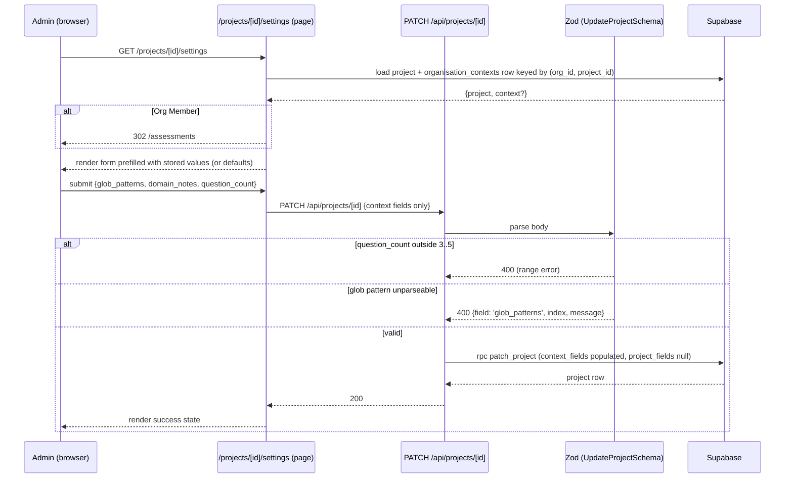
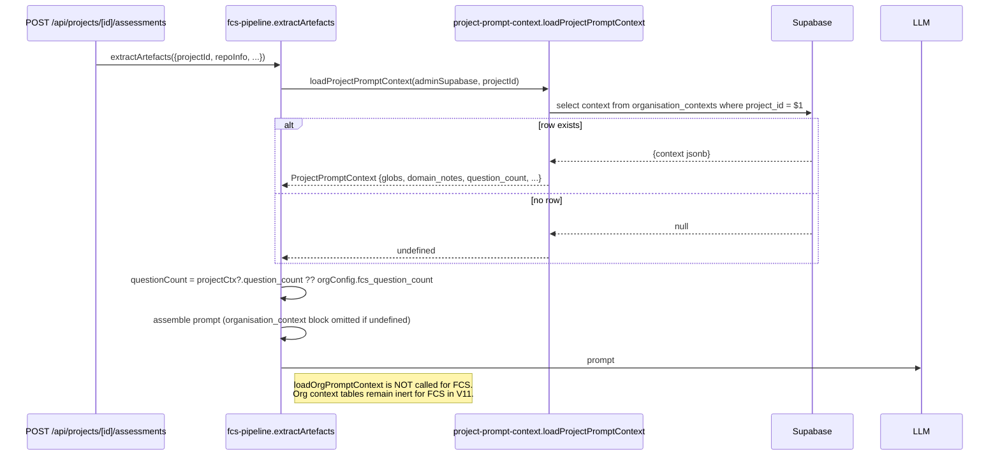
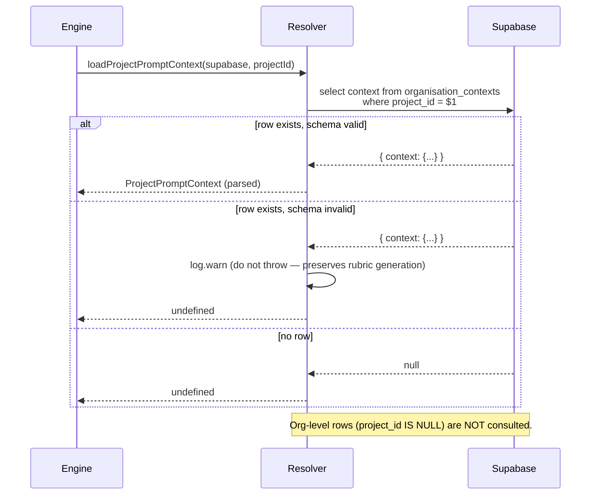
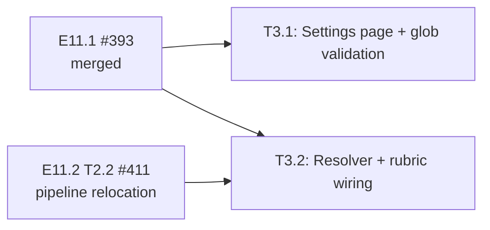

# LLD — V11 Epic E11.3: Project Context & Config

## Document Control

| Field | Value |
|-------|-------|
| Version | 0.1 |
| Status | Draft |
| Author | LS / Claude |
| Created | 2026-05-01 |
| Epic | E11.3 |
| Parent HLD | [v11-design.md §C4, §3.V11.2](v11-design.md#c4-assessment-engine--context-resolution-narrowed) |
| Implementation plan | [docs/plans/2026-04-30-v11-implementation-plan.md](../plans/2026-04-30-v11-implementation-plan.md) |
| Requirements | [v11-requirements.md §Epic 3](../requirements/v11-requirements.md#epic-3-project-context--config-priority-high) |
| Related ADRs | [0013](../adr/0013-context-file-resolution-strategy.md) (amended — no FCS fallback), [0027](../adr/0027-project-as-sub-tenant-within-org.md) (project as sub-tenant), [0028](../adr/0028-project-context-reuses-organisation-contexts.md) (reuse `organisation_contexts`) |

## Open questions

These are flagged here rather than silently decided in the body — confirm direction before `/feature` runs.

1. **Glob validator library.** `picomatch` is the most lightweight option (already transitively available via `micromatch`). `minimatch` is also transitively available. Draft uses `picomatch.makeRe(pattern)` inside a Zod `.refine()` — flip to `minimatch` if `picomatch` is not exposed at the top level after a direct `npm install picomatch`.
2. **Question count default when no project context row exists.** Story 3.1 says "system default question count". Draft: read from `org_config.fcs_question_count` (existing repo/org config column) at resolver time and fall back to `4` if absent — keeps the project-context resolver self-contained while honouring the existing org-config baseline. Alternative: hard-code `4` in the resolver. Decision affects whether the resolver depends on `org_config`.

---

## Part A — Human-reviewable

### Purpose

Move FCS rubric context from the org level to the project level, in two slices:

1. **Settings UI + validation (Story 3.1).** A single settings page at `/projects/[id]/settings` lets admins edit glob patterns, domain notes, and question count. Submits to the existing `PATCH /api/projects/[id]` endpoint (extended in E11.1 to accept these fields). Adds glob-parseability validation to that endpoint.
2. **Engine wiring (Story 3.2).** A new project-context resolver replaces `loadOrgPromptContext` on the FCS rubric path. Project context is the sole source for FCS — no org fallback. Question count comes from project context. If no project context row exists, the prompt is built without an injected context block.

Out of scope: project metadata edit on the dashboard (E11.1, already shipped); PRCC context — not changing in V11; cross-project context reuse.

### Behavioural flows

#### A.1 Edit project context & settings (Story 3.1)



#### A.2 FCS rubric uses project context (Story 3.2)



#### A.3 Resolver — empty result vs. existing row



### Structural overview

```mermaid
classDiagram
  class SettingsPage {
    /projects/[id]/settings
    server: load project + context, redirect Org Member
  }
  class SettingsForm {
    client component
    posts to PATCH /api/projects/[id]
  }
  class UpdateProjectSchema {
    Zod schema
    refines glob parseability
  }
  class PatchProjectsApi {
    PATCH /api/projects/[id]
    existing — extended only via UpdateProjectSchema refine
  }
  class ProjectPromptContext {
    type: { glob_patterns?, domain_notes?, question_count?, domain_vocabulary?, focus_areas?, exclusions? }
  }
  class loadProjectPromptContext {
    (supabase, projectId) -> ProjectPromptContext | undefined
  }
  class FcsPipeline {
    extractArtefacts (modified)
  }
  class PromptBuilder {
    formatOrganisationContext (unchanged contract)
  }
  SettingsPage --> SettingsForm
  SettingsForm --> PatchProjectsApi
  PatchProjectsApi --> UpdateProjectSchema
  FcsPipeline --> loadProjectPromptContext
  loadProjectPromptContext --> ProjectPromptContext
  FcsPipeline --> PromptBuilder
```

### Invariants

| # | Invariant | Verified by |
|---|-----------|-------------|
| I1 | `PATCH /api/projects/[id]` rejects payloads where any glob pattern fails to compile | Zod `.refine()` in `UpdateProjectSchema` (T3.1) + unit test |
| I2 | `PATCH /api/projects/[id]` rejects `question_count` outside 3..5 | Existing `z.number().int().min(3).max(5)` (E11.1) — covered by T3.1 BDD spec |
| I3 | Settings page redirects Org Members to `/assessments` | Server-side `getOrgRole` check (T3.1) |
| I4 | Settings page returns 404 for unknown / cross-org `projectId` | Server-side `select * from projects where id=$1` returns null ⇒ `notFound()` (T3.1) |
| I5 | FCS rubric generation reads project context only — `loadOrgPromptContext` is never called from the FCS path | Grep `loadOrgPromptContext` in `src/lib/engine/fcs-pipeline.ts` returns no matches (T3.2) + unit test asserting the call is `loadProjectPromptContext` |
| I6 | A project with no `organisation_contexts` row produces a rubric prompt with no `organisation_context` block | Resolver returns `undefined`; `extractArtefacts` passes `organisation_context: undefined` to the assembled set; `formatOrganisationContext` already omits the block when undefined (T3.2) |
| I7 | The question count used by rubric generation equals the project's configured value when set | Integration test asserting `assessment.config_question_count === projectCtx.question_count` after creation (T3.2) |
| I8 | The project resolver does not consult the org-level row (`project_id IS NULL`) | SQL predicate is `.eq('project_id', $1)` — not `.or()`; covered by unit test that creates an org-level row + a project row and asserts the resolver returns only the project row |
| I9 | Repo-level exempt file patterns continue to apply during context fetching | Behaviour unchanged from V1 — exempt patterns live on `repository_config` / `org_config`, applied by the file fetcher, not by the resolver. Verified by grep showing no removal of exempt-pattern handling from the file-fetch path. |

### Acceptance criteria

Maps to v11-requirements §Epic 3 ACs:

- **Story 3.1** — Save persists glob_patterns / domain_notes / question_count to `organisation_contexts` keyed by `project_id`; empty form when no row exists; out-of-range question_count returns 400; unparseable glob returns 400 identifying the pattern; Repo Admin can save; Org Member redirected.
- **Story 3.2** — FCS prompt for an assessment in project P contains content matched by P's globs and P's domain_notes verbatim; assessment has exactly `project.question_count` questions; project with no context yields a prompt with no context block and the org-context table is not queried; exempt file patterns from repo config still exclude files; the resolved context shape used at generation time matches the project's config at creation time.

### BDD specs (epic-level summary)

```
describe('PATCH /api/projects/[id] — context-fields validation (T3.1)')
  it('accepts a payload with valid glob patterns, domain_notes and question_count')
  it('rejects question_count = 2 with 400 and a range error')
  it('rejects question_count = 6 with 400 and a range error')
  it('rejects an unparseable glob pattern with 400 identifying the offending index')
  it('accepts a payload that omits all context fields (existing project-fields-only path unchanged)')

describe('/projects/[id]/settings (T3.1)')
  it('Org Admin sees the form prefilled from the existing organisation_contexts row')
  it('Project with no context row renders empty inputs and the system-default question count')
  it('Repo Admin successfully saves changes')
  it('Org Member is redirected to /assessments')
  it('Unknown projectId returns 404')

describe('loadProjectPromptContext (T3.2)')
  it('returns parsed ProjectPromptContext when a row exists for the project')
  it('returns undefined when no row exists for the project')
  it('returns undefined when the row exists but the context fails schema parse (logs warn)')
  it('does NOT return the org-level row (project_id IS NULL) when both org and project rows exist')

describe('FCS rubric — project-context wiring (T3.2)')
  it('extractArtefacts calls loadProjectPromptContext, not loadOrgPromptContext, for the FCS path')
  it('the assembled prompt contains the project domain_notes verbatim')
  it('the assembled prompt contains files matched by the project glob_patterns')
  it('a project with no context row produces an assembled set with organisation_context = undefined')
  it('the question count submitted to the LLM equals the project context question_count when set')
  it('repo-level exempt patterns still exclude files matched by project globs')
```

---

## Part B — Agent-implementable

<a id="LLD-v11-e11-3-layer-map"></a>

### B.0 Layer map

| Layer | Files |
|-------|-------|
| **DB** | none — schema already in place (`organisation_contexts.project_id` exists per [tables.sql:344](../../supabase/schemas/tables.sql), `patch_project` RPC exists per [functions.sql:405](../../supabase/schemas/functions.sql)) |
| **BE — engine** | `src/lib/engine/prompts/artefact-types.ts` (extend `OrganisationContextSchema` OR add `ProjectPromptContextSchema`), `src/lib/supabase/project-prompt-context.ts` (new), `src/lib/engine/fcs-pipeline.ts` (modify `extractArtefacts`; located here post-E11.2 T2.2) |
| **BE — API** | `src/app/api/projects/validation.ts` (extend `UpdateProjectSchema` with glob `.refine()`) |
| **FE — pages** | `src/app/(authenticated)/projects/[id]/settings/page.tsx` (server, new), `src/app/(authenticated)/projects/[id]/settings/settings-form.tsx` (client, new) |
| **Tests** | `tests/app/api/projects/[id]/validation.test.ts` (extend), `tests/app/(authenticated)/projects/[id]/settings/page.test.tsx` (new), `tests/lib/supabase/project-prompt-context.test.ts` (new), `tests/lib/engine/fcs-pipeline-project-context.test.ts` (new — integration-style with stubbed Supabase) |

#### Reused helpers — DO NOT re-implement

These helpers already exist (E11.1 / E11.2). Inlining their logic is forbidden — `/feature` agents must import from the listed paths.

| Helper | Import path | Use it instead of |
|--------|-------------|-------------------|
| `createApiContext(request)` | `@/lib/api/context` | Calling `createClient()` in route handlers. |
| `ctx.supabase` / `ctx.adminSupabase` / `ctx.orgId` | `@/lib/api/context` | Re-deriving the selected org id or constructing clients in services. |
| `validateBody(request, schema)` | `@/lib/api/validation` | Hand-rolled `await request.json()` + Zod parse. |
| `handleApiError(e)` | `@/lib/api/errors` | Hand-rolled `try/catch` returning `Response.json`. |
| `json(payload, status?)` | `@/lib/api/response` | `new Response(JSON.stringify(...))`. |
| `assertOrgAdminOrRepoAdmin(ctx, orgId)` | `@/lib/api/repo-admin-gate` | Inlining `user_organisations` queries in API code. |
| `getOrgRole(supabase, userId, orgId)` | `@/lib/supabase/membership` | Inlining `user_organisations` queries in **server pages**. Returns `'admin' | 'repo_admin' | null`. |
| `getSelectedOrgId(cookies)` | `@/lib/supabase/org-context` | Reading the `fcs-org-id` cookie directly in server pages. |
| `loadOrgPromptContext(supabase, orgId)` | `@/lib/supabase/org-prompt-context` | Reuse the **shape** (one-row select + safeParse + warn) for the new project resolver — but do NOT call this for FCS in V11 (Invariant I5). |
| `OrganisationContextSchema` / `OrganisationContext` | `@/lib/engine/prompts` | Defining a parallel schema by hand. Either extend this schema with the V11 fields, or define `ProjectPromptContextSchema` as a strict superset and re-export. |
| `formatOrganisationContext` (in `prompt-builder.ts`) | `@/lib/engine/prompts` (internal) | Writing custom prompt-block formatting. The function already omits the block when `organisation_context` is undefined — leverage that, do not modify it. |
| `patch_project` RPC | `supabase/schemas/functions.sql` | Hand-rolled UPDATE+UPSERT pair. Already merges context jsonb via `||`. |
| `UpdateProjectSchema` | `@/app/api/projects/validation` | Defining a settings-only Zod schema. Extend the existing one with a `.refine()` — same partial-payload semantics. |

> **Constraint for `/feature`:** before adding any new query against `organisation_contexts` or any new Zod schema for project fields, grep `src/lib/supabase/`, `src/app/api/projects/`, and `src/lib/engine/prompts/` for an existing helper or schema. If one exists, reuse or extend.

<a id="LLD-v11-e11-3-settings-page"></a>

### B.1 — Task T3.1: Settings page + glob parseability

**Files:**
- `src/app/(authenticated)/projects/[id]/settings/page.tsx` (new — server component)
- `src/app/(authenticated)/projects/[id]/settings/settings-form.tsx` (new — client component)
- `src/app/api/projects/validation.ts` (extend `UpdateProjectSchema` with glob `.refine()`)
- `tests/app/api/projects/[id]/validation.test.ts` (extend)
- `tests/app/(authenticated)/projects/[id]/settings/page.test.tsx` (new)

**Validation extension:**

```ts
// src/app/api/projects/validation.ts
import picomatch from 'picomatch';

function isParseableGlob(p: string): boolean {
  try { picomatch.makeRe(p); return true; } catch { return false; }
}

export const UpdateProjectSchema = z
  .object({
    name: z.string().min(1).max(200).optional(),
    description: z.string().max(2000).optional(),
    glob_patterns: z.array(z.string().min(1)).max(50).optional()
      .superRefine((arr, ctx) => {
        if (!arr) return;
        arr.forEach((p, index) => {
          if (!isParseableGlob(p)) {
            ctx.addIssue({
              code: z.ZodIssueCode.custom,
              path: [index],
              message: `glob_unparseable:${p}`,
            });
          }
        });
      }),
    domain_notes: z.string().max(2000).optional(),
    question_count: z.number().int().min(3).max(5).optional(),
  })
  .refine((o) => Object.keys(o).length > 0, { message: 'at_least_one_field' });
```

> **Why `superRefine` not `.refine`?** Need to report which pattern failed (`path: [index]`) so the form can highlight the offending field. A flat `.refine` produces a single error message without index.

**Settings page (server) sketch:**

```ts
// src/app/(authenticated)/projects/[id]/settings/page.tsx
import { notFound, redirect } from 'next/navigation';
import { createServerSupabaseClient } from '@/lib/supabase/server';
import { getOrgRole } from '@/lib/supabase/membership';
import { SettingsForm, type SettingsInitial } from './settings-form';

const DEFAULT_QUESTION_COUNT = 4;

export default async function ProjectSettingsPage({ params }: { params: Promise<{ id: string }> }) {
  const { id: projectId } = await params;
  const supabase = await createServerSupabaseClient();

  const { data: project } = await supabase
    .from('projects').select('id, org_id, name').eq('id', projectId).maybeSingle();
  if (!project) notFound();

  const { user } = (await supabase.auth.getUser()).data;
  if (!user) redirect('/auth/sign-in');

  const role = await getOrgRole(supabase, user.id, project.org_id);
  if (role === null) redirect('/assessments');

  const { data: ctxRow } = await supabase
    .from('organisation_contexts')
    .select('context')
    .eq('org_id', project.org_id)
    .eq('project_id', projectId)
    .maybeSingle();

  const context = (ctxRow?.context ?? {}) as Record<string, unknown>;
  const initial: SettingsInitial = {
    glob_patterns: Array.isArray(context.glob_patterns) ? context.glob_patterns as string[] : [],
    domain_notes: typeof context.domain_notes === 'string' ? context.domain_notes : '',
    question_count: typeof context.question_count === 'number' ? context.question_count : DEFAULT_QUESTION_COUNT,
  };

  return <SettingsForm projectId={projectId} projectName={project.name} initial={initial} />;
}
```

**Settings form (client) shape:**

```ts
// src/app/(authenticated)/projects/[id]/settings/settings-form.tsx
'use client';

export interface SettingsInitial {
  glob_patterns: string[];
  domain_notes: string;
  question_count: number;
}

interface SettingsFormProps {
  projectId: string;
  projectName: string;
  initial: SettingsInitial;
}

// Internal decomposition (each ≤ 20 lines):
//   GlobPatternList — TagInput-style add/remove, validates parseability client-side as a UX hint
//   DomainNotesField — textarea, max 2000 chars
//   QuestionCountField — number input, range 3..5
//   submit() — fetch PATCH /api/projects/${projectId} with the changed subset; on 400 surface
//              the field-level error (look at issues[].path to highlight glob index)
```

**Field-level error mapping.** When the API returns 400 with Zod issues, the form maps `issues[].path = ['glob_patterns', N]` to highlighting the Nth glob entry.

**Tasks:**
1. Extend `UpdateProjectSchema` with the glob `superRefine`; unit-test the new branches.
2. Add `picomatch` as a direct dependency (`npm install picomatch @types/picomatch`).
3. Implement the server page with the two-query load (project + context), Org-Member redirect, and 404 on unknown project.
4. Implement the client form with field-level error mapping.
5. Tests: 5 page specs + 4 validation specs (see issue body).

**Acceptance:** see issue.

<a id="LLD-v11-e11-3-resolver-and-pipeline"></a>

### B.2 — Task T3.2: Project context resolver + FCS rubric wiring

**Files:**
- `src/lib/engine/prompts/artefact-types.ts` (extend `OrganisationContextSchema` with `glob_patterns` + `question_count` fields, OR add a new `ProjectPromptContextSchema` that is a strict superset)
- `src/lib/supabase/project-prompt-context.ts` (new — mirror of `org-prompt-context.ts` shape)
- `src/lib/engine/fcs-pipeline.ts` (modify `extractArtefacts` — replace `loadOrgPromptContext` call with `loadProjectPromptContext`; route `question_count` from project context)
- `tests/lib/supabase/project-prompt-context.test.ts` (new)
- `tests/lib/engine/fcs-pipeline-project-context.test.ts` (new)

**Schema decision (pick one and apply consistently):**

Option A — extend `OrganisationContextSchema` in place. All existing fields stay optional; add `glob_patterns: z.array(z.string()).optional()` and `question_count: z.number().int().min(3).max(5).optional()`. Pro: one schema, one type, fewer downstream changes. Con: org-level rows now visibly carry fields they don't use (UI-side noise — but org context UI is FCS-inert in V11).

Option B — new `ProjectPromptContextSchema` as a strict superset. `formatOrganisationContext` widens its argument to accept the union; the assembled set's `organisation_context` field accepts the union. Pro: org-level shape unchanged. Con: two schemas to keep in sync.

**Recommended: Option A.** The org-level table is inert for FCS in V11; carrying extra optional fields costs nothing and avoids a parallel schema. PRCC (deferred) will revisit.

```ts
// src/lib/engine/prompts/artefact-types.ts (delta)
export const OrganisationContextSchema = z.object({
  domain_vocabulary: z.array(z.object({ term: z.string().min(1), definition: z.string().min(1) })).optional(),
  focus_areas:       z.array(z.string().min(1)).max(5).optional(),
  exclusions:        z.array(z.string().min(1)).max(5).optional(),
  domain_notes:      z.string().max(2000).optional(), // V11: cap raised from 500 → 2000 to match UpdateProjectSchema
  glob_patterns:     z.array(z.string().min(1)).max(50).optional(),  // V11 NEW
  question_count:    z.number().int().min(3).max(5).optional(),       // V11 NEW
});
```

> **Cap reconciliation.** Pre-V11 `domain_notes` was capped at 500 chars; `UpdateProjectSchema` (E11.1) already accepts up to 2000. Bump the schema cap to 2000 to match. Existing org-level rows are not affected (lengths are well under 2000).

**Resolver:**

```ts
// src/lib/supabase/project-prompt-context.ts (new — mirrors org-prompt-context.ts)
import type { SupabaseClient } from '@supabase/supabase-js';
import { OrganisationContextSchema } from '@/lib/engine/prompts';
import type { OrganisationContext } from '@/lib/engine/prompts';
import type { Database } from '@/lib/supabase/types';
import { logger } from '@/lib/logger';

/**
 * Loads the per-project prompt context for FCS rubric generation.
 * Returns undefined if no row exists OR the stored context fails schema parse
 * (logged at warn — never throws, so rubric generation is preserved).
 *
 * V11 ADR-0028: rows are keyed by (org_id, project_id). Org-level rows
 * (project_id IS NULL) are NOT consulted for FCS — see HLD §C4.
 */
export async function loadProjectPromptContext(
  supabase: SupabaseClient<Database>,
  projectId: string,
): Promise<OrganisationContext | undefined> {
  const { data, error } = await supabase
    .from('organisation_contexts')
    .select('context')
    .eq('project_id', projectId)
    .maybeSingle();

  if (error) throw new Error(`loadProjectPromptContext: ${error.message}`);
  if (!data) return undefined;

  const parsed = OrganisationContextSchema.safeParse(data.context);
  if (!parsed.success) {
    logger.warn({ projectId, issues: parsed.error.issues }, 'loadProjectPromptContext: invalid context shape, skipping');
    return undefined;
  }
  return parsed.data;
}
```

**Pipeline modification.** In `src/lib/engine/fcs-pipeline.ts` (post-E11.2 T2.2), change the relevant `Promise.all` block in `extractArtefacts`:

```ts
// BEFORE (current shape, in api/fcs/service.ts pre-T2.2 OR fcs-pipeline.ts post-T2.2)
const [raw, issueContent, organisation_context, settings] = await Promise.all([
  ...,
  loadOrgPromptContext(adminSupabase, repoInfo.orgId),   // ← V11 FCS removes this
  loadOrgRetrievalSettings(adminSupabase, repoInfo.orgId),
]);

// AFTER (V11)
const [raw, issueContent, organisation_context, settings] = await Promise.all([
  ...,
  loadProjectPromptContext(adminSupabase, projectId),    // ← project-scoped
  loadOrgRetrievalSettings(adminSupabase, repoInfo.orgId),
]);
```

**Question-count routing.** `extractArtefacts` currently uses `repoInfo.questionCount` (from `org_config` / `repository_config`) for `buildTruncationOptions` and downstream prompt sizing. V11 must prefer the project's value:

```ts
const projectQuestionCount = organisation_context?.question_count;
const effectiveQuestionCount = projectQuestionCount ?? repoInfo.questionCount;
const opts = buildTruncationOptions(contextLimit, effectiveQuestionCount, settings.tool_use_enabled);
// ...assembled.question_count is set by truncateArtefacts using opts; verify it propagates.
```

> The branded type `AssembledArtefactSet` already has `question_count: z.number().int().min(3).max(5)`. The propagation point is whatever currently passes `repoInfo.questionCount` to the assembled set — replace with `effectiveQuestionCount`.

**Caller signature change.** `extractArtefacts` already receives the assessment row; add `projectId` to the params (it is non-null by Invariant I1 from E11.2 T2.1). The caller (`triggerRubricGeneration` / `retriggerRubricForAssessment`) already has the assessment row, so reading `assessment.project_id` is a one-line addition.

**No persistence change.** The `assessments.config_question_count` column already records the question count used at creation time — already captured by E11.2's `create_fcs_assessment` RPC. Story 3.2 AC 5 ("resolved context used at generation time matches the project's configuration at the time of creation") is satisfied because the project context jsonb is read once, at extraction time, and the question_count is persisted to `assessments.config_question_count`. No new column needed for the snapshot of globs / domain_notes — the prompt itself is the audit trail (already logged via the existing rubric observability fields).

**Tasks:**
1. Extend `OrganisationContextSchema` (Option A) and re-export; raise `domain_notes` cap to 2000.
2. Implement `loadProjectPromptContext`; mirror `loadOrgPromptContext` shape.
3. Modify `extractArtefacts` in `fcs-pipeline.ts`: swap the resolver call; route `question_count` through.
4. Delete the FCS-side import of `loadOrgPromptContext` (the helper itself stays — `org-context-form.tsx` still uses it for the org-level UI; do not delete `loadOrgPromptContext`).
5. Tests: 4 resolver unit specs + 6 pipeline integration specs (see issue body).

**Acceptance:** see issue.

<a id="LLD-v11-e11-3-cross-cutting"></a>

### B.3 Cross-cutting

- **Internal decomposition (CLAUDE.md):** every new function ≤ 20 lines; route handlers ≤ 25 lines; nesting ≤ 3 levels.
- **No new ADR.** Decisions are covered by ADR-0027 (sub-tenant), ADR-0028 (reuse `organisation_contexts`), and the V11 HLD §C4 amendment to ADR-0013 (no FCS fallback). The Option A schema-extension decision is local to T3.2 and pinned in §B.2 above.
- **No new infrastructure.** No new tables, columns, RPCs, or env vars.
- **British English** throughout.
- **No silent catch.** The resolver logs warn + returns undefined on parse failure (preserves rubric generation per existing `loadOrgPromptContext` precedent).
- **PRCC unaffected.** PRCC rubric generation does not pass through the FCS path; `loadOrgPromptContext` remains for any future PRCC reuse and for the existing org-context UI (`/organisation` page).

<a id="LLD-v11-e11-3-out-of-scope"></a>

### B.4 Out-of-scope reminders

- Project metadata edit (name / description) — already shipped in E11.1.
- Settings page navigation entry — out (the settings link from the dashboard is an E11.4 concern; reachable via direct URL in the meantime).
- Org-context UI removal — out (`/organisation` org-context form still works; org-level rows are inert for FCS but still readable / editable for future PRCC).
- Copy context from another project — explicitly out per requirements §"What We Are NOT Building".

---

## Cross-References

### Internal (within this LLD)

- §B.2 (resolver + pipeline) is independent of §B.1 (settings page) at the file level — they touch disjoint paths.
- Both depend on §B.0 helper inventory.

### External

- **Depends on:** [lld-v11-e11-1-project-management.md](lld-v11-e11-1-project-management.md) — `projects` table, `organisation_contexts.project_id` FK, `patch_project` RPC, `UpdateProjectSchema` (extended here, not replaced), `getOrgRole` page-side helper.
- **Depends on (T3.2 only):** [lld-v11-e11-2-fcs-scoped-to-projects.md §B.2](lld-v11-e11-2-fcs-scoped-to-projects.md#LLD-v11-e11-2-fcs-create-api) — the rubric pipeline relocation to `src/lib/engine/fcs-pipeline.ts` (#411). T3.2 must merge after #411.
- **Depended on by:** none in V11. PRCC project scoping (deferred) will likely reuse `loadProjectPromptContext`.

### Shared types

- `OrganisationContext` (extended in T3.2 with `glob_patterns` and `question_count`) — consumed by `formatOrganisationContext` in `prompt-builder.ts` (no consumer change needed; new fields are optional and currently unread by the formatter — formatter extension is out of scope for V11 and tracked separately if/when domain_notes / globs need richer prompt formatting).

---

## Tasks

> **Note.** Task entries below pair with issues minted by `/architect`. The issue body is the runtime source of truth for `/feature`; this block is the design-time snapshot. Mid-flight changes go to the issue and are folded back in by `/lld-sync` at feature completion.

### Task T3.1: Project settings page + glob parseability validation

**Issue:** *(minted by `/architect`)*
**Issue title:** E11.3 T3.1 — `/projects/[id]/settings` page + glob parseability validation
**Layer:** FE + BE (validation)
**Depends on:** E11.1 (#393, merged)
**Stories:** 3.1
**HLD reference:** [v11-design.md §C4](v11-design.md#c4-assessment-engine--context-resolution-narrowed)
**LLD section:** [§B.1](#LLD-v11-e11-3-settings-page)

**What:**
1. Extend `UpdateProjectSchema` in `src/app/api/projects/validation.ts` with a `superRefine` on `glob_patterns` that calls `picomatch.makeRe(p)` and emits `code: 'custom', path: [index], message: 'glob_unparseable:<pattern>'` on failure.
2. Add `picomatch` + `@types/picomatch` as direct deps.
3. New server page `src/app/(authenticated)/projects/[id]/settings/page.tsx` — load project + existing context row in two queries, redirect Org Member to `/assessments`, 404 on unknown project.
4. New client form `src/app/(authenticated)/projects/[id]/settings/settings-form.tsx` — fields: glob_patterns (TagInput-style), domain_notes (textarea, max 2000), question_count (number 3..5). Submits PATCH with the changed subset. Maps 400 issues with `path: ['glob_patterns', N]` to per-row error display.
5. Tests: 5 page specs + 4 validation specs.

**Acceptance:**
- [ ] `UpdateProjectSchema` rejects `{ glob_patterns: ['['] }` with a 400 carrying `issues[0].path = ['glob_patterns', 0]`.
- [ ] `UpdateProjectSchema` accepts `{ glob_patterns: ['docs/adr/*.md', '**/*.ts'] }`.
- [ ] `GET /projects/[id]/settings` as Org Admin renders the form prefilled from the existing row.
- [ ] `GET /projects/[id]/settings` as Org Member redirects to `/assessments`.
- [ ] `GET /projects/[id]/settings` for unknown project returns 404.
- [ ] Saving from the form posts `PATCH /api/projects/[id]` with only the changed subset and shows a success state on 200.

**BDD specs:**
```
describe('PATCH /api/projects/[id] — context-fields validation')
  it('accepts a payload with valid glob patterns, domain_notes and question_count')
  it('rejects question_count = 2 with 400 and a range error')
  it('rejects an unparseable glob pattern with 400 identifying the offending index')
  it('accepts a payload that omits all context fields')

describe('/projects/[id]/settings')
  it('Org Admin sees the form prefilled from the existing organisation_contexts row')
  it('Project with no context row renders empty inputs and the system-default question count')
  it('Repo Admin successfully saves changes')
  it('Org Member is redirected to /assessments')
  it('Unknown projectId returns 404')
```

**Files:**
- `src/app/api/projects/validation.ts` (extend)
- `src/app/(authenticated)/projects/[id]/settings/page.tsx` (new)
- `src/app/(authenticated)/projects/[id]/settings/settings-form.tsx` (new)
- `package.json` (+ `picomatch`, `@types/picomatch`)
- `tests/app/api/projects/[id]/validation.test.ts` (extend)
- `tests/app/(authenticated)/projects/[id]/settings/page.test.tsx` (new)

---

### Task T3.2: Project context resolver + FCS rubric wiring

**Issue:** *(minted by `/architect`)*
**Issue title:** E11.3 T3.2 — `loadProjectPromptContext` + FCS pipeline reads project context
**Layer:** BE (engine)
**Depends on:** E11.1 (#393, merged), **E11.2 T2.2 (#411 — rubric pipeline relocation)**
**Stories:** 3.2
**HLD reference:** [v11-design.md §C4, §3.V11.2](v11-design.md#3v112-project-context-resolution-at-rubric-generation-story-32)
**LLD section:** [§B.2](#LLD-v11-e11-3-resolver-and-pipeline)

**What:**
1. Extend `OrganisationContextSchema` in `src/lib/engine/prompts/artefact-types.ts` with optional `glob_patterns` and `question_count`; raise `domain_notes` cap from 500 to 2000.
2. New `src/lib/supabase/project-prompt-context.ts` exporting `loadProjectPromptContext(supabase, projectId): Promise<OrganisationContext | undefined>` — predicate `.eq('project_id', $1)`, `safeParse` → warn-and-undefined on failure (mirrors `loadOrgPromptContext`).
3. Modify `extractArtefacts` in `src/lib/engine/fcs-pipeline.ts`:
   - add `projectId: string` to its params (caller already has it from `assessments.project_id`)
   - replace the `loadOrgPromptContext(adminSupabase, repoInfo.orgId)` call with `loadProjectPromptContext(adminSupabase, projectId)`
   - compute `effectiveQuestionCount = organisation_context?.question_count ?? repoInfo.questionCount` and pass that to `buildTruncationOptions` and the assembled set
4. Update both call sites (`triggerRubricGeneration`, `retriggerRubricForAssessment`) to pass `projectId` (non-null by Invariant I1 from T2.1).
5. **Do not** delete `loadOrgPromptContext` — it is still consumed by `src/app/(authenticated)/organisation/page.tsx` for the org-level UI.
6. Tests: 4 resolver specs + 6 pipeline specs.

**Acceptance:**
- [ ] `loadProjectPromptContext` returns the parsed `OrganisationContext` when a row exists.
- [ ] `loadProjectPromptContext` returns `undefined` when no row exists.
- [ ] `loadProjectPromptContext` returns `undefined` and logs warn when the row exists but parse fails.
- [ ] `loadProjectPromptContext` does NOT return the org-level row (`project_id IS NULL`) when both org and project rows exist.
- [ ] Grep `loadOrgPromptContext` against `src/lib/engine/fcs-pipeline.ts` returns zero matches.
- [ ] Grep `loadOrgPromptContext` against `src/app/(authenticated)/organisation/` still returns matches (helper retained for org UI).
- [ ] An FCS assessment created in a project with `question_count = 5` produces exactly 5 generated questions.
- [ ] An FCS assessment created in a project with no context row produces a prompt where the `organisation_context` block is omitted.

**BDD specs:**
```
describe('loadProjectPromptContext')
  it('returns parsed ProjectPromptContext when a row exists for the project')
  it('returns undefined when no row exists for the project')
  it('returns undefined when the row exists but the context fails schema parse (logs warn)')
  it('does NOT return the org-level row (project_id IS NULL) when both org and project rows exist')

describe('FCS rubric — project-context wiring')
  it('extractArtefacts calls loadProjectPromptContext, not loadOrgPromptContext, for the FCS path')
  it('the assembled prompt contains the project domain_notes verbatim')
  it('the assembled prompt contains files matched by the project glob_patterns')
  it('a project with no context row produces an assembled set with organisation_context = undefined')
  it('the question count submitted to the LLM equals the project context question_count when set')
  it('repo-level exempt patterns still exclude files matched by project globs')
```

**Files:**
- `src/lib/engine/prompts/artefact-types.ts` (extend `OrganisationContextSchema`)
- `src/lib/engine/prompts/index.ts` (re-export delta if needed)
- `src/lib/supabase/project-prompt-context.ts` (new)
- `src/lib/engine/fcs-pipeline.ts` (modify `extractArtefacts` + caller signatures)
- `tests/lib/supabase/project-prompt-context.test.ts` (new)
- `tests/lib/engine/fcs-pipeline-project-context.test.ts` (new)

---

## Execution Order

### Dependency DAG



### Execution Waves

| Wave | Tasks | Blocked by | Notes |
|------|-------|------------|-------|
| 1 | T3.1 | E11.1 (merged) | Fully parallel-safe with all of E11.2 and E11.4. |
| 2 | T3.2 | E11.1 (merged) + E11.2 T2.2 (#411) | Modifies `extractArtefacts`, which #411 relocates. Must follow #411. |

### Refinement vs. plan parallelisation map

The plan ([2026-04-30-v11-implementation-plan.md §Parallelisation Map](../plans/2026-04-30-v11-implementation-plan.md#parallelisation-map)) marks **E11.2 ↔ E11.3 as parallel-safe** based on disjoint Owns. File-level analysis refines this:

- **T3.1 ↔ all of E11.2:** parallel-safe (disjoint files — settings page lives under `src/app/(authenticated)/projects/[id]/settings/`, untouched by E11.2; validation extension touches `validation.ts`, untouched by E11.2).
- **T3.2 ↔ E11.2 T2.2 (#411):** **conflicting** — both modify the rubric pipeline's `extractArtefacts`. T3.2 must wait for #411 to merge.
- **T3.2 ↔ all other E11.2 tasks (#410, #412–#415):** parallel-safe.

Recommended plan patch: change the E11.2 ↔ E11.3 edge in the parallelisation map from `parallel-safe` to `coordinate rubric pipeline ownership — T3.2 follows T2.2`.
