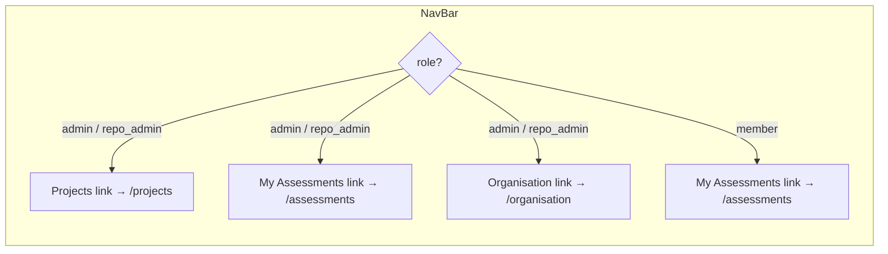
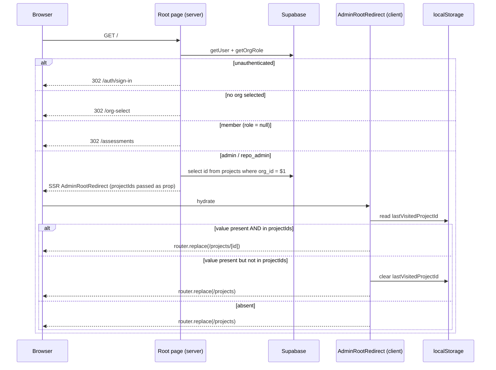
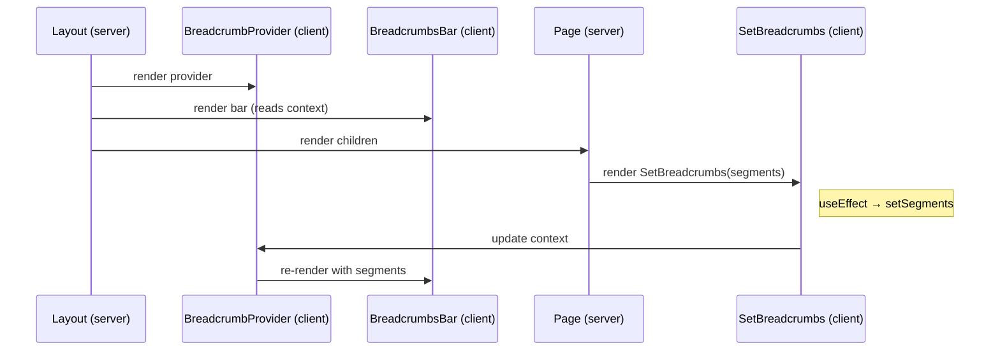
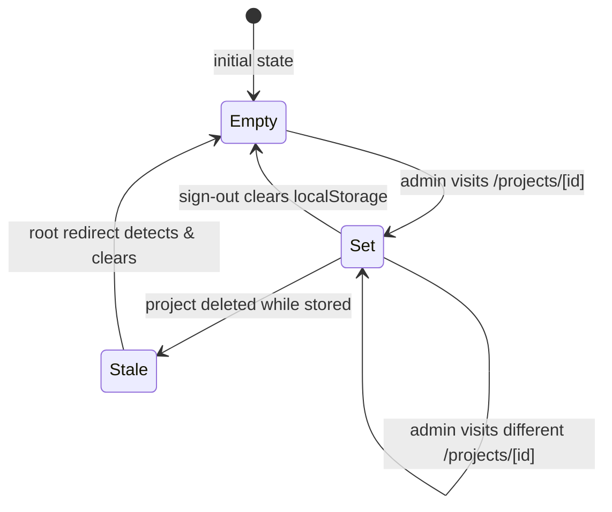
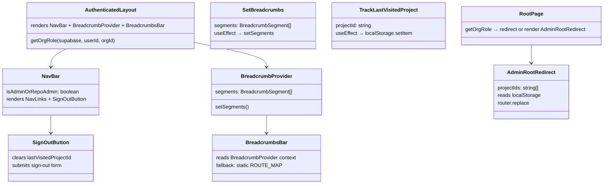
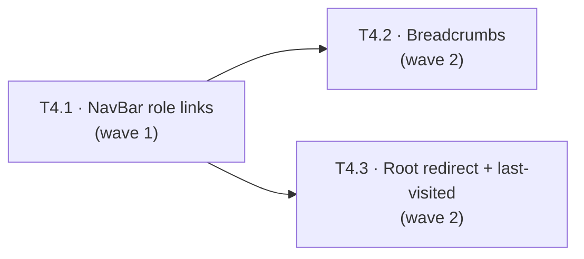

# LLD — V11 Epic E11.4: Navigation & Routing

**Date:** 2026-05-02
**Version:** 0.3
**Status:** Revised (T4.1 implemented — issue #432; T4.2 implemented — issue #433)
**Epic:** E11.4
**HLD:** [v11-design.md §C1, §Level 3 — 3.V11.3](v11-design.md)
**Requirements:** [v11-requirements.md §Epic 4](../requirements/v11-requirements.md#epic-4-navigation--routing-priority-high)
**Related ADRs:** [0029](../adr/0029-repo-admin-permission-runtime-derived.md) (sign-in snapshot for role derivation)

---

## Part A — Human-reviewable

### Purpose

Wire the application shell — NavBar, breadcrumbs, root redirect, and last-visited project persistence — to the project-first model established by E11.1–E11.3. After this epic:

1. Admins see "Projects", "My Assessments", and "Organisation" links in the NavBar and land on `/projects` (or their last-visited project) at sign-in.
2. Org Members see "My Assessments" only and land on `/assessments`.
3. Project-scoped pages show contextual breadcrumbs (admin-only).
4. Last-visited project is tracked in `localStorage` and cleared on sign-out.

Out of scope: project CRUD (E11.1), FCS scoping (E11.2), context config (E11.3).

#### Recent revisions

- **Rev 2 (2026-05-03):** v11-requirements rev 1.3 extended Story 4.3 to enumerate every project-scoped admin URL. Issue [#446](https://github.com/mironyx/feature-comprehension-score/issues/446) shipped breadcrumbs for `/results` and `/submitted`; the new-assessment page (`/projects/[id]/assessments/new`) is still missing them. New design covered in [§Pending changes — Rev 2](#pending-changes-rev-2).

### Behavioural flows

#### A.1 NavBar role-conditional links (Story 4.1)



The NavBar receives an `isAdminOrRepoAdmin` boolean from the authenticated layout. When `true`, it renders "Projects", "My Assessments", and "Organisation" links. When `false`, it renders "My Assessments" only. The FCS logo links to `/projects` for admins, `/assessments` for members. Both roles see "My Assessments" — admins are also assessment participants and need access to the cross-project pending queue.

#### A.2 Root redirect (Stories 4.4, 4.6)

Reproduces [v11-design.md §3.V11.3](v11-design.md) with implementation detail.



**Key design choice:** The root page is a server component that resolves the role and pre-fetches the org's project IDs. For admins, it renders a client component (`AdminRootRedirect`) that reads `localStorage` and performs a single client-side redirect. This avoids a double redirect (root → /projects → /projects/[id]) while keeping localStorage access on the client.

#### A.3 Breadcrumbs (Story 4.3)



A `BreadcrumbProvider` context lives in the authenticated layout. Server-rendered project pages include a `<SetBreadcrumbs segments={[...]} />` client component that registers breadcrumb segments via context. The `BreadcrumbsBar` reads from context first; if empty, it falls back to the existing static `ROUTE_MAP` for non-project routes (`/assessments`, `/organisation`).

**Admin-only:** Project pages only render `<SetBreadcrumbs>` when the user has admin/repo_admin role (already known from the page's access guard). Members see no breadcrumbs on project-scoped pages.

#### A.4 Last-visited project lifecycle (Story 4.6)



- **Write:** A `<TrackLastVisitedProject projectId={id} />` client component on the project dashboard writes to `localStorage` on mount.
- **Clear:** A `<SignOutButton />` client component wraps the existing sign-out form, clearing `lastVisitedProjectId` before form submission.
- **Read:** The `AdminRootRedirect` component reads the stored value and validates it against the pre-fetched project ID list.

### Structural overview



### Invariants

| # | Invariant | Verified by |
|---|-----------|-------------|
| I1 | Admins (Org Admin + Repo Admin) see "Projects", "My Assessments", and "Organisation" links; Org Members see "My Assessments" only | BDD spec + visual test (T4.1) |
| I2 | FCS logo links to `/projects` for admins, `/assessments` for members | BDD spec (T4.1) |
| I3 | `BreadcrumbsBar` renders segments from context when available, falls back to static map otherwise | BDD spec (T4.2) |
| I4 | Members see no breadcrumbs on the assessment detail page (the only project-scoped route they can reach, via invitation link) | BDD spec — page does not render `SetBreadcrumbs` when role is null (T4.2) |
| I5 | Root redirect: admin with valid last-visited → `/projects/[id]`; admin without → `/projects`; member → `/assessments` | BDD spec (T4.3) |
| I6 | Stale `lastVisitedProjectId` (deleted project) is cleared and admin is redirected to `/projects` | BDD spec (T4.3) |
| I7 | Sign-out clears `lastVisitedProjectId` from `localStorage` | BDD spec (T4.3) |
| I8 | Legacy `/assessments/[aid]` returns 404 (no route exists) | Verified by absence of route file (T4.3) |

### Acceptance criteria

Maps to v11-requirements §Epic 4 ACs. Story-level coverage:

- **Story 4.1** — NavBar shows "Projects", "My Assessments", and "Organisation" for admins (including Repo Admins). Members see "My Assessments" only. FCS logo href is role-conditional.
- **Story 4.2** — Already done (E11.1 T1.5). Verified in T4.1 BDD specs.
- **Story 4.3** — Breadcrumbs on `/projects/[id]` show `Projects > [Name]`; on `/projects/[id]/settings` show `Projects > [Name] > Settings`; on `/projects/[id]/assessments/[aid]` show `Projects > [Name] > Assessment`. No breadcrumbs for members on project routes.
- **Story 4.4** — Root `/` redirects: admin with last-visited → project dashboard; admin without → `/projects`; member → `/assessments`.
- **Story 4.5** — Already done (E11.2). Deep-links work; `pid`/`aid` mismatch → 404; legacy `/assessments/[aid]` → 404.
- **Story 4.6** — `lastVisitedProjectId` written on project dashboard visit; cleared on sign-out; stale values detected and cleared at root redirect.

### BDD specs

```
describe('NavBar role-conditional links')
  it('Org Admin sees Projects + My Assessments + Organisation links')
  it('Repo Admin sees Projects + My Assessments + Organisation links')
  it('Org Member sees My Assessments link only, no Projects or Organisation')
  it('FCS logo links to /projects for admin')
  it('FCS logo links to /assessments for member')

describe('BreadcrumbsBar — project-scoped routes')
  it('/projects/[id] shows Projects > [Project Name]')
  it('/projects/[id]/settings shows Projects > [Project Name] > Settings')
  it('/projects/[id]/assessments/[aid] shows Projects > [Project Name] > Assessment')
  it('Projects breadcrumb segment links to /projects')
  it('Project name breadcrumb segment links to /projects/[id]')
  it('Member on /projects/[id]/assessments/[aid] sees no breadcrumbs')
  it('Static routes (/assessments, /organisation) still use ROUTE_MAP fallback')

describe('Root redirect')
  it('Unauthenticated visitor redirected to /auth/sign-in')
  it('Admin with lastVisitedProjectId matching an active project redirected to /projects/[id]')
  it('Admin with no lastVisitedProjectId redirected to /projects')
  it('Admin with stale lastVisitedProjectId (deleted project) — value cleared, redirected to /projects')
  it('Member redirected to /assessments regardless of localStorage')

describe('Last-visited project')
  it('Visiting /projects/[id] writes lastVisitedProjectId to localStorage')
  it('Sign-out clears lastVisitedProjectId from localStorage')
  it('Different browser/device has no lastVisitedProjectId — fallback to /projects')

describe('Deep-link compatibility')
  it('Legacy /assessments/[aid] returns 404')
  it('/projects/[pid]/assessments/[aid] where aid does not belong to pid returns 404')
```

---

## Part B — Agent-implementable

### B.0 Reused helpers — DO NOT re-implement

| Symbol | Path | Used in |
|---|---|---|
| `getOrgRole(supabase, userId, orgId)` | `@/lib/supabase/membership` | Layout role derivation (T4.1), root page (T4.3) |
| `isAdminOrRepoAdmin(supabase, userId, orgId)` | `@/lib/supabase/membership` | Existing page guards — unchanged |
| `getSelectedOrgId(cookies)` | `@/lib/supabase/org-context` | Root page (T4.3), layout |
| `createServerSupabaseClient()` | `@/lib/supabase/server` | Root page, layout — existing usage |
| `BreadcrumbSegment` | `@/components/ui/breadcrumbs` | Context type, SetBreadcrumbs prop |
| `Breadcrumbs` | `@/components/ui/breadcrumbs` | Rendered by BreadcrumbsBar — unchanged |

<a id="LLD-v11-e11-4-navbar-role-links"></a>

### B.1 — Task T4.1: NavBar role-conditional links

**Stories:** 4.1, 4.2 (verification only)

**Files:**

- `src/app/(authenticated)/layout.tsx` — change `isAdmin` derivation to use `getOrgRole`; pass role-aware boolean to NavBar
- `src/components/nav-bar.tsx` — add "Projects" link for admins; make logo href role-conditional; replace sign-out form with `<SignOutButton />`
- `src/components/mobile-nav-menu.tsx` — same NavBar link changes for mobile panel; replace sign-out form with `<SignOutButton />`
- `tests/components/nav-bar.test.ts`

**Layout change:**

Current layout derives `isAdmin` from `github_role === 'admin'`, which misses Repo Admins:

```ts
// Current (wrong for V11)
const membership = memberships.find((m) => m.org_id === orgId);
const isAdmin = membership?.github_role === 'admin';
```

Replace with `getOrgRole` from the membership kernel module:

```ts
import { getOrgRole } from '@/lib/supabase/membership';

const role = await getOrgRole(supabase, user.id, orgId);
const isAdminOrRepoAdmin = role !== null;
```

Pass `isAdminOrRepoAdmin` to `NavBar` instead of `isAdmin`. The layout already queries `user_organisations` for the org switcher memberships — `getOrgRole` performs a separate lightweight query via `readMembershipSnapshot`. This is acceptable (two small DB reads) and avoids coupling the org-switcher query shape to the role-derivation logic.

> **Implementation note (issue #432):** The two reads run concurrently via `Promise.all([fetchOrgContext, getOrgRole])`. The org-switcher query was also slimmed from `select('org_id, github_role')` to `select('org_id')` because `github_role` is no longer consumed by the layout — role derivation now flows entirely through `getOrgRole`. The `MembershipRow` type alias was deleted as a consequence.

**NavBar change:**

```ts
// New link definitions
const PROJECTS_LINK: NavLink = {
  href: '/projects',
  label: 'Projects',
  matchPrefix: '/projects',
};

const MEMBER_ASSESSMENTS_LINK: NavLink = {
  href: '/assessments',
  label: 'My Assessments',
  matchPrefix: '/assessments',
};

const ADMIN_ASSESSMENTS_LINK: NavLink = {
  href: '/assessments',
  label: 'My Assessments',
  matchPrefix: '/assessments',
};

// Link assembly
const links: NavLink[] = isAdminOrRepoAdmin
  ? [PROJECTS_LINK, ADMIN_ASSESSMENTS_LINK, ORGANISATION_LINK]
  : [MEMBER_ASSESSMENTS_LINK];
```

Logo `href` changes from `/assessments` to `isAdminOrRepoAdmin ? '/projects' : '/assessments'`.

**SignOutButton extraction:** The inline `<form method="POST" action="/auth/sign-out">` in both `nav-bar.tsx` and `mobile-nav-menu.tsx` is replaced with a `<SignOutButton />` client component. This component clears `lastVisitedProjectId` from `localStorage` before form submission (Story 4.6 dependency — T4.3 uses this). File: `src/components/sign-out-button.tsx`.

```ts
// src/components/sign-out-button.tsx
'use client';

import { clearLastVisitedProject } from '@/lib/last-visited-project';

export function SignOutButton() {
  return (
    <form
      method="POST"
      action="/auth/sign-out"
      onSubmit={() => clearLastVisitedProject()}
    >
      <button type="submit" className="text-label text-text-secondary hover:text-accent">
        Sign out
      </button>
    </form>
  );
}
```

> **Note:** `clearLastVisitedProject` is defined in T4.3 (§B.3). T4.1 creates the `SignOutButton` component shell with an empty `clearLastVisitedProject` stub (or imports from the shared module if T4.3 lands first). Either way, T4.1 and T4.3 are in different waves, so this is handled by wave sequencing: T4.1 creates the `SignOutButton` with the localStorage clear; the `last-visited-project` module is co-created in T4.1 since it is small (~10 lines) and the `SignOutButton` needs it.

**Prop rename:** `NavBarProps.isAdmin` → `NavBarProps.isAdminOrRepoAdmin`. Update both `NavBar` and `MobileNavMenu` props.

**Tasks:**
1. Create `src/lib/last-visited-project.ts` with `setLastVisitedProject`, `getLastVisitedProject`, `clearLastVisitedProject`.
2. Create `src/components/sign-out-button.tsx`.
3. Update `layout.tsx` — switch to `getOrgRole`, pass `isAdminOrRepoAdmin`.
4. Update `nav-bar.tsx` — add Projects link, role-conditional logo, use `SignOutButton`.
5. Update `mobile-nav-menu.tsx` — same changes.
6. Tests verifying link assembly for admin, repo_admin, and member roles.

**Acceptance:** All NavBar BDD specs pass. Story 4.2 verified (redirect already exists from E11.1).

> **Implementation note (issue #432):** `last-visited-project.ts` also exports the storage key string as `LAST_VISITED_PROJECT_KEY` (alongside the three helpers) so that tests and any cross-module reader can target the same key without re-typing the literal. The exported value matches the internal `STORAGE_KEY` constant declared in §B.3 (`'fcs:lastVisitedProjectId'`).

<a id="LLD-v11-e11-4-breadcrumbs"></a>

### B.2 — Task T4.2: Breadcrumbs for project-scoped routes

**Stories:** 4.3

**Files:**

- `src/components/breadcrumb-provider.tsx` — new: React context for dynamic breadcrumb segments
- `src/components/set-breadcrumbs.tsx` — new: effectful client component that registers segments
- `src/components/breadcrumbs-bar.tsx` — modify: read from context, fall back to static map
- `src/app/(authenticated)/layout.tsx` — wrap children with `<BreadcrumbProvider>`
- `src/app/(authenticated)/projects/[id]/page.tsx` — add `<SetBreadcrumbs>` for admin
- `src/app/(authenticated)/projects/[id]/settings/page.tsx` — add `<SetBreadcrumbs>` for admin
- `src/app/(authenticated)/projects/[id]/assessments/[aid]/page.tsx` — add `<SetBreadcrumbs>` for admin
- `tests/components/breadcrumbs-bar.test.ts`

**BreadcrumbProvider:**

```ts
// src/components/breadcrumb-provider.tsx
'use client';

import { createContext, useContext, useState, type ReactNode } from 'react';
import type { BreadcrumbSegment } from '@/components/ui/breadcrumbs';

interface BreadcrumbContextValue {
  readonly segments: BreadcrumbSegment[];
  readonly setSegments: (segments: BreadcrumbSegment[]) => void;
}

const BreadcrumbContext = createContext<BreadcrumbContextValue>({
  segments: [],
  setSegments: () => {},
});

export function BreadcrumbProvider({ children }: { readonly children: ReactNode }) {
  const [segments, setSegments] = useState<BreadcrumbSegment[]>([]);
  return (
    <BreadcrumbContext.Provider value={{ segments, setSegments }}>
      {children}
    </BreadcrumbContext.Provider>
  );
}

export function useBreadcrumbSegments() {
  return useContext(BreadcrumbContext);
}
```

**SetBreadcrumbs:**

```ts
// src/components/set-breadcrumbs.tsx
'use client';

import { useEffect } from 'react';
import { useBreadcrumbSegments } from '@/components/breadcrumb-provider';
import type { BreadcrumbSegment } from '@/components/ui/breadcrumbs';

interface SetBreadcrumbsProps {
  readonly segments: BreadcrumbSegment[];
}

export function SetBreadcrumbs({ segments }: SetBreadcrumbsProps) {
  const { setSegments } = useBreadcrumbSegments();
  useEffect(() => {
    setSegments(segments);
    return () => setSegments([]);
  }, [JSON.stringify(segments), setSegments]);
  return null;
}
```

> The `JSON.stringify` dependency avoids infinite re-render loops when the parent passes a new array reference on each render. The segments array is small and stable per page.

**BreadcrumbsBar modification:**

```ts
export function BreadcrumbsBar() {
  const pathname = usePathname();
  const { segments: contextSegments } = useBreadcrumbSegments();

  const segments = contextSegments.length > 0
    ? contextSegments
    : ROUTE_MAP[pathname];

  if (!segments) return null;
  return (
    <div className="mx-auto w-full max-w-page px-content-pad-sm md:px-content-pad pt-4">
      <Breadcrumbs segments={segments} />
    </div>
  );
}
```

**Page integration pattern:**

Each project page that needs breadcrumbs adds `<SetBreadcrumbs>` conditionally:

```tsx
// In projects/[id]/page.tsx (admin path)
{role && (
  <SetBreadcrumbs segments={[
    { label: 'Projects', href: '/projects' },
    { label: project.name },
  ]} />
)}
```

```tsx
// In projects/[id]/settings/page.tsx (admin-only page)
<SetBreadcrumbs segments={[
  { label: 'Projects', href: '/projects' },
  { label: project.name, href: `/projects/${id}` },
  { label: 'Settings' },
]} />
```

```tsx
// In projects/[id]/assessments/[aid]/page.tsx (admin path)
{detail.caller_role === 'admin' && (
  <SetBreadcrumbs segments={[
    { label: 'Projects', href: '/projects' },
    { label: projectName, href: `/projects/${projectId}` },
    { label: 'Assessment' },
  ]} />
)}
```

Members on project-scoped assessment pages (reached via invitation link) do not render `<SetBreadcrumbs>`, so no breadcrumbs appear — satisfying I4.

> **Implementation note (issue #433):** The admin path was extracted into a `renderAdminView(supabase, projectId, detail)` helper that performs a small `from('projects').select('name').eq('id', projectId).maybeSingle()` query before rendering. The `projectName` placeholder above resolves to `project?.name ?? 'Project'` — a graceful fallback if the row is not accessible (e.g. RLS race). The fetch is lazy: it only runs on the admin branch, so the member fast path pays no extra round-trip. The same commit also moved `supabase.auth.getUser()` above the existing assessments existence query so the row read happens with a confirmed session, not just RLS gating.

**Layout change:** Wrap `{children}` with `<BreadcrumbProvider>`:

```tsx
<BreadcrumbProvider>
  <BreadcrumbsBar />
  <main ...>{children}</main>
</BreadcrumbProvider>
```

> The `<BreadcrumbsBar />` must be inside the provider to access context.

**Tasks:**
1. Create `breadcrumb-provider.tsx` and `set-breadcrumbs.tsx`.
2. Modify `breadcrumbs-bar.tsx` to read from context with static map fallback.
3. Wrap `layout.tsx` children with `<BreadcrumbProvider>`.
4. Add `<SetBreadcrumbs>` to project dashboard, settings, and assessment detail pages.
5. Tests covering context-based rendering, static fallback, and admin-only guard.

**Acceptance:** All breadcrumb BDD specs pass. Static routes unchanged. Members see no breadcrumbs on project routes.

<a id="LLD-v11-e11-4-root-redirect-last-visited"></a>

### B.3 — Task T4.3: Root redirect + last-visited project

**Stories:** 4.4, 4.5 (verification), 4.6

**Files:**

- `src/lib/last-visited-project.ts` — created in T4.1; contains `setLastVisitedProject`, `getLastVisitedProject`, `clearLastVisitedProject`
- `src/app/page.tsx` — modify: role-aware redirect with client component for admins
- `src/app/admin-root-redirect.tsx` — new: client component that reads localStorage and redirects
- `src/app/(authenticated)/projects/[id]/track-last-visited.tsx` — new: client component that writes localStorage on mount
- `src/app/(authenticated)/projects/[id]/page.tsx` — add `<TrackLastVisitedProject>`
- `tests/app/root-redirect.test.ts`, `tests/lib/last-visited-project.test.ts`

**localStorage module (created in T4.1):**

```ts
// src/lib/last-visited-project.ts
const STORAGE_KEY = 'fcs:lastVisitedProjectId';

export const LAST_VISITED_PROJECT_KEY = STORAGE_KEY;

export function setLastVisitedProject(projectId: string): void {
  try { localStorage.setItem(STORAGE_KEY, projectId); } catch { /* SSR / incognito */ }
}

export function getLastVisitedProject(): string | null {
  try { return localStorage.getItem(STORAGE_KEY); } catch { return null; }
}

export function clearLastVisitedProject(): void {
  try { localStorage.removeItem(STORAGE_KEY); } catch { /* SSR / incognito */ }
}
```

> `try/catch` guards for SSR (no `localStorage` on server) and incognito/storage-full edge cases. The catch is intentionally silent — losing the last-visited preference is not an error.

**Root page rewrite:**

```ts
// src/app/page.tsx
import { redirect } from 'next/navigation';
import { cookies } from 'next/headers';
import { createServerSupabaseClient } from '@/lib/supabase/server';
import { getSelectedOrgId } from '@/lib/supabase/org-context';
import { getOrgRole } from '@/lib/supabase/membership';
import { AdminRootRedirect } from './admin-root-redirect';

export default async function Home() {
  const supabase = await createServerSupabaseClient();
  const { data: { user } } = await supabase.auth.getUser();
  if (!user) redirect('/auth/sign-in');

  const cookieStore = await cookies();
  const orgId = getSelectedOrgId(cookieStore);
  if (!orgId) redirect('/org-select');

  const role = await getOrgRole(supabase, user.id, orgId);
  if (!role) redirect('/assessments');

  const { data: projects } = await supabase
    .from('projects')
    .select('id')
    .eq('org_id', orgId);

  return <AdminRootRedirect projectIds={(projects ?? []).map(p => p.id)} />;
}
```

**AdminRootRedirect (client):**

```ts
// src/app/admin-root-redirect.tsx
'use client';

import { useEffect } from 'react';
import { useRouter } from 'next/navigation';
import { getLastVisitedProject, clearLastVisitedProject } from '@/lib/last-visited-project';

interface AdminRootRedirectProps {
  readonly projectIds: string[];
}

export function AdminRootRedirect({ projectIds }: AdminRootRedirectProps) {
  const router = useRouter();
  useEffect(() => {
    const lastId = getLastVisitedProject();
    if (lastId && projectIds.includes(lastId)) {
      router.replace(`/projects/${lastId}`);
    } else {
      if (lastId) clearLastVisitedProject();
      router.replace('/projects');
    }
  }, [projectIds, router]);
  return null;
}
```

**TrackLastVisitedProject:**

```ts
// src/app/(authenticated)/projects/[id]/track-last-visited.tsx
'use client';

import { useEffect } from 'react';
import { setLastVisitedProject } from '@/lib/last-visited-project';

export function TrackLastVisitedProject({ projectId }: { readonly projectId: string }) {
  useEffect(() => { setLastVisitedProject(projectId); }, [projectId]);
  return null;
}
```

Added to `projects/[id]/page.tsx`:

```tsx
<TrackLastVisitedProject projectId={id} />
```

**Story 4.5 verification:** No route exists at `/assessments/[aid]` (confirmed — no `assessments/[aid]/page.tsx` in the codebase). Next.js returns 404 for unmatched routes. Project-scoped assessment URLs (`/projects/[pid]/assessments/[aid]`) already enforce `pid`/`aid` mismatch → `notFound()` (E11.2 T2.3). Add a BDD spec that asserts the legacy route shape returns 404.

**Tasks:**
1. Modify `src/app/page.tsx` — role-aware redirect with `AdminRootRedirect`.
2. Create `src/app/admin-root-redirect.tsx`.
3. Create `src/app/(authenticated)/projects/[id]/track-last-visited.tsx` and add to dashboard page.
4. Tests for root redirect (all role/localStorage permutations), last-visited persistence, sign-out clear.
5. Verify Story 4.5 (legacy URL 404) — assertion on route file absence.

**Acceptance:** All root redirect and last-visited BDD specs pass. Deep-link compatibility verified.

### B.4 Cross-cutting

- **British English** in all new docs and comments.
- **CLAUDE.md complexity budget**: every function ≤ 20 lines; nesting ≤ 3.
- **Tests style**: BDD `Given/When/Then` in `describe`/`it`; component tests use source-text assertions or `@testing-library/react` as appropriate.
- **No silent catch** except `last-visited-project.ts` (documented: localStorage unavailable is not an error).

### B.5 Out-of-scope reminders

- Project CRUD and API endpoints — **E11.1** (done).
- FCS assessment scoping and project-scoped assessment pages — **E11.2** (done).
- Project context configuration and settings page — **E11.3** (done).
- The Org-Member redirect on `/projects` (Story 4.2) was implemented in E11.1 T1.5. E11.4 inherits this.
- The `pid`/`aid` mismatch guard (Story 4.5 AC 3) was implemented in E11.2 T2.3. E11.4 verifies this.

### B.6 Execution waves

| Wave | Tasks | Blocked by | Notes |
|------|-------|------------|-------|
| 1 | T4.1 (NavBar + layout role fix) | — | Foundation: creates `last-visited-project` module, `SignOutButton`, fixes role derivation |
| 2 | T4.2 (Breadcrumbs), T4.3 (Root redirect + last-visited) | T4.1 | Parallel — no shared files. T4.2 touches `breadcrumbs-bar.tsx` + `layout.tsx`; T4.3 touches `page.tsx` (root) + project dashboard |



---

<a id="pending-changes-rev-2"></a>

## Pending changes — Rev 2

Triggered by [v11-requirements rev 1.3](../requirements/v11-requirements.md#change-log) (2026-05-03). Story 4.3 extended its breadcrumb enumeration to cover **every** project-scoped admin URL. Two of the three additions are already shipped (issue [#446](https://github.com/mironyx/feature-comprehension-score/issues/446) — `/results` and `/submitted`); the third (`/projects/[id]/assessments/new`) is the only remaining gap.

### Story REQ-navigation-and-routing-breadcrumbs (Story 4.3 — new-assessment breadcrumbs)

**Stories:** 4.3 (rev 1.3 amendment, partial — `/results` and `/submitted` already done in #446)
**Issue:** [#454](https://github.com/mironyx/feature-comprehension-score/issues/454)
**Section to amend:** [§B.2 — Task T4.2: Breadcrumbs for project-scoped routes](#LLD-v11-e11-4-breadcrumbs)

**Files:**

- `src/app/(authenticated)/projects/[id]/assessments/new/page.tsx` — add `<SetBreadcrumbs>` registration. Server component already loads `project.name` at line 30, so no extra round-trip.
- `tests/app/(authenticated)/projects/[id]/assessments/new/page.test.ts` (existing) — extend with breadcrumb assertion.

**Reused helpers — DO NOT re-implement:**

| Need | Use this | Defined in |
|------|---------|------------|
| Breadcrumb registration component | `SetBreadcrumbs` | [`src/components/set-breadcrumbs.tsx`](../../src/components/set-breadcrumbs.tsx) |
| Breadcrumb provider context | `BreadcrumbProvider` (already in layout) | [`src/components/breadcrumb-provider.tsx`](../../src/components/breadcrumb-provider.tsx) |

**Page integration sketch:**

```tsx
// projects/[id]/assessments/new/page.tsx (Rev 2 — breadcrumbs)
import { SetBreadcrumbs } from '@/components/set-breadcrumbs';
// …existing imports + load…

return (
  <div className="space-y-section-gap">
    <SetBreadcrumbs segments={[
      { label: 'Projects', href: '/projects' },
      { label: project.name, href: `/projects/${projectId}` },
      { label: 'New Assessment' },
    ]} />
    <PageHeader title="New Assessment" subtitle="Create an FCS assessment for your team" />
    <CreateAssessmentForm projectId={projectId} repositories={repos ?? []} />
  </div>
);
```

> **Why no admin-only guard?** This page is reachable only by admin and repo_admin — the existing `if (!role) redirect('/assessments')` at line 37 sends Org Members away before render. Admins should see breadcrumbs; this matches the rev 1.3 Note ("breadcrumb requirement applies to **every** project-scoped admin page").

**Acceptance criteria (verbatim from rev 1.3 §Story 4.3):**

> Given an admin is on `/projects/[id]/assessments/new`, when the page renders, then breadcrumbs show `Projects > [Project Name] > New Assessment`, with the first two segments as links.

**BDD specs:**

```
describe('New assessment page breadcrumbs (Story 4.3 rev 1.3)')
  it('admin sees Projects > [Project Name] > New Assessment with the first two segments as links')
  it('repo_admin sees the same breadcrumb chain')
  it('Org Member never reaches this page (verified by existing redirect; spec lock)')
```

**Invariants reaffirmed:**

- **I4 (members see no breadcrumbs).** Members redirect at line 37 before `<SetBreadcrumbs>` is reached. The provider's `setSegments` is never called for members on this page; `<BreadcrumbsBar>` falls through to its static map (which has no entry for `/projects/[id]/assessments/new`), so nothing renders. No new guard needed.
- **DP 8 / shared admin views.** The new-assessment page is admin-and-repo-admin only by construction. No member-facing variant of this page exists, so there is no risk of leaking breadcrumbs to non-admins.

---

### §B.2 verification — `/results` and `/submitted` (already shipped via #446)

Issue [#446](https://github.com/mironyx/feature-comprehension-score/issues/446) added `<SetBreadcrumbs>` to the results and submitted pages, satisfying two of the three rev 1.3 additions to Story 4.3. The implementation pattern matches the §B.2 template (server component loads project name, conditionally renders `<SetBreadcrumbs>` for admin/participant). No further design work required for those two ACs.

The manifest entry for `REQ-navigation-and-routing-breadcrumbs` keeps `status: Revised` — Rev 2 covers the new-assessment gap; no status flip needed because the entry is already at Revised from the earlier #433 lld-sync.

---

### Tasks (Rev 2)

| Task | Story | Issue | Files | Estimated diff |
|------|-------|-------|-------|----------------|
| T4.4 | 4.3 (new-assessment) | [#454](https://github.com/mironyx/feature-comprehension-score/issues/454) | `projects/[id]/assessments/new/page.tsx`, tests | ~20–30 lines |
