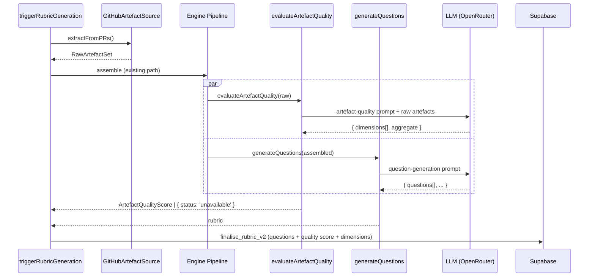
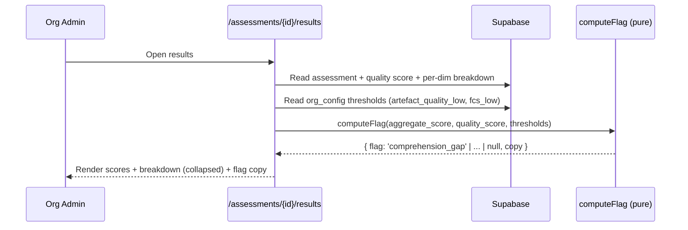
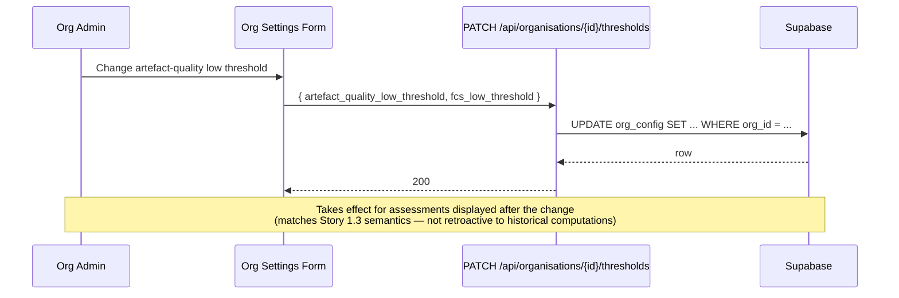
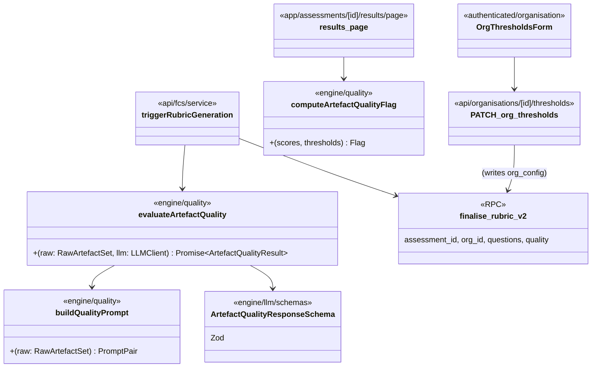

# LLD — E11: Artefact Quality Scoring (epic: TBD)

## Change Log

| Date | Author | Changes |
|------|--------|---------|
| 2026-04-16 | Claude | Initial LLD covering V2 Stories 11.1 and 11.2 |
| 2026-04-17 | Claude | Revised §11.1a post-implementation (issue #234) |
| 2026-04-17 | Claude | §11.1b revised post-implementation (issue #235) |

## Part A — Human-Reviewable

### Purpose

Surface a numerical **artefact quality score** (0–100) alongside the FCS aggregate score so Org Admins can distinguish "team doesn't understand" from "we didn't write it down". The score is produced by a **dedicated single-purpose LLM call** that evaluates six dimensions of the input artefacts (PR description, linked issues, design docs, commit messages, test coverage, ADR references) and returns per-dimension sub-scores plus an aggregate. Intent-adjacent dimensions weight ≥ 60% of the aggregate (Storey 2026 triple-debt framing).

The display side surfaces the score on the FCS results page (with per-dimension breakdown on expand), introduces an organisation-level **artefact quality low threshold** and **FCS low threshold**, and computes a four-quadrant **flag matrix** that contextualises the combination of the two scores. The Org Overview sortable column is designed but its implementation is gated on V1 Story 6.3 (Organisation Assessment Overview) landing.

### Behavioural Flows

#### Evaluation during rubric generation



The two LLM calls run in parallel — they share the same input artefacts but produce independent outputs. A failure in `evaluateArtefactQuality` does not block question generation or assessment creation; the score is recorded as `unavailable`.

#### Display flow with flag matrix



#### Threshold configuration



### Structural overview



### Invariants

| # | Invariant | Verification |
|---|-----------|-------------|
| 1 | Evaluator is a separate LLM call from question generation (never a heuristic count) | Unit test: `evaluateArtefactQuality` invokes `llmClient.generateStructured` exactly once with the dedicated quality schema |
| 2 | Evaluator failure never blocks rubric generation | Unit test: forced LLM error → score persisted as `unavailable`, rubric still produced |
| 3 | Intent-adjacent dimensions contribute ≥ 60% of aggregate weight | Unit test on `aggregateDimensions()` with the canonical weight constants |
| 4 | Aggregate is integer 0–100 | Zod schema constraint + DB CHECK |
| 5 | Per-dimension sub-score 0–100 with a category label | Zod schema + DB CHECK |
| 6 | Threshold change is not retroactive to historical scores (display only) | Unit test on `computeArtefactQualityFlag` — uses current thresholds against stored scores, never recomputes the score |
| 7 | `unavailable` score → no flag computed and FCS still displayed | Unit test on `computeArtefactQualityFlag(unavailable, ...)` returns `null` |
| 8 | Engine layer (`src/lib/engine/quality/`) has no I/O imports | `npx tsc` + grep for forbidden imports |
| 9 | Default thresholds: `artefact_quality_low = 40`, `fcs_low = 60` | DB defaults + unit test |

### Acceptance Criteria

1. The rubric generation pipeline produces an artefact quality score for every successful assessment, alongside the questions, with no measurable increase to user-perceived latency (the call runs in parallel with question generation).
2. Six dimensions are scored individually, each with a sub-score 0–100 and a category label, and the aggregate weights intent-adjacent dimensions at ≥ 60%.
3. Evaluator LLM failure or timeout records `artefact_quality_score = NULL` and `artefact_quality_status = 'unavailable'`; the assessment proceeds and `awaiting_responses` is reached as before.
4. The FCS results page shows the artefact quality score next to the FCS aggregate score; expanding it reveals all six dimension sub-scores and labels.
5. The flag matrix renders correctly across all four quadrants (low/low, high/low, low/high, high/high), and `unavailable` displays no flag.
6. Org Admins can edit the artefact quality low threshold and the FCS low threshold from the Organisation settings page; defaults are 40 and 60 respectively. Changes apply to subsequent display, not historical recomputation.
7. The Org Overview sortable column (Story 6.3) is implemented when Story 6.3 lands; until then the design is recorded but no UI ships.
8. `additional_context_suggestions` are read from existing V1 records (manual one-off analysis, not online training) to validate dimension scoring during calibration. The calibration is a script under `scripts/`, not a service path.

### Open Questions

- **Story 6.3 schedule** — E11.2c is gated on it. If Story 6.3 is not in the same milestone as E11, E11.2c slips to a subsequent milestone with no impact on E11.1 / E11.2a / E11.2b.
- **Calibration data volume** — V1 production must contain enough historical assessments with `additional_context_suggestions` to drive calibration. Today the field is generated by the LLM but appears not to be persisted (see E17 LLD §17.1a). If E17.1a does not land before E11.1c, calibration in AC-8 must use the in-memory rubric output captured at generation time rather than a historical query, and the calibration analysis is restricted to assessments generated after E11.1c lands.

---

## Part B — Agent-Implementable

The epic decomposes into six tasks across two stories. Each task is sized for a single `/feature` cycle (< 200 lines).

### Story 11.1: Artefact Quality Evaluation

#### §11.1a — Pure evaluator + schemas (engine layer)

**Layer:** Engine (pure logic, no I/O)

**Files to create:**

- `src/lib/engine/quality/index.ts` — barrel export
- `src/lib/engine/quality/evaluate-quality.ts` — `evaluateArtefactQuality(request)` function
- `src/lib/engine/quality/build-quality-prompt.ts` — `buildArtefactQualityPrompt(raw)` returning `{ systemPrompt, userPrompt }`
- `src/lib/engine/quality/aggregate-dimensions.ts` — pure `aggregateDimensions(dims)` with the 60/40 weight split
- `src/lib/engine/quality/weights.ts` — exported constants `DIMENSION_WEIGHTS` and `INTENT_ADJACENT_KEYS`

> **Implementation note (issue #234):** `INTENT_ADJACENT_KEYS` added as an exported constant for test assertions on the ≥ 60% intent-adjacent weight invariant (LLD §Invariant 3). `ARTEFACT_QUALITY_SYSTEM_PROMPT` exported from `build-quality-prompt.ts` for test assertions on prompt content (mirrors `QUESTION_GENERATION_SYSTEM_PROMPT` pattern).
- `tests/lib/engine/quality/evaluate-quality.test.ts`
- `tests/lib/engine/quality/aggregate-dimensions.test.ts`
- `tests/lib/engine/quality/build-quality-prompt.test.ts`

> **Implementation note (issue #234):** Test paths corrected from `tests/unit/` to `tests/lib/` to match the project convention used by all other engine tests.

**Files to modify:**

- `src/lib/engine/llm/schemas.ts` — add `ArtefactQualityDimensionSchema`, `ArtefactQualityResponseSchema`

**Internal types:**

```typescript
// src/lib/engine/llm/schemas.ts (additions)

export const ArtefactQualityDimensionKeySchema = z.enum([
  'pr_description',
  'linked_issues',
  'design_documents',
  'commit_messages',
  'test_coverage',
  'adr_references',
]);
export type ArtefactQualityDimensionKey = z.infer<typeof ArtefactQualityDimensionKeySchema>;

export const ArtefactQualityDimensionSchema = z.object({
  key: ArtefactQualityDimensionKeySchema,
  sub_score: z.number().int().min(0).max(100),
  category: z.string().min(1),       // e.g. "empty" / "minimal" / "detailed" — set by prompt
  rationale: z.string().min(1),      // one-sentence justification
});
export type ArtefactQualityDimension = z.infer<typeof ArtefactQualityDimensionSchema>;

export const ArtefactQualityResponseSchema = z.object({
  dimensions: z.array(ArtefactQualityDimensionSchema).length(6),
});
export type ArtefactQualityResponse = z.infer<typeof ArtefactQualityResponseSchema>;
```

```typescript
// src/lib/engine/quality/evaluate-quality.ts

export type ArtefactQualityUnavailableReason =
  | 'llm_failed'
  | 'timeout'
  | 'validation_failed';

export type ArtefactQualityResult =
  | { status: 'success'; aggregate: number; dimensions: ArtefactQualityDimension[] }
  | { status: 'unavailable'; reason: ArtefactQualityUnavailableReason; error: LLMError };

> **Implementation note (issue #234):** `ArtefactQualityUnavailableReason` extracted as a standalone exported type for downstream consumer ergonomics (§11.1c pipeline needs to match on reason). The LLM error-code → reason mapping is: `validation_failed`/`malformed_response` → `'validation_failed'`, `network_error` → `'timeout'`, everything else → `'llm_failed'`. A private `classifyReason(code)` function handles this mapping.

export interface EvaluateQualityRequest {
  raw: RawArtefactSet;
  llmClient: LLMClient;
  model?: string;
  maxTokens?: number;
}

export async function evaluateArtefactQuality(
  request: EvaluateQualityRequest,
): Promise<ArtefactQualityResult>;
```

```typescript
// src/lib/engine/quality/weights.ts

/** Intent-adjacent (≥ 60% of aggregate) and code-adjacent (the remainder).
 *  The exact per-dimension split inside each group is tunable; the 60/40
 *  invariant is enforced by aggregateDimensions(). */
export const DIMENSION_WEIGHTS: Record<ArtefactQualityDimensionKey, number> = {
  // intent-adjacent — 65% total
  adr_references:    0.20,
  linked_issues:     0.20,
  design_documents: 0.15,
  pr_description:   0.10,
  // code-adjacent — 35% total
  test_coverage:     0.20,
  commit_messages: 0.15,
};
```

**Prompt design:** Single-purpose system prompt instructs the LLM to read the raw artefacts and emit per-dimension sub-scores using the named categories from V2 Story 11.1. Output schema is `ArtefactQualityResponseSchema` (6 entries, fixed key set). The prompt explicitly states "do not generate questions, do not score answers — return dimension assessments only."

**BDD specs:**

```
describe('evaluateArtefactQuality')
  describe('Given artefacts with a detailed PR description, linked issues, ADRs, and tests')
    it('then it returns aggregate ≥ 80 with high sub-scores on intent-adjacent dimensions')
  describe('Given artefacts with code only and no description')
    it('then it returns aggregate ≤ 30 with the pr_description, linked_issues, adr_references dimensions all at category "none"/"empty"')
  describe('Given the LLM returns malformed JSON')
    it('then status is "unavailable" with reason "validation_failed"')
  describe('Given the LLM call throws a timeout error')
    it('then status is "unavailable" with reason "timeout"')

describe('aggregateDimensions')
  describe('Given six dimensions all at sub-score 100')
    it('then aggregate is 100')
  describe('Given intent-adjacent dimensions at 100 and code-adjacent at 0')
    it('then aggregate is ≥ 60')
  describe('Given code-adjacent dimensions at 100 and intent-adjacent at 0')
    it('then aggregate is ≤ 40')

describe('buildArtefactQualityPrompt')
  describe('Given a RawArtefactSet')
    it('then the system prompt names exactly the six dimension keys')
    it('then the user prompt embeds the artefact set without truncation')
```

**Acceptance:**

- [x] Engine has zero I/O imports (`grep -r "from '@/lib/supabase\|from '@/lib/github\|from 'next" src/lib/engine/quality/` returns nothing).
- [x] `aggregateDimensions(dims)` invariant test: `intentTotal / overallTotal ≥ 0.60` for any non-trivial input.
- [x] All BDD specs pass.

---

#### §11.1b — Schema migration (artefact quality persistence)

**Layer:** Database

**Files to create:**

- `supabase/migrations/<timestamp>_artefact_quality_score.sql` — generated by `npx supabase db diff`

**Files to modify:**

- `supabase/schemas/tables.sql` — add columns:
  - `artefact_quality_score integer CHECK (artefact_quality_score IS NULL OR artefact_quality_score BETWEEN 0 AND 100)`
  - `artefact_quality_status text NOT NULL DEFAULT 'pending' CHECK (artefact_quality_status IN ('pending', 'success', 'unavailable'))`
  - `artefact_quality_dimensions jsonb` — array of `{ key, sub_score, category, rationale }`
- `supabase/schemas/functions.sql` — add `finalise_rubric_v2` taking `p_quality_score integer`, `p_quality_status text`, `p_quality_dimensions jsonb` alongside the existing parameters; old function kept temporarily, see migration plan below.

**Migration plan:**

1. Add new columns with defaults (`status = 'pending'`).
2. Add new RPC `finalise_rubric_v2` accepting quality fields; existing `finalise_rubric` keeps working unchanged.
3. §11.1c switches the service to call `finalise_rubric_v2` and removes the old function from the schema in the same PR (declarative schema regenerates the migration).

**Justification for new RPC instead of in-place edit:** the existing RPC is referenced by [src/app/api/fcs/service.ts](src/app/api/fcs/service.ts#L261) and the retry path [src/app/api/assessments/[id]/retry-rubric/service.ts](src/app/api/assessments/[id]/retry-rubric/service.ts). Adding a new RPC lets §11.1b ship before §11.1c without breaking the live path; §11.1c removes the old function once both call sites are migrated.

**The `artefact_quality` text column:** kept (used by V1 prompt-time bucketing in [src/lib/engine/prompts/classify-quality.ts](src/lib/engine/prompts/classify-quality.ts)). The new numerical column is additive. Mark the text column as deprecated in a comment but do not drop it in this task.

**BDD specs:**

```
describe('finalise_rubric_v2 RPC')
  describe('Given questions and a successful quality result')
    it('then questions are inserted, score and dimensions persisted, status -> "awaiting_responses"')
  describe('Given questions and an unavailable quality result')
    it('then questions are inserted, score is NULL, status -> "awaiting_responses", quality_status -> "unavailable"')
  describe('Given a CHECK violation on score range')
    it('then the transaction aborts and the assessment stays in rubric_generation')
```

**Acceptance:**

- [x] `npx supabase db diff` produces the expected migration; no drift.
- [x] `npx supabase db reset` succeeds; integration test (call `finalise_rubric_v2` from a test) succeeds.
- [x] No production code yet calls the new RPC (that is §11.1c).

---

#### §11.1c — Pipeline integration + persistence

**Layer:** Backend (API service path)

**Files to modify:**

- [src/app/api/fcs/service.ts](src/app/api/fcs/service.ts) — `finaliseRubric()` body:
  - Run `evaluateArtefactQuality()` and `generateRubric()` in parallel via `Promise.all` (both share the same `RawArtefactSet`).
  - Call `finalise_rubric_v2` with the quality result.
  - On evaluator failure, persist `status = 'unavailable'` and continue.
- [src/app/api/assessments/[id]/retry-rubric/service.ts](src/app/api/assessments/[id]/retry-rubric/service.ts) — same change.
- `supabase/schemas/functions.sql` — remove `finalise_rubric` (kept in §11.1b).
- `src/lib/supabase/types.ts` — regenerate via `supabase gen types`.

**Files to create:**

- `tests/unit/api/fcs/service-quality.test.ts` — covers parallel call + fallback paths.

**Internal decomposition (controller / service):** No new route handler; this task modifies the existing `finaliseRubric` service helper. The existing route ([src/app/api/fcs/route.ts](src/app/api/fcs/route.ts)) already complies with the controller / service split (controller body is 6 lines, delegates to `createFcs`).

**BDD specs:**

```
describe('triggerRubricGeneration with artefact quality')
  describe('Given evaluator and generator both succeed')
    it('then both LLM calls run concurrently (Promise.all settled before persist)')
    it('then finalise_rubric_v2 is called with score, status="success", dimensions array length 6')
  describe('Given evaluator fails but generator succeeds')
    it('then finalise_rubric_v2 is called with score=null, status="unavailable"')
    it('then the assessment reaches "awaiting_responses"')
  describe('Given generator fails')
    it('then evaluator result is discarded and status -> "rubric_failed" (existing behaviour)')
```

**Acceptance:**

- [ ] `npx vitest run` green.
- [ ] No regression on existing FCS rubric generation tests.
- [ ] Logs include `artefactQualityStatus` and `artefactQualityScore` (when present) under the existing rubric summary log.

---

### Story 11.2: Artefact Quality Display

#### §11.2a — Org-level threshold config (artefact-quality low + FCS low)

**Layer:** Database + Backend + Frontend

**Files to modify:**

- `supabase/schemas/tables.sql` — `org_config` additions:
  - `artefact_quality_low_threshold integer NOT NULL DEFAULT 40 CHECK (artefact_quality_low_threshold BETWEEN 0 AND 100)`
  - `fcs_low_threshold integer NOT NULL DEFAULT 60 CHECK (fcs_low_threshold BETWEEN 0 AND 100)`
- `src/lib/supabase/types.ts` — regenerate.
- `src/app/(authenticated)/organisation/page.tsx` — render new `OrgThresholdsForm`.

**Files to create:**

- `supabase/migrations/<timestamp>_org_thresholds.sql`
- `src/app/api/organisations/[id]/thresholds/route.ts` — `GET`, `PATCH` per ADR-0014 contract style
- `src/app/api/organisations/[id]/thresholds/service.ts` — `loadThresholds(ctx, orgId)`, `upsertThresholds(ctx, orgId, body)`
- `src/app/(authenticated)/organisation/org-thresholds-form.tsx` — client component using existing form patterns (mirror `org-context-form.tsx`)
- `tests/unit/api/organisations/thresholds.test.ts`

**Internal decomposition (controller / service):**

- Controller [src/app/api/organisations/[id]/thresholds/route.ts](src/app/api/organisations/[id]/thresholds/route.ts) (≤ 5 lines per handler):
  - `await createApiContext(request)` → `validateBody` → delegate to `loadThresholds` / `upsertThresholds` → `json()`.
- Service: receives `ApiContext`, performs admin check via `ctx.adminSupabase` query against `user_organisations`, writes via `ctx.adminSupabase` (RLS bypass justified — admin-only mutation, see ADR-0017 pattern).

**Contract types (route file):**

```typescript
/**
 * GET /api/organisations/{id}/thresholds
 *
 * Path parameters:
 *   id  (string, required) — organisation UUID
 *
 * Returns 200 OrgThresholdsResponse | 401 | 403
 */

/**
 * PATCH /api/organisations/{id}/thresholds
 *
 * Path parameters:
 *   id  (string, required) — organisation UUID
 *
 * Request body (JSON, all fields optional):
 *   artefact_quality_low_threshold  (integer 0–100)
 *   fcs_low_threshold               (integer 0–100)
 *
 * Returns 200 OrgThresholdsResponse | 401 | 403 | 422
 */
interface OrgThresholdsResponse {
  artefact_quality_low_threshold: number;
  fcs_low_threshold: number;
}
```

**BDD specs:**

```
describe('PATCH /api/organisations/{id}/thresholds')
  describe('Given an Org Admin sets artefact_quality_low_threshold = 50')
    it('then org_config row is updated and the response reflects the new value')
  describe('Given a non-admin user')
    it('then the request is rejected with 403')
  describe('Given a value outside 0–100')
    it('then the request is rejected with 422 and the row is unchanged')
  describe('Given concurrent change to fcs_low_threshold elsewhere')
    it('then the partial PATCH does not overwrite the unrelated field')
```

**Acceptance:**

- [ ] Threshold form visible on Organisation page for admins; non-admins see the existing 403 path.
- [ ] Defaults render as 40 and 60 when no override exists.
- [ ] Schema diff is empty after migration.

---

#### §11.2b — Results page artefact quality display + flag matrix

**Layer:** Frontend + small engine helper

**Files to create:**

- `src/lib/engine/quality/compute-flag.ts` — `computeArtefactQualityFlag(input)` pure function returning flag key + copy
- `src/components/results/artefact-quality-card.tsx` — score, dimensions accordion, flag copy
- `tests/unit/engine/quality/compute-flag.test.ts`

**Files to modify:**

- [src/app/assessments/[id]/results/page.tsx](src/app/assessments/[id]/results/page.tsx) — fetch quality columns, fetch org thresholds, render `<ArtefactQualityCard />`

**Internal types:**

```typescript
// src/lib/engine/quality/compute-flag.ts

export type ArtefactQualityFlagKey =
  | 'comprehension_and_documentation_risk'
  | 'comprehension_gap'
  | 'tacit_knowledge_concentration'
  | null;

export interface FlagInput {
  fcs_score: number | null;          // 0..1 (existing scale) — coerced for compare
  artefact_quality_score: number | null;
  artefact_quality_status: 'success' | 'unavailable' | 'pending';
  artefact_quality_low_threshold: number;  // 0..100
  fcs_low_threshold: number;               // 0..100
}

export interface FlagResult {
  key: ArtefactQualityFlagKey;
  copy: string | null;
}

export function computeArtefactQualityFlag(input: FlagInput): FlagResult;
```

The function returns `{ key: null, copy: null }` for `unavailable` / `pending` quality, and for the healthy quadrant.

**BDD specs:**

```
describe('computeArtefactQualityFlag')
  describe('Given quality 30 and FCS 50 with thresholds 40/60')
    it('then key = "comprehension_and_documentation_risk"')
  describe('Given quality 80 and FCS 50 with thresholds 40/60')
    it('then key = "comprehension_gap"')
  describe('Given quality 30 and FCS 80 with thresholds 40/60')
    it('then key = "tacit_knowledge_concentration"')
  describe('Given quality 80 and FCS 80')
    it('then key = null and copy = null')
  describe('Given quality status "unavailable"')
    it('then key = null and copy = null regardless of thresholds')

describe('Results page artefact quality card')
  describe('Given a completed assessment with quality_score = 75')
    it('renders the score badge and the four-quadrant explanation')
    it('expanding the dimensions accordion lists six rows in canonical order')
  describe('Given quality_status = "unavailable"')
    it('renders "unavailable" with hover explanation, no flag')
```

**Acceptance:**

- [ ] All four flag-matrix quadrants and the unavailable case render correctly (visual smoke + unit tests).
- [ ] Per-dimension breakdown is collapsed by default; expanding reveals six dimension rows ordered: ADR references, linked issues, design documents, PR description, test coverage, commit messages.
- [ ] No layout regression on the existing FCS-only view (rendered when quality is `pending`).

---

#### §11.2c — Org Overview sortable column (gated on Story 6.3)

**Layer:** Frontend (depends on Story 6.3 page existing)

**Status:** **Blocked on Story 6.3 (Organisation Assessment Overview).** No file exists today. The design below records the contract so this slot is ready to drop in when Story 6.3 lands.

**Files to modify (when unblocked):**

- The Organisation Overview page (path TBD — proposed `src/app/(authenticated)/organisation/overview/page.tsx`)
- A shared assessment-row component if Story 6.3 introduces one

**Design:**

- Add a column "Artefact Quality" to the assessments table.
- Column shows `quality_score` as a 0–100 badge, or "—" if `pending`/`unavailable`.
- Sortable by score; `unavailable` rows sort to the end in both directions.
- Column hidden behind a feature-flag check on `artefact_quality_status` until at least one row in the org has `status = 'success'` (avoids an empty column for orgs with only legacy assessments).

**BDD specs (recorded but not implementable until Story 6.3 lands):**

```
describe('Org Overview artefact quality column')
  describe('Given any assessment in the org has quality_status = "success"')
    it('then the column is visible')
  describe('Given the user clicks the column header')
    it('then rows sort by quality_score asc/desc, with unavailable rows pinned to the end')
```

**Acceptance:**

- [ ] (Pending Story 6.3) Issue is left in `Blocked` status with a reference to Story 6.3's issue once that issue exists.

---

### Verification across the epic

| Command | Purpose |
|---------|---------|
| `npx vitest run tests/unit/engine/quality` | Engine unit tests |
| `npx vitest run tests/unit/api/fcs/service-quality.test.ts` | Pipeline integration |
| `npx vitest run tests/unit/api/organisations/thresholds.test.ts` | Threshold API |
| `npx tsc --noEmit` | Type integrity, including regenerated `supabase/types.ts` |
| `npx supabase db reset && npx supabase db diff` | No schema drift |
| `npm run build` | Compile + Next.js static analysis |

### Out of scope for E11

- **Online calibration / training loop** — V2 calibration is a one-off offline analysis (Story 11.1 notes).
- **Per-dimension thresholds** — only the aggregate quality score has a threshold; per-dimension thresholds deferred.
- **Repository-level threshold overrides** — V2 thresholds are organisation-level only; per-repo overrides can be added later via the existing `repository_config` cascade pattern (`get_effective_config`).
- **Dropping the legacy `artefact_quality` text column** — kept for V1 prompt bucketing; removal is a follow-up after the prompt-side replacement.
