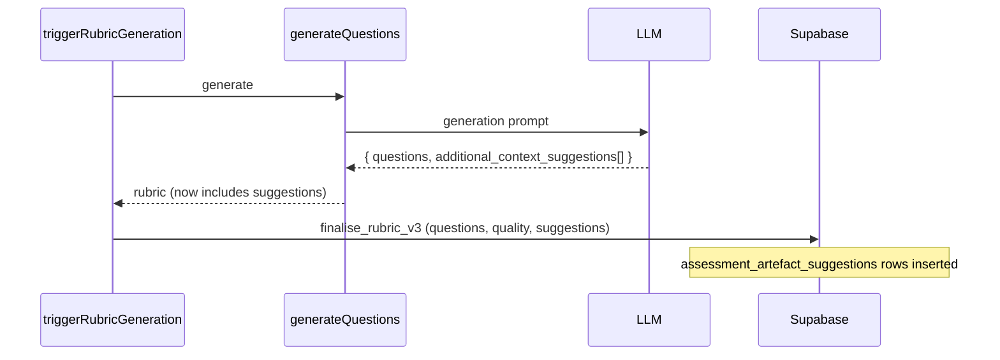
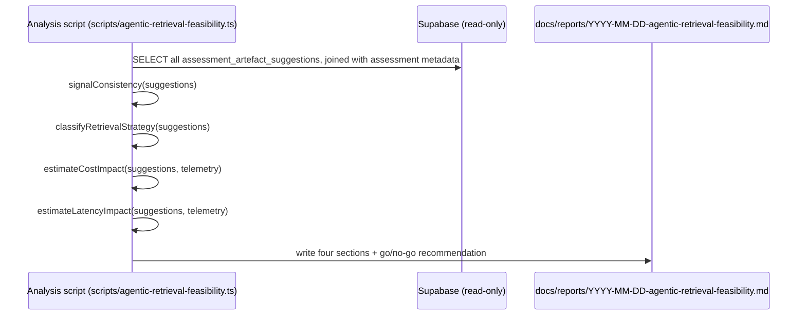
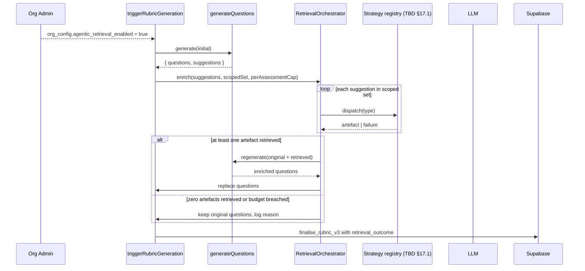
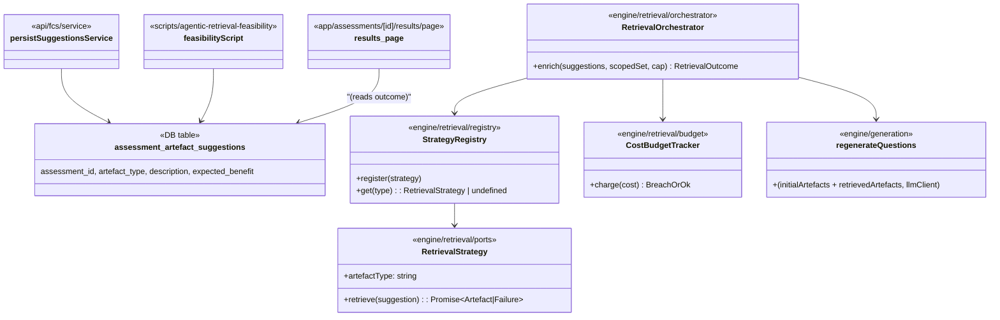
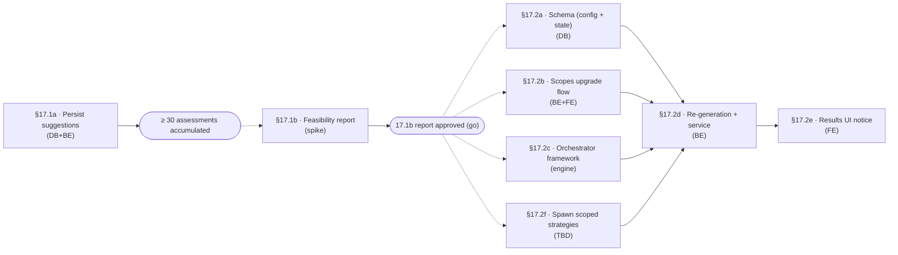

# LLD — E17: Agentic Artefact Retrieval (epic: TBD)

## Change Log

| Date | Author | Changes |
|------|--------|---------|
| 2026-04-16 | Claude | Initial LLD covering V2 Stories 17.1 and 17.2 framework |

## Part A — Human-Reviewable

### Purpose

V1 captures `additional_context_suggestions` from the question-generation LLM as passive metadata indicating what extra artefacts would have improved the questions. Today the field is generated but **not persisted**. E17 closes the loop in two phases:

1. **Story 17.1** — a research spike that establishes whether agentic retrieval is feasible. Deliverable is a report with four go/no-go criteria and (if go) the scoped set of artefact types and retrieval strategies.
2. **Story 17.2** — the implementation framework. The orchestration framework (configuration, scope upgrade, budget enforcement, fallback semantics, results UI) is designed and decomposed now. Concrete retrieval strategies are added as task issues only after Story 17.1 produces its report — they cannot be designed in advance because their scope is the report's output.

### Behavioural flows

#### Story 17.1a — persist suggestions during rubric finalisation (prerequisite)



#### Story 17.1b — feasibility report (offline analysis script)



#### Story 17.2 — opt-in retrieval flow (framework, scope-set TBD by 17.1)



### Structural overview



### Invariants

| # | Invariant | Verification |
|---|-----------|-------------|
| 1 | `additional_context_suggestions` are persisted whenever returned by the LLM | Unit test: rubric finalisation with suggestions → row count > 0 |
| 2 | Story 17.1 deliverable is a markdown report under `docs/reports/`, not production code | PR review |
| 3 | Default org configuration: agentic retrieval **disabled** | DB default + unit test |
| 4 | Retrieval-enabled state is captured at assessment-creation time, not read live during processing | Persisted as `assessments.retrieval_enabled_at_creation boolean` |
| 5 | Zero retrieved artefacts → original questions used, no enrichment claim shown | Orchestrator unit test + UI test |
| 6 | Per-assessment additional spend cap is enforced before re-generation runs | Unit test on `CostBudgetTracker` |
| 7 | End-to-end retrieval + re-generation budget ≤ 90 seconds | Integration test with mocked strategies + AbortController |
| 8 | An individual strategy failure does not abort the orchestrator | Unit test with one failing + one succeeding strategy |
| 9 | Strategies live in the engine layer with no I/O imports themselves; I/O is performed by injected adapters | grep + tsc |
| 10 | Required GitHub scopes are listed before opt-in is permitted | UI test + API test for the scopes-grant gate |

### Acceptance Criteria (epic-level)

1. `additional_context_suggestions` are persisted for every successful assessment from the day §17.1a ships, in a queryable form.
2. Story 17.1 produces a markdown report in `docs/reports/` containing the four required sections (signal consistency, retrieval strategy map, cost impact, latency impact) and a go / no-go recommendation against the four explicit thresholds.
3. The retrieval orchestration framework is implemented in the engine layer with a strategy port interface, registry, budget tracker, and 90-second wall-clock guard — independent of any concrete strategy.
4. Per-organisation configuration supports: `agentic_retrieval_enabled` (default false), `agentic_retrieval_spend_cap` (default 2× V1 baseline assessment cost).
5. The GitHub scopes upgrade flow blocks opt-in until the additional scopes (per 17.1's report) have been granted by the App installation.
6. The results page surfaces the enrichment outcome (`N retrieved`, `unchanged`, `cap_breached`) and the per-assessment cost breakdown attributing retrieval cost separately from generation cost.
7. Concrete retrieval strategies (one per scoped artefact type) are added as separate task issues spawned from §17.2f (`implement scoped retrievers`) only after Story 17.1's report is approved.

### Open Questions

- **17.1 thresholds** — the four go/no-go thresholds (60% overlap, 70% strategy coverage, 50% cost increase, 90s latency) are directional anchors per Story 17.1's notes. The report can recommend "go with caveats" when one threshold misses by < 10 percentage points.
- **Suggestion persistence backfill** — historical V1 assessments (before §17.1a ships) have no persisted suggestions. Backfilling would require re-running the question-generation LLM call against historical artefacts, which is expensive and may not match current model behaviour. **Decision:** do not backfill. The feasibility report uses only assessments generated after §17.1a, with a stated minimum sample size of 30.
- **Spend cap denomination** — "twice the V1 baseline assessment cost" requires a captured baseline value. Today per-assessment cost is logged but not aggregated. §17.1a should also persist the per-assessment generation cost so the baseline is computable.
- **Per-strategy timeout** — the 90s end-to-end budget is the hard ceiling, but individual strategies should have shorter timeouts (e.g. 10s) so one slow strategy cannot consume the whole budget. The exact value is finalised after 17.1.

---

## Part B — Agent-Implementable

### Story 17.1: Agentic Retrieval Feasibility Study

#### §17.1a — Persist `additional_context_suggestions` (prerequisite)

**Layer:** Database + Backend

**Files to create:**

- `supabase/migrations/<timestamp>_assessment_artefact_suggestions.sql`
- `tests/unit/api/fcs/service-suggestions.test.ts`

**Files to modify:**

- `supabase/schemas/tables.sql` — add table:
  ```sql
  CREATE TABLE assessment_artefact_suggestions (
    id              uuid PRIMARY KEY DEFAULT gen_random_uuid(),
    org_id          uuid NOT NULL REFERENCES organisations(id) ON DELETE CASCADE,
    assessment_id   uuid NOT NULL REFERENCES assessments(id) ON DELETE CASCADE,
    artefact_type   text NOT NULL,
    description     text NOT NULL,
    expected_benefit text NOT NULL,
    created_at      timestamptz NOT NULL DEFAULT now()
  );
  CREATE INDEX idx_assessment_suggestions_assessment
    ON assessment_artefact_suggestions (assessment_id);
  CREATE INDEX idx_assessment_suggestions_org_type
    ON assessment_artefact_suggestions (org_id, artefact_type);
  ```
- `supabase/schemas/policies.sql` — RLS: read by org members; insert by service role only.
- `supabase/schemas/functions.sql` — replace `finalise_rubric_v2` (from E11 §11.1b) with `finalise_rubric_v3` accepting `p_suggestions jsonb`. The two epics' migrations interact — see "Cross-epic ordering" below.
- [src/app/api/fcs/service.ts](src/app/api/fcs/service.ts) — pass `result.rubric.additional_context_suggestions` to the new RPC.
- [src/app/api/assessments/[id]/retry-rubric/service.ts](src/app/api/assessments/[id]/retry-rubric/service.ts) — same.
- `src/lib/supabase/types.ts` — regenerate.

**Cross-epic ordering with E11:**

- If E11 §11.1b has not landed, this task introduces `finalise_rubric_v2` first as in E11, then layers `finalise_rubric_v3` on top — same migration body without the quality columns.
- If E11 §11.1b has landed, this task replaces `finalise_rubric_v2` with `finalise_rubric_v3` (adds `p_suggestions jsonb`).
- Independent execution: §17.1a does not depend on E11.1b for *its own* persistence — the table is independent. The shared concern is the RPC name; the implementing agent picks the correct version based on what is in `main` at branch-creation time.

**Internal decomposition:** No new route handler. Existing `triggerRubricGeneration` already calls `finaliseRubric()`; the change is in that helper plus the RPC.

**BDD specs:**

```
describe('finalise_rubric_v3 RPC')
  describe('Given a rubric with two suggestions')
    it('then two assessment_artefact_suggestions rows are inserted')
  describe('Given a rubric with no suggestions')
    it('then zero suggestion rows are inserted')
  describe('Given the RPC is called twice (retry path)')
    it('then suggestion rows are not duplicated (clear-on-retry semantics)')

describe('triggerRubricGeneration suggestion persistence')
  describe('Given the LLM omits additional_context_suggestions')
    it('then no suggestion rows are inserted and the assessment proceeds')
  describe('Given the LLM returns 3 suggestions')
    it('then 3 rows exist after rubric finalisation')
```

**Acceptance:**

- [ ] Schema diff is empty after migration.
- [ ] Reading suggestions back via `SELECT * FROM assessment_artefact_suggestions WHERE assessment_id = ...` matches what the LLM returned.
- [ ] Retry path does not duplicate rows (the RPC clears prior rows for that `assessment_id` before inserting).

---

#### §17.1b — Feasibility analysis & report

**Layer:** Offline script + markdown deliverable. **No production code paths shipped.**

**Files to create:**

- `scripts/agentic-retrieval-feasibility.ts` — analysis script (run with `tsx` against the production database read-replica or a local snapshot)
- `docs/reports/<YYYY-MM-DD>-agentic-retrieval-feasibility.md` — the deliverable

**Script outline (no implementation detail prescribed beyond function shape):**

```typescript
// scripts/agentic-retrieval-feasibility.ts
async function main(): Promise<void> {
  const rows = await fetchAllSuggestions();
  if (rows.length < MIN_ASSESSMENTS) reportInsufficientData();   // <30 → abort

  const consistency = signalConsistency(rows);             // % overlap of top-3 per assessment with global top-3
  const strategyMap = classifyRetrievalStrategy(rows);     // {in_repo, external_link, none} per type
  const costEstimate = estimateCostImpact(rows, telemetry);
  const latencyEstimate = estimateLatencyImpact(rows, telemetry);

  const recommendation = decideGoNoGo({ consistency, strategyMap, costEstimate, latencyEstimate });
  writeReport({ consistency, strategyMap, costEstimate, latencyEstimate, recommendation });
}
```

**Report sections (mandatory):**

1. **Data summary** — assessment count, date range, total suggestions, distinct artefact types.
2. **Signal consistency analysis** — per-type frequency table; consistency value (% overlap of per-assessment top-3 with global top-3); pass/fail vs 60% threshold.
3. **Retrieval-strategy map** — table mapping each requested artefact type to `(a) in-repo GitHub search`, `(b) external link`, `(c) no viable strategy`; pass/fail vs 70% threshold.
4. **Cost impact estimate** — projected additional LLM tokens + GitHub API calls per assessment, in absolute terms and as a percentage delta against V1 baseline; pass/fail vs 50% increase threshold.
5. **Latency impact estimate** — projected wall-clock delta against V1 measured latency; cross-check against 90s end-to-end budget for §17.2.
6. **Go / no-go recommendation** — explicit recommendation with citation of each threshold; if go, the **scoped artefact type set** for §17.2; if no-go, the rationale and what evidence would change the decision.

**BDD specs:** none — output is a document, reviewed by the user.

**Acceptance:**

- [ ] Report exists at `docs/reports/<YYYY-MM-DD>-agentic-retrieval-feasibility.md`.
- [ ] All four go/no-go criteria are evaluated explicitly with the underlying numbers shown.
- [ ] Recommendation either approves §17.2 with a scoped set, or marks it blocked with rationale.

**Time-gate dependency:** This task must wait for ≥ 30 production assessments to accumulate after §17.1a ships. That is operational latency, not work.

---

### Story 17.2: Opt-In Agentic Retrieval — framework

The framework is decomposed below. **Concrete retrieval strategies are not in this LLD** — they are spawned by §17.2f as separate task issues after Story 17.1's report defines the scoped set.

#### §17.2a — Schema for org config + assessment retrieval state

**Layer:** Database

**Files to modify:**

- `supabase/schemas/tables.sql`:
  - `org_config` additions:
    - `agentic_retrieval_enabled boolean NOT NULL DEFAULT false`
    - `agentic_retrieval_spend_cap_cents integer NOT NULL DEFAULT 0 CHECK (agentic_retrieval_spend_cap_cents >= 0)` — `0` resolves at runtime to "2× the V1 baseline" via `getEffectiveSpendCap()` in §17.2c
    - `agentic_retrieval_scopes_granted boolean NOT NULL DEFAULT false`
  - `assessments` additions:
    - `retrieval_enabled_at_creation boolean NOT NULL DEFAULT false`
    - `retrieval_outcome text CHECK (retrieval_outcome IN ('not_attempted', 'enriched', 'unchanged_no_artefacts', 'unchanged_cap_breached', 'unchanged_timeout'))`
    - `retrieval_artefact_count integer NOT NULL DEFAULT 0`
    - `retrieval_cost_cents integer NOT NULL DEFAULT 0`
    - `generation_cost_cents integer NOT NULL DEFAULT 0` — generation cost stored separately from retrieval per AC-6
- `src/lib/supabase/types.ts` — regenerate.

**Acceptance:**

- [ ] Schema diff empty.
- [ ] All new columns NOT NULL with explicit defaults so existing rows are populated cleanly.

---

#### §17.2b — GitHub scopes upgrade flow

**Layer:** Backend + Frontend

**Files to create:**

- `src/app/api/organisations/[id]/agentic-retrieval/scopes/route.ts`
- `src/app/api/organisations/[id]/agentic-retrieval/scopes/service.ts` — `getRequiredScopes(ctx, orgId)`, `markScopesGranted(ctx, orgId)`
- `src/app/(authenticated)/organisation/agentic-retrieval-form.tsx` — UI: list required scopes, link to GitHub App installation upgrade page, "I've granted these scopes" confirmation
- `tests/unit/api/organisations/agentic-retrieval-scopes.test.ts`

**Files to modify:**

- [src/app/(authenticated)/organisation/page.tsx](src/app/(authenticated)/organisation/page.tsx) — render the new form when `agentic_retrieval_enabled` toggle is on but scopes not granted.

**Behavioural rule:** Opting in (`agentic_retrieval_enabled = true`) is rejected if `agentic_retrieval_scopes_granted = false`. The UI surfaces the required scopes list before the toggle becomes interactive.

**BDD specs:**

```
describe('Agentic retrieval opt-in')
  describe('Given scopes have not been granted')
    it('then PATCH agentic_retrieval_enabled=true returns 412 Precondition Failed with required scopes')
  describe('Given the user grants the scopes via GitHub')
    it('then markScopesGranted is invoked and PATCH succeeds')
  describe('Given the App installation later loses the scopes')
    it('then a webhook handler resets agentic_retrieval_scopes_granted to false (covered by §17.2g if added)')
```

**Acceptance:**

- [ ] Required scopes are surfaced before the toggle is enabled.
- [ ] Opt-in is blocked until the grant is recorded.

---

#### §17.2c — Retrieval orchestration framework (engine layer)

**Layer:** Engine (pure logic + ports)

**Files to create:**

- `src/lib/engine/retrieval/index.ts` — barrel
- `src/lib/engine/retrieval/orchestrator.ts` — `enrichWithRetrieval(input)`
- `src/lib/engine/retrieval/registry.ts` — strategy registry
- `src/lib/engine/retrieval/ports.ts` — `RetrievalStrategy` interface
- `src/lib/engine/retrieval/budget.ts` — `CostBudgetTracker`, `WallClockBudget` (uses `AbortController`)
- `tests/unit/engine/retrieval/orchestrator.test.ts`
- `tests/unit/engine/retrieval/budget.test.ts`

**Internal types:**

```typescript
// src/lib/engine/retrieval/ports.ts

export interface RetrievalStrategy {
  /** Artefact type from `additional_context_suggestions[].artefact_type` this strategy handles. */
  readonly artefactType: string;
  retrieve(input: RetrievalInput, signal: AbortSignal): Promise<RetrievalResult>;
}

export interface RetrievalInput {
  suggestion: AdditionalContextSuggestion;
  context: { orgName: string; repoName: string; pullRequest?: { number: number; body: string } };
}

export type RetrievalResult =
  | { status: 'ok'; artefact: RetrievedArtefact; costCents: number }
  | { status: 'failed'; reason: 'not_found' | 'permission' | 'timeout' | 'network'; costCents: number };

// src/lib/engine/retrieval/orchestrator.ts

export interface EnrichInput {
  suggestions: AdditionalContextSuggestion[];
  scopedSet: ReadonlySet<string>;       // resolved at call site from 17.1's report-derived constant
  registry: StrategyRegistry;
  budget: { wallClockMs: number; spendCapCents: number };
  context: RetrievalInput['context'];
}

export type EnrichOutcome =
  | { kind: 'enriched'; retrieved: RetrievedArtefact[]; costCents: number }
  | { kind: 'unchanged_no_artefacts'; perTypeFailures: PerTypeFailure[]; costCents: number }
  | { kind: 'unchanged_cap_breached'; costCents: number }
  | { kind: 'unchanged_timeout'; partial: RetrievedArtefact[]; costCents: number };
```

**Behavioural rules:**

- The orchestrator iterates suggestions in input order. For each suggestion whose `artefact_type` is not in `scopedSet`, it logs `out_of_scope` and skips.
- Per-suggestion strategy invocation is wrapped in the wall-clock `AbortSignal`; an individual strategy timeout aborts only that strategy, not the orchestrator.
- `CostBudgetTracker` is checked **before** dispatching the next strategy — if charging the projected cost would exceed the cap, the orchestrator stops and returns `unchanged_cap_breached` (no partial enrichment, per AC-9 of Story 17.2: cap breach falls back to original questions).
- If wall-clock budget expires, returns `unchanged_timeout`. Partial retrievals are recorded for telemetry but **not** used for re-generation (the full set was not retrieved, semantics of re-generation require the orchestrator's full output).

**BDD specs:**

```
describe('enrichWithRetrieval')
  describe('Given two in-scope suggestions and both strategies succeed')
    it('then outcome.kind = "enriched" and retrieved.length = 2')
  describe('Given one suggestion is out of scope')
    it('then it is skipped with logged reason and the in-scope one is retrieved')
  describe('Given one strategy times out and one succeeds')
    it('then the timeout is recorded; outcome.kind reflects the wall-clock state')
  describe('Given charging the next strategy would exceed the spend cap')
    it('then the orchestrator stops with outcome.kind = "unchanged_cap_breached"')
  describe('Given zero suggestions are in scope')
    it('then outcome.kind = "unchanged_no_artefacts" with perTypeFailures listing each out-of-scope reason')
  describe('Given the wall-clock budget elapses mid-flight')
    it('then outcome.kind = "unchanged_timeout" and partial artefacts are NOT used downstream')

describe('CostBudgetTracker')
  describe('Given a cap of 100 cents and a projected charge of 60')
    it('then charge succeeds and remaining = 40')
  describe('Given a remaining of 40 and a projected charge of 50')
    it('then charge is rejected with reason "cap_exceeded"')
```

**Acceptance:**

- [ ] Engine has zero I/O imports.
- [ ] All BDD specs pass.

---

#### §17.2d — Re-generation flow + service integration

**Layer:** Backend (API service path)

**Files to create:**

- `src/lib/engine/generation/regenerate-questions.ts` — `regenerateQuestions(originalArtefacts, retrievedArtefacts, llmClient)` (the second LLM call)
- `tests/unit/engine/generation/regenerate-questions.test.ts`
- `tests/unit/api/fcs/service-retrieval.test.ts`

**Files to modify:**

- [src/app/api/fcs/service.ts](src/app/api/fcs/service.ts):
  - After `generateRubric` succeeds, check if `assessment.retrieval_enabled_at_creation` is true.
  - If yes, build a `StrategyRegistry` from the registered strategies (added by §17.2f tasks), construct `WallClockBudget(90_000ms)` and `CostBudgetTracker(getEffectiveSpendCap(orgId))`, call `enrichWithRetrieval(...)`.
  - On `enriched` outcome, call `regenerateQuestions` and replace `result.rubric.questions` with the regenerated set.
  - On any `unchanged_*` outcome, keep original questions, persist `retrieval_outcome`, do not show enrichment claim in UI.
  - Persist costs (`retrieval_cost_cents`, `generation_cost_cents`) in `finalise_rubric_v3` (extended).
- `supabase/schemas/functions.sql` — extend the RPC name from §17.1a (`finalise_rubric_v3`) to accept `p_retrieval_outcome`, `p_retrieval_artefact_count`, `p_retrieval_cost_cents`, `p_generation_cost_cents` — or introduce `finalise_rubric_v4`. Pick one in implementation; do not split the RPC across two PRs.
- `src/app/api/fcs/service.ts` — also captures `assessments.retrieval_enabled_at_creation` at INSERT time (per Invariant 4).
- `src/lib/supabase/types.ts` — regenerate.

**Internal decomposition:** Service function `triggerRubricGeneration` already follows the controller/service split. The new logic remains in the service helper. The engine helpers (`enrichWithRetrieval`, `regenerateQuestions`) are pure and receive `LLMClient` + `StrategyRegistry` by injection.

**BDD specs:**

```
describe('triggerRubricGeneration with retrieval enabled')
  describe('Given retrieval enabled and orchestrator returns "enriched"')
    it('then regenerateQuestions is invoked and the new question set is persisted')
    it('then retrieval_outcome = "enriched" and retrieval_artefact_count = N')
  describe('Given retrieval enabled and orchestrator returns "unchanged_cap_breached"')
    it('then the original questions are persisted and retrieval_outcome reflects the breach')
  describe('Given retrieval not enabled at creation')
    it('then the orchestrator is never invoked and retrieval_outcome = "not_attempted"')
  describe('Given regeneration LLM call fails after successful enrichment')
    it('then the original questions are persisted and retrieval_outcome = "unchanged_*" (regen_failed sub-status optional)')
```

**Acceptance:**

- [ ] All paths persist a determinate `retrieval_outcome`.
- [ ] No path leaves `assessments.status` in `rubric_generation` after this code returns.

---

#### §17.2e — Results UI: enrichment notice + cost breakdown

**Layer:** Frontend

**Files to modify:**

- [src/app/assessments/[id]/results/page.tsx](src/app/assessments/[id]/results/page.tsx) — read `retrieval_outcome`, `retrieval_artefact_count`, `generation_cost_cents`, `retrieval_cost_cents`; render `RetrievalOutcomeNotice` at the top of the results body.

**Files to create:**

- `src/components/results/retrieval-outcome-notice.tsx`

**Display rules:**

- `enriched` (N ≥ 1): `"Questions enriched with N additional artefact(s) retrieved automatically."` (British pluralisation: 1 → "artefact"; otherwise → "artefacts").
- `unchanged_no_artefacts`: no notice. (Per AC: do not claim enrichment.)
- `unchanged_cap_breached`: admin-only notice `"Retrieval aborted — would have exceeded the per-assessment spend cap."`
- `unchanged_timeout`: admin-only notice `"Retrieval aborted — exceeded the 90-second budget."`
- `not_attempted`: no notice.

Cost breakdown is shown in a small "i" tooltip under the score: `"LLM cost: generation $X.XX, retrieval $Y.YY"`.

**BDD specs:**

```
describe('RetrievalOutcomeNotice')
  describe('Given retrieval_outcome = "enriched" with retrieval_artefact_count = 1')
    it('renders "Questions enriched with 1 additional artefact retrieved automatically."')
  describe('Given retrieval_outcome = "enriched" with retrieval_artefact_count = 3')
    it('renders "Questions enriched with 3 additional artefacts retrieved automatically."')
  describe('Given retrieval_outcome = "unchanged_cap_breached" and admin viewer')
    it('renders the cap-breach notice')
  describe('Given retrieval_outcome = "unchanged_cap_breached" and non-admin viewer')
    it('renders no notice')
```

**Acceptance:**

- [ ] All five outcome states render correctly.
- [ ] Cost breakdown only shown to admins.

---

#### §17.2f — Implement scoped retrieval strategies (placeholder spawner)

**Layer:** TBD per 17.1's report. **No implementation in this task.**

**Purpose:** This task issue exists as a placeholder. After Story 17.1's report is approved, the assignee:

1. Reads the scoped artefact type set from the report.
2. For each scoped artefact type, opens a new `kind:task` issue titled `feat: retrieval strategy — <artefact_type>`.
3. Each new task implements one `RetrievalStrategy` under `src/lib/github/retrieval/<type>-strategy.ts` (or another adapter directory if not GitHub-sourced) and registers it in the `StrategyRegistry` constructed at composition root.
4. Each new task has its own BDD specs, integration test against a recorded fixture, and PR.

**Acceptance:**

- [ ] After 17.1's report is approved, this task spawns N concrete strategy task issues (one per scoped artefact type) and is then closed as superseded.
- [ ] If 17.1 returns "no-go", this task is closed as `wontfix` and §17.2 is rolled back.

---

### Cross-task ordering



§17.1a is the only task that can start immediately. Everything in §17.2 is gated on the 17.1b report.

### Verification across the epic

| Command | Purpose |
|---------|---------|
| `npx vitest run tests/unit/engine/retrieval` | Orchestrator + budget unit tests |
| `npx vitest run tests/unit/api/fcs/service-suggestions.test.ts` | Suggestion persistence |
| `npx vitest run tests/unit/api/fcs/service-retrieval.test.ts` | Service integration with retrieval |
| `npx vitest run tests/unit/api/organisations/agentic-retrieval-scopes.test.ts` | Scopes flow |
| `npx tsc --noEmit` | Type integrity |
| `npx supabase db reset && npx supabase db diff` | Schema cleanliness |

### Out of scope for E17

- **Concrete retrieval strategies** — spawned by §17.2f after 17.1 approves.
- **Real-time retrieval mid-assessment** — only at rubric generation time.
- **Backfill of historical suggestions** — see "Open Questions".
- **Cross-org retrieval (e.g. shared knowledge bases)** — V2 retrieval is org-scoped via the existing installation token.
- **GitLab / Bitbucket sources** — V2 is GitHub-only, per V2 "Out of Scope" table.
