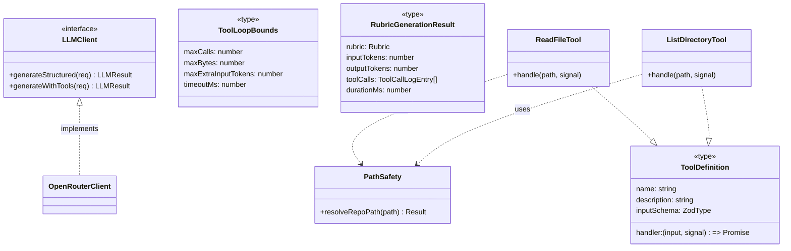

# LLD — E17: Agentic Artefact Retrieval (Tool-Use Loop)

## Change Log

| Date | Author | Changes |
|------|--------|---------|
| 2026-04-16 | LS / Claude | Initial LLD — deterministic orchestrator over strategy registry. |
| 2026-04-16 | LS / Claude | Rewritten around tool-use loop per ADR-0023. Replaces orchestrator + strategy framework with two read-only tools (`readFile`, `listDirectory`), a bounded multi-turn loop, and observability (tokens + call log + duration) on every rubric generation. Drops feasibility-spike framing, suggestion-taxonomy analysis, additional GitHub scopes. |
| 2026-04-17 | LS / Claude | Design review: (1) reframed as "augment" not "replace" — existing artefacts remain primary context, tools for gaps only. (2) Resolved all open questions. (3) E11 artefact quality evaluation consolidated into rubric generation call (ADR-0023) — §17.1e updated with combined schema, prompt guidance, and E11 removal. |

---

## Part A — Human-Reviewable

### Purpose

Augment V1's artefact assembly with **on-demand retrieval via a tool-use loop**: the rubric-generation LLM receives the existing artefact set (PR diff, PR body, linked issues, commits) as before, plus two read-only tools — `readFile` and `listDirectory` — that it may call when the provided context is insufficient to generate high-quality questions. The LLM should exhaust the supplied artefacts first and only reach for tools when it identifies gaps. No second LLM pass, no batch-suggest-then-fulfil phase, no strategy registry.

This epic also lands the observability layer (token counts, tool-call log, wall-clock duration) on every rubric generation, whether tool-use is enabled or not.

**Architectural decision:** [ADR-0023](../adr/0023-tool-use-loop-rubric-generation.md).

**Requirements:** [V2 Epic 17](../requirements/v2-requirements.md#epic-17-agentic-artefact-retrieval) — Stories 17.1 and 17.2.

### Behavioural Flow — Rubric Generation With Tool-Use Enabled

```mermaid
sequenceDiagram
  participant Caller as Assess pipeline
  participant Loop as tool-use loop<br/>(engine)
  participant LLM as LLM (OpenRouter)
  participant Tools as Tool handlers<br/>(adapter)

  Caller->>Loop: generateRubric(artefacts, tools, bounds)
  Loop->>LLM: system + user prompt + tool defs
  LLM-->>Loop: tool_call readFile("docs/adr/0014...")
  Loop->>Tools: readFile(path)
  Tools-->>Loop: { content } or { error }
  Loop->>LLM: tool_result
  LLM-->>Loop: tool_call listDirectory("docs/design")
  Loop->>Tools: listDirectory(path)
  Tools-->>Loop: { entries }
  Loop->>LLM: tool_result
  LLM-->>Loop: final structured response (rubric)
  Loop-->>Caller: { rubric, tokens, tool_calls, duration_ms }
```

Bounds enforced at the loop boundary, not the LLM:

- call count ≤ 5
- cumulative bytes ≤ 64 KiB
- extra input tokens ≤ 10 000
- wall-clock ≤ 60 s (AbortSignal)

On breach the loop returns a typed error to the LLM (not an exception) and the LLM is expected to finalise with what it has.

### Behavioural Flow — Rubric Generation With Tool-Use Disabled

```mermaid
sequenceDiagram
  participant Caller as Assess pipeline
  participant Loop as tool-use loop<br/>(engine)
  participant LLM as LLM (OpenRouter)

  Caller->>Loop: generateRubric(artefacts, tools=[], bounds)
  Loop->>LLM: system + user prompt (no tool defs)
  LLM-->>Loop: final structured response
  Loop-->>Caller: { rubric, tokens, tool_calls=[], duration_ms }
```

The tool-use loop is always the code path; passing an empty tool set is equivalent to the V1 single-shot call. Observability fields (tokens, empty call log, duration) are populated regardless.

### Structural Overview



- **Engine layer** (`src/lib/engine/llm/`, `src/lib/engine/generation/`): port types, loop, schemas. No I/O.
- **Adapter layer** (`src/lib/github/tools/`): concrete tool handlers + path-safety module. I/O allowed.
- **Composition root** (`src/app/api/fcs/service.ts`): wires concrete tools into the generate-rubric call.

### Invariants

| # | Invariant | Verification |
|---|-----------|--------------|
| 1 | The tool-use loop is the only code path into the rubric LLM — single-shot calls go through it with an empty tool set. | Unit test: non-tool path routes through `generateWithTools` with `tools=[]`. Grep: no direct `generateStructured` calls for rubric generation. |
| 2 | No tool-call argument may resolve to a path outside the repository root. | Unit tests in `path-safety.test.ts` covering absolute paths, `..`, symlinks, Windows drive letters, case variants. |
| 3 | Tool handlers never throw to the loop; all failures are typed `ToolResult` errors. | Lint: handlers return `Promise<ToolResult>`; test: every handler has a "throws internally → typed error" case. |
| 4 | Bounds are enforced at the loop, not inside the tools. | Test: a malicious tool that returns 1 MiB still triggers `budget_exhausted` on the next call, not crash. |
| 5 | Observability fields are populated on every rubric generation, including disabled path and failure paths. | Test: four scenarios (enabled/disabled × success/error) all persist non-null tokens + duration. |
| 6 | The loop is pure engine code — no `import` from `@/lib/github`, `@/lib/supabase`, or `next/*`. | CI check: grep engine dir for forbidden imports. |
| 7 | Tool-use is off by default per organisation. | Test: new org row has `tool_use_enabled = false`; pipeline reads flag before attaching tools. |
| 8 | Abort on timeout must propagate into in-flight tool calls via `AbortSignal`. | Test: a slow tool handler is cancelled when the loop's controller aborts. |
| 9 | The LLM port's `generateWithTools` method must never leak OpenRouter-specific types into the engine layer. | Type check: signature uses Zod schemas and port-owned tool types only. |
| 10 | Path allow-list logic is implemented once, in `path-safety.ts`; no ad-hoc path joins elsewhere. | Grep: `path.resolve` and `path.join` appear only inside `path-safety.ts`. |

### Acceptance Criteria (rolled up for Part B to split into tasks)

- [ ] `LLMClient` port gains `generateWithTools<T>(req): Promise<LLMResult<{ data: T, usage, toolCalls }>>`; OpenRouter adapter implements it.
- [ ] Engine-layer tool-use loop exists with 5-call / 64 KiB / 10k-token / 60s caps and typed errors for each breach.
- [ ] Adapter-layer `readFile` and `listDirectory` handlers exist, share a single `path-safety` module, and handle every case in the path-safety test matrix.
- [ ] Rubric generation flows through `generateWithTools` unconditionally; tool-use-disabled orgs pass an empty tool set.
- [ ] `assessments` table gains `rubric_input_tokens`, `rubric_output_tokens`, `rubric_tool_call_count`, `rubric_tool_calls` (jsonb), `rubric_duration_ms` columns (all populated on every rubric generation).
- [ ] `org_config` gains `tool_use_enabled boolean not null default false` and `rubric_cost_cap_cents integer not null default 20` (2× V1 baseline).
- [ ] Results page renders tool-call log when non-empty; hides the block when empty/disabled.
- [ ] Warning-coloured rendering for `forbidden_path` and `budget_exhausted` outcomes.
- [ ] `finalise_rubric_v3` RPC persists all new fields in one transaction.

### Open Questions

1. **Tokenizer choice for the `maxExtraInputTokens` cap.** The LLM's reported input-token count (from the OpenRouter response) is authoritative at finalisation but unavailable mid-loop. Pre-flight estimation is needed. Candidates: (a) simple heuristic `bytes / 4`, (b) a local tokenizer matching the target model, (c) just cap on bytes and drop the token cap. **Resolved:** go with `bytes / 4` heuristic and cap on bytes as the primary gate; token cap becomes a soft post-hoc check. Revisit after production telemetry.
2. **Whether to expose tool-call log to participants or admin-only.** Participants could find it distracting; admins want auditability. **Resolved:** admin-only for V2. Revisit if surveyed.
3. **Interaction with the E11 artefact-quality evaluator.** E11 runs a separate LLM call that also reads the artefact set, doubling input-token cost for the same artefact payload. **Resolved:** consolidate into a single call. The rubric-generation prompt produces both questions and artefact quality assessment in one structured response. Quality fields are optional in the schema — if the model omits them, quality falls back to `unavailable`. E11's dimensions, weights, and intent-adjacency invariant are preserved. The separate `evaluateArtefactQuality()` call is removed from the pipeline in §17.1e. See [ADR-0023 § Artefact quality evaluation](../adr/0023-tool-use-loop-rubric-generation.md#artefact-quality-evaluation-e11--combined-call).

---

## Part B — Agent-Implementable

### Cross-epic ordering with E11

E11 (#233) adds `finalise_rubric_v2` with artefact-quality columns. E17 (#240) adds `finalise_rubric_v3` with observability + tool-use columns. The implementing agent should check `main` at branch creation:

- If `finalise_rubric_v2` is already in `main`, add `_v3` that extends it with E17 fields.
- If `_v2` is not yet in `main`, create `_v3` that supersedes V1 directly and E11 will rebase onto it.

Either ordering is fine; the RPC is the serialisation point.

### Task breakdown

| Task | Layer | Est. size | Depends on |
|------|-------|-----------|------------|
| §17.1a — Extend `LLMClient` port with `generateWithTools` + tool types + bounded loop + typed error taxonomy | engine | ~180 lines | — |
| §17.1b — Path-safety module + `readFile` + `listDirectory` tool handlers | adapter | ~140 lines | — |
| §17.1c — OpenRouter adapter: implement `generateWithTools` (multi-turn, tool-use API) | adapter | ~160 lines | §17.1a |
| §17.1d — Schema: observability columns + `tool_use_enabled` + `rubric_cost_cap_cents` + `finalise_rubric_v3` | DB | ~120 lines | — |
| §17.1e — Pipeline integration: route rubric generation through `generateWithTools`, persist observability via `_v3` | engine+BE | ~140 lines | §17.1a, §17.1b, §17.1c, §17.1d |
| §17.2a — Org settings UI: enable flag + cost cap input | FE | ~100 lines | §17.1d |
| §17.2b — Results page: tool-call log block with warning styling | FE | ~160 lines | §17.1e |

Seven tasks. Each ≤ 200 lines. Wave plan in the epic body.

---

### §17.1a — Extend LLMClient port with tool-use loop

**Files to create:**

- `src/lib/engine/llm/tools.ts` — tool types, bounds, loop

**Files to modify:**

- `src/lib/engine/llm/types.ts` — add `generateWithTools` to `LLMClient` interface

**Engine types (to be defined in `tools.ts`):**

```typescript
import type { ZodType } from 'zod';
import type { LLMResult } from './types';

export interface ToolDefinition<TInput extends ZodType = ZodType> {
  readonly name: string;
  readonly description: string;
  readonly inputSchema: TInput;
  readonly handler: (
    input: z.infer<TInput>,
    signal: AbortSignal,
  ) => Promise<ToolResult>;
}

export type ToolResult =
  | { kind: 'ok'; content: string; bytes: number }
  | { kind: 'not_found'; similar_paths: string[]; bytes: number }
  | { kind: 'forbidden_path'; reason: string; bytes: number }
  | { kind: 'error'; message: string; bytes: number };

export interface ToolLoopBounds {
  readonly maxCalls: number;
  readonly maxBytes: number;
  readonly maxExtraInputTokens: number;
  readonly timeoutMs: number;
}

export const DEFAULT_TOOL_LOOP_BOUNDS: ToolLoopBounds = {
  maxCalls: 5,
  maxBytes: 64 * 1024,
  maxExtraInputTokens: 10_000,
  timeoutMs: 60_000,
};

export interface ToolCallLogEntry {
  readonly tool_name: string;
  readonly argument_path: string;
  readonly bytes_returned: number;
  readonly outcome: 'ok' | 'not_found' | 'forbidden_path' | 'error' | 'budget_exhausted' | 'iteration_limit_reached';
}

export interface GenerateWithToolsRequest<TSchema extends ZodType> {
  prompt: string;
  systemPrompt: string;
  schema: TSchema;
  tools: readonly ToolDefinition[];
  bounds?: Partial<ToolLoopBounds>;
  model?: string;
  maxTokens?: number;
  signal?: AbortSignal;
}

export interface GenerateWithToolsData<T> {
  data: T;
  usage: { inputTokens: number; outputTokens: number };
  toolCalls: ToolCallLogEntry[];
  durationMs: number;
}
```

**Port extension (`types.ts`):**

```typescript
export interface LLMClient {
  generateStructured<T extends ZodType>(...): Promise<LLMResult<z.infer<T>>>;

  generateWithTools<T extends ZodType>(
    req: GenerateWithToolsRequest<T>,
  ): Promise<LLMResult<GenerateWithToolsData<z.infer<T>>>>;
}
```

**Loop behaviour (implemented inside the OpenRouter adapter, §17.1c — this task defines the types only):**

1. Start wall-clock timer and controller combining caller's `signal` with internal timeout.
2. Issue LLM call with tool definitions attached; collect tool-call requests from the response.
3. For each tool call, check per-call bounds (`callCount < maxCalls`, `cumulativeBytes < maxBytes`). On breach, synthesise a `budget_exhausted` or `iteration_limit_reached` result, log it, and continue the LLM conversation (LLM should finalise next turn).
4. Invoke `toolDef.handler(args, signal)`. Catch internally — never throw from handler.
5. Append the tool result to the log; append to message history; loop.
6. Exit when the LLM returns a final structured response or any breach forces finalisation.
7. Return `GenerateWithToolsData` with tokens, tool-call log, and duration.

**BDD specs:**

```
describe('Tool loop — engine types')
  it('DEFAULT_TOOL_LOOP_BOUNDS is 5/64KiB/10k/60s as per ADR-0023')
  it('ToolResult discriminated union has exhaustive match — compile-time')
  it('ToolCallLogEntry outcomes include the six documented enum values')
  it('GenerateWithToolsRequest.bounds is partial — merges with defaults')
```

**Acceptance criteria:**

- [ ] All types exported from `tools.ts`
- [ ] `LLMClient` interface extended; no breaking change to `generateStructured`
- [ ] Engine layer still has zero framework/I/O imports

---

### §17.1b — Path-safety + readFile + listDirectory handlers

**Files to create:**

- `src/lib/github/tools/path-safety.ts` — pure function: resolves and validates a repo-relative path
- `src/lib/github/tools/read-file.ts` — tool definition using the Octokit contents API
- `src/lib/github/tools/list-directory.ts` — tool definition using the Octokit contents API
- `src/lib/github/tools/__tests__/path-safety.test.ts` — exhaustive path-safety matrix
- `src/lib/github/tools/__tests__/read-file.test.ts`
- `src/lib/github/tools/__tests__/list-directory.test.ts`

**Path-safety contract:**

```typescript
export type PathSafetyResult =
  | { ok: true; normalised: string }
  | { ok: false; reason: 'absolute' | 'traversal' | 'empty' | 'invalid_chars' };

export function resolveRepoPath(raw: string): PathSafetyResult;
```

Rejections (non-exhaustive; the test matrix is the contract):

- Absolute paths: `/etc/passwd`, `C:/Windows/System32`
- Traversal: `../../../etc/passwd`, `docs/../../etc`
- Empty: `""`, `"   "`
- Null bytes, control characters
- Symlink resolution is delegated to GitHub adapter (GitHub contents API will not follow them across repo boundary)

**Handler pattern (readFile):**

```typescript
export function makeReadFileTool(octokit: Octokit, repo: RepoRef): ToolDefinition {
  return {
    name: 'readFile',
    description: 'Read a file from the assessment repository by repo-relative path.',
    inputSchema: z.object({ path: z.string() }),
    handler: async ({ path }, signal) => {
      const safe = resolveRepoPath(path);
      if (!safe.ok) return { kind: 'forbidden_path', reason: safe.reason, bytes: 0 };
      try {
        const { data } = await octokit.rest.repos.getContent({ ...repo, path: safe.normalised, request: { signal } });
        if (Array.isArray(data) || data.type !== 'file') {
          return { kind: 'error', message: 'path is not a file', bytes: 0 };
        }
        const content = Buffer.from(data.content, 'base64').toString('utf-8');
        return { kind: 'ok', content, bytes: content.length };
      } catch (err) {
        if (isNotFound(err)) {
          const similar = await suggestSimilarPaths(octokit, repo, safe.normalised);
          return { kind: 'not_found', similar_paths: similar, bytes: 0 };
        }
        return { kind: 'error', message: toMessage(err), bytes: 0 };
      }
    },
  };
}
```

**BDD specs:**

```
describe('path-safety')
  it('accepts docs/adr/0014-api-routes.md')
  it('rejects /etc/passwd (absolute)')
  it('rejects C:/Windows (absolute, Windows)')
  it('rejects ../secrets')
  it('rejects docs/../../etc')
  it('rejects empty string')
  it('rejects whitespace-only string')
  it('rejects paths containing null bytes')
  it('normalises docs//adr//0014.md to docs/adr/0014.md')

describe('readFile tool')
  it('returns kind=ok with content + bytes on valid path')
  it('returns kind=forbidden_path when path-safety rejects')
  it('returns kind=not_found with up to 5 similar paths on 404')
  it('returns kind=error when the API call fails')
  it('returns kind=error when the path resolves to a directory')
  it('propagates AbortSignal to the Octokit request')
  it('never throws — verified by a handler that always throws internally returning kind=error')

describe('listDirectory tool')
  it('returns entries as { name, kind } pairs')
  it('returns kind=forbidden_path for unsafe paths')
  it('returns kind=not_found for missing directories')
  it('returns kind=error when the path resolves to a file')
  it('never throws')
```

**Acceptance criteria:**

- [ ] Path-safety module rejects every case in the test matrix
- [ ] Both tools return typed results for every failure mode; no thrown exceptions reach the loop
- [ ] `AbortSignal` flows into Octokit requests
- [ ] All imports are inside `src/lib/github/tools/` or its test subdir; engine layer unaffected

---

### §17.1c — OpenRouter adapter: generateWithTools

**Files to modify:**

- `src/lib/llm/openrouter-client.ts` (or equivalent existing adapter file) — add `generateWithTools` method
- Add tests covering the loop mechanics using a fake HTTP client

**Loop implementation (pseudocode):**

```typescript
async generateWithTools<T>(req: GenerateWithToolsRequest<T>): Promise<...> {
  const bounds = { ...DEFAULT_TOOL_LOOP_BOUNDS, ...req.bounds };
  const start = Date.now();
  const controller = combineSignals(req.signal, AbortSignal.timeout(bounds.timeoutMs));
  let callCount = 0, cumulativeBytes = 0;
  const toolCalls: ToolCallLogEntry[] = [];
  const messages = [systemPrompt, userPrompt];
  const toolDefsForAPI = req.tools.map(toOpenRouterToolDef);

  while (true) {
    const resp = await openrouterChat({ messages, tools: toolDefsForAPI, signal: controller.signal });
    if (resp.tool_calls?.length) {
      for (const tc of resp.tool_calls) {
        if (callCount >= bounds.maxCalls) {
          toolCalls.push({ tool_name: tc.name, argument_path: tc.args.path ?? '', bytes_returned: 0, outcome: 'iteration_limit_reached' });
          messages.push({ role: 'tool', tool_call_id: tc.id, content: '{"error":"iteration_limit_reached"}' });
          continue;
        }
        if (cumulativeBytes >= bounds.maxBytes) {
          toolCalls.push({ tool_name: tc.name, argument_path: tc.args.path ?? '', bytes_returned: 0, outcome: 'budget_exhausted' });
          messages.push({ role: 'tool', tool_call_id: tc.id, content: '{"error":"budget_exhausted"}' });
          continue;
        }
        const def = req.tools.find(d => d.name === tc.name);
        if (!def) {
          messages.push({ role: 'tool', tool_call_id: tc.id, content: '{"error":"unknown_tool"}' });
          continue;
        }
        const parsed = def.inputSchema.safeParse(tc.args);
        if (!parsed.success) { /* error entry, continue */ }
        const result = await def.handler(parsed.data, controller.signal);
        callCount += 1;
        cumulativeBytes += result.bytes;
        toolCalls.push({ tool_name: tc.name, argument_path: parsed.data.path, bytes_returned: result.bytes, outcome: result.kind });
        messages.push({ role: 'tool', tool_call_id: tc.id, content: JSON.stringify(result) });
      }
      messages.push(resp.assistantMessage);
      continue; // next LLM turn
    }
    // Final response — validate against schema
    const parsed = req.schema.safeParse(resp.parsed);
    if (!parsed.success) return { success: false, error: { code: 'malformed_response', ... } };
    return {
      success: true,
      data: {
        data: parsed.data,
        usage: { inputTokens: resp.usage.input, outputTokens: resp.usage.output },
        toolCalls,
        durationMs: Date.now() - start,
      },
    };
  }
}
```

**BDD specs:**

```
describe('OpenRouter generateWithTools')
  it('returns the final structured response when LLM does not call any tools')
  it('invokes handlers for each tool call and feeds results back')
  it('stops invoking handlers after maxCalls; logs iteration_limit_reached')
  it('stops invoking handlers after maxBytes; logs budget_exhausted')
  it('aborts in-flight handlers when timeoutMs elapses')
  it('returns malformed_response error when LLM final output fails schema validation')
  it('records input + output token usage from the LLM response')
  it('records durationMs from wall-clock')
```

**Acceptance criteria:**

- [ ] Method implemented on the OpenRouter adapter
- [ ] All tests pass using a fake HTTP client (no real network)
- [ ] No engine-layer imports leak into OpenRouter-specific types
- [ ] Existing `generateStructured` behaviour unchanged

---

### §17.1d — Schema: observability + flags + finalise_rubric_v3

**Files to modify:**

- `supabase/schemas/tables.sql` — add columns to `assessments` and `org_config`
- `supabase/schemas/functions.sql` — add `finalise_rubric_v3`

**Column additions:**

```sql
-- assessments
alter table assessments add column rubric_input_tokens integer null;
alter table assessments add column rubric_output_tokens integer null;
alter table assessments add column rubric_tool_call_count integer null;
alter table assessments add column rubric_tool_calls jsonb null;
alter table assessments add column rubric_duration_ms integer null;

-- org_config
alter table org_config add column tool_use_enabled boolean not null default false;
alter table org_config add column rubric_cost_cap_cents integer not null default 20;
```

(Declarative: edit `supabase/schemas/tables.sql` directly; run `npx supabase db diff -f e17_observability_tool_use`.)

**RPC:**

```sql
create or replace function finalise_rubric_v3(
  p_assessment_id uuid,
  p_questions jsonb,
  p_artefact_quality_score integer,       -- from E11 if in main, else null
  p_artefact_quality_dimensions jsonb,
  p_additional_context_suggestions jsonb,
  p_rubric_input_tokens integer,
  p_rubric_output_tokens integer,
  p_rubric_tool_call_count integer,
  p_rubric_tool_calls jsonb,
  p_rubric_duration_ms integer
) returns void
language plpgsql security definer set search_path = public as $$
begin
  update assessments set
    questions = p_questions,
    artefact_quality_score = p_artefact_quality_score,
    artefact_quality_dimensions = p_artefact_quality_dimensions,
    additional_context_suggestions = p_additional_context_suggestions,
    rubric_input_tokens = p_rubric_input_tokens,
    rubric_output_tokens = p_rubric_output_tokens,
    rubric_tool_call_count = p_rubric_tool_call_count,
    rubric_tool_calls = p_rubric_tool_calls,
    rubric_duration_ms = p_rubric_duration_ms,
    status = 'ready'
  where id = p_assessment_id;
end;
$$;
```

**BDD specs:**

```
describe('schema: E17 observability')
  it('assessments.rubric_input_tokens defaults to null on legacy rows')
  it('org_config.tool_use_enabled defaults to false')
  it('org_config.rubric_cost_cap_cents defaults to 20')
  it('finalise_rubric_v3 persists all observability fields in one call')
  it('finalise_rubric_v3 accepts null for E11 columns (cross-epic ordering)')
  it('legacy finalise_rubric_v2 still works (no breaking change)')
```

**Acceptance criteria:**

- [ ] All new columns added declaratively
- [ ] Migration generated via `npx supabase db diff`, not hand-authored
- [ ] `db reset` + `db diff` shows zero drift after migration applied
- [ ] RPC callable from the service layer

---

### §17.1e — Pipeline integration + observability persistence + E11 consolidation

**Files to modify:**

- `src/lib/engine/generation/generate-questions.ts` — route through `generateWithTools`; extend response schema to include artefact quality fields
- `src/lib/engine/pipeline/assess-pipeline.ts` — thread observability into the persisted rubric; remove parallel `evaluateArtefactQuality()` call
- `src/app/api/fcs/service.ts` — wire concrete tools + call `finalise_rubric_v3`
- `src/lib/engine/llm/schemas.ts` — extend `QuestionGenerationResponseSchema` with optional quality dimensions
- Tests for engine, service, and combined-call fallback behaviour

**Prompt guidance (augment, not replace):**

The rubric-generation system prompt must instruct the LLM to treat the provided artefacts as primary context and only use tools when the supplied information is insufficient to generate high-quality, specific questions. This prevents eager tool calls when the PR diff + issues already contain everything needed.

**E11 consolidation (combined call):**

The separate `evaluateArtefactQuality()` LLM call is removed from the pipeline. Artefact quality assessment is folded into the rubric-generation response schema as **optional fields**:

```typescript
// Added to QuestionGenerationResponseSchema
artefact_quality_score: z.number().int().min(0).max(100).optional(),
artefact_quality_dimensions: z.array(ArtefactQualityDimensionSchema).optional(),
```

- If the model produces quality fields → use them (same dimensions, weights, and intent-adjacency invariant as E11).
- If the model omits them → `artefact_quality_score = null` (renders as `unavailable` on the results page, same as E11's failure fallback).
- E11's prompt guidance for the six dimensions and intent-adjacent weighting (≥ 60%) is incorporated into the rubric-generation system prompt.
- The existing `evaluateArtefactQuality()` function is deleted along with its dedicated test file.

**Engine change (generate-questions.ts):**

The existing function switches from `generateStructured` to `generateWithTools`, always. When tool-use is disabled for the org, the service layer passes `tools=[]` and the loop degenerates to a single-shot call. The engine layer has no awareness of the flag.

```typescript
export async function generateQuestions(request: GenerateQuestionsRequest): Promise<LLMResult<GenerateQuestionsData>> {
  const result = await llmClient.generateWithTools({
    systemPrompt,
    prompt: userPrompt,
    schema: RubricGenerationResponseSchema, // extended with optional quality fields
    tools: request.tools,     // empty array if org has flag off
    bounds: request.bounds,   // optional override
    signal: request.signal,
    model,
    maxTokens,
  });
  if (!result.success) return result;
  return {
    success: true,
    data: {
      ...result.data.data,
      _usage: result.data.usage,
      _toolCalls: result.data.toolCalls,
      _durationMs: result.data.durationMs,
    },
  };
}
```

**Service change (fcs/service.ts):**

```typescript
const orgConfig = await ctx.supabase.from('org_config').select('tool_use_enabled, rubric_cost_cap_cents').eq('org_id', orgId).single();
const tools = orgConfig.data?.tool_use_enabled
  ? [makeReadFileTool(octokit, repo), makeListDirectoryTool(octokit, repo)]
  : [];
const bounds = orgConfig.data?.rubric_cost_cap_cents
  ? { ...DEFAULT_TOOL_LOOP_BOUNDS, /* derive maxExtraInputTokens from cost cap */ }
  : undefined;
// Single call — produces questions + artefact quality (optional)
const rubric = await generateRubric({ artefacts, llmClient, tools, bounds });
// ... on success:
await ctx.adminSupabase.rpc('finalise_rubric_v3', {
  p_assessment_id: id,
  p_questions: rubric.questions,
  p_artefact_quality_score: rubric.artefact_quality_score ?? null,
  p_artefact_quality_dimensions: rubric.artefact_quality_dimensions ?? null,
  p_additional_context_suggestions: rubric.additional_context_suggestions ?? [],
  p_rubric_input_tokens: rubric._usage.inputTokens,
  p_rubric_output_tokens: rubric._usage.outputTokens,
  p_rubric_tool_call_count: rubric._toolCalls.length,
  p_rubric_tool_calls: rubric._toolCalls,
  p_rubric_duration_ms: rubric._durationMs,
});
```

**BDD specs:**

```
describe('Pipeline integration — rubric generation')
  it('passes empty tool set when tool_use_enabled is false')
  it('passes readFile + listDirectory when tool_use_enabled is true')
  it('persists rubric_input_tokens + rubric_output_tokens on every successful generation')
  it('persists rubric_tool_call_count = 0 when no tools were called')
  it('persists rubric_tool_calls as jsonb array matching the log entries')
  it('persists rubric_duration_ms as a positive integer')
  it('does not call finalise_rubric_v3 on generation failure — legacy error path unchanged')

describe('Pipeline integration — E11 quality in combined call')
  it('persists artefact_quality_score when model produces it')
  it('persists artefact_quality_dimensions with all six dimensions')
  it('sets artefact_quality_score to null when model omits quality fields')
  it('intent-adjacent dimensions contribute >= 60% of aggregate weight')
  it('does not invoke evaluateArtefactQuality as a separate call')
```

**Acceptance criteria:**

- [ ] All rubric generations go through `generateWithTools` (no direct `generateStructured` for questions)
- [ ] Observability persisted whether tool-use enabled or disabled
- [ ] Failure modes unchanged from V1 (no new error paths visible to callers)
- [ ] Artefact quality produced by the same call; optional schema fields fall back to `unavailable`
- [ ] Separate `evaluateArtefactQuality()` call removed from the pipeline
- [ ] E11 quality dimensions and intent-adjacency invariant preserved in prompt

---

### §17.2a — Org settings UI: enable flag + cost cap input

**Files to modify:**

- `src/app/(app)/orgs/[orgId]/settings/page.tsx` — add two inputs
- `src/app/api/orgs/[orgId]/settings/service.ts` — accept + persist
- `src/lib/api/contracts/org-settings.ts` — extend Zod schema

**BDD specs:**

```
describe('Org settings: tool-use + cost cap')
  it('toggles tool_use_enabled on form submission (admins only)')
  it('rejects rubric_cost_cap_cents below 0 or above 500')
  it('non-admins cannot toggle or edit (RLS)')
  it('shows current values on initial render')
```

**Acceptance criteria:**

- [ ] Toggle + numeric input rendered
- [ ] RLS-enforced admin-only edits
- [ ] Values round-trip correctly

---

### §17.2b — Results page: tool-call log block

**Files to modify/create:**

- `src/app/(app)/assessments/[id]/page.tsx` — conditionally render the block
- `src/components/assessment/ToolCallLogCard.tsx` — new component
- `src/lib/api/contracts/assessment.ts` — extend response shape
- `src/app/api/assessments/[id]/service.ts` — include observability fields in response

**Component behaviour:**

- Hidden when `rubric_tool_call_count === 0` OR `rubric_tool_call_count === null` (legacy).
- Header row: total calls, total bytes, total extra tokens (approx), duration (ms).
- Expandable list: each entry shown as `{ tool_name } { argument_path } → { outcome }`.
- `forbidden_path` and `budget_exhausted` outcomes rendered with warning colour (yellow/red per the design system).

**BDD specs:**

```
describe('Results page — tool-call log')
  it('hides the block when rubric_tool_call_count is 0')
  it('hides the block when rubric_tool_call_count is null (legacy assessment)')
  it('shows the header with total calls + bytes + duration')
  it('lists each call in the expandable section')
  it('renders forbidden_path outcomes with warning styling')
  it('renders budget_exhausted outcomes with warning styling')
  it('renders ok outcomes with normal styling')
```

**Acceptance criteria:**

- [ ] Block rendered only when data present
- [ ] Warning colouring distinguishes policy breaches
- [ ] Legacy assessments render without errors
- [ ] Component tests cover every outcome variant
