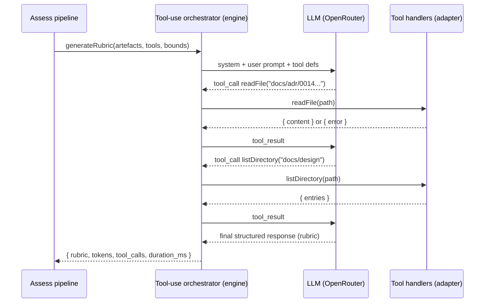
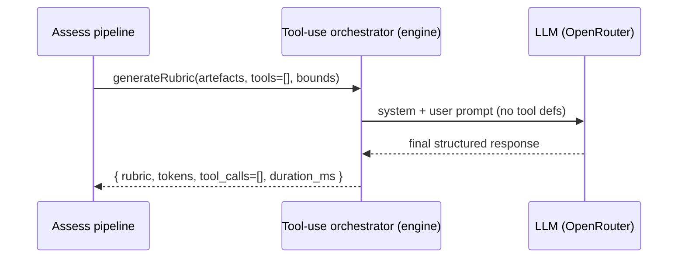
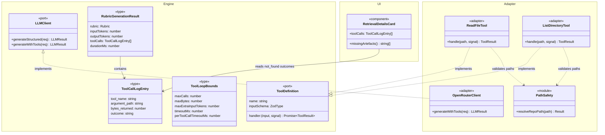

# LLD — E17: Agentic Artefact Retrieval (Tool-Use Loop)

## Change Log

| Date | Author | Changes |
|------|--------|---------|
| 2026-04-16 | LS / Claude | Initial LLD — deterministic orchestrator over strategy registry. |
| 2026-04-16 | LS / Claude | Rewritten around tool-use loop per ADR-0023. Replaces orchestrator + strategy framework with two read-only tools (`readFile`, `listDirectory`), a bounded multi-turn loop, and observability (tokens + call log + duration) on every rubric generation. Drops feasibility-spike framing, suggestion-taxonomy analysis, additional GitHub scopes. |
| 2026-04-17 | LS / Claude | Design review: (1) reframed as "augment" not "replace" — existing artefacts remain primary context, tools for gaps only. (2) Resolved all open questions. (3) E11 artefact quality evaluation consolidated into rubric generation call (ADR-0023) — §17.1e updated with combined schema, prompt guidance, and E11 removal. |
| 2026-04-18 | LS / Claude | Requirements v0.5 alignment: (1) E11 cancelled — stripped all quality-scoring refs from §17.1d, §17.1e, invariants, ACs. (2) Tool-call log replaces quality scoring as feedback mechanism (`not_found` → "Missing artefacts" summary). (3) Timeout split: 120s whole-loop default (configurable per org) + 10s per-call fixed. (4) Added `retrieval_timeout_seconds` to org_config + §17.2a UI. (5) Added "Missing artefacts" summary to §17.2b. (6) Added actor clarification (GitHub App installation token) and repo-scoping AC to §17.1b. (7) Added `warn`-level logging for `iteration_limit_reached`. |
| 2026-04-19 | LS / Claude | §17.1d sync (issue #243): corrected RPC signature to match implementation — added `p_org_id`, removed non-existent `p_additional_context_suggestions`, changed status target from `'ready'` to `'awaiting_responses'`, documented that questions are inserted into `assessment_questions` (not updated as a column), added CHECK bounds on the two numeric org_config columns, noted the PostgreSQL overload (legacy 3-arg form preserved). |
| 2026-04-19 | LS / Claude | Post-implementation sync for issue #249: §17.1b aligned with adapter as built — test files under `tests/lib/github/tools/` (project convention), shared `octokit-contents.ts` helper extracted during dedup, manual URL-segment encoding via `octokit.request` (Octokit's `{path}` placeholder encodes `/` as `%2F` and mis-routes), adapter-local `types.ts` for `ToolResult`/`ToolDefinition` while engine port (#245) is parallel. Future enhancement #266 tracked: batched multi-file retrieval via GraphQL. |
| 2026-04-19 | Claude | §17.1a sync (issue #245): (1) promoted `ToolCallOutcome` to a named type alias — not in the original spec; keeps the six outcome literals single-sourced across `ToolResult.kind`, `ToolCallLogEntry.outcome`, and the logging/metric paths. (2) All type fields marked `readonly` for type-level immutability. (3) Concrete `OpenRouterClient.generateWithTools` ships as an explicit stub throwing `'not implemented — see §17.1c'` so the port contract is honoured while runtime behaviour is deferred to §17.1c. |
| 2026-04-19 | LS / Claude | §17.2a sync (issue #251): corrected file paths — implementation lives under `(authenticated)/organisation/` + `api/organisations/[id]/retrieval-settings/` (sibling to `context/` route) with the Zod schema in `src/lib/supabase/org-retrieval-settings.ts`. Original LLD paths (`(app)/orgs/[orgId]/settings/…`, `src/lib/api/contracts/org-settings.ts`) did not match the codebase. Added explicit internal decomposition: service re-exports schema/type/defaults per ADR-0014; page uses `loadOrgRetrievalSettings` for SSR hydration. |
| 2026-04-19 | Claude | §17.1c sync (issue #250): loop extracted to a dedicated pure module `src/lib/engine/llm/tool-loop.ts` (adapter file became a thin delegator); internal SDK-shape types (`SdkRequest`/`SdkResponse`/`SdkAssistantMessage`/`SdkToolCallRequest`/`SdkUsage`/`ChatCallFn`) keep OpenAI types out of the loop module; decomposed `executeToolCall` into sub-helpers (`parseToolInput`, `runHandler`, `recordOutcome`, `pushToolMessage`, `breach`, `processOneToolCall`) to fit the 20-line function budget; budget check switched to predictive heuristic (`cumulativeBytes + lastBytesReturned >= maxBytes`); manual `setTimeout + AbortController` instead of `AbortSignal.timeout()` (vitest fake timers don't mock the latter) with `.unref()` so the timer does not hold the Node event loop open; turn cap `maxCalls + 2` replaces the `while (true)` sketch; message ordering corrected — assistant message pushed before tool responses (OpenAI Chat Completions requires the assistant-with-tool_calls turn to precede the matching `role:'tool'` messages). |
| 2026-04-19 | LS / Claude | §17.1e sync (issue #246): engine emits flat observability fields (`inputTokens`, `outputTokens`, `toolCalls`, `durationMs`) via a `GenerateQuestionsData = QuestionGenerationResponse & { ... }` intersection — not the `_usage`/`_toolCalls`/`_durationMs` shape sketched in the LLD; schema reference corrected to `QuestionGenerationResponseSchema`; service reads org settings via `loadOrgRetrievalSettings` helper rather than an inline `org_config` query; service decomposed into `buildRubricTools` + `persistRubricFinalisation` helpers to keep `finaliseRubric` under the 20-line budget; `bounds` is a `Partial<ToolLoopBounds>` with only `timeoutMs` set (cost-cap → `maxExtraInputTokens` derivation not wired — deferred); `src/lib/github/tools/types.ts` now re-exports `ToolDefinition`/`ToolResult` from `@/lib/engine/llm/tools` (the adapter-local duplicate would break handler variance when composed through the engine's `GenerateWithToolsRequest`). |
| 2026-04-19 | LS / Claude | §17.2b sync (issue #247): corrected results-page path — the FCS results page is `src/app/assessments/[id]/results/page.tsx` (no `(app)` route group) and reads the observability columns directly from Supabase via the secret server client, so no changes were required to `src/lib/api/contracts/assessment.ts` or `src/app/api/assessments/[id]/service.ts`. Component imports `ToolCallLogEntry`/`ToolCallOutcome` from `@/lib/engine/llm/tools` and narrows the `rubric_tool_calls` JSONB column at the page boundary. Warning styling uses Tailwind `text-destructive`; `iteration_limit_reached` included alongside `forbidden_path` and `budget_exhausted` in the warning set (the LLD component-behaviour bullet omitted it but the BDD specs required it). |

---

## Part A — Human-Reviewable

### Purpose

Augment V1's artefact assembly with **on-demand retrieval via a tool-use loop**: the rubric-generation LLM receives the existing artefact set (PR diff, PR body, linked issues, commits) as before, plus two read-only tools — `readFile` and `listDirectory` — that it may call when the provided context is insufficient to generate high-quality questions. The LLM should exhaust the supplied artefacts first and only reach for tools when it identifies gaps. Tool calls execute via the **GitHub App installation token** scoped to the assessment's repository. No second LLM pass, no batch-suggest-then-fulfil phase, no strategy registry.

This epic also lands the observability layer (token counts, tool-call log, wall-clock duration) on every rubric generation, whether tool-use is enabled or not. The tool-call log doubles as the artefact-quality feedback mechanism: `not_found` outcomes indicate artefacts the LLM expected but could not find, surfaced as a "Missing artefacts" summary on the results page.

**Architectural decision:** [ADR-0023](../adr/0023-tool-use-loop-rubric-generation.md).

**Requirements:** [V2 Epic 17](../requirements/v2-requirements.md#epic-17-agentic-artefact-retrieval) — Stories 17.1 and 17.2.

### Behavioural Flow — Rubric Generation With Tool-Use Enabled



Bounds enforced at the loop boundary, not the LLM:

- call count ≤ 5
- cumulative bytes ≤ 64 KiB
- extra input tokens ≤ 10 000
- whole-loop wall-clock ≤ 120 s (configurable per org via `retrieval_timeout_seconds`; enforced via `AbortSignal`)
- per-tool-call timeout: 10 s fixed (a single slow tool handler does not consume the entire budget)

On breach the loop returns a typed error to the LLM (not an exception) and the LLM is expected to finalise with what it has. `iteration_limit_reached` breaches are logged at `warn` level with the assessment ID.

### Behavioural Flow — Rubric Generation With Tool-Use Disabled



The tool-use loop is always the code path; passing an empty tool set is equivalent to the V1 single-shot call. Observability fields (tokens, empty call log, duration) are populated regardless.

### Structural Overview



- **Engine** (`src/lib/engine/llm/`, `src/lib/engine/generation/`): ports + types. No I/O, no framework imports.
- **Adapter** (`src/lib/github/tools/`, `src/lib/llm/openrouter/`): concrete tool handlers, path-safety, OpenRouter client. I/O allowed.
- **UI** (`src/app/.../RetrievalDetailsCard.tsx`): reads `ToolCallLogEntry[]`, derives "Missing artefacts" from `not_found` outcomes.
- **Composition root** (`src/app/api/fcs/service.ts`): wires adapter tools into the engine's `generateWithTools` call.

### Invariants

| # | Invariant | Verification |
|---|-----------|--------------|
| 1 | The tool-use loop is the only code path into the rubric LLM — single-shot calls go through it with an empty tool set. | Unit test: non-tool path routes through `generateWithTools` with `tools=[]`. Grep: no direct `generateStructured` calls for rubric generation. |
| 2 | No tool-call argument may resolve to a path outside the repository root. | Unit tests in `path-safety.test.ts` covering absolute paths, `..`, symlinks, Windows drive letters, case variants. |
| 3 | Tool handlers never throw to the loop; all failures are typed `ToolResult` errors. | Lint: handlers return `Promise<ToolResult>`; test: every handler has a "throws internally → typed error" case. |
| 4 | Bounds are enforced at the loop, not inside the tools. | Test: a malicious tool that returns 1 MiB still triggers `budget_exhausted` on the next call, not crash. |
| 5 | Observability fields are populated on every rubric generation, including disabled path and failure paths. | Test: four scenarios (enabled/disabled × success/error) all persist non-null tokens + duration. |
| 6 | The loop is pure engine code — no `import` from `@/lib/github`, `@/lib/supabase`, or `next/*`. | CI check: grep engine dir for forbidden imports. |
| 7 | Tool-use is off by default per organisation. | Test: new org row has `tool_use_enabled = false`; pipeline reads flag before attaching tools. |
| 8 | Abort on timeout must propagate into in-flight tool calls via `AbortSignal`. Whole-loop timeout is configurable (default 120s); per-tool-call timeout is fixed at 10s. | Test: a slow tool handler is cancelled when the loop's controller aborts; per-tool-call timeout fires before whole-loop timeout. |
| 9 | The LLM port's `generateWithTools` method must never leak OpenRouter-specific types into the engine layer. | Type check: signature uses Zod schemas and port-owned tool types only. |
| 10 | Path allow-list logic is implemented once, in `path-safety.ts`; no ad-hoc path joins elsewhere. | Grep: `path.resolve` and `path.join` appear only inside `path-safety.ts`. |

### Acceptance Criteria (rolled up for Part B to split into tasks)

- [ ] `LLMClient` port gains `generateWithTools<T>(req): Promise<LLMResult<{ data: T, usage, toolCalls }>>`; OpenRouter adapter implements it.
- [ ] Engine-layer tool-use loop exists with 5-call / 64 KiB / 10k-token / 120s caps and typed errors for each breach. Per-tool-call timeout 10s fixed.
- [ ] Adapter-layer `readFile` and `listDirectory` handlers exist, share a single `path-safety` module, and handle every case in the path-safety test matrix. Tool calls scoped to the assessment's repository via GitHub App installation token.
- [ ] Rubric generation flows through `generateWithTools` unconditionally; tool-use-disabled orgs pass an empty tool set.
- [ ] `assessments` table gains `rubric_input_tokens`, `rubric_output_tokens`, `rubric_tool_call_count`, `rubric_tool_calls` (jsonb), `rubric_duration_ms` columns (all populated on every rubric generation).
- [ ] `org_config` gains `tool_use_enabled boolean not null default false`, `rubric_cost_cap_cents integer not null default 20` (2× V1 baseline), and `retrieval_timeout_seconds integer not null default 120`.
- [ ] Results page renders tool-call log in a collapsible "Retrieval details" section when non-empty; hides the block when empty/disabled.
- [ ] "Missing artefacts" summary appears at the top of the retrieval details section when `not_found` outcomes exist.
- [ ] Warning-coloured rendering for `forbidden_path` and `budget_exhausted` outcomes.
- [ ] `finalise_rubric` RPC persists all new fields in one transaction.
- [ ] `iteration_limit_reached` logged at `warn` level with assessment ID.

### Open Questions

1. **Tokenizer choice for the `maxExtraInputTokens` cap.** The LLM's reported input-token count (from the OpenRouter response) is authoritative at finalisation but unavailable mid-loop. Pre-flight estimation is needed. Candidates: (a) simple heuristic `bytes / 4`, (b) a local tokenizer matching the target model, (c) just cap on bytes and drop the token cap. **Resolved:** go with `bytes / 4` heuristic and cap on bytes as the primary gate; token cap becomes a soft post-hoc check. Revisit after production telemetry.
2. **Whether to expose tool-call log to participants or admin-only.** Participants could find it distracting; admins want auditability. **Resolved:** admin-only for V2. Revisit if surveyed.
3. **Interaction with the E11 artefact-quality evaluator.** **Resolved:** E11 cancelled (2026-04-18). Artefact quality feedback comes from the tool-call log — `not_found` outcomes are surfaced as a "Missing artefacts" summary on the results page. No quality-scoring LLM call required.

---

## Part B — Agent-Implementable

### Cross-epic note

E11 (#233, Artefact Quality Scoring) is cancelled. The existing `finalise_rubric` RPC is extended with observability params via `CREATE OR REPLACE` — no E11 columns, no version suffix needed.

### Task breakdown

| Task | Layer | Est. size | Depends on |
|------|-------|-----------|------------|
| §17.1a — Extend `LLMClient` port with `generateWithTools` + tool types + bounded loop + typed error taxonomy | engine | ~180 lines | — |
| §17.1b — Path-safety module + `readFile` + `listDirectory` tool handlers | adapter | ~140 lines | — |
| §17.1c — OpenRouter adapter: implement `generateWithTools` (multi-turn, tool-use API) | adapter | ~160 lines | §17.1a |
| §17.1d — Schema: observability columns + `tool_use_enabled` + `rubric_cost_cap_cents` + `finalise_rubric` | DB | ~120 lines | — |
| §17.1e — Pipeline integration: route rubric generation through `generateWithTools`, persist observability via `_v3` | engine+BE | ~120 lines | §17.1a, §17.1b, §17.1c, §17.1d |
| §17.2a — Org settings UI: "Retrieval" section (toggle + cost cap + loop timeout) | FE | ~120 lines | §17.1d |
| §17.2b — Results page: collapsible "Retrieval details" section + "Missing artefacts" summary | FE | ~180 lines | §17.1e |

Seven tasks. Each ≤ 200 lines. Wave plan in the epic body.

---

### §17.1a — Extend LLMClient port with tool-use loop

**Files to create:**

- `src/lib/engine/llm/tools.ts` — tool types, bounds, loop

**Files to modify:**

- `src/lib/engine/llm/types.ts` — add `generateWithTools` to `LLMClient` interface

**Engine types (to be defined in `tools.ts`):**

```typescript
import type { ZodType } from 'zod';
import type { LLMResult } from './types';

export interface ToolDefinition<TInput extends ZodType = ZodType> {
  readonly name: string;
  readonly description: string;
  readonly inputSchema: TInput;
  readonly handler: (
    input: z.infer<TInput>,
    signal: AbortSignal,
  ) => Promise<ToolResult>;
}

export type ToolCallOutcome =
  | 'ok'
  | 'not_found'
  | 'forbidden_path'
  | 'error'
  | 'budget_exhausted'
  | 'iteration_limit_reached';

export type ToolResult =
  | { readonly kind: 'ok'; readonly content: string; readonly bytes: number }
  | { readonly kind: 'not_found'; readonly similar_paths: readonly string[]; readonly bytes: number }
  | { readonly kind: 'forbidden_path'; readonly reason: string; readonly bytes: number }
  | { readonly kind: 'error'; readonly message: string; readonly bytes: number };

export interface ToolLoopBounds {
  readonly maxCalls: number;
  readonly maxBytes: number;
  readonly maxExtraInputTokens: number;
  readonly timeoutMs: number;
  readonly perToolCallTimeoutMs: number;
}

export const DEFAULT_TOOL_LOOP_BOUNDS: ToolLoopBounds = {
  maxCalls: 5,
  maxBytes: 64 * 1024,
  maxExtraInputTokens: 10_000,
  timeoutMs: 120_000,
  perToolCallTimeoutMs: 10_000,
};

export type ToolCallOutcome =
  | 'ok'
  | 'not_found'
  | 'forbidden_path'
  | 'error'
  | 'budget_exhausted'
  | 'iteration_limit_reached';

export interface ToolCallLogEntry {
  readonly tool_name: string;
  readonly argument_path: string;
  readonly bytes_returned: number;
  readonly outcome: ToolCallOutcome;
}

export interface GenerateWithToolsRequest<TSchema extends ZodType> {
  prompt: string;
  systemPrompt: string;
  schema: TSchema;
  tools: readonly ToolDefinition[];
  bounds?: Partial<ToolLoopBounds>;
  model?: string;
  maxTokens?: number;
  signal?: AbortSignal;
}

export interface GenerateWithToolsData<T> {
  data: T;
  usage: { inputTokens: number; outputTokens: number };
  toolCalls: ToolCallLogEntry[];
  durationMs: number;
}
```

**Port extension (`types.ts`):**

```typescript
export interface LLMClient {
  generateStructured<T extends ZodType>(...): Promise<LLMResult<z.infer<T>>>;

  generateWithTools<T extends ZodType>(
    req: GenerateWithToolsRequest<T>,
  ): Promise<LLMResult<GenerateWithToolsData<z.infer<T>>>>;
}
```

> **Implementation note (issue #245):** Types in `tools.ts` are exported with `readonly`
> modifiers throughout to make the contract immutable at the type level. A named
> `ToolCallOutcome` type alias was extracted from the original inline literal union so
> consumers can reference the outcome set by name; the six literals are otherwise
> unchanged. The concrete `OpenRouterClient.generateWithTools` lands as an explicit stub
> throwing `not implemented — see §17.1c` to preserve the port contract while runtime
> behaviour is deferred; matching stubs were added to the test mock client and inline
> `LLMClient` literals in the pipeline tests.

**Loop behaviour (implemented inside the OpenRouter adapter, §17.1c — this task defines the types only):**

1. Start wall-clock timer and controller combining caller's `signal` with internal timeout.
2. Issue LLM call with tool definitions attached; collect tool-call requests from the response.
3. For each tool call, check per-tool-call bounds (`callCount < maxCalls`, `cumulativeBytes < maxBytes`). On breach, synthesise a `budget_exhausted` or `iteration_limit_reached` result, log it, and continue the LLM conversation (LLM should finalise next turn).
4. Invoke `toolDef.handler(args, signal)`. Catch internally — never throw from handler.
5. Append the tool result to the log; append to message history; loop.
6. Exit when the LLM returns a final structured response or any breach forces finalisation.
7. Return `GenerateWithToolsData` with tokens, tool-call log, and duration.

**BDD specs:**

```
describe('Tool loop — engine types')
  it('DEFAULT_TOOL_LOOP_BOUNDS is 5/64KiB/10k/120s/10s-per-tool-call as per requirements v0.5')
  it('ToolResult discriminated union has exhaustive match — compile-time')
  it('ToolCallLogEntry outcomes include the six documented enum values')
  it('GenerateWithToolsRequest.bounds is partial — merges with defaults')
```

**Acceptance criteria:**

- [ ] All types exported from `tools.ts`
- [ ] `LLMClient` interface extended; no breaking change to `generateStructured`
- [ ] Engine layer still has zero framework/I/O imports

---

### §17.1b — Path-safety + readFile + listDirectory handlers

**Files to create:**

- `src/lib/github/tools/path-safety.ts` — pure function: resolves and validates a repo-relative path
- `src/lib/github/tools/read-file.ts` — tool definition using the Octokit contents API
- `src/lib/github/tools/list-directory.ts` — tool definition using the Octokit contents API
- `src/lib/github/tools/octokit-contents.ts` — shared helper: `fetchContents`, `isNotFound`, `toErrorMessage`, `RepoRef` (extracted during dedup — issue #249)
- `src/lib/github/tools/types.ts` — adapter-local `ToolResult` / `ToolDefinition` (retained until §17.1a engine port lands, then imports switch to `src/lib/engine/ports/llm.ts`)
- `tests/lib/github/tools/path-safety.test.ts` — exhaustive path-safety matrix
- `tests/lib/github/tools/read-file.test.ts`
- `tests/lib/github/tools/list-directory.test.ts`

> **Implementation note (issue #249):** Tests live under `tests/lib/github/tools/` (mirrors the
> `tests/` tree convention used elsewhere in this repo), not `src/lib/github/tools/__tests__/`.

**Path-safety contract:**

```typescript
export type PathSafetyResult =
  | { ok: true; normalised: string }
  | { ok: false; reason: 'absolute' | 'traversal' | 'empty' | 'invalid_chars' };

export function resolveRepoPath(raw: string): PathSafetyResult;
```

Rejections (non-exhaustive; the test matrix is the contract):

- Absolute paths: `/etc/passwd`, `C:/Windows/System32`
- Traversal: `../../../etc/passwd`, `docs/../../etc`
- Empty: `""`, `"   "`
- Null bytes, control characters
- Symlink resolution is delegated to GitHub adapter (GitHub contents API will not follow them across repo boundary)

**Actor and repo scoping:** Tool calls execute via the **GitHub App installation token** scoped to the assessment's repository. The installation token provides repository-level isolation; tool implementations must not accept repository identifiers as parameters or allow cross-repository access. The `octokit` instance passed to `makeReadFileTool` / `makeListDirectoryTool` is already scoped to the correct repository via the installation token.

**Handler pattern (readFile):**

```typescript
export function makeReadFileTool(octokit: Octokit, repo: RepoRef): ToolDefinition {
  return {
    name: 'readFile',
    description: 'Read a file from the assessment repository by repo-relative path.',
    inputSchema: z.object({ path: z.string() }),
    handler: async ({ path }, signal) => {
      const safe = resolveRepoPath(path);
      if (!safe.ok) return { kind: 'forbidden_path', reason: safe.reason, bytes: 0 };
      try {
        const data = await fetchContents(octokit, repo, safe.normalised, signal);
        if (Array.isArray(data) || !isFileContent(data)) {
          return { kind: 'error', message: 'path is not a file', bytes: 0 };
        }
        const content = Buffer.from(String(data.content).replaceAll('\n', ''), 'base64').toString('utf-8');
        return { kind: 'ok', content, bytes: content.length };
      } catch (err) {
        if (isNotFound(err)) {
          const similar = await suggestSimilarPaths(octokit, repo, safe.normalised, signal);
          return { kind: 'not_found', similar_paths: similar, bytes: 0 };
        }
        return { kind: 'error', message: toErrorMessage(err), bytes: 0 };
      }
    },
  };
}
```

> **Implementation note (issue #249):** Initial implementation used
> `octokit.rest.repos.getContent({ path })`, which passes `path` through the `{path}` URL
> placeholder and encodes `/` as `%2F`. This mis-routes requests both in MSW-backed tests and
> against real GitHub. The adapter now goes through the shared `fetchContents` helper in
> `octokit-contents.ts`, which calls `octokit.request(\`GET /repos/{owner}/{repo}/contents/${encodeRepoPath(normalised)}\`, ...)`
> with segment-by-segment `encodeURIComponent` so `/` is preserved as a path separator. This
> matches the pattern already in `src/lib/github/artefact-source.ts`. The base64 decode also
> strips newline separators before decoding (Octokit returns wrapped base64).

**BDD specs:**

```
describe('path-safety')
  it('accepts docs/adr/0014-api-routes.md')
  it('rejects /etc/passwd (absolute)')
  it('rejects C:/Windows (absolute, Windows)')
  it('rejects ../secrets')
  it('rejects docs/../../etc')
  it('rejects empty string')
  it('rejects whitespace-only string')
  it('rejects paths containing null bytes')
  it('normalises docs//adr//0014.md to docs/adr/0014.md')

describe('readFile tool')
  it('returns kind=ok with content + bytes on valid path')
  it('returns kind=forbidden_path when path-safety rejects')
  it('returns kind=not_found with up to 5 similar paths on 404')
  it('returns kind=error when the API call fails')
  it('returns kind=error when the path resolves to a directory')
  it('propagates AbortSignal to the Octokit request')
  it('never throws — verified by a handler that always throws internally returning kind=error')

describe('listDirectory tool')
  it('returns entries as { name, kind } pairs')
  it('returns kind=forbidden_path for unsafe paths')
  it('returns kind=not_found for missing directories')
  it('returns kind=error when the path resolves to a file')
  it('never throws')
```

**Acceptance criteria:**

- [ ] Path-safety module rejects every case in the test matrix
- [ ] Both tools return typed results for every failure mode; no thrown exceptions reach the loop
- [ ] `AbortSignal` flows into Octokit requests
- [ ] All imports are inside `src/lib/github/tools/` or its test subdir; engine layer unaffected

---

### §17.1c — OpenRouter adapter: generateWithTools

> **Implementation note (issue #250):** the loop was extracted to a dedicated pure module
> `src/lib/engine/llm/tool-loop.ts` that the adapter delegates to via a `ChatCallFn` adapter.
> The adapter file (`src/lib/engine/llm/client.ts`) keeps the SDK-shape boundary; the loop
> module imports only `zod` and the engine's own `tools`/`types`. SDK-shape types (`SdkRequest`,
> `SdkResponse`, `SdkAssistantMessage`, `SdkToolCallRequest`, `SdkUsage`, `ChatCallFn`) live
> inside the loop module and describe a minimal subset of the OpenAI Chat Completions shape
> — no `openai` imports cross into the loop. The pseudocode below is retained as a
> specification; the divergences are called out inline.

**Files to modify (as built):**

- `src/lib/engine/llm/client.ts` — `generateWithTools` delegates to `runToolLoop`
- `src/lib/engine/llm/tool-loop.ts` — **new** pure module housing the loop
- `tests/lib/engine/llm/generate-with-tools.test.ts` — 31 contract tests via a mocked OpenAI client
- `tests/evaluation/e17-llmclient-tool-loop.eval.test.ts` — 2 adversarial `error`-outcome tests

**Loop implementation (pseudocode):**

```typescript
/** Execute a single tool call: check bounds, invoke handler, log result. */
function executeToolCall(
  tc: LLMToolCall, tools: ToolDefinition[], bounds: ToolLoopBounds,
  state: { callCount: number; cumulativeBytes: number },
  loopSignal: AbortSignal,
): { logEntry: ToolCallLogEntry; toolMessage: ToolMessage } {
  if (state.callCount >= bounds.maxCalls)
    return breach(tc, 'iteration_limit_reached');
  // Implemented as predictive heuristic: cumulativeBytes + lastBytesReturned >= maxBytes —
  // refuses the next call if another result of the last call's size would overflow the
  // budget, so a single oversized result cannot push total bytes past maxBytes.
  if (state.cumulativeBytes >= bounds.maxBytes)
    return breach(tc, 'budget_exhausted');

  const def = tools.find(d => d.name === tc.name);
  if (!def) return errorEntry(tc, 'unknown_tool');

  const parsed = def.inputSchema.safeParse(tc.args);
  if (!parsed.success) return errorEntry(tc, 'invalid_args');

  // Implemented via AbortSignal.any([loopSignal, makeTimeoutSignal(...)]) where
  // makeTimeoutSignal wraps setTimeout + AbortController (and calls timer.unref()).
  // AbortSignal.timeout() is not mocked by vitest fake timers, so the manual form is
  // needed to make the abort-in-flight tests deterministic.
  const callSignal = combineSignals(loopSignal, AbortSignal.timeout(bounds.perToolCallTimeoutMs));
  const result = await def.handler(parsed.data, callSignal);
  state.callCount += 1;
  state.cumulativeBytes += result.bytes;

  return {
    logEntry: { tool_name: tc.name, argument_path: parsed.data.path, bytes_returned: result.bytes, outcome: result.kind },
    toolMessage: { role: 'tool', tool_call_id: tc.id, content: JSON.stringify(result) },
  };
}

async generateWithTools<T>(req: GenerateWithToolsRequest<T>): Promise<...> {
  const bounds = { ...DEFAULT_TOOL_LOOP_BOUNDS, ...req.bounds };
  const start = Date.now();
  const loopSignal = combineSignals(req.signal, AbortSignal.timeout(bounds.timeoutMs));
  const state = { callCount: 0, cumulativeBytes: 0 };
  const toolCalls: ToolCallLogEntry[] = [];
  const messages = [systemPrompt, userPrompt];

  // Implemented with a turn cap `maxTurns = bounds.maxCalls + 2` in place of `while (true)`.
  // The cap is a defence against a stuck LLM that keeps returning empty tool_calls; if we
  // hit it, the caller sees `{ code: 'malformed_response', message: 'loop turn cap exceeded' }`.
  // Message ordering: the assistant message (with `tool_calls`) is pushed BEFORE the
  // `role:'tool'` response messages. OpenAI Chat Completions requires this order — each
  // tool_call_id must be answered by a tool message that follows the assistant turn.
  while (true) {
    const resp = await openrouterChat({ messages, tools: req.tools.map(toOpenRouterToolDef), signal: loopSignal });
    if (resp.tool_calls?.length) {
      messages.push(resp.assistantMessage);
      for (const tc of resp.tool_calls) {
        const { logEntry, toolMessage } = executeToolCall(tc, req.tools, bounds, state, loopSignal);
        toolCalls.push(logEntry);
        messages.push(toolMessage);
      }
      continue;
    }
    // Final response — validate against schema
    const parsed = req.schema.safeParse(resp.parsed);
    if (!parsed.success) return { success: false, error: { code: 'malformed_response', ... } };
    return {
      success: true,
      data: {
        data: parsed.data,
        usage: { inputTokens: resp.usage.input, outputTokens: resp.usage.output },
        toolCalls,
        durationMs: Date.now() - start,
      },
    };
  }
}
```

**BDD specs:**

```
describe('OpenRouter generateWithTools')
  it('returns the final structured response when LLM does not call any tools')
  it('multi-turn: LLM calls tools, receives results, and produces final rubric')
  it('executeToolCall delegates to the matched handler and returns logEntry + toolMessage')
  it('stops invoking handlers after maxCalls; logs iteration_limit_reached')
  it('stops invoking handlers after maxBytes; logs budget_exhausted')
  it('aborts in-flight handlers when whole-loop timeoutMs elapses')
  it('aborts a single slow handler after perToolCallTimeoutMs without consuming the whole budget')
  it('returns malformed_response error when LLM final output fails schema validation')
  it('records input + output token usage from the LLM response')
  it('records durationMs from wall-clock')
```

**Acceptance criteria:**

- [x] Method implemented on the OpenRouter adapter
- [x] All tests pass using a fake HTTP client (no real network) — 31 contract tests + 2 adversarial
- [x] No engine-layer imports leak into OpenRouter-specific types — `openai` is only imported by `client.ts`; `tool-loop.ts` owns minimal SDK-shape types
- [x] Existing `generateStructured` behaviour unchanged — 15 existing tests still pass

---

### §17.1d — Schema: observability + flags + finalise_rubric

**Files to modify:**

- `supabase/schemas/tables.sql` — add columns to `assessments` and `org_config`
- `supabase/schemas/functions.sql` — add `finalise_rubric`

**Column additions:**

```sql
-- assessments
alter table assessments add column rubric_input_tokens integer null;
alter table assessments add column rubric_output_tokens integer null;
alter table assessments add column rubric_tool_call_count integer null;
alter table assessments add column rubric_tool_calls jsonb null;
alter table assessments add column rubric_duration_ms integer null;

-- org_config
alter table org_config add column tool_use_enabled boolean not null default false;
alter table org_config add column rubric_cost_cap_cents integer not null default 20
  check (rubric_cost_cap_cents between 0 and 500);
alter table org_config add column retrieval_timeout_seconds integer not null default 120
  check (retrieval_timeout_seconds between 10 and 600);
```

(Declarative: edit `supabase/schemas/tables.sql` directly; run `npx supabase db diff -f e17_observability_tool_use`.)

> **Implementation note (issue #243):** CHECK bounds from §17.2a were co-located with the column
> definitions (single source of truth) rather than added as a separate step.

**RPC:**

The 8-arg overload extends the existing 3-arg `finalise_rubric` via **PostgreSQL function
overloading** — same name, different argument list. The legacy 3-arg form is preserved
untouched so existing callers (V1 rubric generation) continue to work while the V2 tool-use
path calls the 8-arg form.

```sql
create or replace function finalise_rubric(
  p_assessment_id          uuid,
  p_org_id                 uuid,
  p_questions              jsonb,
  p_rubric_input_tokens    integer,
  p_rubric_output_tokens   integer,
  p_rubric_tool_call_count integer,
  p_rubric_tool_calls      jsonb,
  p_rubric_duration_ms     integer
) returns void
language plpgsql set search_path = public as $$
begin
  insert into assessment_questions (
    org_id, assessment_id, question_number,
    naur_layer, question_text, weight, reference_answer, hint
  )
  select p_org_id, p_assessment_id,
    (q->>'question_number')::integer, q->>'naur_layer',
    q->>'question_text', (q->>'weight')::integer, q->>'reference_answer',
    q->>'hint'
  from jsonb_array_elements(p_questions) as q;

  update assessments set
    status                 = 'awaiting_responses',
    rubric_input_tokens    = p_rubric_input_tokens,
    rubric_output_tokens   = p_rubric_output_tokens,
    rubric_tool_call_count = p_rubric_tool_call_count,
    rubric_tool_calls      = p_rubric_tool_calls,
    rubric_duration_ms     = p_rubric_duration_ms,
    updated_at             = now()
  where id = p_assessment_id;
end;
$$;
```

> **Implementation note (issue #243):** the original draft of this section specified
> `p_additional_context_suggestions` and `status = 'ready'`, and a single-statement UPDATE
> against an `assessments.questions` column. Neither matches the real schema: questions are
> stored in a separate `assessment_questions` table, there is no
> `additional_context_suggestions` column, and the post-rubric status is `awaiting_responses`
> (ready-for-response collection), not `ready`. The RPC also takes `p_org_id` so the INSERT
> can set the owning org without a sub-select. `security definer` was dropped — the RPC is
> called by the service-role client which already bypasses RLS, so the extra privilege escalation
> wasn't needed. Legacy 3-arg `finalise_rubric` kept unchanged via overload.

**BDD specs:**

```
describe('schema: E17 observability')
  it('assessments.rubric_input_tokens defaults to null on legacy rows')
  it('org_config.tool_use_enabled defaults to false')
  it('org_config.rubric_cost_cap_cents defaults to 20')
  it('org_config.retrieval_timeout_seconds defaults to 120')
  it('finalise_rubric persists all observability fields in one call')
  it('legacy finalise_rubric still works (no breaking change)')
```

**Acceptance criteria:**

- [x] All new columns added declaratively
- [x] Migration generated via `npx supabase db diff`, not hand-authored
- [x] `db reset` + `db diff` shows zero drift after migration applied
- [x] RPC callable from the service layer (21 integration tests in `tests/helpers/e17-observability-schema.integration.test.ts`)

_Shipped in [#243 / PR #264](https://github.com/mironyx/feature-comprehension-score/pull/264)._

---

### §17.1e — Pipeline integration + observability persistence

**Files to modify:**

- `src/lib/engine/generation/generate-questions.ts` — route through `generateWithTools`
- `src/lib/engine/pipeline/assess-pipeline.ts` — thread observability into the persisted rubric
- `src/app/api/fcs/service.ts` — wire concrete tools + call `finalise_rubric`
- Tests for engine and service

**Prompt guidance (augment, not replace):**

The rubric-generation system prompt must instruct the LLM to treat the provided artefacts as primary context and only use tools when the supplied information is insufficient to generate high-quality, specific questions. This prevents eager tool calls when the PR diff + issues already contain everything needed.

**Engine change (generate-questions.ts):**

The existing function switches from `generateStructured` to `generateWithTools`, always. When tool-use is disabled for the org, the service layer passes `tools=[]` and the loop degenerates to a single-shot call. The engine layer has no awareness of the flag.

```typescript
export type GenerateQuestionsData = QuestionGenerationResponse & {
  inputTokens: number;
  outputTokens: number;
  toolCalls: readonly ToolCallLogEntry[];
  durationMs: number;
};

export async function generateQuestions(request: GenerateQuestionsRequest): Promise<LLMResult<GenerateQuestionsData>> {
  const result = await llmClient.generateWithTools<typeof QuestionGenerationResponseSchema>({
    systemPrompt,
    prompt: userPrompt,
    schema: QuestionGenerationResponseSchema,
    tools: request.tools ?? [],  // empty array if org has flag off
    bounds: request.bounds,       // optional override
    signal: request.signal,
    model,
    maxTokens,
  });
  if (!result.success) return result;
  // Validate question count matches what was requested (retryable on mismatch).
  const response = result.data.data;
  if (response.questions.length !== request.artefacts.question_count) {
    return { success: false, error: { code: 'validation_failed', message: '...', retryable: true } };
  }
  return {
    success: true,
    data: {
      ...response,
      inputTokens: result.data.usage.inputTokens,
      outputTokens: result.data.usage.outputTokens,
      toolCalls: result.data.toolCalls,
      durationMs: result.data.durationMs,
    },
  };
}
```

> **Implementation note (issue #246):** observability fields are exposed as flat keys
> (`inputTokens`, `outputTokens`, `toolCalls`, `durationMs`) via an intersection type
> rather than the sketch's underscore-prefixed nested shape. The flat form composes cleanly
> with `QuestionGenerationResponse` and avoids a second level of destructuring at callers
> (`assess-pipeline.ts`, `fcs/service.ts`). The question-count validation is preserved from
> the pre-#246 implementation — this is not new behaviour, only moved through the tool-use path.

**Service change (fcs/service.ts):**

Decomposed into three helpers so `finaliseRubric` fits the 20-line function budget:

- `buildRubricTools(octokit, repoRef, toolUseEnabled)` — returns `[]` when disabled, otherwise
  `[makeReadFileTool, makeListDirectoryTool]`.
- `persistRubricFinalisation(adminSupabase, { assessmentId, orgId, questions, observability })`
  — calls the 8-arg `finalise_rubric` RPC and throws on error.
- `finaliseRubric({ adminSupabase, assessmentId, orgId, artefacts, octokit, repoRef })` —
  orchestrates: load retrieval settings → build tools → `generateRubric` → persist.

```typescript
async function finaliseRubric(params: FinaliseRubricParams): Promise<void> {
  logArtefactSummary(params.artefacts);
  const settings = await loadOrgRetrievalSettings(params.adminSupabase, params.orgId);
  const tools = buildRubricTools(params.octokit, params.repoRef, settings.tool_use_enabled);
  const bounds = { timeoutMs: settings.retrieval_timeout_seconds * 1000 };
  const llmClient = buildLlmClient(logger);
  const result = await generateRubric({ artefacts: params.artefacts, llmClient, tools, bounds });
  if (result.status === 'generation_failed') throw new Error(`Rubric generation failed: ${result.error.code}`);
  await persistRubricFinalisation(params.adminSupabase, {
    assessmentId: params.assessmentId,
    orgId: params.orgId,
    questions: result.rubric.questions,
    observability: result.observability,  // { inputTokens, outputTokens, toolCalls, durationMs }
  });
}
```

The legacy error path is unchanged: any throw from `finaliseRubric` (generation failure _or_
RPC failure) propagates to `triggerRubricGeneration`'s outer catch, which logs and calls
`markRubricFailed(assessmentId)` to transition the assessment to `rubric_failed`.

> **Implementation note (issue #246):** the org-config read uses the existing
> `loadOrgRetrievalSettings(adminSupabase, orgId)` helper (introduced for §17.2a) rather than
> an inline `org_config` query. The `bounds` object only sets `timeoutMs`; deriving
> `maxExtraInputTokens` from `rubric_cost_cap_cents` is **deferred** — the cap is read by the
> org-settings UI but not yet threaded into the loop. Add a new issue when this is wired.

**BDD specs:**

```
describe('Pipeline integration — rubric generation')
  it('passes empty tool set when tool_use_enabled is false')
  it('passes readFile + listDirectory when tool_use_enabled is true')
  it('reads retrieval_timeout_seconds from org config and passes as bounds.timeoutMs')
  it('persists rubric_input_tokens + rubric_output_tokens on every successful generation')
  it('persists rubric_tool_call_count = 0 when no tools were called')
  it('persists rubric_tool_calls as jsonb array matching the log entries')
  it('persists rubric_duration_ms as a positive integer')
  it('does not call finalise_rubric on generation failure — legacy error path unchanged')
```

**Acceptance criteria:**

- [ ] All rubric generations go through `generateWithTools` (no direct `generateStructured` for questions)
- [ ] Observability persisted whether tool-use enabled or disabled
- [ ] Failure modes unchanged from V1 (no new error paths visible to callers)
- [ ] `retrieval_timeout_seconds` from org config used as loop timeout

---

### §17.2a — Org settings UI: "Retrieval" section

**Files to modify:**

- `src/app/(authenticated)/organisation/page.tsx` — render new "Retrieval" card alongside existing `OrgContextForm`
- `src/app/(authenticated)/organisation/retrieval-settings-form.tsx` — client form (toggle + 2 number inputs + submit)
- `src/app/(authenticated)/organisation/retrieval-settings-validation.ts` — pure client-side range/integer validator
- `src/app/api/organisations/[id]/retrieval-settings/route.ts` — `GET`/`PATCH` handlers
- `src/app/api/organisations/[id]/retrieval-settings/service.ts` — admin-gated `loadRetrievalSettings` / `updateRetrievalSettings` (re-exports schema + types per ADR-0014)
- `src/lib/supabase/org-retrieval-settings.ts` — owns `RetrievalSettingsSchema`, `RetrievalSettings`, `DEFAULT_RETRIEVAL_SETTINGS`, and `loadOrgRetrievalSettings` (SSR loader for the page)

> **Implementation note (issue #251):** the original file list pointed at
> `src/app/(app)/orgs/[orgId]/settings/…` and `src/lib/api/contracts/org-settings.ts`, neither of
> which exists in the codebase. Implementation followed the established `(authenticated)/organisation/`
> and `api/organisations/[id]/<resource>/` layout (sibling to the existing `context/` route) and
> the `src/lib/supabase/org-*.ts` loader convention (sibling to `org-prompt-context.ts`). Schema
> lives in a dedicated `RetrievalSettingsSchema` rather than extending a single `org-settings`
> schema — the latter would require introducing a contracts directory that doesn't yet exist.

**UI fields:**

- **Enable tool-based retrieval** — toggle (default: off)
- **Per-assessment spend cap** — numeric input in cents (`rubric_cost_cap_cents`, default: 20, range: 0–500)
- **Loop timeout** — numeric input in seconds (`retrieval_timeout_seconds`, default: 120, range: 10–600)

**BDD specs:**

```
describe('Org settings: retrieval section')
  it('toggles tool_use_enabled on form submission (admins only)')
  it('rejects rubric_cost_cap_cents below 0 or above 500')
  it('rejects retrieval_timeout_seconds below 10 or above 600')
  it('non-admins cannot toggle or edit (RLS)')
  it('shows current values on initial render')
  it('persists defaults (false, 20, 120) when no row exists yet')
```

**Acceptance criteria:**

- [ ] Toggle + two numeric inputs rendered with validation
- [ ] RLS-enforced admin-only edits
- [ ] Values round-trip correctly
- [ ] All three fields in the "Retrieval" section

---

### §17.2b — Results page: collapsible "Retrieval details" section

**Files to modify/create:**

- `src/app/assessments/[id]/results/page.tsx` — conditionally render the section (server component; reads observability columns directly via the secret Supabase client)
- `src/components/assessment/RetrievalDetailsCard.tsx` — new component
- `tests/components/retrieval-details-card.test.ts` — component tests

> **Implementation note (issue #247):** the LLD originally listed `src/app/(app)/assessments/[id]/page.tsx`, `src/lib/api/contracts/assessment.ts`, and `src/app/api/assessments/[id]/service.ts`. The FCS results page does not live under an `(app)` route group and does not go through the API route — it is server-rendered and reads Supabase directly, so the API contract and service files were not modified. The component narrows the `rubric_tool_calls` JSONB column via `readonly ToolCallLogEntry[] | null` at the call site.

**Component behaviour:**

- Hidden when `rubric_tool_call_count === 0` OR `rubric_tool_call_count === null` (legacy/disabled).
- Collapsible section below the FCS score titled **"Retrieval details"**.
- **"Missing artefacts" summary** at the top of the section when `not_found` outcomes exist: lists the paths that were not found (e.g., "2 artefacts not found: `docs/adr/0001-...`, `docs/design/...`").
- Header row: total calls, total bytes, total extra input tokens (approx), duration (ms).
- Expandable list: each entry shown as `{ tool_name } { argument_path } → { outcome }`.
- `forbidden_path`, `budget_exhausted`, and `iteration_limit_reached` outcomes rendered with warning colour (`text-destructive`); `ok`, `not_found`, and `error` render with normal/neutral styling.

**BDD specs:**

```
describe('Results page — retrieval details')
  it('hides the section when rubric_tool_call_count is 0')
  it('hides the section when rubric_tool_call_count is null (legacy assessment)')
  it('shows the header with total calls + bytes + duration')
  it('shows "Missing artefacts" summary when not_found outcomes exist')
  it('does not show "Missing artefacts" summary when no not_found outcomes')
  it('lists each call in the expandable section')
  it('renders forbidden_path outcomes with warning styling')
  it('renders budget_exhausted outcomes with warning styling')
  it('renders ok outcomes with normal styling')
  it('renders not_found outcomes with neutral styling')
  it('renders iteration_limit_reached outcomes with warning styling')
```

**Acceptance criteria:**

- [ ] Section rendered only when data present, collapsible
- [ ] "Missing artefacts" summary appears when `not_found` outcomes exist
- [ ] Warning colouring distinguishes policy breaches
- [ ] Legacy assessments render without errors
- [ ] Component tests cover every outcome variant
