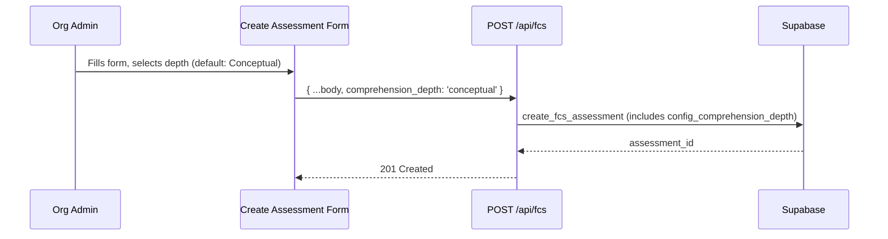
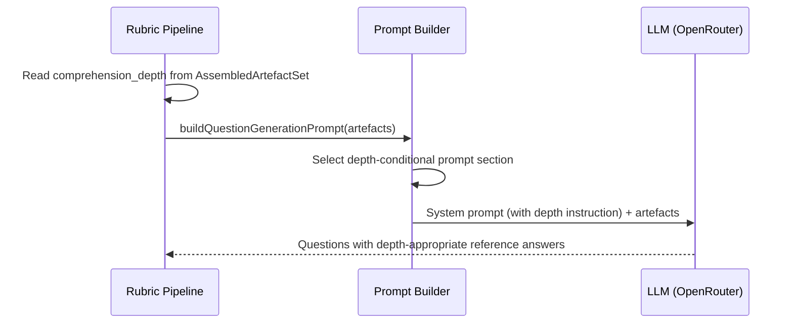
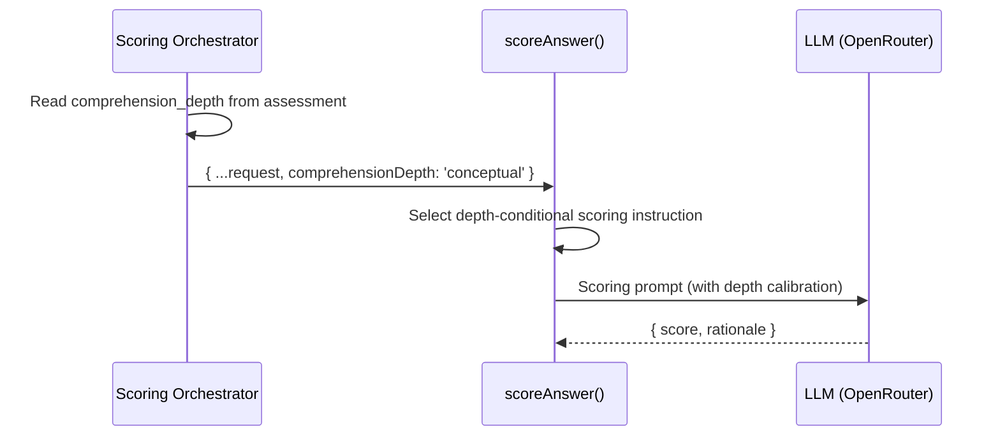

# LLD — E2: Configurable Comprehension Depth (#215)

## Change Log

| Date | Author | Changes |
|------|--------|---------|
| 2026-04-14 | Claude | Initial LLD |
| 2026-04-14 | Claude | Post-impl sync — #212 resolved by PR #216; base scoring prompt now carries the 0.0–1.0 scale anchors, so Story 2.3 calibration templates can drop their redundant scale line |
| 2026-04-15 | Claude | Post-impl sync for Story 2.1 (#222, PR #229) — migration shipped standalone (E1 Story 1.2 already merged); `src/lib/supabase/types.ts` added to files-to-modify; test file names revised to match implementation |
| 2026-04-16 | Claude | Post-impl sync for Story 2.4 (#225, PR #230) — `helpers.ts` added to files-to-modify; badge uses a `DEPTH_LABELS` constant rather than the inline ternary; tests shipped instead of deferred (server-component harness already available) |
| 2026-04-16 | Claude | Story 2.2 (#223, PR #231) — revised detailed-depth instruction to keep Naur theory-building framing at higher resolution; identifiers now anchor probes rather than being the elicited answer |

## Part A — Human-Reviewable

### Purpose

Add a comprehension depth setting (`conceptual` | `detailed`) to assessments that controls both rubric generation (what depth of questions and reference answers to produce) and scoring calibration (how strictly to grade specificity). Addresses the core calibration problem: the current pipeline produces over-specific reference answers that penalise conceptual understanding — testing code memorisation rather than Naur's theory-building.

### Behavioural Flows

#### Assessment creation with depth selection



#### Depth-aware rubric generation



#### Depth-aware scoring



### Invariants

| # | Invariant | Verification |
|---|-----------|-------------|
| 1 | Depth is immutable after assessment creation | DB column is set at INSERT, never UPDATE'd; no API endpoint exposes mutation |
| 2 | Default depth is `'conceptual'` | DB default + form default + PRCC default; unit tests for each path |
| 3 | Existing assessments default to `'conceptual'` | DB column default; migration adds column with default |
| 4 | Scoring without explicit depth uses `'conceptual'` calibration | Unit test: omitted `comprehensionDepth` → conceptual scoring prompt |
| 5 | Specific identifiers accepted but not required at conceptual depth | Scoring prompt instruction; manual review of scored output |
| 6 | Depth value constrained to `'conceptual' \| 'detailed'` | DB CHECK constraint + Zod enum |

### Acceptance Criteria

1. Assessment creation form includes a "Comprehension Depth" selector defaulting to "Conceptual".
2. Each option includes a one-line explanation.
3. `assessments` table has `config_comprehension_depth text NOT NULL DEFAULT 'conceptual'` with CHECK constraint.
4. PRCC assessments default to `'conceptual'`.
5. Rubric generation prompt adjusts question style and reference answer specificity based on depth.
6. Scoring prompt adjusts grading strictness based on depth.
7. Scoring defaults to `'conceptual'` when `comprehensionDepth` is not provided.
8. Results page displays depth as a labelled badge with contextual note.
9. Hints (E1) are depth-aware when both features are enabled.

---

## Part B — Agent-Implementable

### Story 2.1: Add comprehension depth to assessment configuration

**Layer:** Database + Frontend form + API

**Files to modify:**

- `supabase/schemas/tables.sql` — add `config_comprehension_depth` column to `assessments`
- `supabase/schemas/functions.sql` — update `create_fcs_assessment` RPC to accept depth parameter
- `src/app/api/fcs/service.ts` — add `comprehension_depth` to `FcsCreateBodySchema`, pass to RPC
- `src/app/(authenticated)/assessments/new/create-assessment-form.tsx` — add depth selector
- `src/lib/engine/prompts/artefact-types.ts` — add `comprehension_depth` to `AssembledArtefactSet`
- `src/lib/supabase/types.ts` — add `config_comprehension_depth` to `assessments` Row/Insert/Update and `p_config_comprehension_depth` to `create_fcs_assessment` RPC Args (generated-looking file, but hand-maintained in this repo)

> **Implementation note (issue #222):** The types file update was not called out in the original spec but is required — Supabase typegen is not run automatically, so the declarative schema change has to be mirrored by hand.

#### Schema change (`tables.sql`)

Add to `assessments` table definition, after `config_min_pr_size`:

```sql
config_comprehension_depth text NOT NULL DEFAULT 'conceptual'
  CHECK (config_comprehension_depth IN ('conceptual', 'detailed')),
```

#### RPC change (`functions.sql`)

Add parameter to `create_fcs_assessment`:

```sql
p_config_comprehension_depth text DEFAULT 'conceptual',
```

Add to INSERT column list and VALUES:

```sql
-- column list:
config_comprehension_depth
-- values:
p_config_comprehension_depth
```

#### API change (`service.ts`)

Add to `FcsCreateBodySchema`:

```typescript
comprehension_depth: z.enum(['conceptual', 'detailed']).default('conceptual'),
```

Add to `FcsCreateInput` type (add to Pick or extend).

Pass through to `createAssessmentWithParticipants` → `create_fcs_assessment` RPC call:

```typescript
p_config_comprehension_depth: body.comprehension_depth ?? 'conceptual',
```

#### Form change (`create-assessment-form.tsx`)

Add `comprehensionDepth` to `FormState` (default: `'conceptual'`).

Add to `AssessmentPayload`:

```typescript
comprehension_depth?: 'conceptual' | 'detailed';
```

Add selector UI between the feature description and repository fields:

```tsx
<div className="space-y-2">
  <label htmlFor="comprehensionDepth" className="text-label text-text-secondary block">
    Comprehension Depth
  </label>
  <select
    id="comprehensionDepth"
    value={form.comprehensionDepth}
    onChange={handleChange('comprehensionDepth')}
    className={inputClasses}
  >
    <option value="conceptual">
      Conceptual — Tests reasoning about approach, constraints, and rationale
    </option>
    <option value="detailed">
      Detailed — Tests knowledge of specific types, files, and function signatures
    </option>
  </select>
</div>
```

#### Type change (`artefact-types.ts`)

Add to `AssembledArtefactSet`:

```typescript
comprehension_depth?: 'conceptual' | 'detailed';
```

Optional for backward compatibility — pipeline code that assembles `AssembledArtefactSet` (in `service.ts` and webhook handler) must populate this from the assessment's `config_comprehension_depth`.

Update the artefact assembly in `triggerRubricGeneration` (`src/app/api/fcs/service.ts`) to include the depth:

```typescript
const artefacts: AssembledArtefactSet = {
  ...raw,
  question_count: params.repoInfo.questionCount,
  artefact_quality: classifyArtefactQuality(raw),
  token_budget_applied: false,
  organisation_context,
  comprehension_depth: 'conceptual', // TODO: read from assessment record
};
```

Note: Story 2.1 adds the field. Story 2.2 wires the depth from the assessment record through to the artefact set and prompt.

#### Migration

Standalone: `npx supabase db diff -f add-comprehension-depth`.

> **Implementation note (issue #222):** E1 Story 1.2 (#220) merged before this story started, so the combined-migration plan in the initial LLD was obsolete. The migration shipped as `supabase/migrations/20260415143019_add-comprehension-depth.sql`.

#### BDD specs

```
describe('FcsCreateBodySchema')
  it('accepts body with comprehension_depth "conceptual"')
  it('accepts body with comprehension_depth "detailed"')
  it('defaults comprehension_depth to "conceptual" when omitted')
  it('rejects invalid comprehension_depth value')

describe('create_fcs_assessment RPC')
  it('stores config_comprehension_depth when provided')
  it('defaults config_comprehension_depth to "conceptual" when omitted')

describe('CreateAssessmentForm')
  it('renders comprehension depth selector with Conceptual selected by default')
  it('includes depth in submitted payload')
```

#### Test files

- `tests/app/api/comprehension-depth.test.ts` — Zod schema, `AssembledArtefactSetSchema`, and source-level form assertions (14 tests)
- `tests/app/api/comprehension-depth.integration.test.ts` — `create_fcs_assessment` RPC cases requiring a local Supabase instance (2 tests)
- `tests/evaluation/comprehension-depth-story-2-1.eval.test.ts` — feature-evaluator adversarial tests confirming service-layer threads `comprehension_depth` to RPC (2 tests)

> **Implementation note (issue #222):** Test layout diverges from the initial spec (`fcs.test.ts` + `create-assessment-form.test.tsx`). Story 2.1 tests are co-located in a single `comprehension-depth.*` pair so the contract is easy to find, and the RPC cases are split into `*.integration.test.ts` to keep the unit-test CI job green when Supabase is not running. The project does not use React Testing Library, so form assertions are source-level reads of the JSX — the same pattern as `tests/app/assessments/create-assessment-styling.test.ts`.

---

### Story 2.2: Depth-aware rubric generation

**Layer:** Engine (prompts)

**Files to modify:**

- `src/lib/engine/prompts/prompt-builder.ts` — add depth-conditional section to system prompt and user prompt
- `src/app/api/fcs/service.ts` — wire depth from assessment record to `AssembledArtefactSet`
- `src/app/api/assessments/[id]/retry-rubric/service.ts` — select `config_comprehension_depth` from the assessment row so the retry path threads depth too

> **Implementation note (issue #223):** The retry-rubric service was not called out in the original spec; the select query had to include `config_comprehension_depth` and the `AssessmentRetryRow` interface had to gain the field. Without this, retries for `rubric_failed` assessments silently defaulted to conceptual depth regardless of the assessment's stored value.

#### Prompt change (`prompt-builder.ts`)

Add a depth-conditional section to `QUESTION_GENERATION_SYSTEM_PROMPT`, after the Constraints section:

```
## Comprehension Depth

{depth_instruction}
```

Where `{depth_instruction}` is selected based on `artefacts.comprehension_depth`:

**Conceptual (default):**

```
This assessment uses CONCEPTUAL depth. Generate questions and reference answers that test reasoning about approach, constraints, and rationale:

- Reference answers should describe the approach, design reasoning, and constraints WITHOUT requiring specific identifier names, file paths, or function signatures.
- Example good reference answer: "The sign-in flow uses a union type to represent outcomes, and adding a pending state requires extending this union and handling it in the UI."
- Example bad reference answer: "Add 'pending' to the SigninOutcome union type in src/types/auth.ts."
- Questions should ask "why" and "how would you approach" rather than "what is the exact name of".
- Hints should guide toward reasoning: "Describe the approach and constraints."
```

**Detailed:**

```
This assessment uses DETAILED depth. Generate questions and reference answers that test theory of the implementation at specific resolution — the reasoning behind particular type choices, how actual files and call sites compose, and what would change or break under concrete structural changes:

- Use specific type names, file paths, and function signatures as the vocabulary that anchors each question. Identifiers are the probe's anchor — not the answer being elicited.
- Reference answers should explain why a structure was chosen and how it composes, grounded in the concrete code — not merely restate the identifiers in the question.
- Good question shapes: "Why is X modelled as a `Y<Z>` rather than a plain Z?", "What breaks if `fooBar()` in `src/a/b.ts` returns null instead of undefined?", "How do the `X` and `Y` types compose in the `process()` call site?"
- Avoid recall shapes like "What is the exact name of the type that…" or "Which file contains…" — those test memory, not theory.
- Hints should guide toward reasoning at specific resolution: "Reason about the chosen structure and its composition."
```

> **Framing note:** Detailed depth is still *theory building* (Naur) — it measures understanding at higher resolution, not recall. Specific identifiers are the vocabulary anchoring each probe, not the answer being elicited. Teammate-225 flagged drift in the original wording; revised 2026-04-16.

#### Implementation approach

Extract the depth instruction as an exported function: `function depthInstruction(depth?: 'conceptual' | 'detailed'): string` — defaults to the conceptual block when `depth` is undefined. `buildQuestionGenerationPrompt` appends the returned block to the existing `QUESTION_GENERATION_SYSTEM_PROMPT` constant.

> **Implementation note (issue #223):** The original plan was to convert `QUESTION_GENERATION_SYSTEM_PROMPT` from a `const` string into a `buildSystemPrompt(depth?)` function. We kept the constant and append the depth instruction inline instead — simpler, preserves the existing assertion-by-identity tests, and avoids rippling the change through every caller. Callers can still reference the base constant; depth-awareness is the `buildQuestionGenerationPrompt` wrapper's concern.

#### Service wiring (`service.ts`)

In `triggerRubricGeneration`, read the depth from the assessment record. Depth is known at creation time (from the request body) and on retry (from the assessment row), so no extra DB query is needed on the creation path.

Add `comprehensionDepth` to `RubricTriggerParams`, thread from both entry points:

- `createFcs` — pass `body.comprehension_depth` into `triggerRubricGeneration`.
- `retriggerRubricForAssessment` — pass `assessment.config_comprehension_depth ?? 'conceptual'` (covers legacy rows with `null`).

> **Implementation note (issue #223):** The initial spec said "add `comprehensionDepth` to `RubricTriggerParams` and `RepoInfo`". `RepoInfo` was omitted — depth is per-assessment, not per-repo, so threading it through a repo-scoped record would have been misleading. Only `RubricTriggerParams` carries it.

#### BDD specs

```
describe('buildQuestionGenerationPrompt')
  it('includes conceptual depth instruction when depth is "conceptual"')
  it('includes detailed depth instruction when depth is "detailed"')
  it('defaults to conceptual instruction when depth is undefined')

describe('depthInstruction')
  it('returns conceptual instruction text for "conceptual"')
  it('returns detailed instruction text for "detailed"')
```

#### Test files

- `tests/lib/engine/prompts/prompt-builder.test.ts`

---

### Story 2.3: Depth-aware scoring calibration

**Layer:** Engine (scoring)

**Depends on:** #212 (scoring prompt scale bug) resolved first.

**Files to modify:**

- `src/lib/engine/scoring/score-answer.ts` — add `comprehensionDepth` to `ScoreAnswerRequest`, add depth-conditional scoring instruction
- `src/lib/engine/pipeline/assess-pipeline.ts` — pass `comprehensionDepth` through `ScoreAnswersRequest` → `processAnswer`
- `src/app/api/assessments/[id]/answers/service.ts` — read depth from assessment, pass to scoring pipeline

#### Scoring prompt change (`score-answer.ts`)

Add to `ScoreAnswerRequest`:

```typescript
comprehensionDepth?: 'conceptual' | 'detailed';
```

Add depth-conditional instruction to `SYSTEM_PROMPT`. Convert to a function:

```typescript
function buildScoringPrompt(depth?: 'conceptual' | 'detailed'): string {
  const base = `You are a software comprehension assessor...`; // existing prompt
  const calibration = depth === 'detailed'
    ? DETAILED_CALIBRATION
    : CONCEPTUAL_CALIBRATION; // default to conceptual
  return `${base}\n\n${calibration}`;
}
```

**Conceptual calibration:**

```
## Scoring Calibration — Conceptual Depth

This assessment measures reasoning and design understanding, not code recall:
- Accept semantically equivalent descriptions even without exact identifier names.
- Weight demonstration of reasoning and understanding of constraints over recall of specifics.
- Do not penalise for omitting file paths, type names, or function signatures when the conceptual understanding is correct.
- If the participant provides exact identifiers, accept them — specificity is welcomed but not required.

Score on a scale from 0.0 to 1.0.
```

**Detailed calibration:**

```
## Scoring Calibration — Detailed Depth

This assessment measures detailed implementation knowledge:
- Specificity is expected and valued — exact type names, file paths, and function signatures.
- Vague answers that demonstrate only conceptual understanding should score lower than answers with precise implementation details.

Score on a scale from 0.0 to 1.0.
```

#### Pipeline threading

Add `comprehensionDepth` to:

- `ScoreAnswersRequest` (in `assess-pipeline.ts`)
- `LLMCallConfig` (in `assess-pipeline.ts`)
- Thread from `scoreAnswers` → `processAnswer` → `scoreAnswer`

#### Service wiring (`answers/service.ts`)

Read `config_comprehension_depth` from the assessment row (already fetched in the answer submission flow). Pass to the scoring pipeline.

#### BDD specs

```
describe('scoreAnswer')
  it('uses conceptual calibration when comprehensionDepth is "conceptual"')
  it('uses detailed calibration when comprehensionDepth is "detailed"')
  it('defaults to conceptual calibration when comprehensionDepth is omitted')
  it('includes 0.0–1.0 scale instruction in both calibrations')

describe('scoreAnswers pipeline')
  it('passes comprehensionDepth through to individual scoreAnswer calls')
```

#### Test files

- `tests/lib/engine/scoring/score-answer.test.ts`
- `tests/lib/engine/pipeline/assess-pipeline.test.ts`

---

### Story 2.4: Display depth context in results

**Layer:** Frontend (results page)

**Files to modify:**

- `src/app/assessments/[id]/results/page.tsx` — display depth badge and contextual note
- `src/app/api/assessments/route.ts` — include `config_comprehension_depth` in list response (for future filtering)
- `src/app/api/assessments/helpers.ts` — add `config_comprehension_depth` to `AssessmentListItem` and thread it through `toListItem`

> **Implementation note (issue #225):** The route previously used `select('*, …')`, which silently propagated the new column. Switched to an explicit column list so `AssessmentListItem` is the contract of record and drift between DB and API shape surfaces via TypeScript.

#### Results page change

After the assessment title section, add a depth badge and contextual note:

```typescript
const DEPTH_LABELS: Record<'conceptual' | 'detailed', string> = {
  conceptual: 'Conceptual',
  detailed: 'Detailed',
};

const DEPTH_NOTES: Record<'conceptual' | 'detailed', string> = {
  conceptual: 'This assessment measured reasoning and design understanding. Participants were not expected to recall specific code identifiers.',
  detailed: 'This assessment measured detailed implementation knowledge including specific types, files, and function signatures.',
};
```

```tsx
<p>
  <span className="inline-block rounded-sm bg-surface-raised px-2 py-0.5 text-caption text-text-primary">
    Depth: {DEPTH_LABELS[assessment.config_comprehension_depth ?? 'conceptual']}
  </span>
</p>
<p className="text-caption text-text-secondary">
  {DEPTH_NOTES[assessment.config_comprehension_depth ?? 'conceptual']}
</p>
```

> **Implementation note (issue #225):** The spec originally inlined a ternary for the badge label. Replaced with a `DEPTH_LABELS` constant keyed on the enum so badge and note share one source of truth and the `Record<'conceptual' | 'detailed', …>` type guards against future enum drift.

#### List endpoint change

In `GET /api/assessments`, include `config_comprehension_depth` in the select query and `AssessmentListItem` type. This enables future filtering by depth.

#### BDD specs

```
describe('Results page')
  it('displays "Depth: Conceptual" badge for conceptual assessments')
  it('displays "Depth: Detailed" badge for detailed assessments')
  it('displays conceptual contextual note for conceptual assessments')
  it('displays detailed contextual note for detailed assessments')
  it('defaults to conceptual display when config_comprehension_depth is null')
```

#### Test files

- `tests/app/assessments/results.test.ts` — new `Comprehension depth display` describe block (8 tests) covering badge text, note text, null default, and cross-depth prohibition (reuses existing `renderPage` / `makeAssessment` fixtures)
- `tests/app/api/assessments.test.ts` — new `Comprehension depth in response` describe block (2 tests) covering `AssessmentListItem.config_comprehension_depth` passthrough and the explicit select column

> **Implementation note (issue #225):** The initial spec deferred tests ("manual verification sufficient for display-only change"). Server-component tests are cheap here because the existing `renderPage` harness already exists, so ten tests ship alongside the feature.

---

### Implementation sequence

1. **Story 2.1** — DB column + form + API (combined migration with E1 Story 1.2)
2. **Story 2.2** — depth-aware rubric generation (prompt changes)
3. **Story 2.3** — depth-aware scoring (depends on #212 fix)
4. **Story 2.4** — results page display

### Cross-reference

- **E1 LLD** (`docs/design/lld-e1-hints.md`) — hint wording is depth-aware per Story 2.2 AC. The depth instruction in the prompt covers this.
- **#212** (scoring scale bug) — **resolved** by PR #216. The base `SYSTEM_PROMPT` in `score-answer.ts` now contains an explicit 0.0–1.0 scale with five anchor descriptors (0.0 / 0.3 / 0.5 / 0.8 / 1.0) and a guard forbidding 1–5 or 1–10 scales. Story 2.3 calibration blocks should *not* re-declare the scale — appending the conceptual or detailed calibration on top of the base is sufficient. The single-line `Score on a scale from 0.0 to 1.0.` in each calibration template below is redundant with the base prompt and can be dropped when Story 2.3 lands.
- **PRCC webhook** — creates assessments without the form. Depth defaults to `'conceptual'` via DB default and RPC parameter default. No webhook code change needed.
