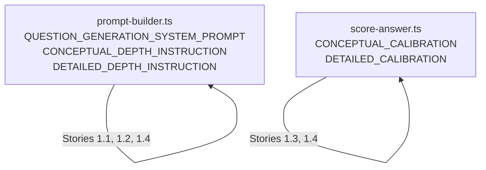
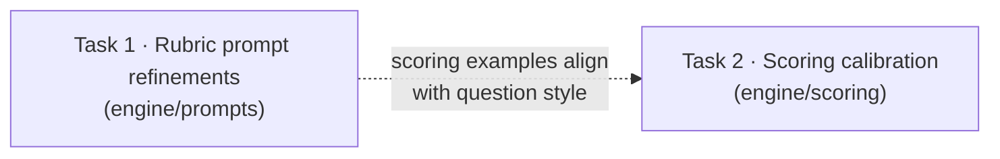

# LLD — V4 E1: Question Generation Quality

## Change Log

| Date | Author | Changes |
|------|--------|---------|
| 2026-04-23 | LS / Claude | Initial LLD — all four stories |

## Part A — Human-Reviewable

### Purpose

Refine the rubric generation and scoring prompts to fix four quality issues observed in the 2026-04-21 assessment:

1. Hints restate the question instead of scaffolding recall via code landmarks
2. Conceptual-depth questions leak implementation identifiers
3. Scoring calibration clusters in the 0.3–0.6 range regardless of answer quality
4. Questions test general architecture knowledge rather than system-specific theory

All changes are prompt text only — no schema, API, UI, or database changes. See [V4 requirements](../requirements/v4-requirements.md) for full context.

### Behavioural Flows

No new flows. The existing rubric generation and scoring flows are unchanged. Only the prompt text within `buildQuestionGenerationPrompt` and `buildScoringPrompt` is modified.

### Structural Overview

No new modules or boundaries. Changes are confined to string constants in two existing files:



### Invariants

| # | Invariant | Verification |
|---|-----------|-------------|
| 1 | Hints never reveal reference answer content | Prompt constraint (retained from V3) + unit test asserting "WITHOUT revealing" in prompt text |
| 2 | Hint is null when no code landmark exists | Prompt constraint + existing schema allows null |
| 3 | Conceptual questions contain no specific identifiers | Prompt "DO NOT" constraint + unit test asserting constraint text present |
| 4 | Detailed questions use identifiers as anchors, not answers | Prompt constraint (retained from V3, strengthened) |
| 5 | Base scoring scale (0.0–1.0 anchors) unchanged | Unit test asserting `BASE_SYSTEM_PROMPT` unchanged |
| 6 | Questions test system-specific knowledge, not general principles | Prompt constraint + unit test asserting constraint text present |

### Acceptance Criteria

All acceptance criteria from Stories 1.1, 1.2, 1.3, and 1.4 in [V4 requirements](../requirements/v4-requirements.md) apply. See Part B for per-story mapping to implementation.

---

## Part B — Agent-Implementable

### Decomposition

Two tasks grouped by file to avoid merge conflicts in overlapping string constants:

- **Task 1:** `prompt-builder.ts` refinements — Stories 1.1 + 1.2 + 1.4 (question generation)
- **Task 2:** `score-answer.ts` refinements — Stories 1.3 + 1.4 (scoring alignment)

### Execution Waves

| Wave | Task | Files | Blocked by |
|------|------|-------|------------|
| 1 | Task 1: prompt-builder refinements | `prompt-builder.ts`, `prompt-builder.test.ts` | — |
| 2 | Task 2: scoring calibration refinements | `score-answer.ts`, `score-answer.test.ts` | Wave 1 (soft) |



---

### Task 1: Rubric Generation Prompt Refinements

**Layer:** Engine (pure domain logic)

**Files:**

- `src/lib/engine/prompts/prompt-builder.ts` — modify three string constants
- `tests/lib/engine/prompts/prompt-builder.test.ts` — add BDD specs

#### Change 1a: Scaffolding hints (Story 1.1)

**File:** `src/lib/engine/prompts/prompt-builder.ts`
**Target:** `QUESTION_GENERATION_SYSTEM_PROMPT`, line 54 (hint field description) and line 35 (hint example in JSON block)

**Current hint instruction (line 54):**

```
- hint: A 1–2 sentence guidance hint (max 200 characters) shown to participants alongside the question. The hint describes the expected answer depth and format (e.g. "Describe 2–3 specific scenarios and explain the design rationale") WITHOUT revealing any content from the reference answer. If you cannot generate a suitable hint, set it to null.
```

**Replace with:**

```
- hint: A short guidance hint (max 200 characters) shown to participants alongside the question. The hint names a recognisable code landmark — a function, type, file, or observable behaviour — that the participant can reason from, WITHOUT revealing any reasoning, rationale, or trade-offs from the reference answer.
  - GOOD: "Look at what `validatePath` rejects vs. what it passes through unchanged."
  - BAD: "Explain which real-world constraints are captured in the validation rules." (restates the question)
  - BAD: "The validation rejects paths that cross trust boundaries because of the security model." (reveals reference answer reasoning)
  If no obvious code landmark exists for the question, set hint to null.
```

**Also update hint example in JSON block (line 35):**

Current: `"hint": "Describe 2–3 scenarios and explain the design rationale"`
Replace with: `"hint": "Look at what validatePath rejects vs. what it passes through unchanged."`

**Also update hint guidance in depth instructions:**

`CONCEPTUAL_DEPTH_INSTRUCTION` (line 80) — replace:
```
- Hints should guide toward reasoning: "Describe the approach and constraints."
```
with:
```
- Hints should point to a recognisable code area or behaviour without naming specific identifiers: "Look at how the validation module handles rejected inputs."
```

`DETAILED_DEPTH_INSTRUCTION` (line 90) — replace:
```
- Hints should guide toward reasoning at specific resolution: "Reason about the chosen structure and its composition."
```
with:
```
- Hints should point to a specific identifier or call site the participant can reason from: "Look at what `validatePath` rejects vs. what it passes through."
```

#### Change 1b: Depth enforcement (Story 1.2)

**File:** `src/lib/engine/prompts/prompt-builder.ts`
**Target:** `CONCEPTUAL_DEPTH_INSTRUCTION` (lines 72–80) and `DETAILED_DEPTH_INSTRUCTION` (lines 82–90)

**`CONCEPTUAL_DEPTH_INSTRUCTION` — append after existing bullets (before closing backtick):**

```
- DO NOT use specific type names, file paths, or function signatures in question_text or reference_answer. Use generic descriptions instead.
  - BAD question: "Why was the tool-use loop extracted into `tool-loop.ts`?"
  - GOOD question: "Why is the tool execution logic kept separate from the LLM provider integration?"
  - BAD reference answer: "Add 'pending' to the SigninOutcome union type in src/types/auth.ts."
  - GOOD reference answer: "The sign-in flow uses a union type to represent outcomes, and adding a pending state requires extending this union and handling it in the UI."
```

**`DETAILED_DEPTH_INSTRUCTION` — append after existing bullets (before closing backtick):**

```
- DO NOT generate pure-recall questions where the answer is just an identifier name, file path, or location.
  - BAD question: "What file contains the tool loop?" (tests file-system recall)
  - GOOD question: "Why does the tool-use loop in `tool-loop.ts` pass an empty tools array instead of skipping the loop entirely when tool_use_enabled is false?"
  - BAD question: "What is the return type of `processEvent()`?" (tests type-name recall)
  - GOOD question: "Why is `processEvent()` typed to return `Result<Event>` rather than throwing on failure?"
```

#### Change 1c: Theory-building question focus (Story 1.4 — question generation)

**File:** `src/lib/engine/prompts/prompt-builder.ts`
**Target:** `QUESTION_GENERATION_SYSTEM_PROMPT`, Constraints section (after line 69, before closing backtick at line 70)

**Insert new constraint paragraph before the existing "Focus questions on architectural reasoning" paragraph:**

```
- Questions must test knowledge specific to THIS system's decisions, behaviour, and trade-offs — not general software engineering principles that any experienced developer could answer without seeing the codebase. A useful test: if a senior engineer who has never seen this codebase could give a correct answer based on general best practices alone, the question is too generic.
  - BAD: "Why was the tool-use loop extracted into a separate pure module?" (any engineer would answer "separation of concerns")
  - GOOD: "Why does the tool-use loop pass an empty tools array instead of skipping the loop entirely when tool_use_enabled is false?" (requires knowing the specific design decision)
```

**Also update reference answer field description (line 53):**

Current:
```
- reference_answer: The answer a developer with full understanding should give, derived strictly from the provided artefacts
```

Replace with:
```
- reference_answer: The answer a developer with full understanding should give, derived strictly from the provided artefacts. Define 2–3 essential points that demonstrate system-specific understanding — not an exhaustive checklist. A participant who demonstrates genuine comprehension of the key points should score highly even if they do not enumerate every detail.
```

#### BDD Specs — Task 1

```typescript
describe('QUESTION_GENERATION_SYSTEM_PROMPT — scaffolding hints (Story 1.1)', () => {
  it('instructs the LLM to produce landmark-style hints', () => {
    expect(QUESTION_GENERATION_SYSTEM_PROMPT).toContain('code landmark');
  });

  it('includes a positive example of a landmark hint', () => {
    expect(QUESTION_GENERATION_SYSTEM_PROMPT).toContain('validatePath');
  });

  it('includes a negative example of a format-style hint', () => {
    expect(QUESTION_GENERATION_SYSTEM_PROMPT).toContain('restates the question');
  });

  it('instructs to set hint to null when no landmark exists', () => {
    expect(QUESTION_GENERATION_SYSTEM_PROMPT.toLowerCase()).toContain(
      'no obvious code landmark',
    );
  });

  it('retains the max 200 characters constraint', () => {
    expect(QUESTION_GENERATION_SYSTEM_PROMPT).toContain('max 200 characters');
  });

  it('retains the non-disclosure constraint', () => {
    expect(QUESTION_GENERATION_SYSTEM_PROMPT).toContain('WITHOUT revealing');
  });
});

describe('QUESTION_GENERATION_SYSTEM_PROMPT — theory-building focus (Story 1.4)', () => {
  it('includes a system-specific knowledge constraint', () => {
    expect(QUESTION_GENERATION_SYSTEM_PROMPT).toContain(
      'specific to THIS system',
    );
  });

  it('includes a positive example of a system-specific question', () => {
    expect(QUESTION_GENERATION_SYSTEM_PROMPT).toContain(
      'requires knowing the specific design decision',
    );
  });

  it('includes a negative example of a generic-knowledge question', () => {
    expect(QUESTION_GENERATION_SYSTEM_PROMPT).toContain(
      'any engineer would answer',
    );
  });

  it('instructs reference answers to define 2–3 essential points', () => {
    expect(QUESTION_GENERATION_SYSTEM_PROMPT).toContain(
      '2–3 essential points',
    );
  });
});

describe('CONCEPTUAL_DEPTH_INSTRUCTION — depth enforcement (Story 1.2)', () => {
  it('includes a DO NOT constraint against specific identifiers', () => {
    const instruction = depthInstruction('conceptual');
    expect(instruction).toContain(
      'DO NOT use specific type names, file paths, or function signatures',
    );
  });

  it('includes a negative example question with specific identifiers', () => {
    const instruction = depthInstruction('conceptual');
    expect(instruction).toContain('tool-loop.ts');
  });

  it('includes a positive example question without specific identifiers', () => {
    const instruction = depthInstruction('conceptual');
    expect(instruction).toContain(
      'Why is the tool execution logic kept separate',
    );
  });
});

describe('DETAILED_DEPTH_INSTRUCTION — depth enforcement (Story 1.2)', () => {
  it('includes a DO NOT constraint against pure-recall questions', () => {
    const instruction = depthInstruction('detailed');
    expect(instruction).toContain(
      'DO NOT generate pure-recall questions',
    );
  });

  it('includes a negative example of a recall question', () => {
    const instruction = depthInstruction('detailed');
    expect(instruction).toContain('tests file-system recall');
  });

  it('includes a positive example of a reasoning question anchored in specifics', () => {
    const instruction = depthInstruction('detailed');
    expect(instruction).toContain(
      'pass an empty tools array',
    );
  });
});
```

---

### Task 2: Scoring Calibration Refinements

**Layer:** Engine (scoring)

**Files:**

- `src/lib/engine/scoring/score-answer.ts` — modify two string constants
- `tests/lib/engine/scoring/score-answer.test.ts` — add BDD specs

#### Change 2a: Scoring calibration examples (Story 1.3)

**File:** `src/lib/engine/scoring/score-answer.ts`
**Target:** `CONCEPTUAL_CALIBRATION` (lines 37–43) and `DETAILED_CALIBRATION` (lines 45–52)

**`CONCEPTUAL_CALIBRATION` — append after existing bullets (before closing backtick):**

```

### Scoring Examples

- **High score (>= 0.8):** "The payment flow uses an idempotency key pattern to prevent duplicate charges under concurrent requests. The key is checked before processing and stored atomically with the transaction." — Demonstrates correct reasoning about the approach and constraints without naming specific types or files.
- **Low score (<= 0.3):** "It prevents duplicate payments somehow." — Vague, does not demonstrate understanding of the mechanism or constraints.
- A directionally correct answer with system-specific reasoning scores higher than a textbook-perfect answer that could apply to any codebase.
```

**`DETAILED_CALIBRATION` — append after existing bullets (before closing backtick):**

```

### Scoring Examples

- **High score (>= 0.8):** "The `PaymentProcessor.execute()` method wraps the Stripe call in a `withIdempotencyKey()` helper that checks the `idempotency_keys` table first. If the key exists, it returns the cached result. This prevents duplicate charges when the webhook fires twice for the same event." — Names the identifiers AND explains their role and composition.
- **Low score (<= 0.4):** "It uses `PaymentProcessor`, `withIdempotencyKey`, and the `idempotency_keys` table." — Lists identifiers without explaining why they compose this way or what would break if the structure changed.
- A directionally correct answer with system-specific reasoning scores higher than an answer that merely lists correct identifiers without demonstrating understanding of their roles.
```

#### Change 2b: Scoring alignment with theory-building (Story 1.4 — scoring)

The scoring examples added in Change 2a incorporate the Story 1.4 alignment: "a directionally correct answer with system-specific reasoning scores higher than a textbook-perfect answer that could apply to any codebase." No additional change needed.

#### BDD Specs — Task 2

```typescript
describe('Given comprehensionDepth is "conceptual" — calibration examples (Story 1.3)', () => {
  it('includes a high-scoring conceptual example in system prompt', async () => {
    // Call scoreAnswer with conceptual depth, capture systemPrompt
    expect(systemPrompt).toContain('High score (>= 0.8)');
  });

  it('includes a low-scoring conceptual example in system prompt', async () => {
    expect(systemPrompt).toContain('Low score (<= 0.3)');
  });

  it('instructs that system-specific reasoning scores higher than generic answers', async () => {
    expect(systemPrompt).toContain(
      'system-specific reasoning scores higher',
    );
  });
});

describe('Given comprehensionDepth is "detailed" — calibration examples (Story 1.3)', () => {
  it('includes a high-scoring detailed example in system prompt', async () => {
    expect(systemPrompt).toContain('High score (>= 0.8)');
  });

  it('includes a low-scoring detailed example in system prompt', async () => {
    expect(systemPrompt).toContain('Low score (<= 0.4)');
  });

  it('instructs that identifiers with reasoning score higher than identifiers alone', async () => {
    expect(systemPrompt).toContain(
      'merely lists correct identifiers',
    );
  });
});

describe('BASE_SYSTEM_PROMPT — unchanged (Story 1.3 invariant)', () => {
  it('retains the 0.0–1.0 scoring scale anchors unchanged', async () => {
    // Existing test already covers this — no new test needed
  });
});
```

---

### Test Strategy

**Unit tests (deterministic, no LLM calls):** Substring assertions on prompt constants returned by `buildQuestionGenerationPrompt` and captured from `buildScoringPrompt`. Append to existing test files. Pattern: existing tests in `prompt-builder.test.ts` and `score-answer.test.ts`.

**Evaluation test:** New `tests/evaluation/v4-question-generation.eval.test.ts` following the pattern from `tests/evaluation/hint-generation.eval.test.ts`. Adversarial checks that prompt text contains enforcement constraints and examples. Catches regressions if future edits remove constraints.

**NOT testing:** LLM output quality. The requirements defer "post-generation validation layer" as out of scope. Manual review of generated rubrics after deployment is the validation method.

### Complexity Budget

All changes are to string constants (prompt text). No new functions, no control flow changes. `depthInstruction()`, `buildQuestionGenerationPrompt()`, `buildScoringPrompt()`, and `scoreAnswer()` are structurally unchanged.

- `QUESTION_GENERATION_SYSTEM_PROMPT`: grows by ~8 lines of constraint text
- `CONCEPTUAL_DEPTH_INSTRUCTION` / `DETAILED_DEPTH_INSTRUCTION`: each grows by ~5 lines
- `CONCEPTUAL_CALIBRATION` / `DETAILED_CALIBRATION`: each grows by ~5 lines
