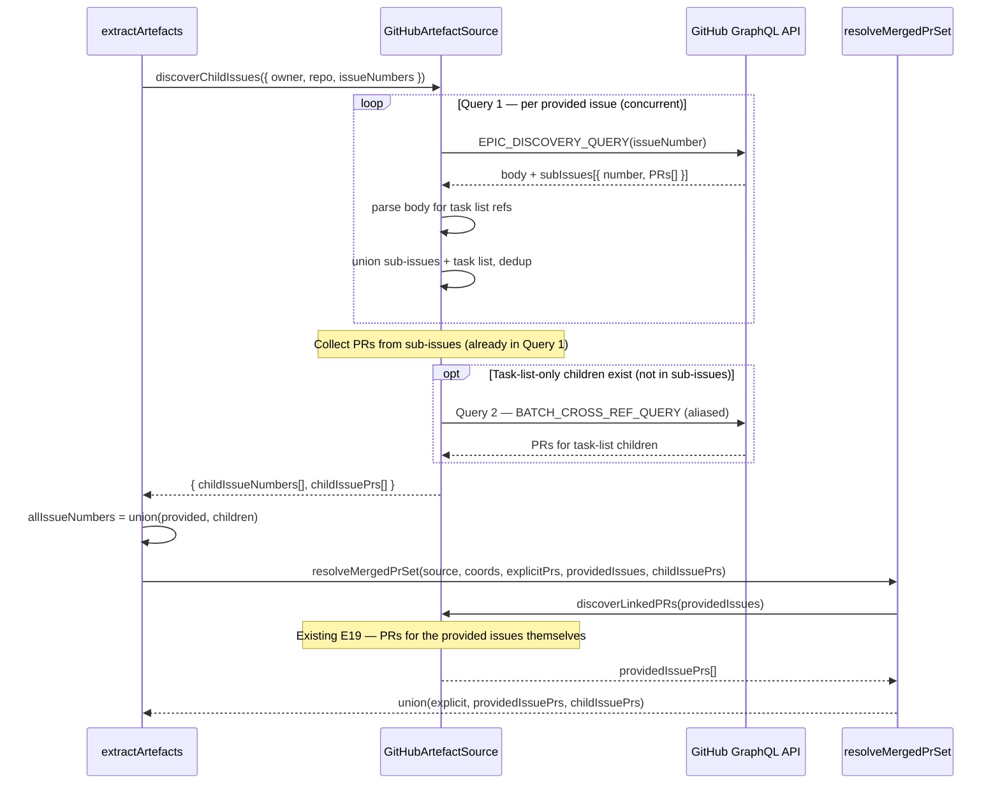
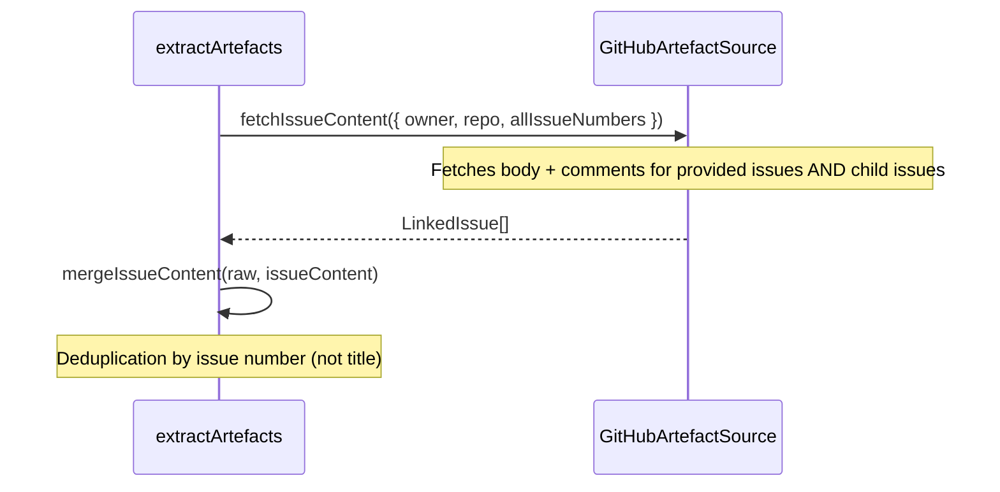
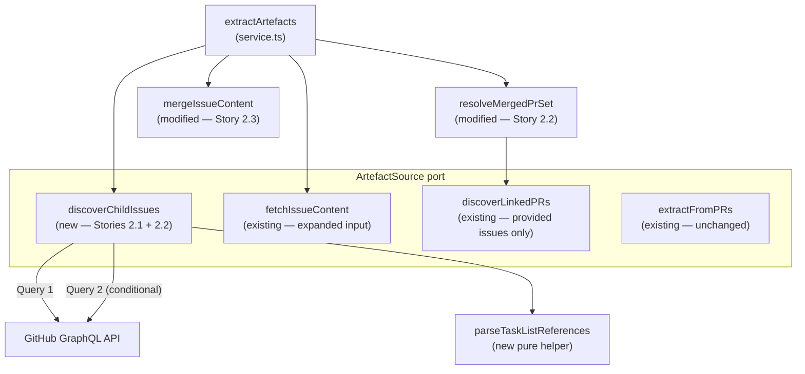

# LLD — Epic 2: Epic-Aware Artefact Discovery

## Document Control

| Field | Value |
|-------|-------|
| Epic | #321 — V4 epic-aware artefact discovery |
| Requirements | `docs/requirements/v4-requirements.md` §Epic 2 |
| HLD reference | `docs/design/v1-design.md` §C5 (Artefact Extraction) |
| Predecessor | `docs/design/lld-e19.md` — V2 Epic 19: GitHub Issues as Artefact Source |
| Status | Draft |
| Created | 2026-04-24 |

---

## Part A — Human-Reviewable Design

### Purpose

When an Org Admin provides an epic issue number as an assessment source, the pipeline currently finds zero PRs — epics don't have cross-referenced PRs directly. This epic adds one-level traversal: epic → child issues → their linked PRs + content, so the rubric generation receives the full implementation context.

Three stories, all modifying the same adapter and service surface:

1. **2.1** — Discover child issues (sub-issues API + task list parsing) and their linked PRs
2. **2.2** — Feed child issue PRs into the merged PR set
3. **2.3** — Include child issue content in LLM context

### GraphQL batching strategy

The design uses **at most 2 GraphQL queries** to discover children and their PRs, leveraging nested fields and dynamic aliases:

| Query | What it fetches | When |
|-------|----------------|------|
| **Query 1 — Epic Discovery** | Per provided issue: body (for task list parsing) + native sub-issues + each sub-issue's linked PRs (nested) | Always (one per provided issue, concurrent) |
| **Query 2 — Task List Children PRs** | Linked PRs for task-list-discovered children not already in sub-issues (batched via dynamic aliases) | Only when task list parsing finds children absent from sub-issues |

**Why GraphQL over REST:**

- Query 1 replaces 1 + N REST calls (1 body fetch + N sub-issue PR lookups) with a single request per provided issue. The nested `subIssues → timelineItems` field fetches children AND their PRs in one shot.
- Query 2 uses dynamic aliases (`issue295: issue(number: 295) { ... }`) to batch all task-list children's PR discovery into one request, instead of one REST/GraphQL call per child.
- The existing `discoverLinkedPRs` (E19) handles the provided issues' own PRs — unchanged.

### Behavioural Flows

#### 2.1 + 2.2 — Child issue discovery and PR resolution



#### 2.3 — Child issue content included in LLM context



### Structural Overview



### Invariants

| # | Invariant | Verification |
|---|-----------|-------------|
| I1 | Child issue discovery is always attempted on every provided issue — no label check | Unit test: non-epic issue returns empty set (no error) |
| I2 | Only one level of traversal (epic → children, not epic → children → grandchildren) | Unit test: child issue that is itself an epic does not trigger further discovery |
| I3 | Sub-issues and task list results are unioned and deduplicated by issue number | Unit test: overlapping results → no duplicates |
| I4 | Task list parsing only matches `- [x] #N` and `- [ ] #N` — not prose references | Unit test: `see #123` in body text is not extracted |
| I5 | Child-issue-discovered PRs are deduplicated against explicit and issue-discovered PRs | Unit test: PR in both sets → appears once |
| I6 | Issue content deduplication uses issue number, not title | Unit test: two issues with the same title → both kept |
| I7 | When no children are found, pipeline continues unchanged (existing behaviour) | Unit test: empty children → same output as before |

### Acceptance Criteria + BDD Specs

See Part B for per-story BDD specs.

---

## Part B — Agent-Implementable Design

### Story 2.1: Discover child issues from epic issues

#### Layers

- **BE** — New `discoverChildIssues` method on port + adapter, two GraphQL queries, task list parser

#### Port extension

Add to `src/lib/engine/ports/artefact-source.ts`:

```typescript
export interface EpicDiscoveryResult {
  childIssueNumbers: number[];
  childIssuePrs: number[];
}

export interface ArtefactSource {
  extractFromPRs(params: PRExtractionParams): Promise<RawArtefactSet>;
  fetchIssueContent(params: IssueQueryParams): Promise<LinkedIssue[]>;
  discoverLinkedPRs(params: IssueQueryParams): Promise<number[]>;
  discoverChildIssues(params: IssueQueryParams): Promise<EpicDiscoveryResult>;  // NEW
}
```

Returns both child issue numbers AND their linked PRs in one call — the adapter resolves both internally via nested GraphQL fields.

#### Query 1 — Epic Discovery Query

Add to `src/lib/github/artefact-source.ts`. One query per provided issue, fetches everything needed for child discovery:

```graphql
query($owner: String!, $repo: String!, $issueNumber: Int!) {
  repository(owner: $owner, name: $repo) {
    issue(number: $issueNumber) {
      body
      subIssues(first: 50) {
        nodes {
          number
          timelineItems(first: 100, itemTypes: [CROSS_REFERENCED_EVENT]) {
            nodes {
              ... on CrossReferencedEvent {
                source {
                  ... on PullRequest {
                    number
                    merged
                  }
                }
              }
            }
          }
        }
      }
    }
  }
}
```

Response type:

```typescript
interface EpicDiscoveryQueryResponse {
  repository: {
    issue: {
      body: string | null;
      subIssues: {
        nodes: Array<{
          number: number;
          timelineItems: {
            nodes: Array<{ source?: { number?: number; merged?: boolean } }>;
          };
        }>;
      };
    } | null;
  };
}
```

This single query yields:
- `body` — for task list parsing
- Sub-issue numbers — native children
- Each sub-issue's cross-referenced merged PRs — no follow-up query needed for these

#### Query 2 — Batch Cross-Ref Query (task-list children)

When task list parsing discovers children NOT already in the sub-issues set, their PRs need to be fetched. Use **dynamic aliases** to batch all of them into one GraphQL request:

```typescript
function buildBatchCrossRefQuery(issueNumbers: number[]): string {
  const fragments = issueNumbers.map(n =>
    `issue${n}: issue(number: ${n}) {
      timelineItems(first: 100, itemTypes: [CROSS_REFERENCED_EVENT]) {
        nodes {
          ... on CrossReferencedEvent {
            source {
              ... on PullRequest {
                number
                merged
              }
            }
          }
        }
      }
    }`
  ).join('\n    ');
  return `query($owner: String!, $repo: String!) {
    repository(owner: $owner, name: $repo) {
      ${fragments}
    }
  }`;
}
```

Response type — dynamic keys:

```typescript
type BatchCrossRefResponse = {
  repository: Record<string, {
    timelineItems: {
      nodes: Array<{ source?: { number?: number; merged?: boolean } }>;
    };
  } | null>;
};
```

This replaces N individual `CROSS_REF_QUERY` calls with one batched request.

#### Task list reference parsing

Pure function, add to `src/lib/github/artefact-source.ts` in the pure helpers section:

```typescript
function parseTaskListReferences(body: string): number[] {
  const pattern = /^- \[[x ]\] #(\d+)/gm;
  const numbers: number[] = [];
  let match: RegExpExecArray | null;
  while ((match = pattern.exec(body)) !== null) {
    numbers.push(Number.parseInt(match[1]!, 10));
  }
  return numbers;
}
```

Key constraints:
- Anchored to start of line (`^` with `m` flag) — only matches Markdown checkbox items
- Matches both checked (`[x]`) and unchecked (`[ ]`)
- Does NOT match prose references like `see #123` or `closes #456`
- Returns raw numbers — deduplication happens in the caller

#### Cross-ref node filtering

Reusable pure helper — extracts merged PR numbers from cross-reference timeline nodes. Shared between Query 1 (sub-issue nodes) and Query 2 (task-list children), and matches the existing `queryCrossRefMergedPRs` pattern:

```typescript
function extractMergedPrNumbers(
  nodes: Array<{ source?: { number?: number; merged?: boolean } }>,
): number[] {
  const prs: number[] = [];
  for (const node of nodes) {
    const source = node.source;
    if (source === undefined || typeof source.number !== 'number') continue;
    if (source.merged === true) prs.push(source.number);
  }
  return prs;
}
```

#### Adapter method

```typescript
async discoverChildIssues(params: IssueQueryParams): Promise<EpicDiscoveryResult> {
  const perIssue = await Promise.all(
    params.issueNumbers.map(n => this.discoverChildrenForIssue(params.owner, params.repo, n)),
  );
  // Flatten and dedup across all provided issues
  const allChildren = new Set(perIssue.flatMap(r => r.childIssueNumbers));
  const allPrs = new Set(perIssue.flatMap(r => r.childIssuePrs));
  return {
    childIssueNumbers: Array.from(allChildren),
    childIssuePrs: Array.from(allPrs),
  };
}
```

Private helper `discoverChildrenForIssue` — orchestrates both queries:

```typescript
private async discoverChildrenForIssue(
  owner: string, repo: string, issueNumber: number,
): Promise<EpicDiscoveryResult> {
  // Query 1: sub-issues + their PRs + body (for task list parsing)
  const q1 = await this.queryEpicDiscovery(owner, repo, issueNumber);

  const subIssueNumbers = q1.subIssues.map(s => s.number);
  const subIssuePrs = q1.subIssues.flatMap(s => s.mergedPrs);
  const taskListNumbers = q1.body !== null ? parseTaskListReferences(q1.body) : [];

  // Task-list children not already in sub-issues need a PR lookup
  const subIssueSet = new Set(subIssueNumbers);
  const taskListOnly = taskListNumbers.filter(n => !subIssueSet.has(n));

  // Query 2 (conditional): batch PR discovery for task-list-only children
  const taskListPrs = taskListOnly.length > 0
    ? await this.batchDiscoverLinkedPRs(owner, repo, taskListOnly)
    : [];

  const childIssueNumbers = Array.from(new Set([...subIssueNumbers, ...taskListNumbers]));
  const childIssuePrs = Array.from(new Set([...subIssuePrs, ...taskListPrs]));

  if (childIssueNumbers.length > 0) {
    logger.info({
      issueNumber,
      childIssueCount: childIssueNumbers.length,
      childIssueNumbers,
      discoveryMechanism: subIssueNumbers.length > 0 && taskListOnly.length > 0
        ? 'both' : subIssueNumbers.length > 0 ? 'sub_issues' : 'task_list',
      childIssuePrCount: childIssuePrs.length,
    }, 'discoverChildIssues: children found');
  }

  return { childIssueNumbers, childIssuePrs };
}
```

Private helper `queryEpicDiscovery` — executes Query 1:

```typescript
private async queryEpicDiscovery(
  owner: string, repo: string, issueNumber: number,
): Promise<{ body: string | null; subIssues: Array<{ number: number; mergedPrs: number[] }> }> {
  try {
    const result = await this.octokit.graphql<EpicDiscoveryQueryResponse>(
      EPIC_DISCOVERY_QUERY, { owner, repo, issueNumber },
    );
    const issue = result.repository.issue;
    if (!issue) return { body: null, subIssues: [] };
    return {
      body: issue.body,
      subIssues: issue.subIssues.nodes.map(node => ({
        number: node.number,
        mergedPrs: extractMergedPrNumbers(node.timelineItems.nodes),
      })),
    };
  } catch (err) {
    logger.warn({ err, issueNumber }, 'queryEpicDiscovery: GraphQL failed — falling back to task list only');
    return { body: null, subIssues: [] };
  }
}
```

Private helper `batchDiscoverLinkedPRs` — executes Query 2:

```typescript
private async batchDiscoverLinkedPRs(
  owner: string, repo: string, issueNumbers: number[],
): Promise<number[]> {
  if (issueNumbers.length === 0) return [];
  try {
    const query = buildBatchCrossRefQuery(issueNumbers);
    const result = await this.octokit.graphql<BatchCrossRefResponse>(query, { owner, repo });
    const prs: number[] = [];
    for (const issueNum of issueNumbers) {
      const issueData = result.repository[`issue${issueNum}`];
      if (issueData) prs.push(...extractMergedPrNumbers(issueData.timelineItems.nodes));
    }
    return Array.from(new Set(prs));
  } catch (err) {
    logger.warn({ err, issueNumbers }, 'batchDiscoverLinkedPRs: GraphQL failed');
    return [];
  }
}
```

#### BDD specs — Story 2.1

```typescript
describe('discoverChildIssues', () => {
  describe('Query 1 — epic discovery (sub-issues + body)', () => {
    it('returns sub-issue numbers from the GraphQL sub-issues field')
    it('returns merged PRs for each sub-issue from nested timelineItems')
    it('filters out non-merged PRs from sub-issue cross-references')
    it('returns empty result when the issue has no sub-issues and no task list')
    it('returns body for task list parsing')
    it('gracefully handles GraphQL failure — falls back to empty')
  })

  describe('task list reference parsing', () => {
    it('extracts issue numbers from "- [x] #N" patterns')
    it('extracts issue numbers from "- [ ] #N" patterns (unchecked)')
    it('does NOT extract issue references from prose (e.g. "see #123")')
    it('does NOT extract issue references from closes/fixes keywords')
    it('handles mixed content: task list items interleaved with prose and code blocks')
    it('returns empty array when body has no task list items')
  })

  describe('Query 2 — batch PR discovery for task-list children', () => {
    it('fetches PRs for task-list children not already in sub-issues — single batched query')
    it('skips Query 2 when all task-list children are already in sub-issues')
    it('skips Query 2 when there are no task-list children')
    it('gracefully handles GraphQL failure — returns empty PRs')
  })

  describe('union and deduplication', () => {
    it('returns union of sub-issues and task list references, deduplicated by issue number')
    it('returns union of sub-issue PRs and task-list PRs, deduplicated')
    it('handles overlapping results from both strategies')
  })

  describe('scope', () => {
    it('always attempts discovery — no label check needed')
    it('returns empty result for non-epic issues (no error)')
  })

  describe('logging', () => {
    it('logs childIssueCount, childIssueNumbers, discoveryMechanism, and childIssuePrCount')
    it('does not log when no children found')
  })
})

describe('parseTaskListReferences', () => {
  it('matches "- [x] #295" at start of line')
  it('matches "- [ ] #296" at start of line')
  it('does not match "  see #123" in prose')
  it('does not match "#456" without checkbox prefix')
  it('handles multiple references in one body')
  it('returns empty array for body with no task list items')
})

describe('extractMergedPrNumbers', () => {
  it('extracts PR numbers where merged is true')
  it('filters out non-merged PRs')
  it('handles nodes with missing source')
})

describe('buildBatchCrossRefQuery', () => {
  it('builds a query with one alias per issue number')
  it('returns a valid GraphQL query string')
})
```

#### Files touched

| File | Change |
|------|--------|
| `src/lib/engine/ports/artefact-source.ts` | Add `EpicDiscoveryResult`, update `ArtefactSource` interface |
| `src/lib/github/artefact-source.ts` | Add `EPIC_DISCOVERY_QUERY`, `buildBatchCrossRefQuery`, `extractMergedPrNumbers`, `parseTaskListReferences`, `discoverChildIssues`, `discoverChildrenForIssue`, `queryEpicDiscovery`, `batchDiscoverLinkedPRs` |
| `tests/lib/github/artefact-source.test.ts` | Tests for all new functions |

---

### Story 2.2: Feed child issue PRs into artefact extraction

#### Layers

- **BE** — Modify `extractArtefacts` and `resolveMergedPrSet` in `service.ts`

#### Changes to `extractArtefacts`

Insert child issue discovery between the `coords` setup and `resolveMergedPrSet`. The `discoverChildIssues` call returns both children and their PRs — the PRs are passed directly to `resolveMergedPrSet`:

```typescript
async function extractArtefacts(params: ExtractArtefactsParams): Promise<AssembledArtefactSet> {
  const { adminSupabase, octokit, repoInfo, prNumbers, issueNumbers, comprehensionDepth } = params;
  const coords: RepoCoords = { owner: repoInfo.orgName, repo: repoInfo.repoName };
  const source = new GitHubArtefactSource(octokit);
  // Story 2.1: discover child issues + their PRs
  const { childIssueNumbers, childIssuePrs } = issueNumbers.length > 0
    ? await source.discoverChildIssues({ ...coords, issueNumbers })
    : { childIssueNumbers: [], childIssuePrs: [] };
  const allIssueNumbers = Array.from(new Set([...issueNumbers, ...childIssueNumbers]));
  // Story 2.2: pass child PRs to resolveMergedPrSet
  const mergedPrNumbers = await resolveMergedPrSet(source, coords, prNumbers, issueNumbers, childIssuePrs);
  const [raw, issueContent, organisation_context] = await Promise.all([
    mergedPrNumbers.length > 0
      ? source.extractFromPRs({ ...coords, prNumbers: mergedPrNumbers })
      : emptyRawArtefactSet(),
    // Story 2.3: fetch content for all issues (provided + children)
    allIssueNumbers.length > 0
      ? source.fetchIssueContent({ ...coords, issueNumbers: allIssueNumbers })
      : Promise.resolve([] as LinkedIssue[]),
    loadOrgPromptContext(adminSupabase, repoInfo.orgId),
  ]);
  const merged = mergeIssueContent(raw, issueContent);
  return { ...merged, question_count: repoInfo.questionCount, artefact_quality: classifyArtefactQuality(merged), token_budget_applied: false, organisation_context, comprehension_depth: comprehensionDepth };
}
```

#### Changes to `resolveMergedPrSet`

Add `childIssuePrs` parameter — these are PRs already discovered by `discoverChildIssues` (from Query 1 + Query 2). The existing `discoverLinkedPRs` call handles only the provided issues' own PRs:

```typescript
async function resolveMergedPrSet(
  source: GitHubArtefactSource,
  coords: RepoCoords,
  explicitPrs: number[],
  providedIssueNumbers: number[],
  childIssuePrs: number[],
): Promise<number[]> {
  const discoveredPrs = providedIssueNumbers.length > 0
    ? await source.discoverLinkedPRs({ ...coords, issueNumbers: providedIssueNumbers })
    : [];
  const merged = Array.from(new Set([...explicitPrs, ...discoveredPrs, ...childIssuePrs]));
  if (discoveredPrs.length > 0 || childIssuePrs.length > 0) {
    logger.info({ explicitPrs, discoveredPrs, childIssuePrs, mergedPrs: merged }, 'extractArtefacts: linked PR discovery');
  }
  return merged;
}
```

Key changes vs. current:
- `issueNumbers` parameter renamed to `providedIssueNumbers` — `discoverLinkedPRs` runs only for the originally provided issues, not children (their PRs are already known)
- New `childIssuePrs` parameter unioned into the merged set
- Log entry includes `childIssuePrs` as a separate field for traceability

#### BDD specs — Story 2.2

```typescript
describe('extractArtefacts with child issues', () => {
  it('discovers child issues and includes their PRs in the merged PR set')
  it('deduplicates PRs linked to both the epic and a child issue')
  it('deduplicates PRs linked to multiple child issues')
  it('deduplicates child-issue-discovered PRs against explicit merged_pr_numbers')
  it('handles child issues with no linked PRs — no error, other PRs still included')
  it('continues unchanged when no children are discovered')
  it('calls discoverLinkedPRs only for provided issues, not children')
})

describe('resolveMergedPrSet', () => {
  it('unions explicit PRs, provided-issue PRs, and child-issue PRs')
  it('logs childIssuePrs separately from discoveredPrs')
  it('deduplicates across all three sources')
})
```

#### Files touched

| File | Change |
|------|--------|
| `src/app/api/fcs/service.ts` | `extractArtefacts`: child discovery + union; `resolveMergedPrSet`: add `childIssuePrs` param |

---

### Story 2.3: Include child issue content in LLM context

#### Layers

- **BE** — Modify `extractArtefacts` (already changed in 2.2) and `mergeIssueContent` in `service.ts`

#### Changes

The `fetchIssueContent` call in `extractArtefacts` already uses `allIssueNumbers` (from Story 2.2 changes), so child issue content is automatically fetched.

The remaining change is to fix deduplication. The current `mergeIssueContent` deduplicates by title, which can incorrectly merge distinct issues with the same title. Change to deduplicate by issue number.

This requires `LinkedIssue` to carry the issue number. Extend the type:

**`src/lib/engine/prompts/artefact-types.ts`:**

```typescript
export const LinkedIssueSchema = z.object({
  title: z.string(),
  body: z.string(),
  number: z.number().int().positive().optional(),  // NEW — present for explicit issues, absent for PR-body-discovered
});
```

The `number` field is optional for backward compatibility — issues discovered from PR body cross-references (via `fetchLinkedIssues` in `extractSinglePR`) don't have a reliable number.

**`fetchSingleIssue`** — already has access to `issueNumber`, add it to the return:

```typescript
return { title: issueResp.data.title, body: combined, number: issueNumber };
```

**`mergeIssueContent`** — use number-based dedup when available, fall back to title:

```typescript
function mergeIssueContent(raw: RawArtefactSet, issues: LinkedIssue[]): RawArtefactSet {
  if (issues.length === 0) return raw;
  const byKey = new Map<string, LinkedIssue>();
  for (const issue of raw.linked_issues ?? []) {
    byKey.set(issue.number !== undefined ? `#${issue.number}` : issue.title, issue);
  }
  for (const issue of issues) {
    byKey.set(issue.number !== undefined ? `#${issue.number}` : issue.title, issue);
  }
  return { ...raw, linked_issues: Array.from(byKey.values()) };
}
```

#### Artefact quality classification

No change needed. `classifyArtefactQuality` checks `hasContent(artefacts.linked_issues)` — child issues flow through the same `linked_issues` field and contribute to the `code_and_requirements` classification automatically.

#### Token budget

When truncation is enabled (future), child issue comments should be truncated before child issue bodies, and child issue bodies before the epic body. The current truncation system operates on the `linked_issues` array by position — epic content is first (provided issues are fetched before children). This ordering is natural given that `allIssueNumbers` starts with provided issues.

#### Logging extension

Log child issue discovery at the `extractArtefacts` call site:

```typescript
// In extractArtefacts, after discoverChildIssues:
if (childIssueNumbers.length > 0) {
  logger.info({ childIssueCount: childIssueNumbers.length, childIssueNumbers }, 'extractArtefacts: child issues discovered');
}
```

#### BDD specs — Story 2.3

```typescript
describe('child issue content in LLM context', () => {
  describe('content fetching', () => {
    it('fetches body and comments for child issues alongside the epic')
    it('includes both epic and child issue content in linked_issues')
    it('epic content is not replaced by child issue content')
  })

  describe('deduplication', () => {
    it('deduplicates by issue number when a child was also explicitly provided')
    it('does not merge distinct issues that happen to have the same title')
  })

  describe('artefact quality', () => {
    it('classifies as code_and_requirements when child issue content is present')
  })
})
```

#### Files touched

| File | Change |
|------|--------|
| `src/lib/engine/prompts/artefact-types.ts` | Add optional `number` field to `LinkedIssueSchema` |
| `src/lib/github/artefact-source.ts` | `fetchSingleIssue`: include `number` in returned `LinkedIssue` |
| `src/app/api/fcs/service.ts` | `mergeIssueContent`: dedup by number instead of title; `extractArtefacts`: log child issue count |
| `tests/app/api/fcs/service.test.ts` | Tests for updated `mergeIssueContent` and child content flow |

---

## Tasks

| # | Task | Stories | Est. lines | Key files |
|---|------|---------|-----------|-----------|
| T1 | Epic-aware artefact discovery | 2.1, 2.2, 2.3 | ~170 | `artefact-source.ts` (port + adapter), `artefact-types.ts`, `service.ts` |

**Execution:** Single task. Stories are implemented in order (2.1 → 2.2 → 2.3) within the same PR since they share files and each depends on the previous.
