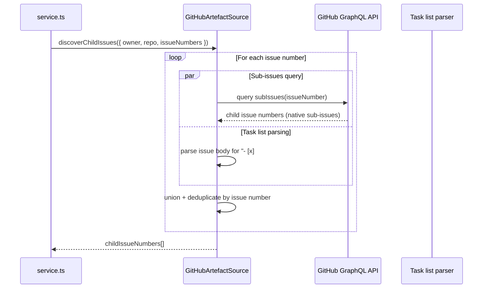
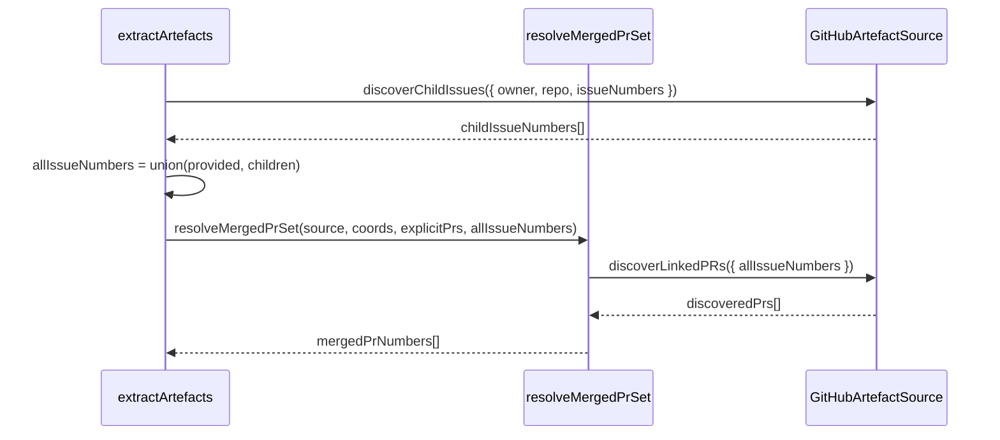
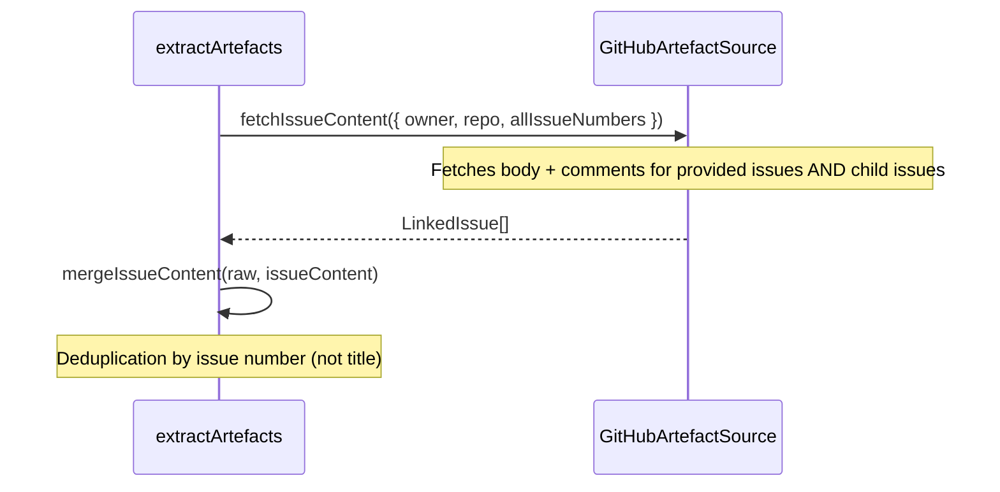
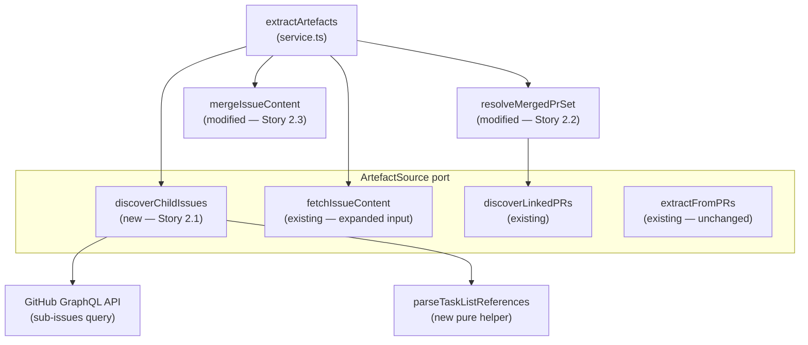

# LLD — Epic 2: Epic-Aware Artefact Discovery

## Document Control

| Field | Value |
|-------|-------|
| Epic | #321 — V4 epic-aware artefact discovery |
| Requirements | `docs/requirements/v4-requirements.md` §Epic 2 |
| HLD reference | `docs/design/v1-design.md` §C5 (Artefact Extraction) |
| Predecessor | `docs/design/lld-e19.md` — V2 Epic 19: GitHub Issues as Artefact Source |
| Status | Draft |
| Created | 2026-04-24 |

---

## Part A — Human-Reviewable Design

### Purpose

When an Org Admin provides an epic issue number as an assessment source, the pipeline currently finds zero PRs — epics don't have cross-referenced PRs directly. This epic adds one-level traversal: epic → child issues → their linked PRs + content, so the rubric generation receives the full implementation context.

Three stories, all modifying the same adapter and service surface:

1. **2.1** — Discover child issues (sub-issues API + task list parsing)
2. **2.2** — Feed child issue PRs into the merged PR set
3. **2.3** — Include child issue content in LLM context

### Behavioural Flows

#### 2.1 — Child issue discovery



#### 2.2 — Child issue PRs fed into artefact extraction



#### 2.3 — Child issue content included in LLM context



### Structural Overview



### Invariants

| # | Invariant | Verification |
|---|-----------|-------------|
| I1 | Child issue discovery is always attempted on every provided issue — no label check | Unit test: non-epic issue returns empty set (no error) |
| I2 | Only one level of traversal (epic → children, not epic → children → grandchildren) | Unit test: child issue that is itself an epic does not trigger further discovery |
| I3 | Sub-issues and task list results are unioned and deduplicated by issue number | Unit test: overlapping results → no duplicates |
| I4 | Task list parsing only matches `- [x] #N` and `- [ ] #N` — not prose references | Unit test: `see #123` in body text is not extracted |
| I5 | Child-issue-discovered PRs are deduplicated against explicit and issue-discovered PRs | Unit test: PR in both sets → appears once |
| I6 | Issue content deduplication uses issue number, not title | Unit test: two issues with the same title → both kept |
| I7 | When no children are found, pipeline continues unchanged (existing behaviour) | Unit test: empty children → same output as before |

### Acceptance Criteria + BDD Specs

See Part B for per-story BDD specs.

---

## Part B — Agent-Implementable Design

### Story 2.1: Discover child issues from epic issues

#### Layers

- **BE** — New `discoverChildIssues` method on port + adapter, new GraphQL query, task list parser

#### Port extension

Add to `src/lib/engine/ports/artefact-source.ts`:

```typescript
export interface ArtefactSource {
  extractFromPRs(params: PRExtractionParams): Promise<RawArtefactSet>;
  fetchIssueContent(params: IssueQueryParams): Promise<LinkedIssue[]>;
  discoverLinkedPRs(params: IssueQueryParams): Promise<number[]>;
  discoverChildIssues(params: IssueQueryParams): Promise<number[]>;  // NEW
}
```

Same `IssueQueryParams` shape — `{ owner, repo, issueNumbers }`.

#### GraphQL query — sub-issues

Add to `src/lib/github/artefact-source.ts`:

```graphql
query($owner: String!, $repo: String!, $issueNumber: Int!) {
  repository(owner: $owner, name: $repo) {
    issue(number: $issueNumber) {
      subIssues(first: 50) {
        nodes {
          number
        }
      }
    }
  }
}
```

Response type:

```typescript
interface SubIssuesQueryResponse {
  repository: {
    issue: {
      subIssues: {
        nodes: Array<{ number: number }>;
      };
    } | null;
  };
}
```

Notes:
- `subIssues` is GitHub's native sub-issues API (available since 2025). Fetches up to 50 child issues per parent — sufficient for typical epics.
- One query per provided issue number, concurrent via `Promise.all` (same pattern as `discoverLinkedPRs`).

#### Task list reference parsing

Pure function, add to `src/lib/github/artefact-source.ts` in the pure helpers section:

```typescript
function parseTaskListReferences(body: string): number[] {
  const pattern = /^- \[[x ]\] #(\d+)/gm;
  const numbers: number[] = [];
  let match: RegExpExecArray | null;
  while ((match = pattern.exec(body)) !== null) {
    numbers.push(Number.parseInt(match[1]!, 10));
  }
  return numbers;
}
```

Key constraints:
- Anchored to start of line (`^` with `m` flag) — only matches Markdown checkbox items
- Matches both checked (`[x]`) and unchecked (`[ ]`)
- Does NOT match prose references like `see #123` or `closes #456`
- Returns raw numbers — deduplication happens in the caller

#### Adapter method

```typescript
async discoverChildIssues(params: IssueQueryParams): Promise<number[]> {
  const perIssue = await Promise.all(
    params.issueNumbers.map(n => this.discoverChildrenForIssue(params.owner, params.repo, n)),
  );
  return Array.from(new Set(perIssue.flat()));
}
```

Private helper `discoverChildrenForIssue`:

```typescript
private async discoverChildrenForIssue(
  owner: string, repo: string, issueNumber: number,
): Promise<number[]> {
  const [subIssueNumbers, issueBody] = await Promise.all([
    this.querySubIssues(owner, repo, issueNumber),
    this.fetchIssueBody(owner, repo, issueNumber),
  ]);
  const taskListNumbers = issueBody !== null ? parseTaskListReferences(issueBody) : [];
  const combined = new Set([...subIssueNumbers, ...taskListNumbers]);
  if (combined.size > 0) {
    logger.info({
      issueNumber,
      childIssueCount: combined.size,
      childIssueNumbers: Array.from(combined),
      discoveryMechanism: subIssueNumbers.length > 0 && taskListNumbers.length > 0
        ? 'both' : subIssueNumbers.length > 0 ? 'sub_issues' : 'task_list',
    }, 'discoverChildIssues: children found');
  }
  return Array.from(combined);
}
```

Private helper `querySubIssues`:

```typescript
private async querySubIssues(owner: string, repo: string, issueNumber: number): Promise<number[]> {
  try {
    const result = await this.octokit.graphql<SubIssuesQueryResponse>(SUB_ISSUES_QUERY, { owner, repo, issueNumber });
    return result.repository.issue?.subIssues.nodes.map(n => n.number) ?? [];
  } catch (err) {
    logger.warn({ err, issueNumber }, 'querySubIssues: GraphQL query failed — falling back to task list only');
    return [];
  }
}
```

Private helper `fetchIssueBody` — fetches only the issue body text (not comments) for task list parsing:

```typescript
private async fetchIssueBody(owner: string, repo: string, issueNumber: number): Promise<string | null> {
  try {
    const { data } = await this.octokit.rest.issues.get({ owner, repo, issue_number: issueNumber });
    return data.body ?? null;
  } catch (err) {
    logger.warn({ err, issueNumber }, 'fetchIssueBody: failed');
    return null;
  }
}
```

Note: this fetches the issue body a second time (it's also fetched later by `fetchIssueContent`). The cost is one extra REST call per provided issue, which is acceptable given that epic discovery runs on 1–3 issues typically. Caching is a future optimisation if needed.

#### BDD specs — Story 2.1

```typescript
describe('discoverChildIssues', () => {
  describe('sub-issue discovery', () => {
    it('returns sub-issue numbers from the GraphQL API')
    it('returns empty array when the issue has no sub-issues')
  })

  describe('task list reference parsing', () => {
    it('extracts issue numbers from "- [x] #N" patterns')
    it('extracts issue numbers from "- [ ] #N" patterns (unchecked)')
    it('does NOT extract issue references from prose (e.g. "see #123")')
    it('does NOT extract issue references from closes/fixes keywords')
    it('handles mixed content: task list items interleaved with prose and code blocks')
    it('returns empty array when body has no task list items')
  })

  describe('union and deduplication', () => {
    it('returns union of sub-issues and task list references, deduplicated by issue number')
    it('handles overlapping results from both strategies')
  })

  describe('scope', () => {
    it('always attempts discovery — no label check needed')
    it('returns empty array for non-epic issues (no error)')
  })

  describe('logging', () => {
    it('logs childIssueCount, childIssueNumbers, and discoveryMechanism when children found')
    it('does not log discovery mechanism when no children found')
  })
})

describe('parseTaskListReferences', () => {
  it('matches "- [x] #295" at start of line')
  it('matches "- [ ] #296" at start of line')
  it('does not match "  see #123" in prose')
  it('does not match "#456" without checkbox prefix')
  it('handles multiple references in one body')
  it('returns empty array for body with no task list items')
})
```

#### Files touched

| File | Change |
|------|--------|
| `src/lib/engine/ports/artefact-source.ts` | Add `discoverChildIssues` to `ArtefactSource` interface |
| `src/lib/github/artefact-source.ts` | Add `SUB_ISSUES_QUERY`, `SubIssuesQueryResponse`, `parseTaskListReferences`, `discoverChildIssues`, `discoverChildrenForIssue`, `querySubIssues`, `fetchIssueBody` |
| `tests/lib/github/artefact-source.test.ts` | Tests for `discoverChildIssues` and `parseTaskListReferences` |

---

### Story 2.2: Feed child issue PRs into artefact extraction

#### Layers

- **BE** — Modify `extractArtefacts` and `resolveMergedPrSet` in `service.ts`

#### Changes to `extractArtefacts`

Insert child issue discovery between the `coords` setup and `resolveMergedPrSet`:

```typescript
async function extractArtefacts(params: ExtractArtefactsParams): Promise<AssembledArtefactSet> {
  const { adminSupabase, octokit, repoInfo, prNumbers, issueNumbers, comprehensionDepth } = params;
  const coords: RepoCoords = { owner: repoInfo.orgName, repo: repoInfo.repoName };
  const source = new GitHubArtefactSource(octokit);
  // Story 2.1: discover child issues from provided issues
  const childIssueNumbers = issueNumbers.length > 0
    ? await source.discoverChildIssues({ ...coords, issueNumbers })
    : [];
  const allIssueNumbers = Array.from(new Set([...issueNumbers, ...childIssueNumbers]));
  // Story 2.2: pass all issue numbers (provided + children) to PR discovery
  const mergedPrNumbers = await resolveMergedPrSet(source, coords, prNumbers, allIssueNumbers);
  const [raw, issueContent, organisation_context] = await Promise.all([
    mergedPrNumbers.length > 0
      ? source.extractFromPRs({ ...coords, prNumbers: mergedPrNumbers })
      : emptyRawArtefactSet(),
    // Story 2.3: fetch content for all issues (provided + children)
    allIssueNumbers.length > 0
      ? source.fetchIssueContent({ ...coords, issueNumbers: allIssueNumbers })
      : Promise.resolve([] as LinkedIssue[]),
    loadOrgPromptContext(adminSupabase, repoInfo.orgId),
  ]);
  const merged = mergeIssueContent(raw, issueContent);
  return { ...merged, question_count: repoInfo.questionCount, artefact_quality: classifyArtefactQuality(merged), token_budget_applied: false, organisation_context, comprehension_depth: comprehensionDepth };
}
```

Key change: `issueNumbers` → `allIssueNumbers` in both `resolveMergedPrSet` and `fetchIssueContent`. The union + dedup ensures that PRs and content from child issues are included.

#### Logging extension

The existing `resolveMergedPrSet` log entry includes `explicitPrs`, `discoveredPrs`, and `mergedPrs`. No change to `resolveMergedPrSet` itself — it already receives the expanded `allIssueNumbers` and treats them uniformly. The child-vs-provided distinction is visible in the `discoverChildIssues` log (Story 2.1).

#### BDD specs — Story 2.2

```typescript
describe('extractArtefacts with child issues', () => {
  it('discovers child issues and includes their PRs in the merged PR set')
  it('deduplicates PRs linked to both the epic and a child issue')
  it('deduplicates PRs linked to multiple child issues')
  it('deduplicates child-issue-discovered PRs against explicit merged_pr_numbers')
  it('handles child issues with no linked PRs — no error, other PRs still included')
  it('continues unchanged when no children are discovered')
})
```

#### Files touched

| File | Change |
|------|--------|
| `src/app/api/fcs/service.ts` | `extractArtefacts`: add child issue discovery + union before PR resolution and content fetch |

---

### Story 2.3: Include child issue content in LLM context

#### Layers

- **BE** — Modify `extractArtefacts` (already changed in 2.2) and `mergeIssueContent` in `service.ts`

#### Changes

The `fetchIssueContent` call in `extractArtefacts` already uses `allIssueNumbers` (from Story 2.2 changes), so child issue content is automatically fetched.

The remaining change is to fix deduplication. The current `mergeIssueContent` deduplicates by title, which can incorrectly merge distinct issues with the same title. Change to deduplicate by issue number.

This requires `LinkedIssue` to carry the issue number. Extend the type:

**`src/lib/engine/prompts/artefact-types.ts`:**

```typescript
export const LinkedIssueSchema = z.object({
  title: z.string(),
  body: z.string(),
  number: z.number().int().positive().optional(),  // NEW — present for explicit issues, absent for PR-body-discovered
});
```

The `number` field is optional for backward compatibility — issues discovered from PR body cross-references (via `fetchLinkedIssues` in `extractSinglePR`) don't have a reliable number.

**`fetchSingleIssue`** — already has access to `issueNumber`, add it to the return:

```typescript
return { title: issueResp.data.title, body: combined, number: issueNumber };
```

**`mergeIssueContent`** — use number-based dedup when available, fall back to title:

```typescript
function mergeIssueContent(raw: RawArtefactSet, issues: LinkedIssue[]): RawArtefactSet {
  if (issues.length === 0) return raw;
  const byKey = new Map<string, LinkedIssue>();
  for (const issue of raw.linked_issues ?? []) {
    byKey.set(issue.number !== undefined ? `#${issue.number}` : issue.title, issue);
  }
  for (const issue of issues) {
    byKey.set(issue.number !== undefined ? `#${issue.number}` : issue.title, issue);
  }
  return { ...raw, linked_issues: Array.from(byKey.values()) };
}
```

#### Artefact quality classification

No change needed. `classifyArtefactQuality` checks `hasContent(artefacts.linked_issues)` — child issues flow through the same `linked_issues` field and contribute to the `code_and_requirements` classification automatically.

#### Token budget

When truncation is enabled (future), child issue comments should be truncated before child issue bodies, and child issue bodies before the epic body. The current truncation system operates on the `linked_issues` array by position — epic content is first (provided issues are fetched before children). This ordering is natural given that `allIssueNumbers` starts with provided issues.

#### Logging extension

Log child issue discovery at the `extractArtefacts` call site:

```typescript
// In extractArtefacts, after discoverChildIssues:
if (childIssueNumbers.length > 0) {
  logger.info({ childIssueCount: childIssueNumbers.length, childIssueNumbers }, 'extractArtefacts: child issues discovered');
}
```

#### BDD specs — Story 2.3

```typescript
describe('child issue content in LLM context', () => {
  describe('content fetching', () => {
    it('fetches body and comments for child issues alongside the epic')
    it('includes both epic and child issue content in linked_issues')
    it('epic content is not replaced by child issue content')
  })

  describe('deduplication', () => {
    it('deduplicates by issue number when a child was also explicitly provided')
    it('does not merge distinct issues that happen to have the same title')
  })

  describe('artefact quality', () => {
    it('classifies as code_and_requirements when child issue content is present')
  })
})
```

#### Files touched

| File | Change |
|------|--------|
| `src/lib/engine/prompts/artefact-types.ts` | Add optional `number` field to `LinkedIssueSchema` |
| `src/lib/github/artefact-source.ts` | `fetchSingleIssue`: include `number` in returned `LinkedIssue` |
| `src/app/api/fcs/service.ts` | `mergeIssueContent`: dedup by number instead of title; `extractArtefacts`: log child issue count |
| `tests/app/api/fcs/service.test.ts` | Tests for updated `mergeIssueContent` and child content flow |

---

## Tasks

| # | Task | Stories | Est. lines | Key files |
|---|------|---------|-----------|-----------|
| T1 | Epic-aware artefact discovery | 2.1, 2.2, 2.3 | ~150 | `artefact-source.ts` (port + adapter), `artefact-types.ts`, `service.ts` |

**Execution:** Single task. Stories are implemented in order (2.1 → 2.2 → 2.3) within the same PR since they share files and each depends on the previous.
