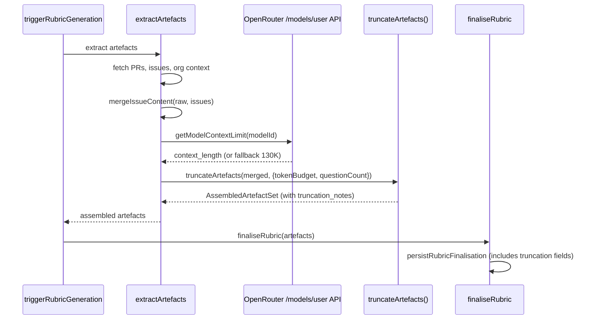
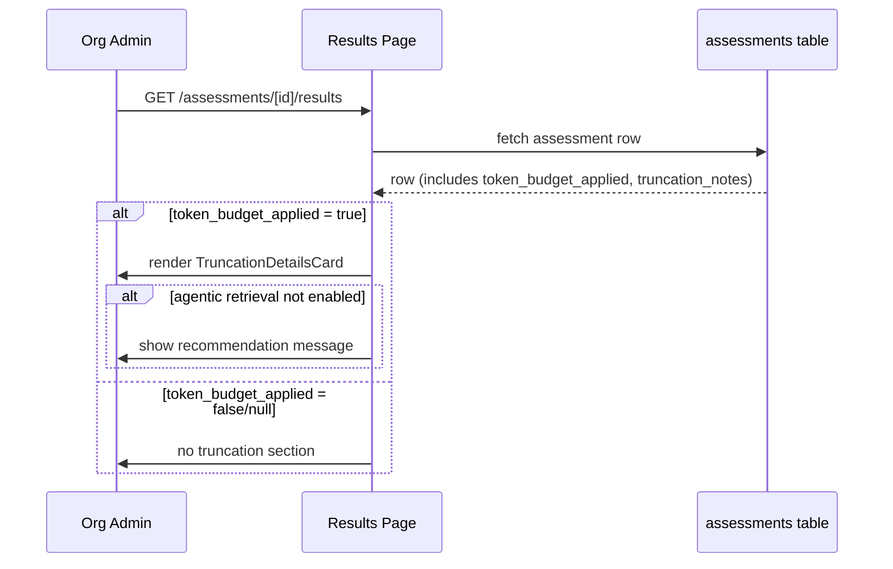
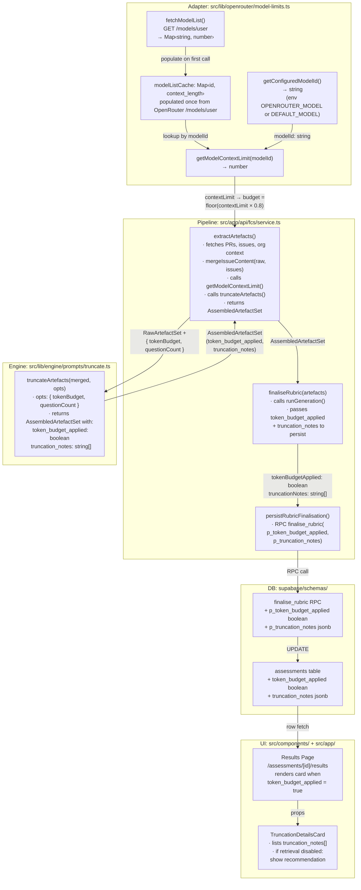

# LLD — V5 Epic 1: Model-Aware Token Budget Enforcement

## Change Log

| Date | Author | Changes |
|------|--------|---------|
| 2026-04-25 | Claude | Initial LLD — all three stories |
| 2026-04-25 | Claude | Story 1.1: cache full model list instead of per-model; remove DEFAULT_MODEL dot-format fix; add guardrails note |
| 2026-04-25 | Claude | Story 1.1: use `/models/user` endpoint; replace `fetchFn` injection with MSW for testing |

## Design Reference

- Requirements: `docs/requirements/v5-requirements.md` — Epic 1
- HLD: `docs/design/v1-design.md` — artefact pipeline
- ADR-0015: OpenRouter as LLM gateway
- ADR-0023: Tool-use loop for rubric generation

---

## Part A — Human-Reviewable

### Purpose

Wire the existing `truncateArtefacts()` function into the assessment pipeline with a model-aware token budget. The token budget is derived from the model's context limit (fetched from the OpenRouter API), not a fixed constant. Truncation metadata is persisted in the database and surfaced on the results page so users can make informed decisions about enabling agentic retrieval.

### Behavioural Flows

#### Story 1.1 + 1.2: Token budget enforcement during rubric generation



#### Story 1.3: Truncation details on results page



### Structural Overview



### Invariants

| # | Invariant | Verification |
|---|-----------|-------------|
| I1 | Token budget = `Math.floor(contextLimit * 0.8)` | Unit test: budget derivation |
| I2 | File listing is never truncated | Existing test in `truncate.test.ts` |
| I3 | Full model list is fetched once per process lifetime; subsequent lookups are pure map reads | Unit test: MSW handler, request two different models, assert single fetch call |
| I4 | OpenRouter API failure does not block rubric generation | Unit test: network error → fallback 130K + warning log |
| I5 | `token_budget_applied` reflects actual truncation state, never hardcoded | Unit test: wiring produces correct value |
| I6 | Truncation details section only renders when `token_budget_applied = true` | Component test |
| I7 | `truncation_notes` is persisted as `jsonb` in DB | Schema test: `db diff` empty after migration |

### Acceptance Criteria

See each story section in Part B.

---

## Part B — Agent-Implementable

### Story 1.1: Model Context Limit Lookup from OpenRouter

**Files:**

| File | Action | Layer |
|------|--------|-------|
| `src/lib/openrouter/model-limits.ts` | Create | Adapter |
| `tests/lib/openrouter/model-limits.test.ts` | Create | Test |

#### Internal Decomposition

**`getModelContextLimit(modelId: string): Promise<number>`**

Pure adapter function. No framework imports, no Supabase.

```typescript
// src/lib/openrouter/model-limits.ts

export const DEFAULT_CONTEXT_LIMIT = 130_000;

/** Cached model list: modelId → context_length. Populated on first call. */
let modelListCache: Map<string, number> | null = null;

/** Clears the module-level cache. Test-only. */
export function clearModelLimitsCache(): void {
  modelListCache = null;
}

export async function getModelContextLimit(
  modelId: string,
): Promise<number> {
  if (!modelListCache) {
    modelListCache = await fetchModelList();
  }
  return modelListCache.get(modelId) ?? DEFAULT_CONTEXT_LIMIT;
}
```

**`fetchModelList(): Promise<Map<string, number>>`**

- Calls `GET https://openrouter.ai/api/v1/models/user` with `Authorization: Bearer ${apiKey}`.
  - `apiKey` from `process.env['OPENROUTER_API_KEY']`.
- Returns only models the API key has access to (filtered by OpenRouter guardrails).
- Parses response as `{ data: Array<{ id: string; context_length: number | null }> }`.
- Builds a `Map<string, number>` from entries where `context_length` is a positive number.
  Entries with null or non-positive `context_length` are skipped (those models will fall back to `DEFAULT_CONTEXT_LIMIT` on lookup).
- If fetch fails (network error, non-2xx), logs warning and returns an empty map (callers fall back to `DEFAULT_CONTEXT_LIMIT`).
- The list is fetched once per process lifetime and cached. Subsequent `getModelContextLimit()` calls are pure map lookups — no network I/O.

**Note on OpenRouter guardrails:** When guardrails are configured on the OpenRouter account, the `/models/user` response is filtered to allowed models (plus a few extras OpenRouter adds). This keeps the cached list small. The guardrail configuration is manual for now; automation is out of scope.

**Model ID resolution:**

The model ID comes from `process.env['OPENROUTER_MODEL']` or the `DEFAULT_MODEL` constant in `src/lib/engine/llm/client.ts`. A new helper `getConfiguredModelId()` is needed:

```typescript
// src/lib/openrouter/model-limits.ts
import { DEFAULT_MODEL } from '@/lib/engine/llm/client';

export function getConfiguredModelId(): string {
  return process.env['OPENROUTER_MODEL'] ?? DEFAULT_MODEL;
}
```

**Testability:** Tests use MSW (`setupServer`) to intercept `GET /api/v1/models/user`
and return controlled responses. `clearModelLimitsCache()` is called in `beforeEach`
to reset singleton state between tests. This follows the project's established
HTTP mocking pattern.

#### BDD Specs

```typescript
// Uses MSW setupServer to intercept GET https://openrouter.ai/api/v1/models/user
// beforeEach: clearModelLimitsCache() to reset singleton

describe('getModelContextLimit', () => {
  describe('Given the OpenRouter API returns a valid model list', () => {
    it('should return the context_length for the matching model', async () => {
      // MSW handler returns { data: [{ id: 'deepseek/deepseek-v4-flash', context_length: 1000000 }] }
      // expect(result).toBe(1000000)
    });
  });

  describe('Given the model is not found in the API response', () => {
    it('should fall back to DEFAULT_CONTEXT_LIMIT', async () => {
      // MSW handler returns { data: [{ id: 'other-model', context_length: 100000 }] }
      // expect(result).toBe(130000)
    });
  });

  describe('Given the API returns context_length: null for the model', () => {
    it('should fall back to DEFAULT_CONTEXT_LIMIT', async () => {
      // MSW handler returns { data: [{ id: 'deepseek/deepseek-v4-flash', context_length: null }] }
      // expect(result).toBe(130000)
    });
  });

  describe('Given the OpenRouter API call fails', () => {
    it('should fall back to DEFAULT_CONTEXT_LIMIT and log a warning', async () => {
      // MSW handler returns HttpResponse.error()
      // expect(result).toBe(130000)
    });
  });

  describe('Given two different models are requested', () => {
    it('should fetch the model list once and serve both from cache', async () => {
      // MSW handler returns two models, call getModelContextLimit for each
      // Assert handler called once (via request count), both return correct values
    });
  });
});

describe('getConfiguredModelId', () => {
  it('should return OPENROUTER_MODEL env var when set', () => {});
  it('should return DEFAULT_MODEL when env var is unset', () => {});
});
```

---

### Story 1.2: Wire Truncation into the Artefact Pipeline

**Files:**

| File | Action | Layer |
|------|--------|-------|
| `src/app/api/fcs/service.ts` | Edit (`extractArtefacts`) | Pipeline |
| `tests/api/fcs/service-truncation.test.ts` | Create | Test |

#### Internal Decomposition

**Change to `extractArtefacts()` (line 563–564):**

Before (current):
```typescript
const merged = mergeIssueContent(raw, issueContent);
return { ...merged, question_count: repoInfo.questionCount, artefact_quality: classifyArtefactQuality(merged), token_budget_applied: false, organisation_context, comprehension_depth: comprehensionDepth };
```

After:
```typescript
const merged = mergeIssueContent(raw, issueContent);
const contextLimit = await getModelContextLimit(getConfiguredModelId());
const tokenBudget = Math.floor(contextLimit * 0.8);
const assembled = truncateArtefacts(merged, {
  questionCount: repoInfo.questionCount,
  tokenBudget,
});
return { ...assembled, organisation_context, comprehension_depth: comprehensionDepth };
```

**New imports in `service.ts`:**
```typescript
import { truncateArtefacts } from '@/lib/engine/prompts/truncate';
import { getModelContextLimit, getConfiguredModelId } from '@/lib/openrouter/model-limits';
```

**Remove:**
- `import { classifyArtefactQuality }` — `truncateArtefacts()` already calls it internally.
- The hardcoded `token_budget_applied: false`.

**Logging enhancement in `logArtefactSummary()`:**

Add `truncation_notes` to the log payload (line 287–296). It's already logging `tokenBudgetApplied` — add `truncationNotes` when present:

```typescript
...(artefacts.truncation_notes && { truncationNotes: artefacts.truncation_notes }),
```

#### BDD Specs

```typescript
describe('extractArtefacts truncation wiring', () => {
  describe('Given an artefact set that fits within the model context budget', () => {
    it('should return token_budget_applied: false with no truncation_notes', async () => {});
  });

  describe('Given an artefact set that exceeds the model context budget', () => {
    it('should return token_budget_applied: true with truncation_notes', async () => {});
  });

  describe('Given the model context limit is fetched successfully', () => {
    it('should compute tokenBudget as Math.floor(contextLimit * 0.8)', async () => {});
  });

  describe('Given the OpenRouter API fails', () => {
    it('should use the fallback context limit for budget computation', async () => {});
  });
});
```

**Note:** These are integration-level tests that exercise `extractArtefacts` with mocked GitHub and OpenRouter dependencies. The truncation logic itself is already covered by 10 existing tests in `truncate.test.ts`.

---

### Story 1.3: Surface Truncation Details on Assessment Results

**Files:**

| File | Action | Layer |
|------|--------|-------|
| `supabase/schemas/tables.sql` | Edit (add columns) | DB |
| `supabase/schemas/functions.sql` | Edit (`finalise_rubric` overload) | DB |
| `src/app/api/fcs/service.ts` | Edit (`persistRubricFinalisation`) | BE |
| `src/components/assessment/TruncationDetailsCard.tsx` | Create | FE |
| `src/app/assessments/[id]/results/page.tsx` | Edit (add card) | FE |
| `tests/components/truncation-details-card.test.ts` | Create | Test |

#### Schema Changes

**`supabase/schemas/tables.sql`** — add after the rubric observability block (after line 166):

```sql
  -- Token budget enforcement (V5 Epic 1). Populated on rubric generation.
  -- See docs/design/lld-v5-e1-token-budget.md §1.3.
  token_budget_applied     boolean,
  truncation_notes         jsonb,
```

**`supabase/schemas/functions.sql`** — update the observability overload of `finalise_rubric` (line 313–350):

Add two new parameters:

```sql
CREATE OR REPLACE FUNCTION finalise_rubric(
  p_assessment_id          uuid,
  p_org_id                 uuid,
  p_questions              jsonb,
  p_rubric_input_tokens    integer,
  p_rubric_output_tokens   integer,
  p_rubric_tool_call_count integer,
  p_rubric_tool_calls      jsonb,
  p_rubric_duration_ms     integer,
  p_token_budget_applied   boolean DEFAULT NULL,
  p_truncation_notes       jsonb   DEFAULT NULL
)
```

And add to the UPDATE SET clause:

```sql
      token_budget_applied       = p_token_budget_applied,
      truncation_notes           = p_truncation_notes,
```

**Migration:** Generated via `npx supabase db diff -f v5-token-budget-columns`. Not hand-authored.

#### Backend Changes

**`persistRubricFinalisation`** — add truncation params to the RPC call:

```typescript
// In RubricPersistParams, add:
tokenBudgetApplied: boolean;
truncationNotes: string[] | undefined;

// In the .rpc('finalise_rubric', { ... }) call, add:
p_token_budget_applied: params.tokenBudgetApplied,
p_truncation_notes: params.truncationNotes ? (params.truncationNotes as unknown as Json) : null,
```

**`finaliseRubric`** — pass truncation data from artefacts to persist:

```typescript
await persistRubricFinalisation(params.adminSupabase, {
  assessmentId, orgId, questions: result.rubric.questions, observability: result.observability,
  tokenBudgetApplied: params.artefacts.token_budget_applied,
  truncationNotes: params.artefacts.truncation_notes,
});
```

#### Frontend — TruncationDetailsCard

```typescript
// src/components/assessment/TruncationDetailsCard.tsx

export interface TruncationDetailsCardProps {
  readonly token_budget_applied: boolean | null;
  readonly truncation_notes: readonly string[] | null;
  readonly rubric_tool_call_count: number | null; // to check if retrieval was enabled
}

export default function TruncationDetailsCard(
  props: TruncationDetailsCardProps,
): React.ReactElement | null {
  if (!props.token_budget_applied) return null;

  const notes = props.truncation_notes ?? [];
  const retrievalEnabled = (props.rubric_tool_call_count ?? 0) > 0;

  return (
    <section className="bg-surface border border-border rounded-md shadow-sm p-card-pad">
      <h3 className="text-heading-md font-display">Truncation details</h3>
      <ul className="list-disc pl-5 mt-2 space-y-1">
        {notes.map((note, i) => (
          <li key={i} className="text-body text-text-secondary">{note}</li>
        ))}
      </ul>
      {!retrievalEnabled && (
        <p className="text-body text-text-secondary mt-3">
          Some artefacts were truncated to fit the model&apos;s context window.
          Enable retrieval in organisation settings to let the LLM fetch
          additional content on demand.
        </p>
      )}
    </section>
  );
}
```

#### Results Page Integration

In `AdminAggregateView`, add `TruncationDetailsCard` above `RetrievalDetailsCard`:

```tsx
<TruncationDetailsCard
  token_budget_applied={assessment.token_budget_applied}
  truncation_notes={assessment.truncation_notes as readonly string[] | null}
  rubric_tool_call_count={assessment.rubric_tool_call_count}
/>
<RetrievalDetailsCard ... />
```

#### BDD Specs

```typescript
describe('TruncationDetailsCard', () => {
  describe('Given token_budget_applied is true', () => {
    it('should render the truncation details section', () => {});

    it('should render each truncation note as a list item', () => {});
  });

  describe('Given token_budget_applied is true and retrieval was not enabled', () => {
    it('should render the retrieval recommendation message', () => {});
  });

  describe('Given token_budget_applied is true and retrieval was enabled', () => {
    it('should not render the retrieval recommendation message', () => {});
  });

  describe('Given token_budget_applied is false', () => {
    it('should render nothing', () => {});
  });

  describe('Given token_budget_applied is null', () => {
    it('should render nothing', () => {});
  });
});
```

---

## Task Summary

| # | Task | Story | Estimated PR diff | Dependencies |
|---|------|-------|-------------------|-------------|
| T1 | Model context limit lookup from OpenRouter | 1.1 | ~150 lines | None |
| T2 | Wire truncation into artefact pipeline | 1.2 | ~100 lines | T1 |
| T3 | Surface truncation details on results | 1.3 | ~200 lines | T2 |
