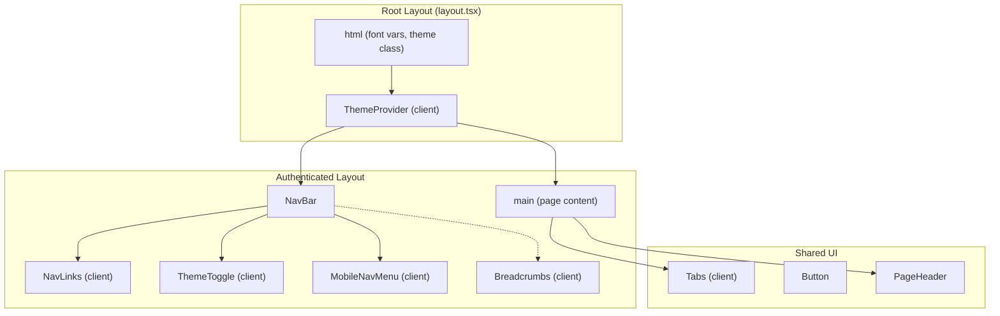
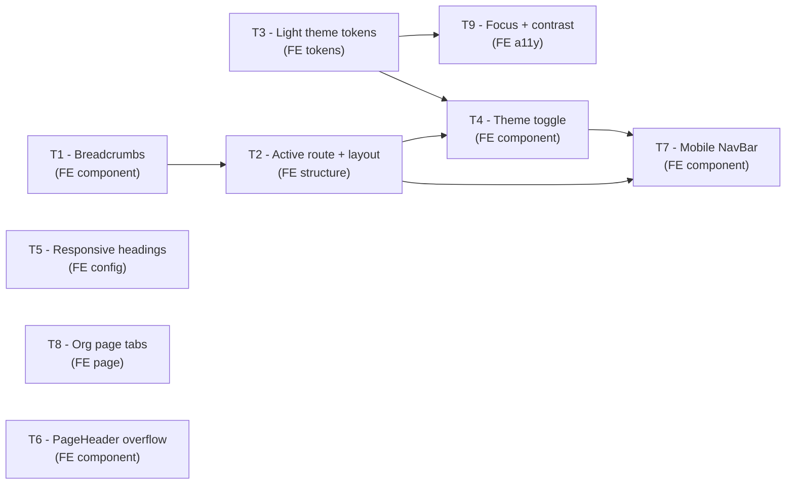

# Low-Level Design: V7 Frontend UX Improvements

## Document Control

| Field | Value |
|-------|-------|
| Version | 1.0 |
| Status | Draft |
| Author | LS / Claude |
| Created | 2026-04-25 |
| Parent | [v1-design.md](v1-design.md) |
| Epic | #339 |

---

## Part A — Human-Reviewable Design

### Purpose

Address five categories of frontend UX issues identified in a design audit: navigation/wayfinding, light/dark theming, responsive typography, organisation page layout density, and accessibility. All changes are frontend-only — no API routes, no database changes.

### Requirements reference

[docs/requirements/v7-requirements.md](../requirements/v7-requirements.md)

### Structural overview



### Invariants

| # | Invariant | Verification |
|---|-----------|-------------|
| I1 | All colour usage flows through CSS variables — no hard-coded hex in components | Grep: `grep -rn '#[0-9a-fA-F]\{3,8\}' src/components/ src/app/` returns only `globals.css` |
| I2 | Theme toggle must not cause flash of wrong theme on page load | E2E: load page in light mode, verify no dark flash before hydration |
| I3 | NavBar is visible on all authenticated pages including assessment answering | E2E: navigate to `/assessments/[id]`, verify NavBar is present |
| I4 | Focus rings appear only on keyboard focus, not mouse click | Manual: click button (no ring), tab to button (ring visible) |
| I5 | All text/background combinations meet WCAG AA (4.5:1 for body text, 3:1 for large text) | Audit: check computed contrast ratios for both themes |

---

## Part B — Agent-Implementable Design

### T1: Breadcrumbs component + integration

**Layer:** FE

**Files:**
- New: `src/components/ui/breadcrumbs.tsx`
- Edit: `src/app/(authenticated)/layout.tsx`

**Component spec:**

```tsx
// src/components/ui/breadcrumbs.tsx
'use client';

interface BreadcrumbSegment {
  label: string;
  href?: string; // undefined = current page (no link)
}

interface BreadcrumbsProps {
  segments: BreadcrumbSegment[];
}

export function Breadcrumbs({ segments }: BreadcrumbsProps) { ... }
```

**Route-to-breadcrumb mapping:**

| Route | Segments |
|-------|----------|
| `/assessments` | `[{ label: "My Assessments" }]` |
| `/assessments/new` | `[{ label: "My Assessments", href: "/assessments" }, { label: "New Assessment" }]` |
| `/assessments/[id]` | `[{ label: "My Assessments", href: "/assessments" }, { label: <feature_name> }]` |
| `/assessments/[id]/results` | `[{ label: "My Assessments", href: "/assessments" }, { label: <feature_name>, href: "/assessments/[id]" }, { label: "Results" }]` |
| `/assessments/[id]/submitted` | `[{ label: "My Assessments", href: "/assessments" }, { label: <feature_name> }, { label: "Submitted" }]` |
| `/organisation` | `[{ label: "Organisation" }]` |

**Integration:** Add breadcrumbs below the NavBar in the authenticated layout. Each page provides breadcrumb data via a wrapper or computed from pathname + page data.

**Styling:** `text-caption text-text-secondary`. Separator: `>` or `/` in `text-text-secondary`. Current segment: `text-text-primary`, not linked. Links: `hover:text-accent`.

**BDD specs:**

```
describe('Breadcrumbs')
  it('renders a single segment without a link for root pages')
  it('renders intermediate segments as links')
  it('renders the last segment as plain text (current page)')
  it('truncates long labels with ellipsis on narrow viewports')
  it('uses nav element with aria-label="Breadcrumb"')
```

---

### T2: NavBar active route + assessment pages layout restructure

**Layer:** FE

**Files:**
- Edit: `src/components/nav-bar.tsx`
- New: `src/components/nav-links.tsx` (client component extracted from NavBar)
- Move: `src/app/assessments/[id]/page.tsx` -> `src/app/(authenticated)/assessments/[id]/page.tsx`
- Move: `src/app/assessments/[id]/results/page.tsx` -> `src/app/(authenticated)/assessments/[id]/results/page.tsx`
- Move: `src/app/assessments/[id]/submitted/page.tsx` -> `src/app/(authenticated)/assessments/[id]/submitted/page.tsx`
- Edit: `src/app/assessments/[id]/answering-form.tsx` — remove `<main>` wrapper (layout provides it)
- Edit: `src/app/assessments/[id]/results/page.tsx` — remove `<main>` wrapper

**NavLinks client component:**

```tsx
// src/components/nav-links.tsx
'use client';

import { usePathname } from 'next/navigation';
import Link from 'next/link';

interface NavLink {
  href: string;
  label: string;
  matchPrefix: string; // e.g. '/assessments' matches '/assessments/...'
}

export function NavLinks({ links }: { links: NavLink[] }) { ... }
```

Active state: `text-accent border-b-2 border-accent` on the matching link.

**Layout restructure:** Move `src/app/assessments/[id]/` and its subdirectories under `src/app/(authenticated)/assessments/[id]/`. This brings them under the authenticated layout, providing NavBar and breadcrumbs automatically. Remove the `<main>` wrappers from `answering-form.tsx` and `results/page.tsx` since the layout provides one.

**BDD specs:**

```
describe('NavLinks')
  it('highlights "My Assessments" when pathname starts with /assessments')
  it('highlights "Organisation" when pathname is /organisation')
  it('highlights only one link at a time')
  it('renders links with correct href')

describe('Assessment page layout')
  it('renders NavBar on the assessment answering page')
  it('renders NavBar on the results page')
  it('renders NavBar on the submitted page')
```

---

### T3: Light theme colour tokens

**Layer:** FE

**Files:**
- Edit: `src/app/globals.css`
- Edit: `docs/design/frontend-system.md` — add light palette section

**Light palette (under `[data-theme="light"]`):**

```css
[data-theme="light"] {
  --color-background:       #f5f4f0;
  --color-surface:          #ffffff;
  --color-surface-raised:   #f0eeea;
  --color-border:           #ddd8d0;
  --color-text-primary:     #1a1d23;
  --color-text-secondary:   #5c6370;
  --color-accent:           #d97706;   /* slightly darker amber for light bg */
  --color-accent-hover:     #b45309;
  --color-accent-muted:     #fef3c7;
  --color-destructive:      #dc2626;
  --color-destructive-muted: #fef2f2;
  --color-success:          #16a34a;
}
```

**Default:** Dark remains default. The `:root` selector keeps dark values. `[data-theme="light"]` overrides.

**Contrast verification:** All combinations must pass WCAG AA:
- Light: `#1a1d23` on `#f5f4f0` = 14.5:1. `#5c6370` on `#f5f4f0` = 5.5:1. `#d97706` on `#f5f4f0` = 4.6:1.
- Dark: `#e8eaf0` on `#0d0f14` = 15.2:1. `#8f96a8` on `#0d0f14` = 5.8:1.

**BDD specs:**

```
describe('Light theme tokens')
  it('defines all required CSS variables under [data-theme="light"]')
  it('dark theme remains the default (:root)')
  it('all light theme text/bg combinations meet WCAG AA 4.5:1')
```

---

### T4: Theme toggle + persistence

**Layer:** FE

**Files:**
- New: `src/components/theme-toggle.tsx` (client component)
- Edit: `src/app/layout.tsx` — add theme initialisation script to prevent flash
- Edit: `src/components/nav-bar.tsx` — add ThemeToggle to right section

**Component spec:**

```tsx
// src/components/theme-toggle.tsx
'use client';

export function ThemeToggle() {
  // Reads/writes localStorage key 'fcs-theme' ('light' | 'dark')
  // Falls back to prefers-color-scheme
  // Sets data-theme attribute on <html>
  // Icon: Sun (lucide-react) for dark-to-light, Moon for light-to-dark
}
```

**Flash prevention:** Inline script in `layout.tsx` `<head>` that reads `localStorage` before React hydrates and sets `data-theme` on `<html>`. This runs synchronously before first paint. The script is a static string with no user input — no XSS risk.

**BDD specs:**

```
describe('ThemeToggle')
  it('renders a button with aria-label "Toggle theme"')
  it('toggles data-theme between light and dark on click')
  it('persists preference to localStorage')
  it('reads saved preference on mount')
  it('defaults to prefers-color-scheme when no saved preference')
```

---

### T5: Responsive heading sizes

**Layer:** FE

**Files:**
- Edit: `tailwind.config.ts`
- Edit: `docs/design/frontend-system.md` — update type scale section

**Updated fontSize config:**

```ts
fontSize: {
  display:      ['clamp(2.5rem, 6vw, 4rem)',    { lineHeight: '1.0',  fontWeight: '700' }],
  'heading-xl': ['clamp(1.5rem, 4vw, 2.25rem)', { lineHeight: '1.2',  fontWeight: '700' }],
  'heading-lg': ['clamp(1.25rem, 3vw, 1.5rem)', { lineHeight: '1.3',  fontWeight: '600' }],
  'heading-md': ['1.125rem',                     { lineHeight: '1.4',  fontWeight: '600' }],
  body:         ['0.9375rem',                    { lineHeight: '1.6',  fontWeight: '400' }],
  label:        ['0.8125rem',                    { lineHeight: '1.4',  fontWeight: '500' }],
  caption:      ['0.75rem',                      { lineHeight: '1.5',  fontWeight: '400' }],
},
```

Only `display`, `heading-xl`, and `heading-lg` get `clamp()`. Smaller sizes remain fixed — they don't overflow on mobile.

**BDD specs:**

```
describe('Responsive headings')
  it('heading-xl renders at 1.5rem on 320px viewport')
  it('heading-xl renders at 2.25rem on 1280px viewport')
  it('display renders at 2.5rem on 320px viewport')
```

---

### T6: PageHeader overflow + mobile stacking

**Layer:** FE

**Files:**
- Edit: `src/components/ui/page-header.tsx`

**Changes:**

```tsx
export function PageHeader({ title, subtitle, action }: PageHeaderProps) {
  return (
    <div className="flex flex-col gap-4 sm:flex-row sm:items-start sm:justify-between">
      <div className="min-w-0">
        <h1 className="text-heading-xl font-display break-words">{title}</h1>
        {subtitle ? (
          <p className="text-body text-text-secondary mt-1">{subtitle}</p>
        ) : null}
      </div>
      {action ?? null}
    </div>
  );
}
```

Key changes: `flex-col` on mobile, `sm:flex-row` on desktop. `min-w-0` prevents flex child from overflowing. `break-words` handles long unbroken strings.

**BDD specs:**

```
describe('PageHeader')
  it('stacks title and action vertically on mobile (< 640px)')
  it('places title and action side-by-side on desktop (>= 640px)')
  it('wraps long titles without horizontal overflow')
```

---

### T7: Mobile NavBar hamburger menu

**Layer:** FE

**Files:**
- Edit: `src/components/nav-bar.tsx` — hide links on mobile, show hamburger
- New: `src/components/mobile-nav-menu.tsx` (client component)

**Component spec:**

```tsx
// src/components/mobile-nav-menu.tsx
'use client';

interface MobileNavMenuProps {
  links: { href: string; label: string }[];
  username: string;
  orgName: string;
  allOrgs: { id: string; name: string }[];
}

export function MobileNavMenu({ links, username, orgName, allOrgs }: MobileNavMenuProps) {
  // Hamburger icon (Menu from lucide-react)
  // Opens dropdown/slide panel on click
  // Contains: nav links, org switcher, username, sign out
  // Closes on: click outside, Escape key, link click
}
```

**NavBar changes:** Wrap the `<ul>` and right-side controls in `hidden md:flex`. Show hamburger button `md:hidden`.

**BDD specs:**

```
describe('MobileNavMenu')
  it('renders hamburger icon on mobile (< 768px)')
  it('hides hamburger on desktop (>= 768px)')
  it('opens menu panel on hamburger click')
  it('closes menu on Escape key')
  it('closes menu when a link is clicked')
  it('contains all nav links, org name, and sign out')
```

---

### T8: Tabbed organisation page

**Layer:** FE

**Files:**
- New: `src/components/ui/tabs.tsx` (client component)
- Edit: `src/app/(authenticated)/organisation/page.tsx`

**Tabs component spec:**

```tsx
// src/components/ui/tabs.tsx
'use client';

interface Tab {
  id: string;
  label: string;
  content: React.ReactNode;
}

interface TabsProps {
  tabs: Tab[];
  defaultTab?: string;
  queryParam?: string; // e.g. 'tab' — syncs active tab to URL ?tab=context
}

export function Tabs({ tabs, defaultTab, queryParam }: TabsProps) { ... }
```

**Styling:** Tab bar: `flex border-b border-border`. Active tab: `text-accent border-b-2 border-accent`. Inactive: `text-text-secondary hover:text-text-primary`. Tab panels: `py-section-gap`.

**Organisation page tabs:**

| Tab ID | Label | Content |
|--------|-------|---------|
| `assessments` | Assessments | `<DeleteableAssessmentTable>` |
| `context` | Context | `<OrgContextForm>` |
| `retrieval` | Retrieval | `<RetrievalSettingsForm>` |

Default tab: `assessments`. URL sync: `?tab=context` allows deep linking.

**BDD specs:**

```
describe('Tabs')
  it('renders all tab labels in a tab bar')
  it('shows the default tab content on mount')
  it('switches content when a tab is clicked')
  it('applies accent styling to the active tab')
  it('syncs active tab to URL query param when queryParam is set')

describe('Organisation page tabs')
  it('shows assessment table by default')
  it('shows context form when Context tab is clicked')
  it('shows retrieval settings when Retrieval tab is clicked')
```

---

### T9: Focus rings + contrast improvements

**Layer:** FE

**Files:**
- Edit: `src/app/globals.css`
- Edit: `src/components/ui/button.tsx`

**Global focus ring (in globals.css `@layer base`):**

```css
@layer base {
  *:focus-visible {
    outline: none;
    box-shadow: 0 0 0 2px var(--color-accent);
    border-radius: inherit;
  }
}
```

**Button update:** Add `focus-visible:ring-2 focus-visible:ring-accent focus-visible:outline-none` to the base classes (redundant with global rule but explicit for documentation).

**Contrast fix:** `--color-text-secondary` in dark theme: `#7a8499` to `#8f96a8`. (Light theme contrast already handled in T3.)

**Note:** The contrast fix for dark `--color-text-secondary` is placed in T9 rather than T3 to avoid both tasks editing the dark `:root` block in `globals.css`. T3 adds the `[data-theme="light"]` block only. T9 edits the `:root` block.

**BDD specs:**

```
describe('Focus rings')
  it('shows accent-coloured ring on Button when focused via keyboard')
  it('does not show ring on Button when clicked with mouse')
  it('shows ring on text inputs when focused via keyboard')
  it('shows ring on links when focused via keyboard')

describe('Contrast')
  it('dark theme --color-text-secondary is #8f96a8')
```

---

## Execution Waves

| Wave | Tasks | Blocked by | Parallel? |
|------|-------|------------|-----------|
| 1 | T1 (Breadcrumbs), T3 (Light tokens), T5 (Responsive headings), T8 (Org tabs) | — | Yes — no shared files |
| 2 | T2 (Active route + layout), T6 (PageHeader), T9 (Focus + contrast) | T1 (`layout.tsx`), T3 (`globals.css`) | Yes — no shared files within wave |
| 3a | T4 (Theme toggle) | T2 + T3 (`nav-bar.tsx`, theme tokens) | — |
| 3b | T7 (Mobile NavBar) | T4 (`nav-bar.tsx`) | Sequential after T4 |



**Wave 1** (T1, T3, T5, T8) can start immediately in parallel. **Wave 2** (T2, T6, T9) after Wave 1 merges. **Wave 3** is sequential: T4 then T7.
