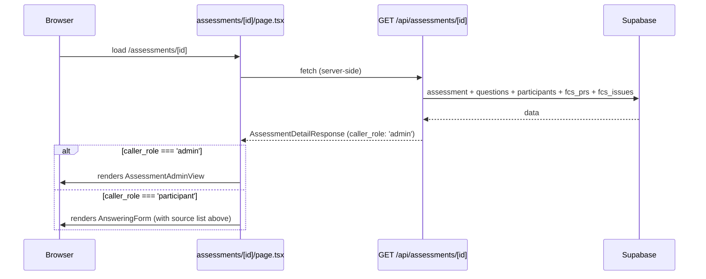
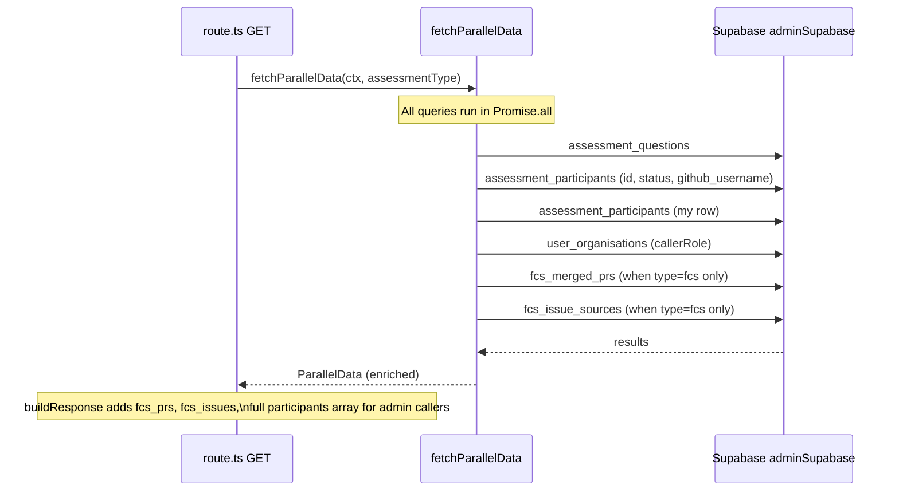

# Low-Level Design: V8 Assessment Detail View

## Document Control

| Field | Value |
|-------|-------|
| Version | 0.2 |
| Status | Revised |
| Author | LS / Claude |
| Created | 2026-04-26 |
| Revised | 2026-04-26 — Issue #361 |
| Epic | [#359](https://github.com/mironyx/feature-comprehension-score/issues/359) |
| Requirements | [docs/requirements/v8-requirements.md](../requirements/v8-requirements.md) — Epic 1 |
| Parent design | [docs/design/v1-design.md](v1-design.md) |

---

## Part A — Human-Reviewable Design

### Purpose

Expose assessment metadata to org admins without a separate route. Currently `/assessments/[id]` renders "Access Denied" for admins who are not participants; the data they need (repository, PRs, issues, participant status) is persisted but unreachable via UI. This epic adds:

1. Richer API response for FCS assessments (PRs and issues from `fcs_merged_prs` / `fcs_issue_sources`).
2. Full participant list for admin callers (`github_username` + `status`).
3. Role-based page rendering — admins see a detail view; participants see the answering form (with a new source context section above the questions).
4. Icon action buttons (delete + details) replacing the text "Delete" link in the org assessment table.
5. Assessment `description` displayed in the My Assessments list.

---

### Behavioural flows

#### T2: Admin opens `/assessments/[id]`



#### T1: API enrichment for FCS type



---

### Invariants

| # | Invariant | Verification |
|---|-----------|-------------|
| I1 | `fcs_prs` and `fcs_issues` are returned for all callers when `type=fcs` | Unit test: `buildResponse` with FCS assessment returns non-empty arrays |
| I2 | Full participant list returned only for admin callers; participant callers receive summary | Unit test: `buildResponse` with `callerRole='participant'` returns summary object |
| I3 | Admin callers never see "Access Denied" — `AssessmentAdminView` renders instead | E2E: admin navigates to assessment they are not a participant of → detail view visible |
| I4 | Participant view shows PRs/issues above the answering form when `type=fcs` | Unit test: `AssessmentSourceList` renders when `fcs_prs` is non-empty |
| I5 | No hard-coded hex colours — all styling uses design system tokens | Grep: `grep -rn '#[0-9a-fA-F]' src/app/(authenticated)/assessments/[id]/` returns nothing |

---

### Acceptance criteria

#### T1 — API extension

- [ ] `GET /api/assessments/[id]` for a `fcs` assessment returns `fcs_prs: [{ pr_number, pr_title }]` and `fcs_issues: [{ issue_number, issue_title }]` for both admin and participant callers.
- [ ] For admin callers, `participants` is an array of `{ github_login, status }` objects.
- [ ] For participant callers, `participants` remains `{ total: number; completed: number }`.
- [ ] `prcc` assessments are unaffected — `fcs_prs` and `fcs_issues` are empty arrays.
- [ ] A new `caller_role: 'admin' | 'participant'` field is present in the response.
- [ ] No additional sequential DB queries outside the existing `Promise.all` block.

#### T2 — Role-based page rendering

- [ ] Admin user who is not a participant lands on `AssessmentAdminView` showing: assessment name, description, repository, linked PRs, linked issues, participant list with status badges.
- [ ] Admin view includes a `← Back to Organisation` link to `/organisation`.
- [ ] Participant user sees the answering form, with linked PRs and issues rendered above the question list (FCS only).
- [ ] `AccessDeniedPage` is no longer reachable for admin callers.

#### T3 — Icon buttons

- [ ] The Actions column in `assessment-overview-table.tsx` shows two icon buttons: `Trash2` (delete) and `MoreHorizontal` (navigates to `/assessments/[id]`).
- [ ] The feature name link to `/assessments/[id]/results` is unchanged.
- [ ] Both icons have descriptive `aria-label` attributes.
- [ ] Delete behaviour is unchanged from before.

#### T4 — My Assessments description

- [ ] Each assessment card in My Assessments renders `feature_description` below the feature name when non-null.
- [ ] No API or schema change required — `feature_description` is added to the existing direct Supabase query.

---

## Part B — Agent-Implementable Design

---

### T1: Extend GET /api/assessments/[id]

**Layer:** BE
**Issue:** [#361](https://github.com/mironyx/feature-comprehension-score/issues/361)
**Files:**
- Edit: `src/app/api/assessments/[id]/route.ts`
- Edit: `src/app/api/assessments/[id]/helpers.ts` (if type declarations need splitting)

#### New response field types

```typescript
// Add to route.ts alongside existing contract types

interface FcsPr {
  pr_number: number;
  pr_title: string;
}

interface FcsIssue {
  issue_number: number;
  issue_title: string;
}

interface ParticipantSummary {
  total: number;
  completed: number;
}

type ParticipantStatus = 'pending' | 'submitted' | 'removed' | 'did_not_participate';

interface ParticipantDetail {
  github_login: string;
  status: ParticipantStatus;
}

> **Implementation note (issue #361):** `ParticipantStatus` was extracted as a named type alias
> (rather than an inline union literal) so it can be reused as a type assertion in `buildParticipantsField`.
```

#### AssessmentDetailResponse additions

Add these fields to the existing `AssessmentDetailResponse` interface in `route.ts`:

```typescript
fcs_prs: FcsPr[];
fcs_issues: FcsIssue[];
participants: ParticipantSummary | ParticipantDetail[];  // replaces existing { total, completed }
caller_role: 'admin' | 'participant';
```

#### ParallelData additions

```typescript
// Extend existing ParallelData in route.ts:
type ParallelData = {
  callerRole: 'admin' | 'participant';
  questions: QuestionRow[];
  allParticipants: { id: string; status: string; github_username: string }[]; // add github_username
  myParticipation: MyParticipation | null;
  fcsPrs: FcsPr[];     // new
  fcsIssues: FcsIssue[]; // new
};
```

#### fetchParallelData changes

Pass `assessmentType` to `fetchParallelData` and add two conditional queries inside the existing `Promise.all`:

```typescript
// fetchParallelData signature change: assessmentType added directly to FetchContext
interface FetchContext {
  supabase: UserClient;
  adminSupabase: ServiceClient;
  assessmentId: string;
  userId: string;
  orgId: string;
  assessmentType: 'prcc' | 'fcs';  // added
}

async function fetchParallelData(ctx: FetchContext): Promise<ParallelData>

// Inside Promise.all — add after existing 4 queries:
assessmentType === 'fcs'
  ? adminSupabase.from('fcs_merged_prs')
      .select('pr_number, pr_title').eq('assessment_id', assessmentId).eq('org_id', orgId)
  : Promise.resolve({ data: [], error: null }),
assessmentType === 'fcs'
  ? adminSupabase.from('fcs_issue_sources')
      .select('issue_number, issue_title').eq('assessment_id', assessmentId).eq('org_id', orgId)
  : Promise.resolve({ data: [], error: null }),

// Also change allParticipants select to include github_username + org_id filter:
adminSupabase.from('assessment_participants')
  .select('id, status, github_username').eq('assessment_id', assessmentId).eq('org_id', orgId)
```

> **Implementation note (issue #361):** The LLD sketched `assessmentType` as an intersection on
> `FetchContext` (`FetchContext & { assessmentType }`). In practice it was added directly to
> `FetchContext` — cleaner and consistent with how `orgId` is already carried.
> All `adminSupabase` queries also received `.eq('org_id', orgId)` as defence-in-depth: the
> initial RLS-scoped assessment lookup is the primary auth gate, but constraining service-role
> queries by the verified `orgId` removes blast radius if RLS on `assessments` is ever
> misconfigured.

#### buildResponse changes

```typescript
// participants delegated to extracted helper (see below):
participants: buildParticipantsField(callerRole, allParticipants),

// Add new fields:
fcs_prs: fcsPrs,
fcs_issues: fcsIssues,
caller_role: callerRole,
```

> **Implementation note (issue #361):** The LLD showed the participants ternary inline in
> `buildResponse`. It was extracted into `buildParticipantsField` to keep `buildResponse`
> focused and to allow the named `ParticipantStatus` cast. No behaviour change.

#### Internal decomposition

| Piece | File | Responsibility |
|-------|------|----------------|
| Controller | `route.ts GET` | Calls `createApiContext`, fetches assessment row, delegates to `fetchParallelData` + `buildResponse` |
| Data helper | `fetchParallelData` in `route.ts` | Parallel DB queries; receives `assessmentType` to gate FCS queries; all `adminSupabase` queries filtered by `org_id` |
| Participants mapper | `buildParticipantsField` in `route.ts` | Branches on `callerRole`: admin → `ParticipantDetail[]`, participant → `ParticipantSummary` |
| Response builder | `buildResponse` in `route.ts` | Maps raw data to `AssessmentDetailResponse`; delegates participant shape to `buildParticipantsField` |
| Field filter | `helpers.ts filterQuestionFields` | Unchanged |

> **Future review — query consolidation:** The current design uses 6 parallel queries via `Promise.all`. The primary driver is that `assessment_participants` is queried twice with different filters (all participants for the admin view; only the caller's row for `my_participation`), which prevents a single join from serving both needs cleanly. A future refactor could consolidate into fewer queries — either by fetching all participant rows and filtering in application code, or by moving to a single SQL view/RPC that returns the full payload in one round trip. Flag for review when the endpoint becomes a measurable performance bottleneck.

#### BDD specs

```
describe('GET /api/assessments/[id] — FCS enrichment (T1)')
  it('returns fcs_prs array for fcs type assessment')
  it('returns fcs_issues array for fcs type assessment')
  it('returns empty fcs_prs and fcs_issues arrays for prcc type assessment')
  it('returns participants as array of { github_login, status } for admin caller')
  it('returns participants as { total, completed } for participant caller')
  it('includes caller_role: admin in response for admin caller')
  it('includes caller_role: participant in response for participant caller')
```

---

### T2: Role-based rendering on `/assessments/[id]`

**Layer:** FE
**Issue:** [#364](https://github.com/mironyx/feature-comprehension-score/issues/364)
**Files:**
- Edit: `src/app/(authenticated)/assessments/[id]/page.tsx`
- New: `src/app/(authenticated)/assessments/[id]/assessment-admin-view.tsx`
- New: `src/app/(authenticated)/assessments/[id]/assessment-source-list.tsx`

#### page.tsx changes

The page currently fetches from Supabase directly. It must call `GET /api/assessments/[id]` server-side (using a relative fetch with cookies forwarded via `next/headers`) so the existing `caller_role` field can drive rendering.

The `link_participant` RPC call must still run for participants before the form is shown (existing behaviour). Strategy: call the API first, then conditionally run `link_participant` when `caller_role === 'participant'` and `my_participation` is null.

```typescript
// Simplified page structure after T2:
export default async function AssessmentPage({ params }: AssessmentPageProps) {
  const { id: assessmentId } = await params;
  const supabase = await createServerSupabaseClient();
  const { data: { user } } = await supabase.auth.getUser();
  if (!user) redirect('/auth/sign-in');

  // Server-side fetch (cookies are forwarded by Next.js in server components)
  const detail = await fetchAssessmentDetail(assessmentId);
  // detail is AssessmentDetailResponse | null (null → 404)

  if (detail === null) notFound();

  if (detail.caller_role === 'admin') {
    return <AssessmentAdminView assessment={detail} />;
  }

  // Participant path — run link_participant if not yet linked
  if (!detail.my_participation) {
    const githubUserId = user.user_metadata?.['provider_id'];
    const parsedId = typeof githubUserId === 'string' ? parseInt(githubUserId, 10) : undefined;
    if (!parsedId) return <AccessDeniedPage />;
    await supabase.rpc('link_participant', {
      p_assessment_id: assessmentId,
      p_github_user_id: parsedId,
    }).then(({ error }) => {
      if (error) logger.error({ err: error }, 'link_participant failed');
    });
    const refreshed = await fetchAssessmentDetail(assessmentId);
    if (!refreshed?.my_participation) return <AccessDeniedPage />;
    if (refreshed.my_participation.status === 'submitted') return <AlreadySubmittedPage assessmentId={assessmentId} />;
    return answering(refreshed);
  }

  if (detail.my_participation.status === 'submitted') {
    return <AlreadySubmittedPage assessmentId={assessmentId} />;
  }

  return answering(detail);
}
```

> **Implementation note (issue #364):** The helper is named `fetchAssessmentDetail` (not `fetchAssessmentDetailFromApi`). `parseGithubUserId` was not extracted — the two-line inline is below the complexity threshold. The `answering(d)` helper extracts the JSX for `AnsweringForm` to avoid repeating the full prop list. Questions are read from `detail.questions` (returned by the API) — no separate `fetchQuestions` call using `adminSupabase` is needed.

> **Implementation note (issue #364):** `fetchAssessmentDetail` uses `fetch('/api/assessments/' + id)` with `{ cache: 'no-store' }` inside a server component. Next.js patches global fetch for server components: relative URLs resolve to the same origin and cookies are forwarded automatically.

#### AssessmentAdminView

```typescript
// src/app/(authenticated)/assessments/[id]/assessment-admin-view.tsx
// Server component — no 'use client'

interface AdminViewProps {
  readonly assessment: AssessmentDetailResponse;
}

export function AssessmentAdminView({ assessment }: AdminViewProps) {
  // Layout (uses existing design system components):
  // <div className="space-y-section-gap">
  //   <div><a href="/organisation">← Back to Organisation</a></div>  (text-caption text-accent)
  //   <PageHeader title={assessment.feature_name} subtitle={assessment.feature_description} />
  //   <Card>  — MetaCard: repository, status, created date
  //   {assessment.type === 'fcs' && <AssessmentSourceList prs={assessment.fcs_prs} issues={assessment.fcs_issues} />}
  //   <Card>  — Participant table: github_login column + StatusBadge for status
  // </div>
}
```

Participant table columns: **Login** | **Status**

Status badge for participant status: reuse `StatusBadge` from `src/components/ui/status-badge.tsx`. The component accepts a `status` string; the participant statuses (`pending`, `submitted`, `removed`, `did_not_participate`) may need to be added to its variant map. Agent decides whether to extend `StatusBadge` or create a `ParticipantStatusBadge` — whichever is smaller and cleaner.

#### AssessmentSourceList

```typescript
// src/app/(authenticated)/assessments/[id]/assessment-source-list.tsx
// Server component — no 'use client'

interface AssessmentSourceListProps {
  readonly prs: FcsPr[];
  readonly issues: FcsIssue[];
  // repositoryFullName omitted — unused at all call sites (YAGNI, issue #364)
}

export function AssessmentSourceList({ prs, issues }: AssessmentSourceListProps) {
  // Two sections inside Cards:
  // "Pull Requests" — <ul> of `#pr_number pr_title` items (text-body)
  // "Issues" — <ul> of `#issue_number issue_title` items (text-body)
  // Render nothing if both arrays are empty
}
```

Also add `AssessmentSourceList` to `AnsweringForm` props so participants see source context above their questions (FCS only). Pass `sourcePrs` and `sourceIssues` from the page.

#### BDD specs

```
describe('AssessmentPage — role-based rendering (T2)')
  it('renders AssessmentAdminView when caller_role is admin')
  it('renders AnsweringForm when caller_role is participant and status is pending')
  it('renders AlreadySubmittedPage when participant status is submitted')
  it('does not render AccessDeniedPage for admin callers')

describe('AssessmentAdminView')
  it('shows feature name as page heading')
  it('shows repository name')
  it('shows Back to Organisation link pointing to /organisation')
  it('renders AssessmentSourceList when type is fcs and fcs_prs is non-empty')
  it('shows participant list with status badge for each participant')

describe('AssessmentSourceList')
  it('renders PR list with pr_number and pr_title')
  it('renders issue list with issue_number and issue_title')
  it('renders nothing when both prs and issues arrays are empty')
```

---

### T3: Actions column icon buttons

**Layer:** FE
**Issue:** [#362](https://github.com/mironyx/feature-comprehension-score/issues/362)
**Files:**
- Edit: `src/app/(authenticated)/organisation/assessment-overview-table.tsx`

#### renderActionsCell

Replace `renderDeleteCell` with `renderActionsCell`:

```typescript
import { Trash2, MoreHorizontal } from 'lucide-react';

function renderActionsCell(a: AssessmentListItem, onDelete: (assessment: AssessmentListItem) => void) {
  return (
    <td className="px-3 py-2">
      <div className="flex items-center gap-2">
        <button
          type="button"
          onClick={() => onDelete(a)}
          className="text-destructive hover:opacity-80 cursor-pointer"
          aria-label={`Delete ${formatFeature(a)}`}
        >
          <Trash2 size={16} />
        </button>
        <a
          href={`/assessments/${a.id}`}
          className="text-text-secondary hover:text-accent"
          aria-label={`View details for ${formatFeature(a)}`}
        >
          <MoreHorizontal size={16} />
        </a>
      </div>
    </td>
  );
}
```

Update the call in `renderRow`: replace `renderDeleteCell(a, onDelete)` with `renderActionsCell(a, onDelete)`.

> The `onClick` on the button works because `assessment-overview-table.tsx` is rendered inside `DeleteableAssessmentTable` (client component). The function prop is never serialised over the wire boundary.

> Use `<a href>` (not `next/link`) for the details icon to keep the component free of `'use client'` — consistent with the pattern in `org-switcher.tsx` and breadcrumbs.

#### BDD specs

```
describe('AssessmentOverviewTable — actions column (T3)')
  it('renders Trash2 icon button when onDelete is provided')
  it('renders MoreHorizontal icon link to /assessments/[id] when onDelete is provided')
  it('calls onDelete when Trash2 icon is clicked')
  it('Trash2 button has aria-label containing the assessment name')
  it('MoreHorizontal link has aria-label containing the assessment name')
  it('feature name link still navigates to /assessments/[id]/results')
  it('renders no Actions column when onDelete is not provided')
```

---

### T4: My Assessments description

**Layer:** FE
**Issue:** [#363](https://github.com/mironyx/feature-comprehension-score/issues/363)
**Files:**
- Edit: `src/app/(authenticated)/assessments/page.tsx`
- Edit: `src/app/(authenticated)/assessments/partition.ts` (add `feature_description` to `AssessmentItem`)

#### Query change

Add `feature_description` to the Supabase `.select()` call in `AssessmentsPage`:

```typescript
.select('id, feature_name, feature_description, status, aggregate_score, created_at, rubric_error_code, rubric_retry_count, rubric_error_retryable, assessment_participants!inner(user_id)')
```

#### AssessmentItem type change

```typescript
// In partition.ts — extend AssessmentItem:
export interface AssessmentItem {
  // ... existing fields ...
  feature_description: string | null;
}
```

#### Rendering change

In both pending and completed `<Card>` list items, add below the feature name link:

```tsx
{a.feature_description ? (
  <p className="text-caption text-text-secondary mt-0.5">{a.feature_description}</p>
) : null}
```

#### BDD specs

```
describe('My Assessments — description (T4)')
  it('renders description below feature name when feature_description is non-null')
  it('renders nothing when feature_description is null')
  it('description uses text-caption text-text-secondary styles')
  it('description appears in both pending and completed sections')
```
