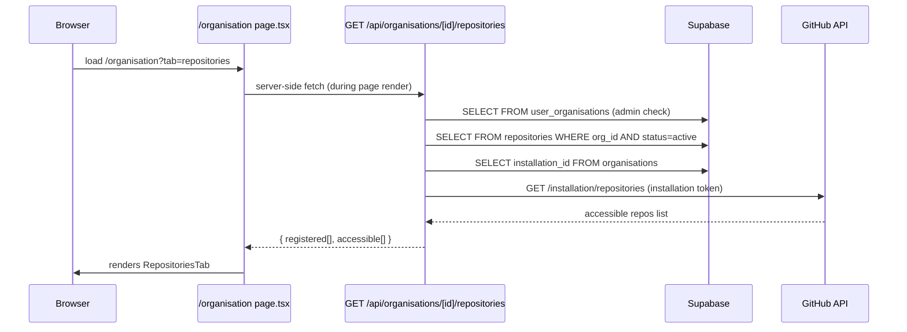
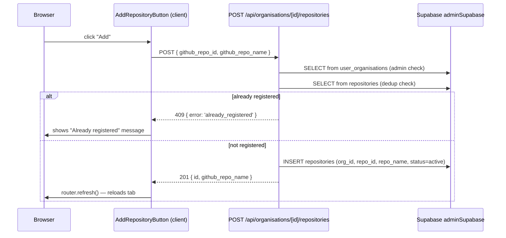

# Low-Level Design: V8 Repository Management

## Document Control

| Field | Value |
|-------|-------|
| Version | 0.1 |
| Status | Draft |
| Author | LS / Claude |
| Created | 2026-04-26 |
| Epic | [#360](https://github.com/mironyx/feature-comprehension-score/issues/360) |
| Requirements | [docs/requirements/v8-requirements.md](../requirements/v8-requirements.md) — Epic 2 |
| Parent design | [docs/design/v1-design.md](v1-design.md) |

---

## Part A — Human-Reviewable Design

### Purpose

Allow org admins to view and register repositories through the UI. Currently repositories enter the `repositories` table only via GitHub App installation webhooks (`installation_repositories:added`). If a webhook was missed, delayed, or the App was installed before FCS was set up, the repo never appears and there is no recovery path.

This epic adds:

1. A "Repositories" tab (fourth) on the org admin page listing all registered repositories.
2. A list of repositories accessible to the GitHub App installation but not yet registered, each with an "Add" button.
3. A `POST` endpoint to register a repository on demand.

No new database tables are required — the existing `repositories` table and `organisations.installation_id` field cover this entirely.

---

### Behavioural flows

#### T1: Admin views the Repositories tab



#### T2: Admin registers a repository



---

### Security

- Both API endpoints enforce org admin check server-side: query `user_organisations` via `ctx.supabase` (user client, subject to RLS), check `github_role === 'admin'`. Non-admins receive 403.
- The GitHub installation token is obtained server-side in the API route and **never included in the response**. Clients only receive repo names and IDs.
- `adminSupabase` (service role) is used for the INSERT to bypass RLS on `repositories`. The admin check must be performed first using `ctx.supabase`.

---

### Invariants

| # | Invariant | Verification |
|---|-----------|-------------|
| I1 | Both endpoints return 403 for non-admin callers | Unit test: service with non-admin membership returns `ApiError(403)` |
| I2 | GitHub installation token never exposed in API response | Code review: response body fields are `RegisteredRepo[]` + `AccessibleRepo[]` only |
| I3 | POST deduplicates — existing `github_repo_id` for same org returns 409 | Unit test: `addRepository` with existing repo ID returns `ApiError(409)` |
| I4 | Registered list shows only `status='active'` repos | Unit test: query filters by `status='active'` |
| I5 | No new DB tables — existing `repositories` table used | `npx supabase db diff` returns empty after this epic |
| I6 | Accessible list is not fetched when `installation_id` is null | Unit test: service returns empty `accessible` when `installation_id` is null |

---

### Acceptance criteria

#### T1 — Repository list

- [ ] `GET /api/organisations/[id]/repositories` returns `{ registered: RegisteredRepo[], accessible: AccessibleRepo[] }`.
- [ ] `registered` contains all `status='active'` repos for the org from the `repositories` table.
- [ ] `accessible` contains repos from GitHub API annotated with `is_registered: boolean`.
- [ ] Non-admin callers receive 403.
- [ ] When `installation_id` is null, `accessible` is an empty array (no GitHub API call made).
- [ ] A "Repositories" tab appears as the fourth tab on the org page.
- [ ] The tab shows a registered repos table and, separately, unregistered accessible repos with an "Add" button per row.

#### T2 — Add repository

- [ ] `POST /api/organisations/[id]/repositories` with `{ github_repo_id, github_repo_name }` inserts a row and returns 201 `{ id, github_repo_name }`.
- [ ] Returns 409 when `github_repo_id` is already registered for this org.
- [ ] Returns 403 for non-admin callers.
- [ ] The "Add" button shows a loading state while in flight.
- [ ] After a successful add, the page content refreshes to show the newly registered repo.
- [ ] A 409 conflict shows an inline "Already registered" message.

---

## Part B — Agent-Implementable Design

---

### T1: Repository list API + org page Repositories tab

**Layer:** BE + FE
**Issue:** [#365](https://github.com/mironyx/feature-comprehension-score/issues/365)
**Files:**
- New: `src/app/api/organisations/[id]/repositories/route.ts`
- New: `src/app/api/organisations/[id]/repositories/service.ts`
- New: `src/app/(authenticated)/organisation/repositories-tab.tsx`
- Edit: `src/app/(authenticated)/organisation/page.tsx` — add fourth tab + data fetch

#### API route contract

```typescript
// GET /api/organisations/[id]/repositories
//
// Path params:
//   id  (string) — org UUID
//
// Returns 200 RepositoryListResponse | 403 forbidden

interface RegisteredRepo {
  id: string;
  github_repo_id: number;
  github_repo_name: string;
  status: 'active';
  created_at: string;
}

interface AccessibleRepo {
  github_repo_id: number;
  github_repo_name: string;
  is_registered: boolean;
}

interface RepositoryListResponse {
  registered: RegisteredRepo[];
  accessible: AccessibleRepo[];
}
```

#### Route file (controller — ≤ 25 lines)

```typescript
// src/app/api/organisations/[id]/repositories/route.ts

import type { NextRequest } from 'next/server';
import { createApiContext } from '@/lib/api/context';
import { handleApiError } from '@/lib/api/errors';
import { json } from '@/lib/api/response';
import { listRepositories } from './service';

interface RouteContext { params: Promise<{ id: string }> }

export async function GET(request: NextRequest, { params }: RouteContext) {
  try {
    const { id: orgId } = await params;
    const ctx = await createApiContext(request);
    return json(await listRepositories(ctx, orgId));
  } catch (error) {
    return handleApiError(error);
  }
}
```

#### Service: listRepositories

```typescript
// src/app/api/organisations/[id]/repositories/service.ts

import type { ApiContext } from '@/lib/api/context';
import { ApiError } from '@/lib/api/errors';
import { getInstallationToken } from '@/lib/github/app-auth';

export async function listRepositories(ctx: ApiContext, orgId: string): Promise<RepositoryListResponse> {
  // 1. Admin check
  const { data: membership } = await ctx.supabase
    .from('user_organisations').select('github_role')
    .eq('user_id', ctx.user.id).eq('org_id', orgId).maybeSingle();
  if (membership?.github_role !== 'admin') throw new ApiError(403, 'Forbidden');

  // 2. Load registered repos (active only) + installation_id in parallel
  const [{ data: registered }, { data: org }] = await Promise.all([
    ctx.adminSupabase.from('repositories')
      .select('id, github_repo_id, github_repo_name, status, created_at')
      .eq('org_id', orgId).eq('status', 'active'),
    ctx.adminSupabase.from('organisations')
      .select('installation_id').eq('id', orgId).single(),
  ]);

  // 3. If no installation, return registered only
  const installationId = org?.installation_id;
  if (!installationId) return { registered: (registered ?? []) as RegisteredRepo[], accessible: [] };

  // 4. List accessible repos from GitHub (server-side only — token never returned)
  const token = await getInstallationToken(installationId);
  const ghRepos = await fetchInstallationRepos(token);

  // 5. Annotate accessible repos with is_registered
  const registeredIds = new Set((registered ?? []).map(r => r.github_repo_id));
  const accessible: AccessibleRepo[] = ghRepos.map(r => ({
    github_repo_id: r.id,
    github_repo_name: r.name,
    is_registered: registeredIds.has(r.id),
  }));

  return { registered: (registered ?? []) as RegisteredRepo[], accessible };
}

async function fetchInstallationRepos(token: string): Promise<{ id: number; name: string }[]> {
  // Requirements: < 100 repos expected — no pagination required for MVP
  const resp = await fetch('https://api.github.com/installation/repositories?per_page=100', {
    headers: { Authorization: `token ${token}`, Accept: 'application/vnd.github+json' },
  });
  if (!resp.ok) throw new Error(`GitHub repos list failed: ${resp.status}`);
  const body = (await resp.json()) as { repositories: { id: number; name: string }[] };
  return body.repositories;
}
```

#### repositories-tab.tsx (server component)

```typescript
// src/app/(authenticated)/organisation/repositories-tab.tsx
// Server component — no 'use client'
// Receives data already fetched by organisation/page.tsx

import { Card } from '@/components/ui/card';

interface RepositoriesTabProps {
  readonly orgId: string;
  readonly registered: RegisteredRepo[];
  readonly accessible: AccessibleRepo[];
}

export function RepositoriesTab({ orgId, registered, accessible }: RepositoriesTabProps) {
  // Section 1: Registered repos table (name, registered date)
  // Section 2: Accessible but unregistered repos — list with AddRepositoryButton per row
  // Empty state for each section if arrays are empty
  // AddRepositoryButton is a client component (see T2)
}
```

#### org page changes

```typescript
// In organisation/page.tsx:

// 1. Import RepositoriesTab
import { RepositoriesTab } from './repositories-tab';

// 2. In the parallel fetch, add a call to the repository list API (or query Supabase directly):
// Preferred: call the service function directly (import listRepositories)
// after verifying admin status is already enforced by this page.
// Alternative: server-side fetch to /api/organisations/[id]/repositories.
// Agent chooses based on code size — direct service call avoids an extra HTTP round trip.

// 3. Add fourth tab:
{
  id: 'repositories',
  label: 'Repositories',
  content: (
    <RepositoriesTab
      orgId={orgId}
      registered={repoData.registered}
      accessible={repoData.accessible}
    />
  ),
}
```

#### BDD specs

```
describe('GET /api/organisations/[id]/repositories (T1)')
  it('returns 403 for non-admin callers')
  it('returns registered repos with status=active for the org')
  it('returns accessible repos from GitHub installation with is_registered annotation')
  it('marks already-registered repos with is_registered: true')
  it('returns empty accessible array when installation_id is null')

describe('RepositoriesTab')
  it('renders registered repos table with repo name and date')
  it('renders accessible but unregistered repos with Add button')
  it('does not show Add button for already-registered repos')
  it('renders empty state when registered list is empty')
```

---

### T2: Add repository API + button

**Layer:** BE + FE
**Issue:** [#366](https://github.com/mironyx/feature-comprehension-score/issues/366)
**Files:**
- Edit: `src/app/api/organisations/[id]/repositories/route.ts` — add POST handler
- Edit: `src/app/api/organisations/[id]/repositories/service.ts` — add `addRepository`
- New: `src/app/(authenticated)/organisation/add-repository-button.tsx` (client component)

> **Shared file constraint:** T2 edits the same `route.ts` and `service.ts` as T1. T2 must be implemented **after** T1 is merged.

#### POST addition to route.ts

```typescript
// Additional imports (at top of existing route.ts):
import { addRepository } from './service';

// New contract types:
interface AddRepoBody {
  github_repo_id: number;
  github_repo_name: string;
}

interface AddRepoResponse {
  id: string;
  github_repo_name: string;
}

// POST /api/organisations/[id]/repositories
// Body: AddRepoBody
// Returns 201 AddRepoResponse | 409 already_registered | 403 forbidden
export async function POST(request: NextRequest, { params }: RouteContext) {
  try {
    const { id: orgId } = await params;
    const ctx = await createApiContext(request);
    const body = (await request.json()) as AddRepoBody;
    const result = await addRepository(ctx, orgId, body);
    return json(result, 201);
  } catch (error) {
    return handleApiError(error);
  }
}
```

#### addRepository service function

```typescript
// Add to service.ts:

export async function addRepository(
  ctx: ApiContext,
  orgId: string,
  body: AddRepoBody,
): Promise<AddRepoResponse> {
  // 1. Admin check
  const { data: membership } = await ctx.supabase
    .from('user_organisations').select('github_role')
    .eq('user_id', ctx.user.id).eq('org_id', orgId).maybeSingle();
  if (membership?.github_role !== 'admin') throw new ApiError(403, 'Forbidden');

  // 2. Dedup check
  const { data: existing } = await ctx.adminSupabase
    .from('repositories').select('id')
    .eq('org_id', orgId).eq('github_repo_id', body.github_repo_id).maybeSingle();
  if (existing) throw new ApiError(409, 'already_registered');

  // 3. Insert
  const { data, error } = await ctx.adminSupabase
    .from('repositories')
    .insert({
      org_id: orgId,
      github_repo_id: body.github_repo_id,
      github_repo_name: body.github_repo_name,
      status: 'active',
    })
    .select('id, github_repo_name')
    .single();
  if (error || !data) throw new ApiError(500, 'Internal server error');

  return data as AddRepoResponse;
}
```

#### AddRepositoryButton (client component)

```typescript
// src/app/(authenticated)/organisation/add-repository-button.tsx
'use client';

import { useState } from 'react';
import { useRouter } from 'next/navigation';

interface AddRepositoryButtonProps {
  readonly orgId: string;
  readonly githubRepoId: number;
  readonly githubRepoName: string;
}

export function AddRepositoryButton({ orgId, githubRepoId, githubRepoName }: AddRepositoryButtonProps) {
  const router = useRouter();
  const [loading, setLoading] = useState(false);
  const [error, setError] = useState<string | null>(null);

  async function handleAdd() {
    setLoading(true);
    setError(null);
    try {
      const res = await fetch(`/api/organisations/${orgId}/repositories`, {
        method: 'POST',
        headers: { 'Content-Type': 'application/json' },
        body: JSON.stringify({ github_repo_id: githubRepoId, github_repo_name: githubRepoName }),
      });
      if (res.status === 409) { setError('Already registered'); return; }
      if (!res.ok) { setError('Failed to add. Please try again.'); return; }
      router.refresh();
    } catch {
      // Swallowed: fetch only rejects on network failure; HTTP errors are handled above.
      setError('Network error. Please try again.');
    } finally {
      setLoading(false);
    }
  }

  return (
    <div className="flex items-center gap-2">
      <button
        type="button"
        onClick={handleAdd}
        disabled={loading}
        className="inline-flex items-center justify-center rounded-sm text-label font-medium
                   bg-accent text-background hover:bg-accent-hover disabled:opacity-50
                   h-7 px-2.5 cursor-pointer"
      >
        {loading ? 'Adding…' : 'Add'}
      </button>
      {error ? <span className="text-caption text-destructive">{error}</span> : null}
    </div>
  );
}
```

#### BDD specs

```
describe('POST /api/organisations/[id]/repositories (T2)')
  it('returns 403 for non-admin callers')
  it('inserts a new repository and returns 201 with id and github_repo_name')
  it('returns 409 when github_repo_id is already registered for this org')

describe('AddRepositoryButton')
  it('shows "Adding…" label while POST is in flight')
  it('calls router.refresh() after successful add')
  it('shows "Already registered" message on 409 response')
  it('shows error message on network failure')
  it('button is disabled while loading')
```
