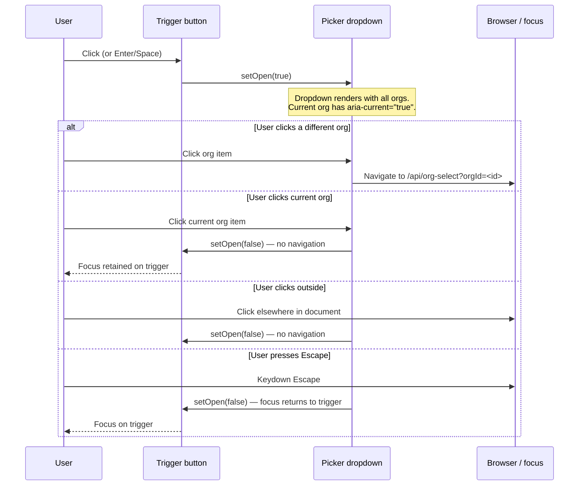
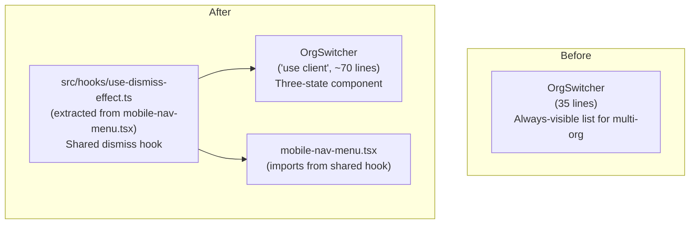

# LLD: V9 Organisation Switcher UX

## Document Control

| Field | Value |
|-------|-------|
| Epic | [#371](https://github.com/mironyx/feature-comprehension-score/issues/371) |
| Task | [#372](https://github.com/mironyx/feature-comprehension-score/issues/372) |
| Requirements | [docs/requirements/v9-requirements.md](../requirements/v9-requirements.md) |
| Design system | [docs/design/frontend-system.md](frontend-system.md) |
| Status | Revised |
| Created | 2026-04-27 |
| Revised | 2026-04-27 | Issue #372 |

---

## Part A — Human Review

### Purpose

Replace the persistent, unstyled org list in `OrgSwitcher` with a three-state component:

1. **Single-org** — plain text org name, no interactive controls.
2. **Multi-org passive** — org name + chevron trigger button; no list visible.
3. **Multi-org picker open** — inline dropdown listing all orgs; current org marked; dismissible.

No API, cookie, or database changes. Component-level UI only.

---

### Behavioural Flows

#### Flow 1 — Multi-org user opens and dismisses picker



#### Flow 2 — Single-org user page load

No interaction: `OrgSwitcher` renders `<span>{currentOrg.github_org_name}</span>` and returns.

---

### Structural Overview



`useDismissEffect` moves from `mobile-nav-menu.tsx` to `src/hooks/use-dismiss-effect.ts`. Both `OrgSwitcher` and `MobileNavMenu` import it from there. `MobileNavMenu`'s behaviour is unchanged.

---

### Invariants

| # | Invariant | Verification |
|---|-----------|-------------|
| I1 | Single-org users see no trigger, chevron, or dropdown ever | Unit test: `allOrgs.length === 1` renders only `<span>` |
| I2 | Picker is always closed on initial render | Unit test: no list visible before interaction |
| I3 | Escape returns focus to the trigger button | Unit test: after Escape, `document.activeElement === triggerRef.current` |
| I4 | Clicking outside does not fire org navigation | Unit test: no `window.location` change on outside click |
| I5 | Clicking the current org closes picker but does not navigate | Unit test: `href` not followed when `org.id === currentOrg.id` |
| I6 | The trigger button has `aria-label="Switch organisation"` | Unit test: ARIA attribute present |
| I7 | Current org item has `aria-current="true"` | Unit test: ARIA attribute present on current org `<li>` |

---

### Acceptance Criteria

- AC1: Single-org user: nav bar shows org name as plain text; no button, chevron, or list rendered.
- AC2: Multi-org passive: nav bar shows org name + trigger button; no org list visible.
- AC3: Trigger button has `aria-label="Switch organisation"` and is keyboard-focusable (Tab + `:focus-visible`).
- AC4: Clicking trigger opens dropdown listing all orgs the user belongs to.
- AC5: Current org item has `aria-current="true"` and visual differentiation (e.g. accent colour, bold weight).
- AC6: Clicking a different org navigates to `/api/org-select?orgId=<id>`.
- AC7: Clicking outside the dropdown closes it without switching org.
- AC8: Pressing Escape closes the dropdown, no switch occurs, focus returns to trigger.
- AC9: Clicking the current org in the picker closes the dropdown without switching.
- AC10: Pressing Enter on a focused org item fires the same action as a click.

---

### BDD Specs

```ts
describe('OrgSwitcher — single org', () => {
  it('renders the org name as plain text', ...)
  it('renders no trigger button', ...)
  it('renders no org list', ...)
})

describe('OrgSwitcher — multi org, passive state', () => {
  it('renders the current org name', ...)
  it('renders a trigger button with aria-label "Switch organisation"', ...)
  it('does not render the org list on initial render', ...)
  it('trigger button is keyboard-focusable', ...)
})

describe('OrgSwitcher — multi org, picker open', () => {
  it('opens the picker when the trigger is clicked', ...)
  it('marks the current org with aria-current="true"', ...)
  it('navigates to /api/org-select when a different org is clicked', ...)
  it('closes the picker on click outside without navigation', ...)
  it('closes the picker on Escape and returns focus to trigger', ...)
  it('closes the picker without navigation when current org is clicked', ...)
  it('fires selection action on Enter keypress on a focused org item', ...)
})
```

---

## Part B — Agent Implementation

### Layer

Frontend only (`FE`). No backend, DB, or API route changes.

### Files

| File | Action | Notes |
|------|--------|-------|
| `src/hooks/use-dismiss-effect.ts` | **Create** | Extracted from `mobile-nav-menu.tsx` |
| `src/components/org-switcher.tsx` | **Rewrite** | Three-state component; `'use client'` |
| `src/components/mobile-nav-menu.tsx` | **Update import** | Point to shared hook |
| `tests/components/org-switcher.test.ts` | **Create** | BDD specs above (`.ts` not `.tsx`; placed under `tests/components/` per project convention) |

### `src/hooks/use-dismiss-effect.ts`

Extract verbatim from `MobileNavMenu` (lines ~22–40 of `mobile-nav-menu.tsx`). Signature unchanged:

```ts
export function useDismissEffect(
  containerRef: RefObject<HTMLElement | null>,
  setIsOpen: Dispatch<SetStateAction<boolean>>,
): void
```

Handles:
- `keydown` Escape → `setIsOpen(false)`
- `mousedown` outside `containerRef` → `setIsOpen(false)`

Cleans up both listeners on unmount.

### `src/components/org-switcher.tsx`

```
'use client'

State:
  isOpen: boolean — whether the picker dropdown is visible
  triggerRef: RefObject<HTMLButtonElement> — for Escape focus return

Rendering:
  if allOrgs.length <= 1:
    return <span className="text-label text-text-secondary">{currentOrg.github_org_name}</span>

  return (
    <div ref={containerRef} className="relative">
      <button
        ref={triggerRef}
        aria-label="Switch organisation"
        onClick={() => setIsOpen(prev => !prev)}
        className="flex items-center gap-1 text-label text-text-secondary
                   hover:text-text-primary focus-visible:ring-2
                   focus-visible:ring-accent rounded-sm"
      >
        {currentOrg.github_org_name}
        <ChevronDown size={14} />
      </button>

      {isOpen && (
        <OrgPickerDropdown
          allOrgs={allOrgs}
          currentOrg={currentOrg}
          onClose={() => setIsOpen(false)}
        />
      )}
    </div>
  )
```

> **Implementation note (issue #372):** The dropdown is extracted into `OrgPickerDropdown` (exported named function) to keep `OrgSwitcher`'s return branch concise. The spec showed the `<ul>` inline in `OrgSwitcher`; extracting it also removes the `role="listbox"` / `role="option"` ARIA roles, which are invalid when `<li>` elements contain interactive children (`<button>` or `<a>`) — WAI-ARIA 1.2 §3.15 prohibits interactive content inside `option`. The correct pattern is a plain `<ul>` with `aria-current` on each `<li>`. See also: `aria-expanded` added to the trigger button (not in original spec).

`OrgPickerDropdown` sketch (extracted sub-component):

```tsx
export function OrgPickerDropdown({ allOrgs, currentOrg, onClose }) {
  return (
    <ul className="absolute right-0 top-full mt-1 min-w-[180px] rounded-md
                   border border-border bg-surface-raised shadow-md z-50 py-1">
      {allOrgs.map(org => (
        <li
          key={org.id}
          aria-current={org.id === currentOrg.id ? 'true' : undefined}
        >
              {org.id === currentOrg.id ? (
                <button
                  onClick={() => setIsOpen(false)}
                  className="... font-medium text-accent ..."
                >
                  {org.github_org_name}
                </button>
              ) : (
                <a
                  href={`/api/org-select?orgId=${org.id}`}
                  className="..."
                >
                  {org.github_org_name}
                </a>
              )}
            </li>
          ))}
        </ul>
      );
    }
```

**Dismiss wiring:**
- Pass `containerRef` and `setIsOpen` to `useDismissEffect` (handles click-outside and Escape via document listener).
- Escape focus return is handled by an `onKeyDown` on the container `<div>`:

```tsx
onKeyDown={(e) => {
  if (e.key !== 'Escape') return;
  e.stopPropagation(); // prevents useDismissEffect's document listener from double-firing
  triggerRef.current?.focus();
  setIsOpen(false);
}}
```

> **Implementation note (issue #372):** The `dismissedViaEscape` ref / `onEscape` callback options described below were not used. Handling Escape directly in the component's `onKeyDown` and calling `e.stopPropagation()` is simpler: it keeps the hook signature unchanged (no new parameter), avoids double invocation of `setIsOpen(false)`, and co-locates focus-return logic with the trigger that needs it.

### `src/components/mobile-nav-menu.tsx`

Remove the inline `useDismissEffect` definition and add:

```ts
import { useDismissEffect } from '@/hooks/use-dismiss-effect';
```

Usage is identical to what exists today — no logic changes.

### Design tokens used

| Element | Token |
|---------|-------|
| Trigger text | `text-label text-text-secondary` |
| Trigger hover | `hover:text-text-primary` |
| Trigger focus ring | `focus-visible:ring-2 focus-visible:ring-accent` |
| Dropdown background | `bg-surface-raised` (CSS var `--color-surface-raised`) |
| Dropdown border | `border-border` |
| Dropdown shadow | `shadow-md` |
| Current org text | `text-accent font-medium` |
| Other org text | `text-text-primary` |

### Complexity budget check

- `OrgSwitcher` function body: estimated ~60 lines including JSX. Exceeds the 20-line function limit.
  - **Mitigation:** Extract `OrgPickerDropdown` as an inner sub-component (receives `allOrgs`, `currentOrg`, `onClose`). Each rendered function stays under 20 lines.
- No nesting beyond 3 levels in JSX.
- No silent catch blocks.

### Size estimate

| Artefact | Lines |
|----------|-------|
| `use-dismiss-effect.ts` | ~20 |
| `org-switcher.tsx` (new) | ~65 |
| `mobile-nav-menu.tsx` (import swap) | −15 inline + 1 import = net −14 |
| `org-switcher.test.tsx` | ~120 |
| **Total PR diff** | **~191** |

Under the 200-line constraint.
