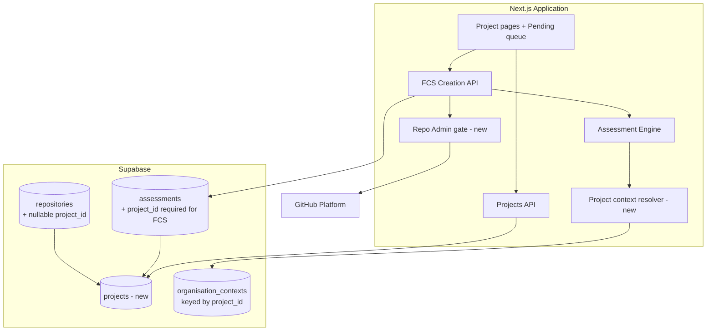
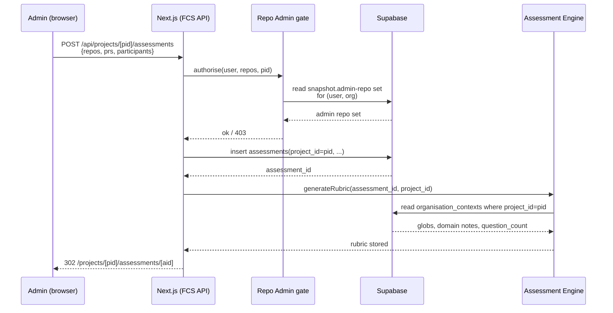
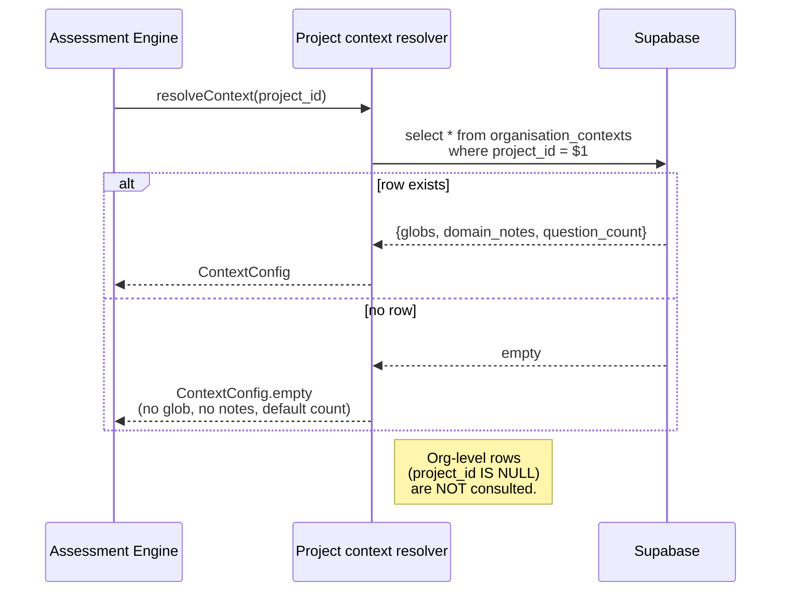
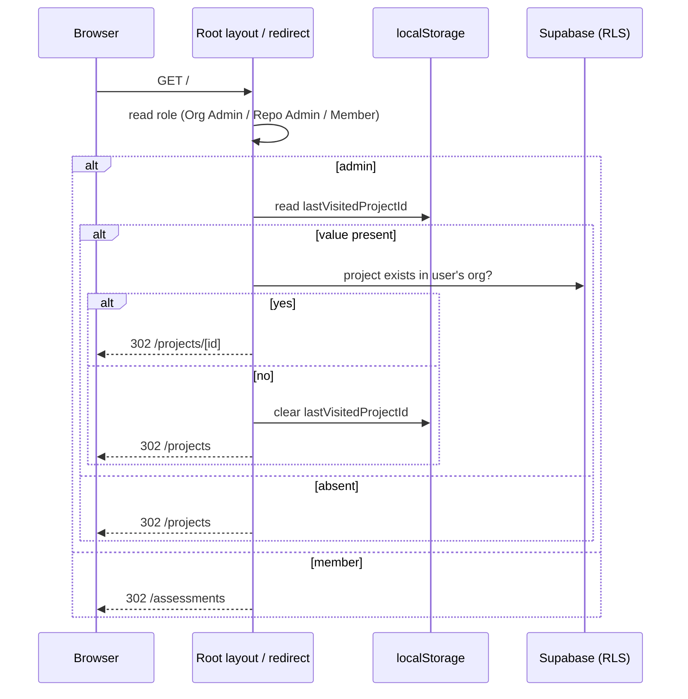

# Feature Comprehension Score Tool — V11 Design Document (Delta)

## Document Control

| Field | Value |
|-------|-------|
| Version | 0.1 |
| Status | Draft |
| Author | LS / Claude |
| Created | 2026-04-30 |
| Scope | V11 delta over [v1-design.md](v1-design.md) |
| Requirements | [docs/requirements/v11-requirements.md](../requirements/v11-requirements.md) |

## How to read this document

V11 is a delta over the V1 HLD. This document covers **only what changes**.
Unchanged areas — webhook handling, PRCC product behaviour, the Assessment
Engine, scoring, RLS tenancy at org level, GitHub auth — continue to be
governed by [v1-design.md](v1-design.md). Anchors below link into V1.

---

## Summary of Change

V11 introduces **Project** as a named initiative *within* an organisation.
Projects own FCS assessments and carry their own rubric context (glob
patterns, domain notes, question count). Org remains the security
boundary; projects are an organising layer scoped by `org_id`.

PRCC product features are deferred. The only PRCC-related change is a
nullable `project_id` foundation FK on repos and PRCC assessments — no
behaviour change, no UI surface.

No data migration (pre-prod).

---

## Level 1: Capabilities — Delta

### C1: Organisation Management — extended

Adds project lifecycle as a sub-domain. Org-tenant boundary unchanged;
see [v1 §C1](v1-design.md#c1-organisation-management).

| New capability | Stories |
|----------------|---------|
| Create / list / view / edit project within an org | 1.1, 1.2, 1.3, 1.4 |
| Hard-delete an empty project | 1.5 |
| Configure per-project context (glob patterns, domain notes, question count) | 3.1 |
| Persist last-visited project per user (client-side) | 4.6 |
| Render role-conditional NavBar item and admin-only breadcrumbs on project-scoped routes | 4.1, 4.3 |

### C3: Feature Comprehension Score (FCS) — extended

Builds on [v1 §C3](v1-design.md#c3-feature-comprehension-score-fcs).

| New / changed capability | Stories |
|--------------------------|---------|
| Associate every FCS assessment with a project on creation (`project_id` required) | 2.1 |
| Scope the assessment list to the active project | 2.2 |
| Cross-project pending queue for participants ("My Assessments"), filterable by project | 2.3, 2.3a |
| Address assessments via project-first URLs (`/projects/[pid]/assessments/[aid]`) | 2.4, 4.5 |

### C4: Assessment Engine — context resolution narrowed

[v1 §C4](v1-design.md#c4-assessment-engine-shared-by-prcc-and-fcs)
unchanged except for context resolution at FCS rubric generation:

> **Amends [ADR-0013](../adr/0013-context-file-resolution-strategy.md):**
> V11 reads project context only. There is no org-level fallback for
> FCS. If a project has no `organisation_contexts` row, no context block
> is injected. Org context tables remain in the schema (inert for FCS).

### C5: Authentication & Access Control — Repo Admin role added

Adds **Repo Admin** to the role model in
[v1 §C5](v1-design.md#c5-authentication-access-control). Cross-cutting;
see ADR-0027 for the runtime-derivation pattern.

| Role | Project create | Project edit | Project delete | FCS create | Repo selector scope |
|------|:--------------:|:------------:|:--------------:|:----------:|---------------------|
| Org Admin   | yes | yes | yes | yes | all org repos |
| Repo Admin  | yes | yes | no  | yes (within own admin repos) | own admin repos only |
| Org Member  | no  | no  | no  | no  | n/a |

### Capabilities removed in V11

None. Org-level FCS context configuration is *not* removed — the schema
rows persist, but the FCS rubric path no longer reads them.

### Coverage

All 18 V11 stories and the three cross-cutting concern sections
(§Security & Authorisation, §Data Integrity, §Context Resolution) map
to a capability and component above. Verified by Gate 1 drift scan
(2026-04-30) — verdict PASS-with-patches; patches W1–W4 applied.

---

## Level 2: Components — Delta

V1 component set is unchanged. No new external dependency, no new
service, no new shared library. The Next.js Application
([v1 §Component 1](v1-design.md#component-1-next-js-application))
gains internal modules; the Supabase database
([v1 §Component 3](v1-design.md#component-3-supabase)) gains one table
and a small set of FK columns.

### New internal modules (within Next.js Application)

| Module | Purpose | Non-responsibilities |
|--------|---------|----------------------|
| **Projects API** (`/api/projects`, `/api/projects/[id]`) | Project CRUD: list, create, read, partial-update, delete-if-empty. | Does not manage assessments, repos, or org config. Does not enforce uniqueness across orgs (per-org only). Does not soft-delete. |
| **Project context resolver** (engine) | Given a `project_id`, return glob patterns, domain notes, and question count for FCS rubric generation. | Does not consult org-level context. Does not fetch files (delegated to existing context fetcher). Does not cache across requests. |
| **Project pages** (`src/app/projects/...`) | List, dashboard, create form, settings, project-scoped assessment routes. Owns the role-conditional NavBar item ("Projects" for admins, "My Assessments" for members) and admin-only breadcrumbs. | Does not duplicate the existing assessment list component — reuses it with a `project_id` filter. Does not own auth redirects (delegated to root layout). Does not redirect `/assessments/[aid]` — that legacy path returns 404 (Story 4.5 AC 4). |
| **Pending queue page** (`src/app/assessments`) | Cross-project FCS pending list with project filter for org members. | FCS only — PRCC items are out of scope. Does not show projects the participant has no assessment in. |
| **Last-visited project store** (client) | Read/write `lastVisitedProjectId` in `localStorage`; clear on sign-out. | No DB column, no server-side state. Not used for authorisation. |
| **Repo Admin gate** (auth helper) | Read the user's admin-repo set from the sign-in snapshot (extends `user_organisations` per ADR-0020 / ADR-0029). Project CRUD checks the set is non-empty for the org; FCS create additionally checks every submitted repo is in the set. Both are pure DB reads. | Not a grant table — the snapshot is a cache of GitHub state, refreshed only at sign-in. Does not call GitHub at request time in V11. The per-repo admin check is FCS-create only; project CRUD endpoints do not re-check repo scopes. |

### Schema delta (Component 3: Supabase)

Detailed contracts belong to LLDs. The HLD pins shape only.

| Change | Notes |
|--------|-------|
| New table `projects (id, org_id, name, description, created_at, updated_at)` | Unique `(org_id, lower(name))`. RLS by `org_id` (existing pattern). |
| `assessments.project_id uuid not null references projects(id)` (FCS path) | Existing column already nullable; V11 makes it required for FCS rows. PRCC rows remain nullable. |
| `organisation_contexts` keyed by `(org_id, project_id)` | Already nullable per [v1 tables.sql:331](../../supabase/schemas/tables.sql) and [ADR-0017](../adr/0017-organisation-contexts-separate-table.md). V11 uses the `project_id`-set rows for FCS; org-level (project_id NULL) rows become inert for FCS. |
| `repositories.project_id uuid null references projects(id)` | Schema-only foundation for future PRCC project scoping. Not surfaced in V11 UI. |

### Component diagram — V11 delta

Solid arrows are new or newly-required edges in V11.

### Non-responsibilities (boundary pins)

- **Projects API** does not enforce GitHub admin scope on its own writes
  — it enforces *Org Admin or Repo Admin*. The per-repo admin check is
  the FCS creation API's responsibility (different endpoint, different
  surface).
- **Project context resolver** does not include exempt-pattern filtering —
  that remains a repo-level concern applied during file fetching, per
  [v1 §3.4](v1-design.md#3-4-configuration-flow).
- **Last-visited project store** is *advisory* — root redirect treats
  any stale value as absent and falls back to `/projects`.

---

## Level 3: Interactions — Delta

Three flows change. All others (PRCC trigger, scoring, sign-in,
configuration cascade, results) are unchanged from
[v1 §3](v1-design.md#level-3-interactions).

### 3.V11.1 Create FCS assessment within a project (Story 2.1)

**Contracts to be pinned in LLDs (not here):**
- Request/response of `POST /api/projects/[pid]/assessments`
- Repo Admin gate inputs and 403 shape
- Project context resolver function signature

**Deltas vs [v1 §3.2 FCS Phase 1](v1-design.md#3-2-fcs-flow):**
1. URL is project-first.
2. `project_id` is required and validated against the user's project access.
3. Per-repo admin check runs server-side against the sign-in snapshot (ADR-0029).
4. Rubric prompt context is built from project context only.

### 3.V11.2 Project context resolution at rubric generation (Story 3.2)

**Contracts:** `ContextConfig` shape and resolver signature pinned in
the Epic 3 LLD. Amends [ADR-0013](../adr/0013-context-file-resolution-strategy.md).

### 3.V11.3 Root redirect — role-aware and last-project-aware (Stories 4.4, 4.6)

**Contracts:** localStorage key name, sign-out clear hook, and
project-existence check pinned in the Epic 4 LLD.

---

## Decisions captured as ADRs

The following V11 decisions are load-bearing across multiple
components or supersede prior ADRs. Each is drafted separately in
`docs/adr/` (Step 4 of `/kickoff`). Numbers assigned at draft time.

1. **Project as a sub-tenant within Org** — Org remains the RLS boundary;
   project rows are scoped by `org_id` and accessed through existing
   org-tenancy policies. Pins authorisation reasoning across all four
   epics. Builds on [ADR-0008](../adr/0008-data-model-multi-tenancy.md).
2. **Reuse `organisation_contexts` keyed by `project_id`** — no new
   `project_contexts` table. Builds on
   [ADR-0017](../adr/0017-organisation-contexts-separate-table.md).
3. **Repo Admin permission derived from GitHub admin access at runtime,
   enforced server-side on writes** — no in-app role table; selector
   filter is a UI hint, the FCS-create API is the gate. Cross-cutting
   across Epics 1, 2, 3.

Story-local decisions (hard-delete-only-when-empty, single PATCH endpoint
with partial payloads, localStorage for last-visited) are *not* ADRs in
V11 — they are pinned in the relevant LLDs.

---

## Out of Scope (V11)

Mirrors §"What We Are NOT Building" in the requirements:

- PRCC product behaviour changes
- Repo→project UI mapping
- Copy context from another project
- Project-level RBAC
- Multi-org projects
- Data migration (pre-prod)
- Cross-project admin views (data model supports it; UI deferred)

---

## Open Questions

None. All five OQs are resolved in the V11 requirements (v1.1, Final).

---

## Status

Draft — Gate 1 PASS-with-patches (W1–W4 applied 2026-04-30); pending Gate 2.
