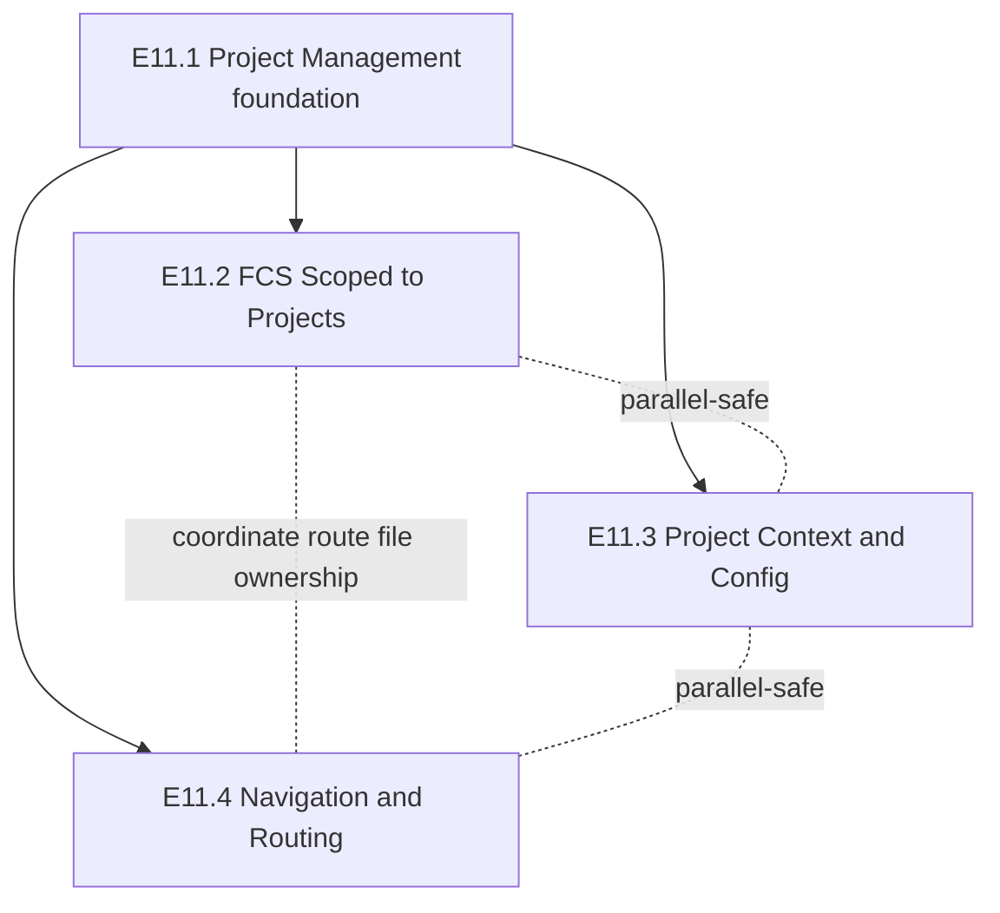

# V11 Implementation Plan

**Date:** 2026-04-30
**Version:** v11
**HLD:** [docs/design/v11-design.md](../design/v11-design.md)
**Requirements:** [docs/requirements/v11-requirements.md](../requirements/v11-requirements.md)
**Related ADRs:** ADR-0027 (project as sub-tenant), ADR-0028 (reuse organisation_contexts), ADR-0029 (Repo Admin sign-in snapshot)

## Overview

V11 introduces **Project** as a named initiative within an organisation.
Projects own FCS assessments and carry their own rubric context. The
delivery is sequenced as four epics: a foundation epic (Project Management)
followed by three epics that can run in parallel — FCS scoping, project
context, and navigation/routing. PRCC product features are deferred; only
the foundation FK changes ship in V11.

## Out of Scope

Per requirements §"What We Are NOT Building":

- PRCC product feature changes (only nullable `project_id` foundation FKs)
- Repo→project UI mapping
- Copy context from another project
- Project-level RBAC
- Multi-org projects
- Data migration (pre-prod)
- Cross-project admin views (data model supports it; UI deferred)

---

## Epics

### Epic E11.1 — Project Management (foundation)

- **HLD anchor:** [v11 §C1 Organisation Management — extended](../design/v11-design.md#c1-organisation-management--extended)
- **Scope:** Stand up the `Project` entity end-to-end: schema, RLS, API, list/dashboard/create/edit pages, and the empty-only hard-delete path.
- **Owns (components):** `projects` table, Projects API (`/api/projects`, `/api/projects/[id]`), Project pages (list, dashboard, create form, inline-edit affordance), the Repo-Admin gate's coarse check (any-org-repo), the sign-in admin-repo snapshot wiring (ADR-0029).
- **Touches (components):** `user_organisations` (extended for the admin-repo snapshot per ADR-0029), `organisation_contexts` (adds FK to `projects(id)` per ADR-0028), the existing sign-in / membership-resolver flow.
- **Stories:** 1.1, 1.2, 1.3, 1.4, 1.5
- **Depends on:** none (foundation)
- **Parallelisable with:** none (every other epic depends on this)
- **Exit-criteria addendum:** `PATCH /api/projects/[id]` accepts any subset of `{name, description, glob_patterns, domain_notes, question_count}` and mutates only the fields present in the payload. (Mirrors Story 1.4 AC 5; required so E11.3 can extend the endpoint additively without rewriting it.)
- **Rough task shape:**
  - Schema: `projects` table + RLS + FK from `organisation_contexts.project_id` + admin-repo snapshot column/table per ADR-0029
  - API: `POST /api/projects`, `GET /api/projects`, `GET /api/projects/[id]`, `PATCH /api/projects/[id]`, `DELETE /api/projects/[id]` (with empty-only constraint)
  - Repo-Admin gate (coarse): helper that checks the snapshot for "any admin repo in org"
  - Sign-in extension: populate the admin-repo snapshot during the existing membership-resolver path (ADR-0020)
  - Pages: `/projects` (list), `/projects/new`, `/projects/[id]` (dashboard with inline name/description edit affordance, empty-state CTA)
  - Org-Member redirects on admin-only routes
- **Exit criteria:**
  - An Org Admin or Repo Admin can create, list, view, edit, and (empty-only) delete a project; case-insensitive name uniqueness enforced; admin-only routes redirect Org Members to `/assessments`.
  - The admin-repo snapshot is populated on every sign-in and is queryable for downstream gates.

---

### Epic E11.2 — FCS Scoped to Projects

- **HLD anchor:** [v11 §C3 FCS — extended](../design/v11-design.md#c3-feature-comprehension-score-fcs--extended) and [Interaction 3.V11.1](../design/v11-design.md#3v111-create-fcs-assessment-within-a-project-story-21)
- **Scope:** Wire `project_id` into FCS creation (required), scope the assessment list to the project, add the cross-project pending queue with project filter, and adopt project-first assessment URLs.
- **Owns (components):** FCS Creation API (`POST /api/projects/[pid]/assessments`) + per-repo Repo-Admin check against the sign-in snapshot (ADR-0029), project-scoped assessment routes (`/projects/[pid]/assessments/[aid]`, `.../results`, `.../submitted`, `.../new`), the cross-project Pending queue page (`/assessments`), the `assessments.project_id` FCS-required constraint.
- **Touches (components):** Project pages (dashboard renders the project-scoped assessment list — reuses the existing list component with a `project_id` filter; no rewrite), repo selector component (data filter changes; UI unchanged), the existing FCS form component.
- **Stories:** 2.1, 2.2, 2.3, 2.3a, 2.4, 4.5 (4.5 is incidental — deleting the legacy `src/app/(authenticated)/assessments/[id]/...` directory as part of the URL migration satisfies its 404 AC; pre-prod, no legacy URLs in the wild per requirements §OQ 5)
- **Depends on:** E11.1 (needs `projects` and the Repo-Admin coarse gate)
- **Parallelisable with:** E11.3 (disjoint Owns); partially with E11.4 — see "Coupling notes" below
- **Rough task shape:**
  - Schema: tighten `assessments.project_id` to `NOT NULL` for FCS rows (add CHECK constraint scoping by `assessment_type`)
  - API: `POST /api/projects/[pid]/assessments` with per-repo admin re-check; legacy `/assessments/[aid]` returns 404 (Story 4.5 AC 4)
  - Routes: project-first assessment URLs + 404 on `pid`/`aid` mismatch
  - Pages: project-scoped FCS assessment list (reuse existing component + filter); `/assessments` cross-project pending queue with project filter (hidden when single project)
  - Tests: invitation deep-link round-trip through auth
- **Exit criteria:**
  - FCS assessments cannot be created without `project_id`; project dashboards show only their own assessments; participants see their pending queue across projects, filterable by project; project-first URLs resolve and the legacy shape returns 404.

---

### Epic E11.3 — Project Context & Config

- **HLD anchor:** [v11 §C4 Assessment Engine — context resolution narrowed](../design/v11-design.md#c4-assessment-engine--context-resolution-narrowed) and [Interaction 3.V11.2](../design/v11-design.md#3v112-project-context-resolution-at-rubric-generation-story-32)
- **Scope:** Move FCS rubric context from org level to project level. One settings page + one resolver path. No org-level fallback.
- **Owns (components):** Project context resolver (engine), `/projects/[id]/settings` page + form, the FCS rubric path's switch from org-context to project-context resolution.
- **Touches (components):** Assessment Engine (rubric generation reads via the new resolver — amends [ADR-0013](../adr/0013-context-file-resolution-strategy.md)), `organisation_contexts` (rows now keyed by `project_id`; org-level rows become inert for FCS per ADR-0028), the existing `PATCH /api/projects/[id]` endpoint (extended to accept context fields per HLD module description).
- **Stories:** 3.1, 3.2
- **Depends on:** E11.1 (needs `projects`, the unified `PATCH /api/projects/[id]` with partial-payload support, and the Repo Admin coarse gate)
- **Parallelisable with:** E11.2 (disjoint Owns), E11.4
- **Rough task shape:**
  - Resolver: `resolveContext(project_id) → ContextConfig` reading `organisation_contexts WHERE project_id = $1`; empty result → empty config
  - Settings page: `/projects/[id]/settings` with glob patterns, domain notes, question count fields
  - Engine wiring: rubric generation path calls the new resolver instead of the org-level helper for FCS
  - Validation: question count 3–5; glob parseability check
  - Org-Member redirect on the settings route
- **Exit criteria:**
  - An admin can configure project context on `/projects/[id]/settings`; new FCS assessments use the project's context (verifiable from the rubric prompt); projects with no context produce assessments with no injected context (no fallback).

---

### Epic E11.4 — Navigation & Routing

- **HLD anchor:** [v11 §Level 2 — Project pages](../design/v11-design.md#level-2-components--delta) and [Interaction 3.V11.3](../design/v11-design.md#3v113-root-redirect--role-aware-and-last-project-aware-stories-44-46)
- **Scope:** Application shell changes — NavBar, projects-list page entry point, breadcrumbs, role-aware root redirect, last-visited project persistence.
- **Owns (components):** NavBar role-conditional item, breadcrumb component (admin-only), root-redirect resolver (`/`), Last-visited project store (client-side localStorage), `/projects` route guard.
- **Touches (components):** Project pages (breadcrumbs render on project-scoped routes), the existing sign-in flow (root redirect runs after auth resumes).
- **Stories:** 4.1, 4.2, 4.3, 4.4, 4.6 (Story 4.5 is reassigned to E11.2 — see Coupling notes)
- **Depends on:** E11.1 (needs `/projects` to exist as a route and an active project to redirect to)
- **Parallelisable with:** E11.2, E11.3 — see "Coupling notes" below
- **Rough task shape:**
  - NavBar: role-conditional item ("Projects" / "My Assessments")
  - Breadcrumbs: admin-only component, mounted on project-scoped routes
  - Root redirect: role-aware logic, validates `lastVisitedProjectId` against an existing-project lookup
  - Last-visited store: localStorage read/write on dashboard mount, clear on sign-out
- **Exit criteria:**
  - Admins land on their last-visited project (or `/projects`); members land on `/assessments`; breadcrumbs render on project-scoped admin pages; stale localStorage values are cleared.

---

## Coupling notes

- **Story 4.5 (deep-link / legacy 404)** is filed under Epic 4 in the requirements but is satisfied entirely by E11.2's URL migration. AC 1–3 are deep-links to project-first URLs working through auth — same surface as Story 2.4. AC 4 (legacy `/assessments/[aid]` returns 404) is achieved by deleting the legacy route directory; no special 404 handler is written. Pre-prod, no legacy URLs exist in the wild per requirements §OQ 5.
- **Story 2.4 (project-scoped assessment URLs)** and **Story 4.3 (breadcrumbs on those URLs)** touch the same route file group. **Constraint (not advisory):** the breadcrumb task in E11.4 must not start until E11.2's route-creation task is merged. All other E11.4 tasks (NavBar, root redirect, last-visited store, projects-list route guard) are independent of E11.2 and run in parallel freely.
- **`PATCH /api/projects/[id]`** is created in E11.1 (header inline edit) and extended in E11.3 (settings page submits additional fields). The endpoint must accept partial payloads from day one so E11.3 extends it additively without rewrites — explicit in E11.1 Exit criteria.

These are file-level coupling hints; `/architect` will produce the authoritative file-by-file analysis once it has the LLDs.

---

## Parallelisation Map

**Recommendation for `/feature-team`:** after E11.1 lands, the candidate
parallel batch is `{E11.2, E11.3, E11.4}`. E11.2 ↔ E11.4 share the
project-scoped assessment route directory (Stories 2.4 / 4.3); the
soundest sequencing is to land E11.2's route creation before starting
E11.4's breadcrumb work, even though the rest of E11.4 (NavBar, root
redirect, last-visited) is fully independent. `/architect` will refine
this with file-level conflict analysis once the LLDs exist.

---

## Status

Draft pending Gate 2 drift scan (`/kickoff` Step 6).
