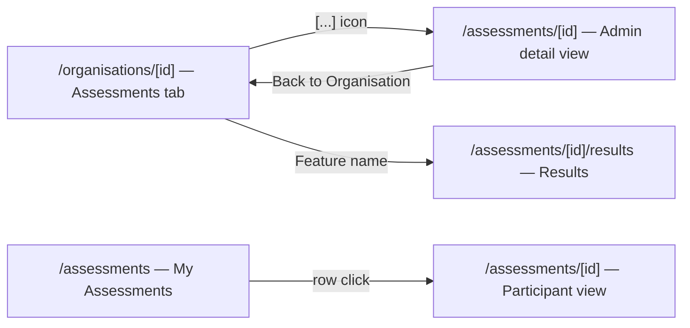

# Assessment Visibility & Repository Management — V8 Requirements

## Document Control

| Field | Value |
|-------|-------|
| Version | 0.4 |
| Status | Draft — Structure |
| Author | LS / Claude |
| Created | 2026-04-26 |
| Last updated | 2026-04-26 (review pass) |

## Change Log

| Version | Date | Author | Changes |
|---------|------|--------|---------|
| 0.1 | 2026-04-26 | LS / Claude | Initial draft from freeform brief |
| 0.2 | 2026-04-26 | LS / Claude | Address review comments: context rewrite, participant status usage, route constraint clarification |
| 0.3 | 2026-04-26 | LS / Claude | Close open questions; split Story 1.1 into API + page stories; reflect single-endpoint decision |
| 0.4 | 2026-04-26 | LS / Claude | Clarify navigation: back link option B; Story 1.3 is link-target fix on org table |
| 0.5 | 2026-04-26 | LS / Claude | Story 1.3 → icons in Actions; Story 1.2 participant context; add Story 1.4 My Assessments description |

---

## Site Map

| Page | Who sees it | Content |
|------|-------------|---------|
| `/organisations/[id]` Assessments tab | Admin | Feature name, Repo, Status, Completion — Actions: 🗑 Delete, `[…]` Details |
| `/assessments/[id]` Admin view | Admin | Name, Description, Repo, PRs, Issues, Participants + status — **new page** |
| `/assessments/[id]` Participant view | Participant | PRs list, Issues list, Answering form |
| `/assessments/[id]/results` | Admin / Participant | Results (existing, unchanged) |
| `/assessments` My Assessments | Participant | Feature name, Description, Status |

---

## Context / Background

Two gaps block routine use of the FCS admin workflow after the V7 frontend polish:

1. **No assessment detail view.** After an admin creates an assessment, there is nowhere to see what was submitted — which repository, which PR/issue numbers, who the participants are, and what their submission status is. The existing `/assessments/[id]` route is the participant answering form; admins who are not listed as participants see "Access Denied". The data is persisted (`fcs_merged_prs`, `fcs_issue_sources`, `assessment_participants`) but there is no page that shows it.

2. **No repository registration UI.** When a new repository is added to the GitHub organisation, an admin needs to register it in FCS before they can create assessments for it. Currently there is no UI path to do this — repositories enter the `repositories` table only via GitHub App installation webhooks (`installation_repositories:added`). If that webhook fires correctly the repo appears automatically, but if it is missed, delayed, or the App was installed before FCS was set up, the repo never appears and there is no recovery path. The existing infrastructure (`organisations.installation_id`, `getInstallationToken()`) supports calling the GitHub API to list accessible repos and registering them on demand.

This requirements doc covers both gaps. It does not touch scoring, rubric generation, or any assessment lifecycle logic.

---

## Glossary

| Term | Definition |
|------|-----------|
| **Assessment detail view** | An admin-only page showing the full metadata of a single FCS assessment: repo, PRs, issues, participants, and status. |
| **Registered repository** | A row in the `repositories` table with `status = 'active'` for a given org. |
| **Installation** | A GitHub App installation, identified by `organisations.installation_id`. Determines which repos the App can access. |
| **Accessible repository** | A repository the GitHub App installation can access, returned by the GitHub API. May or may not be registered in the `repositories` table. |
| **Participant status** | One of `pending`, `submitted`, `removed`, `did_not_participate` — stored in `assessment_participants.status`. Displayed on the assessment detail page (Story 1.1) so admins can track who has and has not submitted. |
---

## Design Principles / Constraints

1. **No new database tables.** All data already exists in `assessments`, `fcs_merged_prs`, `fcs_issue_sources`, `assessment_participants`, and `repositories`. This work is UI + API only.
2. **Admin-only views.** The assessment detail page and repository management UI are accessible only to org admins. Non-admins receive a 403 response.
3. **Installation token is the auth mechanism for GitHub repo listing.** The GitHub API call to list accessible repos must use the installation token via the existing `getInstallationToken()` helper, not a user OAuth token.
4. **Next.js App Router export rule.** Next.js App Router files (`page.tsx`, `layout.tsx`, `route.ts`) must not contain named exports other than the required ones (`default`, `GET`, `POST`, etc.). Adding an arbitrary `export const myHelper = ...` inside these files will cause `next build` to fail with a hard-to-diagnose error. The rule here is: after adding any new page or API route, run `npm run build` to catch this — `tsc` alone does not catch it.
5. **Small PRs.** Each story should be implementable as a single PR < 200 lines.

---

## Roles

| Role | Type | Description |
|------|------|-----------|
| **Org Admin** | Persistent | GitHub `owner` or `admin` role in `user_organisations`. Can create/delete assessments and manage repositories. |
| **Participant** | Contextual | A user listed in `assessment_participants` for a specific assessment. Can answer and view their own results. |

---

## Epic 1: Assessment Detail View [Priority: High]

Addresses the gap where admins cannot see the metadata of an assessment after creation — specifically the linked repository, PRs, issues, participants, and their submission statuses.

The implementation uses the existing `GET /api/assessments/[id]` endpoint, which already resolves `callerRole` (admin vs participant). The endpoint is extended to return richer data for FCS assessments and a full participant list for admin callers. The existing `/assessments/[id]` page is updated to use role-based rendering instead of showing "Access Denied" to admins who are not participants.

**Note on data model:** For FCS assessments, the associated PRs live in `fcs_merged_prs` and issues in `fcs_issue_sources` — not in `assessments.pr_number` (which is PRCC-only). The endpoint currently omits these tables entirely; Story 1.1 adds them.

### Story 1.1: Extend assessment detail API with FCS source data and full participant list

**As an** org admin,
**I want** `GET /api/assessments/[id]` to return the merged PRs, issue sources, and full participant list (with user login and status),
**so that** the detail page has everything it needs to render the complete admin view in a single call.

**Notes:** For FCS type, add `fcs_prs` (from `fcs_merged_prs`) and `fcs_issues` (from `fcs_issue_sources`) to the response for all callers. For admin callers, expand `participants` from `{ total, completed }` to a full array including each participant's `github_login` and `status`. PRCC callers are unaffected — `pr_number` and `pr_head_sha` already cover their case.

*(Acceptance criteria in next pass)*

---

### Story 1.2: Role-based rendering on `/assessments/[id]`

**As an** org admin who is not a participant,
**I want to** open an assessment and see a detail view (repository, PRs/issues, participants and their statuses),
**so that** I can track assessment progress without being blocked by "Access Denied".

**Notes:** The page reads `callerRole` from the API response and renders accordingly — no separate route.

**Admin view:** assessment name, description, repository, linked PRs, linked issues, and participant list with statuses. Inline "← Back to Organisation" link. Future iteration will add participation history — leave space but do not implement now.

**Participant view:** linked PRs and issues shown above the answering form so the participant knows what to review. The form itself is unchanged.

*(Acceptance criteria in next pass)*

---

### Story 1.3: Actions column icons on org page assessment table

**As an** org admin,
**I want** the Actions column to show a delete icon and a `[…]` details icon instead of a text "Delete" link,
**so that** I can reach the assessment detail view in one click and the actions column is extensible for future actions.

**Notes:** Replace the text "Delete" button in `assessment-overview-table.tsx` with two icon buttons: 🗑️ (delete, same behaviour as current) and `[…]` (navigates to `/assessments/[id]`). The feature name link to `/assessments/[id]/results` stays unchanged. The `[…]` icon is designed to grow into a dropdown (history, export, etc.) in a future iteration — for now it is a direct navigation link.

*(Acceptance criteria in next pass)*

---

### Story 1.4: My Assessments list shows description

**As a** participant,
**I want to** see the assessment description alongside the feature name in my assessments list,
**so that** I can identify what each assessment is about before opening it.

**Notes:** The `/assessments` page currently shows only `feature_name`. Add `description` below the name where present. Description is already a field on the `assessments` table and returned by the existing API; no schema or API change required.

*(Acceptance criteria in next pass)*

---

## Epic 2: Repository Management [Priority: High]

Addresses the gap where an org admin cannot register repositories through the UI. Repos currently enter the system only via GitHub App webhooks; if a webhook was missed, the repo is unavailable for assessment creation.

### Story 2.1: Repository list

**As an** org admin,
**I want to** see which repositories are registered for my organisation,
**so that** I know what's available for creating assessments and can identify gaps.

*(Acceptance criteria in next pass)*

---

### Story 2.2: Add repository from GitHub installation

**As an** org admin,
**I want to** register a repository that the GitHub App has access to but is not yet in the system,
**so that** I can create assessments for it without waiting for a webhook.

*(Acceptance criteria in next pass)*

---

## Cross-Cutting Concerns

### Security

- The assessment detail page must enforce org admin check server-side (same pattern as `/organisation` page: query `user_organisations`, check `github_role`).
- The repository list and add endpoints must enforce org admin check. Non-admins must receive 403.
- The GitHub installation token used to list accessible repos must never be returned to the client. All GitHub API calls happen server-side in API routes or server components.

### Performance

- The repository list page may call the GitHub API to enumerate accessible repos on each load. This call should be made server-side and is acceptable to be slow (< 3 s) given infrequent access. No caching requirement for MVP.

---

## What We Are NOT Building

- Removing repositories from the UI — repos are deactivated only via the GitHub App uninstall webhook, not manually.
- Editing assessment metadata (feature name, participants, PRs) after creation — assessments are immutable post-creation.
- A participant detail view showing individual answers — results pages already exist and are out of this scope.
- Pagination for the repository list — the expected number of repos per org is small (< 100).

---

## Open Questions

No open questions — both were resolved during structure review.

| # | Question | Resolution |
|---|----------|------------|
| 1 | Where should the repository list live? | **Fourth tab on the org page**, consistent with existing Assessments / Context / Retrieval tabs. |
| 2 | New detail route vs role-based rendering on existing `/assessments/[id]`? | **Role-based rendering on the existing route.** Even participants benefit from seeing the source PRs/issues; the endpoint is extended for all callers and the page conditionally renders the admin detail vs answering form based on `callerRole`. |

---

## Cross-Reference

**Source brief:** "After I created assessment I cannot see details - repo, issues or PRs associated with it. There is no way to add new repository from the UI for an org."

| Brief item | Epic / Story |
|-----------|-------------|
| Cannot see details after assessment creation | Epic 1 — Stories 1.1 (API), 1.2 (page), 1.3 (actions icons), 1.4 (My Assessments description) |
| No way to add repository from UI | Epic 2 — Stories 2.1 (list), 2.2 (add) |

All five stories map directly to the brief. Story 1.1 was added to cover the API extension separately from the page change (small-PR discipline). No discovery doc exists; scope is fully defined by the brief and code audit.

---

## Next Steps

1. Human reviews epics and story structure — confirm scope, priority, and Open Questions.
2. After Gate 1 approval, write acceptance criteria (Step 4).
3. Run `/architect docs/requirements/v8-requirements.md` to produce LLDs and tasks.
