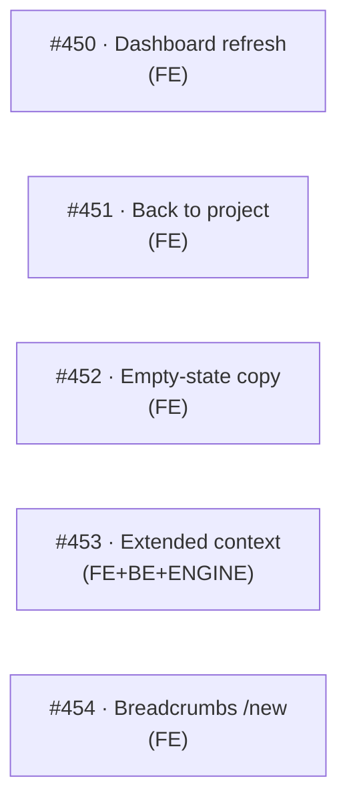

# 2026-05-03 — /architect rev 1.3 sweep across V11 LLDs

## Goal

Compare v11-requirements.md rev 1.3 against rev 1.2 and reconcile every V11 LLD with the changes. The user invoked `/architect` in revision mode to drive this sweep.

## Context

v11-requirements rev 1.3 (commit `8ca37b2`) addressed user-testing feedback after #440/#441. Three implementation bugs were filed and closed separately (#444 polling, #445 stale "Back to Organisation" link, #446 missing /results breadcrumbs). The remaining changes are requirements deltas that need LLD work.

Previous shipped revision: rev 1.2 (commit `cbd0667`).

## Scope

Six story-level changes to reconcile:

| Story | Change | Status before |
|-------|--------|---------------|
| 1.3 | Settings affordance must be header-area icon-and-label | Faint inline link |
| 1.6 (NEW) | "Back to project" link on settings page | Did not exist |
| 2.1 | Auto-polling on post-create detail page | Already shipped (#444) |
| 2.2 | Actions column parity with org list | Bare `AssessmentOverviewTable` |
| 2.3 | Strict participant scope + empty-state copy | Generic "No pending assessments" |
| 3.1 | Extend project context with vocab/focus/exclusions | Form has globs + notes + count only |
| 4.3 | Breadcrumbs on every project-scoped admin URL | `/results` + `/submitted` shipped (#446); `/new` missing |

Plus **Design Principle 8** (single shared admin detail view) — already met by #441 implementation.

## Decisions

1. **Bundled Story 1.3 + Story 2.2 into one issue (#450).** Both edit `src/app/(authenticated)/projects/[id]/page.tsx`. Combined diff stays under the 200-line PR cap; splitting would force sequential waves anyway.
2. **Story 3.1 extracts shared components.** `TagInput` and `VocabRow` move from `org-context-form.tsx` into `src/components/context/` so both forms share one source. Behaviour-preserving move; not a feature refactor.
3. **No SQL migration for Story 3.1.** `OrganisationContextSchema` already declares all four shared fields and `patch_project` RPC's `jsonb || EXCLUDED.context` merge handles new keys without alteration.
4. **No engine change for Story 3.1 AC 8.** The rubric prompt builder already reads vocabulary/focus/exclusions/notes from `OrganisationContext`. Only the form/API/service path needs wiring; engine gets a verification spec only.
5. **Story 4.3 covers only `/assessments/new`.** `/results` and `/submitted` shipped under #446; the new-assessment page is the only remaining gap.
6. **Status flips on manifests:**
   - E11.2 `REQ-...-project-scoped-assessment-list`: `Implemented` → `Revised` (Story 2.2 amends)
   - E11.3 `REQ-...-configure-project-context-and-settings`: `Implemented` → `Revised` (Story 3.1 amends)
   - All others stay `Revised` with comment updates.

## Artefacts produced

### LLD §Pending changes — Rev 2 sections (4 LLDs)

- [`docs/design/lld-v11-e11-1-project-management.md`](../design/lld-v11-e11-1-project-management.md#pending-changes-rev-2) — Stories 1.3, 1.6
- [`docs/design/lld-v11-e11-2-fcs-scoped-to-projects.md`](../design/lld-v11-e11-2-fcs-scoped-to-projects.md#pending-changes-rev-2) — Stories 2.1 (already shipped note), 2.2, 2.3, DP 8 note
- [`docs/design/lld-v11-e11-3-project-context-config.md`](../design/lld-v11-e11-3-project-context-config.md#pending-changes-rev-2) — Story 3.1
- [`docs/design/lld-v11-e11-4-navigation-routing.md`](../design/lld-v11-e11-4-navigation-routing.md#pending-changes-rev-2) — Story 4.3 (`/assessments/new` only)

### Manifest updates

- `coverage-v11-e11-1.yaml` — added `REQ-project-management-back-to-project-from-settings` (Approved); rev 1.3 comment on `REQ-project-management-view-project-dashboard`
- `coverage-v11-e11-2.yaml` — flipped `project-scoped-assessment-list` to Revised; comments on create-fcs-assessment, my-pending-assessments
- `coverage-v11-e11-3.yaml` — flipped `configure-project-context-and-settings` to Revised
- `coverage-v11-e11-4.yaml` — extended `breadcrumbs` files list with #446 additions; comment for new-assessment gap

### Issues created

| # | Title | Stories |
|---|-------|---------|
| [#450](https://github.com/mironyx/feature-comprehension-score/issues/450) | feat: project dashboard — header Settings affordance + actions column parity | 1.3 + 2.2 (bundled) |
| [#451](https://github.com/mironyx/feature-comprehension-score/issues/451) | feat: 'Back to project' link on project settings page | 1.6 (NEW) |
| [#452](https://github.com/mironyx/feature-comprehension-score/issues/452) | feat: /assessments empty state communicates participant-only scope | 2.3 |
| [#453](https://github.com/mironyx/feature-comprehension-score/issues/453) | feat: extend project context with vocabulary, focus areas, exclusions | 3.1 |
| [#454](https://github.com/mironyx/feature-comprehension-score/issues/454) | feat: breadcrumbs on /projects/[id]/assessments/new | 4.3 (partial) |

All five issues added to the project board with `kind:task` + `L5-implementation` labels.

## Execution waves

All five issues are parallelisable — no shared files. Single wave.

## Commits

- `6ef0a87` — E11.1 LLD Rev 2 (#450 + #451)
- `d027a6e` — E11.2 LLD Rev 2 (#444 already shipped, #450 bundle, #452, DP 8)
- `a156f12` — E11.3 LLD Rev 2 (#453)
- `44080d7` — E11.4 LLD Rev 2 (#454)

## Open questions

None outstanding. Issues #450–#454 are ready for `/feature` or `/feature-team` parallel implementation.

## Suggested next step

Human reviews the four LLD Rev 2 sections and the five new issues. Then `/feature-team` (or sequential `/feature` cycles) implements the wave. Recommend starting with #453 (largest) to surface any contract surprises early; the other four are small and can run in parallel behind it or alongside.
